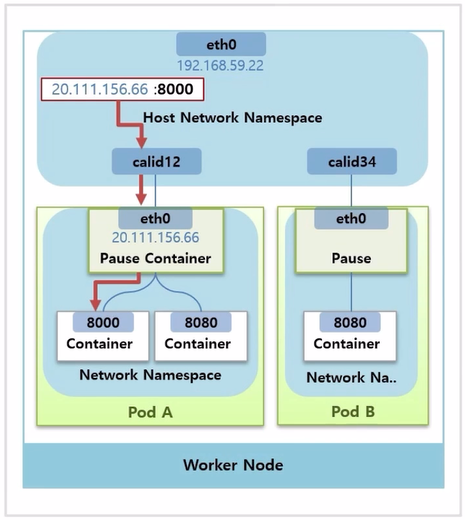
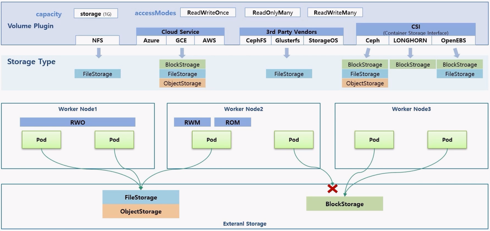
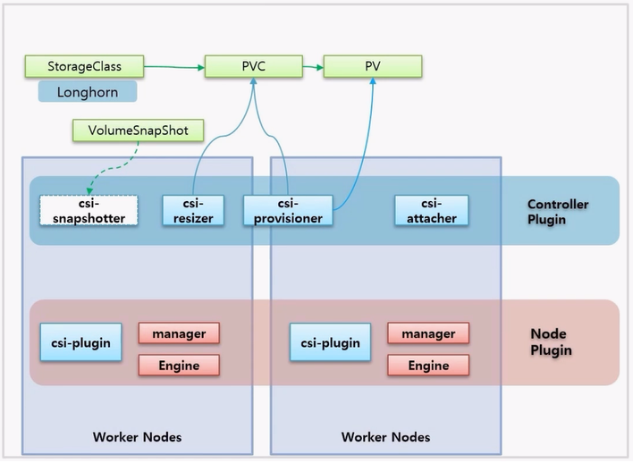
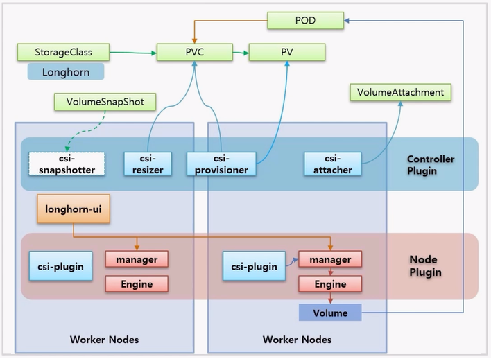
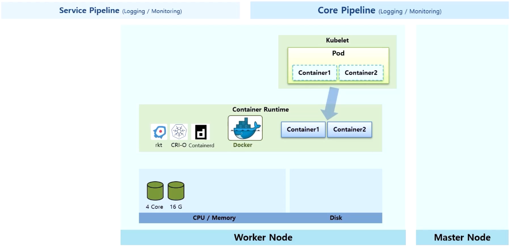
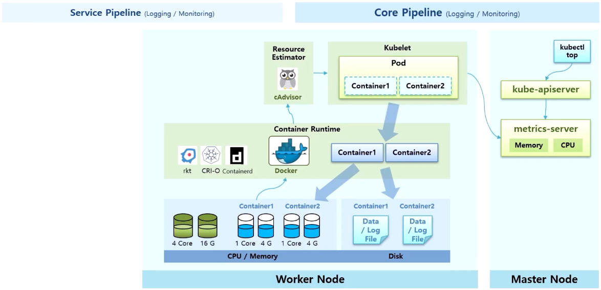

# 아키택쳐 - 중급

# 아키택쳐 - 중급

* toc
{:toc}

## Kubernetes Architecture 개요
+ 전체적인 범위는 Components, Networking, Storage 그리고 Logging 이다.
+ 
  + k8s 는 하나의 Master 와 다수의 Worker Node 들로 구성 된다.
+ 
  + Master 에는 Control plane Component 라고 하는 k8s 주요 기능들을 담당하는 Component 들이 있고, 각 Worker Node 에는 Worker Component 라고 하는 Container 를 관리하기 위한 기능들이 있다.
+ 
  + k8s 에는 크게 Service 와 Pod 에 대한 Network 영역이 있다. 
  + Pod Network 에서 Pod 내의 Container 간 통신에 대해 알아본다. 그리고 Pod 간 통신인데 현재 강의 실습에서는 Calico 플러그인을 설치 했기 때문에 이 플러그인을 사용해서 어떻게 통신 하는지 알아 본다.
  + 그리고 Service 를 Pod 에 연결 했을 때, Service 를 통해 Pod 와 통신할 수 있다. 이 부분이 Service Network 에 대한 부분이고 k8s 를 설치할 때, 설정 모드에 따라 내부적으로 어떻게 동작 하는지에 대해서도 알아 본다.
+ 
  + Storage 는 Pod 에서 데이터를 안정적으로 저장하는 방법에 대한 내용으로 그 방법에는 hostPath 를 사용하는 방법, 외부 Cloud Service 에서 제공하는 Storage 를 사용하는 방법, 그리고 Cluster 내부에 3rd party 에서 제공하는 Storage Solution 을 설치하는 방법에 대해 알아 본다.
  + 그리고 어떤 방식의 Storage 를 사용하더라도 Volume Type 에는 FileStorage, BlockStorage, ObjectStorage 등 크게 세 가지 종류가 있다. k8s 에서는 이런 type 들에 대한 특징을 잘 알고 사용해야 한다.
+ 
  + Logging 은 k8s 내에 동작중인 Application 에서 출력되는 log 들을 어떻게 관리하느냐에 대한 부분이다. 크게 Service Pipeline 과 Core Pipeline 이 있다. Core Pipeline 에서는 Pod 에서 생성 된 Log 가 어떤 구조로 쌓이는지 그리고 쌓인 로그를 어떻게 보는지에 대해 알아본다.
  + Service Pipeline 은 별도의 플러그인을 설치하면 Monitoring 에 대한 Pod 들이 생기고, 이 Pod 들이 각 Node 에서 Log 를 가져다 수집 서버에 모으고 이것을 ui 를 통해 사용자에게 보여 준다.

## Component - kube-apiserver, etcd, kube-schedule, kube-proxy, kube-controller-manager
+ Pod 가 생성되는 과정을 통해 각 Component 들이 어떤 역할을 하는지 살펴 본다.
+ 
  + Master Node 에는 Etcd, kube-scheduler, kube-apiserver 가 있다. 일반적인 설치를 했을 때 이 Component 들은 Pod 형태로 띄워져서 구동 된다.
+ 
  + Master Node 에 /etc/kubernetes/manifests 디렉토리를 보면 Component 생성에 대한 yaml 파일들이 있는 것을 볼 수 있다. k8s 가 구동시 이 파일들을 읽고 이 Pod 들을 static 으로 띄운다.
+ 
  + Worker Node 들은 k8s 를 설치할 때 같이 설치한 kubelet 과 Container Runtime 인 Docker 가 구동중인 상태이다.
+ 
  + 이 때 사용자가 kubectl 명령으로 Pod 생성 요청을 했다고 하자. 
  + 먼저 Pod 생성 명령은 kube-apiserver 로 전달 된다.
  + kube-apiserver 는 Etcd 에 있는 Pod 에 대한 입력 정보들을 저장 한다. Etcd 는 k8s 에서 다양한 데이터들을 저장하는 DB 역할을 한다.
+ 
  + kube-scheduler 는 수시로 각 Node 의 자원들을 체크하고 있다.
  + 예를 들어 만약 Node2 에 Container 가 구동중이어서 자원이 사용되고 있다는 것을 알고 있다.
  + 추가로 Watch 라는 기능으로 kube-apiserver 를 통해 Etcd 에 Pod 생성 요청이 들어온 것이 있는지 감시하고 있다.
  + Pod 생성 요청이 있는 것을 발견하면 현재 Node 자원 상태를 확인하고 Pod 가 어느 Node 에 배치되는 것이 좋은지 판단해서 Pod 에 Node 정보를 설정한다.
+ 
  + 각 Node 에 있는 kubelet 들도 kube-apiserver 에 Watch 가 걸려 있고 Pod 에 자신의 Node 정보가 있는지 체크하고 있다가 자신의 Node 정보가 있는 Pod 를 발견하면, 이 정보를 가지고 Pod 를 만들기 시작 한다. 
  + kubelet 이 Pod 를 만들 때 크게 두 가지 일을 한다. 먼저 Docker 에게 Container 를 만들라고 요청하면 Docker 가 바로 Container 를 만들어 준다.
+ 
  + 추가로 /etc/kubernetes/manifests 디렉토리 안에 kube-proxy Controller 를 만드는 kube-proxy.yaml 파일이 있고, 이 yaml 파일은 DaemonSet 이라서 모든 Node 에 kube-proxy Pod 가 생성 되어 있다.
  + 이 상태에서 kubelet 은 kube-proxy 에게 Network 생성 요청을 하고 kube-proxy 가 새로 생성 된 Container 에 통신이 되도록 도와 준다.
+ 
  + Deployment 를 생성하는 과정을 통해 Component 들의 역할을 알아 본다.
  + 다른 Component 들과 마찬가지로 /etc/kubernentes/manifests 디렉토리 안에 kube-controller-manager.yaml 파일이 있어서 Controller Manager Pod 가 띄워져 있다. 그리고 이 안에 여러 Cotroller 들에 대한 기능들이 Thread 형태로 동작 중이다.
+ 
  + 이 상태에서 사용자가 kubectl create 명령으로 Deployment 에 replicas 2 를 설정해서 생성했다고 하자. 
  + 그럼 이 명령은 kube-apiserver 로 전달 되고 Etcd DB 에 정보가 저장 된다.
+ 
  + 한편 Controller Manager 에 있는 Deployment Thread 는 kube-apiserver 에게 Deployment 관련 정보가 수신 되면 알려달라는 Watch 가 걸려있는 상태이다.
  + 그리고 Deployment 가 들어왔기 때문에 Deployment Thread 가 이 내용을 읽고 ReplicaSet 을 만들라고 요청 한다.
+ 
  + 그리고 나면 ReplicaSet 이 관련된 오브젝트가 있는지 Watch 를 걸어둔 상태라 이것을 감지해서 ReplicaSet 안에 Replicas 가 몇 개가 있는지 확인한 다음에 그만큼 Pod 를 만들어 달라고 요청 한다.
+ 
  + 이 상황에서 kube-scheduler 는 Node 가 할당 되지 않은 Pod 를 감지하고, 현재 Node 들의 자원을 고려해서 Pod 들에게 Scheduling 된 Node 를 할당 해준다.
+ 
  + 그리고 각 Node 에 있는 kubelet 은 자신에게 할당 된 Pod 들을 감지하고 Pod 안의 Container 내용을 Docker 에게 생성 하게 한다.
  + 그럼 Docker 가 Container 를 만들고 kubelet 이 kube-proxy 를 통해 네트워크를 연결 해준다.

## Networking - Pod / Service Network (Calico), Pause Container
+ k8s 가 네트워크를 다루는 전반적인 흐름에 대한 아키택처를 중심으로 정리 한다.
+ 
  + k8s 를 이루는 Master 와 Worker Node 들이 있고, Pod Network 에 대한 영역이 있다. Cluster 를 설치할 때 pod-network-cidr 로 이 네트워크 대역에 대한 설정을 한 부분이다.
+ 
  + Pod 네트워크 첫 번째는 Pod 안에 있는 Container 간의 통신에 대한 부분 이다. 
  + 크 범위 내에서 고유 ip 를 가지고 있는 인터페이스가 생긴다. 이것을 통해 Container 간 통신이 되는지 알아 본다.
+ 
  + 두 번째는 또 다른 Pod 가 생성 되었을 때, 이 두 Pod 간의 통신에 대한 것으로 k8s 에서 Node 마다 설치 하는 Network Plugin 을 통해서 이루어 진다.
+ 
  + k8s 에서 기본적으로 제공하는 kubenet 이라는 Network Plugin 이 있는데, 네트워크 기능이 많이 제한적이기 때문에 잘 사용하지 않는다.
  + 대신 CNI 라고 하는 Container Network Interface 를 통해 다양한 오픈 소스 Network Plugin 들을 설치할 수 있다.
+ 
  + Network Plugin 마다 네트워크를 제공하는 방법과 기능이 상이하기 때문에 스펙을 잘 알고 사용해야 한다.
  + 본 내용은 대부분의 기능을 지원하는 Calico Network Plugin 을 사용 한다.
  + 만약 GCP, AWS, Azure 등 Cloud 서비스 환경을 사용 한다면 같은 Calico Network Plugin 을 사용한다 하더라도 강의의 실습 환경과는 다르게 동작할 수 있다.
+ 
  + Network Plugin 의 역할은 같은 Node 간의 통신과 외부 네트워크를 통한 타 Node 위에 있는 Pod 간 통신을 담당 한다.
+ 
  + 네트워크 아키택처의 두 번째 내용은 Service Network 에 대한 것이다. 
  + 이것은 k8s 를 설치할 때 별도 옵션을 주지 않아 default 값으로 ip 대역이 설정 되어 있다. 
  + Pod 에 Service 를 연결하면, Service 도 고유 ip 가 만들어지고 동시에 kube-dns 에는 Service 의 이름과 ip 에 대한 도메인이 등록 된다.
  + api-server 가 Worker Node 마다 Pod 형태로 띄워져 있는 kube-proxy 에 Service 의 ip 가 어느 ip 에 연결 되어 있는지에 대한 정보를 보내 준다.
  + 여기서 Service ip 를 Pod ip 로 바꾸는 NAT 기능이 필요한데, kube-proxy 가 iptables 나 IPVS 를 어떻게 사용 하냐에 따라 작동 방식이 나뉜다.
  + 작동 방식은 Proxy-Mode 라고 하고, user space, iptables, ipvs 등 크게 세 가지 방식으로 구분 한다.
+ 
  + 이렇게 구성 된 상태에서 Pod 가 Service 이름을 호출하면 kube-dns 를 통해 ip 를 알아내고, 얻어낸 Service 의 ip 를 NAT 영역으로 호출 한다.
  + 여기에 Service 에 대한 Pod 매핑 정보가 있기 때문에 Network Plugin 을 통해 트래픽을 해당 Pod 로 보낼 수 있게 된다.
  + 즉 Service 네트워크는 NAT 영역 내의 설정이고 Service 를 삭제 하면 api-server 가 이것을 감지하고 kube-proxy 에게 설정을 삭제 하도록 한다.

### Pause Container → Pod Network 담당
+ 
  + Pod 를 만들면 직접 생성한 Container 도 있지만, Pause Container 라고 해서 네트워킹을 담당하는 Container 가 자동으로 생긴다.
  + 이 Container 에 인터페이스가 정의되어 있고, ip 도 할당 된다. 
  + k8s 는 이 Pause Container 에 Network Namespace 를 Pod 내의 모든 Container 가 같이 사용 하도록 구성 해준다. 그래서 할당 받은 ip 에 대한 네트워크를 같이 공유하고 Container 구분은 포트를 통해 하게 된다.
+ 
  + Worker Node 에 Host Network Namespace 와 Host ip 인터페이스가 있다.
  + Pause Container 가 생기면 Host Network Namespace 에 가상 인터페이스가 하나 생기면서 Pause Container 의 인터페이스와 연결 된다.
  + Pod 를 만들 때마다 가상 인터페이스가 생겨서 1:1로 매칭 된다.
+ 
  + Worker Node 에서 20.111.156.66:8000 으로 요청을 보내면 위와 같이 트래픽이 전달 된다. 
  + 이렇게 외부에서 Pod 로 들어오는 트래픽을 받는 것과 특정 Container 로 트래픽을 전달하는 것은 Pause Container 가 리눅스에 Network Namespace 를 별도로 생성해서 가상의 인터페이스를 만들고, 관련된 Container 들에게 공유하고 있기 때문에 가능한 것이다.

### Network Plugin (kubenet, cni) → Cluster Network 담당
+ 먼저 CNI 를 설치 하지 않고, k8s 기본 네트워크인 kubenet 을 사용했을 경우 구성에 대한 내용이다. 잘 사용하지는 않지만 기본적인 네트워크 구성 이해에 도움이 된다.
+ 
  + Pod 를 생성하면 새로운 네트워크 인터페이스를 만드는데, Pod 의 인터페이스와 Host Network 의 가상인터페이스가 연결 된다.
+ 
  + 여기서 kubenet 의 역할은 이 가상 네트워크를 cbr0 이라는 Container Bridge 에 포함 시켜 준다.
  + Bridge 네트워크의 대역은 Pod 네트워크 대역을 참고해서 이것보다 낮은 단계의 대역으로 설정 된다.
  + Bridge 내에서 생성 되는 Pod 의 ip 는 Bridge 의 CIDR 범위 내에서 만들어 진다.
  + Bridge 에 설정 된 CIDR 을 보면, 20.96.1.0 ~ 20.96.1.255 까지 Pod ip 를 할당할 수 있다고 보면 된다.
  + 하나의 Node 위에는 이 개수 이상의 Pod 는 생성되지 않는다. 이 부분이 kubenet 의 단점 중 하나이다.
+ 
  + Network Plugin 에 Router 기능도 있다. 이것은 NAT 를 통해 제공 되며, ip 가 Pod 의 ip 대역이면 해당 트래픽을 Bridge 쪽으로 내려주고 그 외의 ip 에 대해서는 위로 되돌려 보낸다. 
  + 여기까지가 Network Plugin 이 담당하는 네트워크의 기본 구조라고 생각하면 된다.
+ 
  + Calico CNI 를 사용 할 경우, Host Network 에 생성 된 가상 인터페이스가 Router 에 바로 연결 된 구조를 가진다. 
  + 그렇게 때문에 두 Pod 간 통신은 이 Router 가 담당 해준다.
  + 여기에 CIDR 은 kubenet 보다 더 넓은 범위를 가지고 있어서 하나의 Node 에서 Pod 에게 더 많은 ip 를 할당할 수 있다.
  + Calico Plugin 에서 제공하는 보안 요소가 많은데 방화벽 과 같은 것들이 있다.
+ 
  + Router 윗단에는 Overlay 네트워크를 지원해주는 계층이 있다. 그 종류에는 IPIP 방식과 VXLAN 방식이 있고, Overlay 네트워크가 하는 일은 Node 안에 있는 Pod 가 다른 Node 의 Pod 와 통신할 수 있도록 해주는 것이다.
  + Calico Plugin 을 사용했을 때, 각 Worker Node 의 Pod 들이 어떻게 통신 되는지 살펴 본다.
+ 
  + Pod D 에서 Pod B 로 트래픽을 전송 한다고 했을 때, Pod D 에서는 Pod B 의 ip 인 20.111.156.7 로 호출 한다.
  + Router 의 가상 인터페이스를 지나는데, 이 ip 는 Worker Node2 의 Router 에 정보가 없기 때문에 Overlay 계층까지 올라 간다.
+ 
  + Calico 는 이 Pod 의 ip 대역이 어느 Node 에 있는지 알고 있기 때문에, 패킷에 실제 Pod 의 ip 를 해당 Node 의 ip 로 감싼다.
+ 
  + 이 트래픽은 192.168.59.22 ip 를 갖는 Host 인터페이스로 전달 된다.
  + Worker Node1 로 들어온 트래픽은 Overlay 계층에서 내부에 있는 Pod 의 IP 로 변환 된다. 리고 이 ip 대역이 있는 Router 로 트래픽이 전달 되고 Router 안에서 ip 와 일치하는 가상 인터페이스를 지나 Pod B 에 도착하게 된다.

### Service Network / Proxy Mode
+ k8s 가 제공하는 Service Network 의 Proxy Mode 에는 세 가지 종류가 있다. 각 모드에 대해 알아보기 위한 전제 상황을 먼저 설명 한다.
+ 
  + Pod 를 만들고 Service 를 연결 하는데, Pod 가 정상 구동 된 상태라면, 중간에 EndPoint 오브젝트가 만들어져 실제 연결 상태를 담당 한다.
  + Service 의 ip 는 Service Network CIDR 범위 내에서 생성 된다.
  + 이 때 api-server 는 EndPoint 를 감시하고 있다가 모든 Node 위에 DaemonSet 으로 설치 되어 있는 kube-proxy 에게 이 Service 의 ip 가 Pod 의 ip 로 포워딩 된다는 정보를 준다.
+ 
  + Userspace 모드는 리눅스 Worker Node 에 기본적으로 설치 되어 있는 iptables 에 Service CIDR 로 들어오는 트래픽은 모두 kube-proxy 에게 전달 하도록 설정 되어 있다. 그래서 만약 Pod 에서 Service ip 를 호출 할 경우 이 트래픽은 iptables 를 지나 kube-proxy 로 전달 된다.
  + kube-proxy 는 자신이 가지고 있는 매핑 정보를 참고해서 이 트래픽을 Pod ip 로 바꿔 준다. 이렇게 Pod ip 로 바뀐 트래픽은 Pod Network 통신 영역으로 전달 되어 목적 Pod 로 트래픽이 전달 된다.
  + 이 방법의 단점은 모든 트래픽이 kube-proxy 를 지나는 구조인데, 이 모든 트래픽을 감당하기에는 kube-proxy 자체의 성능이나 안정성이 좋지 않다. 그래서 많이 사용하는 방식은 아니다.
+ 
  + iptables 모드는 kube-proxy 가 ip 매핑 정보를 iptables 에 직접 등록하는 방식으로 Pod 에서 보내는 Service ip 는 iptables 에서 직접 Pod ip 로 변환 된다. 
  + 이 방식이 k8s 를 설치 했을 때 기본 모드이기도 하고 성능이나 안정성이 훨씬 좋다.
+ 
  + 리눅스 에서는 IPVS 라는 L4 Loadbalance 라는 것을 제공 한다. 
  + Service Mode 를 IPVS 로 설정 하면, IPVS 가 iptables 와 같은 역할을 해준다. 
  + 성능 테스트 결과를 보면 낮은 트래픽 에서는 둘의 네트워크 성능은 비슷하지만 부하가 커질수록 IPVS 의 성능이 더 좋다.

### Service network / Service Type (ClusterIp)
+ Service 를 만들 때 ClusterIP 나 NodeIp 타입에 따라 트래픽 흐름이 달라진다.
+ 
  + Calico 의 Pod Network 구조.
+ 
  + Router 부분에서 Service ip 를 Pod ip 로 변환 해주는 NAT 역할을 하는 기능이 있다.
+ 
  + Pod D 에서 Pod B 로 트래픽을 전송 한다고 했을 때, Pod B 에 ClusterIP 타입의 Service 를 연결 한다.
  + Pod D 에서 Service ip 로 트래픽을 전송하면, NAT 에서 해당 Service ip 와 매칭하는 Pod ip 로 변환 된다. 
  + 다음부터는 Overlay 계층에서 ip 가 감싸지고, 앞서 본 Pod Network 단의 통신을 하게 된다.
  + 이것이 Calico 에서 ClusterIP 에 대한 트래픽 흐름 이다.
+ 
  + Pod 에 ClusterIP 타입이 아닌 NodePort 타입의 Service 를 연결하면, 모든 Node 에 있는 kube-proxy 가 자신의 Node 에 30,000 번대 포트를 열어준다. 
  + 외부에서 이 Host ip 의 포트로 트래픽이 들어오면, iptables 에서 이 트래픽을 Calico Network Plugin 으로 보내 준다.
+ 
  + 이후 부터는 ClusterIP 와 같이 NAT 기능을 통해 해당 ip 로 변환 되면서 Pod Network 영역으로 들어가게 된다.

### 실습
+ [https://kubetm.github.io/k8s/09-intermediate-architecture/networking/](https://kubetm.github.io/k8s/09-intermediate-architecture/networking/)

## Storage - NFS(FileStorage), Longhorn(BlockStorage)
+ PV 를 만드는 방법은 여러가지가 있다.
+ 
  + 일반적인 방법으로는 PV 를 만들고 PVC 를 바로 연결하는 방법이다.
+ 
  + 다른 방법은 StorageClass 를 Grouping 목적으로 사용하는 방법인데, StorageClass 를 Group 의 개념 처럼 만들고, PV 를 만들 때 소속 그룹을 정해 준다.
  + 그리고 PVC 를 만들 때 StorageClass 를 지정하면 PVC 는 해당 그룹에 속한 PV 들 중에 자신의 스펙에 맞는 PV 와 연결 된다.
+ 
  + 마지막으로 StorageClass 를 통해 동적으로 PV 를 만드는 방법 이다. 
  + 이 방법은 사전에 StorageClass 를 만들 때 Provisioner 를 지정 해야 한다. 그리고 PVC 를 만들 때 해당 StorageClass 를 지정하면 Provisioner 가 PV 를 만들어 주면서 PVC 는 PV 에 연결 된다.
+ 
  + PV 는 기본 속성 중에 capacity 라는 용량을 설정하는 부분과 accessMode 를 지정하는 부분이 있고, Volume Plugin 이라고 해서 PV 의 실체를 결정하는 옵션이 있다.
+ 
  + Volume Plugin 의 종류에는 대표적으로 hostpath 가 있는데, PV 를 hostpath 로 만들면 Worker Node 에 지정된 path 를 PV 에 대한 Volume 으로 한다는 것을 의미 한다.
+ 
  + 만약 외부 Storage 에 NFS 서버가 구성 되어 있을 경우 PV 의 Volume Plugin 을 NFS 로 지정 할 수 있다. 이렇게 할 경우 외부 NFS 서버와 연결할 수 있는 NFS 클라이언트의 역할을 하게 된다.
  + k8s 가 OS 에 설치 되어 있는 NFS 클라이언트 기능을 이용해서 가능하도록 해준다. 만약 OS 에 NFS 클라이언트가 설치되어 있지 않다면, 이 기능은 동작하지 않는다.
+ 
  + Cloud Service 의 Volume 에 연결하고 싶으면 해당 서비스에 맞는 Volume 플러그인 들이 있다.
  + Cloud Service 뿐만 아니라 자사 내부 Volume Solution 을 가지고 있다면 PV 를 통해 바로 연결 할 수도 있다. 
  + 각 서비스 플랫폼이나 솔루션 업체들이 자신들의 Volume 과 연결 가능한 플러그인들을 k8s 오픈소스에 기여했기 때문에 바로 연결하는 것이 가능한 것이다.
+ 
  + k8s 문서를 보면 바로 사용 가능한 Volume 플러그인 목록들이 있다.
+ 
  + Volume 플러그인 뿐만 아니라 Provisioner 도 같이 추가한 것들은 StorageClass 를 통해 Dynamic Provisioning 이 가능하다. 이것도 k8s 문서를 보면 플러그인 별로 내부 Provisioner 가능 여부를 확인할 수 있다.
+ 
  + 마지막으로 CSI 라는 Container Storage Interface 가 있다. 
  + 만약 미리 자신의 Volume Solution 에 대한 플러그인 들을 k8s 에 반영하지 않았다던가, 반영 했더라도 Volume 의 최신 버전이 배포 되었을 때, 그 버전을 지원할 수 있는 Volume 플러그인을 바로 적용 하기 위해 CSI 를 사용 할 수 있다.
  + k8s 문서 중 CSI 를 만드는 방법에 대한 가이드가 있고 기업은 그 가이드에 따라 CSI 플로그인이나 Provisioner 를 만들고 설치 방법만 사용자에게 안내하면, 필요한 경우 자신의 Cluster 에 반영 할 수 있다.
  + 뿐만 아니라 Volume Soultion 자체도 기존 Volume 시스템과 연결하는 구조가 아닌 새롭게 Container 로 Volume 시스템 자체를 띄울 수 있도록 한 기업도 많이 있다.
  + 통째로 csi-plugin 과 해당 Volume Solution 을 한 번에 설치할 수 있게 해두면 사용자 입장에서는 간단하게 Volume Solution 을 적용 하고 k8s 의 PC, PVC 를 통해 쉽게 사용 할 수 있게 된다.
+ 
  + 각 Volume 마다 Storage Type 이 있다. NFS 는 전형적인 FileStorage 이고 Cloud Service 는 다양한 Volume Solution 들이 있기 때문에 대부분 BlockStorage, FileStorage 그리고 ObjectStorage 모두 지원 한다.
  + 현재 k8s 에 설치된 플러그인으로 3rd Party Vendor 들은 대부분 FileStorage 를 지원하고 있다. (아닌 것들도 있다.)
  + CSI 는 같은 Ceph 솔루션 이라고 하더라도 새롭게 Container 베이스로 Volume 솔루션을 설치 할 경우 모든 Storage 타입이 지원 가능하다. 다른 솔루션 들은 각자의 특성에 맞는 Storage 타입을 제공 한다.
  + 그래서 각 Volume 솔루션 마다 어떤 타입의 Storage 인지 기본적으로 알고 있어야 한다. 각 Storage 에서 지원하는 Access Mode 는 가이드를 확인해서 제공하는 기능을 사용해야 한다.
  + 크게 FileStorage, ObjectStorage 와 BlockStorage 는 기술적으로 다른 부분이 있다.
+ 
  + FileStorage 와 ObjectStorage 는 RWO 를 지원하기 때문에 하나의 Node 위에 다수의 Pod 에서 연결 가능하다. RWM 과 ROM 도 지원 가능하기 때문에 다른 Node 에 있는 다른 Pod 들 에서도 연결 가능하다.
+ 
  + BlockStorage 는 기술적으로 특정한 Node 의 Storage 를 마운트 하는 개념이기 때문에 하나의 Node 위에 다수의 Pod 와 연결 가능하지만, 다른 Node 위에 있는 Pod 는 연결이 불가능 하다.
  + 예를 들어 Node3 에 있던 Pod 가 Node2 로 옮겨진 경우 기존 Node 와의 연결을 끊고 새 Node 와 연결 되는 것은 가능하지만, 두 Node 와 BlockStorage 가 동시에 연결이 되는 것은 불가능 하다.
  + 그렇기 때문에 BlockStorage 를 사용 한다는 것은 PV 의 Access Mode 를 사용할 때 RWO 옵션만 지원 된다는 것을 의미 한다.
+ 
  + 사용하는 경우를 보면 일반적으로 FileStorage 와 ObjectStorage 는 Pod 가 어느 Node 에 있더라도 연결이 가능해서 공유 데이터 용도로 사용 한다. 그 중 ObjectStorage 는 주로 백업이나 이미지 저장 용도로 사용 한다. 이런 특징을 가지고 있기 때문에 Deployment 에 PVC 를 연결할 때 주로 사용 한다.
  + 반면 BlockStorage 는 주로 DB 데이터용으로 사용 한다. 직업 Node 와 BlockStorage 가 마운트 되었기 때문에 빠른 읽기와 쓰기가 가능하고, StatefulSet 은 Pod 를 만들 때마다 PVC 를 새로 만들기 때문에 BlockStorage 의 특성과 잘 맞다.
  + 대부분의 DB 솔루션들을 보면 BlockStorage 를 사용해서 StatefulSet 으로 배포하는 경우를 자주 볼 수 있다.

### BlockStorage (Longhorn)
+ 실습에서 BlockStorage 인 Longhorn 을 설치 해 볼 것인데, CSI 가 어떤 흐름으로 처리 되는지에 대해서만 알아 본다.
+ 
  + Volume Solution 과 CSI 플러그인을 모두 설치 했을 경우 Node 들 위에 위 이미지에 보이는 것과 같은 Pod 들이 생긴다.
  + 크게 Controller Plugin 과 Node Plugin 으로 나뉜다. Controller Plugin 에 대한 Pod 들은 주로 Deployment 로 만들어 지고, CSI 를 담당하는 주요 기능에 대한 역할을 한다.
  + Node Plugin 은 해당 Pod 들이 DaemonSet 으로 만들어지고, 각 Node 별로 해당 Solution 으로써의 기능이 Volume 을 생성하는 기능을 한다.
  + Volume 이 생성되는 흐름을 보면서 각 기능에 대해 알아 본다.
+ 
  + 먼저 Longhorn 에 대한 StorageClass 가 만들어져 있고, 이것을 사용해서 PVC 를 만들면 csi-provisioner 는 PVC 를 바라보고 있다가 PVC 가 생성됨을 확인하고, 이것에 맞는 PV 를 만들어서 PVC 와 연결 된다.
  + 그리고 csi-resizer 도 PVC 를 모니터링 하고 있는데, PVC 에 대한 Volume 크기가 변하는 것을 보고 있다가 사용자가 Volume 크기를 변경하면 이것을 처리해 주는 역할을 한다.
+ 
  + Longhorn 에는 구현되어 있지 않지만 csi-snapshotter 는 VolumeSnapShot 오브젝트를 통해 Volume 에 대한 스냅샷을 찍는다.
+ 
  + 다시 돌아와서 PV 가 만들어져 있으면, 특정 Node 에 있는 csi-plugin 은 해당 Node 에 있는 Volume 솔루션 manager 를 통해 Volume 을 생성 하라고 하고, 이 요청은 Engine 을 저쳐서 Engine 이 결국 Volume 을 만든다.
+ 
  + Pod 를 PVC 에 연결 하면 VolumeAttachment 오브젝트가 생기고, VolumeAttachment 를 감시하고 있던 csi-attacher 가 Volume 과 Pod 를 연결 해준다.
+ 
  + 솔루션 자체적으로 longhorn-ui 가 있는데, 이것은 manager 와 직접 통신하고 있기 때문에 ui 를 통해 Volume 에 대한 모니터링과 제어가 가능하다.
+ 
  + 마지막으로 솔류션 자체적으로 해당 Node 에 별도로 설치해야 하는 패키지가 있으면 설치해 줘야 한다.

### 실습
+ [https://kubetm.github.io/k8s/09-intermediate-architecture/storage/](https://kubetm.github.io/k8s/09-intermediate-architecture/storage/)

## Logging - PLG Stack
+ k8s 아키택처에서 말하는 logging 은 Application 의 로그 데이터를 말하고 monitoring 은 cpu 나 memory 와 같은 자원을 얘기 한다.
+ 이런 기능들에 대해 k8s 자체적으로 제공되는 Core Pipeline 이 있고, 추가로 플러그인을 설치해서 기능을 추가할 수 있는 Service Pipeline 이 있다.

### Core Pipeline (Logging / Monitoring)
+ 
  + Worker Node 에는 Kubelet 과 Container Runtime 영역이 있고, 실제 이 Node 의 자원인 CPU/Memory 와 데이터를 저장하는 Disk 가 있다.
+ 
  + k8s 로 Pod 생성 요청을 받으면, Node 위에 띄워져 있는 Kubelet 은 Pod 를 만들고 그 안에 있는 Container 는 Container Runtime 에게 맡긴다.
  + 다양한 종류의 Container Runtime 을 만들어주는 솔루션들이 있지만 그 중 Docker 가 설치되어 있다.
+ 
  + Docker 가 Worker Node 의 Disk 를 사용 하면서 데이터를 사용하고 로그를 생성 한다. 뿐만 아니라 서비스가 기동 되면서 cpu 와 memory 자원도 사용 한다.
+ 
  + 이 상태에서 monitoring 에 대한 Core Pipeline 은 (앞서 HPA 에 대해 정리할 때도 보았던 내용이지만) 각 Node 에 있는 kubelet 은 별도로 설치 되어 있는 리소스에 찍힌 cAdvisor 를 통해 Docker 로부터 cpu, memory 정보를 가지고 올 수 있다.
+ 
  + 각 Node 의 모니터링 정보는 metric 서버로 모인다. 그러면 사용자는 kubectl top 명령으로 kube-apiserver 를 통해 이 정보를 조회할 수 있다.
+ 
  + 그리고 kubectl log 명령으로 Container 의 로그 정보를 조회할 수 있다. 그러면 kubelet 을 통해 바로 해당 Container 의 로그 파일을 볼 수 있다. 위 이미지의 구조가 k8s 에서 제공하는 Core Pipeline 이다.

### Service Pipeline (Logging / Monitoring)
+ 별도의 플러그인을 설치하는 Service Pipeline 을 정리 한다.
+ 
  + 데이터 수집을 위해 DaemonSet 을 사용한 Agent 영역이 kubelet 처럼 모든 Node 에 있다. 
  + 이 Agent 가 cAdvisor 나 Container Runtime 또는 Worker Node 를 통해 Log 와 Resource 자원을 수집 한다.
+ 
  + 별도의 Worker Node 에 Metric 서버와 같이 각 Node 의 Metric 을 수집하고 분석하는 서버 영역이 있다. 
  + 이 서버에는 많은 데이터가 저장 되기 때문에 별도의 저장소를 구성하는 것이 권장 된다. 
  + 마지막으로 Web UI 가 수집 서버로 질의 하면서 필요한 정보를 사용자에게 보여주는게 Service Pipeline 의 기본 구조 이다.
  + 대표적인 오픈소스로 Elastic, Loki, Prometheus 등이 있다.

### Node-level Logging (단일 Node 안에서 이루어지는 로깅)
+ 
  + 단일 Node 에서 로그 파일이 생기는 구조를 보면, Kubelet, Docker, Worker Node 영역이 있다.
+ 
  + Pod 안의 Container 에서 Application 자체 로그를 /log/app/app.log  파일을 생성한다고 가정 하자.
+ 
  + Container 는 Docker 가 만들기 때문에 Docker 의 로깅 드라이브를 통해 로그가 생성 된다. 
  + 이 설정은 /etc/docker path 에 daemon.json 파일 안에 들어 있다. 
  + 그 내용을 보면 Container 당 최대 3 개의 로그 파일이 생기고, 각 파일은 100 mb 씩 저장 되도록 하고 있다.  그 이상 만들어질 경우 이전 파일들이 지워진다.
+ 
  + Docker 에 이렇게 설정 되어있는 상태에서 단순히 application 에서 log 를 쌓는다고 해서 Docker 에 로그 파일이 생기는 것은 아니다.
  + 로그는 반드시 표준 출력(이하 stdout)이나 표준 에러(이하 stderr)로 출력해야 한다. 
  + 각 프로그래밍 언어 마다 표준 출력을 사용하는 방법이 상이하기 때문에 별도로 알아봐야 한다.
  + stdout 또는 stderr 로 출력한 로그는 /var/lib/docker 경로에 containers 폴더가 있고, 이곳에 Container 별로 ID 폴더가 만들어 지면서 {Container_ID}-json.log 파일로 만들어 진다.
  + 여기까지가 Docker 자체의 로깅 드라이브를 통해 Container 안의 로그가 Worker Node 에 만들어지는 과정이다.
+ 
  + k8s 는 /var/log 폴더에 pods 폴더를 만들고 네이밍룰에 따라 Docker 에서 만든 로그 파일을 링크로 연결 해준다. 그리고 이 링크 된 파일을 가지고 containers 폴더에 파일을 링크 한다.
+ 
  + 이 상태에서 만약 Pod 가 삭제 되면 Container 도 삭제 되면서 폴더가 삭제 된다. 그러면 링크와 로그파일 모두 삭제 되어 더 이상 로그를 확인 할 수 없게 된다.
  + 다시 말해 Node 레벨의 로깅은 Pod 가 살아있는 동안 유지 되는 것이고, 이 때 kubectl 명령으로 Pod 의 실시간 로그를 볼 수 있는데, Pod 가 죽으면 더 이상 해당 Pod 의 로그를 볼 수 없다.
  + 만약 이런 경우에도 로그를 보고 싶은 경우에는 Cluster 레벨의 로깅이 필요 하다.
+ 
  + 추가로 Termination Message Path 가 있다. default 로 Container 안 /dev 폴더 아래 termination-log 파일이 설정 되어 있다. 
  + 이 파일은 application 에 오류가 생기거나 livenessProbe 문제시 Pod 가 restart 되는데, 이런 경우 restart 의 원인을 파악하기 위해 로그 파일을 찾게 된다. 
  + 하지만 로그 파일을 하나씩 찾을 필요 없이 error 로그를 이 파일로 쌓게 되면 k8s 가 이 파일을 읽고 Pod 의 상세 상태에 출력 해준다.
  + 또한 application 의 로그 뿐만 아니라 Pod 의 restart, scale out 등의 상태를 볼 수 있다.

### Cluster-level Logging (k8s Cluster 안의 모든 Node 에 있는 로깅)
+ k8s 에서 제공하는 기능은 아니고 아키택처만 제공 하고 있다. 실제 다양한 모니터링 플러그인들이 이 아키택처를 사용하고 있다.
+ 
  + 가장 기본적으로 Node Level Logging 을 기반으로 각 Node 에 Agent 를 두는 방식이 있다.
  + 각 Node 에 DaemonSet 으로 Agent 를 두어 Worker Node 에 만들어지는 로그들을 조회하는 형태이다.
+ 
  + Docker Log Driver 를 수정해서 Agent 에 바로 Log 를 쓰도록 할 수 있다. 이렇게 읽은 로그를 수집 서버로 전송하는 패턴이 Node Logging Agent 구조 이다.
+ 
  + Sidecar Container Streaming 이라고 하여 하나의 Container 에서 access.log, app.log 라는 두 종류의 로그 파일이 쌓인다고 가정 하자.
  + 이 두 로그 파일을 stdout 으로 전송하면 Worker Node 에 파일이 쌓일 때 로그가 섞이게 된다.
  + 이런 경우 우선 Container 에서 stdout 으로 바로 전송 하지 않고 파일로만 저장 한다. 그리고 access.log 파일을 stdout 을 전송 할 별도의 Container 를 하나 더 만들어 준다.
  + 그러면 로그 파일 이름이 Container 단위로 저장 되기 때문에 Pod 이름에 access Container 이름으로 로그 파일이 생긴다. 
  + app.log 도 마찬가지로 별도의 Container 를 만들어서 stdout 으로 출력하면 로그 파일이 분리되어 저장하는 구조가 된다.
+ 
  + 마지막으로 Log Agent 를 Sidecar 형태로 Pod 안에 넣는 방법이 있다. 
  + 이렇게 하면 app Container 는 stdout 으로 출력하지 않아도 Logging Agent Container 에 의해 로그가 수집 되고, 그 로그는 수집 서버로 바로 보내줄 수 있다.

### Logging / Monitoring Plugin
+ 
  + 대부분의 Logging, Monitoring Plugin 들은 Web UI / Aggregator, Analytics / Agent 스택을 가지고 있다. 
  + 대표적인 오픈 소스로는 Elastic 에서 제공하는 솔루션이다. 
  + UI 를 담당하는 Kibana, 조회와 분석으로 유명한 Elasticsearch 그리고 Agent Log 로 Logstash 의 조합으로 ELK 스택이라고 부른다.
+ 
  + 유명한 수집 Agent 중 하나로 Fluentd 가 있고, 이것을 k8s 용으로 가볍게 나온 Fluent-bit 솔루션이 있다. 
  + 보통 Logstash 보다 Fluent-bit 를 Elasticsearch 와 연결 해서 사용 하고 EFK 스택 이라고 부른다.
+ 
  + 대표적인 모니터링 시스템으로 유명한 Prometheus 가 있는데, 이것도 Prometheus 자체 Dashboard 보다 Grafana 라는 UI 가 유명하기 때문에 대체해서 사용하는 편이다. 또한 Loki 등을 사용한 PLG 스택도 있다.

### PLG Stack
+ 
  + Master Node 와 Worker Node 에는 Pod 단위로 로그가 쌓이고 있다.
+ 
  + PLG Stack 을 설치하면 DaemonSet 으로 Promtail 이라는 Agent 가 모든 Node 에 설치되고  ConfigMap 으로 Promtail 이 해당 Pod 의 log path 를 읽도록 설정 된다.
+ 
  + StatefulSet 으로 Loki 가 설치 되고, Loki 로 들어오는 서비스를 통해 모든 Promtail 에서 Service 로 Log 파일을 Push 한다.
+ 
  + Deployment 로 Grafana 가 설치 된다. 원래 NodePort 가 아닌 ClusterIP 로 Service 가 생기는데, 외부에서 접속이 가능하도록 하기 위해 실습에서는 NodePort 로 변경 할 예정이다.
+ 
  + 그림의 예시로 30,000 번 포트로 접근해서 UI 로 로그를 조회하면, Grafana 에서 Loki 로 API Query 를 전송 하면서 원하는 로그를 볼 수 있게 된다.

### 실습 
+ [https://kubetm.github.io/k8s/09-intermediate-architecture/logging/](https://kubetm.github.io/k8s/09-intermediate-architecture/logging/)
