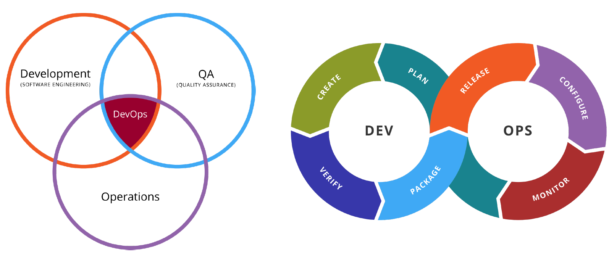

# Microservice와 Spring Cloud의 소개

# Microservice와 Spring Cloud의 소개
* toc
{:toc}

## Software Architecture
+ The History of IT System
  + 1960 ~ 1980s : Fragile, Cowboys
    + Mainframe, Hardware
  + 1990 ~ 2000s : Robust, Distributed
    + Changes
  + 2010s ~ : Resilient/Anti-Fragile, Cloud Native
    + Flow of value의 지속적인 개선
  + 

### Antifragile
+ Auto scaling
  + 자동 확장성을 갖는 특징
  + 사용량에 따라 자동으로 인스턴스를 증가할 수 있는 환경
  + 
+ Microservices
  + 전체 서비스들을 구축하고있는 개별적인 모듈이나 기능을 독립적으로 개발하고 배포하고 운영할 수 있도록 세분화된 서비스
+ Chaos engineering
  + 시스템이 급격하게 예측하지 못하는 상황이라도 견딜수 있고 신뢰성을 쌓기위해 운영중인 소프트웨어 시스템의 실행하는 방법이나 규칙
  + 시스템의 어떤 변동이나 예견되 혹은 예견되지 않은 불확실성에 대해서도 안정적인 서비스를 제공할 수 있도록 구축되어야한다
  + 
  + 
+ Continuous deployments
  + 지속정인 통합, 지속적인 배포
  
### Cloud Native Architecture
+ 확장 가능한 아키택처
  + 시스템의 수평적 확장에 유연
  + 확장된 서버로 시스템의 부하분산, 가용성 보장
  + 시스템 또는, 서비스 어플리케이션 단위의 패키지(컨테이너 기반 패키지)
  + 모니터링
+ 탄력적 아키텍쳐
  + 서비스 생성 - 통합 - 배포, 비즈니스 환경 변화에 대응 시간 단축 
  + 분활 된 서비스 구조
  + 무상태 통신 프로토콜
  + 서비스의 추가와 삭제 자동으로 감지
  + 변경된 서비스 요청에 따라 사용자 요청 처리(동적 처리)
+ 장애 격리(Fault isolation)
  + 특정 서비스에 오류가 발생해도 다른 서비스에 영향 주지 않는다

### Cloud Native Application
+ 

#### CI/CD
+ 지속적인 통합, CI(Continuous Integration)
  + 통합 서버, 소스 관리 (SCM), 빌드 도구, 테스트 도구
  + ex) Jenkins, Team CI, Travis CI
+ 지속적 배포
  + Continuous Delivery
  + Continuous Deployment
  + Pipe line
  + 
+ 카나리 배포와 블루그린 배포
  + 

#### DevOps
+ 

#### Container 가상화
+ 

