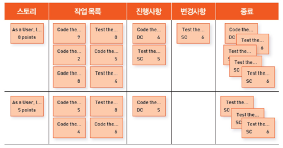
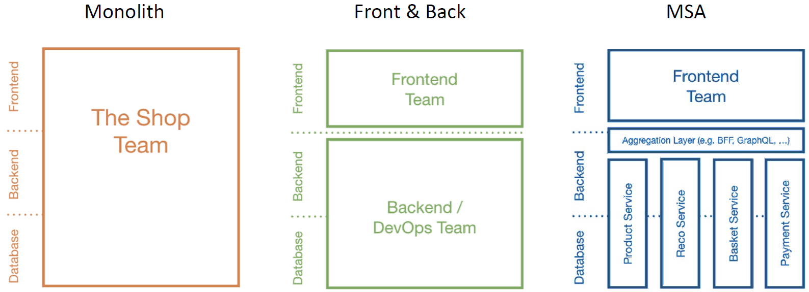

# Microservice와 Spring Cloud의 소개

# Microservice와 Spring Cloud의 소개
* toc
{:toc}

## Software Architecture
+ The History of IT System
  + 1960 ~ 1980s : Fragile, Cowboys
    + Mainframe, Hardware
  + 1990 ~ 2000s : Robust, Distributed
    + Changes
  + 2010s ~ : Resilient/Anti-Fragile, Cloud Native
    + Flow of value의 지속적인 개선
  + 

### Antifragile
+ Auto scaling
  + 자동 확장성을 갖는 특징
  + 사용량에 따라 자동으로 인스턴스를 증가할 수 있는 환경
  + 
+ Microservices
  + 전체 서비스들을 구축하고있는 개별적인 모듈이나 기능을 독립적으로 개발하고 배포하고 운영할 수 있도록 세분화된 서비스
+ Chaos engineering
  + 시스템이 급격하게 예측하지 못하는 상황이라도 견딜수 있고 신뢰성을 쌓기위해 운영중인 소프트웨어 시스템의 실행하는 방법이나 규칙
  + 시스템의 어떤 변동이나 예견되 혹은 예견되지 않은 불확실성에 대해서도 안정적인 서비스를 제공할 수 있도록 구축되어야한다
  + 
  + 
+ Continuous deployments
  + 지속정인 통합, 지속적인 배포
  
### Cloud Native Architecture
+ 확장 가능한 아키택처
  + 시스템의 수평적 확장에 유연
  + 확장된 서버로 시스템의 부하분산, 가용성 보장
  + 시스템 또는, 서비스 어플리케이션 단위의 패키지(컨테이너 기반 패키지)
  + 모니터링
+ 탄력적 아키텍쳐
  + 서비스 생성 - 통합 - 배포, 비즈니스 환경 변화에 대응 시간 단축 
  + 분활 된 서비스 구조
  + 무상태 통신 프로토콜
  + 서비스의 추가와 삭제 자동으로 감지
  + 변경된 서비스 요청에 따라 사용자 요청 처리(동적 처리)
+ 장애 격리(Fault isolation)
  + 특정 서비스에 오류가 발생해도 다른 서비스에 영향 주지 않는다

### Cloud Native Application
+ 

#### CI/CD
+ 지속적인 통합, CI(Continuous Integration)
  + 통합 서버, 소스 관리 (SCM), 빌드 도구, 테스트 도구
  + ex) Jenkins, Team CI, Travis CI
+ 지속적 배포
  + Continuous Delivery
  + Continuous Deployment
  + Pipe line
  + 
+ 카나리 배포와 블루그린 배포
  + 

#### DevOps
+ 

#### Container 가상화
+ 

## 12 Factors([https://12factor.net/](https://12factor.net/))
+ SaaS(Software As A Service) 애플리케이션을 만들기 위한 방법론으로써 프로그래밍 언에 비종속정이며 DB, Queue, Memory-cache 등과 조합할 수 있는 방법론
+ SaaS의 특징
  + 설정 자동화를 위한 절차(declarative)를 체계화하여 새로운 개발자가 프로젝트에 참여하는데 드는 시간과 비용을 최소화한다
  + OS에 따라 달라지는 부분을 명확히 하고, 실행 환경 사이의 이식성을 극대화한다
  + 최근 등장한 클라우드 플랫폼 배포에 적합하고, 서버와 시스템의 관리가 필요 없게 된다
  + 개발 환경과 운영 환경의 차이를 최소화하고 민첩성을 극대화하기 위해 지속적인 배포가 가능하다
  + 툴, 아키텍처, 개발 방식을 크게 바꾸지 않고 확장(scale up) 할 수 있다
+ 이 방법론은 시간이 지나면서 망가지는 소프트웨어 유지비용을 줄이는 방법에 집중해 이상적인 개발 방법을 찾고자 했다 
+ 클라우드 네이티브 어플리케이션을 구축함에 있어서 고려해봐야될 12가지 항목 
+ 
  1. 버전 관리되는 하나의 코드베이스와 다양한 배포
  2. 명시적으로 선언되고 분리된 종속성
  3. 환경(environment)에 저장된 설정
  4. 백엔드 서비스를 연결된 리소스로 취급
  5. 철저하게 분리된 빌드와 실행 단계
  6. 애플리케이션을 하나 혹은 여러개의 무상태(stateless) 프로세스로 실행
  7. 포트 바인딩을 사용해서 서비스를 공개함
  8. 프로세스 모델을 사용한 확장
  9. 빠른 시작과 그레이스풀 셧다운(graceful shutdown)을 통한 안정성 극대화
  10. 개발, 스테이징, 프로덕션 환경을 최대한 비슷하게 유지
  11. 로그를 이벤트 스트림으로 취급
  12. 개발, 스테이징, 프로덕션 환경을 최대한 비슷하게 유지

+ 코드 베이스(Code Base)
  + 코드베이스는 VCS(Version Control System)을 사용해 변화를 추적하고 코드를 저장하는 저장소를 의미한다(예: Git, SVN)
  + 이 방법론에서는 코드 베이스 앱이 항상 1 대 1 관계를 맺어야한다고 하는데, 쉡게 말해 코드는 한 곳에서 개발/배포 되어야한다. 
  + 코드 베이스가 여러개 인경우
    + 앱이 아닌 분산 시스템으로 간주하고, 각각 코드 베이스별로 앱으로서 12 Factors를 따른다
  + 여러 앱이 동일한 코드를 공유하는 경우
    + 12 Factors를 위반하므로 공유되는 코드를 라이브러리화 하고 각 앱에 종속성을 주입한다
  + 앱 배포가 여러개인 경우(개발/알파/릴리지 등)
    + 코드 베이스 자체는 동일하게 유지하며, Git branch 등으로 동일한 앱을 여러개로 배포할 수 있다 
  + 애플리케이션의 1개의 코드 베이스(Git, SVN)를 통해 관리되어야 하며, 동일한 코드로 운영/개발에 배포하여야 한다.
    + 애플리케이션은 1개의 코드 베이스를 가진다
    + 애플리케이션은 1개의 코드 베이스를 통해 운영/개발용으로 배포한다
    + CodeBase 항목은 이어지는 타 항목을 준수기 위해 기본적으로 준수해야 하는 항목이다
    + CodeBase 항목은 SVN, Git과 같은 코드 관리 시스템 사용으로 준수할 수 있다
  + 중요도: Non-negotiable
+ 종속성 (Dependencies)
  + 전체 시스템에 특정 패키지가 암묵적으로 존재하는 것에 절대 의존하지 않으며, 애플리케이션의 모든 종속성은 명시적으로 선언해 사용해야한다
  + 대부분의 Java 프로젝트에서는 Gradle 이나 Maven을 이용해서 의존성을 관리할 수 있다 
  + 게다가, Spring boot의 경우에는 내장 톰캣이나 jetty를 임베딩해 배포까지 가능하다
  + 애플리케이션이 필요로 하는 라이브러리를 dependency manifest 파일에 (Gemfile, POM 등) 명시적으로 선언하여 사용한다.
  + SaaS는 상황에 따라 다양한 환경(window, mac, linux)에 배포될 수 있다
  + Gemfile, pom 등을 사용하여 다양한 환경에서도 SaaS가 정상 동작할 수 있음을 보장할 수 있다
  + 예를 들어 curl 등을 사용하여 lib를 사용할 경우 os에 따라 오동작 할 수 있다
  + Dependencies 항목 준수 방법
    + Dependencies 항목은 Gemfile, POM 등을 사용하여 준수할 수 있다
    + 필요한 모든 라이브러리와 버전을 리스트 업하고, 배포할 시 빌드 명령어를 실행. mvn build 또는 build install(Ruby) 등
  + 중요도: High
  + Spring boot의 경우 embedded runtime, external runtime에 따라 dependency 를 명시적으로 선언할 수 있다.
    + 배포방식 : jar or war
    + dependency : spring-boot-starter-tomcat을 사용할 것인지 여부 결정
+ 설정 (Config)
  + 설정은 동일한 앱의 배포 단계(개발/알파/릴리즈 등)에 따라 달라질 수 있는 모든 것들을 의미한다 
  + 예시
    + 데이터베이스 접속 정보
    + OAuth 또는 외부 서비스 인증정보
    + 호스트 네임에 따라 달라지는 값
    + 서비스 포트 정보
  + 이 정보들은 코드 상수 형태라도 저장되면 안되며, 코드 베이스와 WAS 설정파일 (예: JNDI 설정)에도 저장하지 않는 것을 권장한다
  + 12 Factor App 에서는 이 규약을 준수하기 위한 방법으로 환경변수를 사용하는 것을 제시하며, Spring Cloud를 이용하는 경우 Spring Cloud Config를 사용하는 것도 좋은 방법이다
  + 모든 설정 정보는 코드로부터 분리된 공간에 저장되어야 하고, 런타임에서 코드에 의해 읽혀야 한다
  + SaaS는 동일한 코드를 여러 환경(운영/개발)에 배포한다. 이를 위해 환경마다 달리 사용되어야 하는 정보를 분리한다
  + 분리되어야 할 정보
    + 데이터베이스나 다른 백업 서비스를 처리하는 리소스
    + 외부 리소스(S3, Twitter 등)의 인증 정보
    + 각 배포마다 달라지는 값(cononical hostname..)
    + dev,test,stage,prod의 배포 단계마다 다를 수 있는 어떤 값들
  + 설정정보를 저장하면 안되는 곳
    + code
    + properties file
    + build : one build, many deploy
    + app server(jndi database 같은 정보)
  + 중요도: Medium
+ 백엔드 서비스 (Backing services)
  + 백엔드 서비스는 네트워크를 통해 이용하는 모든 서비스를 위미하며, 서드파티 서비스 또한 포함된다
    + 데이터 베이스
    + 메시지 큐
    + SMTP 서비스
    + 캐시 시스템
    + Push 서비스
    + Amazon S3
    + Google Maps
    + 기타 등등
  + 12 Factor App 에서는 이 백엔드 서비스를 연결된 리소스 취급하고, 자유롭게 연결 및 분리가 가능해야하고 코드 수정 없이 전환이 가능해야한다
  + 예를 들어, 하나의 My-SQL DB는 하나의 리소스 이다. 그리고 애플리케이션 레이어에서 샤딩을 하는 두 개의 MySQL DB는 서로 다른 리소스로 구분한다
  + 이 규약의 경우 리소스 연결 정보를 Config로 지정해 준수할 수 있다
  + 예를 들어, 개발 단계와 배포 단계의 데이터베이스 연결 정보를 Config로 지정해 코드 수정 없이 배포 단계마다 적절한 데이터베이스에 연결하도록 할 수 있다 
  + 백엔드 서비스를 연결된 리소스로 취급한다
  + SaaS의 리소스는 자유롭게 배포에 연결되거나 분리할 수 있고, 코드 수정 없이 전환이 가능해야 한다
  + 예를 들어 DB를 MySQL에서 Amazon RDS로 전환할 때 코드 수정 없이 가능해야 한다
  + 백엔드 서비스
    + 네트워크을 통해 이용하는 모든 서비스
    + DB, Cache, SMTP, Messaging/Queueing system
  + 준수 방법
    + Config에 백엔드 서비스의 URL이나 Locator를 저장하고, 코드에서는 설정을 읽어서 사용
    + Factor3. Config 기능 사용
  + 중요도: High
+ 빌드, 릴리즈, 실행 (Build, release, run)
  + 12 Factor App 에서는 코드 베이스를 빌드, 릴리즈, 실행 단계로 엄격히 분리한다, 코드 변경은 반드시 빌드 단계에서만 이루어져야 하며, 모든 릴리즈는 항상 유니크한 릴리즈 아이디를 가져한다
  + 또 릴리즈는 추가만 가능하며 한번 만들어진 릴리즈는 변경될수 없고 이전 버전으로 롤백이 가능해야 한다 
  + 빌드
    + 코드 베이스를 빌드라는 실행 가능한 번들로 변환시키는 단계 
    + 새로운 코드가 배포될 때마다 개발자에 의해 시작
  + 릴리즈
    + 빌드 단계에서 만들어진 빌드와 배포의 현재 설정을 결합하는 단계
  + 실행(런타임)
    + 서버가 재부팅되거나 프로세스 매니저에 의해 실행
  + 코드 베이스는 build > release > run의 단계를 거쳐 배포로 변환되며, 각 단계는 엄격하게 분리되어야 한다.
  + 준수 방법
    + 빌드 단계는 개발자, 배포 단계는 배포툴, 실행 단계는 프로세스 매니저에 의해 시작
  + 중요도: Conceptual
+ 프로세스 (Process)
  + 애플리케이션은 무상태 프로세스로 실행되어야하고, 아무것도 공유하지 않아야한다 
  + 유지될 필요가 잇는 모든 데이터는 백엔드 서비스(예: 데이터베이스, Redis)에 저장되어야한다 
  + SaaS 애플리케이션 자체가 Scale-out 이 가능하기 때문에 각 인스턴스가 메모리와 파일을 공유할 수 없고, 공유하더라도 메모리에 저장된 내용이 다른 프로세스에 의해 처리될 수 있으므로 로컬의 상태를 없애야한다
  + 실행 환경에서 앱은 하나 이상의 프로세스로 실행되며, 각 프로세스는 stateless로 아무것도 공유하지 않아야 한다
  + SaaS는 여러 개의 인스터스로 배포될 수 있다. 각 인스턴스는 메모리 파일 등을 공유할 수 없으며, 인스턴스가 재실행 될 때 local file, session과 같은 상태 정보는 모두 초기화된다
  + 준수 방법
    + 메모리/파일을 사용할 경우 단일 트랜잭션 내에서 읽고, 쓰고 등의 모든 작업을 처리
    + 세션 상태 데이터의 경우 Memcached 또는 Redis와 같은 데이터 저장소에 저장
  + 중요도: High
+ 포트 바인딩 (Port binding)
  + 애플리케이션을 다른 애플리케이션에서 런타임 인젝션이 아닌 HTTP 서비스로 접그할 수 있도록 포트 바인딩한다.
  + 예를 들면, 각각의 마이크로 서비스 A가 B의 서비스를 사용해야하는 경우 B의 데이터베이스 접속 정보와 계정, 권한을 A에게 부여해 B의 데이터베이스 접속하는 것은 이 규약을 위반하는 것이다 
  + 이 규약을 준수하기 위해서는 A에서 B 서비스로 HTTP 요청을 통해 원하는 데이터를 읽고/쓰고/수정/삭제 해야한다
  + 배포된 SaaS 애플리케이션을 타 애플리케이션에서 접근할 수 있도록 포트 바인딩을 통해 서비스를 공개한다
  + 앱도 백엔드 서비스처럼 URL을 제공하고, 라우팅 레이어가 외부에 공개된 호스트 명의로 들어온 요청을 포트에 바인딩 된 웹 프로세스에 전달한다
  + Factor4. Backing services의 확장으로, 포트 바인딩에 의해 공개되는 서비스는 HTTP뿐만 아니라 ejabberd나 Redis 같은 모든 종류의 서버 소프트웨어가 해당된다
  + 준수 방법
    + 보통 dependency에 웹서버 라이브러리를 추가해서 구현
  + 참고
    + Spring Cloud Netflix
  + 중요도: Medium
+ 동시성 (Concurrency)
  + 애플리케이션은 Scale-out이 가능해야하며, 프로세스가 데몬 형태가 아니어야한다. 앞선 프로세스 규약에서 애플리케이션이 무상태이고 아무것도 공유되지 않기 때문에 자유롭게 확장하고, 자유롭게 축소할 수 있다
  + 앱은 수평으로 확장할 수 있어야 하고, Factor6. Processes에 의해 동시성을 높일 수 있다.
  + 준수 방법
    + 모든 일을 처리하는 하나의 프로세스 대신 기능별로 분리된 프로세스 실행(micro service)
    + 프로세스가 데몬형태가 아니어야 한다
    + OS 프로세스 관리자/분산 프로세스 매니저/Foreman 같은 툴에 의존해서 output stream을 관리하고, 충돌이 발생한 프로세스에 대응, 재시작과 종료를 처리해야 한다
  + 중요도: Low
+ 폐기 기능 (Disposability)
  + 12 Factor App 에서는 프로세스의 시작과 종료, 배포가 빈번하기 때문에 애플리케이션의 시작 시간과 종료 시간의 최소화가 중요하다
  + 또한 종료에 있어서는 종료 시그널을 받고 나서 애플리케이션은 신규 요청은 받지 않고 기존 요청은 최대한 빠르게 처리한 이후 종료되어야한다 
  + long polling의 경우에는 연결이 끊긴 시점에 바로 다시 연결을 시도해야하고, worker 프로세스의 경우에는 현재 처리중인 작업을 작업 큐로 되돌리고 종료해야한다
  + 하드웨어 에러에 의해 갑작스런 다운에도 견고해야하며, Spring Cloud를 사용하는 경우 Spring Cloud Circuit B reaker를 통해 이러한 장애를 대비할 수 있다
  + 프로세스는 shut down 신호를 받았을 때 graceful shut down 해야 한다
  + SaaS는 요청에 의해 Scale up/down이 빈번히 발생한다. Disposability를 준수함으로써 이러한 사용에 안정성을 얻을 수 있다
  + 예를 들어 Scale down 시점에 graceful shut down 이 아니라면 db lock 등으로 인해 타 프로세스에 영향을 주게 된다
  + 중요도: Medium
+ 개발/프로덕션 환경 일치 (Dev/prod parity)
  + 개발 환경, 스테이징 환경, 프로덕션 환경을 최대한 비슷하게 유지하는 것을 의미한다. 
  + 보통 이 3단계 사이에는 세 가지 큰 차이점이 있다
    + 시간의 차이
      + 개발자가 작업한 코드는 프로덕션에 반영되기 까지 시간이 소요된다
    + 담당자의 차이
      + 대부분의 경우 개발자가 작성한 코드를 시스템 엔지니어가 배포한다
    + 툴의 차이 
      + 배포 환경과 개발자의 환경이 OS 부터 사용 제품, 툴에 있어 다를 수 있다
  + 12 Factor App은 개발 환경과 프로덕션 환경의 차이를 최대한 작게 유지해 지속적인 배포가 가능하도록 설계되어있다.
  + 특히, 데이터베이스, 큐잉 시스템, 캐시와 같은 벡엔드 서비스는 두 환경의 일치가 가장 중요한 영역이다.
  + 하지만 동시에 개발자 입장에서는 프로덕션에서 사용하는 서비스보다 가벼운 환경을 구축해 개발하는 것을 원하는 경우가 많다. (예를 들어, 프로덕션 데이터베이스는 MySQL인데 개발자 로컬 데이터베이스는 H2를 사용하는 경우)
  + 12 Factor App에서는 이것 또한 프로덕션 단계에서의 오류 가능성이 존재하므로 강력히 제한하며, 저도 사실 요즘은 Docker를 통해서 데이터베이스도 손쉽고 간단하게 구축이 가능하니 충분히 준수할만한 규약이라고 생각한다.
  + development, staging, production 환경을 최대한 비슷하게 유지한다. SaaS 애플리케이션은 개발 환경과 production 환경의 차이를 작게 유지하여 지속적인 배포가 가능하도록 디자인되어야 한다
  + 준수 방법
    + 시간의 차이를 최소화: 개발자가 작성한 코드는 몇 시간 또는 몇 분 후에 배포되어야 한다
    + 담당자의 차이를 최소화: 코드를 작성한 개발자들이 배포와 production에서의 모니터링에 깊게 관여한다
    + 툴의 차이를 최소화: 개발과 production 환경을 최대한 비슷하게 유지
  + 중요도: Medium
  
<table style="border-collapse: collapse; width: 100%;">
<tbody>
<tr>
<td style="width: 33.3333%;">&nbsp;</td>
<td style="width: 33.3333%;">전통적인 애플리케이션</td>
<td style="width: 33.3333%;">12 Factor App</td>
</tr>
<tr>
<td style="width: 33.3333%;">배포 간의 간격</td>
<td style="width: 33.3333%;">몇 주</td>
<td style="width: 33.3333%;">몇 시간</td>
</tr>
<tr>
<td style="width: 33.3333%;">코드 작성자와 코드 배포자</td>
<td style="width: 33.3333%;">다른 사람</td>
<td style="width: 33.3333%;">같은 사람</td>
</tr>
<tr>
<td style="width: 33.3333%;">개발 환경과 프로덕션 환경</td>
<td style="width: 33.3333%;">불일치</td>
<td style="width: 33.3333%;">최대한 유사하게</td>
</tr>
</tbody>
</table>

+ 로그 (Logs)
  + 로그는 모든 실행중인 프로세스와 서비스의 아웃풋 스트림으로부터 수집된 이벤트가 시간순으로 정렬된 스트림이다. 때문에 애플리케이션은 아웃풋 스트림의 전달이나 저장에 절대 관여하지 않는다.
  + SaaS 애플리케이션은 언제든 인스턴스가 삭제되고 생성될 수 있으므로 로그는 스트림으로 취급해 별도 저장소에 보관해야한다.
  + 로그를 이벤트 스트림으로 취급하여 로그를 로컬에 저장하지 않는다.
  + SaaS는 언제든지 인스턴스가 생성/삭제될 수 있다. 이때 로컬에 저장된 로그는 초기화되기 때문에 로그는 스트림으로 취급하여 별도의 저장소에 보관해야 한다
  + 준수 방법
    + 스트림을 버퍼링 없이 stdout, stderr 로 출력함
    + 별도의 로그 저장소를 사용
  + 중요도: Low
+ 어드민 프로세스 (Admin processes)
  + 어드민 또는 유지보수 작업을 일회성 프로세스(데이터베이스 마이그레이션, 일회성 스크립트 실행 등)로 실행해야 한다.
  + admin/maintenance 작업을 일회성 프로세스로 실행해야 한다.
  + 일회성 프로세스
    + 데이터베이스 마이그레이션
    + 일회성 스크립트 실행
  + 준수 방법
    + 관리/유지보수 작업은 release와 함께 실행
    + release와 동일한 환경에서 실행하고, 같은 코드 베이스와 config를 사용
    + admin 코드는 동기화 문제를 피하기 위해 애플리케이션 코드와 함께 배포
  + 중요도: High

### 12 Factors + 3
1. One codebase, one application (하나의 코드베이스, 하나의 애플리케이션) 
2. __API first (API 우선)__
3. Dependency management (종속성 관리)
4. Design, build, release, and run (설계, 빌드, 릴리스 및 실행)
5. Configuration, credentials, and code (구성, 자격 증명 및 코드)
6. Logs (로그)
7. Disposability (일회용)
8. Backing services (지원 서비스)
9. Environment parity (환경 패리티)
10. Administrative processes (행정 절차)
11. Port binding (포트 바인딩)
12. Stateless processes (상태 비저장 프로세스)
13. Concurrency (동시성)
14. __Telemetry (원격)__
15. __Authentication and authorization (인증 및 권한 부여)__

## Monolithic vs MSA
+ Monolith Architecture
  + 모든 업무 로직이 하나의 애플리케이션 형태로 패키지 되어 서비스
  + 애플리케이션에서 사용하는 데이터가 한곳에 모여 참조되어 서비스되는 형태
  + 
    + 일부 기능만 수정 전체 애플리케이션 빌드, 배포
+ 마이크로 서비스란?
  + 함께 작동하는 소규모 자율 서비스 - 샘 뉴먼
  + 간단히 말해서 마이크로 서비스 아키텍처 스타일은 단일 응용 프로그램을 제품군으로 개발하는 방법 각각 자체 프로세스에서 실행되는 소규모 서비스 및 경량 메커니즘과 통신, HTTP 리소스 API...
  + 이러한 서비스는 비즈니스 기능을 중심으로 구축됩니다. 완전 자동화로 독립적으로 배포 가능 배포 기계... 
  + 최소한의 중앙 집중식 관리가 있습니다. 서로 다른 언어로 작성될 수 있는 이러한 서비스 프로그래밍 언어 및 다른 데이터 사용 스토리지 기술 - 제임스 루이스와 마틴 파울러
+ Monolith vs Front & Back vs Microservice Architecture
  + 
+ 

## Microservice
+ In 2002, Amazon founder and CEO Jeff Bezos’s Email to Employees
  1. All teams will henceforth expose their data and functionality through service interfaces.
  2. Teams must communicate with each other through these interfaces.
  3. There will be no other form of interprocess communication allowed: no direct linking, no direct reads of another team’s data store, no shared-memory model, no back-doors whatsoever. The only communication allowed is via service interface calls over the network.
  4. It doesn’t matter what technology they use. HTTP, Corba, Pubsub, custom protocols — doesn’t matter.
  5. All service interfaces, without exception, must be designed from the ground up to be externalizable. That is to say, the team must plan and design to be able to expose the interface to developers in the outside world. No exceptions.
  6. Anyone who doesn’t do this will be fired.
  7. Thank you; have a nice day!

+ 2002 년 아마존 창립자 겸 CEO 인 제프 베조스 (Jeff Bezos)가 직원들에게 보낸 이메일
  1. 모든 팀은 이후 서비스 인터페이스를 통해 데이터와 기능을 노출합니다.
  2. 팀은 이러한 인터페이스를 통해 서로 통신해야 합니다.
  3. 다른 형태의 프로세스 간 통신은 허용되지 않습니다 : 직접 연결 금지, 다른 팀의 데이터 저장소에 대한 직접 읽기, 공유 메모리 모델, 백도어 금지. 허용되는 유일한 통신은 네트워크를 통한 서비스 인터페이스 호출을 통한 것입니다.
  4. 그들이 사용하는 기술은 중요하지 않습니다. HTTP, Corba, Pubsub, 사용자 정의 프로토콜은 중요하지 않습니다.
  5. 모든 서비스 인터페이스는 예외 없이 처음부터 외부화할 수 있도록 설계되어야 합니다. 즉, 팀은 외부 세계의 개발자에게 인터페이스를 노출할 수 있도록 계획하고 설계해야 합니다. 예외는 없습니다.
  6. 이렇게하지 않으면 해고 될 것입니다..
  7. 감사합니다; 즐거운 하루 보내세요!

### Microservice의 특징
1. Challenges (도전)
2. Small Well Chosen Deployable Units (잘 선택된 소형 배치 가능한 유닛)
3. Bounded Context (바인딩된 컨텍스트)
4. RESTful 
5. Configuration Management (구성 관리)
6. Cloud Enabled (클라우드 지원)
7. Dynamic Scale Up And Scale Down (동적 스케일 업 및 스케일 다운)
8. CI/CD 
9. Visibility (시정, 시각화)

+ 

+ ~~Everything should be a microservice (모든 것이 마이크로 서비스여야 합니다.)~~
  + 질문
    1. Multiple Rates of Change (다중 변화율) - 어느정도 변화가 생길 것인가, 어느정도 공수를 고려하고 받아드릴수 있을것인가
    2. Independent Life Cycles (독립 라이프 사이클) - 어플리케이션을 구성하고 있는 각각의 서비스들이 독립적으로 개발되고 운영될 수 있도록 서비스 경계가 잘 만들어져 있는가
    3. Independent Scalability (독립적인 확장성) - 각각의 서비스를 운영함에 있어서 서비스 유지보수 및 확성이 가능한가
    4. Isolated Failure (격리된 오류) - 오류사항이 독립적인가, 즉 마이크로 서비스에 부분적이 오류가 발생되었드라고 해당 서비스만 영향 받도록 설계가 되었는지 다른 마이크로 서비스들은 오류에 최소한의 영향을 받으면서 해당 서비스를 우회할 수 있는 대체 서비스가 준비 될수 있지 고려 
    5. Simplify Interactions with External Dependencies (외부 종속성과의 상호 작용 단순화) - 응집력을 높일수 있도록 서비스 경계가 잘 구분되어 있는지
    6. Polyglot Technology (다국어 기술) - 여러가지 프로그램 언어 스토리지 기술을 쓸수 있게끔 지원하는가 

+ Microservice Team Structure (마이크로서비스 팀 구조)
  + Two Pizza team (두 피자 팀)
  + Teams communicating through API contracts (API 계약을 통해 통신하는 팀)
  + Develop, test and deploy each service independently (각 서비스를 독립적으로 개발, 테스트 및 배포)
  + Consumer Driven Contract (소비자 주도 계약) 

## SOA와 MSA와의 차이점
+ SOA(Service Oriented Architecture, 서비스 지향 아키텍처)
  + 비즈니스 측면에서의 서비스 재사용성
  + ESB(Enterprise Service Bus)라는 서비스 채널 이용 -> 서비스 공유, 재사용
+ MSA(Microservice Architecture, 마이크로서비스 아키텍처)
  + 한 가지 작은 서비스에 집중
  + 서비스 공유하지 않고 독립적 실행
+ 서비스의 공유 지향점
  + SOA - 재사용을 통한 비용 절감
  + MSA - 서비스 간의 결합도를 낮추어 변화에 능동적으로 대응
  + 
+ 기술 방식
  + SOA - 공통의 서비스를 ESB에 모아 사업 측면에서 공통 서비스 형식으로 서비스 제공
  + MSA - 각 독립된 서비스가 노출된 REST API를 사용
  + 

### RESTful Web Service
+ “A way to grade your API according to the constraints of REST.” - by Leonard Richardson
+ "REST의 제약 조건에 따라 API를 평가하는 방법." - 레너드 리처드슨
  + LEVEL 0
    + Expose soap web services in rest style
    + 휴식 스타일로 비누 웹 서비스 노출
    + http://server/getPosts
    + http://server/deletePosts
    + http://server/doThis
  + LEVEL 1
    + Expose resources with proper uri
    + 적절한 uri로 리소스 노출
    + http://server/accounts
    + http://server/accounts/10
    + note: improper use of http methods, HTTP 메소드의 부적절한 사용 
  + LEVEL 2
    + Level1 + HTTP Methods
  + LEVEL 3
    + Level2 + HATEOAS
    + DATA + NEXT POSSIBLE ACTIONS, 다음 가능한 조치
  + 
+ Consumer first, 소비자 우선
+ Make best use of HTTP, HTTP를 최대한 활용하십시오.
+ Request methods
  + GET
  + POST
  + PUT
  + DELETE
+ Response Status
  + 200
  + 404
  + 400
  + 201
  + 401
+ No secure info in URI, URI에 보안 정보가 없습니다.
+ Use plurals, 복수형 사용
  + prefer /users to /user
  + prefer /users/1 to /user/1
+ User nouns for resources, 자원에 대한 사용자 명사
+ For exceptions, 예외의 경우
  + define a consistent approach, 일관된 접근 방식 정의
    + /search
    + PUT /gists/{id}/star
    + DELETE /gists/{id}/star

### SOA vs Micro Service Example
+ 

## MSA 표준 구성요소
+ 
+ CNCF(Cloud Native Computing Foundation, 클라우드 네이티브 컴퓨팅 재단)
  + Cloud Native Interactive Landscape - 클라우드 네이티브 대화형 환경
  + [https://landscape.cncf.io/](https://landscape.cncf.io/)
  + 
  + 

### Service Mesh Capabilities
+ 
  + MSA 인프라 -> 미들웨어
    + 프록시 역할, 인증, 권한 부여, 암호화, 서비스 검색, 요청 라우팅, 로드 밸런싱
    + 자가 치유 복구 서비스 
  + 서비스간의 통신과 관련된 기능을 자동화 

### MSA 기반 기술
+ 

## Spring Cloud
+ “By 2017, at least 70% of new enterprise Java applications won’t be deployed on traditional app servers”
+ “2017년까지 새로운 엔터프라이즈 Java 애플리케이션의 최소 70%가 기존 앱 서버에 배포되지 않을 것입니다.”
+ [https://spring.io/projects/spring-cloud](https://spring.io/projects/spring-cloud)
+ 
  + Spring Cloud는 개발자가 분산 시스템의 일반적인 패턴 (예 : 구성 관리, 서비스 검색, 회로 차단기, 지능형 라우팅, 마이크로 프록시, 제어 버스, 일회용 토큰, 전역 잠금, 리더십 선택, 분산 세션, 클러스터 상태)을 신속하게 구축 할 수있는 도구를 제공합니다.
  분산 시스템의 조정은 보일러 플레이트 패턴으로 이어지며 Spring Cloud 개발자는 이러한 패턴을 구현하는 서비스 및 애플리케이션을 신속하게 구축 할 수 있습니다. 
  개발자 자신의 노트북, 베어메탈 데이터 센터 및 Cloud Foundry와 같은 관리형 플랫폼을 포함한 모든 분산 환경에서 잘 작동합니다.
+ Spring Boot + Spring Cloud
  + 
+ Main Projects
  + 
+ Centralized configuration management, 중앙 집중식 구성 관리
  + Spring Cloud Config Server
+ Location transparency, 위치 투명성
  + Naming Server (Eureka)
+ Load Distribution (Load Balancing), 부하 분산(부하 분산)
  + Ribbon (Client Side)
  + Spring Cloud Gateway
+ Easier REST Clients, 더 쉬운 REST 클라이언트
  + FeignClient
+ Visibility and monitoring, 가시성 및 모니터링
  + Zipkin Distributed Tracing
  + Netflix API gateway
+ Fault Tolerance, 내결함성 
  + Hystrix
+ 
+ 
