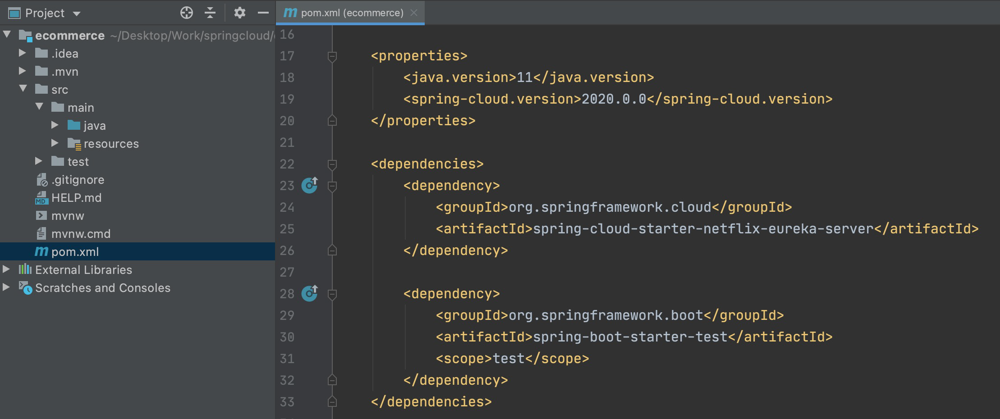

# Service Discovery

# Service Discovery
* toc
{:toc}

## Spring Cloud Netflix Eureka
+ 

## EcommerceDiscoveryService
+ Dependencies
  + Spring Cloud Discovery > Eureka Server
+ pom.xml
  + 
+ EcommerceApplication.java
  + 
+ application.yml (or application.properties)
  + 

~~~yaml

# 자신의 정보를 등록하는것을 방지
eureka:
  client:
    register-with-eureka: false
    fetch-registry: false

~~~

+ 실행 화면 
  + 

## User Service
+ Eureka Discovery Service에 등록
  + 
+ pom.xml
  + 
+ Application.java
  + 
+ application.yml
  + 
  + eureka.client.fetch-registry: true
    + eureka 서버로부터 인스턴스들의 정보를 주기적으로 가져올 것인지를 설정하는 속성이다. true로 설정하면, 갱신 된 정보를 받겠다는 설정이다 
+ Scaling – 같은 서비스 추가 실행 #1
  + VM Options -> -Dserver.port=[다른포트]
+ Scaling - 같은 서비스 추가 실행 #2
  + $ mvn spring-boot:run -Dspring-boot.run.jvmArguments='-Dserver.port=9003'
+ Scaling - 같은 서비스 추가 실행 #3
  + mvn clean compile package
  + java -jar -Dserver.port=9004 ./target/user-service-0.0.1-SNAPSHOT.jar
+ Scaling – Random 포트 사용으로 같은 서비스 추가 실행
  + 
  + 같은 서비스 명으로 인해 Eureka에 하나의 앱만 등록
  + application.yml에 instance 정보 등록
    + eureka.instance.instanceId
    + 
