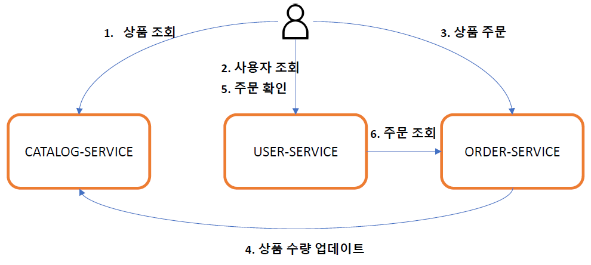
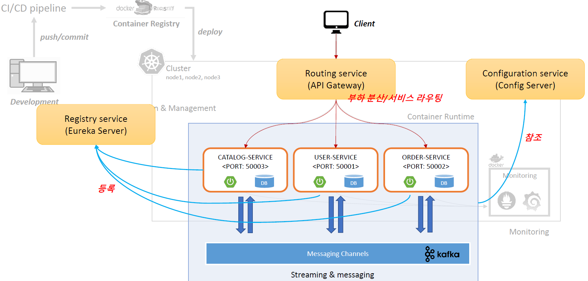
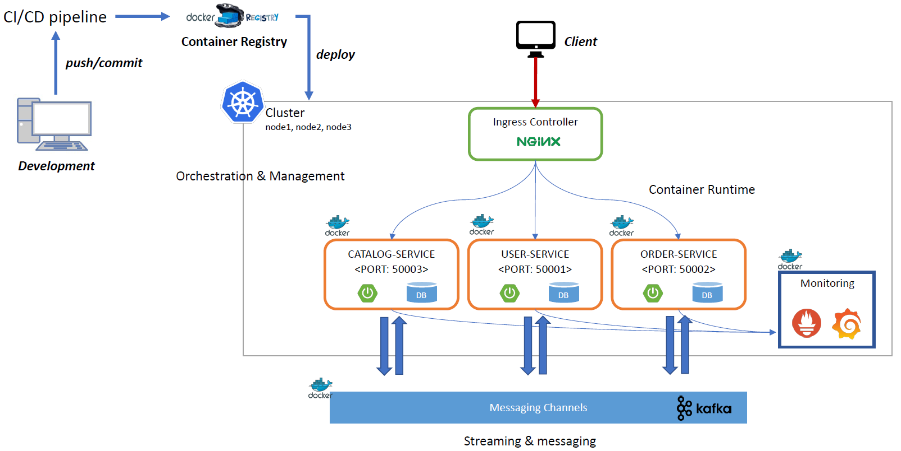

# E-commerce 애플리케이션

# E-commerce 애플리케이션
* toc
{:toc}

## 전체 애플리케이션 개요
+ 
+ 
+ 

### 전체 애플리케이션 구성요소

| 구성요소               | 설명                           |
|--------------------|------------------------------|
| Git Repository     | 마이크로서비스 소스 관리 및 프로파일 관리      |
| Config Server      | Git 저장소에 등록된 프로파일 정보 및 설정 정보 |
| Eureka Server      | 마이크로서비스 등록 및 검색              |
| API Gateway Server | 마이크로서비스 부하 분산 및 서비스 라우팅      |
| Microservices      | 회원 MS, 주문 MS, 상품(카테고리) MS    |
| Queuing System     | 마이크로서비스 간 메시지 발행 및 구독        |

