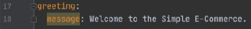
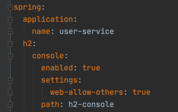
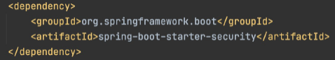
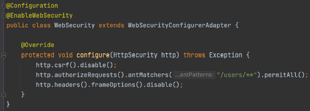
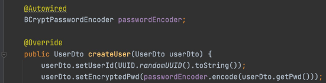
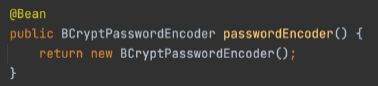

# Users Microservice-part1

# Users Microservice-part1
* toc
{:toc}

## Users Microservice
+ Dependencies
  + DevTools, Lombok, Web, Eureka Discovery Client
+ Application Class

~~~java

@SpringBootApplication
@EnableDiscoveryClient
public class UserServiceApplication {
    public static void main(String[] args) {
        SpringApplication.run(UserServiceApplication.class, args);
    }
}

~~~

+ application.yml (or application.properties)

~~~yaml

server:
  port: 0
  
spring:
  application:
    name: user-service

eureka:
  instance:
    instanceId: ${spring.application.name}:${spring.application.instance_id:${random.value}}

client:
  register-with-eureka: true
  fetch-registry: true
  service-url:
    defaultZone: http://localhost:8761/eureka

~~~

+ RestController Class
  + 상태 체크 -> /health_check

~~~java

@RestController
@RequestMapping("/")
public class UsersController {
    @GetMapping("/health_check")
    public String status() {
      return "It's Working in User Service";
    }
}

~~~

+ Configuration 정보 추가
  + application.yml 파일에 Welcome message 추가
    + 
  + UsersController Class
    + Environment 사용
    + @Value 사용

## Users Microservice – H2 Database
+ H2 Database
  + 자바로 작성된 오픈소스 RDBMS
  + Embedded, Server-Client 가능
  + JPA 연동 가능
+ Dependency 추가
  + Project 생성 시 선택
  + [https://mvnrepository.com/artifact/com.h2database/h2](https://mvnrepository.com/artifact/com.h2database/h2)
+ application.yml
  + h2 설정 추가
  + 
+ h2 1.4.198 이후 버전부터는 보안 문제로 자동으로 데이터베이스 생성하지 않는다

## Users Microservice – Security
+ Spring Security
  + Authentication + Authorization
  + Step 1: 애플리케이션에 spring security jar을 Dependency에 추가
  + Step 2: WebSecurityConfigurerAdapter를 상속받는 Security Configuration 클래스 생성
  + Step 3: Security Configuration 클래스에 @EnableWebSecurity 추가
  + Step 4: Authentication -> configure(AuthenticationManagerBuilder auth) 메서드를 재정의
  + Step 5: Password encode를 위한 BCryptPasswordEncoder 빈 정의
  + Step 6: Authorization -> configure(HttpSecurity http) 메서드를 재정의
+ Dependency 추가
  + 
+ WebSecurity class
  + 
  + http.header().frameOptions().disable() 추가하지 않으면, h2-console접근 안된다
+ BCryptPasswordEncoder
  + Password를 해싱하기 위해 Bcrypt 알고리즘 사용
  + 랜덤 Salt를 부여하여 여러번 Hash를 적용한 암호화 방식
+ UserServiceImpl.java
  + 
+ UserServiceApplication.java
  + 

