# Users Microservice-part2

# Users Microservice-part2
* toc
{:toc}

## Users Microservice 기능 추가 – Login
+ AuthenticationFilter.java
  + Spring Security를 이용한 로그인 요청 발생 시 작업을 처리해 주는 Custom Filter 클래스
    + [https://docs.spring.io/spring-security/site/docs/current/api/org/springframework/security/web/authentication/UsernamePasswordAuthenticationFilter.html](https://docs.spring.io/spring-security/site/docs/current/api/org/springframework/security/web/authentication/UsernamePasswordAuthenticationFilter.html)
  + attemptAuthentication(), successfulAuthentication() 함수 구현
+ AuthenticationFilter.java
  + 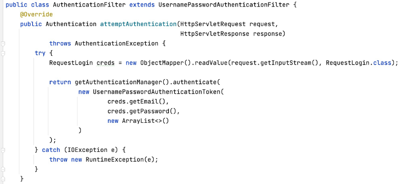
  + 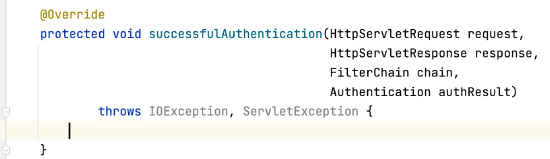
+ WebSecurity.java
  + 사용자 요청에 대해 AuthenticationFilter를 거치도록 수정
  + 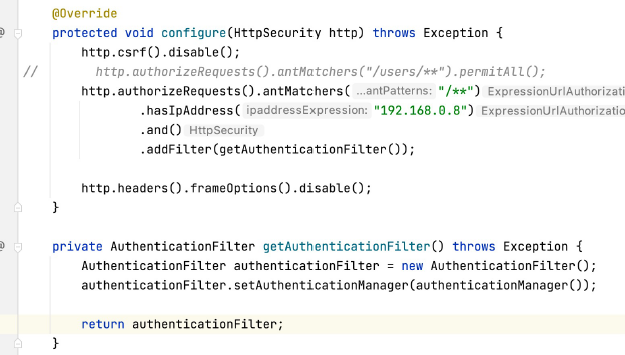
  + 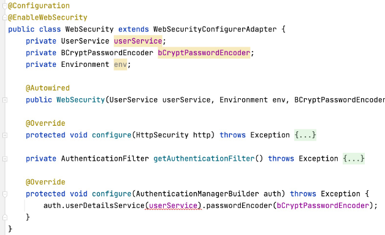
+ UserDetailsService 등록
  + 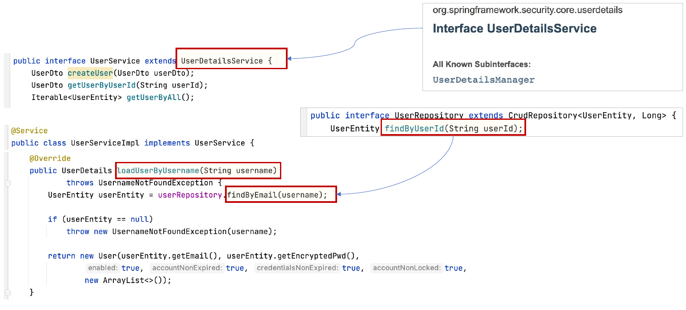
+ API Gateway Service 수정
  + User Service에 대한 Routes 정보수정
  + 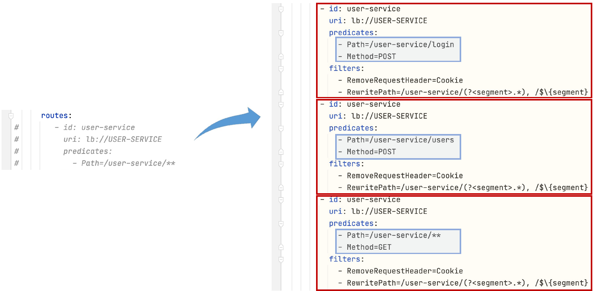
+ 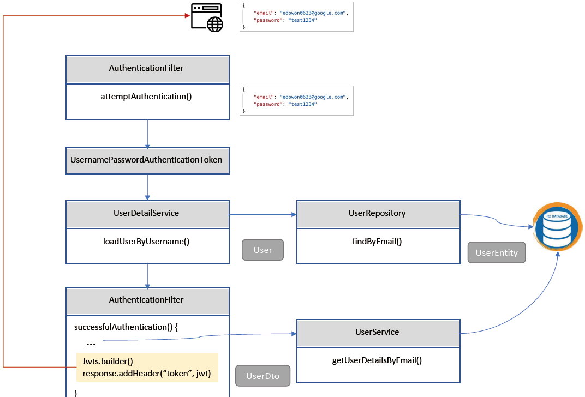
+ AuthenticationFilter.java의 successfulAuthentication() 수정
  + 인증 성공 시 사용자에게 Token 발생
  + 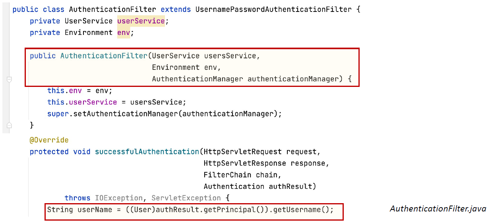
+ AuthenticationFilter.java의 successfulAuthentication() 수정
  + 인증 성공 시 사용자에게 Token 발생
  + 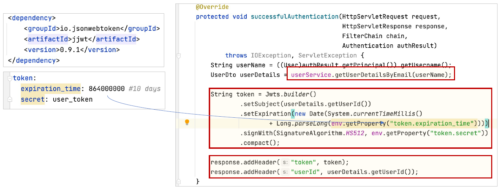
    + 위변조 판단을 위해서 token 과 userId 를 같이 전송
+ 전통적인 인증 시스템
  + 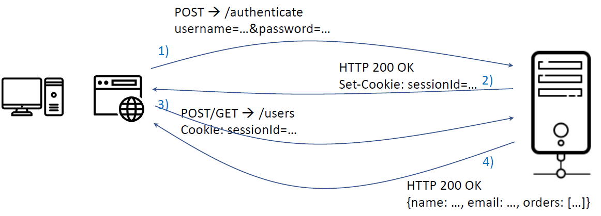
  + 문제점
    + 세션과 쿠키는 모바일 애플리케이션에서 유효하게 사용할 수 없다 (공유 불가)
    + 렌더링된 HTML 페이지가 반환되지만, 모바일 애플리케이션에서는 JSON(or XML)과 같은 포멧 필요
+ Token 기반 인증 시스템
  + 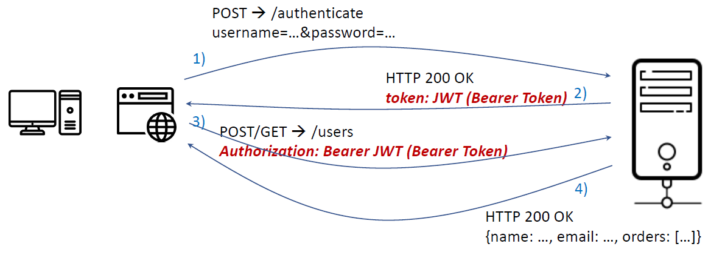
+ JWT (JSON Web Token)
  + [https://jwt.io/](https://jwt.io/)
  + 인증 헤더 내에서 사용되는 토큰 포맷
  + 두 개의 시스템끼리 안전한 방법으로 통신 가능
  + JWT (JSON Web Token) 장점
    + 클라이언트 독립적인 서비스 (stateless)
    + CDN
    + No Cookie-Session (No CSRF, 사이트간 요청 위조)
    + 지속적인 토큰 저장
    + 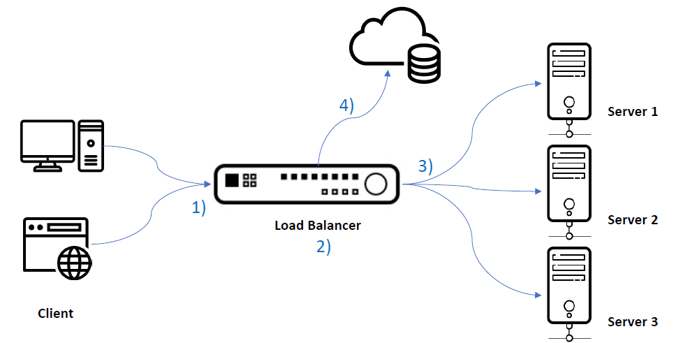
  + API Gateway service에 Spring Security와 JWT Token 사용 추가
    + 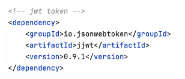
  + AuthorizationHeaderFilter.java 추가
    + 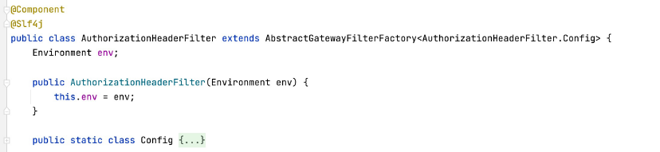
  + AuthorizationHeaderFilter.java
    + 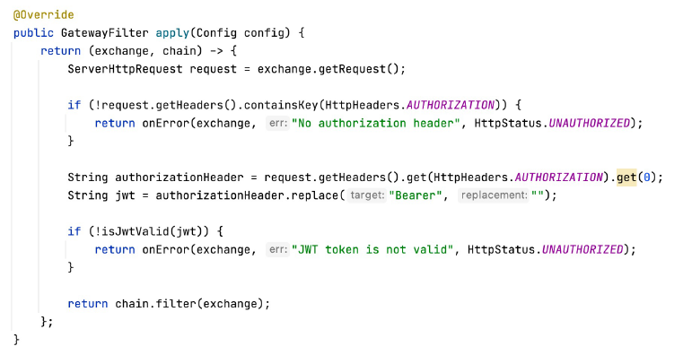
    + 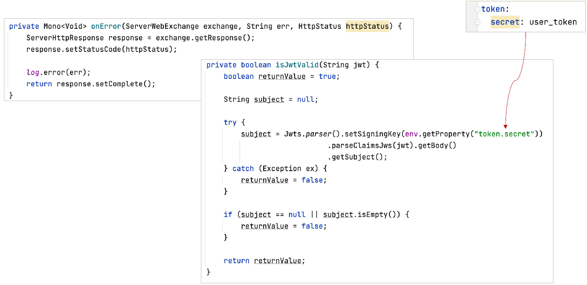
  + application.yml
    + 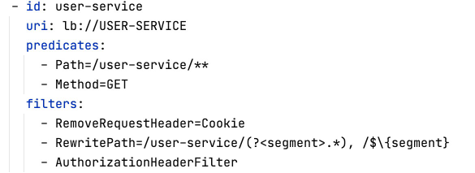
  + Test: Authorization Type à “Bearer Token” 
    + Bearer Authentication
      + API에 접속하기 위해서는 access token을 API 서버에 제출해서 인증 처리
      + OAuth를 위해서 고안된 방법, RFC 6750
