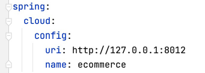
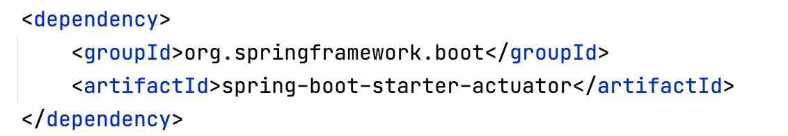

# Configuration Service

# Configuration Service
* toc
{:toc}

## Spring Cloud Config
+ 분산 시스템에서 서버, 클라이언트 구성에 필요한 설정 정보(application.yml)를 외부 시스템에서 관리
+ 하나의 중앙화 된 저장소에서 구성요소 관리 가능
+ 서비스를 다시 빌드하지 않고, 바로 적응 가능
+ 애플리케이션 배포 파이프라인을 통해 DEV – UAT – PROD 환경에 맞는 구성 정보 사용
+ 

## Local Git Repository
+ $ ~/Desktop/Work/git-local-repo 디렉토리 생성
+ $ cd git-local-repo
+ $ git init
+ ecommerce.yml 파일 생성
+ $ git add ecommerce.yml.
+ $ git commit –m “upload an application yaml file”
+ 
+ 

### Spring Cloud Config Project
+ 

### Spring Cloud Config Server 설정
+ Dependencies 추가
  + 
+ ConfigServiceApplication.java 파일 수정
  + 

### application.yml
+ 

### 우선순위
+ 

### http://127.0.0.1:8888/ecommerce/default
+ 

## Microservice에 적용
+ Dependencies 추가
  + spring-cloud-starter-config
  + spring-cloud-starter-bootstrap
    + or) spring.cloud.bootstrap.enabled=true
  + 
+ bootstrap.yml 추가
  + application.yml 보다 우선 순위가 높다
  + 

### Fetching config from server
+ 

### Changed configuration values
+ 서버 재기동
+ Actuator refresh
  + Spring Boot Actuator
    + Application 상태, 모니터링
    + Metric 수집을 위한 Http End point 제공
    + 
+ Spring cloud bus 사용

## Spring Boot Actuator
+ 
+ 
+ properties 값 수정 후 반영 (commit)
+ http://[service ip]/actuator/refresh
+ 번거로운 작업으로 인해 Spring Cloud Bus를 사용
+ 

