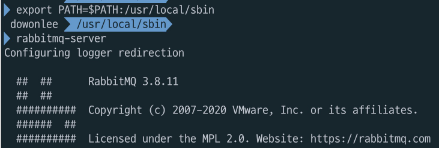
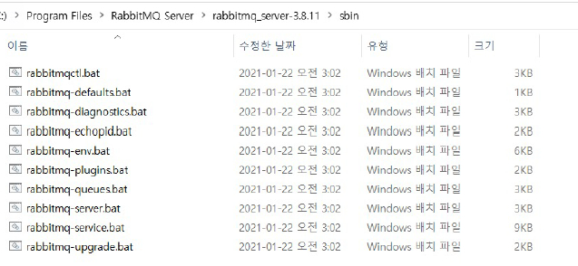

# Spring Cloud Bus

# Spring Cloud Bus
* toc
{:toc}

## Changed configuration values
+ 서버 재기동
+ Actuator refresh
  + Spring Boot Actuator
    + Application 상태, 모니터링
    + Metric 수집을 위한 Http End point 제공
    + 
+ Spring cloud bus 사용
  + 분산 시스템의 노드를 경량 메시지 브로커와 연결
  + 상태 및 구성에 대한 변경 사항을 연결된 노드에게 전달(Broadcast)

## Spring Cloud Bus
+ 
+ AMQP(Advanced Message Queuing Protocol), 메시지 지향 미들웨어를 위한 개방형 표준 응용 계층 프로토콜
  + 메시지 지향, 큐잉, 라우팅 (P2P, Publisher-Subcriber), 신뢰성, 보안
  + Erlang, RabbitMQ에서 사용
+ Kafka 프로젝트
  + Apache Software Foundation이 Scalar 언어로 개발한 오픈 소스 메시지 브로커 프로젝트
  + 분산형 스트리밍 플랫폼
  + 대용량의 데이터를 처리 가능한 메시징 시스템
+ RabbitMQ VS Kafka
  + RabbitMQ
    + 메시지 브로커
    + 초당 20+ 메시지를 소비자에게 전달
    + 메시지 전달 보장, 시스템 간 메시지 전달
    + 브로커, 소비자 중심 
  + Kafka
    + 초당 100k+ 이상의 이벤트 처리
    + Pub/Sub, Topic에 메시지 전달 
    + Ack를 기다리지 않고 전달 가능
    + 생산자 중심 
  + 
  + 
+ Actuator bus-refresh Endpoint
  + 분산 시스템의 노드를 경량 메시지 브로커와 연결
  + 상태 및 구성에 대한 변경 사항을 연결된 노드에게 전달(Broadcast)
  + 

## Rabbit MQ 설치
+ 
+ MacOS)
  + $ brew update
  + $ brew install rabbitmq
    + 
    + 
    + 
    + 
  + $ export PATH=$PATH:/usr/local/sbin
  + $ rabbitmq-server
    + 
  + 
  + 

### Rabbit MQ 설치 – Windows 10
+ Erlang 설치
  + 
  + 
  + 
  + 
+ RabbitMQ 설치
  + 
  + 
  + 
  + 
  + 
  + 
  + 
  + 
  + 
+ Management Plugin 설치
  + 
  + 
+ http://127.0.0.1:15672
  + 
  + 
  + 
  
## AMQP 사용

### Dependencies 추가
+ Config Server
  + AMQP for Spring Cloud Bus, Actuator
  + 
+ Users Microservice, Gateway Service
  + AMQP for Spring Cloud Bus
  + 

### application.yml 수정
+ Config Server, Users Microservice, Gateway Service
  + 
  + 
  + Spring Cloud 2020.0.0에서 bus-env -> busenv, bus-refresh -> busrefresh

## Actuator
+ Stop RabbitMQ server
  + 
+ Start RabbitMQ server again
  + 
