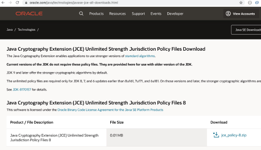
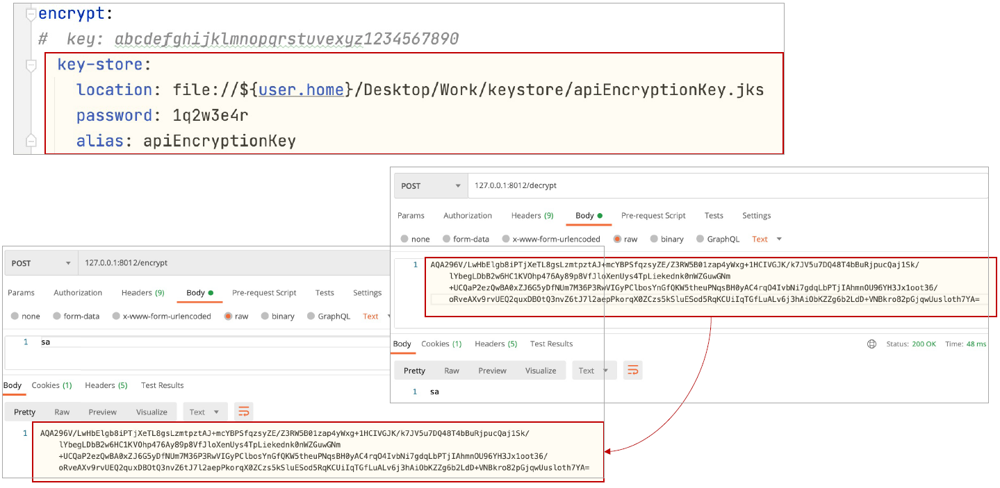

# 암호화 처리를 위한 Encryption과 Decryption

# 암호화 처리를 위한 Encryption과 Decryption
* toc
{:toc}

## Encryption types
+ Symmetric Encryption (Shared) - 대칭 암호화(공유)
  + Using the same key - 동일한 키 사용
+ Asymmetric Encryption (RSA Keypair) - 비대칭 암호화(RSA 키 쌍)
  + Private and Public Key - 개인 및 공개 키
  + Using Java keytool - 자바 키 도구 사용
+ 

## Java Cryptography Extension (JCE)
+ JCE 사용 시에 다음과 같은 오류 발생할 때, 제한 없는 암호화 정책 파일로 교체 - 자바 8일 때 
  + Illegal key size or default parameters - 잘못된 키 크기 또는 기본 매개 변수
  + Unsupported keysize or algorithm parameters - 지원되지 않는 키 크기 또는 알고리즘 매개 변수
+ [https://www.oracle.com/java/technologies/javase-jce-all-downloads.html](https://www.oracle.com/java/technologies/javase-jce-all-downloads.html)
  + 
  + 
+ 압축 해제 후, jre/lib/security 폴더로 복사
  + 
  + 
+ Windows)
  + Oracle JDK
    + ${user.home}\Program Files\Java\jdk-13.0.2\conf\security
+ MacOS)
  + Oracle JDK
    + ${user.home}/Library/Java/JavaVirtualMachines/jdk1.8.0_191.jdk/Contents/Home/jre/lib/security
  + Open JDK
    + ${user.home}/Library/Java/JavaVirtualMachines/openjdk-14.0.2/Contents/Home/conf/security

## Symmetric Encryption
+ Config Server의 Dependencies
  + 
+ bootstrap.yml
  + 
+ 
+ 
+ Users Microservice의 application.yml, bootstrap.yml 수정 -> Config Server의 user-service.yml로 이동
  + 
+ Users Microservice의 H2 Database의 Password를 Encryption
  + 
+ Spring Cloud Config Server에서 확인
  + 
+ Spring Cloud Config Server의 user-service.yml 변경 -> invalid <n/a>
  + 

## Asymmetric Encryption
+ Public, Private Key 생성 -> JDK keytool 이용
+ $ mkdir ${user.home}/Desktop/Work/keystore
+ $ keytool -genkeypair -alias apiEncryptionKey -keyalg RSA \
  -dname "CN=Kenneth Lee, OU=API Development, O=joneconsulting.co.kr, L=Seoul, C=KR" \
  -keypass "1q2w3e4r" -keystore apiEncryptionKey.jks -storepass "1q2w3e4r
+ 
+ 
+ 
+ 

