# 마이크로서비스간 통신

# 마이크로서비스간 통신
* toc
{:toc}

## Communication Types
+ Synchronous HTTP communication - 동기식 HTTP 통신
+ Asynchronous communication over AMQP - AMQP를 통한 비동기 통신
  + 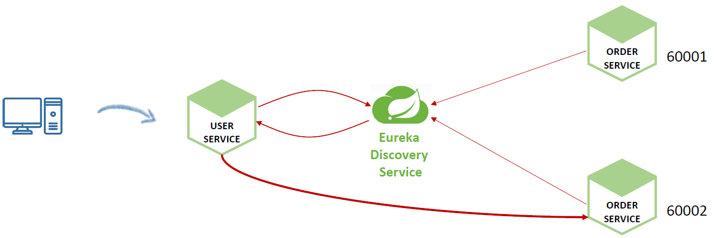
+ Rest Template
  + 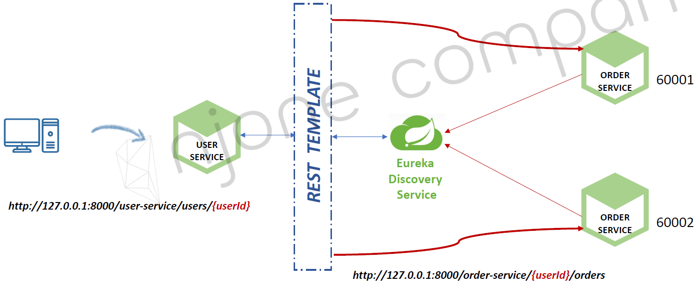

## RestTemplate

### Users Service -> Order Service
+ 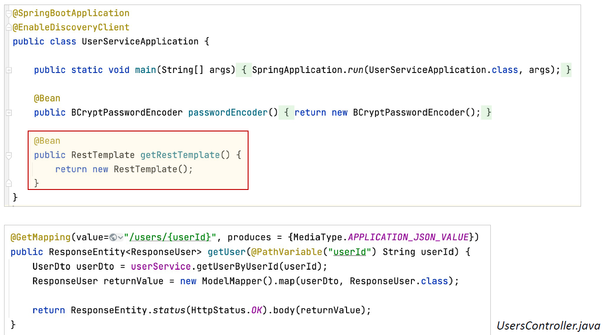
+ 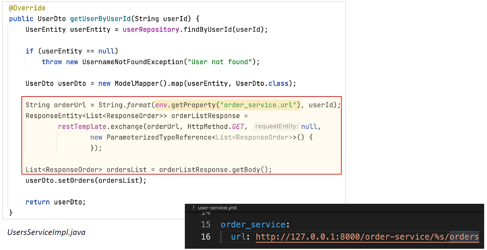
+ 
+ 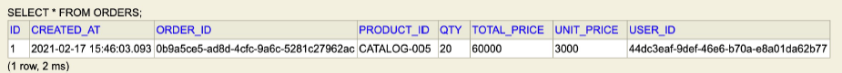
+ 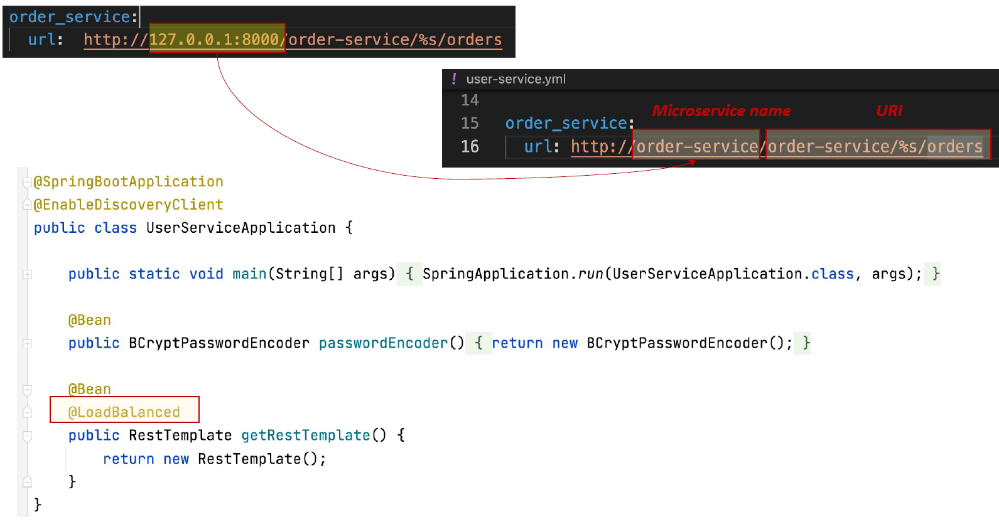

## Feign Web Service Client
+ FeignClient -> HTTP Client
  + REST Call을 추상화 한 Spring Cloud Netflix 라이브러리
+ 사용방법
  + 호출하려는 HTTP Endpoint에 대한 Interface를 생성
  + @FeignClient 선언
+ Load balanced 지원

### Feign Client 적용
+ Spring Cloud Netflix 라이브러리 추가
+ @FeignClient Interface 생성
+ 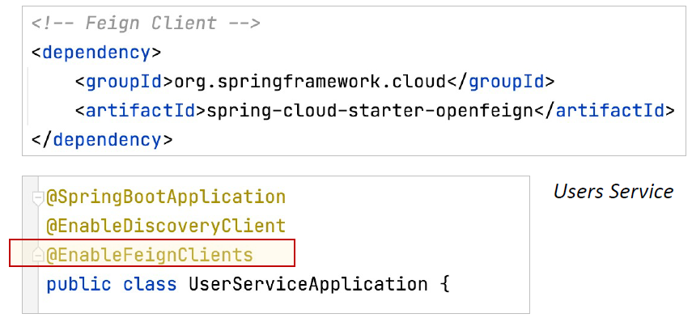
+ 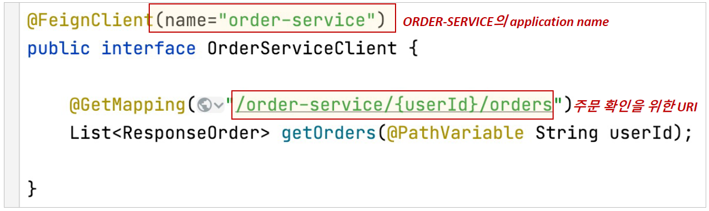

### Feign Client 생성
+ UserServiceImpl.java에서 Feign Client 사용
+ 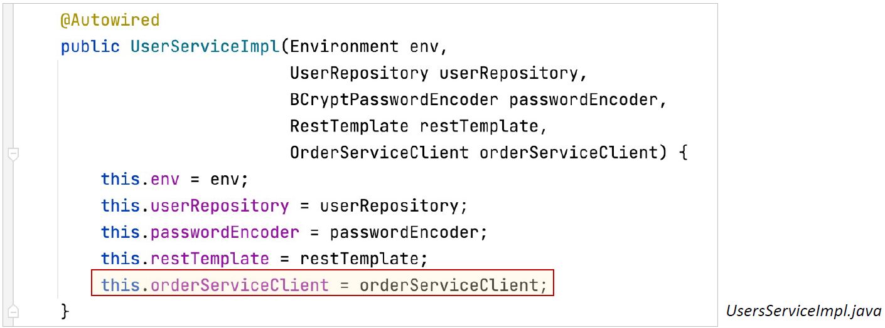
+ 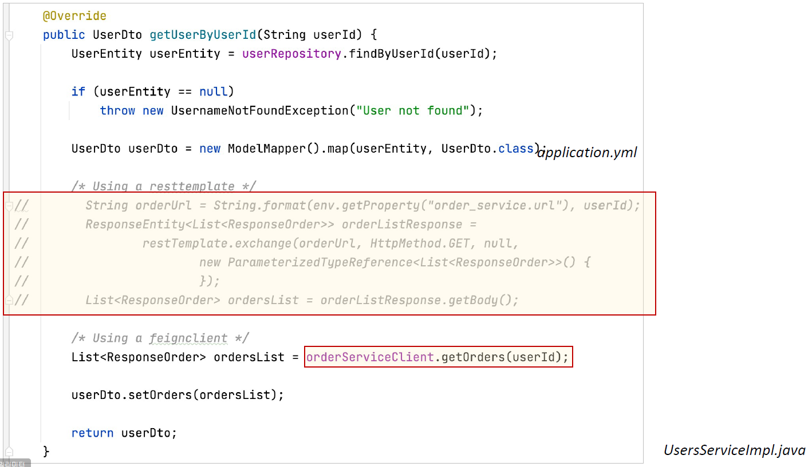

### Feign Client에서 로그 사용
+ 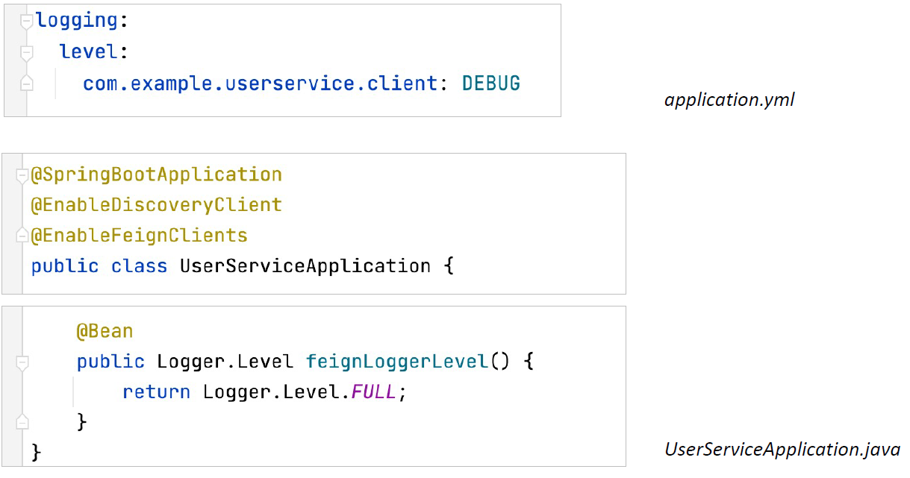
+ 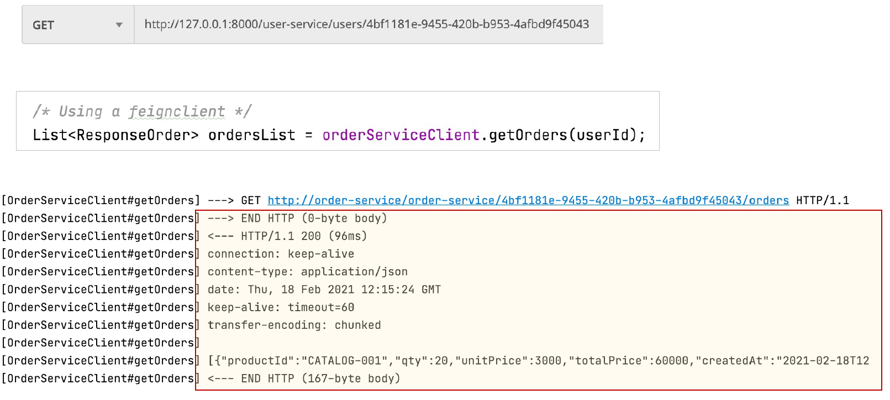

### FeignException
+ 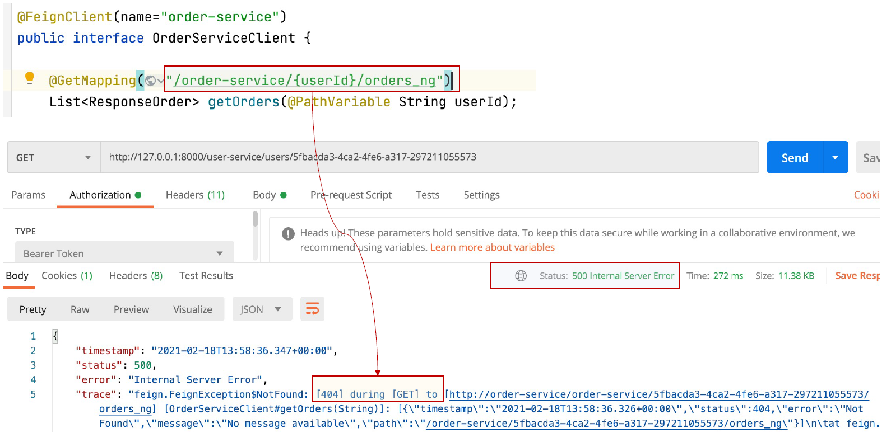
+ FeignException 처리
  + 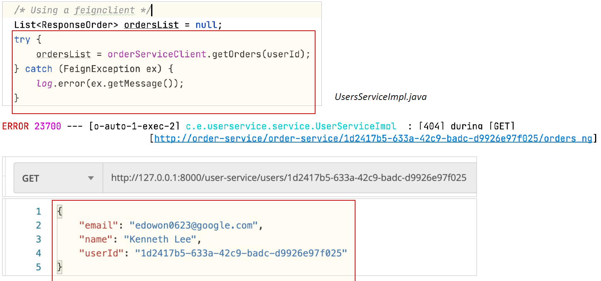

### FeignErrorDecoder 
+ ErrorDecoder 구현
  + 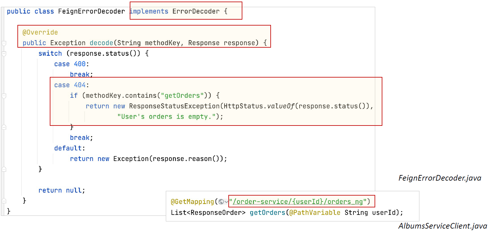
+ Application 클래스에 ErrorDecoder 빈 등록
  + 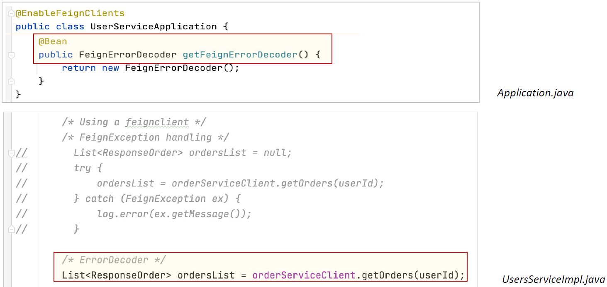
+ Properties 파일적용
  + 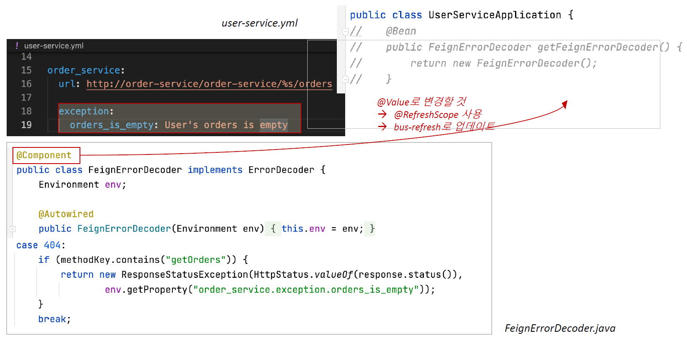

## Multiple Orders Service
+ Orders Service 2개 기동
+ Orders 데이터도 분산 저장 -> 동기화 문제
  + 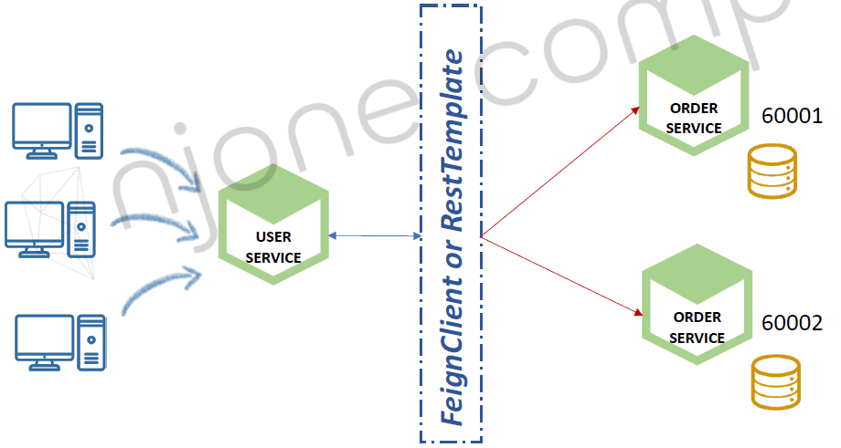
  + 하나의 Database 사용
    + 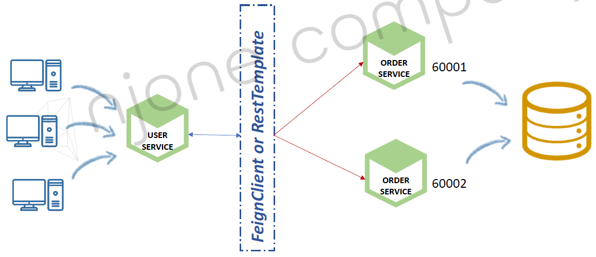
  + Database간의 동기화
    + 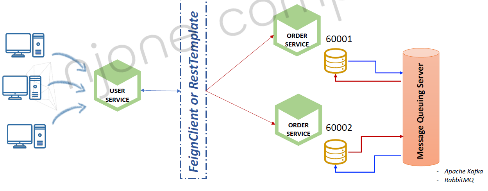
  + Kafka Connector + DB
    + 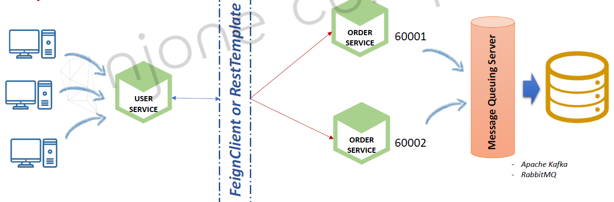
