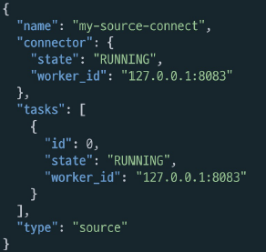

# 데이터 동기화를 위한 Kafka 활용

# 데이터 동기화를 위한 Kafka 활용
* toc
{:toc}

## Apache Kafka
+ Apache Software Foundation의 Scalar 언어로 된 오픈 소스 메시지 브로커 프로젝트
  + Open Source Message Broker Project
+ 링크드인(Linked-in)에서 개발, 2011년 오픈 소스화
  + 2014년 11월 링크드인에서 Kafka를 개발하던 엔지니어들이 Kafka개발에 집중하기 위해
    Confluent라는 회사 창립
+ 실시간 데이터 피드를 관리하기 위해 통일된 높은 처리량, 낮은 지연 시간을 지닌 플랫폼 제공
+ Apple, Netflix, Shopify, Yelp, Kakao, New York Times, Cisco, Ebay, Paypal, Hyperledger Fabric, Uber, Salesforce.com 등이 사용
+ Kafka 사용 이전
  + 
    + End-to-End 연결 방식의 아키텍처
    + 데이터 연동의 복잡성 증가 (HW, 운영체제, 장애 등)
    + 서로 다른 데이터 Pipeline 연결 구조
    + 확장이 어려운 구조
+ Kafka 탄생배경
  + 모든 시스템으로 데이터를 실시간으로 전송하여 처리 할 수 있는 시스템
  + 데이터가 많아지더라도 확장이 용이한 시스템
+ Kafka 데이터 처리 흐름
  + 
+ Kafka Broker
  + 실행 된 Kafka 애플리케이션 서버
  + 3대 이상의 Broker Cluster 구성
  + Zookeeper 연동
    + 서버, 서버의 상태, 리더, 장애, 복구 코디네이터 
    + 역할: 메타데이터 (Broker ID, Controller ID 등) 저장
    + Controller 정보 저장
  + n개 Broker 중 1대는 Controller 기능 수행
    + Controller 역할
      + 각 Broker에게 담당 파티션 할당 수행
      + Broker 정상 동작 모니터링 관리
  + 

## Kafka 설치
+ [http://kafka.apache.org/](http://kafka.apache.org/)
  + 다운받은 kafka_2.13-2.7.0.tgz 파일을 작업 디렉토리로 이동하고 압축 해제
  
## Ecosystem ① - Kafka Client
+ Kafka와 데이터를 주고받기 위해 사용하는 Java Library
  + [https://mvnrepository.com/artifact/org.apache.kafka/kafka-clients](https://mvnrepository.com/artifact/org.apache.kafka/kafka-clients)
+ Producer, Consumer, Admin, Stream 등 Kafka관련 API 제공
  + 다양한 3rd party library 존재: C/C++, Node.js, Python, .NET 등
  + [https://cwiki.apache.org/confluence/display/KAFKA/Clients](https://cwiki.apache.org/confluence/display/KAFKA/Clients)
  + 

### Kafka 서버 기동
+ Zookeeper 및 Kafka 서버 구동
  + $KAFKA_HOME/bin/zookeeper-server-start.sh $KAFKA_HOME/config/zookeeper.properties
  + $KAFKA_HOME/bin/kafka-server-start.sh $KAFKA_HOME/config/server.properties
+ Topic 생성
  + $KAFKA_HOME/bin/kafka-topics.sh --create --topic quickstart-events --bootstrap-server localhost:9092 \ --partitions 1
+ Topic 목록 확인
  + $KAFKA_HOME/bin/kafka-topics.sh --bootstrap-server localhost:9092 --list
+ Topic 정보 확인
  + $KAFKA_HOME/bin/kafka-topics.sh --describe --topic quickstart-events --bootstrap-server localhost:9092

### Kafka 서버 기동 – Windows 
+ 다운받은 kafka_2.13-2.7.0.tgz 파일을 C:\Work\ 디렉토리로 이동, 압축 해제
  + Windows에서는 Kafka 실행 명령어는 $KAFKA_HOME\bin\windows 폴더에 저장되어 있다
  + 

### Kafka Producer/Consumer 테스트
+ 메시지 생산
  + $KAFKA_HOME/bin/kafka-console-producer.sh --broker-list localhost:9092 --topic quickstart-events
  + 
+ 메시지 소비
  + $KAFKA_HOME/bin/kafka-console-consumer.sh --bootstrap-server localhost:9092 --topic quickstart-events \ --from-beginning
  + 

## Ecosystem ② - Kafka Connect
+ Kafka Connect를 통해 Data를 Import/Export 가능
+ 코드 없이 Configuration으로 데이터를 이동
+ Standalone mode, Distribution mode 지원
  + RESTful API 통해 지원
  + Stream 또는 Batch 형태로 데이터 전송 가능
  + 커스텀 Connector를 통한 다양한 Plugin 제공 (File, S3, Hive, Mysql, etc …)
  + 

### Kafka Connect 설치 – MacOS 
+ Kafka Connect 설치
  + curl -O http://packages.confluent.io/archive/5.5/confluent-community-5.5.2-2.12.tar.gz
  + curl -O http://packages.confluent.io/archive/6.1/confluent-community-6.1.0.tar.gz
  + tar xvf confluent-community-6.1.0.tar.gz
  + cd $KAFKA_CONNECT_HOME
+ Kafka Connect 설정 (기본으로 사용)
  + $KAFKA_HOME/config/connect-distributed.properties
+ Kafka Connect 실행
  + /bin/connect-distributed ./etc/kafka/connect-distributed.properties
+ Topic 목록 확인
  + ./bin/kafka-topics.sh --bootstrap-server localhost:9092 --list
  + 

### JDBC Connector 설정 – MacOS
+ JDBC Connector 설치
  + [https://docs.confluent.io/5.5.1/connect/kafka-connect-jdbc/index.html](https://docs.confluent.io/5.5.1/connect/kafka-connect-jdbc/index.html)
    + Download and extract the ZIP file à confluentinc-kafka-connect-jdbc-10.0.1.zip 다운로드
+ etc/kafka/connect-distributed.properties 파일 마지막에 아래 plugin 정보 추가
  + plugin.path=[confluentinc-kafka-connect-jdbc-10.0.1 폴더]
  + 
+ JdbcSourceConnector에서 MariaDB 사용하기 위해 mariadb 드라이버 복사
  + ./share/java/kafka/ 폴더에 mariadb-java-client-2.7.2.jar 파일 복사

### Kafka Connect 설치 – Windows
+ Kafka Connect 설치 -> Windows 10에서도 curl, tar 명령어 사용 가능
  + curl -O http://packages.confluent.io/archive/5.5/confluent-community-5.5.2-2.12.tar.gz
  + curl -O http://packages.confluent.io/archive/6.1/confluent-community-6.1.0.tar.gz
  + tar xvf confluent-community-6.1.0.tar.gz
  + cd $KAFKA_CONNECT_HOME
+ Kafka Connect 실행
  + .\bin\windows\connect-distributed.bat . \etc\kafka\connect-distributed.properties
+ 실행 시 아래와 같은 오류 발생하면, binary 파일 대신 source 파일을 다운로드 받은 것인지 확인
  + Classpath is empty. Please build the project first e.g. by running ‘gradlew jarAll’
  + 
+ .\bin\windows\kafka-run-class.bat 파일에서
  + rem Classpath addition for core 부분을 찾아서, 그 위에 아래 코드 삽입
    + 

### JDBC Connector 설정 – Windows
+ .\etc\kafka\connect-distributed.properties 파일 마지막에 아래 plugin 정보 추가
  + 
+ JdbcSourceConnector에서 MariaDB 사용하기 위해 mariadb 드라이버 복사
  + ${USER.HOME}\.m2 폴더에서 mariadb-java-client-2.7.2.jar 파일을 ./share/java/kafka/로 복사
  + 

### Kafka Source Connect 테스트
+ Kafka Source Connect 추가 (MariaDB)
  + 
+ Kafka Connect 목록확인
  + curl http://localhost:8083/connectors | jq
+ Kafka Connect 확인
  + curl http://localhost:8083/connectors/my-source-connect/status | jq
  + 
+ MariaDB에서 데이터 추가 1)
  + 

### Kafka Sink Connect 테스트
+ Kafka Sink Connect 추가(MariaDB)
  + 
+ MariaDB에서 데이터 추가 2)
  + 
+ Kafka Producer를이용해서Kafka Topic에데이터직접전송
  + Kafka-console-producer에서 데이터 전송 -> Topic에 추가 -> MariaDB에 추가
  + 
