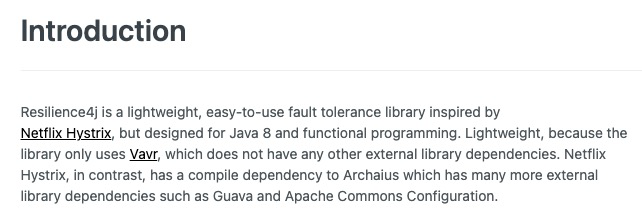

# 장애 처리와 Microservice 분산 추적

# 장애 처리와 Microservice 분산 추적
* toc
{:toc}

## Microservice 통신 시 연쇄 오류
+ 
+ 

## CircuitBreaker
+ [https://martinfowler.com/bliki/CircuitBreaker.html](https://martinfowler.com/bliki/CircuitBreaker.html)
+ 장애가 발생하는 서비스에 반복적인 호출이 되지 못하게 차단
+ 특정 서비스가 정상적으로 동작하지 않을 경우 다른 기능으로 대체 수행 -> 장애 회피
+ 
+ 

## Spring Cloud Betflix Hystrix
+ Spring Cloud Netflix Hystrix
  + pom.xml (User-ws)
    + 
  + Application.java (User-ws)
    + 
  + application.yml (User-ws)
    + 
+ Hystrix 지원 끝 Resilience4j 사용
  + 

## Resilience4j
+ resilience4j-circuitbreaker: Circuit breaking
+ resilience4j-ratelimiter: Rate limiting
+ resilience4j-bulkhead: Bulkheading
+ resilience4j-retry: Automatic retrying (sync and async)
+ resilience4j-timelimiter: Timeout handling
+ resilience4j-cache: Result caching
+ [https://resilience4j.readme.io/docs/getting-started](https://resilience4j.readme.io/docs/getting-started)
+ [https://github.com/resilience4j/resilience4j](https://github.com/resilience4j/resilience4j)
+ 

### Resilience4j – CircuitBreaker
+ DefaultConfiguration
  + pom.xml
    + 
  + UserServiceImpl.java
    + 
    + 
  + 
+ Customize CircuitBreakerFactory -> Resilience4JCircuitBreakerFactory
  + 
  + 

## Microservice 분산 추적
+ Zipkin
  + [https://zipkin.io/](https://zipkin.io/)
  + Twitter에서 사용하는 분산 환경의 Timing 데이터 수집, 추적 시스템 (오픈소스)
  + Google Drapper에서 발전하였으며, 분산환경에서의 시스템 병목 현상 파악
  + Collector, Query Service, Databasem WebUI로 구성
  + Span
    + 하나의 요청에 사용되는 작업의 단위
    + 64 bit unique ID
  + Trace
    + 트리 구조로 이뤄진 Span 셋
    + 하나의 요청에 대한 같은 Trace ID 발급
  + 
+ Spring Cloud Sleuth
  + 스프링 부트 애플리케이션을 Zipkin과 연동
  + 요청 값에 따른 Trace ID, Span ID 부여
  + Trace와 Span Ids를 로그에 추가 가능
    + servlet filter
    + rest template
    + scheduled actions
    + message channels
    + feign client
+ Spring Cloud Sleuth + Zipkin
  + 
+ Zipkin server 설치
  + 
  + 
+ Zipkin server 기동
  + 
  + 

### Users Microservice 수정
+ 
+ Trace ID and Span ID
  + 
  + 
  + 
  + 
+ Zipkin server 활용
  + 
  + 
+ Zipkin에서의 추적
  + 
+ Orders Microservice 장애 발생
  + 
  + 
  + 
