# Microservice 모니터링

# Microservice 모니터링
* toc
{:toc}

## Hystrix Dashboard + Turbine Server

### Turbine Server 
+ 마이크로서비스에 설치된 Hystrix 클라이언트의 스트림을 통합
  + 마이크로서비스에서 생성되는 Hystrix 클라이언트 스트림 메시지를 터빈 서버로 수집
+ 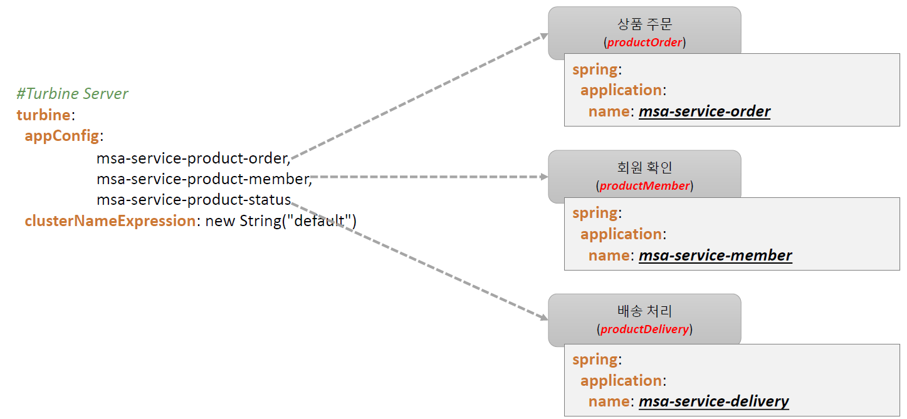

### Hystrix Dashboard
+ Web Dashboard
  + 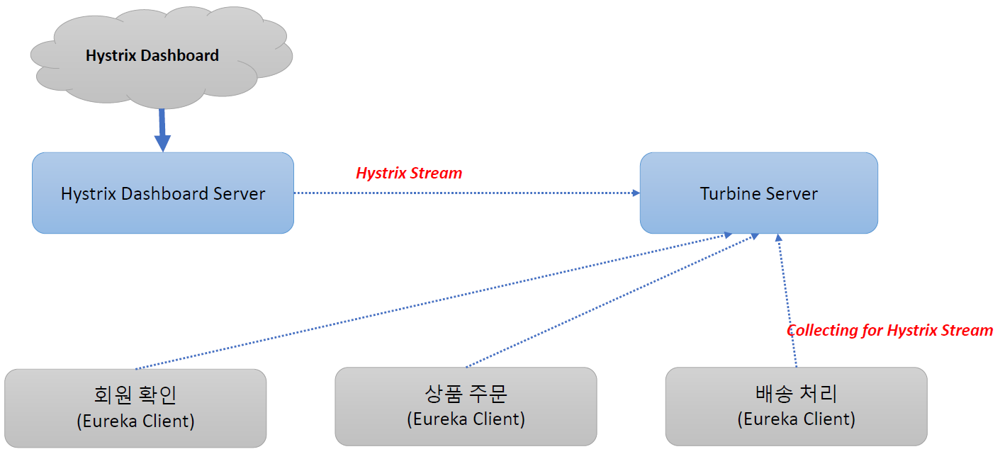
+ 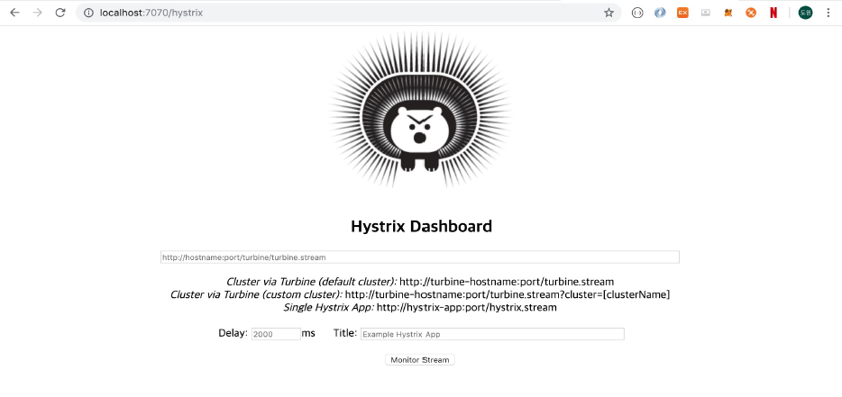
+ 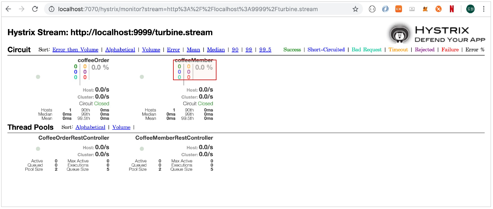

## Micrometer + Monitoring
+ 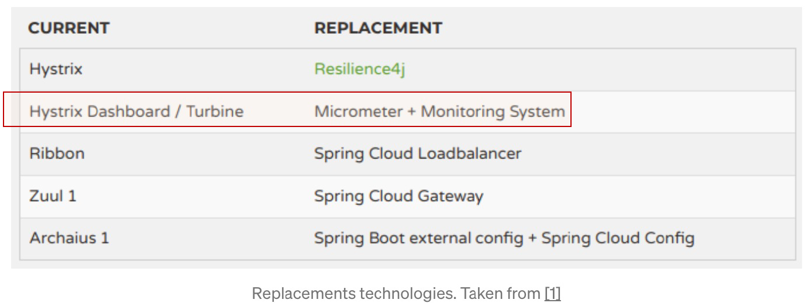

### Micrometer
+ Micrometer
  + [https://micrometer.io/](https://micrometer.io/)
  + JVM기반의 애플리케이션의 Metrics 제공
  + Spring Framework 5, Spring Boot 2부터 Spring의 Metrics 처리
  + Prometheus등의 다양한 모니터링 시스템 지원
+ Timer
  + 짧은 지연 시간, 이벤트의 사용 빈도를 측정
  + 시계열로 이벤트의 시간, 호출 빈도 등을 제공
  + @Timed 제공

### Microservice 수정
+ 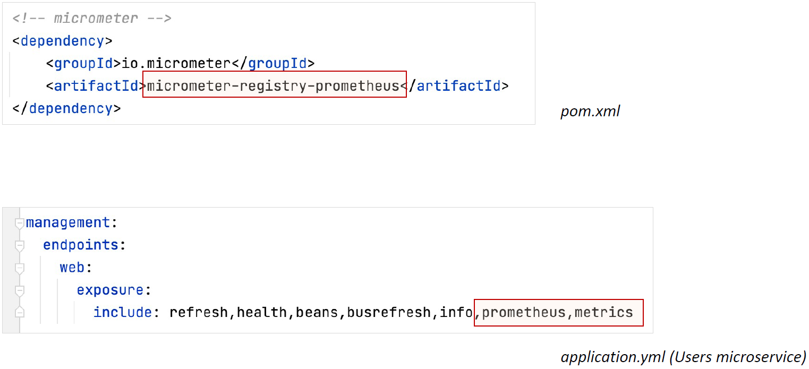
+ 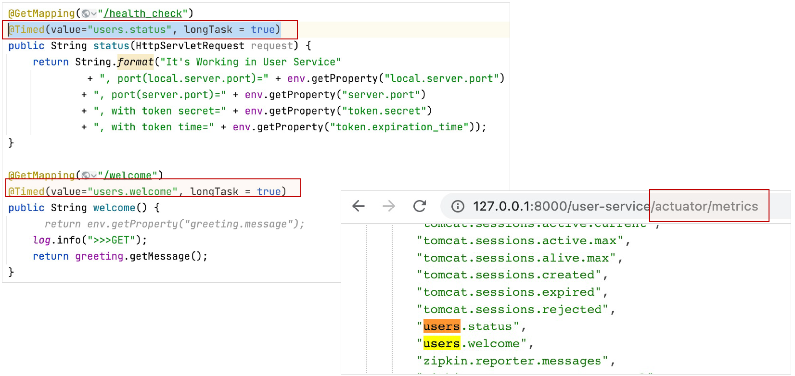
+ metrics 정보
  + 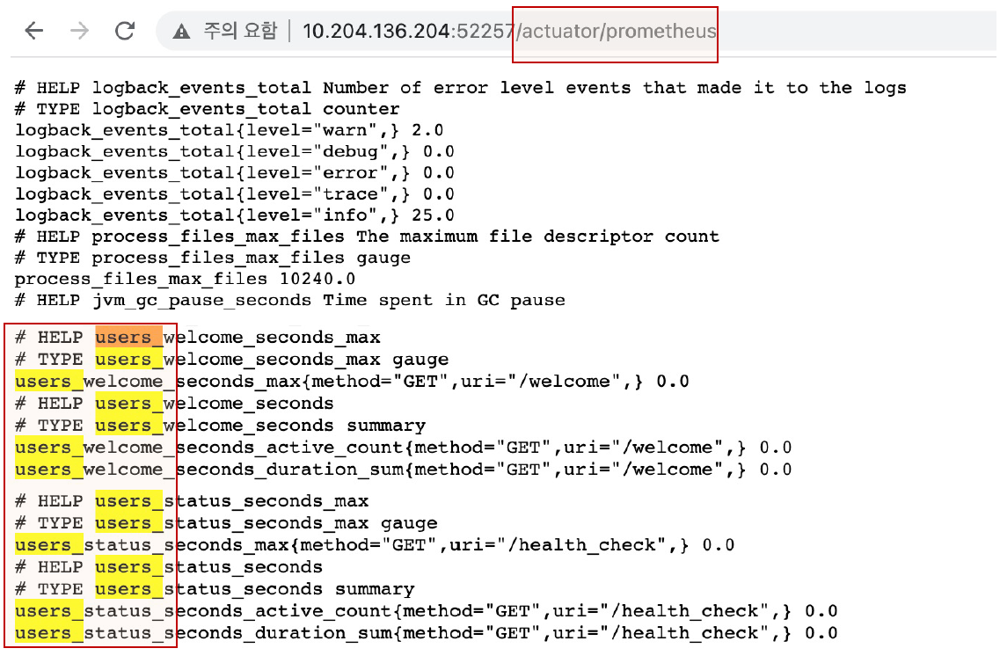

## Prometheus + Grafana
+ Prometheus
  + Metrics를 수집하고 모니터링 및 알람에 사용되는 오픈소스 애플리케이션
  + 2016년부터 CNCF에서 관리되는 2번째 공식 프로젝트
    + Level DB -> Time Series Database(TSDB)
  + Pull 방식의 구조와 다양한 Metric Exporter 제공
  + 시계열 DB에 Metrics 저장 -> 조회 가능 (Query)
+ Grafana
  + 데이터 시각화, 모니터링 및 분석을 위한 오픈소스 애플리케이션
  + 시계열 데이터를 시각화하기 위한 대시보드 제공
+ 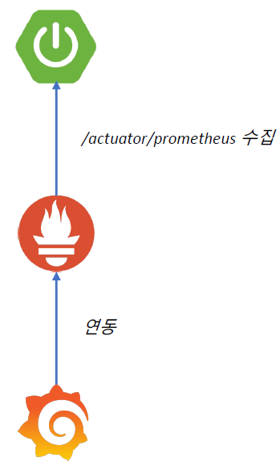

### Prometheus 설치
+ Prometheus 다운로드
  + [https://prometheus.io/download/](https://prometheus.io/download/)

### Prometheus
+ prometheus.yml 파일 수정
  + target 지정
  + 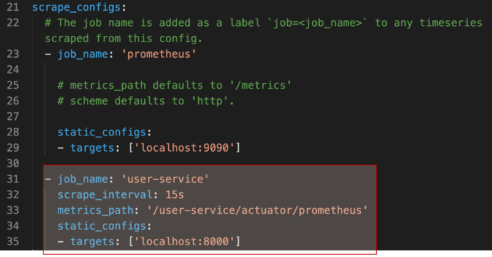
+ Prometheus 서버 실행
  + 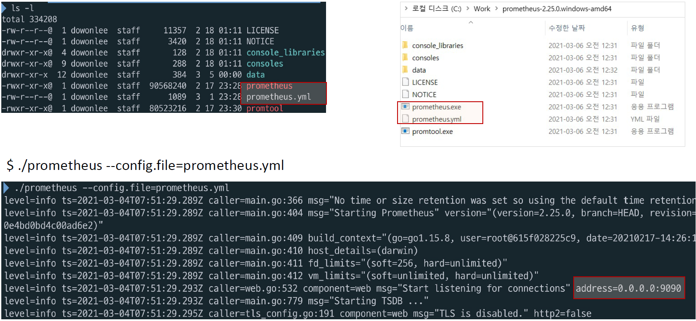
+ Prometheus Dashboard
  + http://127.0.0.1:9090/
  + 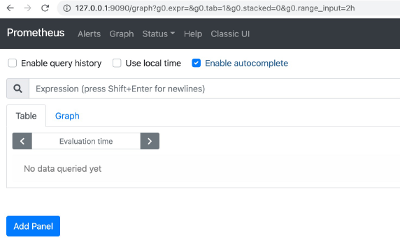
+ metrics 검사 – Table 
  + 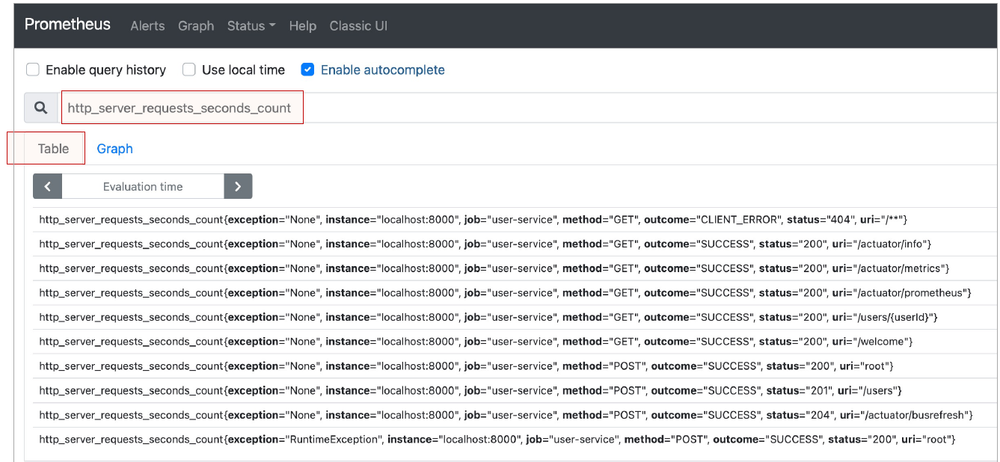
+ metrics 검사 – Graph 
  + 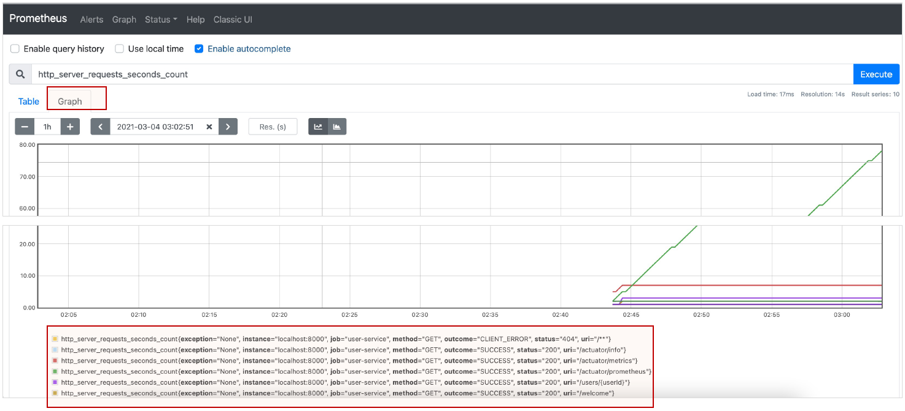

### Grafana
+ Grafana 다운로드 – MacOS
  + 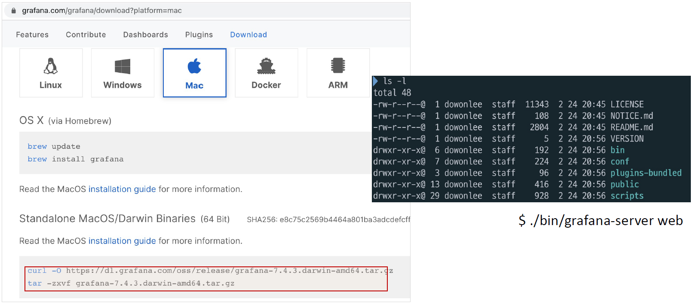
+ Grafana 다운로드– Windows
  + 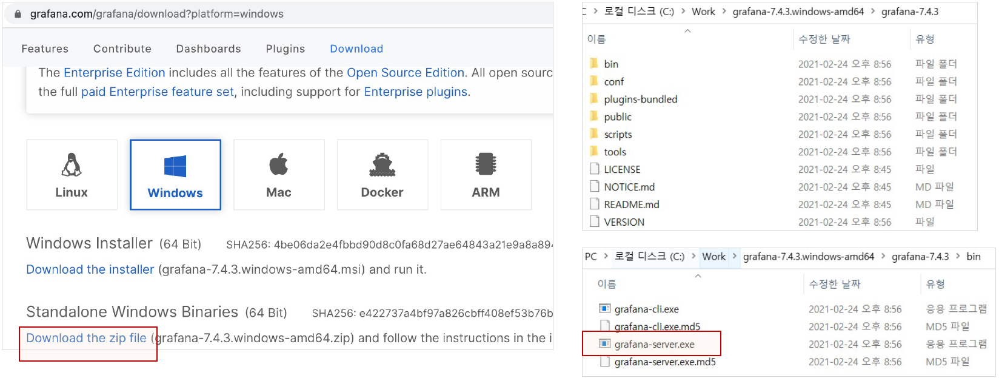
+ Grafana 실행
  + http://127.0.0.1:3000/
  + ID: admin, PW: admin
  + 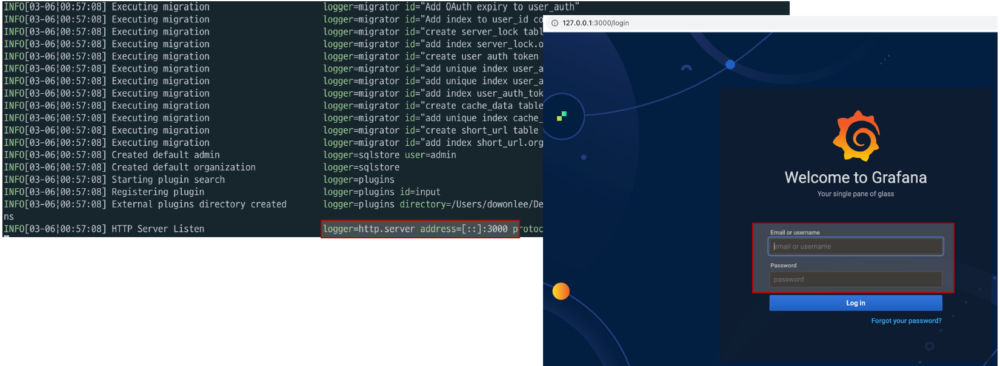
+ Grafana – Prometheus 연동
  + 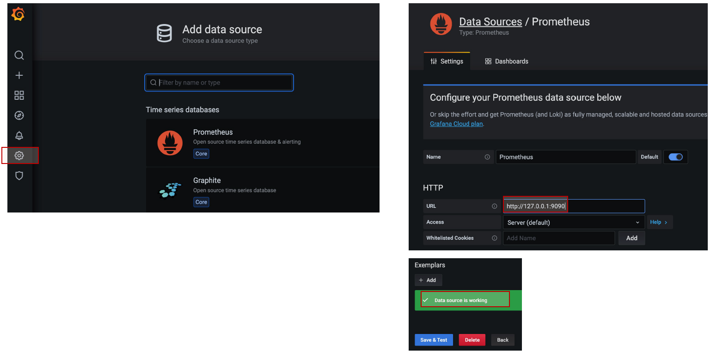
+ Grafana Dashboard
  + JVM(Micrometer)
  + Prometheus
  + Spring Cloud Gateway
  + 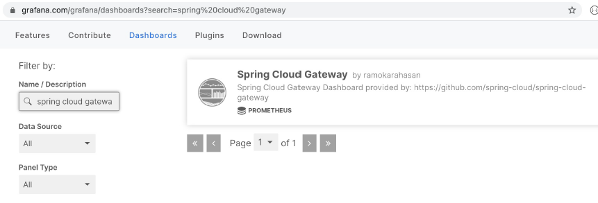
+ Grafana – Prometheus 연동
  + 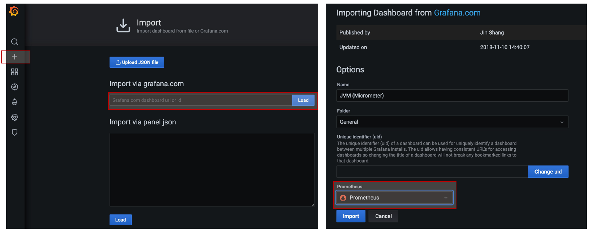
+ Grafana Dashboard
  + 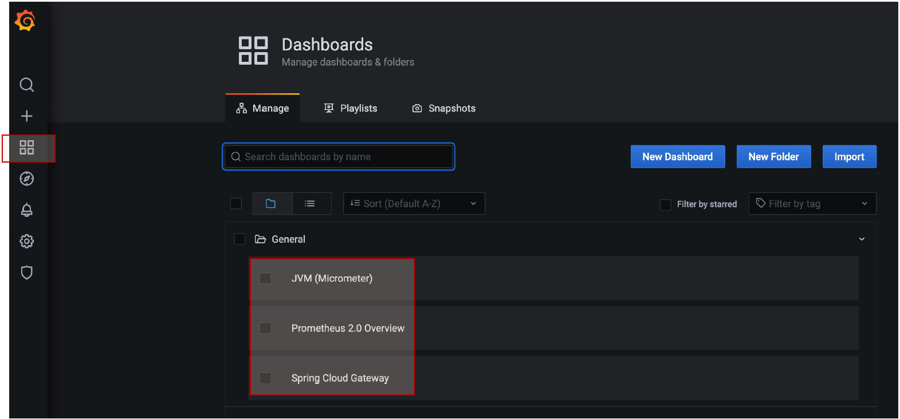
+ Spring Cloud Gateway dashboard
  + 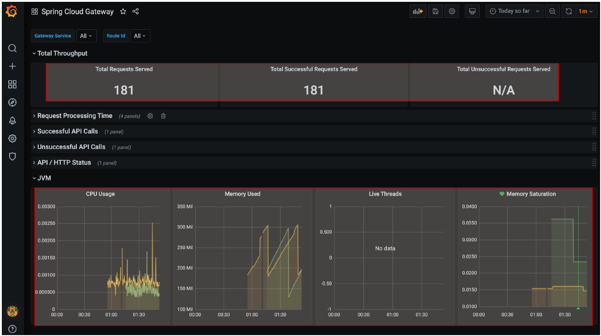
