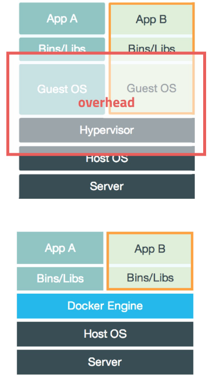

# 애플리케이션 배포를 위한 컨테이너 가상화

# 애플리케이션 배포를 위한 컨테이너 가상화
* toc
{:toc}

## Container Virtualization - 컨테이너 가상화

### Virtualization
+ 물리적인 컴퓨터 리소스를 다른 시스템이나 애플리케이션에서 사용할 수 있도록 제공
  + 플랫폼 가상화
  + 리소스 가상화
+ 하이퍼바이저 (Hypervisor)
  + Virtual Machine Manager (VMM)
  + 다수의 운영체제를 동시에 실행하기 위한 논리적 플랫폼
  + 
    + Type 1: Native or Bare-metal
    + Type 2: Hosted

### Container Virtualization
+ OS Virtualization
  + Host OS 위에 Guest OS 전체를 가상화
  + VMWare, VirtualBox
  + 자유도가 높으나, 시스템에 부하가 많고 느려진다
+ Container Virtualization
  + Host OS가 가진 리소스를 적게 사용하며, 필요한 프로세스 실행
  + 최소한의 라이브러리와 도구만 포함
  + Container의 생성 속도 빠름
  + 

### Container Image
+ Container 실행에 필요한 설정 값
  + 상태값 X, Immutable - 불변의 
+ Image를 가지고 실체화 -> Container
  + 

### Dockerfile
+ Docker Image를 생성하기 위한 스크립트 파일
+ 자체 DSL(Domain-Specific language) 언어 사용 -> 이미지 생성과정 기술
+ 

## Docker Desktop
+ [https://www.docker.com/products/docker-desktop](https://www.docker.com/products/docker-desktop)
+ 

## Docker 실행
+ $ docker run [OPTIONS] IMAGE[:TAG|@DIGEST] [COMMAND] [ARG…]
  + 
+ $ docker run ubuntu:16.04
  + 
+ $ docker run -d -p 3306:3306 -e MYSQL_ALLOW_EMPTY_PASSWORD=true --name mysql mysql:5.7
  + 
+ $ docker exec –it mysql bash
  + 

## Dockerfile for Users Microservice 
+ [https://hub.docker.com/](https://hub.docker.com/)
  + 
  + 
  + $ docker build -t edowon0623/users-service:1.0 .
  + $ docker push edowon0623/user-service:1.0 
  + $ docker pull edowon0623/user-service:1.0
