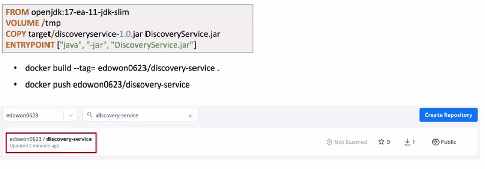
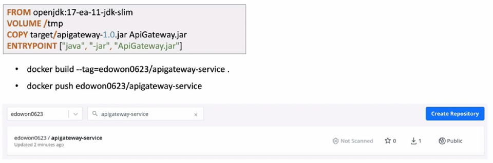
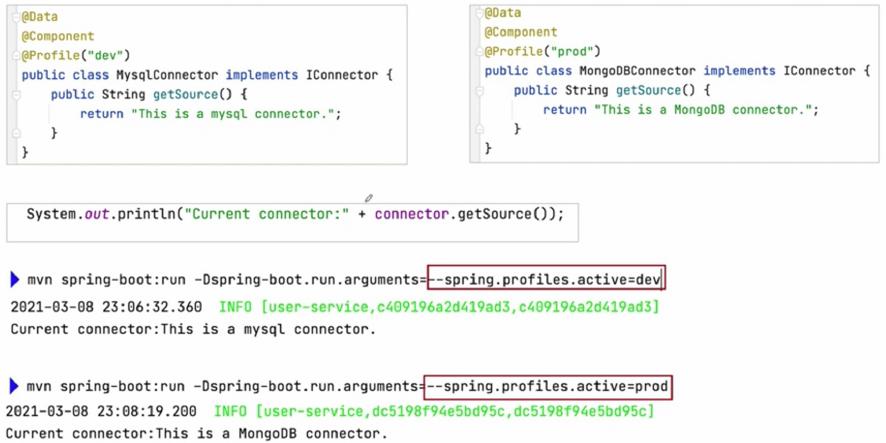

# 애플리케이션 배포 – Docker Container

# 애플리케이션 배포 – Docker Container
* toc
{:toc}

## Running Microservices in Local
+ 

## Create Bridge Network
+ Bridge network
  + $ docker network create --driver bridge [브릿지 이름]
  + 호스트와 별도의 가상의 네트워크를 만들고 가상의 네트워크에서 컨테이너들을 배치해 놓고 사용 
  + $ docker network create --gateway 172.10.01 --subnet 172.18.0.0/16 ecommerce-network
    + gateway, subnet 지정 
  + $ docker network inspect ecommerce-network
    + 네트워크 상세 정보 조회 
+ Host network
  + 네트워크를 호스트로 설정하면 호스트의 네트워크 환경을 그대로 사용
  + 포트 포워딩 없이 내부 어플리케이션 사용
+ None network
  + 네트워크를 사용하지 않는다
  + Io 네트워크만 사용, 외부와 단절 
+ 
+ 
  + 같은 네트워크 상에서는 컨테이너 이름으로 서로 호출이 가능하다 

## Run RabbitMQ
+ docker run -d --name rabbitmq --network ecommerce-network \ 
 -p 15672:15672 -p 5672:5672 -p 15671:15671 -p 5671:1671 -p 4369:4369 \
 -e RABBITMQ_DEFAULT_USER=guest \
 -e RABBITMQ_DEFAULT_PASS=guest rabbitmq:management
+ 

## Create Config Server Docker Image
+ 
+ 

## Eureka Discovery

### Build Eureka Discovery Docker Image
+ 

### Run Eureka Discovery
+ 

## ApiGateway Service

### Build ApiGateway Service Docker Image
+ 

### Run ApiGateway Service
+ 

## Build, Run MariaDB
+ 

## Kafka Server

### Run Kafka Server – 1)
+ 
+ Zookeeper + Kafka Standalone
  + docker-compose로 실행
  + git clone [https://github.com/wurstmeister/kafka-docker](https://github.com/wurstmeister/kafka-docker)
  + docker-compose-single-broker.yml 수정
+ $ docker-compose -f docker-compose-single-broker.yml up -d

### Run Kafka Server – 2)
+ 
+ bitnami/kafka
  + [https://hub.docker.com/r/bitnami/kafka](https://hub.docker.com/r/bitnami/kafka)

## Run Zipkin
+ [https://zipkin.io/pages/quickstart](https://zipkin.io/pages/quickstart)
+ $ doker run -d -p 9411:9411 \
--network ecommerce-network \
--name zipkin \
openzipkin/zipkin

## Run Prometheus + Grafana
+ Prometheus
  + [https://prometheus.io/docs/prometheus/latest/installation/#using-docker](https://prometheus.io/docs/prometheus/latest/installation/#using-docker)
  + $ docker run -d -p 9090:9090 \
  --network ecommerce-network \
  --name prometheus \
  -v /path/to/prometheus.yml:/etc/prometheus/prometheus.yml \
  prom/prometheus
+ Grafana
  + [https://grafana.com/grafana/download?platform=docker](https://grafana.com/grafana/download?platform=docker)
  + $ docker run -d -p 3000:3000 \
  --network ecommerce-network \
  --name grafana \
  grafana/grafana

## Build, Run Users Microservice
+ 

## Build, Run Orders Microservice
+ 
+ 
+ mariadb 접속 시 오류 발생시
  + 

## Build, Run Catalogs Microservice
+ 
+ 

## Run Microservices
+ 
+ 
+ 
+ 
