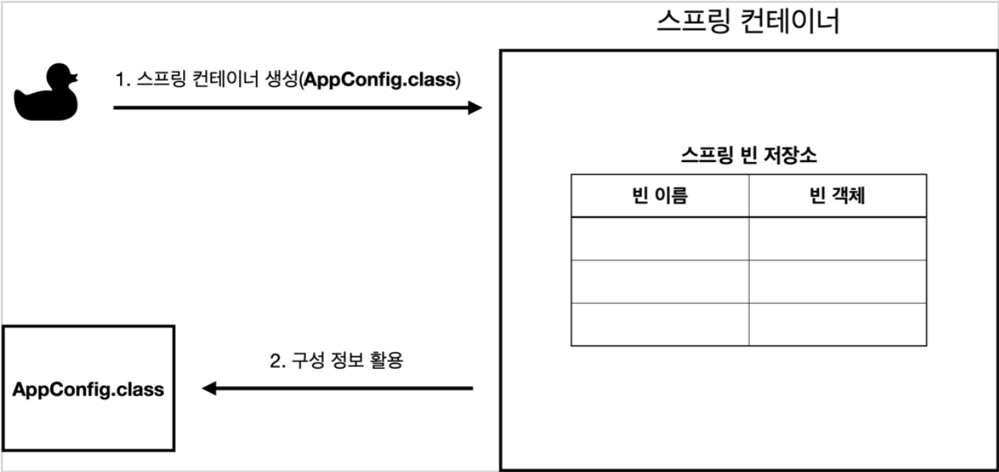
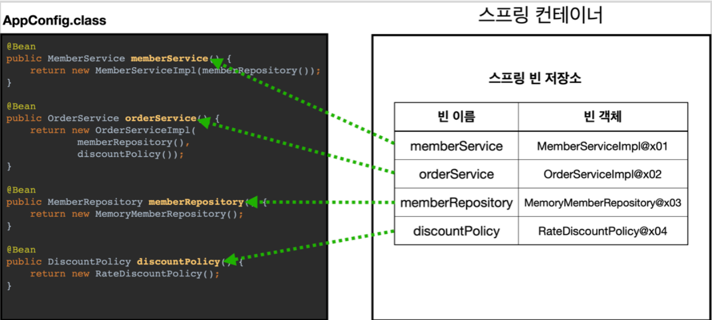
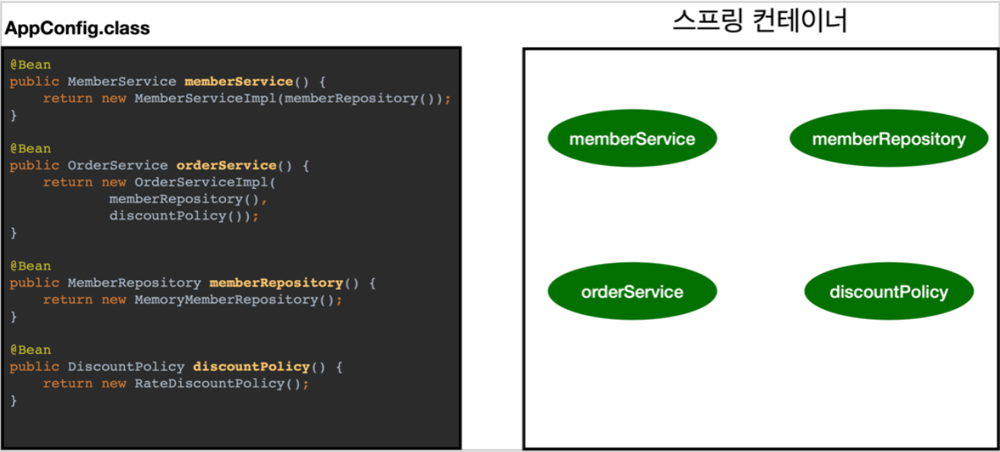
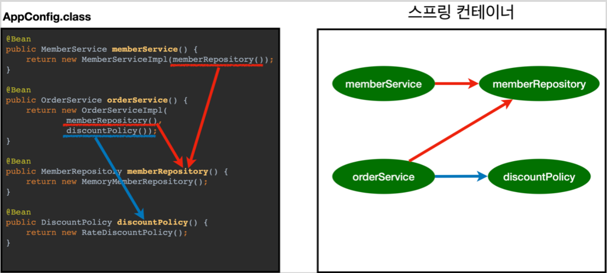
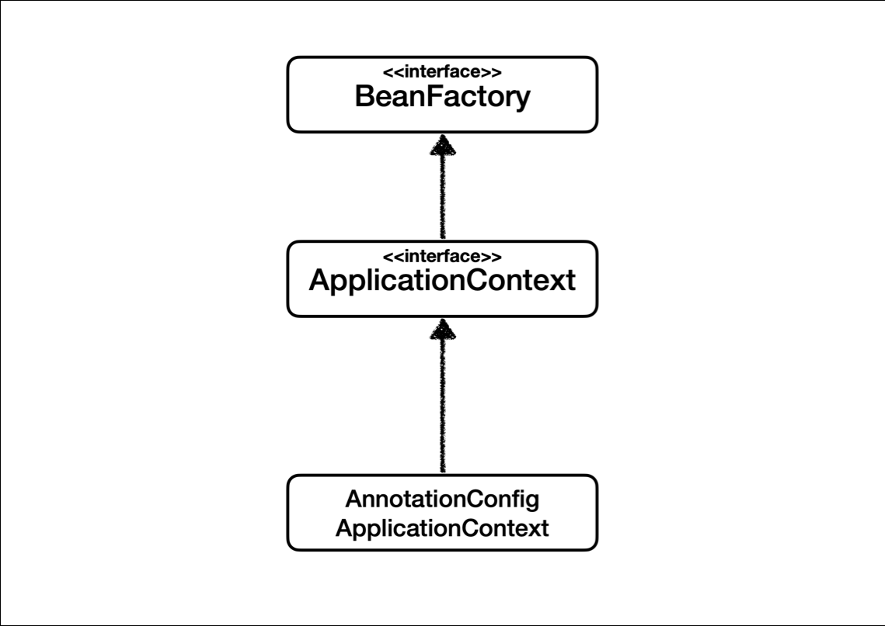
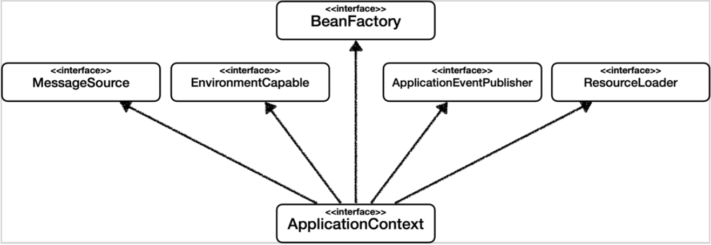
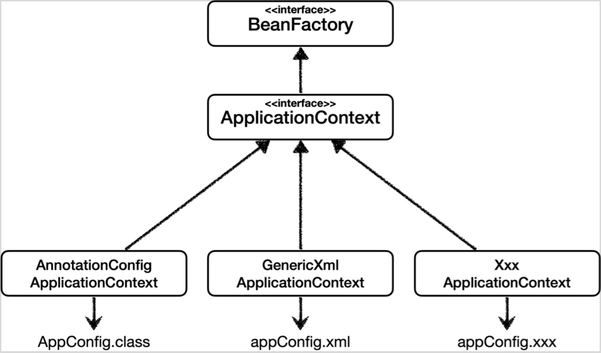

# 스프링 컨테이너와 스프링 빈

# 스프링 컨테이너와 스프링 빈
* toc
{:toc}

## 스프링 컨테이너 생성

~~~java

//스프링 컨테이너 생성
ApplicationContext applicationContext = new AnnotationConfigApplicationContext(AppConfig.class);

~~~

+ ApplicationContext 를 스프링 컨테이너라 한다.
+ ApplicationContext 는 인터페이스이다.
+ 스프링 컨테이너는 XML을 기반으로 만들 수 있고, 애노테이션 기반의 자바 설정 클래스로 만들 수 있다
+ 자바 설정 클래스를 기반으로 스프링 컨테이너( ApplicationContext )를 만들어보자.
  + new AnnotationConfigApplicationContext(AppConfig.class);
  + 이 클래스는 ApplicationContext 인터페이스의 구현체이다.

> 참고: 더 정확히는 스프링 컨테이너를 부를 때 BeanFactory , ApplicationContext 로 구분해서
> 이야기한다. BeanFactory 를 직접 사용하는 경우는 거의 없으므로
> 일반적으로 ApplicationContext 를 스프링 컨테이너라 한다.

### 스프링 컨테이너의 생성 과정

1. 스프링 컨테이너 생성
   + 
   + new AnnotationConfigApplicationContext(AppConfig.class)
   + 스프링 컨테이너를 생성할 때는 구성 정보를 지정해주어야 한다.
   + 여기서는 AppConfig.class 를 구성 정보로 지정했다.

2. 스프링 빈 등록
   + 
   + 스프링 컨테이너는 파라미터로 넘어온 설정 클래스 정보를 사용해서 스프링 빈을 등록한다.
   + 빈이름
     + 빈 이름은 메서드 이름을 사용한다.
     + 이름을 직접 부여할 수 도 있다
     + @Bean(name="memberService2")
     + 주의: 빈 이름은 항상 다른 이름을 부여해야 한다. 같은 이름을 부여하면, 다른 빈이 무시되거나, 기존 빈을 덮어버리거나 설정에 따라 오류가 발생한다.

3. 스프링 빈 의존관계 설정 - 준비
   + 
   
4. 스프링 빈 의존관계 설정 - 완료
   + 
   + 스프링 컨테이너는 설정 정보를 참고해서 의존관계를 주입(DI)한다.
   + 단순히 자바 코드를 호출하는 것 같지만, 차이가 있다. 이 차이는 뒤에 싱글톤 컨테이너에서 설명한다.
   + 참고
     + 스프링은 빈을 생성하고, 의존관계를 주입하는 단계가 나누어져 있다. 그런데 이렇게 자바 코드로 스프링
     빈을 등록하면 생성자를 호출하면서 의존관계 주입도 한번에 처리된다
 

## 컨테이너에 등록된 모든 빈 조회

~~~java

package hello.core.beanfind;

import org.junit.jupiter.api.DisplayName;
import org.junit.jupiter.api.Test;
import org.springframework.beans.factory.config.BeanDefinition;
import org.springframework.context.annotation.AnnotationConfigApplicationContext;

import static org.assertj.core.api.Assertions.assertThat;

class ApplicationContextInfoTest {
    AnnotationConfigApplicationContext ac = new
            AnnotationConfigApplicationContext(AppConfig.class);

    @Test
    @DisplayName("모든 빈 출력하기")
    void findAllBean() {
        String[] beanDefinitionNames = ac.getBeanDefinitionNames();
        for (String beanDefinitionName : beanDefinitionNames) {
            Object bean = ac.getBean(beanDefinitionName);
            System.out.println("name=" + beanDefinitionName + " object=" +
                    bean);
        }
    }

    @Test
    @DisplayName("애플리케이션 빈 출력하기")
    void findApplicationBean() {
        String[] beanDefinitionNames = ac.getBeanDefinitionNames();
        for (String beanDefinitionName : beanDefinitionNames) {
            BeanDefinition beanDefinition =
                    ac.getBeanDefinition(beanDefinitionName);
            //Role ROLE_APPLICATION: 직접 등록한 애플리케이션 빈
            //Role ROLE_INFRASTRUCTURE: 스프링이 내부에서 사용하는 빈
            if (beanDefinition.getRole() == BeanDefinition.ROLE_APPLICATION) {
                Object bean = ac.getBean(beanDefinitionName);
                System.out.println("name=" + beanDefinitionName + " object=" +
                        bean);
            }
        }
    }
}

~~~

+ 모든 빈 출력하기
  + 실행하면 스프링에 등록된 모든 빈 정보를 출력할 수 있다
  + ac.getBeanDefinitionNames() : 스프링에 등록된 모든 빈 이름을 조회한다
  + ac.getBean() : 빈 이름으로 빈 객체(인스턴스)를 조회한다
+ 애플리케이션 빈 출력하기
  + 스프링이 내부에서 사용하는 빈은 제외하고, 내가 등록한 빈만 출력해보자
  + 스프링이 내부에서 사용하는 빈은 getRole() 로 구분할 수 있다.
    + ROLE_APPLICATION : 일반적으로 사용자가 정의한 빈
    + ROLE_INFRASTRUCTURE : 스프링이 내부에서 사용하는 빈

## 스프링 빈 조회 - 기본
스프링 컨테이너에서 스프링 빈을 찾는 가장 기본적인 조회 방법
+ ac.getBean(빈이름, 타입)
+ ac.getBean(타입)
+ 조회 대상 스프링 빈이 없으면 예외 발생
  + NoSuchBeanDefinitionException: No bean named 'xxxxx' available

~~~java

package hello.core.beanfind;

import hello.core.AppConfig;
import hello.core.member.MemberService;
import hello.core.member.MemberServiceImpl;
import org.junit.jupiter.api.Assertions;
import org.junit.jupiter.api.DisplayName;
import org.junit.jupiter.api.Test;
import org.springframework.beans.factory.NoSuchBeanDefinitionException;
import org.springframework.context.annotation.AnnotationConfigApplicationContext;

import static org.assertj.core.api.Assertions.*;

class ApplicationContextBasicFindTest {
    AnnotationConfigApplicationContext ac = new
            AnnotationConfigApplicationContext(AppConfig.class);

    @Test
    @DisplayName("빈 이름으로 조회")
    void findBeanByName() {
        MemberService memberService = ac.getBean("memberService",
                MemberService.class);
        assertThat(memberService).isInstanceOf(MemberServiceImpl.class);
    }

    @Test
    @DisplayName("이름 없이 타입만으로 조회")
    void findBeanByType() {
        MemberService memberService = ac.getBean(MemberService.class);
        assertThat(memberService).isInstanceOf(MemberServiceImpl.class);
    }

    @Test
    @DisplayName("구체 타입으로 조회")
    void findBeanByName2() {
        MemberServiceImpl memberService = ac.getBean("memberService",
                MemberServiceImpl.class);
        assertThat(memberService).isInstanceOf(MemberServiceImpl.class);
    }

    @Test
    @DisplayName("빈 이름으로 조회X")
    void findBeanByNameX() {
        //ac.getBean("xxxxx", MemberService.class);
        Assertions.assertThrows(NoSuchBeanDefinitionException.class, () ->
                ac.getBean("xxxxx", MemberService.class));
    }
}

~~~

> 참고: 구체 타입으로 조회하면 변경시 유연성이 떨어진다.

## 스프링 빈 조회 - 동일한 타입이 둘 이상
+ 타입으로 조회시 같은 타입의 스프링 빈이 둘 이상이면 오류가 발생한다. 이때는 빈 이름을 지정하자
+ ac.getBeansOfType() 을 사용하면 해당 타입의 모든 빈을 조회할 수 있다

~~~java

package hello.core.beanfind;

import hello.core.member.MemberRepository;
import hello.core.member.MemoryMemberRepository;
import org.junit.jupiter.api.DisplayName;
import org.junit.jupiter.api.Test;
import org.springframework.beans.factory.NoUniqueBeanDefinitionException;
import org.springframework.context.annotation.AnnotationConfigApplicationContext;
import org.springframework.context.annotation.Bean;
import org.springframework.context.annotation.Configuration;

import java.util.Map;

import static org.assertj.core.api.Assertions.assertThat;
import static org.junit.jupiter.api.Assertions.assertThrows;

class ApplicationContextSameBeanFindTest {
    AnnotationConfigApplicationContext ac = new
            AnnotationConfigApplicationContext(SameBeanConfig.class);

    @Test
    @DisplayName("타입으로 조회시 같은 타입이 둘 이상 있으면, 중복 오류가 발생한다")
    void findBeanByTypeDuplicate() {
        //MemberRepository bean = ac.getBean(MemberRepository.class);
        assertThrows(NoUniqueBeanDefinitionException.class, () ->
                ac.getBean(MemberRepository.class));
    }

    @Test
    @DisplayName("타입으로 조회시 같은 타입이 둘 이상 있으면, 빈 이름을 지정하면 된다")
    void findBeanByName() {
        MemberRepository memberRepository = ac.getBean("memberRepository1",
                MemberRepository.class);
        assertThat(memberRepository).isInstanceOf(MemberRepository.class);
    }

    @Test
    @DisplayName("특정 타입을 모두 조회하기")
    void findAllBeanByType() {
        Map<String, MemberRepository> beansOfType =
                ac.getBeansOfType(MemberRepository.class);
        for (String key : beansOfType.keySet()) {
            System.out.println("key = " + key + " value = " +
                    beansOfType.get(key));
        }
        System.out.println("beansOfType = " + beansOfType);
        assertThat(beansOfType.size()).isEqualTo(2);
    }

    @Configuration
    static class SameBeanConfig {
        @Bean
        public MemberRepository memberRepository1() {
            return new MemoryMemberRepository();
        }

        @Bean
        public MemberRepository memberRepository2() {
            return new MemoryMemberRepository();
        }
    }
}

~~~

## 스프링 빈 조회 - 상속 관계
+ 부모 타입으로 조회하면, 자식 타입도 함께 조회한다.
+ 그래서 모든 자바 객체의 최고 부모인 Object 타입으로 조회하면, 모든 스프링 빈을 조회한다.

~~~java

package hello.core.beanfind;

import hello.core.discount.DiscountPolicy;
import hello.core.discount.FixDiscountPolicy;
import hello.core.discount.RateDiscountPolicy;
import hello.core.member.MemberService;
import hello.core.member.MemberServiceImpl;
import org.junit.jupiter.api.DisplayName;
import org.junit.jupiter.api.Test;
import org.springframework.beans.factory.NoUniqueBeanDefinitionException;
import org.springframework.context.annotation.AnnotationConfigApplicationContext;
import org.springframework.context.annotation.Bean;
import org.springframework.context.annotation.Configuration;

import java.util.Map;

import static org.assertj.core.api.Assertions.assertThat;
import static org.junit.jupiter.api.Assertions.assertThrows;

class ApplicationContextExtendsFindTest {
    AnnotationConfigApplicationContext ac = new
            AnnotationConfigApplicationContext(TestConfig.class);

    @Test
    @DisplayName("부모 타입으로 조회시, 자식이 둘 이상 있으면, 중복 오류가 발생한다")
    void findBeanByParentTypeDuplicate() {
        //DiscountPolicy bean = ac.getBean(DiscountPolicy.class);
        assertThrows(NoUniqueBeanDefinitionException.class, () ->
                ac.getBean(DiscountPolicy.class));
    }

    @Test
    @DisplayName("부모 타입으로 조회시, 자식이 둘 이상 있으면, 빈 이름을 지정하면 된다")
    void findBeanByParentTypeBeanName() {
        DiscountPolicy rateDiscountPolicy = ac.getBean("rateDiscountPolicy",
                DiscountPolicy.class);
        assertThat(rateDiscountPolicy).isInstanceOf(RateDiscountPolicy.class);
    }

    @Test
    @DisplayName("특정 하위 타입으로 조회")
    void findBeanBySubType() {
        RateDiscountPolicy bean = ac.getBean(RateDiscountPolicy.class);
        assertThat(bean).isInstanceOf(RateDiscountPolicy.class);
    }

    @Test
    @DisplayName("부모 타입으로 모두 조회하기")
    void findAllBeanByParentType() {
        Map<String, DiscountPolicy> beansOfType =
                ac.getBeansOfType(DiscountPolicy.class);
        assertThat(beansOfType.size()).isEqualTo(2);
        for (String key : beansOfType.keySet()) {
            System.out.println("key = " + key + " value=" +
                    beansOfType.get(key));
        }
    }

    @Test
    @DisplayName("부모 타입으로 모두 조회하기 - Object")
    void findAllBeanByObjectType() {
        Map<String, Object> beansOfType = ac.getBeansOfType(Object.class);
        for (String key : beansOfType.keySet()) {
            System.out.println("key = " + key + " value=" +
                    beansOfType.get(key));
        }
    }

    @Configuration
    static class TestConfig {
        @Bean
        public DiscountPolicy rateDiscountPolicy() {
            return new RateDiscountPolicy();
        }

        @Bean
        public DiscountPolicy fixDiscountPolicy() {
            return new FixDiscountPolicy();
        }
    }
}

~~~

## BeanFactory와 ApplicationContext
+ 
+ BeanFactory
  + 스프링 컨테이너의 최상위 인터페이스다
  + 스프링 빈을 관리하고 조회하는 역할을 담당한다
  + getBean() 을 제공한다
  + 지금까지 우리가 사용했던 대부분의 기능은 BeanFactory가 제공하는 기능이다
+ ApplicationContext
  + BeanFactory 기능을 모두 상속받아서 제공한다
  + 빈을 관리하고 검색하는 기능을 BeanFactory가 제공해주는데, 그러면 둘의 차이가 뭘까?
  + 애플리케이션을 개발할 때는 빈을 관리하고 조회하는 기능은 물론이고, 수 많은 부가기능이 필요하다.

### ApplicatonContext가 제공하는 부가기능
+ 
+ 메시지소스를 활용한 국제화 기능
  + 예를 들어서 한국에서 들어오면 한국어로, 영어권에서 들어오면 영어로 출력
+ 환경변수
  + 로컬, 개발, 운영등을 구분해서 처리
+ 애플리케이션 이벤트
  + 이벤트를 발행하고 구독하는 모델을 편리하게 지원
+ 편리한 리소스 조회
  + 파일, 클래스패스, 외부 등에서 리소스를 편리하게 조회

### 정리
+ ApplicationContext는 BeanFactory의 기능을 상속받는다.
+ ApplicationContext는 빈 관리기능 + 편리한 부가 기능을 제공한다.
+ BeanFactory를 직접 사용할 일은 거의 없다. 부가기능이 포함된 ApplicationContext를 사용한다.
+ BeanFactory나 ApplicationContext를 스프링 컨테이너라 한다.

## 다양한 설정 형식 지원 - 자바 코드, XML
+ 스프링 컨테이너는 다양한 형식의 설정 정보를 받아드릴 수 있게 유연하게 설계되어 있다.
  + 자바 코드, XML, Groovy 등등
+ 
+ 애노테이션 기반 자바 코드 설정 사용
  + new AnnotationConfigApplicationContext(AppConfig.class)
  + AnnotationConfigApplicationContext 클래스를 사용하면서 자바 코드로된 설정 정보를 넘기면 된다.
+ XML 설정 사용
  + 최근에는 스프링 부트를 많이 사용하면서 XML기반의 설정은 잘 사용하지 않는다. 아직 많은 레거시
    프로젝트 들이 XML로 되어 있고, 또 XML을 사용하면 컴파일 없이 빈 설정 정보를 변경할 수 있는 장점도
    있으므로 한번쯤 배워두는 것도 괜찮다
  + GenericXmlApplicationContext 를 사용하면서 xml 설정 파일을 넘기면 된다.

### XmlAppConfig 사용 자바 코드

~~~java

package hello.core.xml;

import hello.core.member.MemberService;
import org.junit.jupiter.api.Test;
import org.springframework.context.ApplicationContext;
import org.springframework.context.support.GenericXmlApplicationContext;

import static org.assertj.core.api.Assertions.*;

public class XmlAppContext {
    @Test
    void xmlAppContext() {
        ApplicationContext ac = new GenericXmlApplicationContext("appConfig.xml");

        MemberService memberService = ac.getBean("memberService", MemberService.class);
        assertThat(memberService).isInstanceOf(MemberService.class);
    }
}

~~~

+ xml 기반의 스프링 빈 설정 정보

~~~xml

<?xml version="1.0" encoding="UTF-8"?>
<beans xmlns="http://www.springframework.org/schema/beans"
       xmlns:xsi="http://www.w3.org/2001/XMLSchema-instance"
       xsi:schemaLocation="http://www.springframework.org/schema/beans http://www.springframework.org/schema/beans/spring-beans.xsd">
    <bean id="memberService" class="hello.core.member.MemberServiceImpl">
        <constructor-arg name="memberRepository" ref="memberRepository"/>
    </bean>
    <bean id="memberRepository"
          class="hello.core.member.MemoryMemberRepository"/>
    <bean id="orderService" class="hello.core.order.OrderServiceImpl">
        <constructor-arg name="memberRepository" ref="memberRepository"/>
        <constructor-arg name="discountPolicy" ref="discountPolicy"/>
    </bean>
    <bean id="discountPolicy" class="hello.core.discount.RateDiscountPolicy"/>
</beans>

~~~

+ xml 기반의 appConfig.xml 스프링 설정 정보와 자바 코드로 된 AppConfig.java 설정 정보를 비교해보면 거의 비슷하다는 것을 알 수 있다.
+ [https://spring.io/projects/spring-framework](https://spring.io/projects/spring-framework)
