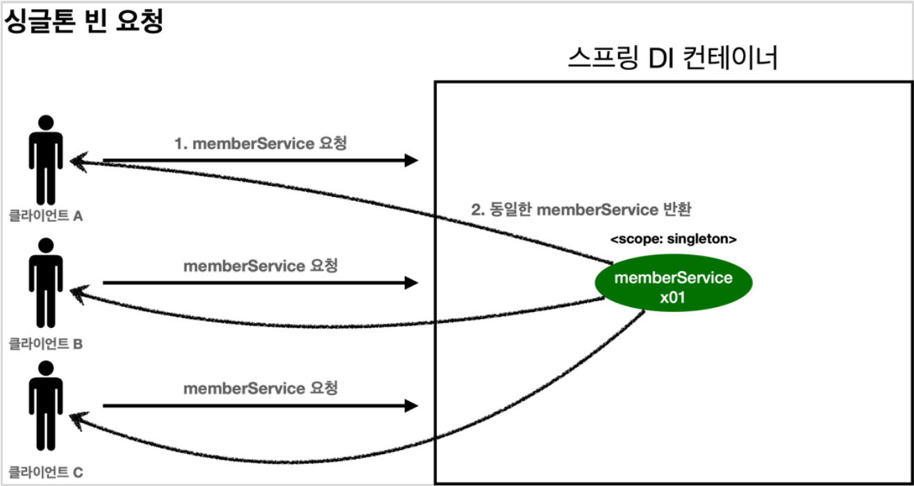

# 스프링 컨테이너와 스프링 빈

# 스프링 컨테이너와 스프링 빈
* toc
{:toc}

## 스프링 컨테이너 생성

~~~java

//스프링 컨테이너 생성
ApplicationContext applicationContext = new AnnotationConfigApplicationContext(AppConfig.class);

~~~

+ ApplicationContext 를 스프링 컨테이너라 한다.
+ ApplicationContext 는 인터페이스이다.
+ 스프링 컨테이너는 XML을 기반으로 만들 수 있고, 애노테이션 기반의 자바 설정 클래스로 만들 수 있다
+ 자바 설정 클래스를 기반으로 스프링 컨테이너( ApplicationContext )를 만들어보자.
  + new AnnotationConfigApplicationContext(AppConfig.class);
  + 이 클래스는 ApplicationContext 인터페이스의 구현체이다.

> 참고: 더 정확히는 스프링 컨테이너를 부를 때 BeanFactory , ApplicationContext 로 구분해서
> 이야기한다. BeanFactory 를 직접 사용하는 경우는 거의 없으므로
> 일반적으로 ApplicationContext 를 스프링 컨테이너라 한다.

### 스프링 컨테이너의 생성 과정

1. 스프링 컨테이너 생성
   + 
   + new AnnotationConfigApplicationContext(AppConfig.class)
   + 스프링 컨테이너를 생성할 때는 구성 정보를 지정해주어야 한다.
   + 여기서는 AppConfig.class 를 구성 정보로 지정했다.

2. 스프링 빈 등록
   + 
   + 스프링 컨테이너는 파라미터로 넘어온 설정 클래스 정보를 사용해서 스프링 빈을 등록한다.
   + 빈이름
     + 빈 이름은 메서드 이름을 사용한다.
     + 이름을 직접 부여할 수 도 있다
     + @Bean(name="memberService2")
     + 주의: 빈 이름은 항상 다른 이름을 부여해야 한다. 같은 이름을 부여하면, 다른 빈이 무시되거나, 기존 빈을 덮어버리거나 설정에 따라 오류가 발생한다.
