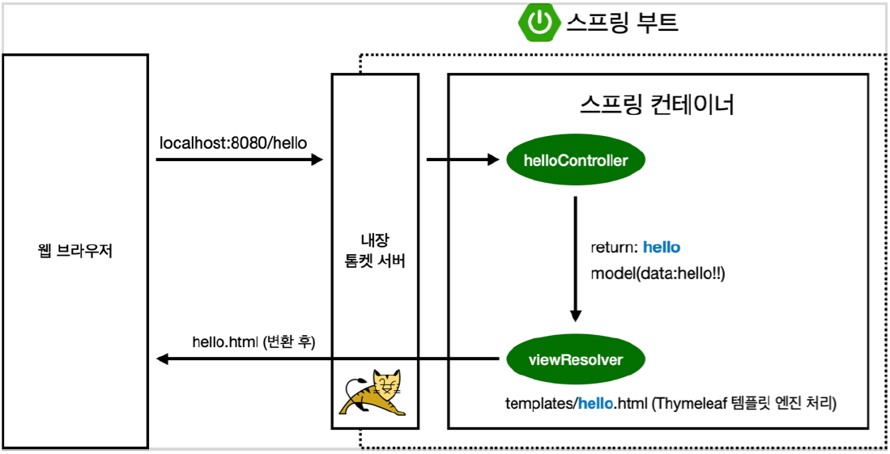

# 프로젝트 환경 설정

# 프로젝트 환경 설정
* toc
{:toc}

## 라이브러리 살펴보기
> Gradle은 의존관계가 있는 라이브러리를 함께 다운로드 한다.

### 스프링 부트 라이브러리
+ spring-boot-starter-web
  + spring-boot-starter-tomcat: 톰캣 (웹서버)
  + spring-webmvc: 스프링 웹 MVC
+ spring-boot-starter-thymeleaf: 타임리프 템플릿 엔진(View)
+ spring-boot-starter(공통): 스프링 부트 + 스프링 코어 + 로깅
  + spring-boot
    + spring-core
  + spring-boot-starter-logging
    + logback, slf4j
    
### 테스트 라이브러리
+ spring-boot-starter-test
  + junit: 테스트 프레임워크
  + mockito: 목 라이브러리
  + assertj: 테스트 코드를 좀 더 편하게 작성하게 도와주는 라이브러리
  + spring-test: 스프링 통합 테스트 지원

## View 환경설정
+ 스프링 부트가 제공하는 Welcome Page 기능
  + static/index.html 을 올려두면 Welcome page 기능을 제공한다.
  + [https://docs.spring.io/spring-boot/docs/2.3.1.RELEASE/reference/html/spring-boot-features.html#boot-features-spring-mvc-welcome-page](https://docs.spring.io/spring-boot/docs/2.3.1.RELEASE/reference/html/spring-boot-features.html#boot-features-spring-mvc-welcome-page)

### thymeleaf 템플릿 엔진
+ thymeleaf 공식 사이트: [https://www.thymeleaf.org/](https://www.thymeleaf.org/)
+ 스프링 공식 튜토리얼: [https://spring.io/guides/gs/serving-web-content/](https://spring.io/guides/gs/serving-web-content/)
+ 스프링부트 메뉴얼: [https://docs.spring.io/spring-boot/docs/2.3.1.RELEASE/reference/html/spring-boot-features.html#boot-features-spring-mvc-template-engines](https://docs.spring.io/spring-boot/docs/2.3.1.RELEASE/reference/html/spring-boot-features.html#boot-features-spring-mvc-template-engines)
+ 동작 환경
  + 
  + 컨트롤러에서 리턴 값으로 문자를 반환하면 뷰 리졸버( viewResolver )가 화면을 찾아서 처리한다.
    + 스프링 부트 템플릿엔진 기본 viewName 매핑
    + resources:templates/ +{ViewName}+ .html

> 참고: spring-boot-devtools 라이브러리를 추가하면, html 파일을 컴파일만 해주면 서버 재시작 없이
> View 파일 변경이 가능하다
> 인텔리J 컴파일 방법: 메뉴 build -> Recompile

## 빌드하고 실행하기
콘솔로 이동
1. ./gradlew build
2. cd build/libs
3. java -jar hello-spring-0.0.1-SNAPSHOT.jar
4. 실행 확인

+ 윈도우 사용자를 위한 팁
  + 콘솔로 이동 -> 명령 프롬프트(cmd)로 이동
  + ./gradlew gradlew.bat 를 실행
  + 명령 프롬프트에서 gradlew.bat 를 실행하려면 gradlew 하고 엔터
  + gradlew build
  + 폴더 목록 확인 ls -> dir
  + 윈도우에서 Git bash 터미널 사용하기
    + 링크: [https://www.inflearn.com/questions/53961](https://www.inflearn.com/questions/53961)
