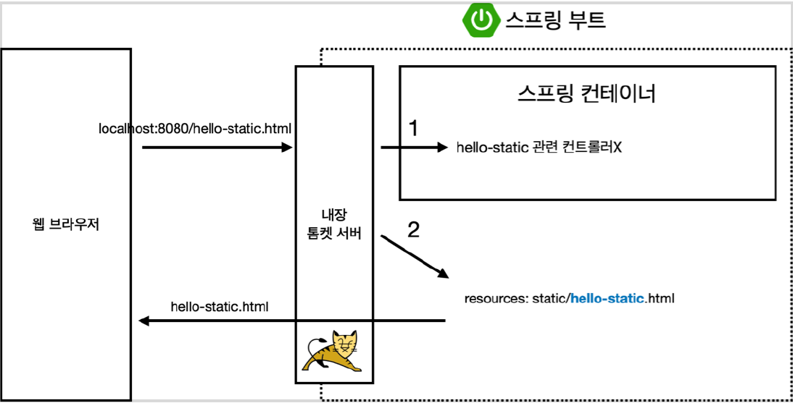
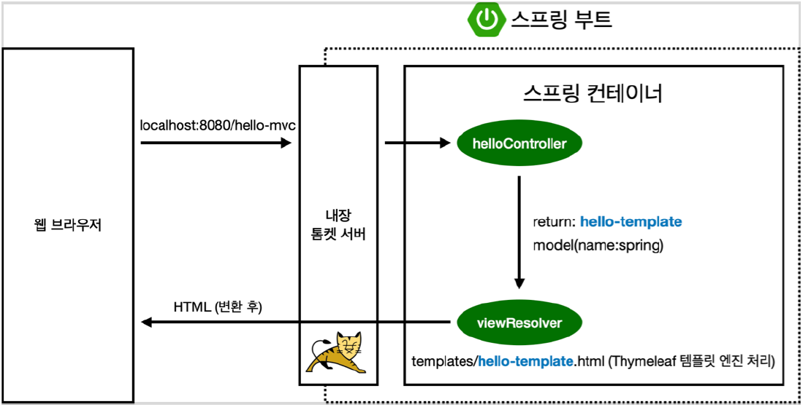
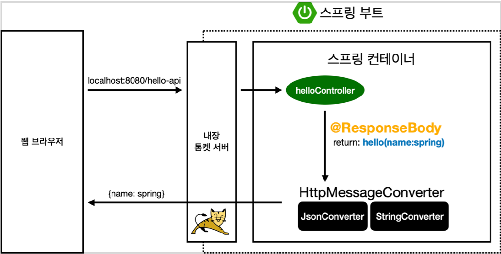

# 스프링 웹 개발 기초 

# 스프링 웹 개발 기초
* toc
{:toc}

## 정적 컨텐츠
+ 스프링 부트 정적 컨텐츠 기능
+ [https://docs.spring.io/spring-boot/docs/2.3.1.RELEASE/reference/html/spring-boot-features.html#boot-features-spring-mvc-static-content](https://docs.spring.io/spring-boot/docs/2.3.1.RELEASE/reference/html/spring-boot-features.html#boot-features-spring-mvc-static-content)
+ 

## MVC와 템플릿 엔진
+ MVC: Model, View, Controller
+ 

## API
+ @ResponseBody 를 사용하면 뷰 리졸버( viewResolver )를 사용하지 않는다
+ 대신에 HTTP의 BODY에 문자 내용을 직접 반환(HTML BODY TAG를 말하는 것이 아니다)
+ 
+ @ResponseBody 를 사용
  + HTTP의 BODY에 문자 내용을 직접 반환
  + viewResolver 대신에 HttpMessageConverter 가 동작
  + 기본 문자처리: StringHttpMessageConverter
  + 기본 객체처리: MappingJackson2HttpMessageConverter (JSON)
  + byte 처리 등등 기타 여러 HttpMessageConverter가 기본으로 등록되어 있다

> 참고: 클라이언트의 HTTP Accept 해더와 서버의 컨트롤러 반환 타입 정보 둘을 조합해서
> HttpMessageConverter 가 선택된다. 

