# 웹 애플리케이션 이해

# 웹 애플리케이션 이해
* toc
{:toc}

## 웹 서버, 웹 애플리케이션 서버

### 모든 것이 HTTP
HTTP 메시지에 모든 것을 전송
+ HTML, TEXT
+ IMAGE, 음성, 영상, 파일
+ JSON, XML (API)
+ 거의 모든 형태의 데이터 전송 가능
+ 서버간에 데이터를 주고 받을 때도 대부분 HTTP 사용

### 웹 서버(Web Server)
+ HTTP 기반으로 동작
+ 정적 리소스 제공, 기타 부가기능
+ 정적(파일) HTML, CSS, JS, 이미지, 영상
+ 예) NGINX, APACHE
+ 

### 웹 애플리케이션 서버(WAS - Web Application Server)
+ HTTP 기반으로 동작
+ 웹 서버 기능 포함 + (정적 리소스 제공 가능)
+ 프로그램 코드를 실행해서 애플리케이션 로직 수행
    + 동적 HTML, HTTP API(JSON)
    + 서블릿, JSP, 스프링 MVC
+ 예) 톰캣(Tomcat) Jetty, Undertow
+ 

### 웹 서버, 웹 애플리케이션 서버(WAS) 차이
+ 웹 서버는 정적 리소스(파일), WAS는 애플리케이션 로직
+ 사실은 둘의 용어도 경계도 모호하다
    + 웹 서버도 프로그램을 실행하는 기능을 포함하기도 한다
    + 웹 애플리케이션 서버도 웹 서버의 기능을 제공한다
+ 자바는 서블릿 컨테이너 기능을 제공하면 WAS
    + 서블릿 없이 자바코드를 실행하는 서버 프레임워크도 있다
+ WAS는 애플리케이션 코드를 실행하는데 더 특화

### 웹 시스템 구성 - WAS, DB
+ WAS, DB 만으로 시스템 구성 가능
+ WAS는 정적 리소스, 애플리케이션 로직 모두 제공 가능
+ 
+ WAS가 너무 많은 역할을 담당, 서버 과부하 우려
+ 가장 비싼 애플리케이션 로직이 정적 리소스 때문에 수행이 어려울 수 있다
+ WAS 장애시 오류 화면도 노출 불가능

### 웹 시스템 구성 - WEB, WAS, DB
+ 정적 리소스는 웹 서버가 처리
+ 웹 서버는 애플리케이션 로직같은 동적인 처리가 필요하면 WAS에 요청을 위임
+ WAS는 중요한 애플리케이션 로직 처리 전담
+ 
+ 효율적인 리소스 관리
    + 정적 리소스가 많이 사용되면 Web 서버 증설
    + 애플리케이션 리소스가 많이 사용되면 WAS 증설
    + 
+ 정적 리소스만 제공하는 웹 서버는 잘 죽지 않는다
+ 애플리케이션 로직이 동작하는 WAS 서버는 잘 죽는다
+ WAS, DB 장애시 WEB 서버가 오류 화면 제공 가능
    + 

## 서블릿

### HTML Form 데이터 전송
POST 전송 - 저장
+ 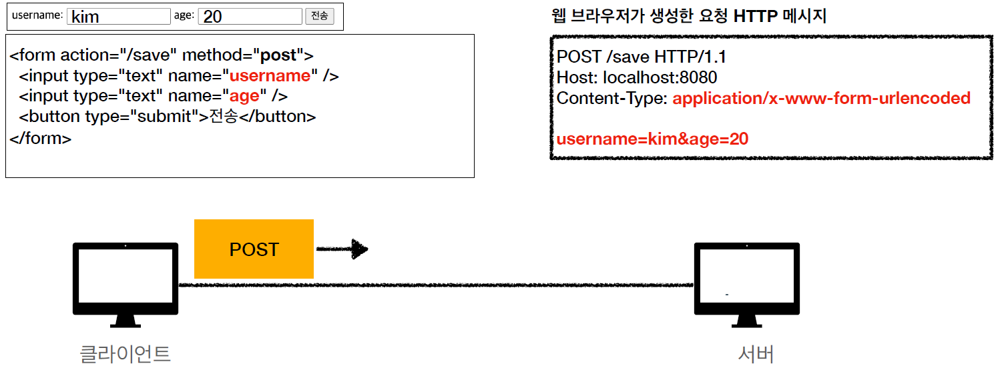

### 서버에서 처리해야 하는 업무
+ 웹 애플리케이션 서버 직접 구현
    + 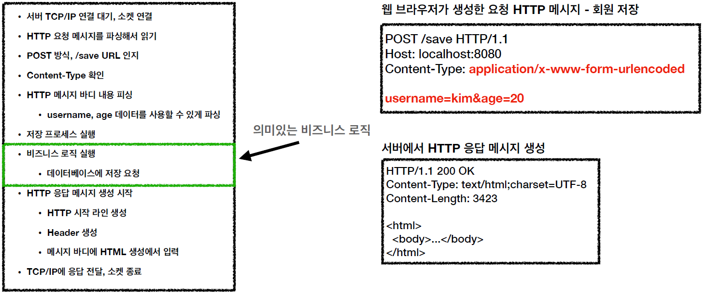
+ 서블릿을 지원하는 WAS 사용
    + 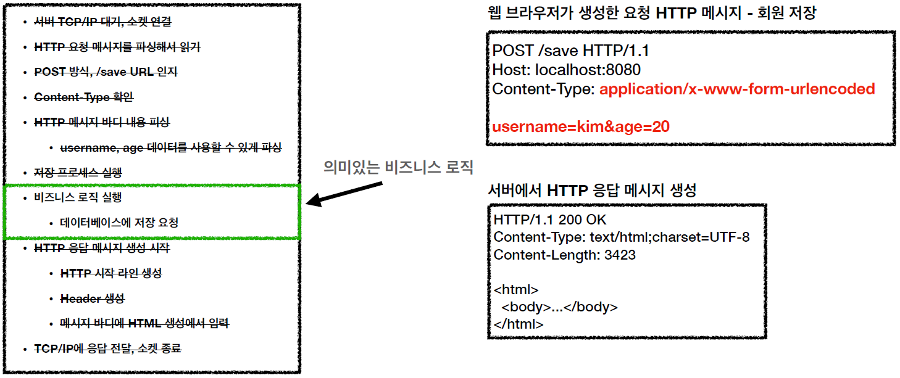

### 서블릿 - 특징

~~~java

@WebServlet(name = "helloServlet", urlPatterns = "/hello")
public class HelloServlet extends HttpServlet {
    @Override
    protected void service(HttpServletRequest request, HttpServletResponse response) {       //애플리케이션 로직
    }
}

~~~

+ urlPatterns(/hello)의 URL이 호출되면 서블릿 코드가 실행
+ HTTP 요청 정보를 편리하게 사용할 수 있는 HttpServletRequest
+ HTTP 응답 정보를 편리하게 제공할 수 있는 HttpServletResponse
+ 개발자는 HTTP 스펙을 매우 편리하게 사용
+ 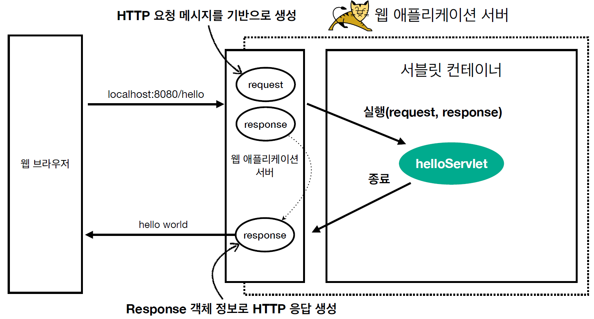

### 서블릿 - HTTP 요청, 응답 흐름
+ HTTP 요청시
  + WAS는 Request, Response 객체를 새로 만들어서 서블릿 객체 호출
  + 개발자는 Request 객체에서 HTTP 요청 정보를 편리하게 꺼내서 사용
  + 개발자는 Response 객체에 HTTP 응답 정보를 편리하게 입력
  + WAS는 Response 객체에 담겨있는 내용으로 HTTP 응답 정보를 생성

### 서블릿 컨테이너
+ 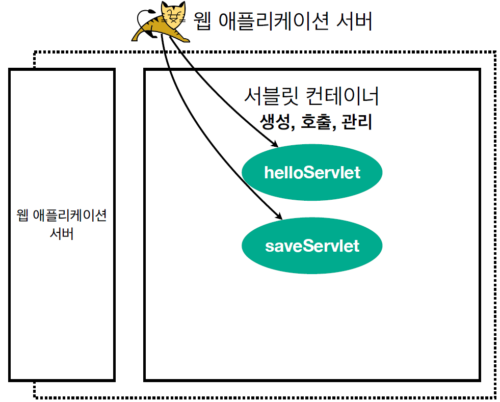
+ 톰캣처럼 서블릿을 지원하는 WAS를 서블릿 컨테이너라고 한다
+ 서블릿 컨테이너는 서블릿 객체를 생성, 초기화, 호출, 종료하는 생명주기 관리
+ 서블릿 객체는 싱글톤으로 관리
  + 고객의 요청이 올 때 마다 계속 객체를 생성하는 것은 비효율
  + 최초 로딩 시점에 서블릿 객체를 미리 만들어두고 재활용
  + 모든 고객 요청은 동일한 서블릿 객체 인스턴스에 접근
  + 공유 변수 사용 주의
  + 서블릿 컨테이너 종료시 함께 종료
+ JSP도 서블릿으로 변환 되어서 사용
+ 동시 요청을 위한 멀티 쓰레드 처리 지원

## 동시 요청 - 멀티 쓰레드
+ 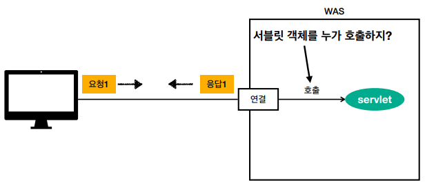

### 쓰레드 
+ 애플리케이션 코드를 하나하나 순차적으로 실행하는 것은 쓰레드
+ 자바 메인 메서드를 처음 실행하면 main이라는 이름의 쓰레드가 실행
+ 쓰레드가 없다면 자바 애플리케이션 실행이 불가능
+ 쓰레드는 한번에 하나의 코드 라인만 수행
+ 동시 처리가 필요하면 쓰레드를 추가로 생성

### 요청 마다 쓰레드 생성
+ 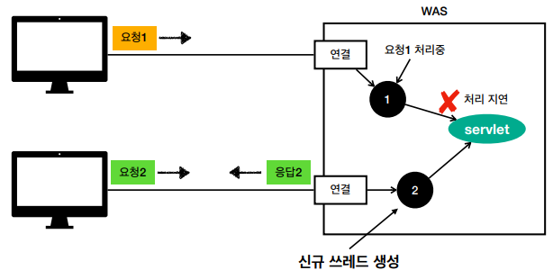
#### 장단점
+ 장점
  + 동시 요청을 처리할 수 있다
  + 리소스(CPU, 메모리)가 허용할 때 까지 처리가능
  + 하나의 쓰레드가 지연 되어도, 나머지 쓰레드는 정상 동작한다.
+ 단점
  + 쓰레드는 생성 비용은 매우 비싸다
    + 고객의 요청이 올 때 마다 쓰레드를 생성하면, 응답 속도가 늦어진다
  + 쓰레드는 컨텍스트 스위칭 비용이 발생한다
  + 쓰레드 생성에 제한이 없다
    + 고객 요청이 너무 많이 오면, CPU, 메모리 임계점을 넘어서 서버가 죽을 수 있다

### 쓰레드 풀
+ 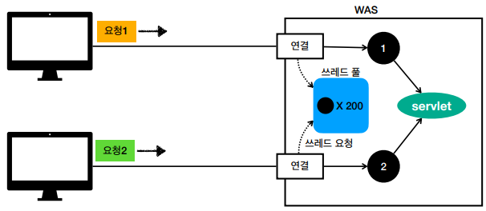
+ 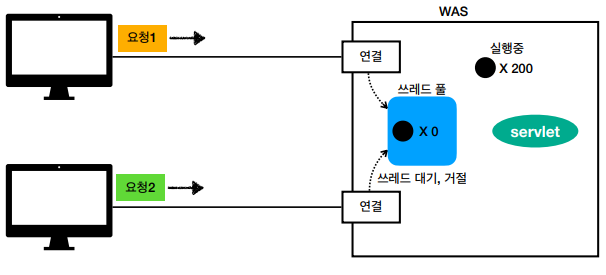

#### 요청 마다 쓰레드 생성의 단점 보완
+ 특징
  + 필요한 쓰레드를 쓰레드 풀에 보관하고 관리한다
  + 쓰레드 풀에 생성 가능한 쓰레드의 최대치를 관리한다. 톰캣은 최대 200개 기본 설정 (변경 가능)
+ 사용
  + 쓰레드가 필요하면, 이미 생성되어 있는 쓰레드를 쓰레드 풀에서 꺼내서 사용한다
  + 사용을 종료하면 쓰레드 풀에 해당 쓰레드를 반납한다
  + 최대 쓰레드가 모두 사용중이어서 쓰레드 풀에 쓰레드가 없으면?
    + 기다리는 요청은 거절하거나 특정 숫자만큼만 대기하도록 설정할 수 있다
+ 장점
  + 쓰레드가 미리 생성되어 있으므로, 쓰레드를 생성하고 종료하는 비용(CPU)이 절약되고, 응답 시간이 빠르다
  + 생성 가능한 쓰레드의 최대치가 있으므로 너무 많은 요청이 들어와도 기존 요청은 안전하게 처리할 수 있다

### 실무 팁
+ WAS의 주요 튜닝 포인트는 최대 쓰레드(max thread) 수이다
+ 이 값을 너무 낮게 설정하면?
  + 동시 요청이 많으면, 서버 리소스는 여유롭지만, 클라이언트는 금방 응답 지연
+ 이 값을 너무 높게 설정하면?
  + 동시 요청이 많으면, CPU, 메모리 리소스 임계점 초과로 서버 다운
+ 장애 발생시?
  + 클라우드면 일단 서버부터 늘리고, 이후에 튜닝
  + 클라우드가 아니면 열심히 튜닝

### 쓰레드 풀 - 너무 낮게 설정
+ 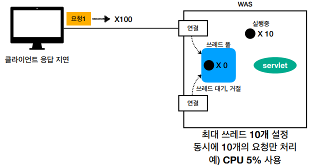

### 쓰레드 풀의 적정 숫자
+ 적정 숫자는 어떻게 찾나요?
+ 애플리케이션 로직의 복잡도, CPU, 메모리, IO 리소스 상황에 따라 모두 다르다
+ 성능 테스트
  + 최대한 실제 서비스와 유사하게 성능 테스트 시도
  + 툴: 아파치 ab, 제이미터, nGrinder

### WAS의 멀티 쓰레드 지원 - 핵심
+ 멀티 쓰레드에 대한 부분은 WAS가 처리
+ 개발자가 멀티 쓰레드 관련 코드를 신경쓰지 않아도 된다
+ 개발자는 마치 싱글 쓰레드 프로그래밍을 하듯이 편리하게 소스 코드를 개발
+ 멀티 쓰레드 환경이므로 싱글톤 객체(서블릿, 스프링 빈)는 주의해서 사용

## HTML, HTTP API, CSR, SSR

### 정적 리소스
+ 고정된 HTML 파일, CSS, JS, 이미지, 영상 등을 제공
+ 주로 웹 브라우저
+ 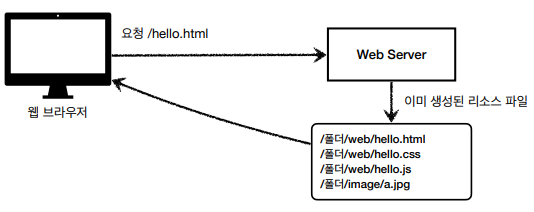

### HTML 페이지
+ 동적으로 필요한 HTML 파일을 생성해서 전달
+ 웹 브라우저: HTML 해석
+ 

### HTTP API
+ HTML이 아니라 데이터를 전달
+ 주로 JSON 형식 사용
+ 다양한 시스템에서 호출
+ 
+ 데이터만 주고 받음, UI 화면이 필요하면, 클라이언트가 별도 처리
+ 앱, 웹 클라이언트, 서버 to 서버
+ 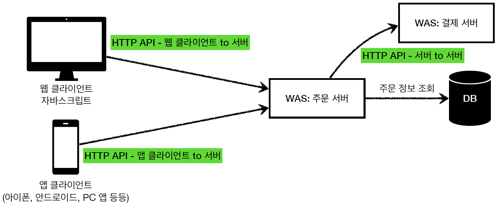

#### 다양한 시스템 연동
+ 주로 JSON 형태로 데이터 통신
+ UI 클라이언트 접점
  + 앱 클라이언트(아이폰, 안드로이드, PC 앱)
  + 웹 브라우저에서 자바스크립트를 통한 HTTP API 호출
  + React, Vue.js 같은 웹 클라이언트
+ 서버 to 서버
  + 주문 서버 -> 결제 서버
  + 기업간 데이터 통신

### 서버사이드 렌더링, 클라이언트 사이드 렌더링
+ SSR - 서버 사이드 렌더링
  + HTML 최종 결과를 서버에서 만들어서 웹 브라우저에 전달
  + 주로 정적인 화면에 사용
  + 관련기술: JSP, 타임리프 -> 백엔드 개발자
+ CSR - 클라이언트 사이드 렌더링
  + HTML 결과를 자바스크립트를 사용해 웹 브라우저에서 동적으로 생성해서 적용
  + 주로 동적인 화면에 사용, 웹 환경을 마치 앱 처럼 필요한 부분부분 변경할 수 있다
  + 예) 구글 지도, Gmail, 구글 캘린더
  + 관련기술: React, Vue.js -> 웹 프론트엔드 개발자
+ 참고
  + React, Vue.js를 CSR + SSR 동시에 지원하는 웹 프레임워크도 있다
  + SSR을 사용하더라도, 자바스크립트를 사용해서 화면 일부를 동적으로 변경 가능

#### SSR - 서버 사이드 렌더링
서버에서 최종 HTML을 생성해서 클라이언트에 전달
+ 

#### CSR - 클라이언트 사이드 렌더링
+ 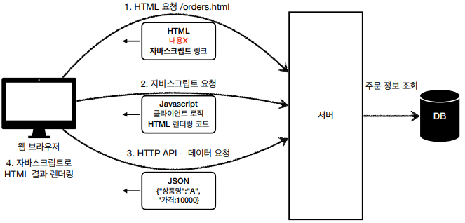

### 백엔드 개발자 입장에서 UI 기술
+ 백엔드 - 서버 사이드 렌더링 기술
  + JSP, 타임리프
  + 화면이 정적이고, 복잡하지 않을 때 사용
  + 백엔드 개발자는 서버 사이드 렌더링 기술 학습 필수
+ 프론트엔드 - 클라이언트 사이드 렌더링 기술
  + React, Vue.js
  + 복잡하고 동적인 UI 사용
  + 웹 프론트엔드 개발자의 전문 분야
+ 선택과 집중
  + 백엔드 개발자의 웹 프론트엔드 기술 학습은 옵션
  + 백엔드 개발자는 서버, DB, 인프라 등등 수 많은 백엔드 기술을 공부해야 한다
  + 웹 프론트엔드도 깊이있게 잘 하려면 숙련에 오랜 시간이 필요하다

## 자바 백엔드 웹 기술 역사

### 자바 웹 기술 역사

#### 과거 기술
+ 서블릿 - 1997
  + HTML 생성이 어려움
+ JSP - 1999
  + HTML 생성은 편리하지만, 비즈니스 로직까지 너무 많은 역할 담당
+ 서블릿, JSP 조합 MVC 패턴 사용
  + 모델, 뷰 컨트롤러로 역할을 나누어 개발
+ MVC 프레임워크 춘추 전국 시대 - 2000년 초 ~ 2010년 초
  + MVC 패턴 자동화, 복잡한 웹 기술을 편리하게 사용할 수 있는 다양한 기능 지원
  + 스트럿츠, 웹워크, 스프링 MVC(과거 버전)

#### 현재 사용 기술
+ 애노테이션 기반의 스프링 MVC 등장
  + @Controller
  + MVC 프레임워크의 춘추 전국 시대 마무리
+ 스프링 부트의 등장
  + 스프링 부트는 서버를 내장
  + 과거에는 서버에 WAS를 직접 설치하고, 소스는 War 파일을 만들어서 설치한 WAS에 배포
  + 스프링 부트는 빌드 결과(Jar)에 WAS 서버 포함 -> 빌드 배포 단순화

#### 최신 기술 - 스프링 웹 기술의 분화
+ Web Servlet - Spring MVC 
+ Web Reactive - Spring WebFlux

#### 최신 기술 - 스프링 웹 플럭스(WebFlux)
+ 특징
  + 비동기 넌 블러킹 처리
  + 최소 쓰레드로 최대 성능 - 쓰레드 컨텍스트 스위칭 비용 효율화
  + 함수형 스타일로 개발 - 동시처리 코드 효율화
  + 서블릿 기술 사용X
+ 그런데
  + 웹 플럭스는 기술적 난이도 매우 높다
  + 아직은 RDB 지원 부족
  + 일반 MVC의 쓰레드 모델도 충분히 빠르다.
  + 실무에서 아직 많이 사용하지는 않는다 (전체 1% 이하)

### 자바 뷰 템플릿 역사
HTML을 편리하게 생성하는 뷰 기능
+ JSP
  + 속도 느림, 기능 부족
+ 프리마커(Freemarker), Velocity(벨로시티)
  + 속도 문제 해결, 다양한 기능
+ 타임리프(Thymeleaf)
  + 내추럴 템플릿: HTML의 모양을 유지하면서 뷰 템플릿 적용 가능
  + 스프링 MVC와 강력한 기능 통합
  + 최선의 선택, 단 성능은 프리마커, 벨로시티가 더 빠르다
