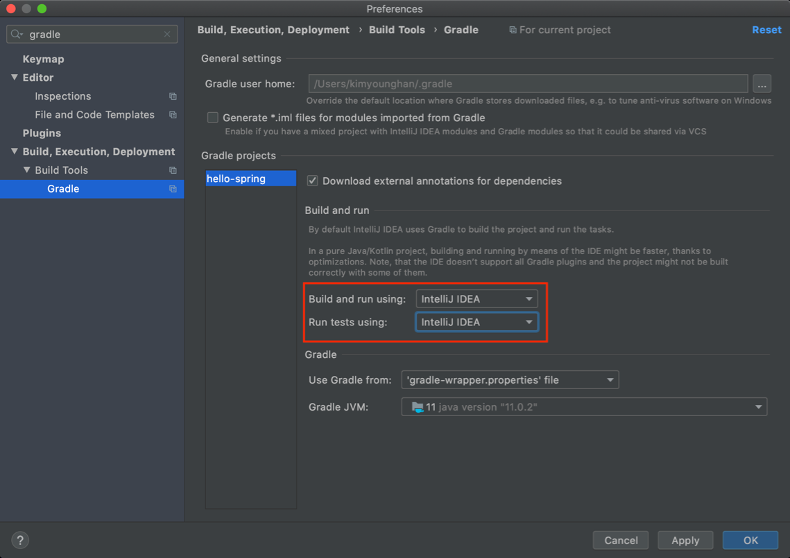
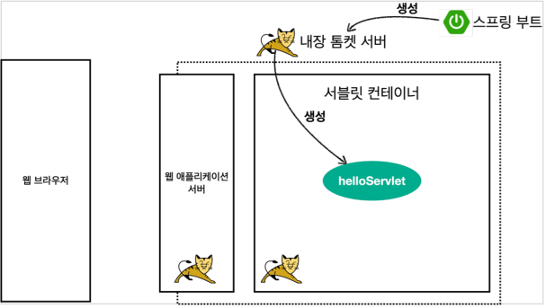
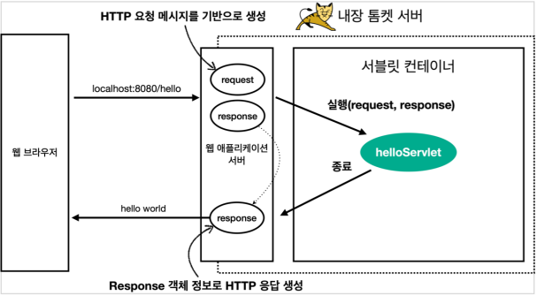

# 서블릿

# 서블릿
* toc
{:toc}

## 프로젝트 셋팅

### IntelliJ Gradle 대신에 자바 직접 실행
+ 최근 IntelliJ 버전은 Gradle을 통해서 실행 하는 것이 기본 설정이다. 이렇게 하면 실행속도가 느리다. 다음과 같이 변경하면 자바로 바로 실행해서 실행속도가 더 빠르다
  + 
  
> 주의
> IntelliJ 무료 버전의 경우 해당 설정을 IntelliJ IDEA가 아니라 Gradle로 설정해야 한다.
> Jar 파일의 경우는 문제가 없는데, War의 경우 톰캣이 정상 시작되지 않는 문제가 발생한다.
> 유료 버전은 모두 정상 동작한다.
> 또는 build.gradle 에 있는 다음 코드를 제거해도 된다.  providedRuntime 'org.springframework.boot:spring-boot-starter-tomcat'

## Hello 서블릿

### 스프링 부트 서블릿 환경 구성
+ @ServletComponentScan
  + 스프링 부트는 서블릿을 직접 등록해서 사용할 수 있도록 @ServletComponentScan 을 지원한다. 

~~~java

package hello.servlet;
import org.springframework.boot.SpringApplication;
import org.springframework.boot.autoconfigure.SpringBootApplication;
import org.springframework.boot.web.servlet.ServletComponentScan;
@ServletComponentScan //서블릿 자동 등록
@SpringBootApplication
public class ServletApplication {
  public static void main(String[] args) {
    SpringApplication.run(ServletApplication.class, args);
  }
}

~~~ 

### 서블릿 등록하기

~~~java

package hello.servlet.basic;

import javax.servlet.ServletException;
import javax.servlet.annotation.WebServlet;
import javax.servlet.http.HttpServlet;
import javax.servlet.http.HttpServletRequest;
import javax.servlet.http.HttpServletResponse;
import java.io.IOException;

@WebServlet(name = "helloServlet", urlPatterns = "/hello")
public class HelloServlet extends HttpServlet {
  @Override
  protected void service(HttpServletRequest request, HttpServletResponse response) throws ServletException, IOException {
    System.out.println("HelloServlet.service");
    System.out.println("request = " + request);
    System.out.println("response = " + response);
    String username = request.getParameter("username");
    System.out.println("username = " + username);
    response.setContentType("text/plain");
    response.setCharacterEncoding("utf-8");
    response.getWriter().write("hello " + username);
  }
}

~~~

+ @WebServlet 서블릿 애노테이션
  + name: 서블릿 이름
  + urlPatterns: URL 매핑
+ HTTP 요청을 통해 매핑된 URL이 호출되면 서블릿 컨테이너는 메서드를 실행한다.

### HTTP 요청 메시지 로그로 확인하기
+ application.properties
  + logging.level.org.apache.coyote.http11=debug

> 참고
> 운영서버에 이렇게 모든 요청 정보를 다 남기면 성능저하가 발생할 수 있다. 개발 단계에서만 적용하자

### 서블릿 컨테이너 동작 방식 설명
+ 내장 톰캣 서버 생성
  + 
+ 웹 애플리케이션 서버의 요청 응답 구조
  + 

> 참고
> HTTP 응답에서 Content-Length는 웹 애플리케이션 서버가 자동으로 생성해준다.

### welcome 페이지 추가
+ webapp 경로에 index.html 을 두면 http://localhost:8080 호출시 index.html 페이지가 열린다
