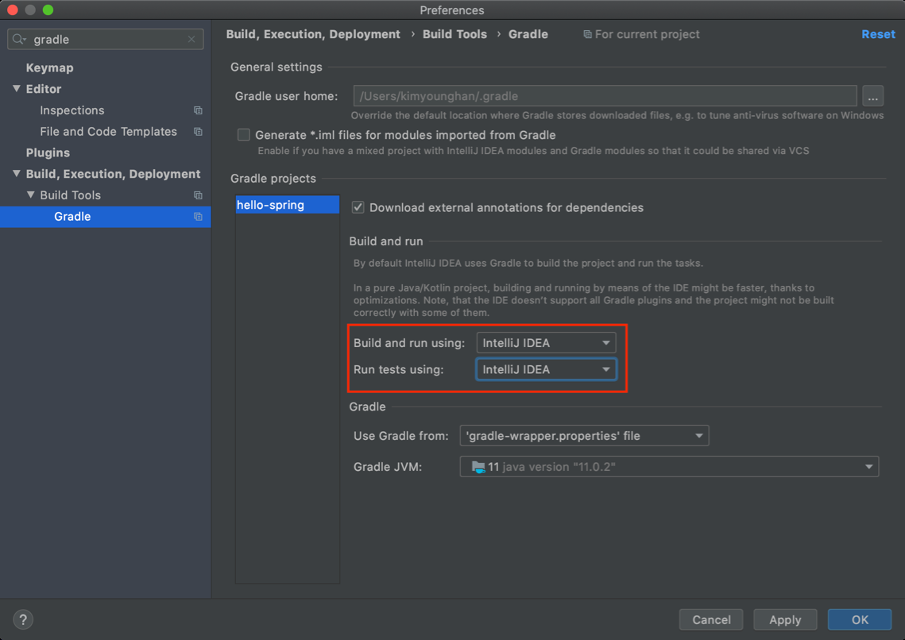

# 서블릿

# 서블릿
* toc
{:toc}

## 프로젝트 셋팅

### IntelliJ Gradle 대신에 자바 직접 실행
+ 최근 IntelliJ 버전은 Gradle을 통해서 실행 하는 것이 기본 설정이다. 이렇게 하면 실행속도가 느리다. 다음과 같이 변경하면 자바로 바로 실행해서 실행속도가 더 빠르다
  + 
  
> 주의
> IntelliJ 무료 버전의 경우 해당 설정을 IntelliJ IDEA가 아니라 Gradle로 설정해야 한다.
> Jar 파일의 경우는 문제가 없는데, War의 경우 톰캣이 정상 시작되지 않는 문제가 발생한다.
> 유료 버전은 모두 정상 동작한다.
> 또는 build.gradle 에 있는 다음 코드를 제거해도 된다.  providedRuntime 'org.springframework.boot:spring-boot-starter-tomcat'

