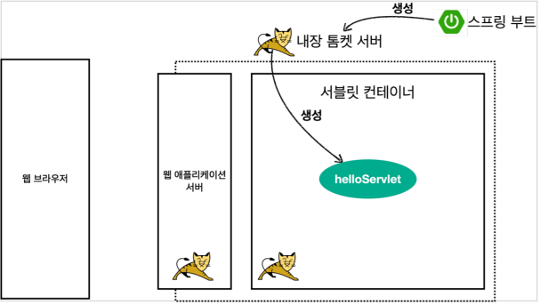
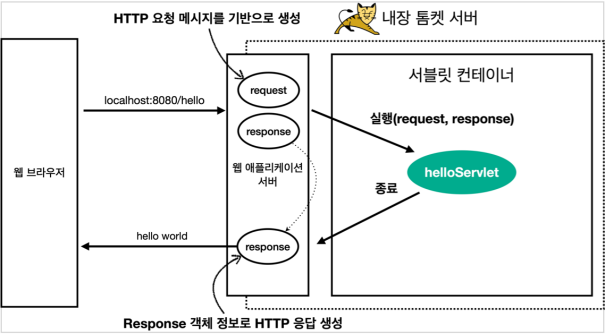

# 서블릿

# 서블릿
* toc
{:toc}

## 프로젝트 셋팅

### IntelliJ Gradle 대신에 자바 직접 실행
+ 최근 IntelliJ 버전은 Gradle을 통해서 실행 하는 것이 기본 설정이다. 이렇게 하면 실행속도가 느리다. 다음과 같이 변경하면 자바로 바로 실행해서 실행속도가 더 빠르다
  + 
  
> 주의
> IntelliJ 무료 버전의 경우 해당 설정을 IntelliJ IDEA가 아니라 Gradle로 설정해야 한다.
> Jar 파일의 경우는 문제가 없는데, War의 경우 톰캣이 정상 시작되지 않는 문제가 발생한다.
> 유료 버전은 모두 정상 동작한다.
> 또는 build.gradle 에 있는 다음 코드를 제거해도 된다.  providedRuntime 'org.springframework.boot:spring-boot-starter-tomcat'

## Hello 서블릿

### 스프링 부트 서블릿 환경 구성
+ @ServletComponentScan
  + 스프링 부트는 서블릿을 직접 등록해서 사용할 수 있도록 @ServletComponentScan 을 지원한다. 

~~~java

package hello.servlet;
import org.springframework.boot.SpringApplication;
import org.springframework.boot.autoconfigure.SpringBootApplication;
import org.springframework.boot.web.servlet.ServletComponentScan;
@ServletComponentScan //서블릿 자동 등록
@SpringBootApplication
public class ServletApplication {
  public static void main(String[] args) {
    SpringApplication.run(ServletApplication.class, args);
  }
}

~~~ 

### 서블릿 등록하기

~~~java

package hello.servlet.basic;

import javax.servlet.ServletException;
import javax.servlet.annotation.WebServlet;
import javax.servlet.http.HttpServlet;
import javax.servlet.http.HttpServletRequest;
import javax.servlet.http.HttpServletResponse;
import java.io.IOException;

@WebServlet(name = "helloServlet", urlPatterns = "/hello")
public class HelloServlet extends HttpServlet {
  @Override
  protected void service(HttpServletRequest request, HttpServletResponse response) throws ServletException, IOException {
    System.out.println("HelloServlet.service");
    System.out.println("request = " + request);
    System.out.println("response = " + response);
    String username = request.getParameter("username");
    System.out.println("username = " + username);
    response.setContentType("text/plain");
    response.setCharacterEncoding("utf-8");
    response.getWriter().write("hello " + username);
  }
}

~~~

+ @WebServlet 서블릿 애노테이션
  + name: 서블릿 이름
  + urlPatterns: URL 매핑
+ HTTP 요청을 통해 매핑된 URL이 호출되면 서블릿 컨테이너는 메서드를 실행한다.

### HTTP 요청 메시지 로그로 확인하기
+ application.properties
  + logging.level.org.apache.coyote.http11=debug

> 참고
> 운영서버에 이렇게 모든 요청 정보를 다 남기면 성능저하가 발생할 수 있다. 개발 단계에서만 적용하자

### 서블릿 컨테이너 동작 방식 설명
+ 내장 톰캣 서버 생성
  + 
+ 웹 애플리케이션 서버의 요청 응답 구조
  + 

> 참고
> HTTP 응답에서 Content-Length는 웹 애플리케이션 서버가 자동으로 생성해준다.

### welcome 페이지 추가
+ webapp 경로에 index.html 을 두면 http://localhost:8080 호출시 index.html 페이지가 열린다

## HttpServletRequest - 개요
+ HttpServletRequest 역할
  + HTTP 요청 메시지를 개발자가 직접 파싱해서 사용해도 되지만, 매우 불편할 것이다. 서블릿은 개발자가
    HTTP 요청 메시지를 편리하게 사용할 수 있도록 개발자 대신에 HTTP 요청 메시지를 파싱한다. 그리고 그
    결과를 HttpServletRequest 객체에 담아서 제공한다.
+ HTTP 요청 메시지
  + START LINE
    + HTTP 메소드
    + URL
    + 쿼리 스트링
    + 스키마, 프로토콜
  + 헤더
    + 헤더 조회
  + 바디
    + form 파라미터 형식 조회
    + message body 데이터 직접 조회
  + HttpServletRequest 객체는 추가로 여러가지 부가기능도 함께 제공한다.
+ 임시 저장소 기능
  + 해당 HTTP 요청이 시작부터 끝날 때 까지 유지되는 임시 저장소 기능
  + 저장: request.setAttribute(name, value)
  + request.getAttribute(name)
+ 세션 관리 기능
  + request.getSession(create: true)

> HttpServletRequest, HttpServletResponse를 사용할 때 가장 중요한 점은 이 객체들이 HTTP 요청
> 메시지, HTTP 응답 메시지를 편리하게 사용하도록 도와주는 객체라는 점이다. 따라서 이 기능에 대해서
> 깊이있는 이해를 하려면 HTTP 스펙이 제공하는 요청, 응답 메시지 자체를 이해해야 한다.

## HttpServletRequest - 기본 사용법
+ start-line 정보

~~~java

//start line 정보
private void printStartLine(HttpServletRequest request) {
 System.out.println("--- REQUEST-LINE - start ---");
 System.out.println("request.getMethod() = " + request.getMethod()); //GET
 System.out.println("request.getProtocol() = " + request.getProtocol()); //HTTP/1.1
 System.out.println("request.getScheme() = " + request.getScheme()); //http 
// http://localhost:8080/request-header
 System.out.println("request.getRequestURL() = " + request.getRequestURL()); 
 // /request-header
 System.out.println("request.getRequestURI() = " + request.getRequestURI()); 
 //username=hi
 System.out.println("request.getQueryString() = " + request.getQueryString());
 System.out.println("request.isSecure() = " + request.isSecure()); //https 사용 유무
 System.out.println("--- REQUEST-LINE - end ---");
 System.out.println();
}

~~~~

+ 헤더 정보

~~~java

//Header 모든 정보
private void printHeaders(HttpServletRequest request) {
 System.out.println("--- Headers - start ---");
/*
 Enumeration<String> headerNames = request.getHeaderNames();
 while (headerNames.hasMoreElements()) {
 String headerName = headerNames.nextElement();
 System.out.println(headerName + ": " + request.getHeader(headerName));
 }
*/
 request.getHeaderNames().asIterator()
 .forEachRemaining(headerName -> System.out.println(headerName + ": " + request.getHeader(headerName)));
 System.out.println("--- Headers - end ---");
 System.out.println();
}

~~~

+ Header 편리한 조회

~~~java

//Header 편리한 조회
private void printHeaderUtils(HttpServletRequest request){
        System.out.println("--- Header 편의 조회 start ---");
        System.out.println("[Host 편의 조회]");
        System.out.println("request.getServerName() = "+ request.getServerName()); //Host 헤더
        System.out.println("request.getServerPort() = "+ request.getServerPort()); //Host 헤더
        System.out.println();
        System.out.println("[Accept-Language 편의 조회]");
        request.getLocales().asIterator()
        .forEachRemaining(locale->System.out.println("locale = "+ locale));
        System.out.println("request.getLocale() = "+request.getLocale());
        System.out.println();
        System.out.println("[cookie 편의 조회]");
        if(request.getCookies()!=null){
          for(Cookie cookie:request.getCookies()){
            System.out.println(cookie.getName()+": "+cookie.getValue());
          }
        }
        System.out.println();
        System.out.println("[Content 편의 조회]");
        System.out.println("request.getContentType() = "+ request.getContentType());
        System.out.println("request.getContentLength() = "+ request.getContentLength());
        System.out.println("request.getCharacterEncoding() = "+ request.getCharacterEncoding());
        System.out.println("--- Header 편의 조회 end ---");
        System.out.println();
}

~~~

+ 기타 정보
  + 기타 정보는 HTTP 메시지의 정보는 아니다.

~~~java

//기타 정보
private void printEtc(HttpServletRequest request){
        System.out.println("--- 기타 조회 start ---");
        System.out.println("[Remote 정보]");
        System.out.println("request.getRemoteHost() = "+request.getRemoteHost()); //
        System.out.println("request.getRemoteAddr() = "+request.getRemoteAddr()); //
        System.out.println("request.getRemotePort() = "+request.getRemotePort()); //
        System.out.println();
        System.out.println("[Local 정보]");
        System.out.println("request.getLocalName() = "+request.getLocalName()); //
        System.out.println("request.getLocalAddr() = "+request.getLocalAddr()); //
        System.out.println("request.getLocalPort() = "+request.getLocalPort()); //
        System.out.println("--- 기타 조회 end ---");
        System.out.println();
}

~~~

> 참고
> 로컬에서 테스트하면 IPv6 정보가 나오는데, IPv4 정보를 보고 싶으면 다음 옵션을 VM options에 넣어주면 된다.
> -Djava.net.preferIPv4Stack=true

## HTTP 요청 데이터 - 개요
+ GET - 쿼리 파라미터
  + /url?username=hello&age=20
  + 메시지 바디 없이, URL의 쿼리 파라미터에 데이터를 포함해서 전달
  + 예) 검색, 필터, 페이징등에서 많이 사용하는 방식
+ POST - HTML Form
  + content-type: application/x-www-form-urlencoded
  + 메시지 바디에 쿼리 파리미터 형식으로 전달 username=hello&age=20
  + 예) 회원 가입, 상품 주문, HTML Form 사용
+ HTTP message body에 데이터를 직접 담아서 요청
  + HTTP API에서 주로 사용, JSON, XML, TEXT
  + 데이터 형식은 주로 JSON 사용
  + POST, PUT, PATCH

## HTTP 요청 데이터 - GET 쿼리 파라미터
+ 메시지 바디 없이, URL의 쿼리 파라미터를 사용해서 데이터를 전달
  + 예) 검색, 필터, 페이징등에서 많이 사용하는 방식
+ 쿼리 파라미터는 URL에 다음과 같이 ? 를 시작으로 보낼 수 있다. 추가 파라미터는 & 로 구분하면 된다
+ 쿼리 파라미터 조회 메서드

~~~java

String username = request.getParameter("username"); //단일 파라미터 조회
Enumeration<String> parameterNames = request.getParameterNames(); //파라미터 이름들 모두 조회
Map<String, String[]> parameterMap = request.getParameterMap(); //파라미터를 Map 으로 조회
String[] usernames = request.getParameterValues("username"); //복수 파라미터 조회

~~~

~~~java

package hello.servlet.basic.request;

import javax.servlet.ServletException;
import javax.servlet.annotation.WebServlet;
import javax.servlet.http.HttpServlet;
import javax.servlet.http.HttpServletRequest;
import javax.servlet.http.HttpServletResponse;
import java.io.IOException;
import java.util.Enumeration;

/**
 * 1. 파라미터 전송 기능
 * http://localhost:8080/request-param?username=hello&age=20
 * 

 * 2. 동일한 파라미터 전송 가능
 * http://localhost:8080/request-param?username=hello&username=kim&age=20
 */
@WebServlet(name = "requestParamServlet", urlPatterns = "/request-param")
public class RequestParamServlet extends HttpServlet {
  @Override
  protected void service(HttpServletRequest request, HttpServletResponse resp) throws ServletException, IOException {
    System.out.println("[전체 파라미터 조회] - start");
 /*
 Enumeration<String> parameterNames = request.getParameterNames();
 while (parameterNames.hasMoreElements()) {
 String paramName = parameterNames.nextElement();
 System.out.println(paramName + "=" +
request.getParameter(paramName));
 }
 */
    request.getParameterNames().asIterator()
            .forEachRemaining(paramName -> System.out.println(paramName + "=" + request.getParameter(paramName)));
    System.out.println("[전체 파라미터 조회] - end");
    System.out.println();
    System.out.println("[단일 파라미터 조회]");
    String username = request.getParameter("username");
    System.out.println("request.getParameter(username) = " + username);
    String age = request.getParameter("age");
    System.out.println("request.getParameter(age) = " + age);
    System.out.println();
    System.out.println("[이름이 같은 복수 파라미터 조회]");
    System.out.println("request.getParameterValues(username)");
    String[] usernames = request.getParameterValues("username");
    for (String name : usernames) {
      System.out.println("username=" + name);
    }
    resp.getWriter().write("ok");
  }

~~~

+ 복수 파라미터에서 단일 파라미터 조회
  + username=hello&username=kim 과 같이 파라미터 이름은 하나인데, 값이 중복이면 어떻게 될까?
    request.getParameter() 는 하나의 파라미터 이름에 대해서 단 하나의 값만 있을 때 사용해야 한다.
    지금처럼 중복일 때는 request.getParameterValues() 를 사용해야 한다.
    참고로 이렇게 중복일 때 request.getParameter() 를 사용하면 request.getParameterValues() 의
    첫 번째 값을 반환한다.

## HTTP 요청 데이터 - POST HTML Form
+ 특징
  + content-type: application/x-www-form-urlencoded
  + 메시지 바디에 쿼리 파리미터 형식으로 데이터를 전달한다. username=hello&age=20
+ application/x-www-form-urlencoded 형식은 앞서 GET에서 살펴본 쿼리 파라미터 형식과 같다.
  따라서 쿼리 파라미터 조회 메서드를 그대로 사용하면 된다.
  클라이언트(웹 브라우저) 입장에서는 두 방식에 차이가 있지만, 서버 입장에서는 둘의 형식이 동일하므로,
  request.getParameter() 로 편리하게 구분없이 조회할 수 있다.
+ 정리하면 request.getParameter() 는 GET URL 쿼리 파라미터 형식도 지원하고, POST HTML Form 형식도 둘 다 지원한다.

> 참고
> content-type은 HTTP 메시지 바디의 데이터 형식을 지정한다.
> GET URL 쿼리 파라미터 형식으로 클라이언트에서 서버로 데이터를 전달할 때는 HTTP 메시지 바디를
> 사용하지 않기 때문에 content-type이 없다.
> POST HTML Form 형식으로 데이터를 전달하면 HTTP 메시지 바디에 해당 데이터를 포함해서 보내기
> 때문에 바디에 포함된 데이터가 어떤 형식인지 content-type을 꼭 지정해야 한다. 이렇게 폼으로 데이터를
> 전송하는 형식을 application/x-www-form-urlencoded 라 한다

## HTTP 요청 데이터 - API 메시지 바디 - 단순 텍스트
+ HTTP message body에 데이터를 직접 담아서 요청
  + HTTP API에서 주로 사용, JSON, XML, TEXT
  + 데이터 형식은 주로 JSON 사용
  + POST, PUT, PATCH
+ HTTP 메시지 바디의 데이터를 InputStream을 사용해서 직접 읽을 수 있다.

~~~java

package hello.servlet.basic.request;

import org.springframework.util.StreamUtils;

import javax.servlet.ServletException;
import javax.servlet.ServletInputStream;
import javax.servlet.annotation.WebServlet;
import javax.servlet.http.HttpServlet;
import javax.servlet.http.HttpServletRequest;
import javax.servlet.http.HttpServletResponse;
import java.io.IOException;
import java.nio.charset.StandardCharsets;

@WebServlet(name = "requestBodyStringServlet", urlPatterns = "/request-bodystring")
public class RequestBodyStringServlet extends HttpServlet {
  @Override
  protected void service(HttpServletRequest request, HttpServletResponse response) throws ServletException, IOException {
    ServletInputStream inputStream = request.getInputStream();
    String messageBody = StreamUtils.copyToString(inputStream, StandardCharsets.UTF_8);
    System.out.println("messageBody = " + messageBody);
    response.getWriter().write("ok");
  }
}

~~~

> 참고
> inputStream은 byte 코드를 반환한다. byte 코드를 우리가 읽을 수 있는 문자(String)로 보려면 문자표
> (Charset)를 지정해주어야 한다. 여기서는 UTF_8 Charset을 지정해주었다.

## HTTP 요청 데이터 - API 메시지 바디 - JSON

~~~java

package hello.servlet.basic.request;

import com.fasterxml.jackson.databind.ObjectMapper;
import hello.servlet.basic.HelloData;
import org.springframework.util.StreamUtils;

import javax.servlet.ServletException;
import javax.servlet.ServletInputStream;
import javax.servlet.annotation.WebServlet;
import javax.servlet.http.HttpServlet;
import javax.servlet.http.HttpServletRequest;
import javax.servlet.http.HttpServletResponse;
import java.io.IOException;
import java.nio.charset.StandardCharsets;

/**
 * http://localhost:8080/request-body-json
 *
 * JSON 형식 전송
 * content-type: application/json
 * message body: {"username": "hello", "age": 20}
 *
 */
@WebServlet(name = "requestBodyJsonServlet", urlPatterns = "/request-bodyjson")
public class RequestBodyJsonServlet extends HttpServlet {
  private ObjectMapper objectMapper = new ObjectMapper();

  @Override
  protected void service(HttpServletRequest request, HttpServletResponse response) throws ServletException, IOException {
    ServletInputStream inputStream = request.getInputStream();
    String messageBody = StreamUtils.copyToString(inputStream, StandardCharsets.UTF_8);
    System.out.println("messageBody = " + messageBody);
    HelloData helloData = objectMapper.readValue(messageBody, HelloData.class);
    System.out.println("helloData.username = " + helloData.getUsername());
    System.out.println("helloData.age = " + helloData.getAge());
    response.getWriter().write("ok");
  }
}

~~~

> 참고
> JSON 결과를 파싱해서 사용할 수 있는 자바 객체로 변환하려면 Jackson, Gson 같은 JSON 변환
> 라이브러리를 추가해서 사용해야 한다. 스프링 부트로 Spring MVC를 선택하면 기본으로 Jackson
> 라이브러리( ObjectMapper )를 함께 제공한다.

> 참고
> HTML form 데이터도 메시지 바디를 통해 전송되므로 직접 읽을 수 있다. 하지만 편리한 파리미터 조회
> 기능( request.getParameter(...) )을 이미 제공하기 때문에 파라미터 조회 기능을 사용하면 된다.

## HttpServletResponse - 기본 사용법
+ HttpServletResponse 역할
  + HTTP 응답 메시지 생성
    + HTTP 응답코드 지정
    + 헤더 생성
    + 바디 생성
+ 편의 기능 제공
  + Content-Type, 쿠키, Redirect

~~~java

package hello.servlet.basic.response;

import javax.servlet.ServletException;
import javax.servlet.annotation.WebServlet;
import javax.servlet.http.Cookie;
import javax.servlet.http.HttpServlet;
import javax.servlet.http.HttpServletRequest;
import javax.servlet.http.HttpServletResponse;
import java.io.IOException;
import java.io.PrintWriter;

/**
 * http://localhost:8080/response-header
 *
 */
@WebServlet(name = "responseHeaderServlet", urlPatterns = "/response-header")
public class ResponseHeaderServlet extends HttpServlet {
  @Override
  protected void service(HttpServletRequest request, HttpServletResponse response) throws ServletException, IOException {
    //[status-line]
    response.setStatus(HttpServletResponse.SC_OK); //200
    //[response-headers]
    response.setHeader("Content-Type", "text/plain;charset=utf-8");
    response.setHeader("Cache-Control", "no-cache, no-store, mustrevalidate");
    response.setHeader("Pragma", "no-cache");
    response.setHeader("my-header", "hello");
    //[Header 편의 메서드]
    content(response);
    cookie(response);
    redirect(response);
    //[message body]
    PrintWriter writer = response.getWriter();
    writer.println("ok");
  }

  private void content(HttpServletResponse response) {
    //Content-Type: text/plain;charset=utf-8
    //Content-Length: 2
    //response.setHeader("Content-Type", "text/plain;charset=utf-8");
    response.setContentType("text/plain");
    response.setCharacterEncoding("utf-8");
    //response.setContentLength(2); //(생략시 자동 생성)
  }

  private void cookie(HttpServletResponse response) {
    //Set-Cookie: myCookie=good; Max-Age=600;
    //response.setHeader("Set-Cookie", "myCookie=good; Max-Age=600");
    Cookie cookie = new Cookie("myCookie", "good");
    cookie.setMaxAge(600); //600초
    response.addCookie(cookie);
  }

  private void redirect(HttpServletResponse response) throws IOException {
    //Status Code 302
    //Location: /basic/hello-form.html
    //response.setStatus(HttpServletResponse.SC_FOUND); //302
    //response.setHeader("Location", "/basic/hello-form.html");
    response.sendRedirect("/basic/hello-form.html");
  }
  
}

~~~

## HTTP 응답 데이터 - 단순 텍스트, HTML
+ 단순 텍스트 응답
+ HTML 응답
+ HTTP API - MessageBody JSON 응답
+ HttpServletResponse - HTML 응답

~~~java

package hello.servlet.basic.response;

import javax.servlet.ServletException;
import javax.servlet.annotation.WebServlet;
import javax.servlet.http.HttpServlet;
import javax.servlet.http.HttpServletRequest;
import javax.servlet.http.HttpServletResponse;
import java.io.IOException;
import java.io.PrintWriter;

@WebServlet(name = "responseHtmlServlet", urlPatterns = "/response-html")
public class ResponseHtmlServlet extends HttpServlet {
  @Override
  protected void service(HttpServletRequest request, HttpServletResponse
          response)
          throws ServletException, IOException {
    //Content-Type: text/html;charset=utf-8
    response.setContentType("text/html");
    response.setCharacterEncoding("utf-8");
    PrintWriter writer = response.getWriter();
    writer.println("<html>");
    writer.println("<body>");
    writer.println(" 
안녕?
");
    writer.println("</body>");
    writer.println("</html>");
  }
}

~~~

+ HTTP 응답으로 HTML을 반환할 때는 content-type을 text/html 로 지정해야 한다.

## HTTP 응답 데이터 - API JSON

~~~java

package hello.servlet.basic.response;

import com.fasterxml.jackson.databind.ObjectMapper;
import hello.servlet.basic.HelloData;

import javax.servlet.ServletException;
import javax.servlet.annotation.WebServlet;
import javax.servlet.http.HttpServlet;
import javax.servlet.http.HttpServletRequest;
import javax.servlet.http.HttpServletResponse;
import java.io.IOException;

/**
 * http://localhost:8080/response-json
 *
 */
@WebServlet(name = "responseJsonServlet", urlPatterns = "/response-json")
public class ResponseJsonServlet extends HttpServlet {
  private ObjectMapper objectMapper = new ObjectMapper();

  @Override
  protected void service(HttpServletRequest request, HttpServletResponse response) throws ServletException, IOException {
    //Content-Type: application/json
    response.setHeader("content-type", "application/json");
    response.setCharacterEncoding("utf-8");
    HelloData data = new HelloData();
    data.setUsername("kim");
    data.setAge(20);
    //{"username":"kim","age":20}
    String result = objectMapper.writeValueAsString(data);
    response.getWriter().write(result);
  }
}

~~~

+ HTTP 응답으로 JSON을 반환할 때는 content-type을 application/json 로 지정해야 한다.
  Jackson 라이브러리가 제공하는 objectMapper.writeValueAsString() 를 사용하면 객체를 JSON
  문자로 변경할 수 있다

> 참고
> application/json 은 스펙상 utf-8 형식을 사용하도록 정의되어 있다. 그래서 스펙에서 charset=utf-8
> 과 같은 추가 파라미터를 지원하지 않는다. 따라서 application/json 이라고만 사용해야지
> application/json;charset=utf-8 이라고 전달하는 것은 의미 없는 파라미터를 추가한 것이 된다.
> response.getWriter()를 사용하면 추가 파라미터를 자동으로 추가해버린다. 이때는
> response.getOutputStream()으로 출력하면 그런 문제가 없다
