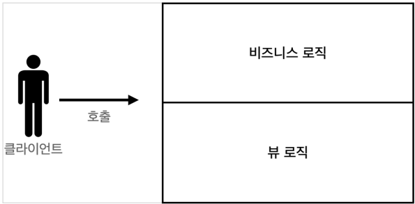
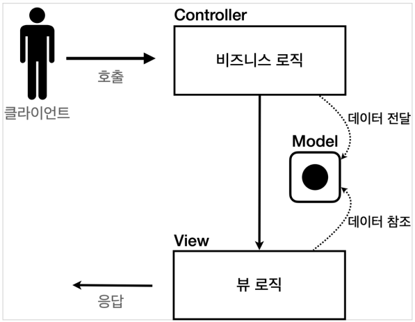
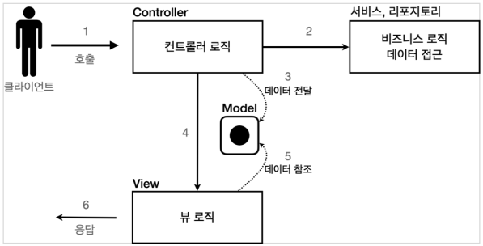

# 서블릿, JSP, MVC 패턴

# 서블릿, JSP, MVC 패턴
* toc
{:toc}

## JSP로 회원 관리 웹 애플리케이션 만들기
+ JSP 라이브러리 추가
  + JSP를 사용하려면 먼저 다음 라이브러리를 추가해야 한다.

~~~groovy

//JSP 추가 시작
implementation 'org.apache.tomcat.embed:tomcat-embed-jasper'
implementation 'javax.servlet:jstl'
//JSP 추가 끝

~~~

+ <%@ page contentType="text/html;charset=UTF-8" language="java" %>
  + 첫 줄은 JSP문서라는 뜻이다. JSP 문서는 이렇게 시작해야 한다

~~~html

<%@ page import="hello.servlet.domain.member.MemberRepository" %>
<%@ page import="hello.servlet.domain.member.Member" %>
<%@ page contentType="text/html;charset=UTF-8" language="java" %>
<%
// request, response 사용 가능
 MemberRepository memberRepository = MemberRepository.getInstance();
 System.out.println("save.jsp");
 String username = request.getParameter("username");
 int age = Integer.parseInt(request.getParameter("age"));
 Member member = new Member(username, age);
 System.out.println("member = " + member);
 memberRepository.save(member);
%>
<html>
<head>
 <meta charset="UTF-8">
</head>
<body>
성공
<ul>
 <li>id=<%=member.getId()%></li>
 <li>username=<%=member.getUsername()%></li>
 <li>age=<%=member.getAge()%></li>
</ul>
<a href="/index.html">메인</a>
</body>
</html>

~~~

+ JSP는 자바 코드를 그대로 다 사용할 수 있다.
  + <%@ page import="hello.servlet.domain.member.MemberRepository" %>
    + 자바의 import 문과 같다
  + <% ~~ %>
    + 부분에는 자바 코드를 입력할 수 있다.
  + <%= ~~ %>
    + 이 부분에는 자바 코드를 출력할 수 있다.

### 서블릿과 JSP의 한계
+ 서블릿으로 개발할 때는 뷰(View)화면을 위한 HTML을 만드는 작업이 자바 코드에 섞여서 지저분하고 복잡했다
+ JSP를 사용한 덕분에 뷰를 생성하는 HTML 작업을 깔끔하게 가져가고, 중간중간 동적으로 변경이 필요한 부분에만 자바 코드를 적용했다. 그런데 이렇게 해도 해결되지 않는 몇가지 고민이 남는다
+ 코드의 상위 절반은 비즈니스 로직이고, 나머지 하위 절반만 결과를 HTML로 보여주기 위한 뷰 영역이다
+ JAVA 코드, 데이터를 조회하는 리포지토리 등등 다양한 코드가 모두 JSP에 노출되어 있다
+ JSP가 너무 많은 역할을 한다. 수백 수천줄이 넘어가는 JSP를 떠올려보면 정말 지옥과 같을 것이다
+ MVC 패턴의 등장
  + 비즈니스 로직은 서블릿 처럼 다른곳에서 처리하고, JSP는 목적에 맞게 HTML로 화면(View)을 그리는
    일에 집중하도록 하자. 과거 개발자들도 모두 비슷한 고민이 있었고, 그래서 MVC 패턴이 등장했다.

## MVC 패턴 - 개요
+ 너무 많은 역할
  + 하나의 서블릿이나 JSP만으로 비즈니스 로직과 뷰 렌더링까지 모두 처리하게 되면, 너무 많은 역할을 하게되고, 결과적으로 유지보수가 어려워진다
  + 비즈니스 로직을 호출하는 부분에 변경이 발생해도 해당 코드를 손대야 하고, UI를 변경할 일이 있어도 비즈니스 로직이 함께 있는 해당 파일을 수정해야 한다
+ 변경의 라이프 사이클
  + 진짜 문제는 둘 사이에 변경의 라이프 사이클이 다르다
  + 예를 들어서 UI를 일부 수정하는 일과 비즈니스 로직을 수정하는 일은 각각 다르게 발생할 가능성이 매우 높고 대부분 서로에게 영향을 주지 않는다
  + 이렇게 변경의 라이프 사이클이 다른 부분을 하나의 코드로 관리하는 것은 유지보수하기 좋지 않다. (물론 UI가 많이 변하면 함께 변경될 가능성도 있다.)
+ 기능 특화
  + 특히 JSP 같은 뷰 템플릿은 화면을 렌더링 하는데 최적화 되어 있기 때문에 이 부분의 업무만 담당하는 것이 가장 효과적이다

### Model View Controller
+ MVC 패턴은 지금까지 학습한 것 처럼 하나의 서블릿이나, JSP로 처리하던 것을 컨트롤러(Controller)와 뷰(View)라는 영역으로 서로 역할을 나눈 것을 말한다
+ 웹 애플리케이션은 보통 이 MVC 패턴을 사용한다
+ 컨트롤러: HTTP 요청을 받아서 파라미터를 검증하고, 비즈니스 로직을 실행한다. 그리고 뷰에 전달할 결과 데이터를 조회해서 모델에 담는다.
+ 모델: 뷰에 출력할 데이터를 담아둔다. 뷰가 필요한 데이터를 모두 모델에 담아서 전달해주는 덕분에 뷰는 비즈니스 로직이나 데이터 접근을 몰라도 되고, 화면을 렌더링 하는 일에 집중할 수 있다
+ 뷰: 모델에 담겨있는 데이터를 사용해서 화면을 그리는 일에 집중한다. 여기서는 HTML을 생성하는 부분을 말한다.

> 참고
> 컨트롤러에 비즈니스 로직을 둘 수도 있지만, 이렇게 되면 컨트롤러가 너무 많은 역할을 담당한다. 그래서
> 일반적으로 비즈니스 로직은 서비스(Service)라는 계층을 별도로 만들어서 처리한다. 그리고 컨트롤러는
> 비즈니스 로직이 있는 서비스를 호출하는 역할을 담당한다. 참고로 비즈니스 로직을 변경하면 비즈니스
> 로직을 호출하는 컨트롤러의 코드도 변경될 수 있다.

+ MVC 패턴 이전
  + 
+ MVC 패턴1
  + 
+ MVC 패턴2
  + 

## MVC 패턴 - 적용
+ Model은 HttpServletRequest 객체를 사용한다. request는 내부에 데이터 저장소를 가지고 있는데, request.setAttribute() , request.getAttribute() 를 사용하면 데이터를 보관하고, 조회할 수 있다.

~~~java

package hello.servlet.web.servletmvc;

import javax.servlet.RequestDispatcher;
import javax.servlet.ServletException;
import javax.servlet.annotation.WebServlet;
import javax.servlet.http.HttpServlet;
import javax.servlet.http.HttpServletRequest;
import javax.servlet.http.HttpServletResponse;
import java.io.IOException;

@WebServlet(name = "mvcMemberFormServlet", urlPatterns = "/servlet-mvc/members/new-form")
public class MvcMemberFormServlet extends HttpServlet {
  @Override
  protected void service(HttpServletRequest request, HttpServletResponse response) throws ServletException, IOException {
    String viewPath = "/WEB-INF/views/new-form.jsp";
    RequestDispatcher dispatcher = request.getRequestDispatcher(viewPath);
    dispatcher.forward(request, response);
  }
}

~~~

+ dispatcher.forward() : 다른 서블릿이나 JSP로 이동할 수 있는 기능이다. 서버 내부에서 다시 호출이 발생한다.

> /WEB-INF
> 이 경로안에 JSP가 있으면 외부에서 직접 JSP를 호출할 수 없다. 우리가 기대하는 것은 항상 컨트롤러를
> 통해서 JSP를 호출하는 것이다.

> redirect vs forward
> 리다이렉트는 실제 클라이언트(웹 브라우저)에 응답이 나갔다가, 클라이언트가 redirect 경로로 다시
> 요청한다. 따라서 클라이언트가 인지할 수 있고, URL 경로도 실제로 변경된다. 

~~~html

<%@ page contentType="text/html;charset=UTF-8" language="java" %>
<html>
<head>
  <meta charset="UTF-8">
  <title>Title</title>
</head>
<body>
<!-- 상대경로 사용, [현재 URL이 속한 계층 경로 + /save] -->
<form action="save" method="post">
  username: <input type="text" name="username"/>
  age: <input type="text" name="age"/>
  <button type="submit">전송</button>
</form>
</body>
</html>

~~~

+ 여기서 form의 action을 보면 절대 경로( / 로 시작)가 아니라 상대경로( / 로 시작X)인 것을 확인할 수 있다.
+ 이렇게 상대경로를 사용하면 폼 전송시 현재 URL이 속한 계층 경로 + save가 호출된다.
+ 현재 계층 경로: /servlet-mvc/members/
+ 결과: /servlet-mvc/members/save

~~~java

package hello.servlet.web.servletmvc;

import hello.servlet.domain.member.Member;
import hello.servlet.domain.member.MemberRepository;

import javax.servlet.RequestDispatcher;
import javax.servlet.ServletException;
import javax.servlet.annotation.WebServlet;
import javax.servlet.http.HttpServlet;
import javax.servlet.http.HttpServletRequest;
import javax.servlet.http.HttpServletResponse;
import java.io.IOException;

@WebServlet(name = "mvcMemberSaveServlet", urlPatterns = "/servlet-mvc/members/save")
public class MvcMemberSaveServlet extends HttpServlet {
  private MemberRepository memberRepository = MemberRepository.getInstance();

  @Override
  protected void service(HttpServletRequest request, HttpServletResponse response) throws ServletException, IOException {
    String username = request.getParameter("username");
    int age = Integer.parseInt(request.getParameter("age"));
    Member member = new Member(username, age);
    System.out.println("member = " + member);
    memberRepository.save(member);
    //Model에 데이터를 보관한다.
    request.setAttribute("member", member);
    String viewPath = "/WEB-INF/views/save-result.jsp";
    RequestDispatcher dispatcher = request.getRequestDispatcher(viewPath);
    dispatcher.forward(request, response);
  }
}

~~~

+ HttpServletRequest를 Model로 사용한다.
+ request가 제공하는 setAttribute() 를 사용하면 request 객체에 데이터를 보관해서 뷰에 전달할 수 있다.
+ 뷰는 request.getAttribute() 를 사용해서 데이터를 꺼내면 된다

~~~html

<%@ page contentType="text/html;charset=UTF-8" language="java" %>
<html>
<head>
  <meta charset="UTF-8">
</head>
<body>
성공
<ul>
  <li>id=${member.id}</li>
  <li>username=${member.username}</li>
  <li>age=${member.age}</li>
</ul>
<a href="/index.html">메인</a>
</body>
</html>

~~~

+ <%= request.getAttribute("member")%> 로 모델에 저장한 member 객체를 꺼낼 수 있지만, 너무 복잡해진다.
+ JSP는 ${} 문법을 제공하는데, 이 문법을 사용하면 request의 attribute에 담긴 데이터를 편리하게 조회할 수 있다.

## MVC 패턴 - 한계
+ MVC 패턴을 적용한 덕분에 컨트롤러의 역할과 뷰를 렌더링 하는 역할을 명확하게 구분할 수 있다.
+ 특히 뷰는 화면을 그리는 역할에 충실한 덕분에, 코드가 깔끔하고 직관적이다. 단순하게 모델에서 필요한 데이터를 꺼내고, 화면을 만들면 된다.
+ 그런데 컨트롤러는 중복이 많고, 필요하지 않는 코드들도 많이 보인다.

### MVC 컨트롤러의 단점
+ 포워드 중복
  + View로 이동하는 코드가 항상 중복 호출되어야 한다. 물론 이 부분을 메서드로 공통화해도 되지만, 해당 메서드도 항상 직접 호출해야 한다.
  
~~~java

RequestDispatcher dispatcher = request.getRequestDispatcher(viewPath);
dispatcher.forward(request, response);

~~~

+ ViewPath에 중복
  + String viewPath = "/WEB-INF/views/new-form.jsp";
  + prefix: /WEB-INF/views/
  + suffix: .jsp
  + 그리고 만약 jsp가 아닌 thymeleaf 같은 다른 뷰로 변경한다면 전체 코드를 다 변경해야 한다
+ 사용하지 않는 코드
  + 다음 코드를 사용할 때도 있고, 사용하지 않을 때도 있다. 특히 response는 현재 코드에서 사용되지 않는다
  + 그리고 이런 HttpServletRequest , HttpServletResponse 를 사용하는 코드는 테스트 케이스를 작성하기도 어렵다
+ 공통 처리가 어렵다.
  + 기능이 복잡해질 수 록 컨트롤러에서 공통으로 처리해야 하는 부분이 점점 더 많이 증가할 것이다
  + 단순히 공통 기능을 메서드로 뽑으면 될 것 같지만, 결과적으로 해당 메서드를 항상 호출해야 하고, 실수로 호출하지 않으면 문제가 될 것이다 그리고 호출하는 것 자체도 중복이다
+ 정리하면 공통 처리가 어렵다는 문제가 있다.
  + 이 문제를 해결하려면 컨트롤러 호출 전에 먼저 공통 기능을 처리해야 한다
  + 소위 수문장 역할을 하는 기능이 필요하다
  + 프론트 컨트롤러(Front Controller) 패턴을 도입하면 이런 문제를 깔끔하게 해결할 수 있다 (입구를 하나로 처리)
  + 스프링 MVC의 핵심도 바로 이 프론트 컨트롤러에 있다

