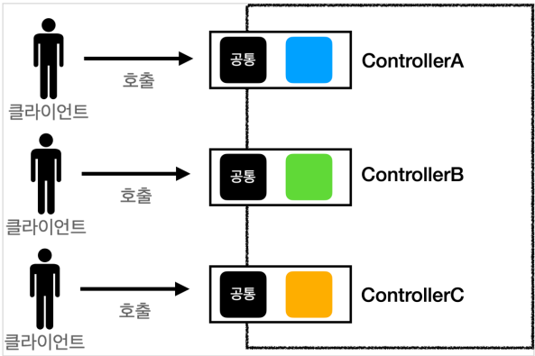
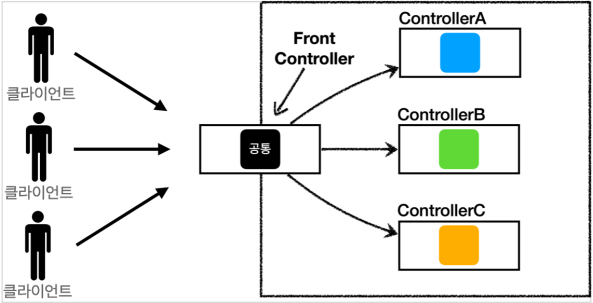
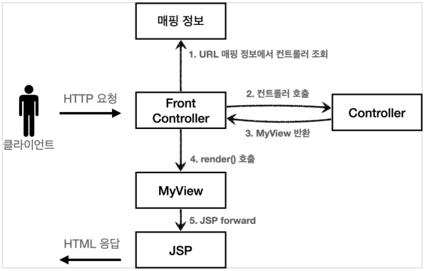
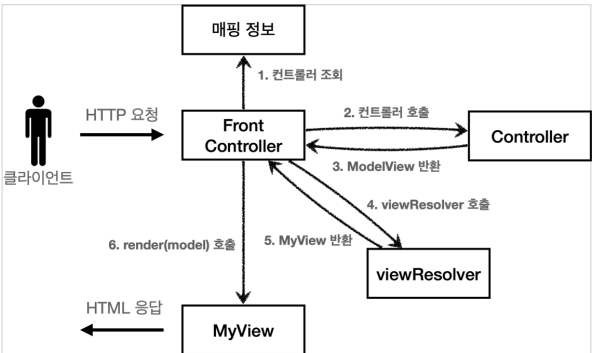
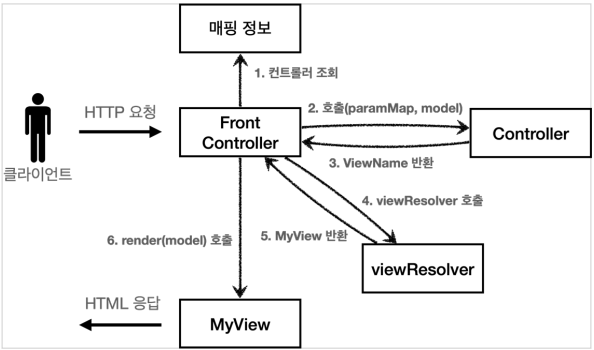
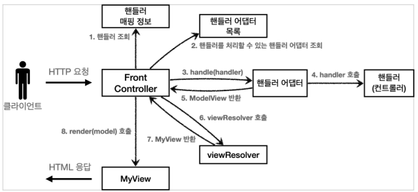

# MVC 프레임워크 만들기

# MVC 프레임워크 만들기
* toc
{:toc}

## 프론트 컨트롤러 패턴 소개
+ 프론트 컨트롤러 도입 전
  + 
+ 프론트 컨트롤러 도입 후
  + 
+ FrontController 패턴 특징
  + 프론트 컨트롤러 서블릿 하나로 클라이언트의 요청을 받는다
  + 프론트 컨트롤러가 요청에 맞는 컨트롤러를 찾아서 호출
  + 공통 처리 가능
  + 프론트 컨트롤러를 제외한 나머지 컨트롤러는 서블릿을 사용하지 않아된다
+ 스프링 웹 MVC와 프론트 컨트롤러
  + 스프링 웹 MVC의 핵심도 바로 FrontController
  + 스프링 웹 MVC의 DispatcherServlet이 FrontController 패턴으로 구현되어 있다

## 프론트 컨트롤러 도입
+ 

~~~java

package hello.servlet.web.frontcontroller.v1;
import javax.servlet.ServletException;
import javax.servlet.http.HttpServletRequest;
import javax.servlet.http.HttpServletResponse;
import java.io.IOException;

public interface ControllerV1 {
    
 void process(HttpServletRequest request, HttpServletResponse response) throws ServletException, IOException;
 
}

~~~

+ 서블릿과 비슷한 모양의 컨트롤러 인터페이스를 도입한다
+ 각 컨트롤러들은 이 인터페이스를 구현하면 된다
+ 프론트 컨트롤러는 이 인터페이스를 호출해서 구현과 관계없이 로직의 일관성을 가져갈 수 있다

~~~java

package hello.servlet.web.frontcontroller.v1.controller;

import hello.servlet.domain.member.Member;
import hello.servlet.domain.member.MemberRepository;
import hello.servlet.web.frontcontroller.v1.ControllerV1;

import javax.servlet.RequestDispatcher;
import javax.servlet.ServletException;
import javax.servlet.http.HttpServletRequest;
import javax.servlet.http.HttpServletResponse;
import java.io.IOException;

public class MemberSaveControllerV1 implements ControllerV1 {
  private MemberRepository memberRepository = MemberRepository.getInstance();

  @Override
  public void process(HttpServletRequest request, HttpServletResponse response) throws ServletException, IOException {
    String username = request.getParameter("username");
    int age = Integer.parseInt(request.getParameter("age"));
    Member member = new Member(username, age);
    memberRepository.save(member);
    request.setAttribute("member", member);
    String viewPath = "/WEB-INF/views/save-result.jsp";
    RequestDispatcher dispatcher = request.getRequestDispatcher(viewPath);
    dispatcher.forward(request, response);
  }
}

~~~

~~~java

package hello.servlet.web.frontcontroller.v1;

import hello.servlet.web.frontcontroller.v1.controller.MemberFormControllerV1;
import hello.servlet.web.frontcontroller.v1.controller.MemberListControllerV1;
import hello.servlet.web.frontcontroller.v1.controller.MemberSaveControllerV1;

import javax.servlet.ServletException;
import javax.servlet.annotation.WebServlet;
import javax.servlet.http.HttpServlet;
import javax.servlet.http.HttpServletRequest;
import javax.servlet.http.HttpServletResponse;
import java.io.IOException;
import java.util.HashMap;
import java.util.Map;

@WebServlet(name = "frontControllerServletV1", urlPatterns = "/frontcontroller/v1/*")
public class FrontControllerServletV1 extends HttpServlet {
  private Map<String, ControllerV1> controllerMap = new HashMap<>();

  public FrontControllerServletV1() {
    controllerMap.put("/front-controller/v1/members/new-form", new
            MemberFormControllerV1());
    controllerMap.put("/front-controller/v1/members/save", new
            MemberSaveControllerV1());
    controllerMap.put("/front-controller/v1/members", new
            MemberListControllerV1());
  }

  @Override
  protected void service(HttpServletRequest request, HttpServletResponse response) throws ServletException, IOException {
    System.out.println("FrontControllerServletV1.service");
    String requestURI = request.getRequestURI();
    ControllerV1 controller = controllerMap.get(requestURI);
    if (controller == null) {
      response.setStatus(HttpServletResponse.SC_NOT_FOUND);
      return;
    }
    controller.process(request, response);
  }
}

~~~

+ 프론트 컨트롤러 분석
  + urlPatterns
    + urlPatterns = "/front-controller/v1/*" : /front-controller/v1 를 포함한 하위 모든 요청은 이 서블릿에서 받아들인다
  + controllerMap
    + key: 매핑 URL
    + value: 호출될 컨트롤러
  + service()
    + 먼저 requestURI 를 조회해서 실제 호출할 컨트롤러를 controllerMap 에서 찾는다. 만약 없다면 404(SC_NOT_FOUND) 상태 코드를 반환한다
    + 컨트롤러를 찾고 controller.process(request, response); 을 호출해서 해당 컨트롤러를 실행한다

## View 분리
+ 모든 컨트롤러에서 뷰로 이동하는 부분에 중복이 있고, 깔끔하지 않다.
+ 

~~~java

package hello.servlet.web.frontcontroller;

import javax.servlet.RequestDispatcher;
import javax.servlet.ServletException;
import javax.servlet.http.HttpServletRequest;
import javax.servlet.http.HttpServletResponse;
import java.io.IOException;

public class MyView {
  private String viewPath;

  public MyView(String viewPath) {
    this.viewPath = viewPath;
  }

  public void render(HttpServletRequest request, HttpServletResponse
          response) throws ServletException, IOException {
    RequestDispatcher dispatcher = request.getRequestDispatcher(viewPath);
    dispatcher.forward(request, response);
  }
}

~~~

~~~java

package hello.servlet.web.frontcontroller.v2;

import hello.servlet.web.frontcontroller.MyView;

import javax.servlet.ServletException;
import javax.servlet.http.HttpServletRequest;
import javax.servlet.http.HttpServletResponse;
import java.io.IOException;

public interface ControllerV2 {
  MyView process(HttpServletRequest request, HttpServletResponse response) throws ServletException, IOException;
}

~~~

~~~java

import javax.servlet.http.HttpServletRequest;
import javax.servlet.http.HttpServletResponse;
import java.io.IOException;

public class MemberFormControllerV2 implements ControllerV2 {
  @Override
  public MyView process(HttpServletRequest request, HttpServletResponse response) throws ServletException, IOException {
    return new MyView("/WEB-INF/views/new-form.jsp");
  }
}

~~~

+ 각 컨트롤러는 복잡한 dispatcher.forward() 를 직접 생성해서 호출하지 않아도 된다. 단순히 MyView 객체를 생성하고 거기에 뷰 이름만 넣고 반환하면 된다.

~~~java

package hello.servlet.web.frontcontroller.v2.controller;

import hello.servlet.domain.member.Member;
import hello.servlet.domain.member.MemberRepository;
import hello.servlet.web.frontcontroller.MyView;
import hello.servlet.web.frontcontroller.v2.ControllerV2;

import javax.servlet.ServletException;
import javax.servlet.http.HttpServletRequest;
import javax.servlet.http.HttpServletResponse;
import java.io.IOException;

public class MemberSaveControllerV2 implements ControllerV2 {
  private MemberRepository memberRepository = MemberRepository.getInstance();

  @Override
  public MyView process(HttpServletRequest request, HttpServletResponse response) throws ServletException, IOException {
    String username = request.getParameter("username");
    int age = Integer.parseInt(request.getParameter("age"));
    Member member = new Member(username, age);
    memberRepository.save(member);
    request.setAttribute("member", member);
    return new MyView("/WEB-INF/views/save-result.jsp");
  }
}

~~~

~~~java

package hello.servlet.web.frontcontroller.v2;

import hello.servlet.web.frontcontroller.MyView;
import hello.servlet.web.frontcontroller.v2.controller.MemberFormControllerV2;
import hello.servlet.web.frontcontroller.v2.controller.MemberListControllerV2;
import hello.servlet.web.frontcontroller.v2.controller.MemberSaveControllerV2;

import javax.servlet.ServletException;
import javax.servlet.annotation.WebServlet;
import javax.servlet.http.HttpServlet;
import javax.servlet.http.HttpServletRequest;
import javax.servlet.http.HttpServletResponse;
import java.io.IOException;
import java.util.HashMap;
import java.util.Map;

@WebServlet(name = "frontControllerServletV2", urlPatterns = "/frontcontroller/v2/*")
public class FrontControllerServletV2 extends HttpServlet {
  private Map<String, ControllerV2> controllerMap = new HashMap<>();

  public FrontControllerServletV2() {
    controllerMap.put("/front-controller/v2/members/new-form", new
            MemberFormControllerV2());
    controllerMap.put("/front-controller/v2/members/save", new
            MemberSaveControllerV2());
    controllerMap.put("/front-controller/v2/members", new
            MemberListControllerV2());
  }

  @Override
  protected void service(HttpServletRequest request, HttpServletResponse response) throws ServletException, IOException {
    String requestURI = request.getRequestURI();
    ControllerV2 controller = controllerMap.get(requestURI);
    if (controller == null) {
      response.setStatus(HttpServletResponse.SC_NOT_FOUND);
      return;
    }
    MyView view = controller.process(request, response);
    view.render(request, response);
  }
}

~~~

+ 반환 타입이 MyView 이므로 프론트 컨트롤러는 컨트롤러의 호출 결과로 MyView 를 반환 받는다. 그리고 view.render() 를 호출하면 forward 로직을 수행해서 JSP가 실행된다.
+ 프론트 컨트롤러의 도입으로 MyView 객체의 render() 를 호출하는 부분을 모두 일관되게 처리할 수 있다. 각각의 컨트롤러는 MyView 객체를 생성만 해서 반환하면 된다.

## Model 추가
+ 서블릿 종속성 제거
  + 컨트롤러 입장에서 HttpServletRequest, HttpServletResponse이 꼭 필요할까?
  + 요청 파라미터 정보는 자바의 Map으로 대신 넘기도록 하면 지금 구조에서는 컨트롤러가 서블릿 기술을 몰라도 동작할 수 있다
  + 그리고 request 객체를 Model로 사용하는 대신에 별도의 Model 객체를 만들어서 반환하면 된다
+ 뷰 이름 중복 제거
  + 컨트롤러에서 지정하는 뷰 이름에 중복이 있는 것을 확인할 수 있다
  + 컨트롤러는 뷰의 논리 이름을 반환하고, 실제 물리 위치의 이름은 프론트 컨트롤러에서 처리하도록 단순화
  + /WEB-INF/views/new-form.jsp -> new-form
  + /WEB-INF/views/save-result.jsp -> save-result
  + /WEB-INF/views/members.jsp -> members
+ 
+ ModelView
  + 지금까지 컨트롤러에서 서블릿에 종속적인 HttpServletRequest를 사용했다. 그리고 Model도 request.setAttribute() 를 통해 데이터를 저장하고 뷰에 전달했다
  
~~~java

package hello.servlet.web.frontcontroller;

import java.util.HashMap;
import java.util.Map;

public class ModelView {
  private String viewName;
  private Map<String, Object> model = new HashMap<>();

  public ModelView(String viewName) {
    this.viewName = viewName;
  }

  public String getViewName() {
    return viewName;
  }

  public void setViewName(String viewName) {
    this.viewName = viewName;
  }

  public Map<String, Object> getModel() {
    return model;
  }

  public void setModel(Map<String, Object> model) {
    this.model = model;
  }
}

~~~

+ 뷰의 이름과 뷰를 렌더링할 때 필요한 model 객체를 가지고 있다. model은 단순히 map으로 되어 있으므로 컨트롤러에서 뷰에 필요한 데이터를 key, value로 넣어주면 된다.

~~~java

package hello.servlet.web.frontcontroller.v3;

import hello.servlet.web.frontcontroller.ModelView;

import java.util.Map;

public interface ControllerV3 {
  ModelView process(Map<String, String> paramMap);
}

~~~

+ 이 컨트롤러는 서블릿 기술을 전혀 사용하지 않는다. 따라서 구현이 매우 단순해지고, 테스트 코드 작성시 테스트 하기 쉽다
+ HttpServletRequest가 제공하는 파라미터는 프론트 컨트롤러가 paramMap에 담아서 호출해주면 된다.
+ 응답 결과로 뷰 이름과 뷰에 전달할 Model 데이터를 포함하는 ModelView 객체를 반환하면 된다

~~~java

package hello.servlet.web.frontcontroller.v3.controller;

import hello.servlet.domain.member.Member;
import hello.servlet.domain.member.MemberRepository;
import hello.servlet.web.frontcontroller.ModelView;
import hello.servlet.web.frontcontroller.v3.ControllerV3;

import java.util.Map;

public class MemberSaveControllerV3 implements ControllerV3 {
  private MemberRepository memberRepository = MemberRepository.getInstance();

  @Override
  public ModelView process(Map<String, String> paramMap) {
    String username = paramMap.get("username");
    int age = Integer.parseInt(paramMap.get("age"));
    Member member = new Member(username, age);
    memberRepository.save(member);
    ModelView mv = new ModelView("save-result");
    mv.getModel().put("member", member);
    return mv;
  }
}

~~~

+ ModelView 를 생성할 때 new-form 이라는 view의 논리적인 이름을 지정한다. 실제 물리적인 이름은 프론트 컨트롤러에서 처리한다
+ paramMap.get("username");
  + 파라미터 정보는 map에 담겨있다. map에서 필요한 요청 파라미터를 조회하면 된다
+ mv.getModel().put("member", member);
  + 모델은 단순한 map이므로 모델에 뷰에서 필요한 member 객체를 담고 반환한다

~~~java

package hello.servlet.web.frontcontroller.v3;

import hello.servlet.web.frontcontroller.ModelView;
import hello.servlet.web.frontcontroller.MyView;
import hello.servlet.web.frontcontroller.v3.controller.MemberFormControllerV3;
import hello.servlet.web.frontcontroller.v3.controller.MemberListControllerV3;
import hello.servlet.web.frontcontroller.v3.controller.MemberSaveControllerV3;

import javax.servlet.ServletException;
import javax.servlet.annotation.WebServlet;
import javax.servlet.http.HttpServlet;
import javax.servlet.http.HttpServletRequest;
import javax.servlet.http.HttpServletResponse;
import java.io.IOException;
import java.util.HashMap;
import java.util.Map;

@WebServlet(name = "frontControllerServletV3", urlPatterns = "/frontcontroller/v3/*")
public class FrontControllerServletV3 extends HttpServlet {
  private Map<String, ControllerV3> controllerMap = new HashMap<>();

  public FrontControllerServletV3() {
    controllerMap.put("/front-controller/v3/members/new-form", new
            MemberFormControllerV3());
    controllerMap.put("/front-controller/v3/members/save", new
            MemberSaveControllerV3());
    controllerMap.put("/front-controller/v3/members", new
            MemberListControllerV3());
  }

  @Override
  protected void service(HttpServletRequest request, HttpServletResponse response) throws ServletException, IOException {
    String requestURI = request.getRequestURI();
    ControllerV3 controller = controllerMap.get(requestURI);
    if (controller == null) {
      response.setStatus(HttpServletResponse.SC_NOT_FOUND);
      return;
    }
    Map<String, String> paramMap = createParamMap(request);
    ModelView mv = controller.process(paramMap);
    String viewName = mv.getViewName();
    MyView view = viewResolver(viewName);
    view.render(mv.getModel(), request, response);
  }

  private Map<String, String> createParamMap(HttpServletRequest request) {
    Map<String, String> paramMap = new HashMap<>();
    request.getParameterNames().asIterator()
            .forEachRemaining(paramName -> paramMap.put(paramName,
                    request.getParameter(paramName)));
    return paramMap;
  }

  private MyView viewResolver(String viewName) {
    return new MyView("/WEB-INF/views/" + viewName + ".jsp");
  }
}

~~~

+ createParamMap()
  + HttpServletRequest에서 파라미터 정보를 꺼내서 Map으로 변환한다. 그리고 해당 Map( paramMap )을 컨트롤러에 전달하면서 호출한다.

### 뷰 리졸버
+ MyView view = viewResolver(viewName)
  + 컨트롤러가 반환한 논리 뷰 이름을 실제 물리 뷰 경로로 변경한다. 그리고 실제 물리 경로가 있는 MyView 객체를 반환한다.
  + 논리 뷰 이름: members
  + 물리 뷰 경로: /WEB-INF/views/members.jsp
+ view.render(mv.getModel(), request, response)
  + 뷰 객체를 통해서 HTML 화면을 렌더링 한다
  + 뷰 객체의 render() 는 모델 정보도 함께 받는다.
  + JSP는 request.getAttribute() 로 데이터를 조회하기 때문에, 모델의 데이터를 꺼내서 request.setAttribute() 로 담아둔다
  + JSP로 포워드 해서 JSP를 렌더링 한다

~~~java

package hello.servlet.web.frontcontroller;

import javax.servlet.RequestDispatcher;
import javax.servlet.ServletException;
import javax.servlet.http.HttpServletRequest;
import javax.servlet.http.HttpServletResponse;
import java.io.IOException;
import java.util.Map;

public class MyView {
  private String viewPath;

  public MyView(String viewPath) {
    this.viewPath = viewPath;
  }

  public void render(HttpServletRequest request, HttpServletResponse
          response) throws ServletException, IOException {
    RequestDispatcher dispatcher = request.getRequestDispatcher(viewPath);
    dispatcher.forward(request, response);
  }

  public void render(Map<String, Object> model, HttpServletRequest request,
                     HttpServletResponse response) throws ServletException, IOException {
    modelToRequestAttribute(model, request);
    RequestDispatcher dispatcher = request.getRequestDispatcher(viewPath);
    dispatcher.forward(request, response);
  }

  private void modelToRequestAttribute(Map<String, Object> model,
                                       HttpServletRequest request) {
    model.forEach((key, value) -> request.setAttribute(key, value));
  }
}

~~~

## 단순하고 실용적인 컨트롤러
+ 실제 컨트톨러 인터페이스를 구현하는 개발자 입장에서 보면, 항상 ModelView 객체를 생성하고 반환해야 하는 부분이 조금은 번거롭다
+ 좋은 프레임워크는 아키텍처도 중요하지만, 그와 더불어 실제 개발하는 개발자가 단순하고 편리하게 사용할 수 있어야 한다. 소위 실용성이 있어야 한다
+ 
  + 컨트롤러가 ModelView 를 반환하지 않고, ViewName 만 반환한다.

~~~java

package hello.servlet.web.frontcontroller.v4;

import java.util.Map;

public interface ControllerV4 {
  /**
   * @param paramMap
   * @param model
   * @return viewName
   */
  String process(Map<String, String> paramMap, Map<String, Object> model);
}

~~~

+ model 객체는 파라미터로 전달되기 때문에 그냥 사용하면 되고, 결과로 뷰의 이름만 반환해주면 된다

~~~java

package hello.servlet.web.frontcontroller.v4.controller;

import hello.servlet.domain.member.Member;
import hello.servlet.domain.member.MemberRepository;
import hello.servlet.web.frontcontroller.v4.ControllerV4;

import java.util.Map;

public class MemberSaveControllerV4 implements ControllerV4 {
  private MemberRepository memberRepository = MemberRepository.getInstance();

  @Override
  public String process(Map<String, String> paramMap, Map<String, Object> model) {
    String username = paramMap.get("username");
    int age = Integer.parseInt(paramMap.get("age"));
    Member member = new Member(username, age);
    memberRepository.save(member);
    model.put("member", member);
    return "save-result";
  }
}

~~~

+ model.put("member", member)
  + 모델이 파라미터로 전달되기 때문에, 모델을 직접 생성하지 않아도 된다

~~~java

package hello.servlet.web.frontcontroller.v4;

import hello.servlet.web.frontcontroller.MyView;
import hello.servlet.web.frontcontroller.v4.controller.MemberFormControllerV4;
import hello.servlet.web.frontcontroller.v4.controller.MemberListControllerV4;
import hello.servlet.web.frontcontroller.v4.controller.MemberSaveControllerV4;

import javax.servlet.ServletException;
import javax.servlet.annotation.WebServlet;
import javax.servlet.http.HttpServlet;
import javax.servlet.http.HttpServletRequest;
import javax.servlet.http.HttpServletResponse;
import java.io.IOException;
import java.util.HashMap;
import java.util.Map;

@WebServlet(name = "frontControllerServletV4", urlPatterns = "/front-controller/v4/*")
public class FrontControllerServletV4 extends HttpServlet {
  private Map<String, ControllerV4> controllerMap = new HashMap<>();

  public FrontControllerServletV4() {
    controllerMap.put("/front-controller/v4/members/new-form", new
            MemberFormControllerV4());
    controllerMap.put("/front-controller/v4/members/save", new
            MemberSaveControllerV4());
    controllerMap.put("/front-controller/v4/members", new
            MemberListControllerV4());
  }

  @Override
  protected void service(HttpServletRequest request, HttpServletResponse
          response)
          throws ServletException, IOException {
    String requestURI = request.getRequestURI();
    ControllerV4 controller = controllerMap.get(requestURI);
    if (controller == null) {
      response.setStatus(HttpServletResponse.SC_NOT_FOUND);
      return;
    }
    Map<String, String> paramMap = createParamMap(request);
    Map<String, Object> model = new HashMap<>(); //추가
    String viewName = controller.process(paramMap, model);
    MyView view = viewResolver(viewName);
    view.render(model, request, response);
  }

  private Map<String, String> createParamMap(HttpServletRequest request) {
    Map<String, String> paramMap = new HashMap<>();
    request.getParameterNames().asIterator()
            .forEachRemaining(paramName -> paramMap.put(paramName,
                    request.getParameter(paramName)));
    return paramMap;
  }

  private MyView viewResolver(String viewName) {
    return new MyView("/WEB-INF/views/" + viewName + ".jsp");
  }
}

~~~

+ 모델 객체 전달
  + Map<String, Object> model = new HashMap<>(); //추가
  + 모델 객체를 프론트 컨트롤러에서 생성해서 넘겨준다. 컨트롤러에서 모델 객체에 값을 담으면 여기에 그대로 담겨있게 된다
+ 뷰의 논리 이름을 직접 반환
  + 컨트롤로가 직접 뷰의 논리 이름을 반환하므로 이 값을 사용해서 실제 물리 뷰를 찾을 수 있다

## 유연한 컨트롤러1
+ 어댑터 패턴
  + 어댑터 패턴을 사용해서 프론트 컨트롤러가 다양한 방식의 컨트롤러를 처리할 수 있도록 변경
+ 
  + 핸들러 어댑터: 중간에 어댑터 역할을 하는 어댑터가 추가되었는데 이름이 핸들러 어댑터이다. 여기서 어댑터 역할을 해주는 덕분에 다양한 종류의 컨트롤러를 호출할 수 있다
  + 핸들러: 컨트롤러의 이름을 더 넓은 범위인 핸들러로 변경했다. 그 이유는 이제 어댑터가 있기 때문에 꼭 컨트롤러의 개념 뿐만 아니라 어떠한 것이든 해당하는 종류의 어댑터만 있으면 다 처리할 수 있기 때문이다

~~~java

package hello.servlet.web.frontcontroller.v5;

import hello.servlet.web.frontcontroller.ModelView;

import javax.servlet.ServletException;
import javax.servlet.http.HttpServletRequest;
import javax.servlet.http.HttpServletResponse;
import java.io.IOException;

public interface MyHandlerAdapter {
  boolean supports(Object handler);

  ModelView handle(HttpServletRequest request, HttpServletResponse response, Object handler) throws ServletException, IOException;
}

~~~

+ boolean supports(Object handler)
  + handler는 컨트롤러를 말한다
  + 어댑터가 해당 컨트롤러를 처리할 수 있는지 판단하는 메서드다
+ ModelView handle(HttpServletRequest request, HttpServletResponse response, Object handler)
  + 어댑터는 실제 컨트롤러를 호출하고, 그 결과로 ModelView를 반환해야 한다
  + 실제 컨트롤러가 ModelView를 반환하지 못하면, 어댑터가 ModelView를 직접 생성해서라도 반환해야 한다
  + 이전에는 프론트 컨트롤러가 실제 컨트롤러를 호출했지만 이제는 이 어댑터를 통해서 실제 컨트롤러가 호출된다

~~~java

package hello.servlet.web.frontcontroller.v5.adapter;

import hello.servlet.web.frontcontroller.ModelView;
import hello.servlet.web.frontcontroller.v3.ControllerV3;
import hello.servlet.web.frontcontroller.v5.MyHandlerAdapter;

import javax.servlet.http.HttpServletRequest;
import javax.servlet.http.HttpServletResponse;
import java.util.HashMap;
import java.util.Map;

public class ControllerV3HandlerAdapter implements MyHandlerAdapter {
   // ControllerV3 을 처리할 수 있는 어댑터를 뜻한다
  @Override
  public boolean supports(Object handler) {
    return (handler instanceof ControllerV3);
  }

  // handler를 컨트롤러 V3로 변환한 다음에 V3 형식에 맞도록 호출한다
  // supports() 를 통해 ControllerV3 만 지원하기 때문에 타입 변환은 걱정없이 실행해도 된다.
  // ControllerV3는 ModelView를 반환하므로 그대로 ModelView를 반환하면 된다
  @Override
  public ModelView handle(HttpServletRequest request, HttpServletResponse response, Object handler) {
    ControllerV3 controller = (ControllerV3) handler;
    Map<String, String> paramMap = createParamMap(request);
    ModelView mv = controller.process(paramMap);
    return mv;
  }

  private Map<String, String> createParamMap(HttpServletRequest request) {
    Map<String, String> paramMap = new HashMap<>();
    request.getParameterNames().asIterator()
            .forEachRemaining(paramName -> paramMap.put(paramName,
                    request.getParameter(paramName)));
    return paramMap;
  }
}

~~~

~~~java

package hello.servlet.web.frontcontroller.v5;

import hello.servlet.web.frontcontroller.ModelView;
import hello.servlet.web.frontcontroller.MyView;
import hello.servlet.web.frontcontroller.v3.controller.MemberFormControllerV3;
import hello.servlet.web.frontcontroller.v3.controller.MemberListControllerV3;
import hello.servlet.web.frontcontroller.v3.controller.MemberSaveControllerV3;
import hello.servlet.web.frontcontroller.v5.adapter.ControllerV3HandlerAdapter;
import hello.servlet.web.frontcontroller.v5.adapter.ControllerV4HandlerAdapter;

import javax.servlet.ServletException;
import javax.servlet.annotation.WebServlet;
import javax.servlet.http.HttpServlet;
import javax.servlet.http.HttpServletRequest;
import javax.servlet.http.HttpServletResponse;
import java.io.IOException;
import java.util.ArrayList;
import java.util.HashMap;
import java.util.List;
import java.util.Map;

@WebServlet(name = "frontControllerServletV5", urlPatterns = "/frontcontroller/v5/*")
public class FrontControllerServletV5 extends HttpServlet {
  private final Map<String, Object> handlerMappingMap = new HashMap<>();
  private final List<MyHandlerAdapter> handlerAdapters = new ArrayList<>();

  public FrontControllerServletV5() {
    initHandlerMappingMap();
    initHandlerAdapters();
  }

  private void initHandlerMappingMap() {
    handlerMappingMap.put("/front-controller/v5/v3/members/new-form", new
            MemberFormControllerV3());
    handlerMappingMap.put("/front-controller/v5/v3/members/save", new
            MemberSaveControllerV3());
    handlerMappingMap.put("/front-controller/v5/v3/members", new
            MemberListControllerV3());
  }

  private void initHandlerAdapters() {
    handlerAdapters.add(new ControllerV3HandlerAdapter());
  }

  @Override
  protected void service(HttpServletRequest request, HttpServletResponse response) throws ServletException, IOException {
    Object handler = getHandler(request);
    if (handler == null) {
      response.setStatus(HttpServletResponse.SC_NOT_FOUND);
      return;
    }
    MyHandlerAdapter adapter = getHandlerAdapter(handler);
    ModelView mv = adapter.handle(request, response, handler);
    MyView view = viewResolver(mv.getViewName());
    view.render(mv.getModel(), request, response);
  }

  private Object getHandler(HttpServletRequest request) {
    String requestURI = request.getRequestURI();
    return handlerMappingMap.get(requestURI);
  }

  private MyHandlerAdapter getHandlerAdapter(Object handler) {
    for (MyHandlerAdapter adapter : handlerAdapters) {
      if (adapter.supports(handler)) {
        return adapter;
      }
    }
    throw new IllegalArgumentException("handler adapter를 찾을 수 없습니다. handler = " + handler);
  }

  private MyView viewResolver(String viewName) {
    return new MyView("/WEB-INF/views/" + viewName + ".jsp");
  }
}

~~~

+ 컨트롤러(Controller) 핸들러(Handler)
  + 이전에는 컨트롤러를 직접 매핑해서 사용했다. 그런데 이제는 어댑터를 사용하기 때문에, 컨트롤러 뿐만
    아니라 어댑터가 지원하기만 하면, 어떤 것이라도 URL에 매핑해서 사용할 수 있다. 그래서 이름을
    컨트롤러에서 더 넒은 범위의 핸들러로 변경했다
+ 생성자는 핸들러 매핑과 어댑터를 초기화(등록)한다
+ 매핑 정보
  + private final Map<String, Object> handlerMappingMap = new HashMap<>();
  + 매핑 정보의 값이 ControllerV3 , ControllerV4 같은 인터페이스에서 아무 값이나 받을 수 있는 Object 로 변경되었다 
+ 핸들러 매핑
  + 핸들러 매핑 정보인 handlerMappingMap 에서 URL에 매핑된 핸들러(컨트롤러) 객체를 찾아서 반환한다
+ 핸들러를 처리할 수 있는 어댑터 조회
  + MyHandlerAdapter adapter = getHandlerAdapter(handler)
  + handler 를 처리할 수 있는 어댑터를 adapter.supports(handler) 를 통해서 찾는다
  + handler가 ControllerV3 인터페이스를 구현했다면, ControllerV3HandlerAdapter 객체가 반환된다
+ 어댑터 호출
  + ModelView mv = adapter.handle(request, response, handler);
  + 어댑터의 handle(request, response, handler) 메서드를 통해 실제 어댑터가 호출된다
  + 어댑터는 handler(컨트롤러)를 호출하고 그 결과를 어댑터에 맞추어 반환한다
  + ControllerV3HandlerAdapter 의 경우 어댑터의 모양과 컨트롤러의 모양이 유사해서 변환 로직이 단순하다

## 유연한 컨트롤러2

~~~java

private void initHandlerMappingMap() {
 handlerMappingMap.put("/front-controller/v5/v3/members/new-form", new
MemberFormControllerV3());
 handlerMappingMap.put("/front-controller/v5/v3/members/save", new
MemberSaveControllerV3());
 handlerMappingMap.put("/front-controller/v5/v3/members", new
MemberListControllerV3());
 //V4 추가
 handlerMappingMap.put("/front-controller/v5/v4/members/new-form", new
MemberFormControllerV4());
 handlerMappingMap.put("/front-controller/v5/v4/members/save", new
MemberSaveControllerV4());
 handlerMappingMap.put("/front-controller/v5/v4/members", new
MemberListControllerV4());
}
private void initHandlerAdapters() {
 handlerAdapters.add(new ControllerV3HandlerAdapter());
 handlerAdapters.add(new ControllerV4HandlerAdapter()); //V4 추가
}

~~~

+ 핸들러 매핑( handlerMappingMap )에 ControllerV4 를 사용하는 컨트롤러를 추가하고, 해당 컨트롤러를 처리할 수 있는 어댑터인 ControllerV4HandlerAdapter 도 추가

~~~java

package hello.servlet.web.frontcontroller.v5.adapter;

import hello.servlet.web.frontcontroller.ModelView;
import hello.servlet.web.frontcontroller.v4.ControllerV4;
import hello.servlet.web.frontcontroller.v5.MyHandlerAdapter;

import javax.servlet.http.HttpServletRequest;
import javax.servlet.http.HttpServletResponse;
import java.util.HashMap;
import java.util.Map;

public class ControllerV4HandlerAdapter implements MyHandlerAdapter {
  // handler 가 ControllerV4 인 경우에만 처리하는 어댑터이다
  @Override
  public boolean supports(Object handler) {
    return (handler instanceof ControllerV4);
  }

  
  // handler를 ControllerV4로 케스팅 하고, paramMap, model을 만들어서 해당 컨트롤러를 호출한다. 그리고 viewName을 반환 받는다.
  @Override
  public ModelView handle(HttpServletRequest request, HttpServletResponse response, Object handler) {
    ControllerV4 controller = (ControllerV4) handler;
    Map<String, String> paramMap = createParamMap(request);
    Map<String, Object> model = new HashMap<>();
    String viewName = controller.process(paramMap, model);

    // 어댑터가 호출하는 ControllerV4 는 뷰의 이름을 반환한다. 그런데 어댑터는 뷰의 이름이 아니라
    // ModelView 를 만들어서 반환해야 한다. 여기서 어댑터가 꼭 필요한 이유가 나온다.
    // ControllerV4 는 뷰의 이름을 반환했지만, 어댑터는 이것을 ModelView로 만들어서 형식을 맞추어
    // 반환한다.
    ModelView mv = new ModelView(viewName);
    mv.setModel(model);

    return mv;
  }

  private Map<String, String> createParamMap(HttpServletRequest request) {
    Map<String, String> paramMap = new HashMap<>();
    request.getParameterNames().asIterator()
            .forEachRemaining(paramName -> paramMap.put(paramName,
                    request.getParameter(paramName)));
    return paramMap;
  }
}

~~~
