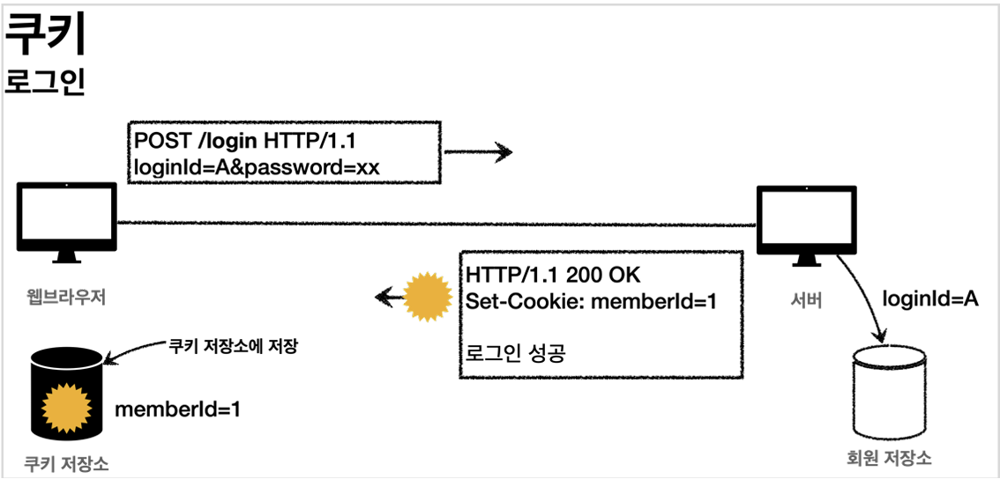
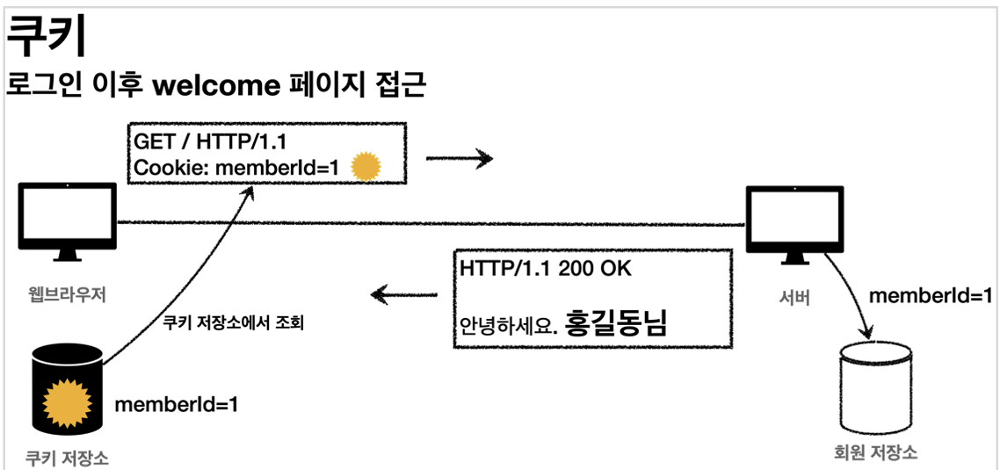
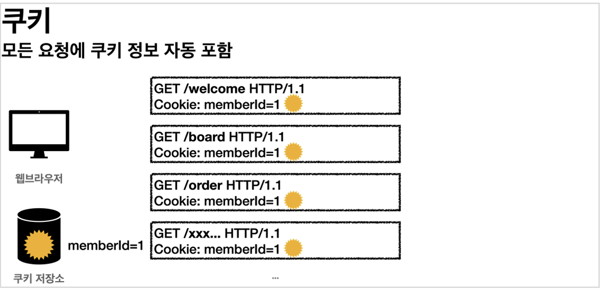
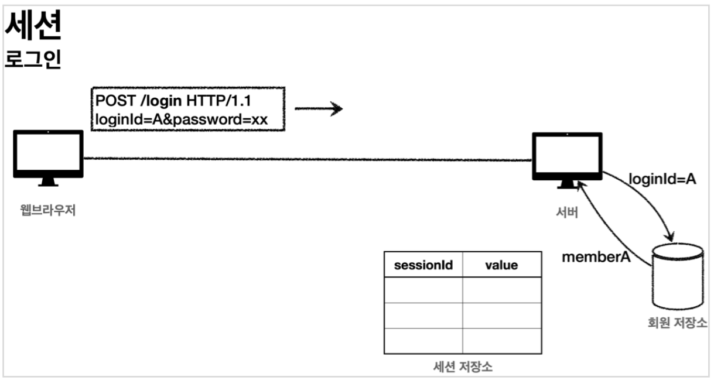
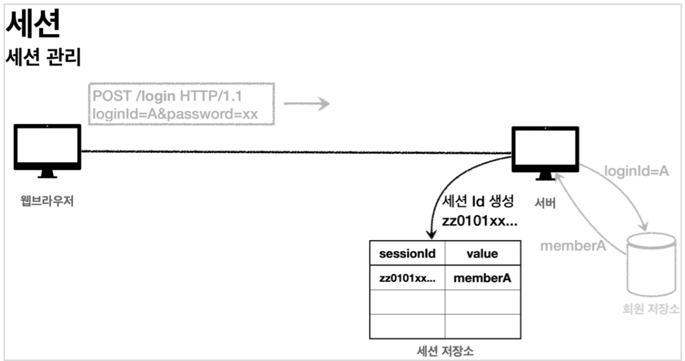
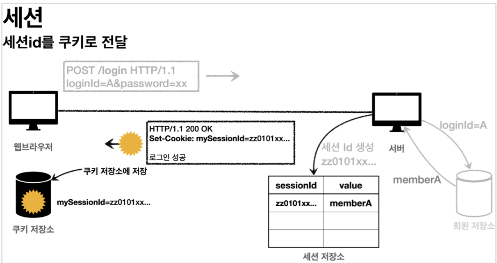
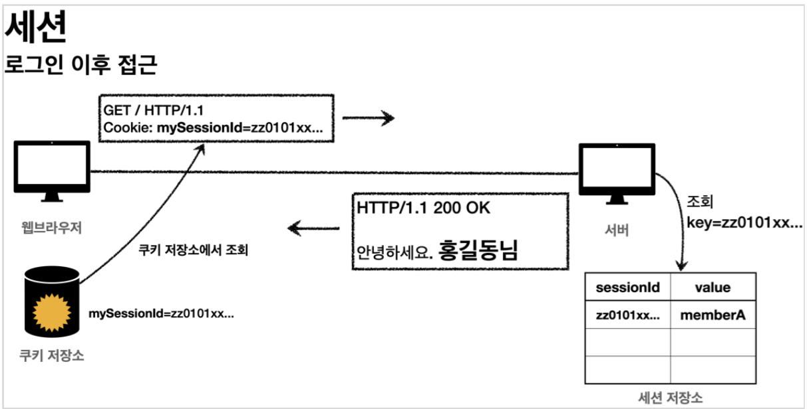

# 로그인 처리1 - 쿠키, 세션 

# 로그인 처리1 - 쿠키, 세션

* toc
{:toc}

## 로그인 요구사항
+ 홈 화면 - 로그인 전
  + 회원 가입
  + 로그인
+ 홈 화면 - 로그인 후
  + 본인 이름(누구님 환영합니다.)
  + 상품 관리
  + 로그 아웃
+ 보안 요구사항
  + 로그인 사용자만 상품에 접근하고, 관리할 수 있다
  + 로그인 하지 않은 사용자가 상품 관리에 접근하면 로그인 화면으로 이동
+ 회원 가입, 상품 관리

## 프로젝트 생성

### package 구조
+ hello.login
  + domain
    + item
    + member
    + login
  + web
    + item
    + member
    + login

+ 도메인이 가장 중요하다.
  + 도메인 = 화면, UI, 기술 인프라 등등의 영역은 제외한 시스템이 구현해야 하는 핵심 비즈니스 업무 영역을 말한다
  + 향후 web을 다른 기술로 바꾸어도 도메인은 그대로 유지할 수 있어야 한다
  + 이렇게 하려면 web은 domain을 알고있지만 domain은 web을 모르도록 설계해야 한다.
  + 이것을 web은 domain을 의존하지만, domain은 web을 의존하지 않는다고 표현한다.
  + 예를 들어 web 패키지를 모두 삭제해도 domain에는 전혀 영향이 없도록 의존관계를 설계하는 것이 중요하다.
  + 반대로 이야기하면 domain은 web을 참조하면 안된다.

### 로그인 처리하기 - 쿠키 사용

#### 로그인 기능

+ 로그인 상태 유지하기
  + 서버에서 로그인에 성공하면 HTTP 응답에 쿠키를 담아서 브라우저에 전달하자. 그러면 브라우저는 앞으로
    해당 쿠키를 지속해서 보내준다.
+ 쿠키 생성 
  + 
+ 클라이언트 쿠키 전달1
  + 
+ 클라이언트 쿠키 전달2
  + 
+ 쿠키에는 영속 쿠키와 세션 쿠키가 있다.
  + 영속 쿠키: 만료 날짜를 입력하면 해당 날짜까지 유지
  + 세션 쿠키: 만료 날짜를 생략하면 브라우저 종료시 까지만 유지

~~~java

Cookie idCookie = new Cookie("memberId", String.valueOf(loginMember.getId()));
response.addCookie(idCookie);

~~~
+ 로그인에 성공하면 쿠키를 생성하고 HttpServletResponse에 담는다. 쿠키 이름은 memberId이고, 값은 회원의 id를 담아둔다. 웹 브라우저는 종료 전까지 회원의 id를 서버에 계속 보내줄 것이다

~~~java

package hello.login.web;

import hello.login.domain.member.Member;
import hello.login.domain.member.MemberRepository;
import lombok.RequiredArgsConstructor;
import lombok.extern.slf4j.Slf4j;
import org.springframework.stereotype.Controller;
import org.springframework.ui.Model;
import org.springframework.web.bind.annotation.CookieValue;
import org.springframework.web.bind.annotation.GetMapping;

@Slf4j
@Controller
@RequiredArgsConstructor
public class HomeController {

  private final MemberRepository memberRepository;

  // @GetMapping("/")
  public String home() {
    return "home";
  }

  @GetMapping("/")
  public String homeLogin(
          @CookieValue(name = "memberId", required = false) Long memberId,
          Model model) {
    if (memberId == null) {
      return "home";
    }
    //로그인
    Member loginMember = memberRepository.findById(memberId);
    if (loginMember == null) {
      return "home";
    }
    model.addAttribute("member", loginMember);
    return "loginHome";
  }
}

~~~

+ ```@CookieValue``` 를 사용하면 편리하게 쿠키를 조회할 수 있다.
+ 로그인 하지 않은 사용자도 홈에 접근할 수 있기 때문에 ```required = false``` 를 사용한다.

#### 로그아웃 기능
+ 세션 쿠키이므로 웹 브라우저 종료시
+ 서버에서 해당 쿠키의 종료 날짜를 0으로 지정

~~~java

@PostMapping("/logout")
public String logout(HttpServletResponse response) {
 expireCookie(response, "memberId");
 return "redirect:/";
}
private void expireCookie(HttpServletResponse response, String cookieName) {
 Cookie cookie = new Cookie(cookieName, null);
 cookie.setMaxAge(0);
 response.addCookie(cookie);
}

~~~

+ 로그아웃도 응답 쿠키를 생성하는데 Max-Age=0 를 확인할 수 있다. 해당 쿠키는 즉시 종료된다.

## 쿠키와 보안 문제
+ 쿠키 값은 임의로 변경할 수 있다.
  + 클라이언트가 쿠키를 강제로 변경하면 다른 사용자가 된다
  + 실제 웹브라우저 개발자모드 -> Application -> Cookie 변경으로 확인
  + ```Cookie: memberId=1``` -> ```Cookie: memberId=2``` (다른 사용자의 이름이 보임)
+ 쿠키에 보관된 정보는 훔쳐갈 수 있다.
  + 만약 쿠키에 개인정보나, 신용카드 정보가 있다면?
  + 정보가 웹 브라우저에도 보관되고, 네트워크 요청마다 계속 클라이언트에서 서버로 전달된다.
  + 쿠키의 정보가 나의 로컬 PC에서 털릴 수도 있고, 네트워크 전송 구간에서 털릴 수도 있다.
+ 해커가 쿠키를 한번 훔쳐가면 평생 사용할 수 있다.
  + 해커가 쿠키를 훔쳐가서 그 쿠키로 악의적인 요청을 계속 시도할 수 있다

### 대안
+ 쿠키에 중요한 값을 노출하지 않고, 사용자 별로 예측 불가능한 임의의 토큰(랜덤 값)을 노출하고, 서버에서 토큰과 사용자 id를 매핑해서 인식한다. 그리고 서버에서 토큰을 관리한다.
+ 토큰은 해커가 임의의 값을 넣어도 찾을 수 없도록 예상 불가능 해야 한다.
+ 해커가 토큰을 털어가도 시간이 지나면 사용할 수 없도록 서버에서 해당 토큰의 만료시간을 짧게(예: 30분)유지한다. 또는 해킹이 의심되는 경우 서버에서 해당 토큰을 강제로 제거하면 된다.

## 로그인 처리하기 - 세션 동작 방식
+ 서버에 중요한 정보를 보관하고 연결을 유지하는 방법을 세션이라 한다

### 세션 동작 방식
+ 로그인
  + 
  + 사용자가 loginId , password 정보를 전달하면 서버에서 해당 사용자가 맞는지 확인한다
+ 세션 생성
  + 
  + 세션 ID를 생성하는데, 추정 불가능해야 한다.
  + UUID는 추정이 불가능하다.
    + ```Cookie: mySessionId=zz0101xx-bab9-4b92-9b32-dadb280f4b61```
  + 생성된 세션 ID와 세션에 보관할 값( memberA )을 서버의 세션 저장소에 보관한다
+ 세션id를 응답 쿠키로 전달
  + 
  + 클라이언트와 서버는 결국 쿠키로 연결이 되어야 한다
    + 서버는 클라이언트에 mySessionId 라는 이름으로 세션ID 만 쿠키에 담아서 전달한다
    + 클라이언트는 쿠키 저장소에 mySessionId 쿠키를 보관한다
  + 여기서 중요한 포인트는 회원과 관련된 정보는 전혀 클라이언트에 전달하지 않는다는 것이다.
  + 오직 추정 불가능한 세션 ID만 쿠키를 통해 클라이언트에 전달한다.
+ 클라이언트의 세션id 쿠키 전달
  + 
  + 클라이언트는 요청시 항상 mySessionId 쿠키를 전달한다.
  + 서버에서는 클라이언트가 전달한 mySessionId 쿠키 정보로 세션 저장소를 조회해서 로그인시 보관한 세션 정보를 사용한다.

### 정리
+ 쿠키 값을 변조 가능 -> 예상 불가능한 복잡한 세션Id를 사용한다.
+ 쿠키에 보관하는 정보는 클라이언트 해킹시 털릴 가능성이 있다. -> 세션Id가 털려도 여기에는 중요한 정보가 없다.
+ 쿠키 탈취 후 사용 -> 해커가 토큰을 털어가도 시간이 지나면 사용할 수 없도록 서버에서 세션의 만료시간을 짧게(예: 30분) 유지한다. 또는 해킹이 의심되는 경우 서버에서 해당 세션을 강제로 제거하면 된다.

## 로그인 처리하기 - 세션 직접 만들기
세션 관리는 크게 다음 3가지 기능을 제공하면 된다.
+ 세션 생성
  + sessionId 생성 (임의의 추정 불가능한 랜덤 값)
  + 세션 저장소에 sessionId와 보관할 값 저장
  + sessionId로 응답 쿠키를 생성해서 클라이언트에 전달
+ 세션 조회
  + 클라이언트가 요청한 sessionId 쿠키의 값으로, 세션 저장소에 보관한 값 조회
+ 세션 만료
  + 클라이언트가 요청한 sessionId 쿠키의 값으로, 세션 저장소에 보관한 sessionId와 값 제거

### SessionManager - 세션 관리

~~~java

package hello.login.web.session;

import org.springframework.stereotype.Component;

import javax.servlet.http.Cookie;
import javax.servlet.http.HttpServletRequest;
import javax.servlet.http.HttpServletResponse;
import java.util.Arrays;
import java.util.Map;
import java.util.UUID;
import java.util.concurrent.ConcurrentHashMap;

/**
 * 세션 관리
 */
@Component
public class SessionManager {
  public static final String SESSION_COOKIE_NAME = "mySessionId";
  private Map<String, Object> sessionStore = new ConcurrentHashMap<>();

  /**
   * 세션 생성
   */
  public void createSession(Object value, HttpServletResponse response) {
    //세션 id를 생성하고, 값을 세션에 저장
    String sessionId = UUID.randomUUID().toString();
    sessionStore.put(sessionId, value);
    //쿠키 생성
    Cookie mySessionCookie = new Cookie(SESSION_COOKIE_NAME, sessionId);
    response.addCookie(mySessionCookie);
  }

  /**
   * 세션 조회
   */
  public Object getSession(HttpServletRequest request) {
    Cookie sessionCookie = findCookie(request, SESSION_COOKIE_NAME);
    if (sessionCookie == null) {
      return null;
    }
    return sessionStore.get(sessionCookie.getValue());
  }

  /**
   * 세션 만료
   */
  public void expire(HttpServletRequest request) {
    Cookie sessionCookie = findCookie(request, SESSION_COOKIE_NAME);
    if (sessionCookie != null) {
      sessionStore.remove(sessionCookie.getValue());
    }
  }

  private Cookie findCookie(HttpServletRequest request, String cookieName) {
    if (request.getCookies() == null) {
      return null;
    }
    return Arrays.stream(request.getCookies())
            .filter(cookie -> cookie.getName().equals(cookieName))
            .findAny()
            .orElse(null);
  }
}

~~~

+ ```@Component``` : 스프링 빈으로 자동 등록한다.
+ ```ConcurrentHashMap``` : HashMap 은 동시 요청에 안전하지 않다. 동시 요청에 안전한 ```ConcurrentHashMap``` 를 사용했다.

### SessionManagerTest - 테스트

~~~java

package hello.login.web.session;

import hello.login.domain.member.Member;
import org.junit.jupiter.api.Test;
import org.springframework.mock.web.MockHttpServletRequest;
import org.springframework.mock.web.MockHttpServletResponse;

import static org.assertj.core.api.Assertions.assertThat;

class SessionManagerTest {
  SessionManager sessionManager = new SessionManager();

  @Test
  void sessionTest() {
    //세션 생성
    MockHttpServletResponse response = new MockHttpServletResponse();
    Member member = new Member();
    sessionManager.createSession(member, response);
    //요청에 응답 쿠키 저장
    MockHttpServletRequest request = new MockHttpServletRequest();
    request.setCookies(response.getCookies());
    //세션 조회
    Object result = sessionManager.getSession(request);
    assertThat(result).isEqualTo(member);
    //세션 만료
    sessionManager.expire(request);
    Object expired = sessionManager.getSession(request);
    assertThat(expired).isNull();
  }
}

~~~

+ ```HttpServletRequest``` , ```HttpservletResponse``` 객체를 직접 사용할 수 없기 때문에 테스트에서 비슷한 역할을 해주는 가짜 ```MockHttpServletRequest``` , ```MockHttpServletResponse``` 를 사용했다.

## 로그인 처리하기 - 직접 만든 세션 적용

~~~java

@PostMapping("/login")
public String loginV2(@Valid @ModelAttribute LoginForm form,BindingResult
        bindingResult,HttpServletResponse response){
        if(bindingResult.hasErrors()){
            return"login/loginForm";
        }
        Member loginMember=loginService.login(form.getLoginId(),
        form.getPassword());
        log.info("login? {}",loginMember);
        if(loginMember==null){
            bindingResult.reject("loginFail","아이디 또는 비밀번호가 맞지 않습니다.");
            return"login/loginForm";
        }
        //로그인 성공 처리
        //세션 관리자를 통해 세션을 생성하고, 회원 데이터 보관
        sessionManager.createSession(loginMember,response);
        return"redirect:/";
}

~~~

+ sessionManager.createSession(loginMember, response); 로그인 성공시 세션을 등록한다. 세션에 loginMember 를 저장해두고, 쿠키도 함께 발행한다.


~~~java

@PostMapping("/logout")
public String logoutV2(HttpServletRequest request) {
 sessionManager.expire(request);
 return "redirect:/";
}

~~~

+ 로그 아웃시 해당 세션의 정보를 제거한다

~~~java

@GetMapping("/")
public String homeLoginV2(HttpServletRequest request, Model model) {
 //세션 관리자에 저장된 회원 정보 조회
 Member member = (Member)sessionManager.getSession(request);
 if (member == null) {
 return "home";
 }
 //로그인
 model.addAttribute("member", member);
 return "loginHome";
}

~~~

+ 세션 관리자에서 저장된 회원 정보를 조회한다. 만약 회원 정보가 없으면, 쿠키나 세션이 없는 것 이므로 로그인 되지 않은 것으로 처리한다.

### 정리
+ 세션이라는 것이 뭔가 특별한 것이 아니라 단지 쿠키를 사용하는데, 서버에서 데이터를 유지하는 방법일 뿐이라는 것을 이해했을 것이다.
+ 그런데 프로젝트마다 이러한 세션 개념을 직접 개발하는 것은 상당히 불편할 것이다. 그래서 서블릿도 세션 개념을 지원한다.
+ 서블릿이 공식 지원하는 세션은 우리가 직접 만든 세션과 동작 방식이 거의 같다. 추가로 세션을 일정시간 사용하지 않으면 해당 세션을 삭제하는 기능을 제공한다.

## 로그인 처리하기 - 서블릿 HTTP 세션1
+ 세션이라는 개념은 대부분의 웹 애플리케이션에 필요한 것이다. 어쩌면 웹이 등장하면서 부터 나온 문제이다.
+ 서블릿은 세션을 위해 ```HttpSession``` 이라는 기능을 제공하는데, 지금까지 나온 문제들을 해결해준다.

### HttpSession 소개
+ 서블릿을 통해 ```HttpSession``` 을 생성하면 다음과 같은 쿠키를 생성한다. 쿠키 이름이 ```JSESSIONID``` 이고, 값은 추정 불가능한 랜덤 값이다.
  + ```Cookie: JSESSIONID=5B78E23B513F50164D6FDD8C97B0AD05```

### HttpSession 사용

~~~java

package hello.login.web;
public class SessionConst {
 public static final String LOGIN_MEMBER = "loginMember";
}

~~~

+ ```HttpSession``` 에 데이터를 보관하고 조회할 때, 같은 이름이 중복 되어 사용되므로, 상수를 하나 정의했다.

~~~java

@PostMapping("/login")
public String loginV3(@Valid @ModelAttribute LoginForm form,BindingResult
        bindingResult,HttpServletRequest request){
    
        if(bindingResult.hasErrors()){
            return"login/loginForm";
        }
        Member loginMember=loginService.login(form.getLoginId(),
        form.getPassword());
        log.info("login? {}",loginMember);
        if(loginMember==null){
            bindingResult.reject("loginFail","아이디 또는 비밀번호가 맞지 않습니다.");
            return"login/loginForm";
        }
        //로그인 성공 처리
        //세션이 있으면 있는 세션 반환, 없으면 신규 세션 생성
        HttpSession session=request.getSession();
        //세션에 로그인 회원 정보 보관
        session.setAttribute(SessionConst.LOGIN_MEMBER,loginMember);
        return"redirect:/";
}

~~~

### 세션 생성과 조회
+ 세션을 생성하려면 ```request.getSession(true)``` 를 사용하면 된다.
  + ```public HttpSession getSession(boolean create);```
+ ```request.getSession(true)```
  + 세션이 있으면 기존 세션을 반환한다
  + 세션이 없으면 새로운 세션을 생성해서 반환한다
+ ```request.getSession(false)```
  + 세션이 있으면 기존 세션을 반환한다
  + 세션이 없으면 새로운 세션을 생성하지 않는다. ```null``` 을 반환한다.
  + ```request.getSession()``` : 신규 세션을 생성하는 ```request.getSession(true)``` 와 동일하다.

### 세션에 로그인 회원 정보 보관
+ ```session.setAttribute(SessionConst.LOGIN_MEMBER, loginMember);```
  + 세션에 데이터를 보관하는 방법은 ```request.setAttribute(..)``` 와 비슷하다. 하나의 세션에 여러 값을 저장할 수 있다.

~~~java

@PostMapping("/logout")
public String logoutV3(HttpServletRequest request) {
 //세션을 삭제한다.
 HttpSession session = request.getSession(false);
 if (session != null) {
 session.invalidate();
 }
 return "redirect:/";
}

~~~

+ ```session.invalidate()``` : 세션을 제거한다.

~~~java

@GetMapping("/")
public String homeLoginV3(HttpServletRequest request,Model model){
        //세션이 없으면 home
        HttpSession session=request.getSession(false);
        if(session==null){
            return"home";
        }
        Member loginMember=(Member)
        session.getAttribute(SessionConst.LOGIN_MEMBER);
        //세션에 회원 데이터가 없으면 home
        if(loginMember==null){
            return"home";
        }
        //세션이 유지되면 로그인으로 이동
        model.addAttribute("member",loginMember);
        return"loginHome";
}

~~~

+ ```request.getSession(false) : request.getSession()``` 를 사용하면 기본 값이 ```create: true```
  이므로, 로그인 하지 않을 사용자도 의미없는 세션이 만들어진다. 따라서 세션을 찾아서 사용하는 시점에는
  ```create: false``` 옵션을 사용해서 세션을 생성하지 않아야 한다.
+ ```session.getAttribute(SessionConst.LOGIN_MEMBER)``` : 로그인 시점에 세션에 보관한 회원 객체를 찾는다

## 로그인 처리하기 - 서블릿 HTTP 세션2
+ @SessionAttribute
  + 스프링은 세션을 더 편리하게 사용할 수 있도록 ```@SessionAttribute``` 을 지원한
  + 이미 로그인 된 사용자를 찾을 때는 다음과 같이 사용하면 된다. 참고로 이 기능은 세션을 생성하지 않는다
    + ```@SessionAttribute(name = "loginMember", required = false) Member loginMember```

~~~java

@GetMapping("/")
public String homeLoginV3Spring(
        @SessionAttribute(name = SessionConst.LOGIN_MEMBER, required = false)
        Member loginMember,
        Model model){
        //세션에 회원 데이터가 없으면 home
        if(loginMember==null){
            return"home";
        }
        //세션이 유지되면 로그인으로 이동
        model.addAttribute("member",loginMember);
        return"loginHome";
}

~~~
+ 세션을 찾고, 세션에 들어있는 데이터를 찾는 번거로운 과정을 스프링이 한번에 편리하게 처리해주는 것을 확인할 수 있다.

### TrackingModes
+ 로그인을 처음 시도하면 URL이 다음과 같이 jsessionid 를 포함하고 있는 것을 확인할 수 있다.
  + ```http://localhost:8080/;jsessionid=F59911518B921DF62D09F0DF8F83F872```
+ 이것은 웹 브라우저가 쿠키를 지원하지 않을 때 쿠키 대신 URL을 통해서 세션을 유지하는 방법이다. 이 방법을 사용하려면 URL에 이 값을 계속 포함해서 전달해야 한다.
+ 타임리프 같은 템플릿은 엔진을 통해서 링크를 걸면 ```jsessionid``` 를 URL에 자동으로 포함해준다.
+ 서버 입장에서 웹 브라우저가 쿠키를 지원하는지 하지 않는지 최초에는 판단하지 못하므로, 쿠키 값도 전달하고, URL에 ```jsessionid``` 도 함께 전달한다.
+ URL 전달 방식을 끄고 항상 쿠키를 통해서만 세션을 유지하고 싶으면 다음 옵션을 넣어주면 된다. 이렇게 하면 URL에 ```jsessionid``` 가 노출되지 않는다.
  + ```server.servlet.session.tracking-modes=cookie```

## 세션 정보와 타임아웃 설정

### 세션 정보 확인

~~~java

package hello.login.web.session;

import lombok.extern.slf4j.Slf4j;
import org.springframework.web.bind.annotation.GetMapping;
import org.springframework.web.bind.annotation.RestController;

import javax.servlet.http.HttpServletRequest;
import javax.servlet.http.HttpSession;
import java.util.Date;

@Slf4j
@RestController
public class SessionInfoController {
  @GetMapping("/session-info")
  public String sessionInfo(HttpServletRequest request) {
    HttpSession session = request.getSession(false);
    if (session == null) {
      return "세션이 없습니다.";
    }
    //세션 데이터 출력
    session.getAttributeNames().asIterator()
            .forEachRemaining(name -> log.info("session name={}, value={}",
                    name, session.getAttribute(name)));
    log.info("sessionId={}", session.getId());
    log.info("maxInactiveInterval={}", session.getMaxInactiveInterval());
    log.info("creationTime={}", new Date(session.getCreationTime()));
    log.info("lastAccessedTime={}", new
            Date(session.getLastAccessedTime()));
    log.info("isNew={}", session.isNew());
    return "세션 출력";
  }
}

~~~

+ ```sessionId``` : 세션Id, ```JSESSIONID``` 의 값이다. 예) ```34B14F008AA3527C9F8ED620EFD7A4E1```
+ ```maxInactiveInterval``` : 세션의 유효 시간, 예) 1800초, (30분)
+ ```creationTime``` : 세션 생성일시
+ ```lastAccessedTime``` : 세션과 연결된 사용자가 최근에 서버에 접근한 시간, 클라이언트에서 서버로 ```sessionId ( JSESSIONID )```를 요청한 경우에 갱신된다
+ ```isNew``` : 새로 생성된 세션인지, 아니면 이미 과거에 만들어졌고, 클라이언트에서 서버로 ```sessionId ( JSESSIONID )```를 요청해서 조회된 세션인지 여부

### 세션 타임아웃 설정
+ 세션은 사용자가 로그아웃을 직접 호출해서 ```session.invalidate()``` 가 호출 되는 경우에 삭제된다.
+ 그런데 대부분의 사용자는 로그아웃을 선택하지 않고, 그냥 웹 브라우저를 종료한다. 문제는 HTTP가 비
  연결성(ConnectionLess)이므로 서버 입장에서는 해당 사용자가 웹 브라우저를 종료한 것인지 아닌지를
  인식할 수 없다. 따라서 서버에서 세션 데이터를 언제 삭제해야 하는지 판단하기가 어렵다.
+ 이 경우 남아있는 세션을 무한정 보관하면 다음과 같은 문제가 발생할 수 있다. 
  + 세션과 관련된 쿠키( ```JSESSIONID``` )를 탈취 당했을 경우 오랜 시간이 지나도 해당 쿠키로 악의적인 요청을 할 수 있다
  + 세션은 기본적으로 메모리에 생성된다. 메모리의 크기가 무한하지 않기 때문에 꼭 필요한 경우만 생성해서 사용해야 한다. 10만명의 사용자가 로그인하면 10만개의 세션이 생성되는 것이다.

### 세션의 종료 시점
+ 세션의 종료 시점을 어떻게 정하면 좋을까? 가장 단순하게 생각해보면, 세션 생성 시점으로부터 30분 정도로 잡으면 될 것 같다.
+ 그런데 문제는 30분이 지나면 세션이 삭제되기 때문에, 열심히 사이트를 돌아다니다가 또 로그인을 해서 세션을 생성해야 한다 그러니까 30분 마다 계속 로그인해야 하는 번거로움이 발생한다.
+ 더 나은 대안은 세션 생성 시점이 아니라 사용자가 서버에 최근에 요청한 시간을 기준으로 30분 정도를 유지해주는 것이다.
+ 이렇게 하면 사용자가 서비스를 사용하고 있으면, 세션의 생존 시간이 30분으로 계속 늘어나게 된다. 따라서 30분 마다 로그인해야 하는 번거로움이 사라진다. ```HttpSession``` 은 이 방식을 사용한다.

### 세션 타임아웃 설정
+ 세션의 타임아웃 시간은 해당 세션과 관련된 ```JSESSIONID``` 를 전달하는 HTTP 요청이 있으면 현재 시간으로 다시 초기화 된다.
+ 이렇게 초기화 되면 세션 타임아웃으로 설정한 시간동안 세션을 추가로 사용할 수 있다.
+ ```session.getLastAccessedTime()``` : 최근 세션 접근 시간
+ ```LastAccessedTime``` 이후로 timeout 시간이 지나면, WAS가 내부에서 해당 세션을 제거한다

### 정리
+ 서블릿의 ```HttpSession``` 이 제공하는 타임아웃 기능 덕분에 세션을 안전하고 편리하게 사용할 수 있다.
+ 실무에서 주의할 점은 세션에는 최소한의 데이터만 보관해야 한다는 점이다. 보관한 데이터 용량 * 사용자 수로 세션의 메모리 사용량이 급격하게 늘어나서 장애로 이어질 수 있다.
+ 추가로 세션의 시간을 너무 길게 가져가면 메모리 사용이 계속 누적 될 수 있으므로 적당한 시간을 선택하는 것이 필요하다. 기본이 30분이라는 것을 기준으로 고민하면 된다.
