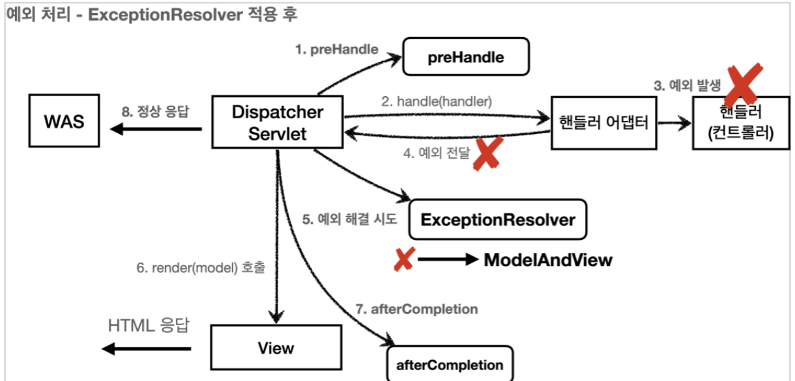

# 로그인 처리1 - 쿠키, 세션 

# 로그인 처리1 - 쿠키, 세션

* toc
{:toc}

## 로그인 요구사항
+ 홈 화면 - 로그인 전
  + 회원 가입
  + 로그인
+ 홈 화면 - 로그인 후
  + 본인 이름(누구님 환영합니다.)
  + 상품 관리
  + 로그 아웃
+ 보안 요구사항
  + 로그인 사용자만 상품에 접근하고, 관리할 수 있다
  + 로그인 하지 않은 사용자가 상품 관리에 접근하면 로그인 화면으로 이동
+ 회원 가입, 상품 관리

## 프로젝트 생성

### package 구조
+ hello.login
  + domain
    + item
    + member
    + login
  + web
    + item
    + member
    + login

+ 도메인이 가장 중요하다.
  + 도메인 = 화면, UI, 기술 인프라 등등의 영역은 제외한 시스템이 구현해야 하는 핵심 비즈니스 업무 영역을 말한다
  + 향후 web을 다른 기술로 바꾸어도 도메인은 그대로 유지할 수 있어야 한다
  + 이렇게 하려면 web은 domain을 알고있지만 domain은 web을 모르도록 설계해야 한다.
  + 이것을 web은 domain을 의존하지만, domain은 web을 의존하지 않는다고 표현한다.
  + 예를 들어 web 패키지를 모두 삭제해도 domain에는 전혀 영향이 없도록 의존관계를 설계하는 것이 중요하다.
  + 반대로 이야기하면 domain은 web을 참조하면 안된다.

### 로그인 처리하기 - 쿠키 사용

#### 로그인 기능

+ 로그인 상태 유지하기
  + 서버에서 로그인에 성공하면 HTTP 응답에 쿠키를 담아서 브라우저에 전달하자. 그러면 브라우저는 앞으로
    해당 쿠키를 지속해서 보내준다.
+ 쿠키 생성 
  + 
+ 클라이언트 쿠키 전달1
  + 
+ 클라이언트 쿠키 전달2
  + 
+ 쿠키에는 영속 쿠키와 세션 쿠키가 있다.
  + 영속 쿠키: 만료 날짜를 입력하면 해당 날짜까지 유지
  + 세션 쿠키: 만료 날짜를 생략하면 브라우저 종료시 까지만 유지

~~~java

Cookie idCookie = new Cookie("memberId", String.valueOf(loginMember.getId()));
response.addCookie(idCookie);

~~~
+ 로그인에 성공하면 쿠키를 생성하고 HttpServletResponse에 담는다. 쿠키 이름은 memberId이고, 값은 회원의 id를 담아둔다. 웹 브라우저는 종료 전까지 회원의 id를 서버에 계속 보내줄 것이다

~~~java

package hello.login.web;

import hello.login.domain.member.Member;
import hello.login.domain.member.MemberRepository;
import lombok.RequiredArgsConstructor;
import lombok.extern.slf4j.Slf4j;
import org.springframework.stereotype.Controller;
import org.springframework.ui.Model;
import org.springframework.web.bind.annotation.CookieValue;
import org.springframework.web.bind.annotation.GetMapping;

@Slf4j
@Controller
@RequiredArgsConstructor
public class HomeController {

  private final MemberRepository memberRepository;

  // @GetMapping("/")
  public String home() {
    return "home";
  }

  @GetMapping("/")
  public String homeLogin(
          @CookieValue(name = "memberId", required = false) Long memberId,
          Model model) {
    if (memberId == null) {
      return "home";
    }
    //로그인
    Member loginMember = memberRepository.findById(memberId);
    if (loginMember == null) {
      return "home";
    }
    model.addAttribute("member", loginMember);
    return "loginHome";
  }
}

~~~

+ ```@CookieValue``` 를 사용하면 편리하게 쿠키를 조회할 수 있다.
+ 로그인 하지 않은 사용자도 홈에 접근할 수 있기 때문에 ```required = false``` 를 사용한다.

#### 로그아웃 기능
+ 세션 쿠키이므로 웹 브라우저 종료시
+ 서버에서 해당 쿠키의 종료 날짜를 0으로 지정

~~~java

@PostMapping("/logout")
public String logout(HttpServletResponse response) {
 expireCookie(response, "memberId");
 return "redirect:/";
}
private void expireCookie(HttpServletResponse response, String cookieName) {
 Cookie cookie = new Cookie(cookieName, null);
 cookie.setMaxAge(0);
 response.addCookie(cookie);
}

~~~

+ 로그아웃도 응답 쿠키를 생성하는데 Max-Age=0 를 확인할 수 있다. 해당 쿠키는 즉시 종료된다.

## 쿠키와 보안 문제
+ 쿠키 값은 임의로 변경할 수 있다.
  + 클라이언트가 쿠키를 강제로 변경하면 다른 사용자가 된다
  + 실제 웹브라우저 개발자모드 -> Application -> Cookie 변경으로 확인
  + ```Cookie: memberId=1``` -> ```Cookie: memberId=2``` (다른 사용자의 이름이 보임)
+ 쿠키에 보관된 정보는 훔쳐갈 수 있다.
  + 만약 쿠키에 개인정보나, 신용카드 정보가 있다면?
  + 정보가 웹 브라우저에도 보관되고, 네트워크 요청마다 계속 클라이언트에서 서버로 전달된다.
  + 쿠키의 정보가 나의 로컬 PC에서 털릴 수도 있고, 네트워크 전송 구간에서 털릴 수도 있다.
+ 해커가 쿠키를 한번 훔쳐가면 평생 사용할 수 있다.
  + 해커가 쿠키를 훔쳐가서 그 쿠키로 악의적인 요청을 계속 시도할 수 있다

### 대안
+ 쿠키에 중요한 값을 노출하지 않고, 사용자 별로 예측 불가능한 임의의 토큰(랜덤 값)을 노출하고, 서버에서 토큰과 사용자 id를 매핑해서 인식한다. 그리고 서버에서 토큰을 관리한다.
+ 토큰은 해커가 임의의 값을 넣어도 찾을 수 없도록 예상 불가능 해야 한다.
+ 해커가 토큰을 털어가도 시간이 지나면 사용할 수 없도록 서버에서 해당 토큰의 만료시간을 짧게(예: 30분)유지한다. 또는 해킹이 의심되는 경우 서버에서 해당 토큰을 강제로 제거하면 된다.

## 로그인 처리하기 - 세션 동작 방식
+ 서버에 중요한 정보를 보관하고 연결을 유지하는 방법을 세션이라 한다

### 세션 동작 방식
+ 로그인
  + 
  + 사용자가 loginId , password 정보를 전달하면 서버에서 해당 사용자가 맞는지 확인한다
+ 세션 생성
  + 
  + 세션 ID를 생성하는데, 추정 불가능해야 한다.
  + UUID는 추정이 불가능하다.
    + ```Cookie: mySessionId=zz0101xx-bab9-4b92-9b32-dadb280f4b61```
  + 생성된 세션 ID와 세션에 보관할 값( memberA )을 서버의 세션 저장소에 보관한다
+ 세션id를 응답 쿠키로 전달
  + 
  + 클라이언트와 서버는 결국 쿠키로 연결이 되어야 한다
    + 서버는 클라이언트에 mySessionId 라는 이름으로 세션ID 만 쿠키에 담아서 전달한다
    + 클라이언트는 쿠키 저장소에 mySessionId 쿠키를 보관한다
  + 여기서 중요한 포인트는 회원과 관련된 정보는 전혀 클라이언트에 전달하지 않는다는 것이다.
  + 오직 추정 불가능한 세션 ID만 쿠키를 통해 클라이언트에 전달한다.
+ 클라이언트의 세션id 쿠키 전달
  + 
  + 클라이언트는 요청시 항상 mySessionId 쿠키를 전달한다.
  + 서버에서는 클라이언트가 전달한 mySessionId 쿠키 정보로 세션 저장소를 조회해서 로그인시 보관한 세션 정보를 사용한다.

### 정리
+ 쿠키 값을 변조 가능 -> 예상 불가능한 복잡한 세션Id를 사용한다.
+ 쿠키에 보관하는 정보는 클라이언트 해킹시 털릴 가능성이 있다. -> 세션Id가 털려도 여기에는 중요한 정보가 없다.
+ 쿠키 탈취 후 사용 -> 해커가 토큰을 털어가도 시간이 지나면 사용할 수 없도록 서버에서 세션의 만료시간을 짧게(예: 30분) 유지한다. 또는 해킹이 의심되는 경우 서버에서 해당 세션을 강제로 제거하면 된다.

## 로그인 처리하기 - 세션 직접 만들기
세션 관리는 크게 다음 3가지 기능을 제공하면 된다.
+ 세션 생성
  + sessionId 생성 (임의의 추정 불가능한 랜덤 값)
  + 세션 저장소에 sessionId와 보관할 값 저장
  + sessionId로 응답 쿠키를 생성해서 클라이언트에 전달
+ 세션 조회
  + 클라이언트가 요청한 sessionId 쿠키의 값으로, 세션 저장소에 보관한 값 조회
+ 세션 만료
  + 클라이언트가 요청한 sessionId 쿠키의 값으로, 세션 저장소에 보관한 sessionId와 값 제거

### SessionManager - 세션 관리

~~~java

package hello.login.web.session;

import org.springframework.stereotype.Component;

import javax.servlet.http.Cookie;
import javax.servlet.http.HttpServletRequest;
import javax.servlet.http.HttpServletResponse;
import java.util.Arrays;
import java.util.Map;
import java.util.UUID;
import java.util.concurrent.ConcurrentHashMap;

/**
 * 세션 관리
 */
@Component
public class SessionManager {
  public static final String SESSION_COOKIE_NAME = "mySessionId";
  private Map<String, Object> sessionStore = new ConcurrentHashMap<>();

  /**
   * 세션 생성
   */
  public void createSession(Object value, HttpServletResponse response) {
    //세션 id를 생성하고, 값을 세션에 저장
    String sessionId = UUID.randomUUID().toString();
    sessionStore.put(sessionId, value);
    //쿠키 생성
    Cookie mySessionCookie = new Cookie(SESSION_COOKIE_NAME, sessionId);
    response.addCookie(mySessionCookie);
  }

  /**
   * 세션 조회
   */
  public Object getSession(HttpServletRequest request) {
    Cookie sessionCookie = findCookie(request, SESSION_COOKIE_NAME);
    if (sessionCookie == null) {
      return null;
    }
    return sessionStore.get(sessionCookie.getValue());
  }

  /**
   * 세션 만료
   */
  public void expire(HttpServletRequest request) {
    Cookie sessionCookie = findCookie(request, SESSION_COOKIE_NAME);
    if (sessionCookie != null) {
      sessionStore.remove(sessionCookie.getValue());
    }
  }

  private Cookie findCookie(HttpServletRequest request, String cookieName) {
    if (request.getCookies() == null) {
      return null;
    }
    return Arrays.stream(request.getCookies())
            .filter(cookie -> cookie.getName().equals(cookieName))
            .findAny()
            .orElse(null);
  }
}

~~~

+ ```@Component``` : 스프링 빈으로 자동 등록한다.
+ ```ConcurrentHashMap``` : HashMap 은 동시 요청에 안전하지 않다. 동시 요청에 안전한 ```ConcurrentHashMap``` 를 사용했다.

### SessionManagerTest - 테스트

~~~java

package hello.login.web.session;

import hello.login.domain.member.Member;
import org.junit.jupiter.api.Test;
import org.springframework.mock.web.MockHttpServletRequest;
import org.springframework.mock.web.MockHttpServletResponse;

import static org.assertj.core.api.Assertions.assertThat;

class SessionManagerTest {
  SessionManager sessionManager = new SessionManager();

  @Test
  void sessionTest() {
    //세션 생성
    MockHttpServletResponse response = new MockHttpServletResponse();
    Member member = new Member();
    sessionManager.createSession(member, response);
    //요청에 응답 쿠키 저장
    MockHttpServletRequest request = new MockHttpServletRequest();
    request.setCookies(response.getCookies());
    //세션 조회
    Object result = sessionManager.getSession(request);
    assertThat(result).isEqualTo(member);
    //세션 만료
    sessionManager.expire(request);
    Object expired = sessionManager.getSession(request);
    assertThat(expired).isNull();
  }
}

~~~

+ ```HttpServletRequest``` , ```HttpservletResponse``` 객체를 직접 사용할 수 없기 때문에 테스트에서 비슷한 역할을 해주는 가짜 ```MockHttpServletRequest``` , ```MockHttpServletResponse``` 를 사용했다.
