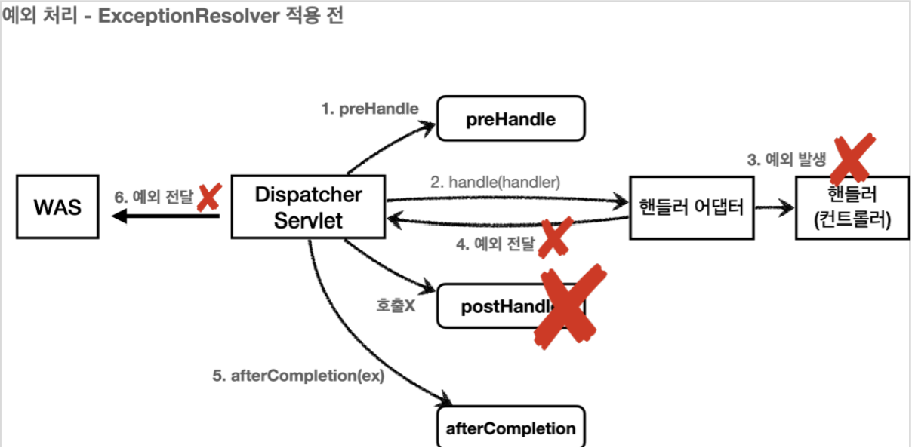
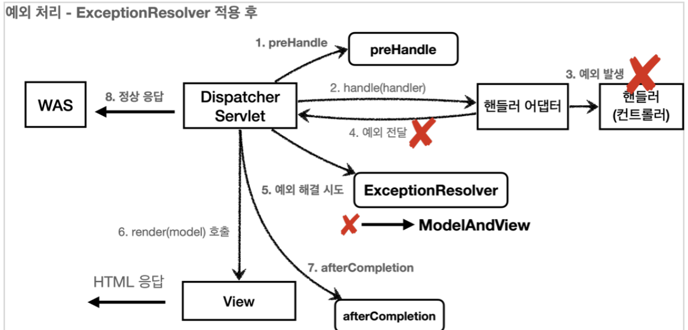

# API 예외 처리

# API 예외 처리

* toc
{:toc}

## API 예외 처리 - 시작
+ HTML 페이지의 경우 지금까지 설명했던 것 처럼 4xx, 5xx와 같은 오류 페이지만 있으면 대부분의 문제를 해결할 수 있다
+ API의 경우에는 생각할 내용이 더 많다. 오류 페이지는 단순히 고객에게 오류 화면을 보여주고 끝이지만, API는 각 오류 상황에 맞는 오류 응답 스펙을 정하고, JSON으로 데이터를 내려주어야 한다.


### ErrorPageController - API 응답 추가

~~~java

@RequestMapping(value = "/error-page/500", produces = MediaType.APPLICATION_JSON_VALUE)
public ResponseEntity < Map < String, Object >> errorPage500Api(HttpServletRequest request, HttpServletResponse response) {
    log.info("API errorPage 500");
    Map < String, Object > result = new HashMap < > ();
    Exception ex = (Exception) request.getAttribute(ERROR_EXCEPTION);
    result.put("status", request.getAttribute(ERROR_STATUS_CODE));
    result.put("message", ex.getMessage());
    Integer statusCode = (Integer) request.getAttribute(RequestDispatcher.ERROR_STATUS_CODE);
    return new ResponseEntity(result, HttpStatus.valueOf(statusCode));
}

~~~

+ ```produces = MediaType.APPLICATION_JSON_VALUE``` 의 뜻은 클라이언트가 요청하는 HTTP Header의 ```Accept``` 의 값이 ```application/json``` 일 때 해당 메서드가 호출된다는 것이다.
+ 결국 클라어인트가 받고 싶은 미디어타입이 json이면 이 컨트롤러의 메서드가 호출된다.
+ 응답 데이터를 위해서 Map 을 만들고 status , message 키에 값을 할당했다. Jackson 라이브러리는 Map 을 JSON 구조로 변환할 수 있다.
+ ResponseEntity 를 사용해서 응답하기 때문에 메시지 컨버터가 동작하면서 클라이언트에 JSON이 반환된다.

## API 예외 처리 - 스프링 부트 기본 오류 처리
+ API 예외 처리도 스프링 부트가 제공하는 기본 오류 방식을 사용할 수 있다.

~~~java

@RequestMapping(produces = MediaType.TEXT_HTML_VALUE)
public ModelAndView errorHtml(HttpServletRequest request, HttpServletResponse response) {}

@RequestMapping
public ResponseEntity<Map<String, Object>> error(HttpServletRequest request) {}

~~~

+ ```/error``` 동일한 경로를 처리하는 ```errorHtml()``` , ```error()``` 두 메서드를 확인할 수 있다
+ ```errorHtml()``` : ```produces = MediaType.TEXT_HTML_VALUE``` : 클라이언트 요청의 ```Accept``` 해더 값이 ```text/html``` 인 경우에는 ```errorHtml()``` 을 호출해서 view를 제공한다.
+ ```error()``` : 그외 경우에 호출되고 ```ResponseEntity``` 로 ```HTTP Body```에 ```JSON``` 데이터를 반환한다.

### 스프링 부트의 예외 처리
+ 스프링 부트의 기본 설정은 오류 발생시 ```/error``` 를 오류 페이지로 요청한다.
+ ```BasicErrorController``` 는 이 경로를 기본으로 받는다. ( ```server.error.path``` 로 수정 가능, 기본 경로 ```/error``` )

~~~json

{
  "timestamp": "2021-04-28T00:00:00.000+00:00",
  "status": 500,
  "error": "Internal Server Error",
  "exception": "java.lang.RuntimeException",
  "trace": "java.lang.RuntimeException: 잘못된 사용자\n\tat
  hello.exception.web.api.ApiExceptionController.getMember(ApiExceptionController
  .java: 19...,
  "message": "잘못된 사용자",
  "path": "/api/members/ex"
}

~~~

+ 스프링 부트는 ```BasicErrorController``` 가 제공하는 기본 정보들을 활용해서 오류 API를 생성해준다.
+ 다음 옵션들을 설정하면 더 자세한 오류 정보를 추가할 수 있다.
  + server.error.include-binding-errors=always
  + server.error.include-exception=true
  + server.error.include-message=always
  + server.error.include-stacktrace=always
+ 물론 오류 메시지는 이렇게 막 추가하면 보안상 위험할 수 있다. 간결한 메시지만 노출하고, 로그를 통해서 확인하자.

### Html 페이지 vs API 오류
+ BasicErrorController 를 확장하면 JSON 메시지도 변경할 수 있다. 그런데 API 오류는 @ExceptionHandler 가 제공하는 기능을 사용하는 것이 더 나은 방법이므로 지금은 BasicErrorController 를 확장해서 JSON 오류 메시지를 변경할 수 있다 정도로만 이해해두자.
+ 스프링 부트가 제공하는 BasicErrorController 는 HTML 페이지를 제공하는 경우에는 매우 편리하다. 4xx, 5xx 등등 모두 잘 처리해준다.
+ API 오류 처리는 다른 차원의 이야기이다. API 마다, 각각의 컨트롤러나 예외마다 서로 다른 응답 결과를 출력해야 할 수도 있다
+ 예를 들어서 회원과 관련된 API에서 예외가 발생할 때 응답과, 상품과 관련된 API에서 발생하는 예외에 따라 그 결과가 달라질 수 있다.
+ 결과적으로 매우 세밀하고 복잡하다. 따라서 이 방법은 HTML 화면을 처리할 때 사용하고, API 오류 처리는 @ExceptionHandler 를 사용하자.

## API 예외 처리 - HandlerExceptionResolver 시작
+ 예외가 발생해서 서블릿을 넘어 WAS까지 예외가 전달되면 HTTP 상태코드가 500으로 처리된다. 
+ 발생하는 예외에 따라서 400, 404 등등 다른 상태코드로 처리하고 싶다
+ 오류 메시지, 형식등을 API마다 다르게 처리하고 싶다
+ 예를 들어서 IllegalArgumentException 을 처리하지 못해서 컨트롤러 밖으로 넘어가는 일이 발생하면 HTTP 상태코드를 400으로 처리하고 싶다.

### HandlerExceptionResolver
+ 스프링 MVC는 컨트롤러(핸들러) 밖으로 예외가 던져진 경우 예외를 해결하고, 동작을 새로 정의할 수 있는 방법을 제공한다.
+ 컨트롤러 밖으로 던져진 예외를 해결하고, 동작 방식을 변경하고 싶으면 HandlerExceptionResolver 를 사용하면 된다. 줄여서 ExceptionResolver 라 한다.

#### ExceptionResolver 적용 전
+ 

#### ExceptionResolver 적용 후
+ 
+ 참고: ExceptionResolver 로 예외를 해결해도 postHandle() 은 호출되지 않는다.

### HandlerExceptionResolver - 인터페이스

~~~java

public interface HandlerExceptionResolver {
    ModelAndView resolveException(HttpServletRequest request, HttpServletResponse response, Object handler, Exception ex);
}

~~~

+ ```handler``` : 핸들러(컨트롤러) 정보
+ ```Exception ex``` : 핸들러(컨트롤러)에서 발생한 발생한 예외

### MyHandlerExceptionResolver

~~~java

package hello.exception.resolver;

import lombok.extern.slf4j.Slf4j;
import org.springframework.web.servlet.HandlerExceptionResolver;
import org.springframework.web.servlet.ModelAndView;

import javax.servlet.http.HttpServletRequest;
import javax.servlet.http.HttpServletResponse;
import java.io.IOException;

@Slf4j
public class MyHandlerExceptionResolver implements HandlerExceptionResolver {
    @Override
    public ModelAndView resolveException(HttpServletRequest request, HttpServletResponse response, Object handler, Exception ex) {
        try {
            if (ex instanceof IllegalArgumentException) {
                log.info("IllegalArgumentException resolver to 400");
                response.sendError(HttpServletResponse.SC_BAD_REQUEST, ex.getMessage());
                return new ModelAndView();
            }
        } catch (IOException e) {
            log.error("resolver ex", e);
        }
        return null;
    }
}

~~~
+ ExceptionResolver 가 ModelAndView 를 반환하는 이유는 마치 try, catch를 하듯이, Exception 을 처리해서 정상 흐름 처럼 변경하는 것이 목적이다. 이름 그대로 Exception 을 Resolver(해결)하는 것이 목적이다.
+ 여기서는 IllegalArgumentException 이 발생하면 response.sendError(400) 를 호출해서 HTTP 상태 코드를 400으로 지정하고, 빈 ModelAndView 를 반환한다.

### 반환 값에 따른 동작 방식
HandlerExceptionResolver 의 반환 값에 따른 DispatcherServlet 의 동작 방식은 다음과 같다

+ 빈 ModelAndView: new ModelAndView() 처럼 빈 ModelAndView 를 반환하면 뷰를 렌더링 하지 않고, 정상 흐름으로 서블릿이 리턴된다.
+ ModelAndView 지정: ModelAndView 에 View , Model 등의 정보를 지정해서 반환하면 뷰를 렌더링 한다.
+ null: null 을 반환하면, 다음 ExceptionResolver 를 찾아서 실행한다. 만약 처리할 수 있는 ExceptionResolver 가 없으면 예외 처리가 안되고, 기존에 발생한 예외를 서블릿 밖으로 던진다.

### ExceptionResolver 활용
+ 예외 상태 코드 변환
  + 예외를 ```response.sendError(xxx)``` 호출로 변경해서 서블릿에서 상태 코드에 따른 오류를 처리하도록 위임
  + 이후 WAS는 서블릿 오류 페이지를 찾아서 내부 호출, 예를 들어서 스프링 부트가 기본으로 설정한 ```/error``` 가 호출됨
+ 뷰 템플릿 처리
  + ModelAndView 에 값을 채워서 예외에 따른 새로운 오류 화면 뷰 렌더링 해서 고객에게 제공
+ API 응답 처리
  + ```response.getWriter().println("hello");``` 처럼 HTTP 응답 바디에 직접 데이터를 넣어주는 것도 가능하다. 여기에 JSON 으로 응답하면 API 응답 처리를 할 수 있다.

### WebConfig - 수정

~~~java

/**
 * 기본 설정을 유지하면서 추가
 */
@Override 
public void extendHandlerExceptionResolvers(List<HandlerExceptionResolver> resolvers) {
    resolvers.add(new MyHandlerExceptionResolver());
}

~~~

+ ```configureHandlerExceptionResolvers(..)``` 를 사용하면 스프링이 기본으로 등록하는 ```ExceptionResolver``` 가 제거되므로 주의, ```extendHandlerExceptionResolvers``` 를 사용하자
