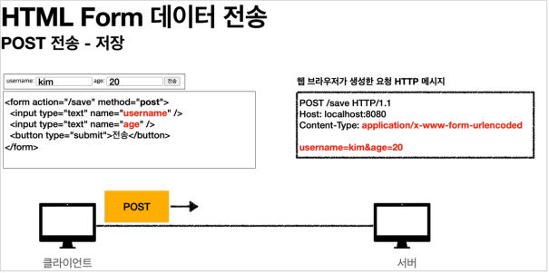
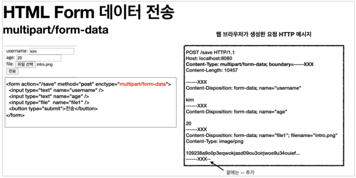

# 파일 업로드

# 파일 업로드

* toc
{:toc}

## 파일 업로드 소개
+ 일반적으로 사용하는 HTML Form을 통한 파일 업로드를 이해하려면 먼저 폼을 전송하는 다음 두 가지 방식의 차이를 이해해야 한다.
  + ```application/x-www-form-urlencoded```
  + ```multipart/form-data```

### application/x-www-form-urlencoded 방식
+ 
+ ```application/x-www-form-urlencoded``` 방식은 HTML 폼 데이터를 서버로 전송하는 가장 기본적인 방법이다.
+  Form 태그에 별도의 ```enctype``` 옵션이 없으면 웹 브라우저는 요청 HTTP 메시지의 헤더에 다음 내용을 추가한다.
  + ```Content-Type: application/x-www-form-urlencoded```
+ 그리고 폼에 입력한 전송할 항목을 HTTP Body에 문자로 ```username=kim&age=20``` 와 같이 ```&``` 로 구분해서 전송한다.
+ 파일을 업로드 하려면 파일은 문자가 아니라 바이너리 데이터를 전송해야 한다.
+ 문자를 전송하는 이 방식으로 파일을 전송하기는 어렵다.
+ 그리고 또 한가지 문제가 더 있는데, 보통 폼을 전송할 때 파일만 전송하는 것이 아니라는 점이다

~~~

- 이름
- 나이
- 첨부파일

~~~

+ 여기에서 이름과 나이도 전송해야 하고, 첨부파일도 함께 전송해야 한다.
+ 문제는 이름과 나이는 문자로 전송하고, 첨부파일은 바이너리로 전송해야 한다는 점이다.
+ 여기에서 문제가 발생한다. 문자와 바이너리를 동시에 전송해야 하는 상황이다.
+ 문제를 해결하기 위해 HTTP는 ```multipart/form-data``` 라는 전송 방식을 제공한다.

### multipart/form-data 방식
+ 
+ 이 방식을 사용하려면 Form 태그에 별도의 ```enctype="multipart/form-data"``` 를 지정해야 한다.
+ ```multipart/form-data``` 방식은 다른 종류의 여러 파일과 폼의 내용 함께 전송할 수 있다. (그래서 이름이 ```multipart``` 이다.)
+ 폼의 입력 결과로 생성된 HTTP 메시지를 보면 각각의 전송 항목이 구분이 되어있다. ```Content-Disposition``` 이라는 항목별 헤더가 추가되어 있고 여기에 부가 정보가 있다
+ 예제에서는 ```username```, ```age```, ```file1``` 이 각각 분리되어 있고, 폼의 일반 데이터는 각 항목별로 문자가 전송되고, 파일의 경우 파일 이름과 ```Content-Type```이 추가되고 바이너리 데이터가 전송된다.
+ ```multipart/form-data``` 는 이렇게 각각의 항목을 구분해서, 한번에 전송하는 것이다.

## 서블릿과 파일 업로드1

~~~java

import lombok.extern.slf4j.Slf4j;
import org.springframework.stereotype.Controller;
import org.springframework.web.bind.annotation.GetMapping;
import org.springframework.web.bind.annotation.PostMapping;
import org.springframework.web.bind.annotation.RequestMapping;

import javax.servlet.ServletException;
import javax.servlet.http.HttpServletRequest;
import javax.servlet.http.Part;
import java.io.IOException;
import java.util.Collection;

@Slf4j
@Controller
@RequestMapping("/servlet/v1")
public class ServletUploadControllerV1 {
  @GetMapping("/upload")
  public String newFile() {
    return "upload-form";
  }

  @PostMapping("/upload")
  public String saveFileV1(HttpServletRequest request) throws ServletException, IOException {
    log.info("request={}", request);
    String itemName = request.getParameter("itemName");
    log.info("itemName={}", itemName);
    Collection<Part> parts = request.getParts();
    log.info("parts={}", parts);
    return "upload-form";
  }
}

~~~

+ ```request.getParts()``` : ```multipart/form-data``` 전송 방식에서 각각 나누어진 부분을 받아서 확인할 수 있다.

~~~properties

logging.level.org.apache.coyote.http11=debug

~~~

+ 이 옵션을 사용하면 HTTP 요청 메시지를 확인할 수 있다.
+ 실행해보면 ```logging.level.org.apache.coyote.http11``` 옵션을 통한 로그에서 ```multipart/formdata``` 방식으로 전송된 것을 확인할 수 있다

~~~

Content-Type: multipart/form-data; boundary=----xxxx
------xxxx
Content-Disposition: form-data; name="itemName"
Spring
------xxxx
Content-Disposition: form-data; name="file"; filename="test.data"
Content-Type: application/octet-stream
sdklajkljdf...

~~~

### 멀티파트 사용 옵션

#### 업로드 사이즈 제한

~~~properties

spring.servlet.multipart.max-file-size=1MB
spring.servlet.multipart.max-request-size=10MB

~~~

+ 큰 파일을 무제한 업로드하게 둘 수는 없으므로 업로드 사이즈를 제한할 수 있다.
+ 사이즈를 넘으면 예외( ```SizeLimitExceededException``` )가 발생한다
+ ```max-file-size``` : 파일 하나의 최대 사이즈, 기본 1MB
+ ```max-request-size``` : 멀티파트 요청 하나에 여러 파일을 업로드 할 수 있는데, 그 전체 합이다. 기본 10MB

#### spring.servlet.multipart.enabled 끄기
+ ```spring.servlet.multipart.enabled=false```

~~~

request=org.apache.catalina.connector.RequestFacade@xxx
itemName=null
parts=[]

~~~

+ 멀티파트는 일반적인 폼 요청인 ```application/x-www-form-urlencoded``` 보다 훨씬 복잡하다
+ ```spring.servlet.multipart.enabled``` 옵션을 끄면 서블릿 컨테이너는 멀티파트와 관련된 처리를 하지 않는다.
+ 그래서 결과 로그를 보면 ```request.getParameter("itemName")``` , ```request.getParts()``` 의 결과가 비어있다.

#### spring.servlet.multipart.enabled 켜기
+ ```spring.servlet.multipart.enabled=true``` (기본 true)
+ 이 옵션을 켜면 스프링 부트는 서블릿 컨테이너에게 멀티파트 데이터를 처리하라고 설정한다. 참고로 기본 값은 ```true``` 이다

~~~

request=org.springframework.web.multipart.support.StandardMultipartHttpServletRequest
itemName=Spring
parts=[ApplicationPart1, ApplicationPart2]

~~~

+ ```request.getParameter("itemName")``` 의 결과도 잘 출력되고, ```request.getParts()``` 에도 요청한 두 가지 멀티파트의 부분 데이터가 포함된 것을 확인할 수 있다.
+ 이 옵션을 켜면 복잡한 멀티파트 요청을 처리해서 사용할 수 있게 제공한다
+ 로그를 보면 ```HttpServletRequest``` 객체가 ```RequestFacade``` -> ```StandardMultipartHttpServletRequest``` 로 변한 것을 확인할 수 있다.

> **참고**
> 
> ```spring.servlet.multipart.enabled``` 옵션을 켜면 스프링의 ```DispatcherServlet``` 에서 멀티파트 리졸버( ```MultipartResolver``` )를 실행한다.
> 
> 멀티파트 리졸버는 멀티파트 요청인 경우 서블릿 컨테이너가 전달하는 일반적인 ```HttpServletRequest``` 를 ```MultipartHttpServletRequest``` 로 변환해서 반환한다.
> 
> ```MultipartHttpServletRequest``` 는 ```HttpServletRequest``` 의 자식 인터페이스이고, 멀티파트와 관련된 추가 기능을 제공한다.

> 스프링이 제공하는 기본 멀티파트 리졸버는 ```MultipartHttpServletRequest``` 인터페이스를 구현한 ```StandardMultipartHttpServletRequest``` 를 반환한다.
> 
> 이제 컨트롤러에서 ```HttpServletRequest``` 대신에 ```MultipartHttpServletRequest``` 를 주입받을 수 있는데, 이것을 사용하면 멀티파트와 관련된 여러가지 처리를 편리하게 할 수 있다. 
> 
> 그런데 ```MultipartFile``` 이라는 것을 사용하는 것이 더 편하기 때문에 ```MultipartHttpServletRequest``` 를 잘 사용하지는 않는다. 

## 서블릿과 파일 업로드2

~~~java

import lombok.extern.slf4j.Slf4j;
import org.springframework.beans.factory.annotation.Value;
import org.springframework.stereotype.Controller;
import org.springframework.util.StreamUtils;
import org.springframework.util.StringUtils;
import org.springframework.web.bind.annotation.GetMapping;
import org.springframework.web.bind.annotation.PostMapping;
import org.springframework.web.bind.annotation.RequestMapping;

import javax.servlet.ServletException;
import javax.servlet.http.HttpServletRequest;
import javax.servlet.http.Part;
import java.io.IOException;
import java.io.InputStream;
import java.nio.charset.StandardCharsets;
import java.util.Collection;

@Slf4j
@Controller
@RequestMapping("/servlet/v2")
public class ServletUploadControllerV2 {
  @Value("${file.dir}")
  private String fileDir;

  @GetMapping("/upload")
  public String newFile() {
    return "upload-form";
  }

  @PostMapping("/upload")
  public String saveFileV1(HttpServletRequest request) throws ServletException, IOException {
    log.info("request={}", request);
    String itemName = request.getParameter("itemName");
    log.info("itemName={}", itemName);
    Collection<Part> parts = request.getParts();
    log.info("parts={}", parts);
    for (Part part : parts) {
      log.info("==== PART ====");
      log.info("name={}", part.getName());
      Collection<String> headerNames = part.getHeaderNames();
      for (String headerName : headerNames) {
        log.info("header {}: {}", headerName, part.getHeader(headerName));
      }
      //편의 메서드
      //content-disposition; filename
      log.info("submittedFileName={}", part.getSubmittedFileName());
      log.info("size={}", part.getSize()); //part body size
      //데이터 읽기
      InputStream inputStream = part.getInputStream();
      String body = StreamUtils.copyToString(inputStream, StandardCharsets.UTF_8);
      log.info("body={}", body);
      //파일에 저장하기
      if (StringUtils.hasText(part.getSubmittedFileName())) {
        String fullPath = fileDir + part.getSubmittedFileName();
        log.info("파일 저장 fullPath={}", fullPath);
        part.write(fullPath);
      }
    }
    return "upload-form";
  }
}
~~~

+ ```application.properties``` 에서 설정한 file.dir 의 값을 주입한다.
+ 멀티파트 형식은 전송 데이터를 하나하나 각각 부분( ```Part``` )으로 나누어 전송한다. ```parts``` 에는 이렇게 나누어진 데이터가 각각 담긴다
+ 서블릿이 제공하는 ```Part``` 는 멀티파트 형식을 편리하게 읽을 수 있는 다양한 메서드를 제공한다.

### Part 주요 메서드
+ ```part.getSubmittedFileName()``` : 클라이언트가 전달한 파일명
+ ```part.getInputStream()```: Part의 전송 데이터를 읽을 수 있다.
+ ```part.write(...)```: Part를 통해 전송된 데이터를 저장할 수 있다.

> **참고**
> 
> 큰 용량의 파일을 업로드를 테스트 할 때는 로그가 너무 많이 남아서 다음 옵션을 끄는 것이 좋다.
> logging.level.org.apache.coyote.http11=debug
> 
> 다음 부분도 파일의 바이너리 데이터를 모두 출력하므로 끄는 것이 좋다.
> log.info("body={}", body);

+ 서블릿이 제공하는 ```Part``` 는 편하기는 하지만, ```HttpServletRequest``` 를 사용해야 하고, 추가로 파일 부분만 구분하려면 여러가지 코드를 넣어야 한다. 이번에는 스프링이 이 부분을 얼마나 편리하게 제공하는지 확인해보자.
