# 아마존 AWS 알아보기

# 아마존 AWS 알아보기

* toc
{:toc}

---

## AWS 입문자를 위한 웹 서비스 만들기 

### 01. AWS 입문자를 위한 웹 서비스 만들기

AWS를 처음 접하면 EC2, VPC, Security Group, Route 53처럼 서로 다른 역할을 가진 서비스가 한꺼번에 등장한다. 각각의 기능만 따로 살펴보면 어렵지 않지만, 실제 웹 서비스를 구성하려면 서버, 네트워크, 보안, 도메인, 데이터베이스가 어떤 경로로 연결되는지 이해해야 한다.

이번 과정에서는 AWS에 가상 머신을 생성하는 단계부터 WordPress 기반 개인 블로그를 구축하고 외부 사용자가 도메인으로 접속할 수 있도록 구성한다. 단순히 화면에서 설정값을 입력하는 데 그치지 않고, 이후 다른 웹 서비스에도 응용할 수 있도록 각 구성 요소의 역할과 동작 원리를 함께 살펴본다.

#### 최종 구성 목표

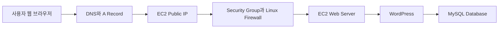

전체 구성에서 각 요소는 다음 역할을 담당한다.

| 구성 요소 | 역할 |
|---|---|
| Amazon EC2 | 웹 서버와 애플리케이션을 실행하는 가상 머신 |
| Security Group | EC2로 들어오고 나가는 네트워크 트래픽 제어 |
| Linux Firewall | 운영체제 내부의 네트워크 접근 제어 |
| Public IP | 인터넷에서 EC2에 접근하기 위한 주소 |
| Private IP | VPC 내부 리소스 간 통신에 사용하는 주소 |
| DNS | 도메인 이름을 IP 주소로 변환 |
| WordPress | 블로그 콘텐츠와 관리 기능을 제공하는 웹 애플리케이션 |
| MySQL | 게시글, 사용자, 설정과 같은 데이터를 저장하는 데이터베이스 |

#### 웹 서비스 구축 과정

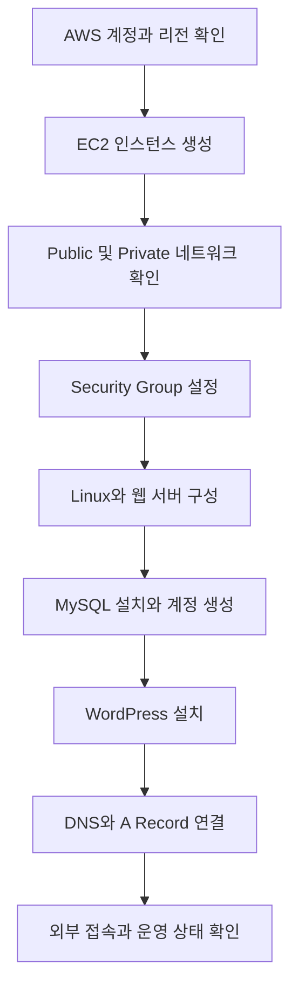

이 과정에서는 AWS 서비스를 개별적으로 사용하는 방법뿐만 아니라 요청이 EC2에 도착하고 WordPress가 MySQL에서 데이터를 조회해 응답을 반환하는 전체 흐름을 확인한다.

#### 사전에 알아둘 기본 개념

AWS 입문 단계에서 모든 내용을 완벽하게 알고 시작할 필요는 없다. 다만 다음 개념을 미리 이해하면 실습 중 발생하는 문제를 훨씬 빠르게 분석할 수 있다.

#### Firewall과 Security Group

Firewall은 네트워크 패킷을 검사하고 허용하거나 차단하는 보안 장치다. 웹 서버를 외부에 공개하더라도 모든 포트를 열어 두는 것이 아니라 서비스에 필요한 포트만 허용해야 한다.

일반적인 웹 서버에서 사용하는 포트는 다음과 같다.

| 포트 | 프로토콜 | 용도 | 일반적인 접근 범위 |
|---|---|---|---|
| 22 | SSH | Linux 원격 관리 | 관리자 IP로 제한 |
| 80 | HTTP | 암호화되지 않은 웹 요청 | 외부 사용자에게 공개 |
| 443 | HTTPS | 암호화된 웹 요청 | 외부 사용자에게 공개 |
| 3306 | MySQL | 데이터베이스 연결 | 애플리케이션 서버로 제한 |

AWS에서는 Security Group이 EC2 네트워크 인터페이스 수준에서 트래픽을 제어한다. Linux 내부에서는 `iptables`, `nftables`, `firewalld`, `ufw`와 같은 도구로 추가 방화벽 정책을 적용할 수 있다.

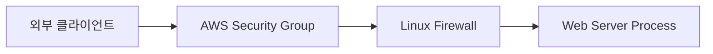

두 방화벽 중 하나라도 요청을 차단하면 애플리케이션에 접근할 수 없다. 따라서 접속 문제가 발생하면 다음 순서로 확인하는 것이 좋다.

1. EC2에 Public IP가 할당되어 있는지 확인한다.
2. Security Group에 필요한 인바운드 규칙이 있는지 확인한다.
3. Linux Firewall이 해당 포트를 허용하는지 확인한다.
4. 웹 서버 프로세스가 실제 포트에서 실행 중인지 확인한다.
5. Subnet과 Route Table에 인터넷 연결 경로가 있는지 확인한다.

Security Group에서 SSH 포트인 22번을 `0.0.0.0/0`으로 공개하면 인터넷 전체에서 접속을 시도할 수 있다. 관리 포트는 가능한 한 현재 관리자 IP 또는 신뢰할 수 있는 네트워크로 제한해야 한다.

#### EC2의 기본 제어 방식

Amazon EC2는 AWS에서 제공하는 가상 서버다. 인스턴스를 생성한 뒤에는 시작, 중지, 재부팅, 종료와 같은 작업을 수행할 수 있다.

| 작업 | 의미 | 주의사항 |
|---|---|---|
| Start | 중지된 인스턴스 시작 | Public IP가 변경될 수 있음 |
| Stop | 가상 머신 종료 상태로 전환 | EBS 데이터는 일반적으로 유지 |
| Reboot | 운영체제 재부팅 | 같은 인스턴스에서 다시 시작 |
| Terminate | 인스턴스 삭제 | 연결된 리소스와 데이터 삭제 여부 확인 필요 |

`Stop`과 `Terminate`는 전혀 다른 작업이다. 중지는 나중에 다시 시작할 수 있지만 종료는 인스턴스를 삭제한다. 중요한 서버를 종료할 때는 EBS Volume의 삭제 설정과 백업 상태를 반드시 확인해야 한다.

EC2를 중지하고 다시 시작하면 자동 할당된 Public IPv4 주소가 바뀔 수 있다. DNS에서 서버 IP를 참조해야 한다면 고정 Public IP인 Elastic IP를 사용하거나 변경 가능한 Endpoint 구조를 고려해야 한다.

#### Public Network와 Private Network

Public IP는 인터넷에서 접근할 수 있는 주소이고 Private IP는 VPC 내부 통신에 사용하는 주소다.

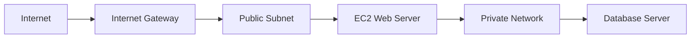

Public Subnet은 Internet Gateway로 향하는 Route를 가지고 있으며 외부 서비스를 제공하는 리소스를 배치할 수 있다. Private Subnet은 인터넷에서 직접 접근할 수 없도록 구성하며 데이터베이스와 내부 시스템을 배치하는 데 사용한다.

단순 실습에서는 하나의 EC2에 웹 서버와 MySQL을 함께 설치할 수 있지만 운영 환경에서는 역할을 분리하는 것이 일반적이다.

- 웹 서버는 외부 요청을 받아야 한다.
- 데이터베이스는 외부에 직접 공개할 필요가 없다.
- 데이터베이스 포트는 웹 애플리케이션에서만 접근하도록 제한한다.
- 중요한 데이터는 인스턴스와 별도로 백업한다.

#### Port Forwarding

Port Forwarding은 특정 IP와 포트로 들어온 요청을 다른 IP나 포트로 전달하는 방식이다.

예를 들어 외부 사용자는 80번 포트로 요청하지만 애플리케이션은 내부에서 8080번 포트로 실행될 수 있다. 이때 웹 서버나 프록시가 요청을 전달한다.

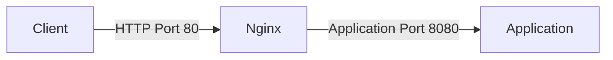

Port Forwarding과 단순한 방화벽 포트 허용은 다르다. 방화벽 규칙은 트래픽을 통과시킬지 결정하고, Port Forwarding은 통과한 요청을 다른 목적지로 전달한다.

#### DNS와 A Record

사용자는 웹 서비스에 접속할 때 IP 주소보다 도메인 이름을 사용한다. DNS는 도메인 이름을 실제 서버 주소로 변환한다.

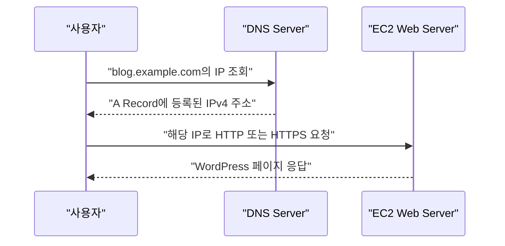

A Record는 도메인 또는 하위 도메인을 IPv4 주소에 연결한다.

```text
blog.example.com -> 203.0.113.10
```

EC2의 Public IP가 변경되면 기존 A Record는 더 이상 올바른 서버를 가리키지 않는다. 따라서 도메인을 연결할 때는 Elastic IP처럼 안정적으로 유지되는 주소를 사용하는 것이 좋다.

DNS 설정을 변경한 직후에는 캐시와 TTL로 인해 결과가 즉시 반영되지 않을 수 있다. 접속 장애를 확인할 때는 다음 명령으로 실제 DNS 응답을 조회할 수 있다.

```shell
nslookup blog.example.com
```

Linux나 macOS에서는 다음 명령도 사용할 수 있다.

```shell
dig blog.example.com A
```

#### MySQL 기본 관리

WordPress는 게시글, 댓글, 사용자 계정, 플러그인 설정을 MySQL에 저장한다. 따라서 MySQL 설치뿐만 아니라 애플리케이션 전용 Database와 계정을 생성해야 한다.

```sql
CREATE DATABASE wordpress
    CHARACTER SET utf8mb4
    COLLATE utf8mb4_unicode_ci;

CREATE USER 'wordpress_user'@'localhost'
    IDENTIFIED BY 'CHANGE_ME_STRONG_PASSWORD';

GRANT ALL PRIVILEGES
    ON wordpress.*
    TO 'wordpress_user'@'localhost';

FLUSH PRIVILEGES;
```

- `CREATE DATABASE`는 WordPress가 사용할 Database를 생성한다.
- `utf8mb4`는 한글과 이모지를 포함한 유니코드 문자를 저장한다.
- `CREATE USER`는 WordPress 전용 계정을 생성한다.
- `'localhost'`는 같은 서버에서 실행되는 WordPress만 접속하도록 제한한다.
- `GRANT`는 해당 계정에 `wordpress` Database의 권한을 부여한다.

WordPress에 MySQL의 관리자 계정을 연결하면 애플리케이션 취약점이 데이터베이스 전체 권한으로 확대될 수 있다. 애플리케이션에는 필요한 Database 범위의 전용 계정을 사용해야 한다.

#### Linux 기본 명령어

AWS EC2를 운영하려면 Linux 파일 시스템과 기본 명령어를 이해해야 한다.

| 명령어 | 용도 | 예시 |
|---|---|---|
| `pwd` | 현재 경로 확인 | `pwd` |
| `ls` | 파일과 디렉터리 목록 조회 | `ls -al` |
| `cd` | 디렉터리 이동 | `cd /var/www/html` |
| `cp` | 파일 복사 | `cp source.conf backup.conf` |
| `mv` | 파일 이동 또는 이름 변경 | `mv old.conf new.conf` |
| `rm` | 파일 삭제 | `rm old.log` |
| `mkdir` | 디렉터리 생성 | `mkdir wordpress` |
| `cat` | 파일 내용 출력 | `cat /etc/os-release` |
| `sudo` | 관리자 권한으로 명령 실행 | `sudo systemctl status nginx` |
| `systemctl` | 서비스 상태 관리 | `sudo systemctl restart nginx` |

파일을 이동하거나 삭제하기 전에는 현재 경로와 대상을 먼저 확인해야 한다.

```shell
pwd
ls -al
```

특히 `rm -rf`는 대상을 잘못 지정하면 복구하기 어려운 삭제가 발생한다. 관리자 권한으로 실행하기 전에는 절대 경로와 삭제 범위를 확인하는 습관이 필요하다.

#### WordPress 요청 처리 과정

WordPress가 설치된 후 사용자의 요청은 다음 순서로 처리된다.

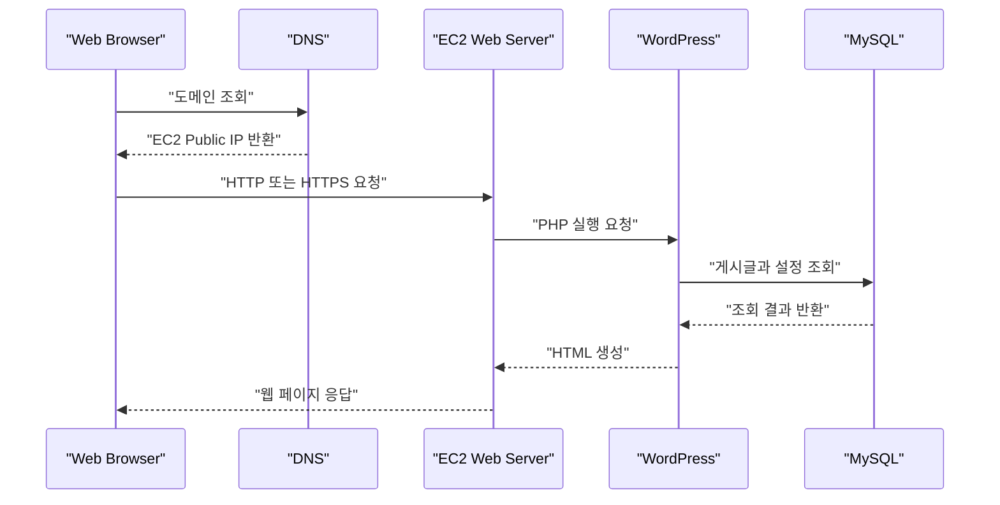

이 흐름을 이해하면 장애가 발생한 위치를 단계별로 좁힐 수 있다.

- 도메인이 해석되지 않으면 DNS 설정을 확인한다.
- 연결이 거부되면 Security Group과 Linux Firewall을 확인한다.
- 기본 웹 페이지가 나오지 않으면 웹 서버 상태를 확인한다.
- WordPress 오류가 발생하면 PHP와 파일 권한을 확인한다.
- 데이터베이스 연결 오류가 발생하면 MySQL 계정과 접속 정보를 확인한다.

#### 운영 환경에서 추가할 항목

입문 실습으로 웹 서비스를 실행한 뒤 실제 운영 환경으로 확장하려면 다음 항목이 필요하다.

| 영역 | 추가 고려 사항 |
|---|---|
| HTTPS | 인증서 발급과 HTTP 요청의 HTTPS 전환 |
| 고정 주소 | Elastic IP 또는 Load Balancer 사용 |
| 데이터베이스 | Amazon RDS 분리와 자동 백업 |
| 파일 백업 | EBS Snapshot 또는 객체 스토리지 활용 |
| 비밀번호 | AWS Secrets Manager 등으로 안전하게 관리 |
| 모니터링 | CloudWatch Metric과 로그 수집 |
| 가용성 | 여러 가용 영역과 Load Balancer 구성 |
| 비용 | EC2, EBS, Elastic IP, 데이터 전송 비용 확인 |
| 업데이트 | 운영체제와 WordPress 보안 패치 적용 |

처음부터 복잡한 고가용성 구조를 만들 필요는 없다. 다만 단일 EC2에 웹 서버, WordPress, MySQL을 모두 설치한 구조는 해당 인스턴스 장애가 전체 서비스 장애로 이어진다는 점을 이해해야 한다.

### 정리

AWS 기반 웹 서비스는 EC2 인스턴스 하나를 생성하는 것만으로 완성되지 않는다. 외부 요청이 서버에 도달하려면 Public Network와 Security Group이 필요하고, 사람이 기억하기 쉬운 주소를 제공하려면 DNS와 A Record가 필요하다. WordPress의 데이터를 보관하려면 MySQL과 애플리케이션 전용 계정도 구성해야 한다.

이번 과정의 핵심은 개별 AWS 서비스의 메뉴를 암기하는 것이 아니라 요청이 DNS, 방화벽, EC2, WordPress, MySQL을 거쳐 처리되는 전체 구조를 이해하는 것이다. 이 흐름을 이해하면 이후 다른 웹 애플리케이션을 AWS에 배포할 때도 같은 원리를 적용할 수 있다.


## Cloud Computing의 개념

클라우드 컴퓨팅은 서버, 네트워크, 스토리지, 데이터베이스와 같은 IT 자원을 직접 구매하지 않고 필요할 때 빌려 사용하며, 사용량에 따라 비용을 지불하는 방식이다.

### On-Premises란

On-Premises는 조직이 서버와 네트워크 장비를 직접 구매하고 자체 데이터센터나 IDC에 설치해 운영하는 방식이다.


On-Premises 환경에서는 다음 작업을 조직이 직접 책임진다.

- 서버, 네트워크 장비와 스토리지 구매
- 데이터센터 공간과 전력 확보
- 방화벽과 네트워크 구성
- 고장 난 장비 교체
- 데이터 백업과 복구
- 처리량 증가에 따른 장비 증설
- 운영체제와 애플리케이션 관리

물리 장비까지 직접 통제할 수 있다는 장점이 있지만, 초기 투자 비용이 크고 장비 구매부터 설치까지 많은 시간이 필요하다.

### Cloud Computing이란

클라우드 환경에서는 AWS와 같은 공급자가 구축한 데이터센터의 자원을 Management Console, CLI 또는 API를 통해 생성하고 사용한다.

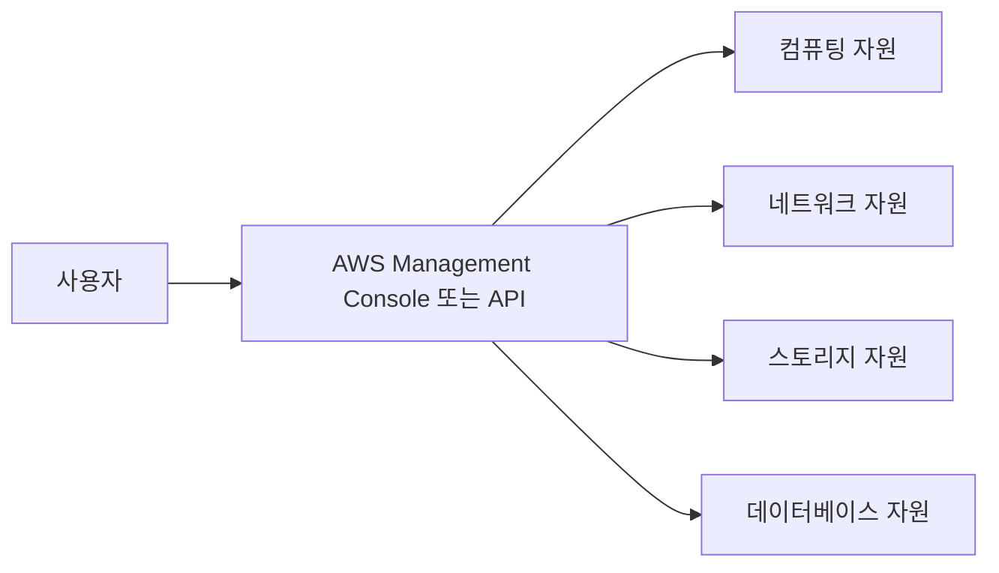

클라우드의 주요 특징은 다음과 같다.

- 필요한 자원을 빠르게 생성할 수 있다.
- 사용량에 따라 자원을 확장하거나 축소할 수 있다.
- 초기 하드웨어 구매 비용을 줄일 수 있다.
- 사용하지 않는 자원을 제거해 비용을 조절할 수 있다.
- 데이터베이스, 모니터링, 메시징 등의 관리형 서비스를 이용할 수 있다.
- API와 Infrastructure as Code를 이용해 인프라를 자동화할 수 있다.

### On-Premises와 Cloud 비교

| 구분 | On-Premises | Cloud Computing |
|---|---|---|
| 자원 확보 | 장비 구매와 설치 | Console 또는 API로 생성 |
| 초기 비용 | 상대적으로 큼 | 상대적으로 작음 |
| 확장 속도 | 장비 구매와 설치 기간 필요 | 비교적 빠르게 확장 |
| 비용 구조 | 장비와 유지보수 비용 | 사용량 기반 과금 |
| 하드웨어 관리 | 사용자가 직접 수행 | 클라우드 사업자가 담당 |
| 통제 범위 | 물리 장비까지 통제 | 제공되는 서비스 범위에서 통제 |
| 장애 대응 | 자체 인력과 예비 장비 필요 | 다중 AZ와 관리형 기능 활용 |

클라우드가 항상 On-Premises보다 저렴한 것은 아니다. 사용하지 않는 인스턴스, 스토리지, Load Balancer 등을 방치하거나 데이터 전송량이 많아지면 오히려 비용이 증가할 수 있다.

총소유비용인 TCO를 비교할 때는 서버 비용뿐만 아니라 다음 항목을 함께 고려해야 한다.

- 소프트웨어 라이선스
- 네트워크와 스토리지 장비
- 데이터센터와 전력
- 인프라 운영 인력
- 장애 대응과 유지보수
- 보안과 백업
- 기술 교육
- 서비스 확장에 필요한 시간

클라우드의 핵심 가치는 단순한 비용 절감이 아니라 빠른 자원 제공, 탄력적인 확장, 자동화와 관리형 서비스 활용에 있다.

### 클라우드 서비스 모델

| 모델 | 사용자가 관리하는 주요 영역 | 예시 |
|---|---|---|
| IaaS | 운영체제, 미들웨어, 애플리케이션 | Amazon EC2 |
| PaaS | 애플리케이션과 데이터 | AWS Elastic Beanstalk |
| Managed Service | 서비스 설정과 데이터 | Amazon RDS |
| SaaS | 사용자 설정과 업무 데이터 | 웹 메일과 협업 서비스 |

EC2는 가상 서버를 제공하므로 운영체제와 웹 서버를 사용자가 관리해야 한다. RDS는 데이터베이스 설치, 백업과 장애 조치의 일부를 AWS에 위임할 수 있다. 관리형 서비스를 사용하면 운영 부담은 줄어들지만 비용과 설정 자유도는 달라질 수 있다.

## AWS 가입

AWS 계정을 생성하면 계정 전체를 제어할 수 있는 Root User가 만들어진다. Root User는 결제 정보 변경과 계정 해지 같은 일부 계정 수준 작업에 필요하지만, 일상적인 인프라 관리에는 사용하지 않는 것이 원칙이다.

### 가입 준비물

- 수신 가능한 이메일 주소
- 본인 확인이 가능한 휴대전화
- 유효한 결제 수단
- 정확한 영문 주소와 연락처
- MFA에 사용할 스마트폰 또는 보안 키

업무용 계정은 개인 이메일보다 조직이 관리하는 이메일 주소를 사용하는 것이 안전하다. Root User 이메일은 계정 복구에 사용되므로 이메일 계정에도 MFA를 적용해야 한다.

### 가입 절차

1. AWS 계정 생성 화면에서 Root User 이메일과 계정 이름을 입력한다.
2. 이메일로 전달된 인증 코드를 입력한다.
3. Root User에 사용할 강력한 비밀번호를 설정한다.
4. Free Plan 또는 Paid Plan을 선택한다.
5. 개인 또는 비즈니스 계정 유형을 선택한다.
6. 영문 주소와 연락처를 입력한다.
7. 결제 정보를 등록한다.
8. 전화번호 등을 이용해 본인 인증을 수행한다.
9. 계정 활성화가 완료될 때까지 기다린다.
10. Root User로 로그인해 MFA와 비용 알림을 설정한다.

가입 화면과 절차는 계정 유형과 시점에 따라 달라질 수 있다. 비밀번호는 다른 서비스에서 사용한 값을 재사용하지 않고 충분히 길고 복잡하게 설정해야 한다.

### 가입 직후 수행할 작업

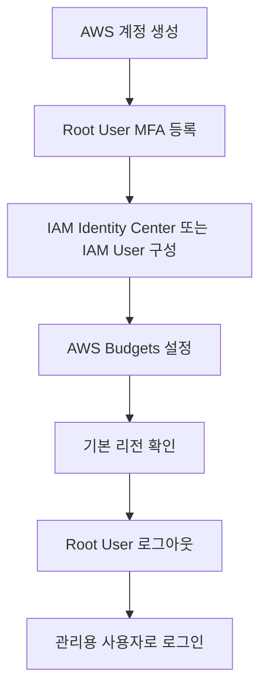

AWS Resource는 대부분 리전 단위로 관리된다. 서울 리전에서 생성한 EC2는 도쿄 리전을 선택한 화면에서 보이지 않는다. 실습에 사용할 리전을 정하고 Resource를 생성하기 전에 현재 리전을 확인해야 한다.

Root User로 기본 보안 설정을 완료한 다음에는 로그아웃하고 별도의 관리용 사용자로 작업한다.

## MFA(2차 인증) 설정

`MEA`가 아니라 `MFA`가 올바른 명칭이다. MFA는 Multi-Factor Authentication의 약자로, 비밀번호 외에 추가 인증 요소를 요구하는 보안 방식이다.

비밀번호가 유출되더라도 등록된 인증 장치가 없으면 로그인을 완료하기 어렵게 만들기 때문에 Root User에는 반드시 MFA를 설정해야 한다.

### AWS에서 지원하는 MFA 방식

| 방식 | 특징 | 권장 상황 |
|---|---|---|
| Passkey | 생체 인증, PIN 또는 자격 증명 관리자를 이용 | 일반 사용자에게 우선 권장 |
| FIDO Security Key | 물리 보안 키 사용 | 관리자와 중요 계정 |
| Virtual Authenticator | 시간 기반 일회용 비밀번호 사용 | 스마트폰을 이용한 간단한 구성 |
| Hardware TOTP Token | 전용 장치에서 인증 코드 생성 | 스마트폰 사용이 제한된 환경 |

Virtual Authenticator에는 Google Authenticator뿐만 아니라 TOTP 표준을 지원하는 Microsoft Authenticator, 1Password 등의 애플리케이션도 사용할 수 있다.

### Root User MFA 설정 절차

1. AWS Management Console에 Root User로 로그인한다.
2. 오른쪽 상단의 계정 메뉴에서 `Security credentials`를 선택한다.
3. `Multi-factor authentication`에서 `Assign MFA device`를 선택한다.
4. Passkey, Security Key 또는 Authenticator App을 선택한다.
5. Authenticator App을 사용한다면 화면의 QR 코드를 스캔한다.
6. 화면에서 요구하는 연속된 MFA 코드를 입력한다.
7. 등록이 완료되면 AWS Console에서 로그아웃한다.
8. Root User 이메일, 비밀번호와 MFA를 이용해 다시 로그인한다.

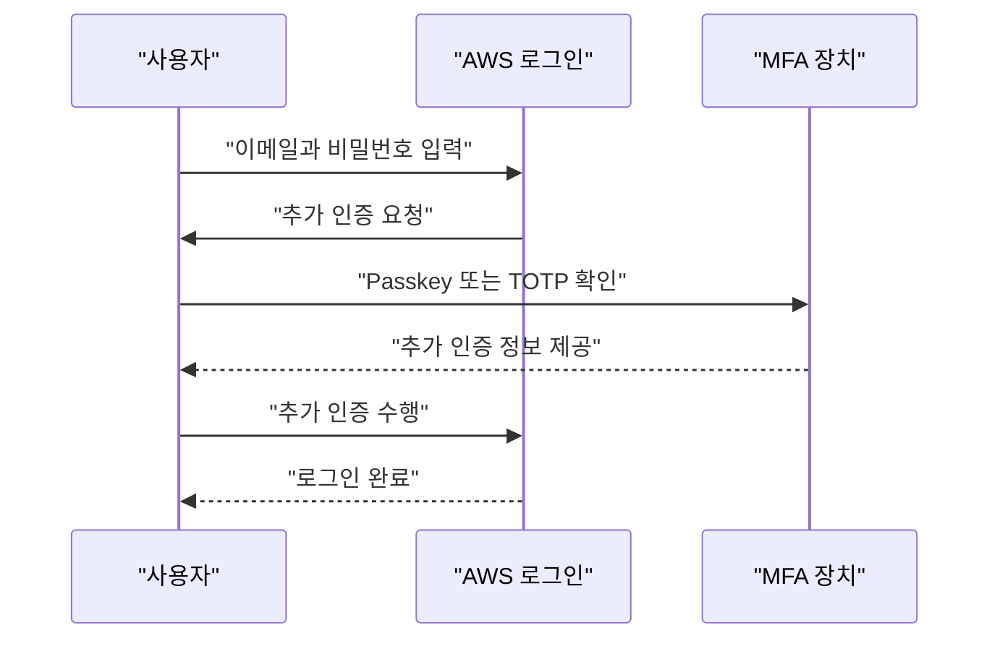

### MFA 설정 시 주의사항

- QR 코드와 초기 설정 키를 공개된 장소에 저장하지 않는다.
- MFA 화면을 캡처해 메신저나 Git 저장소에 올리지 않는다.
- 스마트폰의 시간 동기화 기능을 활성화한다.
- 계정 복구에 사용하는 이메일과 전화번호를 최신 상태로 유지한다.
- 중요한 계정에는 복구 가능한 추가 MFA 장치 등록을 검토한다.
- Root User뿐만 아니라 Console에 로그인하는 IAM User에도 MFA를 적용한다.

TOTP 인증 코드는 일반적으로 일정 시간마다 변경된다. 첫 번째 코드와 두 번째 코드를 입력해야 하는 화면에서는 코드가 변경된 후 다음 값을 입력해야 한다.

## AWS Free Tier 설명

AWS Free Tier는 AWS 서비스를 무제한으로 무료 사용할 수 있는 제도가 아니다. 가입 시점, 선택한 Account Plan, 서비스와 사용량에 따라 무료 적용 범위가 달라진다.

현재 신규 고객은 가입 시 기본 크레딧을 받고 지정된 활동을 통해 추가 크레딧을 받을 수 있다. Free Plan은 최대 6개월 또는 크레딧을 모두 사용할 때까지 유지되며, 먼저 도달한 조건에 따라 종료된다.

### Free Plan과 Paid Plan

| 구분 | Free Plan | Paid Plan |
|---|---|---|
| 주요 목적 | 학습과 기능 체험 | 운영 및 확장 가능한 서비스 |
| 사용 기간 | 최대 6개월 또는 크레딧 소진 시점 | 계정을 유지하는 동안 사용 |
| 비용 | Plan 범위에서 과금 방지 | 크레딧 초과분을 종량제로 청구 |
| 서비스 범위 | 일부 서비스와 기능 제한 | 더 넓은 서비스와 기능 사용 |
| 종료 시점 | 계정 종료 및 Resource 접근 제한 가능 | 사용한 만큼 계속 과금 |

과거에 사용되던 `가입 후 12개월 무료`, `EBS 30GB 무료`, `Elastic IP 한 개 무료`와 같은 기준을 현재의 모든 신규 계정에 적용하면 안 된다. Billing Console에서 현재 계정에 적용된 Plan, 크레딧과 서비스별 무료 사용량을 직접 확인해야 한다.

### Free Tier에서도 비용이 발생하는 사례

- 무료 범위를 초과한 EC2 인스턴스를 실행한 경우
- EC2를 중지했지만 EBS Volume을 남겨 둔 경우
- EBS Snapshot이나 AMI를 삭제하지 않은 경우
- Public IPv4 또는 Elastic IP를 계속 보유한 경우
- RDS에서 Multi-AZ나 높은 사양을 선택한 경우
- Provisioned IOPS와 추가 스토리지를 사용한 경우
- NAT Gateway나 Load Balancer를 생성한 경우
- 다른 리전이나 인터넷으로 대량의 데이터를 전송한 경우
- CloudWatch Log를 장기간 저장한 경우
- 사용하지 않는 컨테이너 이미지와 백업을 보관한 경우

EC2를 중지하면 일반적으로 인스턴스 컴퓨팅 비용은 중단되지만 EBS Volume, Snapshot, Public IPv4 등의 비용은 계속 발생할 수 있다. 중지와 삭제를 동일하게 생각하면 안 된다.

### 비용 사고를 방지하는 방법

1. Billing Console에서 현재 크레딧과 사용량을 확인한다.
2. AWS Budgets에서 월간 예산을 설정한다.
3. 예산 사용량의 50%, 80%, 100%에 알림을 설정한다.
4. Cost Anomaly Detection을 활성화한다.
5. 모든 Resource에 `Project`, `Environment`, `Owner` 태그를 추가한다.
6. 실습이 끝나면 모든 리전에서 Resource를 확인한다.
7. EC2뿐만 아니라 EBS, Snapshot, Elastic IP와 Load Balancer도 삭제한다.

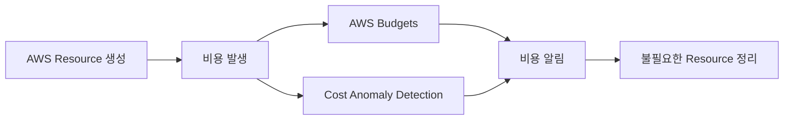

Free Tier 사용 여부와 관계없이 비용 모니터링은 주기적으로 수행해야 한다. 알림은 비용 발생을 차단하는 기능이 아니라 사용량을 알려주는 기능이므로, 알림을 받은 뒤 Resource를 직접 확인하고 조치해야 한다.

## AWS IAM을 이용한 부계정 생성하기

IAM은 Identity and Access Management의 약자로 AWS Resource에 접근할 수 있는 사용자, 역할과 권한을 관리하는 서비스다.

IAM User를 흔히 AWS 부계정이라고 표현하지만 독립된 AWS 계정은 아니다. IAM User는 하나의 AWS Account 안에서 생성되는 Identity이며 결제 정보, 서비스 한도와 Resource를 상위 계정과 공유한다.

별도의 Root User와 결제 경계를 가진 독립 환경이 필요하다면 AWS Organizations의 Member Account를 사용해야 한다.

### Root User, IAM User와 IAM Role 비교

| 구분 | Root User | IAM User | IAM Role |
|---|---|---|---|
| 범위 | AWS Account 전체 | Account 내부 Identity | 위임 가능한 Identity |
| 자격 증명 | 장기 자격 증명 | 장기 자격 증명 | 임시 자격 증명 |
| 주요 용도 | 계정 수준의 제한된 작업 | 소규모 실습 또는 호환 목적 | 사용자와 AWS 서비스의 권한 위임 |
| 일상 사용 | 사용하지 않는 것이 원칙 | 가능하지만 신규 구성에는 비권장 | 권장 |
| MFA | 반드시 설정 | Console 사용자에게 설정 | Role 사용자의 인증 단계에서 적용 |

현재는 사람의 AWS 접근에 IAM User를 대량으로 생성하기보다 IAM Identity Center와 IAM Role 기반 임시 자격 증명을 사용하는 방식이 권장된다. 다만 IAM의 기본 구조를 이해하기 위한 실습에서는 제한된 IAM User를 생성할 수 있다.

### IAM 권한 평가 원칙

IAM은 기본적으로 모든 요청을 거부한다. Policy에서 명시적으로 허용한 작업만 실행할 수 있으며 명시적인 `Deny`는 다른 Policy의 `Allow`보다 우선한다.

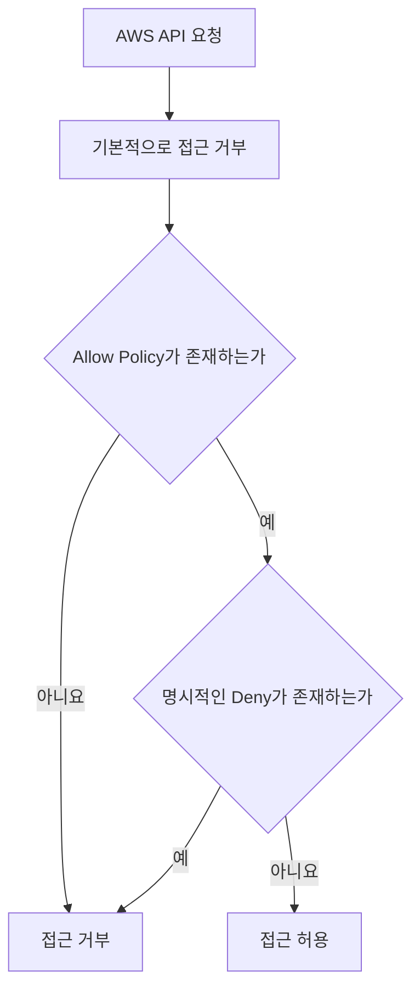

### IAM Policy 유형

| Policy 유형 | 역할 |
|---|---|
| Identity-based Policy | User, Group과 Role에 권한 부여 |
| Resource-based Policy | Resource에 접근 가능한 Principal 지정 |
| Permissions Boundary | Identity가 가질 수 있는 최대 권한 제한 |
| Organizations SCP | 조직 또는 Account의 최대 권한 제한 |
| ACL | 일부 서비스의 Resource 접근 목록 |
| Session Policy | 임시 Session의 권한을 추가로 제한 |

Permissions Boundary와 SCP는 권한을 직접 부여하지 않는다. 다른 Policy에서 허용한 권한이 실제로 행사될 수 있는 최대 범위를 제한한다.

### IAM Group과 User 생성

1. Root User로 AWS Management Console에 로그인한다.
2. IAM으로 이동한다.
3. `User groups`에서 `Create group`을 선택한다.
4. 그룹 이름을 `EC2Operators`로 지정한다.
5. 실습에 필요한 EC2 Policy를 그룹에 연결한다.
6. `Users`에서 `Create user`를 선택한다.
7. 사용자 이름을 `user01`과 같이 지정한다.
8. AWS Management Console 접근이 필요하면 Console Access를 활성화한다.
9. 사용자가 최초 로그인 시 비밀번호를 변경하도록 설정한다.
10. 사용자를 `EC2Operators` 그룹에 추가한다.
11. IAM User에도 MFA를 등록한다.
12. Root User에서 로그아웃한 후 IAM User로 다시 로그인한다.

`AmazonEC2FullAccess`는 EC2 관련 Resource를 광범위하게 관리할 수 있는 권한이다. 간단한 실습에서는 사용할 수 있지만 운영 환경에서는 필요한 작업만 허용하도록 권한을 축소해야 한다.

### 최소 권한 Policy 예시

다음 Policy는 서울 리전에 있고 `Environment=study` 태그가 지정된 EC2 인스턴스의 시작, 중지와 재부팅만 허용한다.

```json
{
  "Version": "2012-10-17",
  "Statement": [
    {
      "Sid": "ViewEC2Resources",
      "Effect": "Allow",
      "Action": [
        "ec2:DescribeInstances",
        "ec2:DescribeInstanceStatus",
        "ec2:DescribeTags"
      ],
      "Resource": "*"
    },
    {
      "Sid": "ManageStudyInstances",
      "Effect": "Allow",
      "Action": [
        "ec2:StartInstances",
        "ec2:StopInstances",
        "ec2:RebootInstances"
      ],
      "Resource": "arn:aws:ec2:ap-northeast-2:<ACCOUNT_ID>:instance/*",
      "Condition": {
        "StringEquals": {
          "ec2:ResourceTag/Environment": "study"
        }
      }
    }
  ]
}
```

- `Version`은 IAM Policy 문법 버전이다.
- `Statement`는 하나 이상의 권한 규칙을 포함한다.
- `Effect`는 요청을 허용하거나 거부한다.
- `Action`은 수행할 수 있는 AWS API를 지정한다.
- `Resource`는 권한이 적용되는 Resource ARN이다.
- `Condition`은 특정 태그가 있는 EC2로 권한 범위를 제한한다.

`<ACCOUNT_ID>`는 실제 AWS Account ID로 변경해야 한다.

### IAM User 로그인

IAM User는 Account ID 또는 Account Alias가 포함된 URL로 로그인할 수 있다.

```text
https://<ACCOUNT_ID>.signin.aws.amazon.com/console
```

Account Alias를 설정했다면 다음 형식을 사용할 수 있다.

```text
https://<ACCOUNT_ALIAS>.signin.aws.amazon.com/console
```

로그인 URL, IAM 사용자 이름과 초기 비밀번호는 안전한 경로로 전달한다. 비밀번호와 MFA 초기 설정 정보를 같은 메시지로 전달해서는 안 된다.

Access Key는 Console 로그인 정보와 별개다. AWS CLI나 API를 사용할 필요가 없다면 생성하지 않는다. 프로그램에서 AWS 서비스에 접근해야 한다면 Access Key를 소스 코드에 저장하지 말고 IAM Role과 임시 자격 증명을 사용해야 한다.

### 정리

Root User는 MFA와 계정 복구 설정을 관리하는 용도로 제한하고 일상적인 작업에는 IAM Identity Center, IAM Role 또는 권한이 제한된 IAM User를 사용해야 한다.

IAM User를 생성할 때는 사용자에게 Policy를 직접 반복해서 연결하기보다 역할이 같은 사용자들을 Group으로 관리하는 것이 효율적이다. 또한 처음에는 AWS Managed Policy로 실습하더라도 실제 운영 환경에서는 사용 기록을 바탕으로 최소 권한 Policy로 축소해야 한다.
