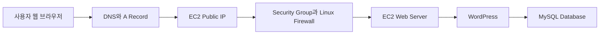
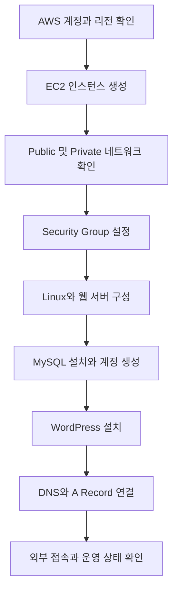
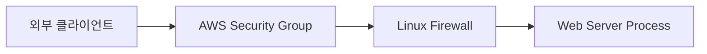
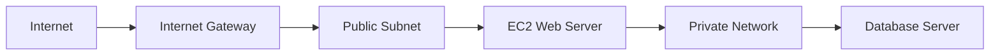
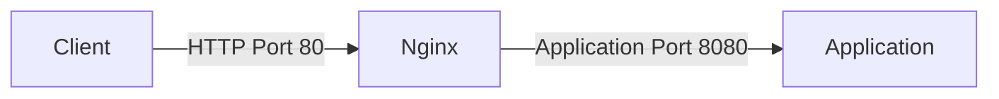
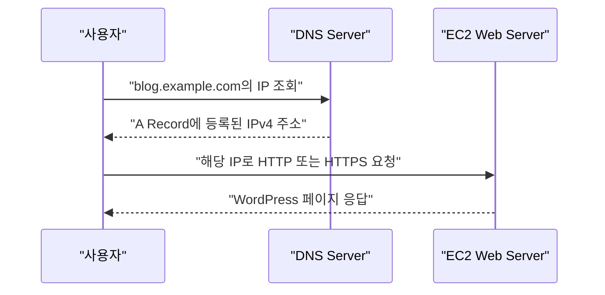
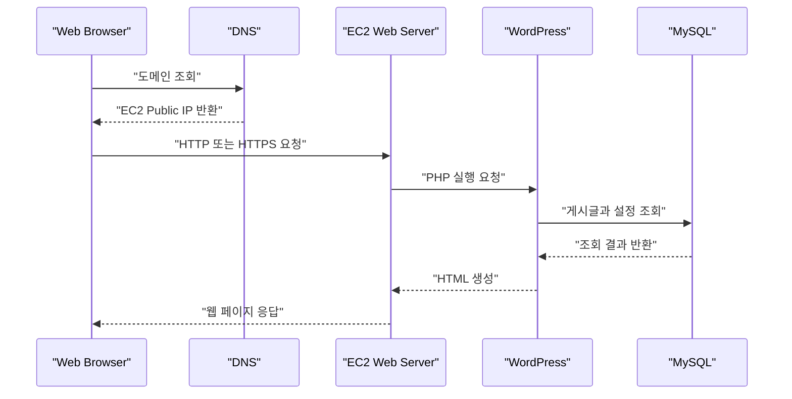

# 아마존 AWS 알아보기

# 아마존 AWS 알아보기

* toc
{:toc}

---

## AWS 입문자를 위한 웹 서비스 만들기 

### 01. AWS 입문자를 위한 웹 서비스 만들기

AWS를 처음 접하면 EC2, VPC, Security Group, Route 53처럼 서로 다른 역할을 가진 서비스가 한꺼번에 등장한다. 각각의 기능만 따로 살펴보면 어렵지 않지만, 실제 웹 서비스를 구성하려면 서버, 네트워크, 보안, 도메인, 데이터베이스가 어떤 경로로 연결되는지 이해해야 한다.

이번 과정에서는 AWS에 가상 머신을 생성하는 단계부터 WordPress 기반 개인 블로그를 구축하고 외부 사용자가 도메인으로 접속할 수 있도록 구성한다. 단순히 화면에서 설정값을 입력하는 데 그치지 않고, 이후 다른 웹 서비스에도 응용할 수 있도록 각 구성 요소의 역할과 동작 원리를 함께 살펴본다.

#### 최종 구성 목표



전체 구성에서 각 요소는 다음 역할을 담당한다.

| 구성 요소 | 역할 |
|---|---|
| Amazon EC2 | 웹 서버와 애플리케이션을 실행하는 가상 머신 |
| Security Group | EC2로 들어오고 나가는 네트워크 트래픽 제어 |
| Linux Firewall | 운영체제 내부의 네트워크 접근 제어 |
| Public IP | 인터넷에서 EC2에 접근하기 위한 주소 |
| Private IP | VPC 내부 리소스 간 통신에 사용하는 주소 |
| DNS | 도메인 이름을 IP 주소로 변환 |
| WordPress | 블로그 콘텐츠와 관리 기능을 제공하는 웹 애플리케이션 |
| MySQL | 게시글, 사용자, 설정과 같은 데이터를 저장하는 데이터베이스 |

#### 웹 서비스 구축 과정



이 과정에서는 AWS 서비스를 개별적으로 사용하는 방법뿐만 아니라 요청이 EC2에 도착하고 WordPress가 MySQL에서 데이터를 조회해 응답을 반환하는 전체 흐름을 확인한다.

#### 사전에 알아둘 기본 개념

AWS 입문 단계에서 모든 내용을 완벽하게 알고 시작할 필요는 없다. 다만 다음 개념을 미리 이해하면 실습 중 발생하는 문제를 훨씬 빠르게 분석할 수 있다.

#### Firewall과 Security Group

Firewall은 네트워크 패킷을 검사하고 허용하거나 차단하는 보안 장치다. 웹 서버를 외부에 공개하더라도 모든 포트를 열어 두는 것이 아니라 서비스에 필요한 포트만 허용해야 한다.

일반적인 웹 서버에서 사용하는 포트는 다음과 같다.

| 포트 | 프로토콜 | 용도 | 일반적인 접근 범위 |
|---|---|---|---|
| 22 | SSH | Linux 원격 관리 | 관리자 IP로 제한 |
| 80 | HTTP | 암호화되지 않은 웹 요청 | 외부 사용자에게 공개 |
| 443 | HTTPS | 암호화된 웹 요청 | 외부 사용자에게 공개 |
| 3306 | MySQL | 데이터베이스 연결 | 애플리케이션 서버로 제한 |

AWS에서는 Security Group이 EC2 네트워크 인터페이스 수준에서 트래픽을 제어한다. Linux 내부에서는 `iptables`, `nftables`, `firewalld`, `ufw`와 같은 도구로 추가 방화벽 정책을 적용할 수 있다.



두 방화벽 중 하나라도 요청을 차단하면 애플리케이션에 접근할 수 없다. 따라서 접속 문제가 발생하면 다음 순서로 확인하는 것이 좋다.

1. EC2에 Public IP가 할당되어 있는지 확인한다.
2. Security Group에 필요한 인바운드 규칙이 있는지 확인한다.
3. Linux Firewall이 해당 포트를 허용하는지 확인한다.
4. 웹 서버 프로세스가 실제 포트에서 실행 중인지 확인한다.
5. Subnet과 Route Table에 인터넷 연결 경로가 있는지 확인한다.

Security Group에서 SSH 포트인 22번을 `0.0.0.0/0`으로 공개하면 인터넷 전체에서 접속을 시도할 수 있다. 관리 포트는 가능한 한 현재 관리자 IP 또는 신뢰할 수 있는 네트워크로 제한해야 한다.

#### EC2의 기본 제어 방식

Amazon EC2는 AWS에서 제공하는 가상 서버다. 인스턴스를 생성한 뒤에는 시작, 중지, 재부팅, 종료와 같은 작업을 수행할 수 있다.

| 작업 | 의미 | 주의사항 |
|---|---|---|
| Start | 중지된 인스턴스 시작 | Public IP가 변경될 수 있음 |
| Stop | 가상 머신 종료 상태로 전환 | EBS 데이터는 일반적으로 유지 |
| Reboot | 운영체제 재부팅 | 같은 인스턴스에서 다시 시작 |
| Terminate | 인스턴스 삭제 | 연결된 리소스와 데이터 삭제 여부 확인 필요 |

`Stop`과 `Terminate`는 전혀 다른 작업이다. 중지는 나중에 다시 시작할 수 있지만 종료는 인스턴스를 삭제한다. 중요한 서버를 종료할 때는 EBS Volume의 삭제 설정과 백업 상태를 반드시 확인해야 한다.

EC2를 중지하고 다시 시작하면 자동 할당된 Public IPv4 주소가 바뀔 수 있다. DNS에서 서버 IP를 참조해야 한다면 고정 Public IP인 Elastic IP를 사용하거나 변경 가능한 Endpoint 구조를 고려해야 한다.

#### Public Network와 Private Network

Public IP는 인터넷에서 접근할 수 있는 주소이고 Private IP는 VPC 내부 통신에 사용하는 주소다.



Public Subnet은 Internet Gateway로 향하는 Route를 가지고 있으며 외부 서비스를 제공하는 리소스를 배치할 수 있다. Private Subnet은 인터넷에서 직접 접근할 수 없도록 구성하며 데이터베이스와 내부 시스템을 배치하는 데 사용한다.

단순 실습에서는 하나의 EC2에 웹 서버와 MySQL을 함께 설치할 수 있지만 운영 환경에서는 역할을 분리하는 것이 일반적이다.

- 웹 서버는 외부 요청을 받아야 한다.
- 데이터베이스는 외부에 직접 공개할 필요가 없다.
- 데이터베이스 포트는 웹 애플리케이션에서만 접근하도록 제한한다.
- 중요한 데이터는 인스턴스와 별도로 백업한다.

#### Port Forwarding

Port Forwarding은 특정 IP와 포트로 들어온 요청을 다른 IP나 포트로 전달하는 방식이다.

예를 들어 외부 사용자는 80번 포트로 요청하지만 애플리케이션은 내부에서 8080번 포트로 실행될 수 있다. 이때 웹 서버나 프록시가 요청을 전달한다.



Port Forwarding과 단순한 방화벽 포트 허용은 다르다. 방화벽 규칙은 트래픽을 통과시킬지 결정하고, Port Forwarding은 통과한 요청을 다른 목적지로 전달한다.

#### DNS와 A Record

사용자는 웹 서비스에 접속할 때 IP 주소보다 도메인 이름을 사용한다. DNS는 도메인 이름을 실제 서버 주소로 변환한다.



A Record는 도메인 또는 하위 도메인을 IPv4 주소에 연결한다.

```text
blog.example.com -> 203.0.113.10
```

EC2의 Public IP가 변경되면 기존 A Record는 더 이상 올바른 서버를 가리키지 않는다. 따라서 도메인을 연결할 때는 Elastic IP처럼 안정적으로 유지되는 주소를 사용하는 것이 좋다.

DNS 설정을 변경한 직후에는 캐시와 TTL로 인해 결과가 즉시 반영되지 않을 수 있다. 접속 장애를 확인할 때는 다음 명령으로 실제 DNS 응답을 조회할 수 있다.

```shell
nslookup blog.example.com
```

Linux나 macOS에서는 다음 명령도 사용할 수 있다.

```shell
dig blog.example.com A
```

#### MySQL 기본 관리

WordPress는 게시글, 댓글, 사용자 계정, 플러그인 설정을 MySQL에 저장한다. 따라서 MySQL 설치뿐만 아니라 애플리케이션 전용 Database와 계정을 생성해야 한다.

```sql
CREATE DATABASE wordpress
    CHARACTER SET utf8mb4
    COLLATE utf8mb4_unicode_ci;

CREATE USER 'wordpress_user'@'localhost'
    IDENTIFIED BY 'CHANGE_ME_STRONG_PASSWORD';

GRANT ALL PRIVILEGES
    ON wordpress.*
    TO 'wordpress_user'@'localhost';

FLUSH PRIVILEGES;
```

- `CREATE DATABASE`는 WordPress가 사용할 Database를 생성한다.
- `utf8mb4`는 한글과 이모지를 포함한 유니코드 문자를 저장한다.
- `CREATE USER`는 WordPress 전용 계정을 생성한다.
- `'localhost'`는 같은 서버에서 실행되는 WordPress만 접속하도록 제한한다.
- `GRANT`는 해당 계정에 `wordpress` Database의 권한을 부여한다.

WordPress에 MySQL의 관리자 계정을 연결하면 애플리케이션 취약점이 데이터베이스 전체 권한으로 확대될 수 있다. 애플리케이션에는 필요한 Database 범위의 전용 계정을 사용해야 한다.

#### Linux 기본 명령어

AWS EC2를 운영하려면 Linux 파일 시스템과 기본 명령어를 이해해야 한다.

| 명령어 | 용도 | 예시 |
|---|---|---|
| `pwd` | 현재 경로 확인 | `pwd` |
| `ls` | 파일과 디렉터리 목록 조회 | `ls -al` |
| `cd` | 디렉터리 이동 | `cd /var/www/html` |
| `cp` | 파일 복사 | `cp source.conf backup.conf` |
| `mv` | 파일 이동 또는 이름 변경 | `mv old.conf new.conf` |
| `rm` | 파일 삭제 | `rm old.log` |
| `mkdir` | 디렉터리 생성 | `mkdir wordpress` |
| `cat` | 파일 내용 출력 | `cat /etc/os-release` |
| `sudo` | 관리자 권한으로 명령 실행 | `sudo systemctl status nginx` |
| `systemctl` | 서비스 상태 관리 | `sudo systemctl restart nginx` |

파일을 이동하거나 삭제하기 전에는 현재 경로와 대상을 먼저 확인해야 한다.

```shell
pwd
ls -al
```

특히 `rm -rf`는 대상을 잘못 지정하면 복구하기 어려운 삭제가 발생한다. 관리자 권한으로 실행하기 전에는 절대 경로와 삭제 범위를 확인하는 습관이 필요하다.

#### WordPress 요청 처리 과정

WordPress가 설치된 후 사용자의 요청은 다음 순서로 처리된다.



이 흐름을 이해하면 장애가 발생한 위치를 단계별로 좁힐 수 있다.

- 도메인이 해석되지 않으면 DNS 설정을 확인한다.
- 연결이 거부되면 Security Group과 Linux Firewall을 확인한다.
- 기본 웹 페이지가 나오지 않으면 웹 서버 상태를 확인한다.
- WordPress 오류가 발생하면 PHP와 파일 권한을 확인한다.
- 데이터베이스 연결 오류가 발생하면 MySQL 계정과 접속 정보를 확인한다.

#### 운영 환경에서 추가할 항목

입문 실습으로 웹 서비스를 실행한 뒤 실제 운영 환경으로 확장하려면 다음 항목이 필요하다.

| 영역 | 추가 고려 사항 |
|---|---|
| HTTPS | 인증서 발급과 HTTP 요청의 HTTPS 전환 |
| 고정 주소 | Elastic IP 또는 Load Balancer 사용 |
| 데이터베이스 | Amazon RDS 분리와 자동 백업 |
| 파일 백업 | EBS Snapshot 또는 객체 스토리지 활용 |
| 비밀번호 | AWS Secrets Manager 등으로 안전하게 관리 |
| 모니터링 | CloudWatch Metric과 로그 수집 |
| 가용성 | 여러 가용 영역과 Load Balancer 구성 |
| 비용 | EC2, EBS, Elastic IP, 데이터 전송 비용 확인 |
| 업데이트 | 운영체제와 WordPress 보안 패치 적용 |

처음부터 복잡한 고가용성 구조를 만들 필요는 없다. 다만 단일 EC2에 웹 서버, WordPress, MySQL을 모두 설치한 구조는 해당 인스턴스 장애가 전체 서비스 장애로 이어진다는 점을 이해해야 한다.

### 정리

AWS 기반 웹 서비스는 EC2 인스턴스 하나를 생성하는 것만으로 완성되지 않는다. 외부 요청이 서버에 도달하려면 Public Network와 Security Group이 필요하고, 사람이 기억하기 쉬운 주소를 제공하려면 DNS와 A Record가 필요하다. WordPress의 데이터를 보관하려면 MySQL과 애플리케이션 전용 계정도 구성해야 한다.

이번 과정의 핵심은 개별 AWS 서비스의 메뉴를 암기하는 것이 아니라 요청이 DNS, 방화벽, EC2, WordPress, MySQL을 거쳐 처리되는 전체 구조를 이해하는 것이다. 이 흐름을 이해하면 이후 다른 웹 애플리케이션을 AWS에 배포할 때도 같은 원리를 적용할 수 있다.
