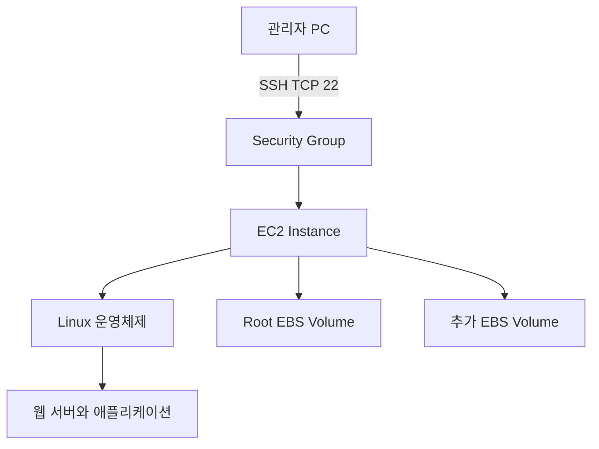
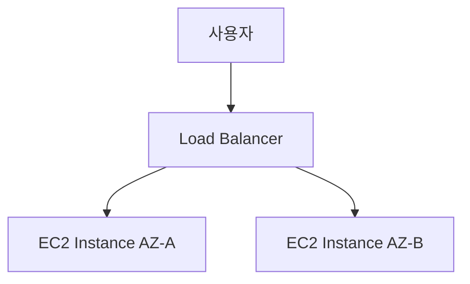
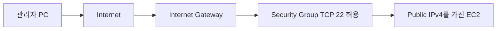
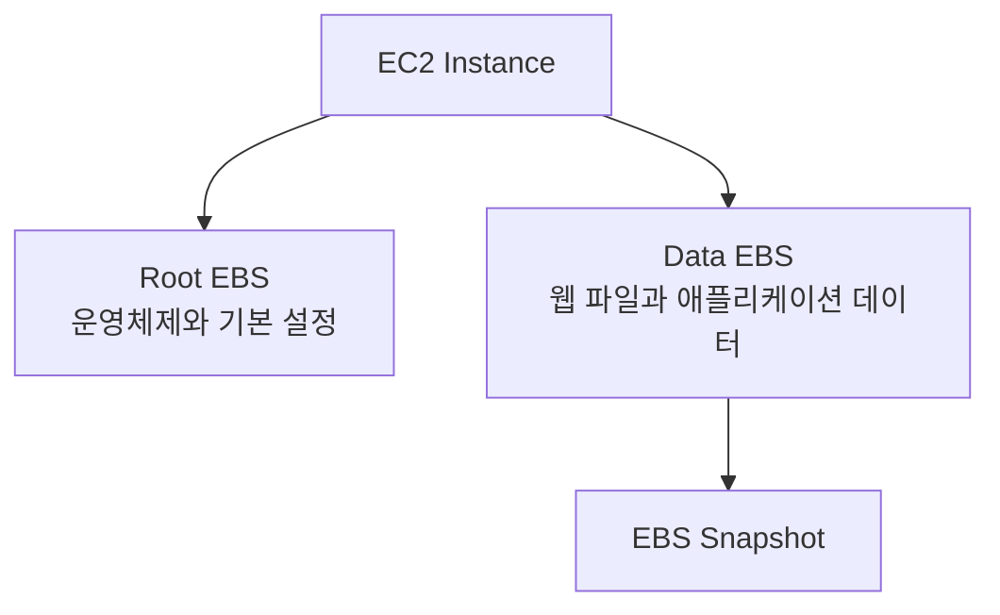
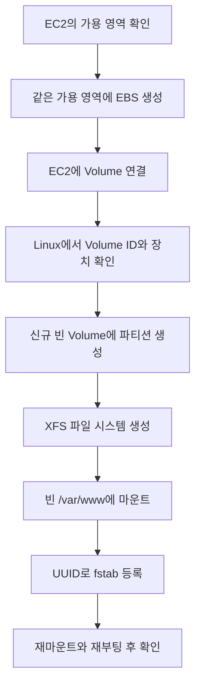

# EC4 특징 및 생성하기

# EC4 특징 및 생성하기

* toc
{:toc}

---

## EC2의 특징 및 EC2 유형에 대한 설명

Amazon EC2는 **Elastic Compute Cloud**의 약자로, AWS에서 필요한 사양의 컴퓨팅 자원을 생성해 사용할 수 있는 서비스다. 일반적인 EC2 인스턴스는 운영체제가 설치된 가상 서버이며, 여기에 웹 서버, 데이터베이스, 애플리케이션 등을 설치할 수 있다.

이번 실습에서는 EC2에 Linux 서버를 생성하고 Windows의 PuTTY로 접속한 뒤, 추가 EBS Volume을 연결해 웹 서비스용 저장 공간을 구성한다.

### EC2의 기본 구조



EC2를 이해할 때는 다음 구성 요소를 구분해야 한다.

| 구성 요소 | 역할 |
|---|---|
| Instance | 실제로 실행되는 서버 |
| AMI | 운영체제와 초기 소프트웨어 구성이 담긴 이미지 |
| Instance Type | CPU, 메모리, 네트워크 등 서버 사양 |
| EBS | 운영체제와 데이터를 보관하는 블록 스토리지 |
| Security Group | 인스턴스의 네트워크 접근 제어 |
| Key Pair | SSH 공개 키 인증에 사용하는 키 쌍 |
| VPC와 Subnet | 인스턴스가 배치되는 네트워크 |

AMI가 “어떤 운영체제로 시작할 것인가”를 결정한다면, Instance Type은 “얼마나 많은 컴퓨팅 자원을 사용할 것인가”를 결정한다.

### EC2의 주요 특징

#### 필요한 사양을 선택할 수 있다

애플리케이션의 특성에 맞춰 CPU와 메모리 구성을 선택할 수 있다. 간단한 블로그는 작은 범용 인스턴스로 시작할 수 있지만, 대량의 계산이나 메모리 처리가 필요하다면 다른 유형이 적합하다.

기존 인스턴스의 유형을 변경하는 작업은 일반적으로 중지 후 수행한다. CPU 아키텍처와 AMI 호환성도 확인해야 하므로 모든 유형으로 자유롭게 변경할 수 있는 것은 아니다.

#### 서버를 빠르게 생성할 수 있다

물리 서버를 구매하거나 데이터센터에 설치할 필요 없이 Console이나 API로 인스턴스를 생성할 수 있다. 동일한 설정을 반복해서 사용한다면 Launch Template을 이용해 배포 조건을 관리할 수 있다.

#### 여러 가용 영역에 분산 배치할 수 있다

하나의 EC2 인스턴스는 하나의 가용 영역에 존재한다. 여러 가용 영역에서 서비스를 운영하려면 각각 인스턴스를 생성하고 Load Balancer 등으로 연결해야 한다.



EC2를 사용한다는 사실만으로 고가용성이 보장되는 것은 아니다. 단일 인스턴스에 모든 기능을 설치하면 해당 인스턴스의 장애가 전체 서비스 장애로 이어진다.

### EC2 인스턴스 유형

| 분류 | 대표 계열 | 적합한 작업 |
|---|---|---|
| 범용 | T, M | 웹 서버, 개발 환경, 일반 애플리케이션 |
| 컴퓨팅 최적화 | C | 배치, 인코딩, CPU 중심 연산 |
| 메모리 최적화 | R, X | 대용량 캐시, 메모리 중심 데이터 처리 |
| 스토리지 최적화 | I, D | 높은 디스크 처리량이 필요한 작업 |
| 가속 컴퓨팅 | G, P, Inf, Trn | 그래픽, 머신러닝 학습과 추론 |

예를 들어 `t3.micro`는 다음과 같이 해석할 수 있다.

```text
t3.micro
││ └─ 인스턴스 크기
│└─── 세대
└──── 인스턴스 계열
```

크기를 선택할 때는 vCPU와 메모리뿐 아니라 EBS 대역폭, 네트워크 성능, 아키텍처도 함께 확인해야 한다. 큰 EBS 성능을 설정하더라도 EC2 자체의 EBS 대역폭이 작으면 원하는 처리량을 얻지 못할 수 있다.

### T 계열과 CPU Credit

T 계열은 평소 CPU 사용량이 낮고 간헐적으로 부하가 발생하는 작업에 적합한 버스트형 인스턴스다.

낮은 부하에서 CPU Credit을 적립하고, 기본 성능을 초과해서 CPU를 사용할 때 Credit을 소비한다.

| 모드 | 특징 |
|---|---|
| Standard | Credit이 부족하면 기본 성능 수준으로 제한될 수 있음 |
| Unlimited | Credit이 부족해도 추가 성능을 사용할 수 있지만 추가 요금 가능 |

지속적으로 CPU를 사용하는 작업이라면 T 계열보다 M 또는 C 계열이 적합할 수 있다. 특히 실습용 T3 인스턴스도 Unlimited 설정에서는 CPU 사용량에 따른 추가 비용을 확인해야 한다. [EC2 인스턴스 설정](https://docs.aws.amazon.com/us_en/AWSEC2/latest/UserGuide/ec2-instance-launch-parameters.html)

## Free Tier를 이용한 EC2 생성

이번 실습은 다음 구성을 기준으로 진행한다.

| 항목 | 실습 설정 |
|---|---|
| 이름 | `wordpress-web` |
| 리전 | 서울 `ap-northeast-2` |
| AMI | Amazon Linux 2023 |
| 아키텍처 | x86_64 |
| 인스턴스 유형 | 계정에서 사용 가능한 Free Tier 대상 소형 인스턴스 |
| 인스턴스 수 | 1개 |
| 네트워크 | Public Subnet |
| SSH 접근 | 관리자 공인 IP만 허용 |
| Root Volume | AMI 기본 용량 확인, 범용 SSD 사용 |
| 추가 Volume | 이후 단계에서 2GiB 생성 |

Amazon Linux 2는 지원 종료 일정이 지난 운영체제이므로 신규 실습은 Amazon Linux 2023을 기준으로 진행한다. 패키지 관리 명령도 Amazon Linux 2023의 `dnf`를 사용한다. [Amazon Linux 2 지원 종료 안내](https://docs.aws.amazon.com/AL2/latest/relnotes/relnotes-20260615.html)

### Free Tier 적용 조건 확인

`t2.micro`를 선택하면 언제나 무료라는 식으로 이해하면 안 된다.

AWS는 **2025년 7월 15일을 기준으로 계정 생성 시점에 따라 Free Tier 체계가 다르다.** 신규 계정은 크레딧과 Account Plan을 기준으로 사용 조건이 결정되므로 Console의 Free Tier 표시와 Billing 화면을 함께 확인해야 한다. [EC2 Free Tier 조건](https://docs.aws.amazon.com/AWSEC2/latest/UserGuide/ec2-free-tier-usage.html)

다음 항목을 확인한 뒤 생성한다.

- 현재 계정의 Free Plan 또는 Paid Plan 여부
- 남은 크레딧과 만료일
- AMI의 별도 소프트웨어 요금
- 인스턴스 유형과 실행 시간
- EBS 용량과 추가 성능 설정
- Public IPv4 비용

Free Tier 대상 표시는 무제한 무료를 의미하지 않는다. 또한 Public IPv4는 사용 중인 주소도 기본적으로 과금 대상이며, 계정 혜택이나 크레딧 적용 여부는 별도로 확인해야 한다. [Public IPv4 요금](https://aws.amazon.com/vpc/pricing/)

### EC2 생성 절차

#### 1. AWS Console과 리전 확인

EC2 생성 권한이 있는 관리용 사용자 또는 Role로 로그인한다. Root User는 일상적인 인스턴스 생성에 사용하지 않는다.

서울 리전을 선택하고 EC2의 `Instances` 화면에서 `Launch instances`를 누른다.

#### 2. 이름과 태그 설정

다음과 같이 태그를 지정하면 이후 비용과 리소스를 구분하기 쉽다.

| Key | Value |
|---|---|
| `Name` | `wordpress-web` |
| `Project` | `wordpress` |
| `Environment` | `study` |
| `Wordpress` | `Webserver` |

태그는 분류 정보다. 특정 태그를 입력한다고 WordPress나 웹 서버가 자동으로 설치되지는 않는다.

#### 3. AMI와 인스턴스 유형 선택

Amazon Linux 2023의 x86_64 AMI를 선택한다. 이후 계정 조건에 맞는 `t3.micro` 등의 소형 인스턴스를 선택한다.

`t4g` 계열은 Arm 기반이므로 Arm64 AMI가 필요하다. AMI와 인스턴스의 CPU 아키텍처가 일치해야 한다.

#### 4. Key Pair 생성

새 Key Pair를 만들고 이름을 `wordpress-key`로 지정한다.

| 항목 | 실습 선택 |
|---|---|
| Key Pair 이름 | `wordpress-key` |
| Key 유형 | RSA |
| 파일 형식 | `.pem` 또는 `.ppk` |

PuTTY만 사용할 계획이라면 `.ppk` 형식으로 받을 수 있다. `.pem`으로 받았다면 PuTTYgen을 이용해 변환한다.

개인 키는 서버에 로그인할 수 있는 인증 수단이므로 Git 저장소에 올리거나 다른 사람에게 공유하지 않는다. EC2 생성 시 받은 개인 키는 AWS에서 다시 내려받을 수 없으므로 안전하게 보관한다.

#### 5. 네트워크 설정

간단한 실습에서는 Default VPC의 Public Subnet을 사용할 수 있다.

외부 PC에서 직접 SSH로 접속하려면 다음 조건이 필요하다.



- Subnet의 Route Table에 Internet Gateway로 향하는 경로가 있어야 한다.
- EC2에 Public IPv4가 할당되어 있어야 한다.
- Security Group에서 SSH를 허용해야 한다.
- 운영체제의 SSH 서버가 실행 중이어야 한다.

SSH 인바운드 규칙은 다음과 같이 설정한다.

| 유형 | 프로토콜 | 포트 | 소스 |
|---|---|---|---|
| SSH | TCP | 22 | 관리자 공인 IPv4 `/32` |

처음에는 SSH만 허용하고, 웹 서버를 설치한 뒤 HTTP 80번과 HTTPS 443번을 추가하면 된다.

#### 6. Root Volume과 종료 설정 확인

Root Volume은 Linux 운영체제가 설치되는 디스크다. 용량과 Volume 유형을 확인하고 불필요하게 큰 디스크를 할당하지 않는다.

고급 설정의 Instance-initiated shutdown behavior는 `Stop`으로 두는 것이 실습에 적합하다. 이 설정은 운영체제에서 종료 명령을 실행했을 때 중지할지 인스턴스를 삭제할지 결정한다.

Console에서 직접 실행하는 `Terminate instance`까지 중지로 바꾸는 설정은 아니다.

#### 7. 생성 결과 확인

인스턴스가 `Running` 상태가 되고 적용되는 상태 검사가 모두 통과하는지 확인한다.

다음 정보를 기록한다.

- Instance ID
- Public IPv4
- Private IPv4
- Availability Zone
- Key Pair 이름
- Security Group

추가 EBS를 생성할 때는 특히 **인스턴스의 Availability Zone**이 필요하다.

## PuTTY를 이용한 EC2 연결하기와 Timezone 변경

PuTTY는 Windows에서 SSH를 이용해 Linux 서버에 접속할 때 사용하는 클라이언트다. PuTTYgen은 SSH 키를 생성하거나 형식을 변환하는 도구다.

### PEM 파일을 PPK 파일로 변환

EC2 Key Pair를 `.ppk`로 받았다면 변환 과정을 생략한다. `.pem` 파일을 가지고 있다면 다음 순서로 변환한다.

1. PuTTYgen을 실행한다.
2. `Load`를 선택한다.
3. 파일 형식을 `All Files`로 바꾼다.
4. EC2 생성 시 받은 `.pem` 파일을 선택한다.
5. `Key passphrase`에 개인 키 보호용 암호를 설정한다.
6. `Save private key`를 눌러 `.ppk`로 저장한다.

PPK 변환은 기존 키의 저장 형식을 바꾸는 작업이다. EC2에 등록된 공개 키나 서버의 로그인 사용자가 바뀌지는 않는다.

Passphrase를 설정하면 개인 키 파일이 유출되더라도 추가 보호를 받을 수 있다. 이는 AWS Console 비밀번호나 Linux 사용자 비밀번호와는 별개다. [PuTTY 연결 절차](https://docs.aws.amazon.com/AWSEC2/latest/UserGuide/connect-linux-inst-from-windows.html)

### PuTTY 연결 설정

PuTTY의 `Session` 화면에 다음 값을 입력한다.

| 항목 | 설정 |
|---|---|
| Host Name | EC2 Public IPv4 또는 Public DNS |
| Port | `22` |
| Connection type | SSH |
| 사용자 | `ec2-user` |
| 개인 키 | 변환한 `.ppk` 파일 |

Host Name에 다음처럼 사용자 이름을 함께 입력해도 된다.

```text
ec2-user@<EC2_PUBLIC_IP>
```

개인 키는 일반적으로 다음 메뉴에서 선택한다.

```text
Connection → SSH → Auth → Credentials
```

버전에 따라 `Auth` 화면에 직접 개인 키 선택 항목이 있을 수 있다. 설정을 완료한 뒤 `Session`으로 돌아와 저장하고 `Open`을 누른다.

처음 연결할 때 나타나는 Host Key 경고는 서버의 신원을 확인하는 절차다. AWS의 인스턴스 시스템 로그 등 신뢰할 수 있는 경로에서 확인한 지문과 비교한 뒤 수락한다. 기존 서버의 지문이 갑자기 달라졌다면 서버 교체나 접속 대상 변경 여부부터 확인한다.

### 접속 사용자 확인

SSH 사용자 이름은 AWS IAM 사용자 이름과 다르다.

| AMI | 일반적인 기본 사용자 |
|---|---|
| Amazon Linux | `ec2-user` |
| Ubuntu | `ubuntu` |
| Debian | `admin` |

이번 실습은 Amazon Linux 2023이므로 `ec2-user`를 사용한다.

접속 후 다음 명령으로 환경을 확인한다.

```bash
whoami
cat /etc/os-release
hostname
```

예상 결과는 사용자 이름이 `ec2-user`이고 운영체제가 Amazon Linux 2023으로 표시되는 것이다.

### Timezone을 Asia/Seoul로 변경

먼저 현재 설정을 확인한다.

```bash
timedatectl
date
```

한국 시간대로 변경한다.

```bash
sudo timedatectl set-timezone Asia/Seoul
```

변경 결과를 확인한다.

```bash
timedatectl
date '+%Y-%m-%d %H:%M:%S %Z %z'
```

정상적으로 적용되면 다음 정보를 확인할 수 있다.

```text
Time zone: Asia/Seoul (KST, +0900)
```

`timedatectl`을 사용하면 `/etc/localtime`을 직접 삭제하거나 `/etc/sysconfig/clock`을 편집할 필요가 없다. 일반적으로 시간대 변경만으로 인스턴스를 재부팅할 필요도 없다. [Amazon Linux 시간대 변경](https://docs.aws.amazon.com/en_uk/AWSEC2/latest/UserGuide/change-time-zone-of-instance.html)

시간대 변경은 시간을 9시간 앞당겨 저장하는 작업이 아니다. 같은 시각을 한국 시간 기준으로 표시하도록 바꾸는 작업이다.

이미 실행 중인 애플리케이션은 별도 시간대 설정을 사용하거나 시작 시 설정을 읽을 수 있으므로 로그와 스케줄러 동작을 따로 확인한다. 여러 국가에서 운영하는 서비스라면 서버와 데이터 저장은 UTC로 통일하고 화면에서만 사용자 시간대로 변환하는 방법도 적합하다.

### SSH 접속 문제 확인

| 증상 | 확인할 항목 |
|---|---|
| 연결 시간 초과 | Public IP, Route Table, Security Group, 관리자 공인 IP |
| `Connection refused` | SSH 서버 실행 여부와 포트 |
| `Server refused our key` | AMI 사용자 이름과 Key Pair 일치 여부 |
| 개인 키 로드 실패 | PEM/PPK 형식과 PuTTY 버전 |
| 이전 주소로 접속 불가 | 중지 후 시작하면서 Public IP가 바뀌었는지 확인 |
| Host Key 변경 경고 | 서버 재생성, IP 재할당, 접속 대상 변경 여부 |

관리자 PC가 다른 네트워크로 이동하면 공인 IP가 바뀔 수 있다. 이 경우 SSH를 전체 공개하기보다 Security Group의 허용 IP를 현재 주소로 수정한다.

## EBS의 특징 및 EBS 유형에 대한 설명

Amazon EBS는 **Elastic Block Store**의 약자로, EC2에 연결해 사용하는 영구 블록 스토리지다.

운영체제에서는 일반적인 디스크처럼 보이며, 파일 시스템을 생성하고 디렉터리에 마운트해서 사용한다. 실제 물리 디스크를 EC2 서버에 꽂는 방식이 아니라 AWS가 제공하는 네트워크 기반 블록 스토리지다.

### EC2와 EBS의 관계



Root Volume과 데이터 Volume을 분리하면 운영체제와 애플리케이션 데이터를 서로 다른 디스크에서 관리할 수 있다. 다만 디스크를 분리하는 것만으로 백업이나 고가용성이 완성되는 것은 아니다.

### EBS의 주요 특징

#### EC2와 별도로 데이터를 유지할 수 있다

EBS 기반 인스턴스를 중지해도 EBS 데이터는 유지된다. 인스턴스를 종료할 때는 각 Volume의 `Delete on termination` 설정에 따라 삭제 여부가 달라진다.

| 작업 | EBS에 미치는 영향 |
|---|---|
| EC2 재부팅 | 일반적으로 데이터 유지 |
| EC2 중지 | 데이터 유지, Volume 비용은 계속 발생 가능 |
| EC2 종료 | `Delete on termination` 설정에 따라 삭제 또는 유지 |
| EBS 분리 | 연결만 해제되며 데이터는 유지 |
| EBS 삭제 | Volume의 데이터 제거 |

#### 같은 가용 영역의 EC2에 연결한다

EC2가 `ap-northeast-2c`에 있다면 추가 EBS도 `ap-northeast-2c`에 생성해야 한다.

다른 가용 영역에서 같은 데이터를 사용하려면 Snapshot을 기반으로 대상 가용 영역에 새 Volume을 생성하는 방식 등을 사용한다.

#### 내부 복제와 Snapshot을 제공한다

EBS는 가용 영역 내부에서 데이터를 복제해 하드웨어 장애에 대응한다. 그러나 파일을 실수로 삭제하거나 애플리케이션이 잘못된 데이터를 기록한 경우까지 복원해 주지는 않는다.

Snapshot은 특정 시점의 복구 지점을 제공한다. 데이터베이스처럼 메모리 버퍼를 사용하는 프로그램은 애플리케이션 일관성을 고려한 백업 절차가 추가로 필요하다.

#### 할당한 용량을 기준으로 비용이 발생한다

EBS는 실제 파일 크기만큼만 요금을 내는 방식이 아니다. 기본적으로 프로비저닝한 용량과 사용 기간을 기준으로 비용이 계산되며, 유형에 따라 추가 IOPS와 처리량 비용이 붙는다.

100GiB Volume에 1GiB만 저장했더라도 100GiB를 할당한 비용이 적용될 수 있다.

### EBS Volume 유형

| 유형 | 저장 장치 | 주요 특징 | 적합한 용도 |
|---|---|---|---|
| `gp3` | SSD | 용량과 IOPS·처리량을 독립적으로 설정 | 웹 서버, 개발 환경, 일반 데이터베이스 |
| `gp2` | SSD | 용량과 기본 성능이 연동 | 기존 범용 SSD 구성 |
| `io2` | SSD | 높은 내구성과 일관된 IOPS | 중요한 트랜잭션 데이터베이스 |
| `io1` | SSD | Provisioned IOPS | 기존 고성능 구성 |
| `st1` | HDD | 대용량 순차 처리 중심 | 로그 분석, 대규모 데이터 처리 |
| `sc1` | HDD | 접근 빈도가 낮은 데이터 중심 | 저빈도 대용량 데이터 |
| `standard` | Magnetic | 이전 세대 Volume | 기존 환경 유지 |

일반적인 신규 웹 서버 실습에서는 `gp3`를 우선 검토할 수 있다. `st1`과 `sc1`은 Boot Volume으로 사용할 수 없고 최소 용량도 크므로 2GiB 추가 디스크 실습에는 적합하지 않다. [EBS Volume 유형](https://docs.aws.amazon.com/ebs/latest/userguide/ebs-volume-types.html)

### IOPS와 처리량의 차이

| 지표 | 의미 | 예시 |
|---|---|---|
| IOPS | 초당 처리하는 입출력 작업 수 | 작은 데이터의 빈번한 읽기·쓰기 |
| Throughput | 초당 전송하는 데이터 양 | 큰 파일의 순차 읽기 |
| Latency | 하나의 요청이 완료되는 데 걸리는 시간 | 조회 응답 지연 |

작은 파일을 자주 읽고 쓰는 웹 애플리케이션은 IOPS와 지연 시간의 영향을 받는다. 큰 파일을 연속해서 처리하는 작업은 처리량이 더 중요할 수 있다.

일부 `io1`, `io2` 구성에는 Multi-Attach 기능이 있지만 일반 파일 시스템을 여러 EC2에서 동시에 마운트해도 된다는 뜻은 아니다. 공유 접근이 필요하면 파일 시스템과 애플리케이션의 동시성 지원을 별도로 설계해야 한다.

## EBS 생성 및 EC2에 연결하기

이번 실습에서는 새로운 2GiB EBS를 생성하고, 하나의 파티션과 XFS 파일 시스템을 만든 뒤 `/var/www`에 마운트한다.

**이 절차의 포맷 명령은 데이터가 없는 신규 Volume을 대상으로 한다. 기존 데이터나 Snapshot에서 복원한 Volume에는 그대로 실행하면 안 된다.**

### 전체 작업 흐름



### EBS Volume 생성

EC2 Console의 `Elastic Block Store → Volumes`에서 `Create volume`을 선택한다.

| 항목 | 실습 값 |
|---|---|
| Volume type | `gp3` |
| Size | `2 GiB` |
| IOPS와 Throughput | 기본 포함 성능 유지 |
| Availability Zone | 대상 EC2와 동일 |
| Snapshot | 지정하지 않음 |
| Encryption | 활성화 |
| Name 태그 | `wordpress-data` |

`gp2`도 사용할 수 있지만 이번 예시는 `gp3`를 사용한다. 생성한 Volume이 `Available` 상태가 되면 연결할 수 있다. [EBS 생성 조건](https://docs.aws.amazon.com/ebs/latest/userguide/ebs-creating-volume.html)

### EC2에 Volume 연결

1. 생성한 `wordpress-data` Volume을 선택한다.
2. `Actions → Attach volume`을 선택한다.
3. 대상 EC2 Instance ID를 확인한다.
4. 장치 이름에 `/dev/sdf`를 지정한다.
5. 연결 후 Volume 상태가 `In-use`인지 확인한다.

**AWS에서 연결하는 Attach 작업과 Linux에서 사용하는 Mount 작업은 다르다.** Attach만 완료해도 Linux에 디스크가 나타날 수 있지만, 파일을 저장하려면 파일 시스템과 마운트가 필요하다.

### Linux에서 정확한 장치 식별

PuTTY로 EC2에 접속해 다음 명령을 실행한다.

```bash
lsblk -o NAME,SIZE,TYPE,FSTYPE,MOUNTPOINTS,SERIAL
sudo fdisk -l
```

AWS Console에서 `/dev/sdf`로 연결했더라도 운영체제에서는 다음처럼 나타날 수 있다.

| 환경 | 디스크 이름 예시 | 첫 번째 파티션 |
|---|---|---|
| Xen 계열 | `/dev/xvdf` | `/dev/xvdf1` |
| Nitro 기반 NVMe | `/dev/nvme1n1` | `/dev/nvme1n1p1` |

장치 번호는 고정이 아니다. **2GiB라는 크기만 보지 말고 Volume ID도 대조해야 한다.**

Amazon Linux의 NVMe 장치는 다음 명령으로 확인할 수 있다.

```bash
sudo /sbin/ebsnvme-id /dev/nvme1n1
```

예상 출력 형식은 다음과 같다.

```text
Volume ID: vol-0123456789abcdef0
/dev/sdf
```

Console에서 생성한 Volume ID와 일치하는지 확인한다. NVMe 장치 이름은 부팅 시 탐지 순서에 따라 달라질 수 있으므로 Volume ID가 식별 기준이다. [EBS와 NVMe 장치 매핑](https://docs.aws.amazon.com/ebs/latest/userguide/identify-nvme-ebs-device.html)

이후 명령은 **신규 빈 데이터 Volume이 `/dev/nvme1n1`임을 확인한 경우**를 예로 든다. 실제 장치가 다르면 해당 이름으로 바꾼다.

### 파티션과 기존 데이터 확인

```bash
lsblk -f /dev/nvme1n1
sudo file -s /dev/nvme1n1
sudo wipefs --no-act /dev/nvme1n1
```

`wipefs --no-act`는 서명을 확인할 뿐 삭제하지 않는다.

다음 중 하나라도 발견되면 파티션 생성과 포맷을 멈추고 기존 구성을 먼저 확인한다.

- 이미 존재하는 파티션
- XFS, ext4 등 파일 시스템
- LVM 또는 RAID 서명
- 마운트된 디렉터리
- Root Volume과 일치하는 Volume ID

### 파티션 생성

EBS는 디스크 전체에 파일 시스템을 만들 수도 있지만, 이번에는 파티션을 하나 생성한다.

```bash
sudo fdisk /dev/nvme1n1
```

빈 Volume에서 다음 순서로 입력한다.

| 입력 | 동작 |
|---|---|
| `g` | GPT 파티션 테이블 생성 |
| `n` | 새 파티션 생성 |
| Enter | 기본 파티션 번호 선택 |
| Enter | 기본 시작 Sector 선택 |
| Enter | 남은 공간 전체 사용 |
| `p` | 변경 예정인 파티션 확인 |
| `w` | 파티션 테이블 기록 후 종료 |

작업 대상이 잘못되었다면 저장하기 전에 `q`로 종료한다.

기록 후 확인한다.

```bash
sudo partprobe /dev/nvme1n1
lsblk /dev/nvme1n1
```

첫 번째 파티션인 `/dev/nvme1n1p1`이 표시되어야 한다. 기존 Xen 장치 이름이 `/dev/xvdf`라면 일반적으로 `/dev/xvdf1`이 된다.

### XFS 파일 시스템 생성

필요한 도구를 설치한다.

```bash
sudo dnf install -y xfsprogs
```

새로 만든 빈 파티션에 XFS 파일 시스템을 생성한다.

```bash
sudo mkfs.xfs /dev/nvme1n1p1
```

이 명령은 파티션에 파일 시스템 구조를 기록한다. 기존 파일 시스템을 강제로 덮어쓰는 `-f` 옵션은 사용하지 않는다.

결과를 확인한다.

```bash
lsblk -f /dev/nvme1n1
```

파티션의 `FSTYPE`이 `xfs`로 표시되고 UUID가 생성되면 정상이다. 기존 데이터가 있는 Volume은 포맷을 생략하고 기존 파일 시스템을 사용해야 한다. [EBS 파일 시스템 구성](https://docs.aws.amazon.com/ebs/latest/userguide/ebs-using-volumes.html)

### `/var/www`에 마운트

먼저 디렉터리를 준비하고 상태를 확인한다.

```bash
sudo mkdir -p /var/www
sudo ls -la /var/www
findmnt --mountpoint /var/www
```

이번 실습에서는 `/var/www`가 비어 있고 다른 파일 시스템이 마운트되지 않은 상태여야 한다.

이미 파일이 있는 디렉터리에 Volume을 마운트하면 기존 파일이 삭제되지는 않지만 마운트를 해제할 때까지 보이지 않게 된다. 운영 중인 WordPress가 있다면 서비스를 중지하고 별도의 임시 경로로 데이터를 복사한 뒤 전환해야 한다.

준비가 끝났다면 마운트한다.

```bash
sudo mount /dev/nvme1n1p1 /var/www
findmnt --mountpoint /var/www
df -hT /var/www
```

출력에서 대상 장치가 `/var/www`에 `xfs` 형식으로 연결되었는지 확인한다.

```text
TARGET    SOURCE             FSTYPE
/var/www  /dev/nvme1n1p1      xfs
```

### 파일 쓰기와 읽기 확인

신규 실습 Volume에 확인용 파일을 만든다.

```bash
printf 'EBS mount test\n' | sudo tee /var/www/ebs-check.txt
sudo cat /var/www/ebs-check.txt
```

예상 결과는 다음과 같다.

```text
EBS mount test
```

이 단계에서는 `sudo`로 쓰기 동작을 확인한다. 이후 웹 서버가 설치되면 실제 서비스 사용자에 맞춰 디렉터리 소유권과 쓰기 권한을 설정한다.

웹 서버에서 쓰기가 되지 않는다고 `/var/www` 전체를 `777`로 변경하면 불필요하게 넓은 권한을 부여하게 된다. 업로드 디렉터리처럼 실제 쓰기가 필요한 경로만 구분해 설정한다.

### 재부팅 후 자동 마운트 설정

직접 실행한 `mount` 명령만으로는 재부팅 후 마운트가 유지되지 않는다. `/etc/fstab`에 파일 시스템 UUID를 등록한다.

먼저 UUID를 확인한다.

```bash
sudo blkid /dev/nvme1n1p1
```

기존 파일을 백업한다.

```bash
sudo cp -a /etc/fstab "/etc/fstab.backup.$(date +%Y%m%d%H%M%S)"
sudo vi /etc/fstab
```

기존 Root Volume 설정을 유지하고 다음 한 줄을 추가한다. `<FILESYSTEM_UUID>`는 `blkid`에서 확인한 실제 UUID로 변경한다.

```fstab
UUID=<FILESYSTEM_UUID> /var/www xfs defaults,nofail 0 0
```

| 필드 | 의미 |
|---|---|
| `UUID=...` | 장치 이름 대신 파일 시스템 UUID로 식별 |
| `/var/www` | 마운트할 디렉터리 |
| `xfs` | 파일 시스템 유형 |
| `defaults` | 기본 마운트 옵션 |
| `nofail` | Volume이 없어도 운영체제 부팅을 계속 진행 |
| 첫 번째 `0` | dump 대상에서 제외 |
| 두 번째 `0` | 부팅 시 일반 fsck 검사 대상에서 제외 |

`nofail`은 서버 부팅을 돕지만 애플리케이션의 데이터 무결성을 보장하지 않는다. Volume 마운트에 실패한 상태에서 웹 서버가 실행되면 Root Volume의 `/var/www`에 파일을 쓸 수 있다.

운영 환경에서는 웹 서버의 systemd Unit에 마운트 의존성을 설정하고 마운트 실패를 모니터링해야 한다.

### 재마운트와 재부팅 검증

아직 웹 서버가 사용하지 않는 실습 상태에서 다음을 실행한다.

```bash
cd ~
sudo systemctl daemon-reload
sudo umount /var/www
sudo mount -a
findmnt --mountpoint /var/www
sudo cat /var/www/ebs-check.txt
```

`mount -a`가 오류 없이 끝나고 파일 내용이 유지되면 fstab을 이용한 마운트가 동작한 것이다. 오류가 있다면 재부팅 전에 UUID, 파일 시스템 유형, 열 구분을 수정한다.

그다음 재부팅한다.

```bash
sudo reboot
```

PuTTY 연결이 끊어지는 것은 정상이다. 인스턴스가 다시 준비되면 접속해서 확인한다.

```bash
findmnt --mountpoint /var/www
df -hT /var/www
sudo cat /var/www/ebs-check.txt
```

마운트 상태와 파일이 모두 유지되면 추가 Volume의 연결, 파일 시스템 생성, 자동 마운트 설정까지 완료된 것이다.

### 문제 발생 시 확인 사항

| 현상 | 주요 원인 | 확인 방법 |
|---|---|---|
| Attach 대상 EC2가 보이지 않음 | 가용 영역 불일치 | EC2와 EBS의 AZ 비교 |
| Linux에서 `/dev/sdf`가 없음 | NVMe 또는 Xen 장치 이름으로 표시 | `lsblk`, `ebsnvme-id` 확인 |
| 파일 시스템이 이미 존재함 | 기존 Volume 또는 Snapshot 복원 Volume | 포맷하지 않고 구성 확인 |
| `Permission denied` | 디렉터리 소유권과 권한 문제 | `ls -ld /var/www` 확인 |
| 마운트 후 기존 파일이 안 보임 | 기존 디렉터리 위에 새 Volume 마운트 | 기존 데이터와 마운트 경로 확인 |
| 재부팅 후 마운트되지 않음 | fstab 미등록 또는 UUID 오류 | `blkid`, `mount -a` 확인 |
| `target is busy` | 프로세스가 Volume 사용 중 | 서비스와 현재 작업 경로 확인 |
| EC2 중지 후에도 비용 발생 | EBS, Snapshot, IP 등이 남아 있음 | 서비스별 리소스와 Billing 확인 |

### 실습 리소스 정리

데이터가 필요하지 않은 실습 환경이라면 다음 순서로 정리한다.

1. 해당 Volume을 사용하는 서비스를 중지한다.
2. `/etc/fstab`에서 추가한 데이터 Volume 항목을 제거한다.
3. `/var/www`를 정상적으로 언마운트한다.
4. AWS Console에서 Volume을 분리한다.
5. 백업 필요 여부를 확인한 뒤 Volume을 삭제한다.
6. EC2와 별도로 남은 EBS, Snapshot, Elastic IP를 확인한다.

Volume을 사용 중인 상태에서 강제로 분리하면 파일 시스템이 손상될 수 있다. 정상적인 언마운트와 분리를 먼저 수행해야 한다.

### 정리

EC2는 애플리케이션을 실행하는 컴퓨팅 자원이고 EBS는 운영체제와 데이터를 보관하는 블록 스토리지다. 인스턴스의 사양뿐 아니라 AMI, 네트워크, Key Pair, 저장 공간을 함께 구성해야 사용할 수 있는 서버가 완성된다.

추가 EBS는 **생성 → EC2 연결 → 장치 식별 → 파일 시스템 구성 → 마운트 → 자동 마운트 검증** 순서로 준비한다. 특히 AWS Console의 장치 이름과 Linux의 장치 이름이 다를 수 있으므로 Volume ID를 먼저 확인하고, 재부팅 이후에는 UUID를 기준으로 같은 파일 시스템이 연결되는지 검증해야 한다.
