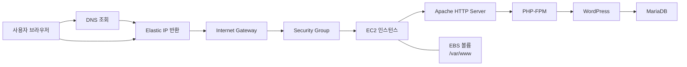
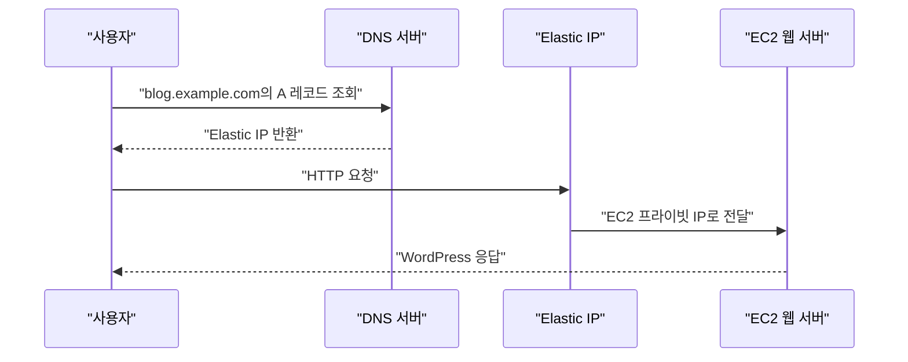

# AWS와 웹서버 연결하기

# AWS와 웹서버 연결하기

* toc
{:toc}

---

## AWS EIP 생성 및 EC2 연결하기

### Elastic IP가 필요한 이유

EC2 인스턴스를 생성할 때 자동 할당된 퍼블릭 IPv4 주소는 인스턴스를 중지한 후 다시 시작하면 변경될 수 있다. DNS 레코드나 WordPress의 사이트 주소가 변경 전 IP를 가리키고 있다면 웹사이트에 접속할 수 없게 된다.

Elastic IP는 AWS 계정에 할당되는 고정 퍼블릭 IPv4 주소다. EC2 인스턴스나 네트워크 인터페이스에 연결할 수 있으며, 인스턴스를 중지했다가 시작하더라도 연결을 유지하는 동안 주소가 바뀌지 않는다.



### Elastic IP 할당

AWS Management Console에서 다음 순서로 진행한다.

1. EC2 서비스로 이동한다.
2. 왼쪽 메뉴에서 `네트워크 및 보안`의 `탄력적 IP 주소`를 선택한다.
3. `탄력적 IP 주소 할당`을 선택한다.
4. Network Border Group이 EC2 인스턴스와 호환되는지 확인한다.
5. 퍼블릭 IPv4 주소 풀은 일반적인 실습이라면 `Amazon의 IPv4 주소 풀`을 선택한다.
6. 용도를 식별할 수 있도록 `Name=wordpress-eip` 같은 태그를 추가한다.
7. `할당`을 선택한다.

Elastic IP는 연결 대상 리소스와 동일한 Network Border Group에서 할당해야 한다. 서울 리전의 일반 Availability Zone에서 실행되는 EC2라면 일반적으로 `ap-northeast-2`를 사용한다.

### EC2 인스턴스와 연결

할당된 Elastic IP를 선택하고 다음 순서로 연결한다.

1. `작업`에서 `탄력적 IP 주소 연결`을 선택한다.
2. 리소스 유형으로 `인스턴스`를 선택한다.
3. WordPress를 설치할 EC2 인스턴스를 선택한다.
4. 인스턴스의 기본 프라이빗 IP 주소를 선택한다.
5. `연결`을 선택한다.

연결이 완료되면 EC2 인스턴스의 프라이빗 IP는 유지되고, 외부에서 사용하는 퍼블릭 IPv4 주소가 Elastic IP로 매핑된다. 기존 퍼블릭 IP로 연결 중이던 SSH 세션은 끊어질 수 있으므로 이후에는 Elastic IP로 다시 접속해야 한다.

```shell
ssh -i wordpress-key.pem ec2-user@203.0.113.10
```

인스턴스에서 외부에 노출된 IPv4 주소를 확인할 수도 있다.

```shell
curl -4 https://checkip.amazonaws.com
```

### 네트워크 조건 확인

Elastic IP만 연결한다고 웹 서버에 접속할 수 있는 것은 아니다. 다음 조건도 충족해야 한다.

| 항목 | 확인 내용 |
|---|---|
| Subnet | Internet Gateway로 향하는 기본 경로가 있는 Public Subnet |
| Route Table | `0.0.0.0/0`이 Internet Gateway를 가리키는지 확인 |
| Security Group | HTTP `80`, HTTPS `443`, 관리용 SSH `22` 허용 |
| SSH 접근 범위 | `0.0.0.0/0` 대신 관리자 공인 IP의 `/32` 사용 권장 |
| Network ACL | 요청과 응답 트래픽을 차단하지 않는지 확인 |

MariaDB를 EC2 내부에서만 사용할 경우 `3306` 포트를 외부에 공개하지 않는다.

### Elastic IP 과금 주의사항

현재 AWS는 연결 여부와 관계없이 퍼블릭 IPv4 주소에 시간 단위 요금을 부과한다. 과거의 “실행 중인 인스턴스에 연결된 Elastic IP 한 개는 무료”라는 기준을 그대로 적용해서는 안 된다. 실습 크레딧이나 Free Tier 혜택이 있더라도 실제 적용 여부는 Billing에서 확인해야 한다. 자세한 동작과 과금 조건은 [AWS Elastic IP 공식 문서](https://docs.aws.amazon.com/AWSEC2/latest/UserGuide/working-with-eips.html)에서 확인할 수 있다.

실습을 종료할 때는 다음 순서로 정리한다.

1. DNS 레코드에서 Elastic IP를 제거한다.
2. Elastic IP와 EC2의 연결을 해제한다.
3. 더 이상 사용하지 않는 Elastic IP를 릴리스한다.

릴리스한 주소는 다른 AWS 계정에 할당될 수 있으므로 복구할 수 있다고 가정해서는 안 된다.

## Gabia에서 도메인 구매 후 EIP와 연결하기

### 도메인과 DNS의 역할

사용자가 웹사이트에 접속할 때 매번 Elastic IP를 입력하는 것은 불편하다. DNS는 `blog.example.com`과 같은 도메인 이름을 Elastic IP로 변환한다.



### 도메인 구매 시 확인할 사항

Gabia에서 사용할 도메인을 검색한 뒤 구매한다. 구매 과정에서는 다음 항목을 확인한다.

- 최초 등록 비용과 다음 해 갱신 비용
- 자동 갱신 설정 여부
- 등록자 연락처 정보
- WHOIS 개인정보 보호 제공 여부
- 실제 사용 중인 권한 있는 Name Server

Gabia에서 DNS 레코드를 관리하려면 해당 도메인이 Gabia의 Name Server를 사용해야 한다. 다른 DNS 사업자의 Name Server를 사용 중이라면 레코드도 그 사업자의 DNS 관리 화면에서 추가해야 한다.

### A 레코드 등록

Gabia DNS 관리 화면에서 도메인의 DNS 설정 또는 레코드 수정 메뉴로 이동한 뒤 다음 레코드를 추가한다.

| 항목 | 설정 예시 | 설명 |
|---|---|---|
| 타입 | `A` | 도메인을 IPv4 주소와 연결 |
| 호스트 | `blog` | `blog.example.com`을 구성 |
| 값 | `203.0.113.10` | EC2에 연결한 Elastic IP |
| TTL | `600` | DNS 캐시 유지 시간 600초 |

루트 도메인인 `example.com`을 직접 연결하려면 관리 화면의 규칙에 따라 호스트에 `@`를 입력하거나 빈 값으로 둔다.

A 레코드의 값에는 `http://`, 포트 번호, `/wordpress` 같은 경로를 입력하지 않는다. A 레코드는 오직 IPv4 주소만 저장한다.

필요하다면 `www.example.com`도 별도로 구성할 수 있다.

| 타입 | 호스트 | 값 |
|---|---|---|
| `A` | `blog` | Elastic IP |
| `CNAME` | `www` | `blog.example.com` |

### DNS 적용 확인

DNS는 캐시 때문에 변경 사항이 즉시 반영되지 않을 수 있다. Windows PowerShell에서는 다음과 같이 확인한다.

```powershell
Resolve-DnsName -Type A blog.example.com
```

운영체제에 관계없이 `nslookup`도 사용할 수 있다.

```shell
nslookup blog.example.com
```

Linux나 macOS에서는 다음 명령을 사용할 수 있다.

```shell
dig +short blog.example.com
```

출력된 주소가 Elastic IP와 같다면 DNS 연결은 정상이다. 웹 서버까지 확인하려면 다음 명령을 실행한다.

```shell
curl -I http://blog.example.com
```

`ping`은 DNS 변환 여부를 간단히 확인할 수 있지만, ICMP가 차단된 환경에서는 서버가 정상이어도 실패할 수 있다. 따라서 DNS는 `dig`나 `nslookup`, HTTP는 `curl`로 구분해서 확인하는 것이 정확하다.

### DNS 연결 시 주의사항

DNS는 도메인을 IP로 변환할 뿐 다음 설정을 대신하지 않는다.

- Security Group의 HTTP 및 HTTPS 허용
- Apache 실행
- WordPress 설치
- TLS 인증서 발급
- EC2 및 EBS 장애 복구
- 웹 서버 보안 설정

WordPress는 설치할 때 접속 주소를 데이터베이스에 저장한다. 가능하면 Elastic IP와 도메인 연결을 먼저 완료한 다음 최종 도메인으로 설치를 진행하는 것이 좋다.

## Glossary of Terms

| 용어 | 설명 |
|---|---|
| EC2 | AWS에서 가상 서버 인스턴스를 생성하고 운영하는 컴퓨팅 서비스 |
| AMI | EC2 운영체제와 초기 소프트웨어 구성을 담은 인스턴스 이미지 |
| EIP | EC2 등에 연결할 수 있는 고정 퍼블릭 IPv4 주소 |
| EBS | EC2에 블록 디바이스 형태로 연결하는 영구 볼륨 스토리지 |
| VPC | AWS 리소스를 배치하는 논리적으로 격리된 가상 네트워크 |
| Subnet | VPC의 IP 주소 범위를 더 작은 네트워크 단위로 나눈 영역 |
| Internet Gateway | VPC와 인터넷 간 통신을 제공하는 게이트웨이 |
| Security Group | EC2 네트워크 인터페이스에 적용되는 상태 기반 가상 방화벽 |
| Firewall | 정의된 규칙에 따라 네트워크 접근을 허용하거나 차단하는 보안 시스템 |
| iptables | Linux 커널의 Netfilter 기능을 설정하던 전통적인 방화벽 도구. 최신 환경에서는 nftables가 사용되기도 함 |
| DNS | 도메인 이름을 IP 주소 등으로 변환하는 분산 이름 시스템 |
| A Record | 호스트 이름을 IPv4 주소에 연결하는 DNS 레코드 |
| CNAME Record | 한 호스트 이름을 다른 호스트 이름의 별칭으로 연결하는 DNS 레코드 |
| TTL | DNS 응답을 캐시에 유지할 수 있는 시간 |
| IAM | AWS 사용자, 역할, 정책을 이용해 인증과 권한을 관리하는 서비스 |
| MFA | 비밀번호 외에 OTP나 보안 키 같은 추가 인증 수단을 사용하는 다중 인증 |
| RDS | MySQL, MariaDB, PostgreSQL 등 여러 데이터베이스 엔진을 관리형으로 제공하는 서비스 |
| Apache HTTP Server | 정적 파일과 동적 웹 요청을 처리하는 오픈 소스 웹 서버 |
| PHP-FPM | PHP 요청을 별도 프로세스 풀에서 실행하고 관리하는 FastCGI 구현 |
| MySQL | 널리 사용되는 관계형 데이터베이스 관리 시스템 |
| MariaDB | MySQL에서 파생된 별도의 오픈 소스 관계형 데이터베이스 |
| APM | 이 글에서는 Apache, PHP, MySQL 또는 MariaDB 구성을 의미하며, 성능 모니터링을 뜻하는 Application Performance Monitoring과 구분해야 함 |
| LAMP | Linux, Apache, MySQL 또는 MariaDB, PHP로 구성되는 웹 애플리케이션 실행 환경 |
| SSH | 원격 서버에 암호화된 방식으로 접속하기 위한 프로토콜 |
| WordPress | PHP와 관계형 데이터베이스를 기반으로 동작하는 오픈 소스 콘텐츠 관리 시스템 |

## Amazon Linux 패키지 관리자를 통한 APM 설치, 테스트 페이지 확인

### 실습 목표와 사전 조건

Amazon Linux 2023에 Apache, PHP-FPM, MariaDB를 설치해 WordPress가 동작할 수 있는 LAMP 환경을 구성한다.

다음 조건이 준비되어 있어야 한다.

- Amazon Linux 2023 기반 EC2 인스턴스
- EC2에 연결된 Elastic IP
- EC2로 연결되는 도메인의 A 레코드
- SSH `22`, HTTP `80`이 허용된 Security Group
- HTTPS 적용 시 HTTPS `443` 허용
- `/var/www`에 연결된 EBS를 사용한다면 정상적인 마운트 확인

```shell
cat /etc/system-release
findmnt /var/www
```

`/var/www`를 EBS에 마운트했다면 마운트 이후 `/var/www/html` 디렉터리가 존재하는지 확인한다.

```shell
sudo mkdir -p /var/www/html
```

### 패키지 업데이트와 설치

Amazon Linux 2023은 `dnf`를 기본 패키지 관리자로 사용한다. 오래된 Amazon Linux 2의 `amazon-linux-extras` 명령은 사용하지 않는다.

WordPress는 현재 PHP 8.3 이상과 MariaDB 10.11 이상 또는 MySQL 8.0 이상을 권장한다. [WordPress 공식 요구사항](https://wordpress.org/about/requirements/)에 맞춰 다음과 같이 설치한다.

```shell
sudo dnf upgrade -y

sudo dnf install -y \
  httpd \
  curl \
  wget \
  tar \
  rsync \
  php8.3 \
  php8.3-cli \
  php8.3-fpm \
  php8.3-mysqlnd \
  php8.3-gd \
  php8.3-mbstring \
  php8.3-xml \
  php8.3-intl \
  php8.3-opcache \
  php8.3-zip \
  mariadb1011-server
```

Amazon Linux 2023 저장소는 릴리스 버전에 따라 제공 패키지가 달라질 수 있다. 설치 전에 다음 명령으로 사용 가능한 버전을 확인할 수 있다.

```shell
sudo dnf list available 'php8.3*' 'mariadb1011*'
```

AWS에서도 AL2023에 Apache, PHP-FPM, MariaDB를 설치하는 [LAMP 구성 절차](https://docs.aws.amazon.com/linux/al2023/ug/ec2-lamp-amazon-linux-2023.html)를 제공한다.

### 서비스 실행 및 자동 시작 설정

```shell
sudo systemctl enable --now httpd
sudo systemctl enable --now php-fpm
sudo systemctl enable --now mariadb
```

서비스 상태를 확인한다.

```shell
sudo systemctl is-active httpd
sudo systemctl is-active php-fpm
sudo systemctl is-active mariadb
```

세 명령이 모두 `active`를 출력해야 한다.

설치된 버전도 확인한다.

```shell
httpd -v
php -v
sudo mariadb -e "SELECT VERSION();"
```

### Security Group 설정

EC2의 Security Group 인바운드 규칙에 다음 항목을 설정한다.

| 유형 | 포트 | 소스 | 용도 |
|---|---:|---|---|
| SSH | `22` | 관리자 공인 IP `/32` | 서버 관리 |
| HTTP | `80` | `0.0.0.0/0` | 웹사이트 접속 |
| HTTPS | `443` | `0.0.0.0/0` | TLS 적용 후 보안 접속 |

IPv6를 실제로 사용한다면 HTTP와 HTTPS에 `::/0` 규칙도 별도로 추가한다. MariaDB를 로컬에서만 사용하므로 `3306`은 열지 않는다.

### Apache 테스트

기본 문서를 생성한다.

```shell
echo '<h1>Apache HTTP Server OK</h1>' | sudo tee /var/www/html/index.html
```

로컬에서 먼저 확인한다.

```shell
curl http://127.0.0.1/
```

이후 브라우저에서 다음 주소로 접속한다.

```text
http://blog.example.com
```

`Apache HTTP Server OK`가 표시된다면 DNS, Elastic IP, Security Group, Apache까지의 요청 경로가 정상적으로 구성된 것이다.

## 파일에 대한 소유권 변경 및 PHP 연동 확인

### Apache 실행 사용자와 파일 권한

Amazon Linux의 Apache 프로세스는 일반적으로 `apache` 사용자로 실행된다. 배포 작업은 `ec2-user`가 수행하고 Apache가 파일을 읽을 수 있도록 그룹을 구성한다.

```shell
sudo usermod -aG apache ec2-user
sudo chown -R ec2-user:apache /var/www
sudo find /var/www -type d -exec chmod 2750 {} \;
sudo find /var/www -type f -exec chmod 0640 {} \;
```

`2750`의 앞자리 `2`는 Setgid 비트를 의미한다. 해당 디렉터리에 생성되는 파일과 하위 디렉터리가 부모 디렉터리의 그룹을 상속하도록 돕는다.

그룹 변경은 기존 로그인 세션에 즉시 반영되지 않을 수 있다. SSH를 다시 연결하거나 다음 명령을 실행한다.

```shell
newgrp apache
groups
```

### PHP 연동 테스트

PHP-FPM이 Apache와 정상적으로 연동되는지 확인하기 위해 임시 테스트 파일을 생성한다.

```shell
sudo tee /var/www/html/phpinfo.php > /dev/null <<'PHP'
<?php
phpinfo();
PHP
```

다음 주소로 접속한다.

```text
http://blog.example.com/phpinfo.php
```

PHP 버전과 `mysqli`, `mysqlnd`, `gd`, `mbstring` 등의 모듈이 표시되는지 확인한다.

`phpinfo()`는 서버 경로, PHP 모듈, 환경 설정 등 공격에 활용될 수 있는 정보를 노출한다. 확인이 끝나면 즉시 삭제해야 한다.

```shell
sudo rm -f /var/www/html/phpinfo.php
```

### EBS와 SELinux 주의사항

새 EBS 파일시스템을 `/var/www`에 마운트하면 기존 SELinux 컨텍스트가 적용되지 않아 Apache에서 `403 Forbidden`이 발생할 수 있다. SELinux가 `Enforcing`이라면 컨텍스트를 명시적으로 설정한다.

```shell
getenforce

sudo dnf install -y policycoreutils-python-utils
sudo semanage fcontext -a -t httpd_sys_content_t "/var/www(/.*)?" \
  || sudo semanage fcontext -m -t httpd_sys_content_t "/var/www(/.*)?"
sudo restorecon -Rv /var/www
```

SELinux를 끄는 방식으로 문제를 숨기지 말고 필요한 경로에 정확한 컨텍스트를 적용하는 것이 좋다.

## MySQL 기본설정 및 WordPress를 설치하기 위한 계정 및 데이터베이스 생성

### MariaDB 보안 초기화

MariaDB가 실행 중인지 확인한다.

```shell
sudo systemctl status mariadb
```

기본 보안 설정을 실행한다.

```shell
sudo mariadb-secure-installation
```

버전에 따라 질문 내용은 달라질 수 있지만 일반적으로 다음 항목을 설정한다.

- 관리자 인증 방식 또는 관리자 비밀번호
- 익명 사용자 제거
- 원격 관리자 로그인 차단
- 테스트 데이터베이스 제거
- 권한 테이블 다시 불러오기

화면을 확인하지 않고 모든 질문에 무조건 `Y`를 입력하는 방식은 피해야 한다.

### WordPress 전용 데이터베이스와 사용자 생성

관리자 계정으로 MariaDB에 접속한다.

```shell
sudo mariadb
```

WordPress 전용 데이터베이스와 사용자를 생성한다.

```sql
CREATE DATABASE wordpress
    CHARACTER SET utf8mb4
    COLLATE utf8mb4_unicode_ci;

CREATE USER 'wordpress_app'@'localhost'
    IDENTIFIED BY 'CHANGE_ME_STRONG_PASSWORD';

GRANT ALL PRIVILEGES ON wordpress.* TO 'wordpress_app'@'localhost';

FLUSH PRIVILEGES;

SHOW GRANTS FOR 'wordpress_app'@'localhost';
SHOW DATABASES;
```

작업이 끝나면 종료한다.

```sql
EXIT;
```

`wordpress_app` 사용자에게는 `wordpress` 데이터베이스에 대한 권한만 부여했다. `*.*`에 대한 전역 권한이나 관리자 권한을 부여해서는 안 된다.

접속을 테스트한다. 비밀번호는 명령행에 직접 적지 않고 프롬프트에서 입력한다.

```shell
mariadb -u wordpress_app -p wordpress -e "SELECT 1;"
```

정상이라면 `1`이 출력된다.

### 데이터베이스 연결 실패 시 확인 항목

`Error establishing a database connection` 오류가 발생하면 다음 항목을 확인한다.

```shell
sudo systemctl status mariadb
sudo ss -lntp | grep 3306
mariadb -u wordpress_app -p wordpress
```

주요 원인은 다음과 같다.

- MariaDB 서비스가 실행되지 않음
- 데이터베이스 이름 오타
- 사용자명 또는 비밀번호 불일치
- 사용자의 호스트가 `localhost`와 다르게 생성됨
- `wp-config.php`의 `DB_HOST` 설정 오류
- WordPress용 PHP MySQL 확장 모듈 누락

## WordPress 다운로드 및 파일 권한, 설치 파일 수정, WordPress 설치 및 관리자 계정 접속 확인

### WordPress 다운로드

이전 방식처럼 특정한 오래된 버전의 ZIP 파일을 고정해서 설치하면 보안 패치를 적용받지 못한다. 공식 최신 배포 파일을 내려받는다.

```shell
cd /tmp
curl -LO https://wordpress.org/latest.tar.gz
tar -xzf latest.tar.gz
```

압축이 정상적으로 풀렸는지 확인한다.

```shell
ls -la /tmp/wordpress
```

### Apache DocumentRoot로 복사

설치 화면이 외부에 노출된 상태에서 방치되지 않도록 파일을 배치하는 동안 Apache를 잠시 중지한다.

```shell
sudo systemctl stop httpd
sudo rm -f /var/www/html/index.html
sudo rsync -a /tmp/wordpress/ /var/www/html/
```

`wordpress` 디렉터리 자체가 아니라 그 안의 파일을 `/var/www/html`로 복사했기 때문에 WordPress는 `blog.example.com`의 루트 경로에서 실행된다.

### wp-config.php 생성

```shell
cd /var/www/html
sudo cp wp-config-sample.php wp-config.php
sudo vi wp-config.php
```

다음 항목을 앞서 생성한 데이터베이스 정보로 변경한다.

```php
define('DB_NAME', 'wordpress');
define('DB_USER', 'wordpress_app');
define('DB_PASSWORD', 'CHANGE_ME_STRONG_PASSWORD');
define('DB_HOST', 'localhost');
define('DB_CHARSET', 'utf8mb4');
define('DB_COLLATE', '');
```

`DB_PASSWORD`는 MariaDB에서 `wordpress_app` 사용자를 생성할 때 지정한 비밀번호와 정확히 같아야 한다.

인증 키와 Salt는 다음 주소에서 무작위 값을 생성한 뒤 `wp-config.php`의 기본값을 교체한다.

```shell
curl -fsSL https://api.wordpress.org/secret-key/1.1/salt/
```

`wp-config.php`에는 데이터베이스 비밀번호가 평문으로 들어갈 수밖에 없으므로 접근 권한을 엄격하게 설정해야 한다. 자세한 필드 의미는 [WordPress wp-config.php 공식 문서](https://developer.wordpress.org/advanced-administration/wordpress/wp-config/)에서 확인할 수 있다.

### WordPress 파일 권한 설정

WordPress 코어 파일은 배포 사용자만 수정하고, Apache는 읽기만 가능하도록 설정한다.

```shell
sudo chown -R ec2-user:apache /var/www/html
sudo find /var/www/html -type d -exec chmod 2750 {} \;
sudo find /var/www/html -type f -exec chmod 0640 {} \;
sudo chmod 0640 /var/www/html/wp-config.php
```

관리자 화면에서 테마, 플러그인, 미디어 파일을 관리하려면 `wp-content`에만 Apache 쓰기 권한을 부여한다.

```shell
sudo chown -R apache:apache /var/www/html/wp-content
sudo find /var/www/html/wp-content -type d -exec chmod 2750 {} \;
sudo find /var/www/html/wp-content -type f -exec chmod 0640 {} \;
```

모든 파일을 `777`로 변경하는 것은 권한 문제를 해결하는 방법이 아니다. 웹 서버가 탈취되었을 때 공격자가 전체 WordPress 코드를 변조할 수 있게 된다.

과거 예제에서 자주 사용되던 다음 설정도 무조건 추가하지 않는다.

```php
define('FS_METHOD', 'direct');
```

이 설정은 WordPress가 파일시스템에 직접 쓰도록 강제한다. 권한 오류를 숨기기 위해 사용하는 대신, 실제로 쓰기가 필요한 `wp-content` 경로의 소유권과 권한을 정확히 설정해야 한다.

### SELinux 쓰기 컨텍스트 설정

SELinux가 `Enforcing`인 환경에서는 `wp-content`에 쓰기 가능한 컨텍스트를 적용한다.

```shell
sudo semanage fcontext -a -t httpd_sys_rw_content_t \
  "/var/www/html/wp-content(/.*)?" \
  || sudo semanage fcontext -m -t httpd_sys_rw_content_t \
  "/var/www/html/wp-content(/.*)?"

sudo restorecon -Rv /var/www/html/wp-content
```

### 고유 주소 설정

WordPress의 고유 주소 기능은 Apache의 `.htaccess`와 `mod_rewrite`를 사용한다. 별도의 Apache 설정 파일을 만든다.

```shell
sudo tee /etc/httpd/conf.d/wordpress.conf > /dev/null <<'APACHE'
<Directory "/var/www/html">
    Options FollowSymLinks
    AllowOverride All
    Require all granted
</Directory>
APACHE
```

문법을 검사한다.

```shell
sudo apachectl configtest
```

`Syntax OK`가 출력되면 서비스를 시작한다.

```shell
sudo systemctl restart php-fpm
sudo systemctl start httpd
```

### WordPress 설치 화면 접속

브라우저에서 최종 도메인으로 접속한다.

```text
http://blog.example.com
```

설치 화면에서 다음 정보를 입력한다.

- 사이트 제목
- 관리자 사용자명
- 강력한 관리자 비밀번호
- 관리자 이메일
- 검색 엔진 노출 여부

관리자 사용자명으로 `admin`, `administrator`, 도메인명처럼 추측하기 쉬운 값을 사용하지 않는다.

설치가 완료되면 다음 주소에서 관리자 화면에 접속한다.

```text
http://blog.example.com/wp-admin
```

다만 HTTP는 로그인 정보가 암호화되지 않는다. 인터넷에 공개하거나 실제 관리 작업을 수행하기 전에는 반드시 TLS 인증서를 적용해 HTTPS로 전환해야 한다.

### 정상 동작 확인

```shell
curl -I http://127.0.0.1/
curl -I http://blog.example.com/
sudo systemctl is-active httpd php-fpm mariadb
```

정상이라면 다음 결과를 확인할 수 있다.

- 도메인이 Elastic IP를 반환한다.
- HTTP 요청에 `200`, `301` 또는 `302` 상태 코드가 반환된다.
- WordPress 메인 화면이 표시된다.
- `/wp-admin`에서 로그인할 수 있다.
- 게시글 작성과 이미지 업로드가 정상적으로 처리된다.
- `/var/www/html/wp-content/uploads`에 업로드 파일이 생성된다.

### 주요 장애와 원인

| 현상 | 주요 원인 | 확인 방법 |
|---|---|---|
| 사이트 접속 시간 초과 | Security Group, Route Table, Apache 중지 | `systemctl status httpd`, Security Group 확인 |
| 이전 IP로 접속됨 | DNS 캐시 또는 잘못된 A 레코드 | `Resolve-DnsName`, `dig` |
| `403 Forbidden` | 파일 권한 또는 SELinux 컨텍스트 | `namei -l`, `restorecon`, 감사 로그 확인 |
| PHP 코드가 그대로 표시됨 | PHP-FPM 미실행 또는 Apache 연동 실패 | `systemctl status php-fpm` |
| 데이터베이스 연결 오류 | DB 정보 불일치 또는 MariaDB 중지 | `mariadb -u wordpress_app -p wordpress` |
| 메인 화면 대신 테스트 페이지 표시 | `/var/www/html/index.html`이 남아 있음 | 테스트 파일 삭제 |
| 테마 설치 시 FTP 정보 요구 | `wp-content` 쓰기 권한 부족 | 소유권과 SELinux 컨텍스트 확인 |
| 이미지 편집 실패 | PHP GD 확장 누락 | `php -m | grep -i gd` |
| 고유 주소에서 404 발생 | `AllowOverride` 또는 `mod_rewrite` 설정 누락 | Apache 설정 검사 |

## Theme 변경 후 변경 사항 확인 및 강의 마무리

### 테마 설치와 활성화

WordPress 관리자 화면에서 다음 순서로 이동한다.

1. `외모`에서 `테마`를 선택한다.
2. `새 테마 추가`를 선택한다.
3. 신뢰할 수 있는 공식 저장소의 테마를 검색한다.
4. 미리보기로 레이아웃을 확인한다.
5. `설치`를 선택한다.
6. 설치가 끝나면 `활성화`를 선택한다.

테마 활성화 후 메인 화면을 새로고침하면 디자인이 변경된다. 게시글과 페이지 데이터가 삭제되는 것은 아니지만 메뉴 위치, 위젯, 로고, 사이드바 및 사용자 정의 설정은 테마마다 다르게 동작할 수 있다.

### 변경 후 확인 항목

- PC와 모바일 화면에서 레이아웃이 깨지지 않는지 확인
- 메뉴와 카테고리 링크 확인
- 게시글 목록과 상세 화면 확인
- 관리자 로그인 및 로그아웃 확인
- 이미지 업로드와 대표 이미지 확인
- 댓글 기능과 검색 기능 확인
- 고유 주소 변경 후 게시글 404 여부 확인
- 브라우저 개발자 도구에서 리소스 로딩 오류 확인
- 외부에서 접근 가능한 `phpinfo.php`가 삭제되었는지 확인

### 변경 전 백업

테마나 플러그인을 변경하기 전에는 데이터베이스와 `wp-content`를 백업한다.

```shell
mariadb-dump -u wordpress_app -p wordpress \
  > "$HOME/wordpress-$(date +%F).sql"

tar -czf "$HOME/wp-content-$(date +%F).tar.gz" \
  -C /var/www/html wp-content
```

EBS Snapshot이나 AMI를 함께 생성하면 파일시스템 전체를 복구하는 데 도움이 된다. 다만 파일 백업, 데이터베이스 백업, EBS Snapshot은 목적과 복구 범위가 서로 다르므로 하나만으로 모든 장애에 대비했다고 판단해서는 안 된다.

### 운영 전 추가해야 할 항목

이번 구성은 한 대의 EC2에서 WordPress와 MariaDB를 실행하는 입문용 구조다. 실제 운영에서는 다음 항목을 추가로 고려해야 한다.

- HTTPS 인증서와 HTTP에서 HTTPS로의 리다이렉트
- 정기적인 WordPress, 테마, 플러그인 업데이트
- 관리자 계정 MFA 또는 추가 로그인 보호
- 자동화된 데이터베이스 및 파일 백업
- CloudWatch 기반 CPU, 디스크, 네트워크 모니터링
- Apache와 PHP-FPM 로그 수집
- 최소 권한 IAM 정책
- 불필요한 테마와 플러그인 제거
- RDS를 이용한 데이터베이스 분리
- Application Load Balancer와 Auto Scaling
- CloudFront를 이용한 정적 콘텐츠 캐싱
- Route 53 상태 확인과 장애 조치
- AWS WAF를 이용한 웹 공격 방어

### 실습 자원 정리

실습을 종료한다면 과금이 지속되지 않도록 다음 자원을 확인한다.

- EC2 인스턴스 종료 여부
- EBS 볼륨의 삭제 또는 보존 여부
- EBS Snapshot 보관 비용
- Elastic IP 연결 해제 및 릴리스
- 불필요한 AMI와 Snapshot 삭제
- 도메인 자동 갱신 여부
- DNS 레코드 제거
- Billing과 Cost Explorer의 예상 비용

### 정리

Elastic IP를 EC2에 연결하면 인스턴스의 고정된 외부 접속 주소를 확보할 수 있고, Gabia DNS에 A 레코드를 등록하면 사용자는 도메인을 통해 서버에 접속할 수 있다.

Amazon Linux 2023에서는 `dnf`를 이용해 Apache, PHP-FPM, MariaDB를 설치한다. WordPress 전용 데이터베이스와 사용자를 생성하고, `/var/www/html`에 WordPress 파일을 배치한 뒤 파일 권한과 SELinux 컨텍스트를 조정하면 웹 설치를 진행할 수 있다.

이 과정에서 가장 중요한 점은 단순히 화면이 열리는 것에 그치지 않고 다음 경계를 정확히 이해하는 것이다.

- DNS는 도메인을 IP로 변환하지만 네트워크 접근을 허용하지 않는다.
- Elastic IP는 주소를 고정하지만 서버 장애를 복구하지 않는다.
- Security Group은 네트워크 접근을 제어하지만 운영체제와 애플리케이션 보안을 대신하지 않는다.
- 파일 권한을 넓게 설정하는 것은 정상적인 문제 해결 방법이 아니다.
- WordPress 데이터는 파일과 데이터베이스에 나뉘므로 두 영역을 모두 백업해야 한다.
- HTTP 기반 실습을 실제 서비스로 전환하려면 HTTPS와 지속적인 보안 업데이트가 반드시 필요하다.
