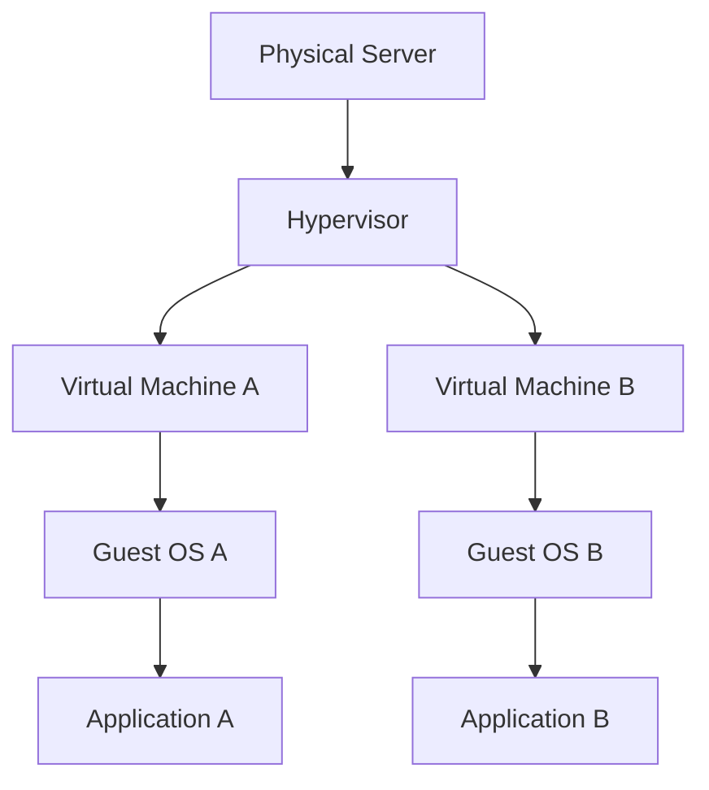
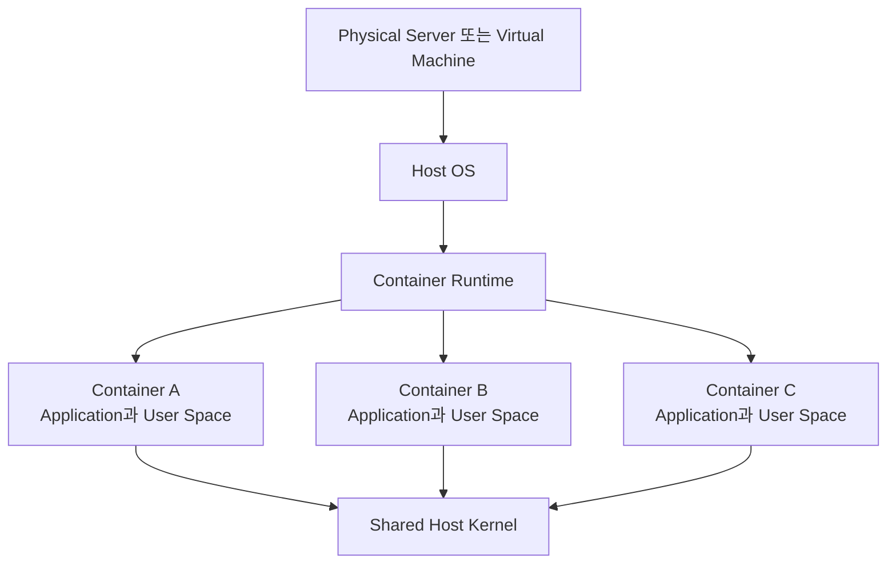
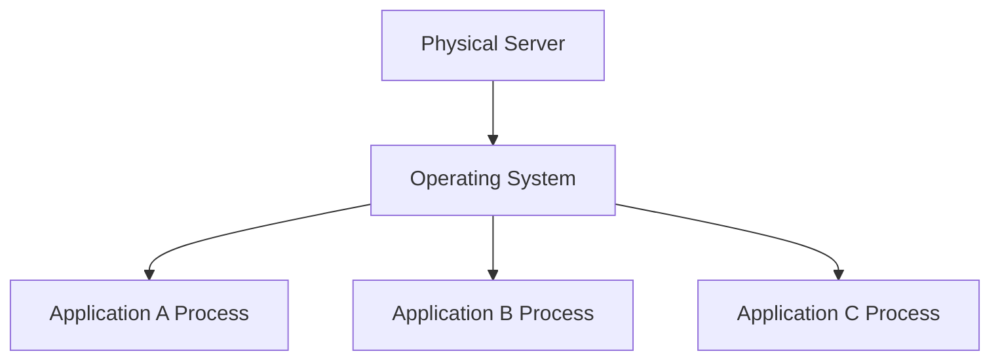
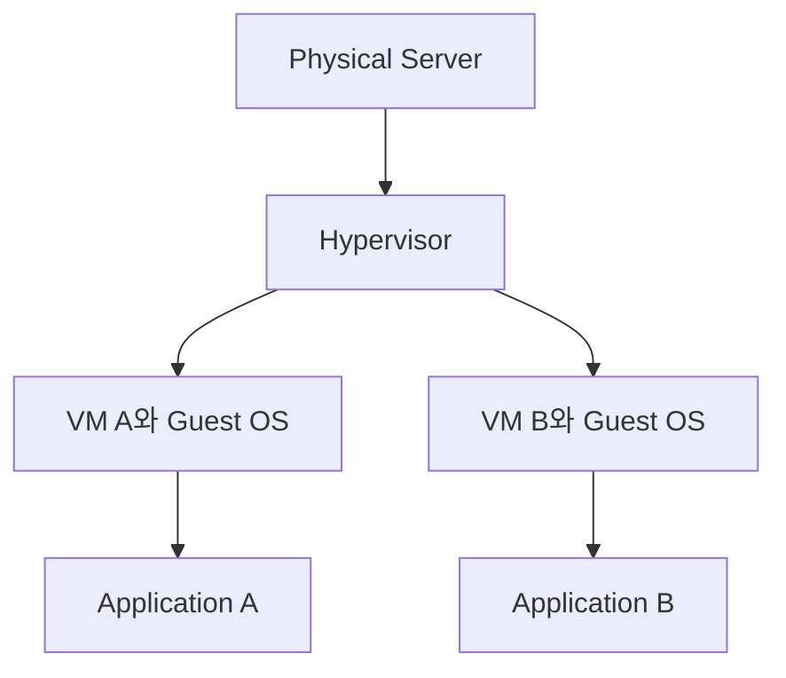
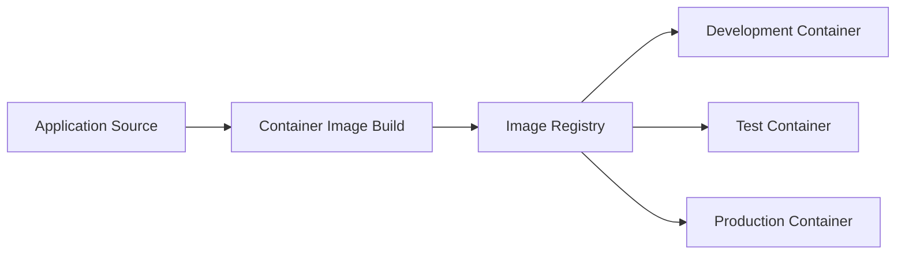
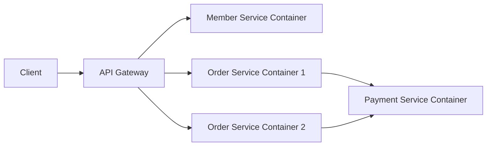
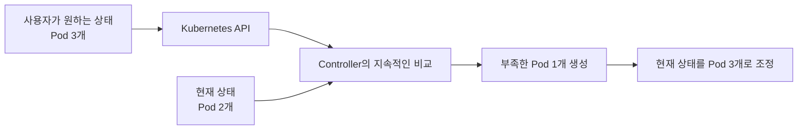
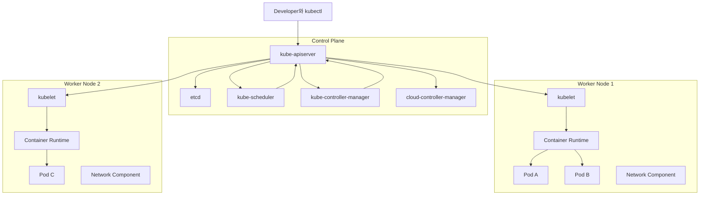
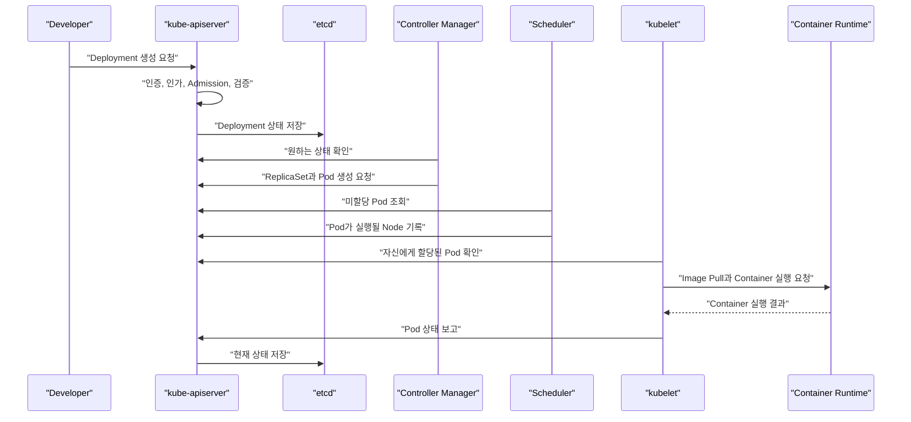
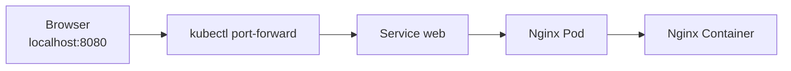

# 쿠버네티스(Kubernetes) 개요

# 쿠버네티스(Kubernetes) 개요

* toc
{:toc}

---

## Container와 Application 개발

### Container와 애플리케이션 개발

애플리케이션을 서버에 배포하는 방식은 물리 서버에 프로세스를 직접 실행하는 전통적인 방식에서 Virtual Machine을 활용하는 방식으로, 다시 Container 중심의 방식으로 발전해 왔다.

Container는 애플리케이션을 빠르고 일관되게 실행할 수 있게 해주지만, 여러 Container를 운영 환경에서 안정적으로 관리하려면 네트워크, 저장소, 장애 복구, 스케일링 등을 함께 해결해야 한다. 이러한 문제를 담당하는 대표적인 Container Orchestration 플랫폼이 Kubernetes다.

#### Virtual Machine

Virtual Machine은 물리적인 하드웨어를 소프트웨어로 추상화하는 하드웨어 수준의 가상화 기술이다.

Hypervisor가 물리 서버의 CPU, Memory, Disk, Network Interface 같은 자원을 가상화하고, 각 Virtual Machine에 독립적인 가상 하드웨어를 제공한다. Virtual Machine마다 별도의 Guest OS를 설치하므로 서로 다른 운영체제와 애플리케이션 환경을 격리해서 사용할 수 있다.

예를 들어 macOS에서 가상의 CPU와 Memory를 할당해 Windows 또는 Linux를 실행하거나, 클라우드에서 EC2 같은 Virtual Machine을 생성해 Linux 서버를 운영하는 방식이 이에 해당한다.



Virtual Machine을 생성할 때는 일반적으로 다음 하드웨어 사양을 먼저 결정한다.

- CPU 또는 vCPU 개수
- Memory 용량
- Disk 종류와 크기
- GPU 사용 여부
- Network 성능
- Guest OS 종류

각 Virtual Machine은 독립된 운영체제 Kernel을 사용한다. 격리 수준이 높고 서로 다른 운영체제를 실행할 수 있다는 장점이 있지만, Guest OS가 차지하는 CPU, Memory, Disk와 부팅 시간이 추가로 필요하다.

Apple Silicon 기반 Mac처럼 호스트와 Guest OS의 CPU 아키텍처가 다르면 실행 가능한 운영체제와 성능에도 제약이 생길 수 있다.

#### Container

Container는 하드웨어 전체를 가상화하지 않는다. 호스트 운영체제의 Kernel을 공유하면서 프로세스, 파일시스템, 네트워크, 사용자 공간 등을 논리적으로 격리한다.

Linux Container는 주로 다음 Kernel 기능을 이용한다.

| 기능 | 역할 |
|---|---|
| Namespace | 프로세스, Network, Mount, 사용자 등의 실행 공간 격리 |
| cgroup | CPU와 Memory 같은 자원의 사용량 제한 및 측정 |
| Capability | Root 권한을 세부적인 권한 단위로 분리 |
| seccomp | Container가 호출할 수 있는 System Call 제한 |
| Union File System | Image Layer를 결합해 Container 파일시스템 구성 |



Container 내부의 애플리케이션은 자신만의 프로세스 목록, 네트워크 인터페이스, 파일시스템이 있는 것처럼 동작한다. 이러한 특성 때문에 Container를 운영체제 수준의 가상화라고 표현한다.

다만 Container마다 완전한 운영체제가 생성되는 것은 아니다. Container에는 애플리케이션 실행에 필요한 라이브러리와 User Space 파일이 포함되지만 Kernel은 호스트와 공유한다.

또한 Container 간 격리가 존재한다고 해서 보안 경계가 항상 완벽한 것은 아니다. 취약한 Kernel, 과도한 Capability, Privileged Container, 잘못된 Volume Mount는 호스트와 다른 Container에 영향을 줄 수 있다.

#### Virtual Machine과 Container 비교

| 구분 | Virtual Machine | Container |
|---|---|---|
| 가상화 대상 | 물리 하드웨어 | 운영체제의 실행 공간 |
| 운영체제 | VM마다 Guest OS 필요 | 호스트 Kernel 공유 |
| 실행 단위 | Guest OS를 포함한 가상 머신 | 격리된 프로세스 |
| 시작 속도 | 운영체제 부팅이 필요해 비교적 느림 | 프로세스 실행과 유사해 빠름 |
| 자원 사용량 | Guest OS만큼 추가 자원 필요 | 상대적으로 적음 |
| 격리 수준 | 하드웨어 수준의 강한 격리 | Kernel을 공유하는 논리적 격리 |
| 배포 단위 | VM Image | Container Image |
| 서로 다른 OS 실행 | 가능 | 기본적으로 호스트 Kernel 계열에 의존 |
| 주요 활용 | 강한 격리, 기존 시스템, 서로 다른 OS | MSA, CI/CD, 빠른 확장과 배포 |

Virtual Machine과 Container는 서로를 완전히 대체하는 기술이 아니다. 실제 클라우드 환경에서는 Virtual Machine으로 Kubernetes Node를 구성하고, 그 위에서 Container를 실행하는 구조가 일반적이다.

#### Container가 가져온 배포 방식의 변화

##### Traditional Deployment

전통적인 배포 방식에서는 물리 서버의 운영체제에 애플리케이션 실행 환경을 직접 구성한다.

Java 애플리케이션이라면 JDK와 WAS를 설치하고, PHP 애플리케이션이라면 Apache, PHP, 확장 모듈 등을 서버에 직접 설치한다. 여러 애플리케이션이 하나의 운영체제에서 서로 다른 프로세스로 실행되며 하드웨어와 운영체제를 공유한다.



이 방식은 구조가 단순하지만 다음과 같은 문제가 발생할 수 있다.

- 애플리케이션별 라이브러리와 Runtime 버전 충돌
- 한 프로세스의 과도한 자원 사용이 다른 애플리케이션에 영향
- 서버마다 설치 상태가 달라지는 환경 불일치
- 장애 복구와 애플리케이션 재배포를 운영자가 직접 수행
- 하드웨어 증설과 교체에 많은 시간 필요
- 최대 트래픽을 기준으로 서버를 확보해 자원 활용률이 낮아질 수 있음
- 배포 절차가 서버별 수작업에 의존하기 쉬움

모니터링, 프로세스 관리자, 자동 배포 도구를 함께 사용하면 문제를 줄일 수 있지만 애플리케이션과 서버 환경의 결합도는 여전히 높다.

##### Virtualized Deployment

Virtualized Deployment에서는 하나의 물리 서버에 여러 Virtual Machine을 생성하고 애플리케이션을 분리한다.



전통적인 방식보다 자원을 유연하게 할당할 수 있고 애플리케이션 간 격리도 강화된다. VM Image를 이용하면 서버 환경을 복제하는 것도 비교적 쉬워진다.

다만 VM마다 Guest OS를 설치하고 운영해야 하므로 다음과 같은 비용이 남는다.

- Guest OS가 사용하는 CPU, Memory, Disk
- 운영체제 부팅 시간
- OS별 보안 패치와 모니터링
- VM Image 관리
- VM 생성과 회수에 걸리는 시간
- 애플리케이션보다 큰 배포 단위

##### Container Deployment

Container Deployment에서는 애플리케이션과 의존성을 Container Image로 패키징한다. 같은 Image를 개발 환경, 테스트 환경, 운영 환경에서 실행할 수 있으므로 환경 차이로 인한 문제를 줄일 수 있다.



Container 방식의 주요 장점은 다음과 같다.

- 빠른 실행과 종료
- 작은 배포 단위
- 애플리케이션과 의존성의 일관된 패키징
- Virtual Machine보다 높은 자원 밀도
- 손쉬운 수평 확장
- CI/CD 파이프라인과의 자연스러운 결합
- 프로세스와 네트워크 공간의 격리
- Image Tag 또는 Digest를 이용한 버전 관리

그러나 Container에 단점이 없는 것은 아니다. 호스트 Kernel을 공유하므로 Virtual Machine과 보안 경계가 다르며, 영구 데이터, 네트워크 연결, Secret 관리, 장애 복구는 별도의 설계가 필요하다.

#### Container의 실행 단위

Container는 기존 운영체제의 프로세스와 비슷한 실행 단위다. 일반적으로 하나의 Container에는 하나의 주된 애플리케이션 프로세스를 실행한다.

Container 실행과 종료는 애플리케이션 프로세스의 실행 및 종료와 밀접하게 연결된다.

```shell
docker run --name web nginx:alpine
docker stop web
docker rm web
```

첫 번째 명령은 Nginx Container를 실행하고, 두 번째 명령은 Container의 주 프로세스에 종료 신호를 전달한다. 마지막 명령은 종료된 Container 객체를 제거한다.

Container를 삭제한다고 Image까지 자동으로 삭제되는 것은 아니며, Volume에 저장한 영구 데이터도 Volume 정책에 따라 남아 있을 수 있다.

#### MSA와 Container

Microservice Architecture에서는 하나의 시스템을 여러 애플리케이션으로 나눈다. 각 서비스는 독립적으로 배포되고, 필요에 따라 여러 인스턴스로 확장된다.



Container는 Microservice를 독립적으로 패키징하고 실행하기에 적합하지만, Container만 실행한다고 전체 시스템이 완성되는 것은 아니다.

각 Container는 기본적으로 독립된 네트워크와 파일시스템을 사용하므로 다음 문제를 해결해야 한다.

- 동적으로 변경되는 Container IP 탐색
- 서비스 간 부하 분산
- Container 장애 감지와 재실행
- 여러 인스턴스의 수평 확장
- 설정과 Secret 전달
- 영구 데이터 저장
- 배포와 롤백
- CPU와 Memory 제한
- 로그와 Metric 수집
- 서비스 간 접근 통제

소수의 Container는 Docker 명령으로 직접 관리할 수 있지만, 수십 개 이상의 서비스와 인스턴스를 운영자가 수작업으로 관리하는 것은 현실적으로 어렵다.

#### 전통적인 환경과 Container 환경의 차이

전통적인 환경에서는 애플리케이션이 장기간 유지되는 특정 서버에 종속되는 경우가 많다. 운영자는 서버에 접속해 설정을 변경하고, 프로세스를 재시작하며, 장애가 발생하면 서버를 직접 복구한다.

Container 환경에서는 개별 Container를 장기간 유지하는 것보다 동일한 Image로 새로운 Container를 다시 만드는 방식을 선호한다.

| 구분 | 전통적인 서버 운영 | Container 기반 운영 |
|---|---|---|
| 변경 방법 | 실행 중인 서버에 직접 접속해 수정 | Image를 다시 빌드한 후 교체 |
| 장애 대응 | 기존 서버와 프로세스 복구 | 새 Container 또는 Pod 생성 |
| 확장 | 서버 추가 후 환경 구성 | 동일 Image의 인스턴스 수 증가 |
| 설정 | 서버 파일에 직접 저장 | 외부 설정 객체와 환경 변수 활용 |
| 상태 관리 | 서버 로컬 디스크에 저장하기 쉬움 | 외부 저장소 또는 영구 Volume 사용 |
| 배포 기준 | 서버 | Image와 선언형 설정 |

Container 환경에서는 “어느 서버에 접속해 무엇을 수정했는가”보다 “어떤 상태를 선언했고 어떤 Image를 배포했는가”가 중요하다.

#### Container Orchestration 도구

Container Orchestration 도구는 다수의 Container를 클러스터에서 실행하고 관리한다.

주요 역할은 다음과 같다.

- Container 배치와 실행
- 장애가 발생한 워크로드 교체
- 선언한 인스턴스 수 유지
- 서비스 탐색과 부하 분산
- 네트워크 경로와 정책 관리
- 영구 Volume 연결
- 설정과 Secret 관리
- Rolling Update와 Rollback
- CPU와 Memory 기반 스케줄링
- 수평 확장
- 상태와 Event 조회

Container Orchestration은 Container 간 자원을 무조건 공유하게 만드는 것이 아니라, 필요한 네트워크와 저장소를 명시적으로 연결하고 접근 범위를 제어한다.

운영 환경에서는 Docker 명령만으로 Container를 개별 관리하기보다 Kubernetes 같은 Orchestration 플랫폼을 이용해 원하는 상태를 선언하고 자동으로 유지하는 방식이 일반적이다.

### Kubernetes의 구조와 활용

Kubernetes는 Container화된 애플리케이션의 배포, 확장 및 관리를 자동화하는 오픈 소스 플랫폼이다. `K8s`는 Kubernetes의 첫 글자 `K`와 마지막 글자 `s` 사이에 8개의 문자가 있다는 점에서 만들어진 약칭이다.

Kubernetes는 Google 내부의 Container 관리 시스템인 Borg의 운영 경험과 아이디어에서 영향을 받아 만들어졌다. Borg 자체를 Docker 기반으로 변환한 것은 아니다. Kubernetes는 2014년 오픈 소스로 공개되었고, 이후 Linux Foundation 산하의 Cloud Native Computing Foundation에 기부되었다.

Kubernetes는 Container를 직접 실행하는 Runtime이 아니라 Container Runtime, Network Plugin, Storage Driver, Cloud Provider 등을 일관된 API로 연결하고 조정하는 플랫폼이다.

#### Kubernetes가 제공하는 핵심 가치

Kubernetes의 핵심은 단순한 Container 실행이 아니라 선언한 원하는 상태를 지속적으로 유지하는 데 있다.

예를 들어 사용자가 “웹 애플리케이션 Pod를 3개 유지한다”라고 선언하면 Kubernetes는 현재 상태를 확인하고 부족한 Pod를 생성한다. Pod 하나가 장애로 사라지면 새로운 Pod를 만들어 다시 3개를 유지한다.



이러한 제어 과정을 Reconciliation이라고 한다. Kubernetes 객체는 원하는 상태를 `spec`에 표현하고, 시스템이 관찰한 현재 상태는 `status`에 기록한다. [Kubernetes 객체 모델](https://kubernetes.io/docs/concepts/overview/working-with-objects/)은 이 선언형 관리 방식을 중심으로 구성된다.

#### Kubernetes Cluster 구조

Kubernetes Cluster는 Control Plane과 하나 이상의 Worker Node로 구성된다. Cluster라는 용어에는 엄밀하게 Control Plane과 Node가 모두 포함된다.



Control Plane은 클러스터의 상태를 관리하고 전역적인 결정을 내린다. Worker Node는 실제 애플리케이션 Pod가 실행되는 공간이다. Kubernetes 공식 구조에서도 Cluster를 [Control Plane과 하나 이상의 Worker Node](https://kubernetes.io/docs/concepts/overview/components/)로 정의한다.

#### Control Plane

Control Plane은 Kubernetes Cluster의 상태와 워크로드를 관리한다.

직접 구축한 클러스터에서는 시스템 관리자가 구성 요소의 설치, 인증서, 백업, 고가용성을 관리한다. EKS, GKE, AKS 같은 Managed Kubernetes에서는 Cloud Provider가 Control Plane의 많은 운영 작업을 담당한다.

개발자가 `kubectl` 명령을 실행하거나 배포 도구가 Kubernetes 객체를 생성할 때 요청은 Control Plane의 API Server를 통해 처리된다.

##### kube-apiserver

`kube-apiserver`는 Kubernetes Control Plane의 프런트엔드다. 모든 Kubernetes API 요청은 API Server를 통과한다.

주요 역할은 다음과 같다.

- API 요청 인증
- RBAC 등을 통한 권한 확인
- Admission 단계의 정책 적용
- 요청 데이터 검증
- Kubernetes 객체 생성과 변경
- etcd를 통한 상태 저장 및 조회
- 다른 Control Plane 및 Node 구성 요소와의 통신

```shell
kubectl apply -f deployment.yaml
```

`kubectl`이 YAML을 직접 etcd에 저장하는 것은 아니다. `kubectl`은 API Server에 HTTP 요청을 보내고 API Server가 인증, 권한 확인, 검증을 거친 후 상태를 저장한다.

##### etcd

`etcd`는 일관성과 고가용성을 제공하는 분산 Key-Value 저장소다. Kubernetes 객체와 클러스터 상태가 저장되는 Backing Store 역할을 한다.

etcd에는 다음과 같은 정보가 저장된다.

- Deployment와 Pod의 상태
- Service와 EndpointSlice
- ConfigMap과 Secret
- Node 정보
- Namespace와 권한 객체
- 사용자가 선언한 원하는 상태

etcd는 일반적인 애플리케이션 데이터베이스가 아니다. 애플리케이션의 회원, 주문, 게시글 데이터를 etcd에 저장해서는 안 된다.

일반적인 Kubernetes 사용자는 etcd에 직접 접근하지 않고 API Server를 통해 클러스터 상태를 다룬다. 직접 구축한 클러스터에서는 etcd 백업과 복구 전략이 Control Plane 복구의 핵심이다.

##### kube-scheduler

`kube-scheduler`는 아직 Node가 결정되지 않은 Pod를 감시하고 적합한 Node를 선택한다.

Scheduler가 고려하는 대표적인 조건은 다음과 같다.

- Pod의 CPU 및 Memory `requests`
- Node가 제공할 수 있는 자원
- Node Selector
- Node Affinity와 Anti-Affinity
- Pod Affinity와 Anti-Affinity
- Taint와 Toleration
- Volume의 위치와 제약
- Topology 분산 조건

Scheduler는 Container를 직접 실행하지 않는다. Pod를 실행할 Node를 결정하고 그 결과를 API Server에 기록한다. 실제 Container 실행은 선택된 Node의 kubelet과 Container Runtime이 담당한다.

##### kube-controller-manager

`kube-controller-manager`는 Kubernetes의 핵심 Controller들을 하나의 프로세스에서 실행한다.

대표적인 Controller는 다음과 같다.

| Controller | 역할 |
|---|---|
| Node Controller | 응답하지 않는 Node 상태 감지 |
| Job Controller | Job이 완료되도록 Pod 생성 및 관리 |
| ReplicaSet Controller | 지정된 수의 Pod 유지 |
| EndpointSlice Controller | Service와 연결되는 EndpointSlice 관리 |
| ServiceAccount Controller | Namespace의 기본 ServiceAccount 관리 |

각 Controller는 Kubernetes 객체의 원하는 상태와 현재 상태를 반복해서 비교하고 차이가 있으면 이를 줄이기 위한 작업을 수행한다.

##### cloud-controller-manager

`cloud-controller-manager`는 Kubernetes와 Cloud Provider의 API를 연결한다.

대표적인 역할은 다음과 같다.

- Cloud Provider의 Node 정보 확인
- Cloud Load Balancer 생성과 삭제
- Cloud Network Route 관리
- Cloud Provider에 종속된 제어 로직 실행

On-Premise나 개인 PC의 로컬 클러스터에서는 Cloud Provider 연동이 필요하지 않으므로 이 구성 요소를 사용하지 않을 수 있다.

Storage 연동은 현대 Kubernetes에서 주로 CSI Driver가 담당하므로 모든 Volume 작업을 Cloud Controller Manager의 역할로 이해해서는 안 된다.

#### Worker Node

Worker Node는 애플리케이션의 Pod가 실행되는 물리 서버 또는 Virtual Machine이다.

Node에는 일반적으로 다음 구성 요소가 필요하다.

- kubelet
- Container Runtime
- 네트워크 구성 요소
- kube-proxy 또는 이를 대체하는 Service 구현
- 운영체제와 systemd 같은 프로세스 관리자

Node의 CPU와 Memory에서 Kubernetes 시스템 구성 요소가 사용하는 부분을 제외한 자원을 Pod에 할당할 수 있다.

운영 환경에서는 장애 허용과 분산 배치를 위해 여러 Node를 사용한다. 다만 단순히 Node 수를 늘리는 것만으로 고가용성이 완성되지는 않는다. Pod Replica, Topology 분산, Load Balancer, Storage와 데이터베이스의 고가용성도 함께 설계해야 한다.

##### kubelet

`kubelet`은 각 Node에서 실행되는 Agent다.

주요 역할은 다음과 같다.

- 자신에게 할당된 PodSpec 확인
- Container Runtime에 Container 생성 요청
- Volume Mount
- Liveness, Readiness, Startup Probe 수행
- Container와 Pod 상태 확인
- 상태를 API Server에 보고
- Container 재시작 정책 수행

Scheduler가 Pod를 배치할 Node를 선택하면 해당 Node의 kubelet이 PodSpec을 확인하고 Container Runtime을 통해 Container를 실행한다.

kubelet이 임의의 모든 Container를 관리하는 것은 아니다. Kubernetes가 전달한 PodSpec에 포함된 Container를 관리한다.

##### Container Runtime

Container Runtime은 실제로 Container Image를 내려받고 Container를 생성하고 실행한다.

대표적인 Runtime은 다음과 같다.

- containerd
- CRI-O
- Kubernetes CRI와 호환되는 Runtime

Kubernetes는 CRI(Container Runtime Interface)를 통해 Runtime과 통신한다. Docker Engine 자체를 Kubernetes Runtime으로 직접 연결하던 내장 Dockershim은 제거되었지만, Docker로 빌드한 OCI Image는 containerd나 CRI-O에서 정상적으로 실행할 수 있다.

##### kube-proxy

`kube-proxy`는 Kubernetes Service 동작에 필요한 Node의 네트워크 규칙을 관리한다.

Service의 가상 IP로 들어온 트래픽을 실제 Pod Endpoint로 전달할 수 있도록 운영체제의 패킷 처리 기능을 이용한다.

다만 kube-proxy는 모든 클러스터에서 필수로 실행되는 것은 아니다. 일부 CNI Plugin은 eBPF 등을 이용해 Service의 트래픽 전달 기능까지 직접 구현하므로 kube-proxy를 대체할 수 있다.

따라서 kube-proxy를 “Container 전체 네트워크를 구성하는 유일한 요소”로 이해해서는 안 된다.

##### CNI Plugin

Pod Network는 주로 CNI(Container Network Interface) Plugin이 구성한다.

CNI Plugin은 다음 작업을 담당한다.

- Pod에 IP 주소 할당
- Pod Network Interface 생성
- Node와 Pod 간 Routing 구성
- NetworkPolicy 구현
- 클러스터 외부 네트워크와 연결

대표적으로 Calico, Cilium, Flannel 및 Cloud Provider별 CNI가 사용된다.

#### Pod 생성 요청의 전체 과정

사용자가 Deployment를 생성했을 때의 흐름을 단순화하면 다음과 같다.



이 과정에서 중요한 점은 각 구성 요소가 서로 임의로 상태를 공유하지 않고 API Server를 중심으로 협력한다는 것이다.

#### Kubernetes 환경 구성 방법

Kubernetes는 구성 요소가 많아 처음부터 운영용 클러스터를 직접 설치하기가 쉽지 않다. 학습 목적, CI 목적, 운영 목적에 따라 적합한 구성을 선택해야 한다.

| 환경 | 적합한 도구 | 특징 |
|---|---|---|
| 개인 학습 | Docker Desktop Kubernetes | 설치와 사용이 간단함 |
| 로컬 개발 | Minikube | Driver와 Addon 선택이 다양함 |
| 자동화 테스트 | kind | Docker 또는 Podman Container를 Node로 사용 |
| 저사양 또는 Edge | k3s | 가볍게 구성된 Kubernetes 배포판 |
| Cloud 운영 | EKS, GKE, AKS | Managed Control Plane 제공 |
| On-Premise 운영 | kubeadm 기반 구성 등 | 높은 자유도와 운영 책임 |

##### Docker Desktop 이용

Docker Desktop을 설치하면 Container Engine과 로컬 Kubernetes 환경을 비교적 쉽게 구성할 수 있다.

Docker Desktop의 Kubernetes는 실제 Kubernetes API를 제공하므로 Deployment, Service, ConfigMap 같은 객체를 학습하기에 적합하다. 다만 단일 PC에서 실행되므로 운영 클러스터와 Node Topology, Load Balancer, Storage, Network 및 장애 조건까지 동일하지는 않다.

Docker Desktop의 사용 조건은 개인, 교육, 비상업적 오픈 소스 및 일정 기준 이하의 소규모 기업에서는 무료지만, 그 외 조직에서는 유료 구독이 필요할 수 있다. 조직에서 사용할 때는 [Docker Desktop 라이선스 조건](https://docs.docker.com/desktop/setup/install/windows-install/)을 확인해야 한다.

Windows에서는 다음 사전 조건도 확인한다.

- BIOS 또는 UEFI의 CPU 가상화 활성화
- WSL 2 설치 및 활성화
- Docker Desktop이 사용할 CPU와 Memory 확보
- 회사 장비의 보안 정책 및 라이선스 확인

##### 오픈 소스 도구 이용

Docker Desktop을 사용하지 않는다면 Docker Engine, Podman, Lima 같은 실행 환경과 kind 또는 Minikube를 조합할 수 있다.

`kind`는 Kubernetes Node 자체를 Container로 실행한다.

```shell
kind create cluster --name local-k8s
kubectl cluster-info --context kind-local-k8s
kubectl get nodes
```

`Minikube`는 Docker, Podman, Hypervisor 등 다양한 Driver를 이용해 로컬 클러스터를 구성할 수 있다.

```shell
minikube start
kubectl get nodes
minikube status
```

두 도구 모두 로컬 학습과 테스트에 유용하지만 운영 환경을 그대로 대체하는 것은 아니다. Kubernetes 공식 문서에서도 [kind와 Minikube를 로컬 학습 도구](https://kubernetes.io/docs/tasks/tools/)로 구분한다.

##### Managed Kubernetes 이용

Cloud Provider는 다음 Managed Kubernetes 서비스를 제공한다.

- AWS Elastic Kubernetes Service
- Google Kubernetes Engine
- Azure Kubernetes Service

Managed Kubernetes는 Control Plane 설치와 고가용성 관리 부담을 줄여준다. 실제 Cloud Load Balancer, Block Storage, IAM, VPC 환경을 연동할 수 있어 운영과 유사한 실습이 가능하다.

다만 다음 항목에서 비용이 발생할 수 있다.

- Kubernetes Control Plane
- Worker Node Virtual Machine
- Load Balancer
- Public IPv4
- Block Storage와 Snapshot
- NAT Gateway
- 외부 Network 전송량

실습 후에는 Kubernetes 객체만 삭제할 것이 아니라 Cloud Provider에 생성된 Load Balancer, Disk, Public IP까지 함께 확인해야 한다.

#### Docker Desktop으로 로컬 Kubernetes 구성

##### 1. Docker Desktop 설치

운영체제에 맞는 Docker Desktop을 설치하고 실행한다. Windows에서는 WSL 2 Backend를 사용하는 구성이 일반적이다.

설치가 끝나면 다음 명령으로 Docker Client와 Server가 모두 응답하는지 확인한다.

```shell
docker version
docker info
```

`docker version`에서 Client 정보만 보이고 Server 연결 오류가 발생한다면 Docker Desktop이 아직 실행되지 않았거나 Container Engine 초기화가 끝나지 않은 상태다.

##### 2. Kubernetes 활성화

Docker Desktop의 설정 화면에서 Kubernetes 메뉴로 이동해 Kubernetes를 활성화하고 변경 사항을 적용한다.

초기 구성 과정에서는 다음 작업이 수행될 수 있다.

- Kubernetes 구성 요소 Image 다운로드
- Control Plane 구성
- 로컬 Node 구성
- kubeconfig Context 추가
- Cluster DNS와 Network 초기화

처음 활성화할 때는 Image 다운로드와 구성에 시간이 걸릴 수 있다.

##### 3. kubectl 설치 확인

```shell
kubectl version --client
```

`kubectl`은 Kubernetes API Server에 명령을 전달하는 CLI 도구다. Docker 명령과 역할이 다르다.

- `docker`는 로컬 Container Engine을 제어한다.
- `kubectl`은 Kubernetes API를 통해 Cluster 객체를 관리한다.

##### 4. Context 확인

하나의 PC에서 여러 Kubernetes Cluster를 사용하면 kubeconfig에 여러 Context가 저장될 수 있다.

```shell
kubectl config get-contexts
kubectl config current-context
```

Docker Desktop Cluster를 사용하려면 다음과 같이 Context를 선택한다.

```shell
kubectl config use-context docker-desktop
```

명령을 실행하기 전에 Context를 확인하는 습관이 중요하다. 잘못된 Context를 선택한 상태에서 삭제 또는 배포 명령을 실행하면 다른 Cluster에 영향을 줄 수 있다.

##### 5. Cluster 상태 확인

```shell
kubectl cluster-info
kubectl get nodes
kubectl get pods --all-namespaces
```

정상적인 경우 `kubectl get nodes`에서 로컬 Node의 상태가 `Ready`로 표시된다.

```text
NAME             STATUS   ROLES           AGE   VERSION
docker-desktop   Ready    control-plane   5m    v1.x.x
```

`kubectl get pods --all-namespaces`에서는 CoreDNS 등 시스템 Pod가 `Running` 상태인지 확인한다.

##### 6. 애플리케이션 배포 테스트

간단한 Nginx Deployment를 생성한다.

```shell
kubectl create deployment web --image=nginx:alpine
kubectl get deployments
kubectl get pods -o wide
```

Deployment를 Service로 노출한다.

```shell
kubectl expose deployment web \
  --name=web \
  --type=ClusterIP \
  --port=80
```

로컬 PC에서 접속할 수 있도록 Port Forwarding을 실행한다.

```shell
kubectl port-forward service/web 8080:80
```

브라우저에서 다음 주소로 접속한다.

```text
http://localhost:8080
```

Nginx 기본 화면이 표시되면 다음 흐름이 정상적으로 동작한 것이다.



실제 운영에서는 이동할 수 있는 Image Tag 대신 검증한 버전 또는 Image Digest를 고정해 재현성을 확보하는 것이 좋다.

##### 7. 실습 자원 정리

Port Forwarding을 `Ctrl + C`로 종료한 뒤 생성한 자원을 삭제한다.

```shell
kubectl delete service web
kubectl delete deployment web
```

삭제 결과를 확인한다.

```shell
kubectl get deployments
kubectl get services
kubectl get pods
```

`kubernetes`라는 기본 Service는 Cluster 내부에서 API Server를 나타내는 시스템 객체이므로 삭제하지 않는다.

#### 로컬 Kubernetes 문제 해결

##### Node가 NotReady인 경우

```shell
kubectl describe node docker-desktop
kubectl get events --all-namespaces \
  --sort-by=.metadata.creationTimestamp
```

주요 원인은 다음과 같다.

- Docker Desktop 초기화 미완료
- CPU 또는 Memory 부족
- WSL 2 문제
- Container Image 다운로드 실패
- Kubernetes 구성 요소 실행 실패

##### API Server에 연결할 수 없는 경우

```shell
kubectl config current-context
kubectl config get-contexts
kubectl cluster-info
```

다음과 같은 오류가 발생할 수 있다.

```text
The connection to the server was refused
```

이 경우 Docker Desktop 실행 여부, Kubernetes 활성화 상태, 현재 Context를 확인한다.

##### Pod가 Pending인 경우

```shell
kubectl describe pod <POD_NAME>
kubectl get events \
  --sort-by=.metadata.creationTimestamp
```

`Pending`은 Container가 실행되기 전 Pod를 배치하지 못한 상태다. Node 자원 부족, Volume 제약, Scheduling 조건 등이 원인일 수 있다.

##### Pod가 ImagePullBackOff인 경우

```shell
kubectl describe pod <POD_NAME>
```

주요 원인은 다음과 같다.

- Image 이름 또는 Tag 오타
- Registry 인증 실패
- Network 연결 문제
- 존재하지 않는 Image
- CPU 아키텍처와 호환되지 않는 Image

### 정리

Virtual Machine은 하드웨어를 가상화하고 각 VM에 Guest OS를 제공한다. Container는 호스트 Kernel을 공유하면서 프로세스, 네트워크, 파일시스템과 자원 사용을 격리한다.

Container는 빠른 실행, 높은 자원 효율, 일관된 배포 환경을 제공하지만 여러 Container를 운영하려면 서비스 탐색, 네트워크, 스토리지, 장애 복구, 스케일링과 배포 전략이 필요하다.

Kubernetes는 이러한 문제를 해결하기 위한 Container Orchestration 플랫폼이다. Cluster는 Control Plane과 Worker Node로 구성되며, API Server를 중심으로 Scheduler, Controller Manager, etcd, kubelet, Container Runtime 및 Network 구성 요소가 협력한다.

각 구성 요소의 역할은 다음과 같이 구분할 수 있다.

- API Server는 모든 Kubernetes API 요청의 진입점이다.
- etcd는 Kubernetes Cluster 상태를 저장한다.
- Scheduler는 Pod가 실행될 Node를 선택한다.
- Controller Manager는 원하는 상태와 현재 상태의 차이를 조정한다.
- kubelet은 Node에서 Pod와 Container가 실행되도록 관리한다.
- Container Runtime은 실제 Container를 생성하고 실행한다.
- kube-proxy 또는 대체 Network 구현은 Service 트래픽 전달을 담당한다.
- CNI Plugin은 Pod Network를 구성한다.

처음 Kubernetes를 학습할 때는 Docker Desktop, kind, Minikube 같은 로컬 환경으로 API와 객체의 동작을 익히는 것이 효율적이다. 이후 Managed Kubernetes를 사용해 실제 Load Balancer, Storage, IAM, Network와 결합되는 운영 환경을 단계적으로 학습하는 것이 좋다.
