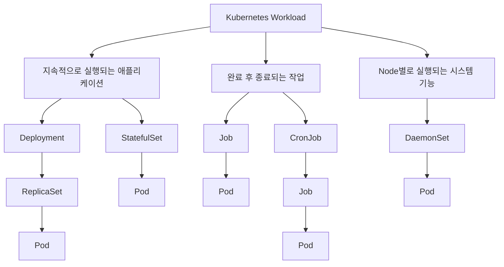
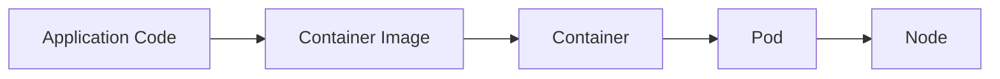
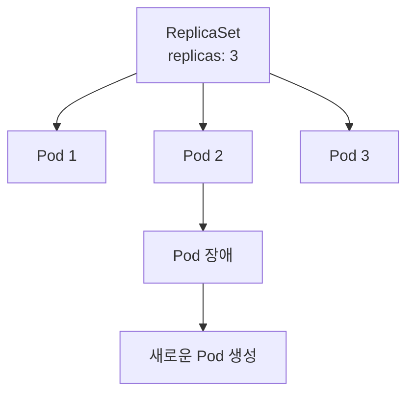
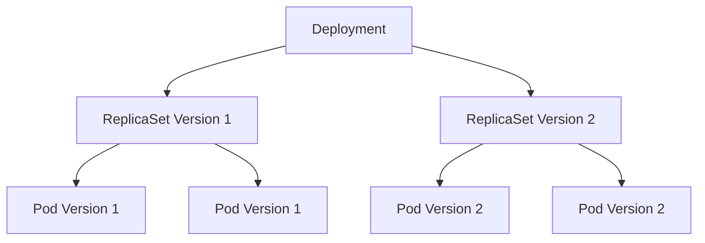
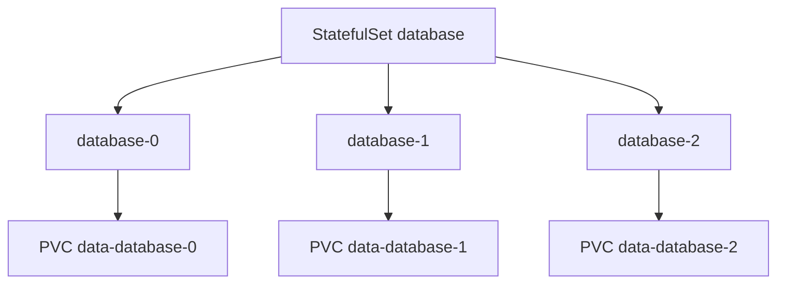
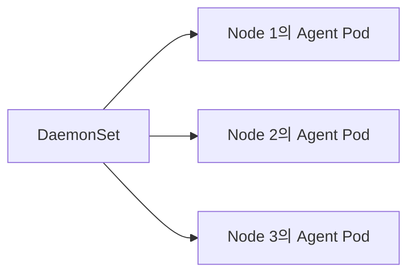
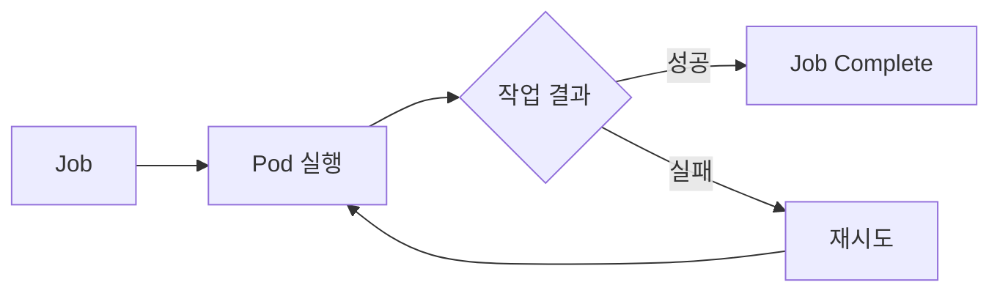
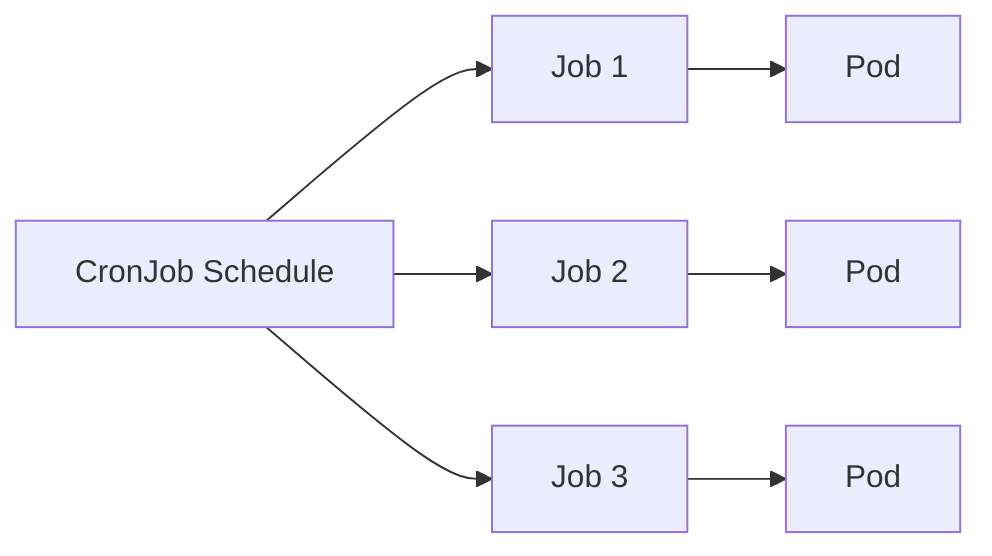

# Kubernetes Workload

# Kubernetes Workload

* toc
{:toc}

---

## 워크로드(Workload)

워크로드는 Kubernetes에서 실행되는 애플리케이션과 작업을 포괄하는 개념이다. 지속적으로 요청을 처리하는 서버, 특정 계산을 수행하고 종료되는 배치 작업, 각 Node에서 시스템 기능을 제공하는 Agent 등이 모두 워크로드에 해당한다.

일반적인 시스템에서 워크로드는 Process, Application Instance, Batch Job 같은 형태로 나타난다. Kubernetes에서는 이러한 애플리케이션을 Container로 패키징하고 Pod에서 실행한다.

### Kubernetes에서의 워크로드

Kubernetes는 Container를 실행하는 것에 그치지 않고 다음과 같은 실행 환경을 함께 관리한다.

- Container가 실행될 Node 선택
- 필요한 수량의 애플리케이션 인스턴스 유지
- 장애가 발생한 Container와 Pod 복구
- Rolling Update와 Rollback
- CPU와 Memory 자원 할당
- Network와 Service 연결
- ConfigMap과 Secret 전달
- Volume 연결
- 일회성 작업과 예약 작업 실행

Kubernetes 워크로드는 실행 성격에 따라 서로 다른 객체로 표현된다.



최종적으로 애플리케이션 Container는 Pod 안에서 실행된다. Deployment, StatefulSet, DaemonSet, Job 같은 상위 객체는 Pod를 어떤 방식으로 생성하고 유지할 것인지를 정의한다.

## Kubernetes Workload 객체

Kubernetes Workload 객체는 독립적으로만 사용되는 것이 아니라 소유 관계와 제어 관계를 가진다.

대표적으로 Deployment는 ReplicaSet을 생성하고, ReplicaSet은 Pod를 생성한다. CronJob은 실행 시간이 되면 Job을 생성하고, Job은 실제 작업을 수행할 Pod를 생성한다.

| 객체 | API 버전 | 주요 용도 |
|---|---|---|
| Pod | `v1` | Container를 실행하는 최소 배포 단위 |
| ReplicaSet | `apps/v1` | 동일한 Pod의 지정된 수량 유지 |
| Deployment | `apps/v1` | Stateless 애플리케이션 배포와 업데이트 |
| StatefulSet | `apps/v1` | 안정적인 식별자와 저장소가 필요한 애플리케이션 |
| DaemonSet | `apps/v1` | 각 Node 또는 지정된 Node마다 Pod 실행 |
| Job | `batch/v1` | 완료를 목적으로 하는 일회성 작업 |
| CronJob | `batch/v1` | Cron 일정에 따라 Job 생성 |

### Pod

Pod는 Kubernetes에서 생성하고 관리할 수 있는 가장 작은 배포 단위다.

애플리케이션을 로컬 환경에서 실행하면 Java, Python, Node.js 등의 프로세스가 생성된다. Container 환경에서는 애플리케이션이 Container 안에서 실행되고, Kubernetes는 Container를 직접적인 배포 단위로 관리하는 대신 Pod로 감싸서 관리한다.



Pod는 하나 이상의 Container를 포함할 수 있다. 하나의 Pod에 하나의 애플리케이션 Container를 배치하는 방식이 가장 일반적이지만, 반드시 하나만 포함해야 하는 것은 아니다.

여러 Container가 하나의 Pod에 포함되면 다음 자원을 공유한다.

- 동일한 Pod IP
- 동일한 Network Namespace
- `localhost`를 통한 통신
- Pod에 연결된 Volume
- 동일한 Node와 생명주기

여러 Container를 하나의 Pod에 배치하는 구성은 서로 강하게 결합되어야 할 때 사용한다.

- 애플리케이션과 로그 수집 Sidecar
- Proxy Sidecar와 애플리케이션
- 시작 전에 설정을 준비하는 Init Container
- 디버깅을 위한 Ephemeral Container

애플리케이션의 복제본을 늘리기 위해 같은 Pod에 Container를 여러 개 넣어서는 안 된다. 수평 확장이 필요하면 동일한 사양의 Pod를 여러 개 생성해야 한다.

### Pod와 애플리케이션 인스턴스

Pod는 애플리케이션 프로세스 하나보다 조금 더 넓은 실행 범위를 가진다.

```text
Pod
 ├── Application Container
 ├── Sidecar Container
 ├── Shared Network
 └── Shared Volume
```

단일 Container Pod라면 Pod 하나를 애플리케이션 인스턴스 하나와 비슷하게 이해할 수 있다. 하지만 Pod 자체는 프로세스가 아니라 Container가 실행되는 환경이다.

Container 재시작과 Pod 재생성도 구분해야 한다.

- Container 재시작: 동일한 Pod 안에서 kubelet이 Container를 다시 실행한다.
- Pod 재생성: 기존 Pod가 제거되고 새로운 UID를 가진 Pod 객체가 생성된다.
- Pod 삭제: Pod 안의 Container도 함께 종료되지만 연결된 영구 Volume까지 반드시 삭제되는 것은 아니다.

Pod는 일시적이고 교체 가능한 객체로 설계되었다. 따라서 운영 환경에서는 Pod를 직접 생성하기보다 Deployment나 StatefulSet 같은 상위 Workload 객체를 사용하는 것이 일반적이다.

### ReplicaSet

ReplicaSet은 지정된 수량의 동일한 Pod가 계속 실행되도록 관리한다.

예를 들어 `replicas: 3`으로 설정하면 ReplicaSet Controller는 Label Selector와 일치하는 Pod가 항상 세 개 존재하도록 조정한다.



ReplicaSet의 주요 구성은 다음과 같다.

- `replicas`: 유지할 Pod 수
- `selector`: ReplicaSet이 관리할 Pod를 식별하는 조건
- `template`: 새 Pod를 만들 때 사용할 Pod 사양

ReplicaSet은 서로 다른 역할의 Pod를 하나의 그룹으로 묶는 객체가 아니다. 일반적으로 동일한 Pod Template으로 만들어진 교체 가능한 Pod를 관리한다.

다만 소유자가 없는 Pod가 ReplicaSet의 Selector와 일치하면 ReplicaSet이 해당 Pod를 관리 대상으로 받아들일 수 있다. 따라서 Label과 Selector를 부주의하게 중복해서 사용하면 의도하지 않은 Pod가 관리 대상에 포함될 수 있다.

ReplicaSet을 직접 생성할 수도 있지만, 일반적인 Stateless 애플리케이션은 Deployment를 생성하고 Deployment가 ReplicaSet을 관리하도록 구성한다.

### Deployment

Deployment는 Stateless 애플리케이션의 배포, 확장, 업데이트를 관리하는 대표적인 Workload 객체다.

Deployment를 생성하면 내부적으로 ReplicaSet이 생성되고 ReplicaSet이 Pod를 관리한다.



Deployment가 제공하는 주요 기능은 다음과 같다.

- Pod 복제본 수 관리
- Rolling Update
- 배포 상태 확인
- 배포 일시 중지와 재개
- 이전 버전으로 Rollback
- Pod Template 변경 이력 관리
- 장애가 발생한 Pod 교체

Rolling Update는 기존 Pod를 한 번에 모두 종료하지 않고 새로운 버전의 Pod를 순차적으로 생성한다. 준비가 완료된 새 Pod 수에 맞춰 기존 Pod를 제거하므로 서비스 중단 가능성을 줄일 수 있다.

Deployment는 다음과 같은 Stateless 애플리케이션에 적합하다.

- Spring Boot API Server
- Node.js Web Server
- 인증 서버
- API Gateway
- 동일한 요청을 처리하는 Worker
- Frontend 정적 웹 서버

Stateless는 애플리케이션이 데이터를 전혀 사용하지 않는다는 의미가 아니다. 요청 간에 유지해야 하는 상태를 Pod의 Memory나 로컬 파일에 의존하지 않고 외부 데이터베이스, Redis, Object Storage 등에 저장한다는 의미다.

### StatefulSet

StatefulSet은 각 Pod에 안정적인 식별자와 저장소 연결이 필요한 Stateful 애플리케이션을 관리한다.

Deployment의 Pod는 서로 교체 가능한 인스턴스로 취급되지만 StatefulSet의 Pod는 고유한 순번을 가진다.

```text
database-0
database-1
database-2
```

Pod가 장애로 다시 생성되어도 동일한 이름과 기존 PersistentVolumeClaim 연결을 유지할 수 있다.



StatefulSet이 제공하는 주요 특성은 다음과 같다.

- 안정적이고 고유한 Pod 이름
- 안정적인 Network Identity
- Pod별 PersistentVolumeClaim 연결
- 순서가 보장되는 생성과 확장
- 순서가 보장되는 축소
- 순차적인 Rolling Update

기본 `OrderedReady` 정책에서는 Pod가 순서대로 생성된다. `database-0`이 Ready 상태가 되어야 `database-1`이 생성되는 방식이다. 축소할 때는 일반적으로 높은 순번의 Pod부터 제거한다.

StatefulSet을 사용한다고 데이터가 자동으로 보존되는 것은 아니다. 데이터를 유지하려면 `volumeClaimTemplates`, PersistentVolume, StorageClass 등을 함께 구성해야 한다.

또한 StatefulSet 자체가 데이터베이스의 복제, Leader 선출, 데이터 정합성 및 장애 복구를 대신하지 않는다. 이러한 기능은 데이터베이스나 Operator가 제공해야 한다.

운영 환경에서는 다음 이유로 데이터베이스를 Kubernetes 외부의 Managed Database로 구성하기도 한다.

- 백업과 복구 자동화
- 장애 조치
- 스토리지 운영 부담
- 데이터 정합성 관리
- 버전 업그레이드
- Kubernetes Cluster 장애와 데이터베이스 장애 영역 분리

반대로 Kafka, Elasticsearch, Redis Cluster처럼 Kubernetes 내부 운영이 필요한 시스템은 StatefulSet과 전용 Operator를 활용할 수 있다.

### DaemonSet

DaemonSet은 모든 Node 또는 조건에 맞는 Node마다 Pod를 하나씩 실행한다.



다음과 같은 Node 단위 시스템 기능에 사용한다.

- 로그 수집 Agent
- Monitoring Agent
- Network Plugin
- Storage Driver
- 보안 Agent
- GPU Device Plugin

Node가 Cluster에 추가되면 DaemonSet Controller가 새로운 Node에도 Pod를 생성한다. Node가 제거되면 해당 Node의 DaemonSet Pod도 함께 사라진다.

DaemonSet의 Pod 수는 일반적인 `replicas` 값으로 결정하지 않는다. DaemonSet의 Node Selector, Affinity, Toleration 조건을 만족하는 Node 수에 따라 결정된다.

### Job

Job은 작업을 완료한 후 종료되어야 하는 일회성 애플리케이션을 실행한다.

Deployment는 서버 애플리케이션이 지속적으로 실행되도록 관리하지만 Job은 지정된 수의 작업이 성공적으로 완료되는 것을 목표로 한다.



Job의 대표적인 사용 사례는 다음과 같다.

- 데이터 마이그레이션
- 대량 데이터 처리
- 리포트 생성
- 파일 변환
- 데이터 정리
- 일회성 운영 작업
- Machine Learning 학습 작업

Job은 Pod 실행이 실패하면 `backoffLimit` 등의 정책에 따라 새로운 Pod를 생성해 재시도할 수 있다.

작업이 여러 번 실행되어도 데이터가 중복되거나 오염되지 않도록 Job 애플리케이션을 멱등하게 설계하는 것이 중요하다.

### CronJob

CronJob은 Cron 표현식으로 정의한 일정에 따라 Job을 생성한다.



다음과 같은 정기 작업에 사용할 수 있다.

- 매일 자정 통계 집계
- 주기적인 데이터 삭제
- 예약 알림 발송
- 백업 실행
- 캐시 갱신
- 정산 배치

CronJob이 Container를 직접 실행하는 것은 아니다. 실행 시간이 되면 Job을 만들고 Job이 Pod를 생성한다.

실무에서는 다음 설정을 함께 고려해야 한다.

- `concurrencyPolicy`: 이전 작업과 새 작업의 동시 실행 처리
- `startingDeadlineSeconds`: 예정 시각을 놓친 작업의 실행 허용 범위
- `successfulJobsHistoryLimit`: 성공 Job 보관 수
- `failedJobsHistoryLimit`: 실패 Job 보관 수
- `timeZone`: Cron 표현식을 해석할 시간대
- 작업의 중복 실행과 멱등성

## Pod의 생명주기와 상태

Pod의 `status.phase`는 Pod 생명주기의 고수준 상태를 나타낸다.

| Phase | 의미 |
|---|---|
| `Pending` | Cluster가 Pod를 받아들였지만 하나 이상의 Container가 아직 실행 준비를 완료하지 못한 상태 |
| `Running` | Pod가 Node에 할당되었고 Container가 생성되었으며 하나 이상이 실행 또는 시작·재시작 중인 상태 |
| `Succeeded` | 모든 Container가 성공적으로 종료되었고 다시 시작되지 않는 상태 |
| `Failed` | 모든 Container가 종료되었으며 하나 이상이 실패로 종료된 상태 |
| `Unknown` | Node 통신 문제 등으로 Pod 상태를 확인할 수 없는 상태 |

### Pending

`Pending`은 Scheduler가 Node를 찾고 있는 단계만 의미하지 않는다. Pod가 Cluster에 등록된 후 Container 실행 준비가 끝나지 않은 전체 구간을 포함한다.

다음과 같은 경우 Pod가 `Pending`에 머무를 수 있다.

- CPU 또는 Memory가 충분한 Node가 없음
- Node Selector와 일치하는 Node가 없음
- Taint를 허용하는 Toleration이 없음
- PersistentVolume을 연결할 수 없음
- Container Image를 내려받는 중
- Image Pull Secret 설정 오류
- ResourceQuota 초과

다음 명령으로 원인을 확인한다.

```shell
kubectl describe pod <POD_NAME>
kubectl get events --sort-by=.metadata.creationTimestamp
```

### Running

`Running`은 Pod가 반드시 정상적으로 요청을 처리한다는 의미가 아니다.

Container가 실행 중이어도 Readiness Probe가 실패하면 Pod는 `Running`이면서 `Ready`는 `False`일 수 있다. 이런 Pod는 일반적으로 Service의 정상 Endpoint에 포함되지 않는다.

```shell
kubectl get pod
```

```text
NAME        READY   STATUS    RESTARTS   AGE
nginx-pod   1/1     Running   0          30s
```

`READY`의 `1/1`은 전체 Container 하나 중 하나가 준비되었다는 의미다.

### Succeeded

모든 Container가 종료 코드 `0`으로 완료되고 다시 시작되지 않는 경우 `Succeeded`가 된다. 일회성 배치 작업에서 정상적으로 볼 수 있는 상태다.

항상 실행되어야 하는 서버 애플리케이션이 `Succeeded` 상태로 종료되었다면 프로세스가 계속 실행되지 않은 이유를 확인해야 한다.

### Failed

모든 Container가 종료되었고 하나 이상이 오류 코드로 종료되었거나 시스템에 의해 실패 처리된 상태다.

`restartPolicy`와 상위 Controller 유무에 따라 후속 동작이 달라진다.

- kubelet이 동일한 Pod 안의 Container를 재시작할 수 있다.
- Job Controller가 새로운 Pod로 작업을 재시도할 수 있다.
- ReplicaSet Controller가 부족한 Replica를 보충하기 위해 새로운 Pod를 만들 수 있다.
- Controller가 없는 단독 Pod는 삭제된 후 자동으로 다시 생성되지 않는다.

### Unknown

`Unknown`은 API Server가 Pod가 실행 중인 Node로부터 상태를 받아오지 못할 때 나타날 수 있다.

주요 원인은 다음과 같다.

- Node 장애
- kubelet 중지
- Control Plane과 Node 간 Network 장애
- Node의 심각한 자원 부족
- 인증서 또는 통신 설정 오류

### Pod Phase와 kubectl STATUS의 차이

`CrashLoopBackOff`, `ImagePullBackOff`, `Terminating`은 공식 Pod Phase가 아니다. `kubectl get pods`가 문제 상황을 이해하기 쉽게 보여주는 STATUS 값 또는 대기 사유다.

실제 Pod Phase를 직접 확인하려면 다음 명령을 사용할 수 있다.

```shell
kubectl get pod <POD_NAME> \
  -o jsonpath='{.status.phase}'
```

Container 상태는 다음 세 가지로 구분된다.

- `Waiting`
- `Running`
- `Terminated`

한 Pod 안의 각 Container가 서로 다른 상태일 수 있으므로 장애 분석에서는 Pod Phase만 보지 말고 `kubectl describe pod`로 Container 상태와 Event를 함께 확인해야 한다.

## Pod를 Kubernetes에 적용하기

### 실습 목표

Nginx Container를 실행하는 Pod Manifest를 작성하고 Kubernetes Cluster에 적용한다. 이후 Pod 상태, 로그, Event, Network 연결을 확인하고 실습 자원을 삭제한다.

### 사전 조건

다음 명령이 정상적으로 실행되어야 한다.

```shell
kubectl version --client
kubectl config current-context
kubectl cluster-info
kubectl get nodes
```

Node의 `STATUS`가 `Ready`인지 확인한다.

```text
NAME             STATUS   ROLES           AGE   VERSION
docker-desktop   Ready    control-plane   10m   v1.x.x
```

### 명령형 방식으로 Pod 생성

`kubectl run`을 이용하면 한 줄로 Pod를 생성할 수 있다.

```shell
kubectl run nginx-command \
  --image=nginx:alpine \
  --port=80
```

상태를 확인한다.

```shell
kubectl get pod nginx-command
```

실습 후 Pod를 삭제한다.

```shell
kubectl delete pod nginx-command
```

명령형 방식은 빠른 테스트에는 유용하지만 어떤 옵션으로 객체를 생성했는지 Git에서 관리하기 어렵다. 반복 가능한 배포와 유지보수를 위해서는 YAML Manifest를 사용하는 선언형 방식을 권장한다.

YAML 초안을 생성하는 용도로 다음 명령을 사용할 수도 있다.

```shell
kubectl run nginx-pod \
  --image=nginx:alpine \
  --port=80 \
  --dry-run=client \
  -o yaml
```

### Pod YAML 작성

`nginx-pod.yaml` 파일을 작성한다.

```yaml
apiVersion: v1
kind: Pod
metadata:
  name: nginx-pod
  labels:
    app: nginx
    environment: practice
spec:
  restartPolicy: Always
  containers:
    - name: nginx
      image: nginx:alpine
      imagePullPolicy: IfNotPresent
      ports:
        - name: http
          containerPort: 80
          protocol: TCP
      resources:
        requests:
          cpu: 100m
          memory: 64Mi
        limits:
          cpu: 500m
          memory: 128Mi
      readinessProbe:
        httpGet:
          path: /
          port: http
        initialDelaySeconds: 2
        periodSeconds: 5
        timeoutSeconds: 2
        failureThreshold: 3
      livenessProbe:
        httpGet:
          path: /
          port: http
        initialDelaySeconds: 10
        periodSeconds: 10
        timeoutSeconds: 2
        failureThreshold: 3
```

학습 예제에서는 간결성을 위해 `nginx:alpine` Tag를 사용했다. 운영 환경에서는 검증한 Image 버전이나 Digest를 고정해 동일한 Manifest가 항상 같은 Image를 실행하도록 구성하는 것이 좋다.

### apiVersion

```yaml
apiVersion: v1
```

`apiVersion`은 객체를 생성할 때 사용할 Kubernetes API Group과 Version을 의미한다.

Pod는 Core API Group에 속하므로 `v1`을 사용한다. Deployment나 StatefulSet은 `apps/v1`, Job과 CronJob은 `batch/v1`을 사용한다.

Kubernetes API는 Beta에서 Stable로 변경되거나 오래된 버전이 제거될 수 있으므로 다른 객체의 Manifest를 작성할 때는 현재 Cluster 버전의 API를 확인해야 한다.

```shell
kubectl api-resources
kubectl explain pod
```

### kind

```yaml
kind: Pod
```

`kind`는 생성할 Kubernetes 객체의 종류를 지정한다. `apiVersion`과 `kind`의 조합으로 API Server가 요청을 처리할 객체 구조를 결정한다.

### metadata

```yaml
metadata:
  name: nginx-pod
  labels:
    app: nginx
    environment: practice
```

`metadata`에는 객체를 식별하고 분류하기 위한 정보를 작성한다.

`name`은 동일한 Namespace와 동일한 객체 종류 안에서 고유해야 한다. Cluster 전체에서 모든 객체 이름이 무조건 고유해야 하는 것은 아니다. 서로 다른 Namespace에는 같은 이름의 Pod를 만들 수 있다.

Label은 객체를 분류하고 Selector로 찾기 위한 Key-Value 정보다.

```shell
kubectl get pods -l app=nginx
kubectl get pods -l environment=practice
```

### spec

```yaml
spec:
```

`spec`은 사용자가 원하는 Pod 상태를 정의한다. Pod에 어떤 Container를 실행할지, 어느 정도의 자원을 사용할지, 어떤 방식으로 상태를 확인할지 등을 작성한다.

생략한 필드는 API Server의 기본값이 적용될 수 있다. 그러나 기본값은 필드와 API에 따라 다르므로 중요한 동작은 명시적으로 작성하는 것이 좋다.

### restartPolicy

```yaml
restartPolicy: Always
```

`restartPolicy`는 Pod 안의 Container가 종료되었을 때 kubelet이 Container를 다시 시작할 조건을 지정한다.

| 값 | 동작 |
|---|---|
| `Always` | 종료 원인과 관계없이 Container 재시작 |
| `OnFailure` | 오류 코드로 종료된 경우 재시작 |
| `Never` | 종료된 Container를 재시작하지 않음 |

일반적인 서버 Pod는 `Always`를 사용한다. Job은 일반적으로 `OnFailure` 또는 `Never`를 사용한다.

이 정책은 새로운 Pod를 생성하는 정책이 아니라 동일한 Pod 안에서 Container를 재시작하는 정책이다.

### containers

```yaml
containers:
  - name: nginx
```

Pod는 여러 Container를 가질 수 있으므로 `containers`는 배열로 정의된다. YAML의 하이픈은 배열의 새로운 항목을 의미한다.

Container 이름은 해당 Pod 안에서 고유해야 한다. 다른 Pod에는 동일한 Container 이름을 사용할 수 있다.

### image

```yaml
image: nginx:alpine
imagePullPolicy: IfNotPresent
```

`image`는 실행할 Container Image를 지정한다.

Registry 주소가 생략되었으므로 기본 Registry인 Docker Hub에서 `nginx` Image를 내려받는다.

`imagePullPolicy: IfNotPresent`는 Node에 Image가 없을 때만 Registry에서 내려받도록 한다.

대표적인 정책은 다음과 같다.

| 정책 | 동작 |
|---|---|
| `Always` | Container 실행 시 Registry에서 Image 정보 확인 |
| `IfNotPresent` | Node에 Image가 없을 때만 Pull |
| `Never` | 로컬 Image만 사용하고 Pull하지 않음 |

Private Registry를 사용한다면 Registry 주소와 `imagePullSecrets` 설정이 필요하다.

### ports

```yaml
ports:
  - name: http
    containerPort: 80
    protocol: TCP
```

`containerPort`는 Container가 사용하는 포트를 문서화하고 Probe나 Service에서 이름으로 참조할 수 있게 한다.

이 설정만으로 외부에서 Pod에 접근할 수 있게 되는 것은 아니다. 외부 접근에는 Service, Ingress, Gateway 또는 Port Forwarding이 필요하다.

### resources

```yaml
resources:
  requests:
    cpu: 100m
    memory: 64Mi
  limits:
    cpu: 500m
    memory: 128Mi
```

`requests`는 Scheduler가 Pod를 배치할 때 필요한 최소 자원으로 사용한다.

`limits`는 Container가 사용할 수 있는 자원의 상한을 지정한다.

- `cpu: 100m`은 CPU Core의 10%에 해당한다.
- `cpu: 500m`은 CPU Core의 50%에 해당한다.
- `memory: 64Mi`는 64 Mebibyte를 의미한다.

CPU Limit을 초과하면 CPU 사용 시간이 제한될 수 있다. Memory Limit을 초과하면 Container가 OOMKilled로 종료될 수 있다.

### readinessProbe

```yaml
readinessProbe:
  httpGet:
    path: /
    port: http
```

Readiness Probe는 Container가 요청을 받을 준비가 되었는지 확인한다.

Readiness Probe가 실패해도 kubelet이 Container를 재시작하지는 않는다. 대신 Service를 사용하는 경우 해당 Pod가 정상 Endpoint에서 제외될 수 있다.

### livenessProbe

```yaml
livenessProbe:
  httpGet:
    path: /
    port: http
```

Liveness Probe는 Container가 실행 상태를 유지할 수 있는지 확인한다. 설정된 횟수만큼 연속 실패하면 kubelet이 Restart Policy에 따라 Container를 재시작할 수 있다.

애플리케이션 시작이 오래 걸린다면 Liveness Probe의 초기 지연을 늘리거나 Startup Probe를 추가해야 한다. 너무 이른 Liveness Probe는 정상적으로 시작 중인 애플리케이션을 반복해서 재시작하게 만들 수 있다.

## Kubernetes Workload 실습

### Manifest 검증

실제 생성 전에 Client 구조 검증을 수행한다.

```shell
kubectl apply \
  --dry-run=client \
  -f nginx-pod.yaml
```

API Server의 현재 Schema와 Admission 정책까지 확인하려면 Server Dry Run을 사용한다.

```shell
kubectl apply \
  --dry-run=server \
  -f nginx-pod.yaml
```

정상이라면 다음과 비슷한 결과가 출력된다.

```text
pod/nginx-pod created (server dry run)
```

### Pod 생성

```shell
kubectl apply -f nginx-pod.yaml
```

정상 결과는 다음과 같다.

```text
pod/nginx-pod created
```

`apply` 명령은 YAML 파일을 Kubernetes API Server에 전달한다. YAML 파일은 애플리케이션 소스 코드라기보다 Kubernetes 객체의 원하는 상태를 선언한 배포 명세에 가깝다.

### Pod 상태 확인

```shell
kubectl get pod nginx-pod
kubectl get pod nginx-pod -o wide
```

Pod가 Ready 상태가 될 때까지 기다릴 수도 있다.

```shell
kubectl wait \
  --for=condition=Ready \
  pod/nginx-pod \
  --timeout=90s
```

정상적으로 실행되면 다음과 비슷한 결과를 확인할 수 있다.

```text
NAME        READY   STATUS    RESTARTS   AGE
nginx-pod   1/1     Running   0          20s
```

### 상세 정보와 Event 확인

```shell
kubectl describe pod nginx-pod
```

`describe` 결과에서는 다음 내용을 확인할 수 있다.

- Pod가 배치된 Node
- Pod IP
- Container Image
- Container 상태
- Restart 횟수
- Readiness와 Liveness 결과
- CPU와 Memory 설정
- Scheduling 및 Image Pull Event

### 로그 확인

```shell
kubectl logs nginx-pod
```

여러 Container가 있는 Pod라면 Container 이름을 지정한다.

```shell
kubectl logs nginx-pod -c nginx
```

재시작되기 전 Container의 로그는 다음과 같이 조회한다.

```shell
kubectl logs nginx-pod \
  -c nginx \
  --previous
```

### Container 내부 명령 실행

```shell
kubectl exec nginx-pod -- nginx -v
```

Shell이 포함된 Image라면 대화형으로 접속할 수도 있다.

```shell
kubectl exec -it nginx-pod -- /bin/sh
```

최소화된 Container Image에는 `bash`, `curl`, `ping` 같은 도구가 없을 수 있다. 명령이 없다는 이유만으로 Container 장애라고 판단해서는 안 된다.

### Port Forwarding을 이용한 접속 테스트

```shell
kubectl port-forward pod/nginx-pod 8080:80
```

브라우저에서 다음 주소로 접속한다.

```text
http://localhost:8080
```

Nginx 기본 화면이 표시되면 Pod의 Container가 정상적으로 요청을 처리하고 있는 것이다.

Port Forwarding은 로컬 테스트 기능이며 운영 서비스 공개 방식이 아니다. 실제 요청 경로를 구성하려면 Service와 Ingress 또는 Gateway API를 사용해야 한다.

### Manifest 변경 확인

적용 전 차이를 확인할 수 있다.

```shell
kubectl diff -f nginx-pod.yaml
```

Pod의 많은 `spec` 필드는 생성 후 수정할 수 없다. 수정할 수 없는 필드를 변경하면 다음과 같은 오류가 발생할 수 있다.

```text
The Pod is invalid: spec: Forbidden
```

이 경우 단독 Pod를 삭제한 뒤 다시 생성해야 한다. Deployment를 사용하면 Pod Template 변경 시 새로운 Pod로 교체하는 Rolling Update를 수행할 수 있다.

### Pod 삭제

```shell
kubectl delete -f nginx-pod.yaml
```

또는 이름으로 삭제한다.

```shell
kubectl delete pod nginx-pod
```

삭제 상태를 확인한다.

```shell
kubectl get pod nginx-pod
```

단독으로 생성한 Pod는 삭제 후 다시 생성되지 않는다. Deployment나 ReplicaSet이 관리하는 Pod를 삭제하면 Controller가 원하는 Replica 수를 맞추기 위해 새로운 Pod를 생성한다.

## 실습 중 발생할 수 있는 문제

| 표시 상태 | 주요 원인 | 확인 방법 |
|---|---|---|
| `Pending` | Node 자원 부족, Scheduling 조건 불일치, Volume 문제 | `kubectl describe pod` |
| `ErrImagePull` | Image 이름 오류, 인증 실패 | Pod Event 확인 |
| `ImagePullBackOff` | Image Pull이 반복해서 실패해 재시도 대기 | Registry와 Image Tag 확인 |
| `CrashLoopBackOff` | 애플리케이션이 실행 후 반복 종료 | `kubectl logs --previous` |
| `CreateContainerConfigError` | ConfigMap, Secret 등의 참조 오류 | Pod Event와 Manifest 확인 |
| `Running`, `0/1` | Container는 실행되었지만 Readiness 실패 | Probe와 애플리케이션 로그 확인 |
| `OOMKilled` | Container가 Memory Limit 초과 | `describe`의 종료 사유 확인 |
| `Unknown` | Node 또는 kubelet 통신 장애 | Node 상태와 Control Plane 통신 확인 |

### Pending 상태가 계속되는 경우

```shell
kubectl describe pod nginx-pod
kubectl get nodes
kubectl describe node
kubectl get events --sort-by=.metadata.creationTimestamp
```

Event에 다음과 같은 메시지가 있는지 확인한다.

```text
0/1 nodes are available: insufficient memory
```

이 경우 Pod의 `requests.memory`를 줄이거나 Node 자원을 늘려야 한다.

### ImagePullBackOff가 발생하는 경우

```shell
kubectl describe pod nginx-pod
```

다음 항목을 확인한다.

- Image 이름과 Tag
- Registry 주소
- Network 연결
- Private Registry 인증 정보
- Node의 CPU 아키텍처와 Image 지원 여부

### CrashLoopBackOff가 발생하는 경우

```shell
kubectl logs nginx-pod
kubectl logs nginx-pod --previous
kubectl describe pod nginx-pod
```

주요 원인은 다음과 같다.

- 잘못된 실행 명령
- 필수 환경 변수 누락
- ConfigMap 또는 Secret 설정 오류
- 애플리케이션 시작 예외
- 외부 데이터베이스 연결 실패
- Memory 부족
- 잘못된 Liveness Probe

## 실무적인 Workload 선택 기준

| 요구사항 | 적합한 객체 |
|---|---|
| 일반적인 Stateless API Server | Deployment |
| 동일한 서버 인스턴스 수 유지 | Deployment |
| 직접 제어하는 단순 복제 집합 | ReplicaSet |
| 안정적인 Pod 이름과 저장소 필요 | StatefulSet |
| 모든 Node에 Monitoring Agent 실행 | DaemonSet |
| 한 번 실행하고 완료되는 배치 | Job |
| 정해진 시간마다 실행되는 배치 | CronJob |
| Container 동작 자체를 확인하는 단순 실습 | Pod |

운영 환경에서 단독 Pod를 직접 생성하는 경우는 많지 않다. 단독 Pod는 Node 장애나 삭제 후 이를 대신할 Controller가 없기 때문이다.

대부분의 백엔드 서버는 Deployment, 일회성 배치는 Job, 예약 배치는 CronJob을 사용한다. StatefulSet은 단순히 데이터를 사용한다는 이유만으로 선택하는 것이 아니라 안정적인 식별자, Pod별 저장소, 순서 보장이 실제로 필요한지를 기준으로 선택해야 한다.

## 정리

워크로드는 Kubernetes에서 실행되는 서버 애플리케이션, 배치, Node Agent 등을 포괄하는 개념이다. Kubernetes는 워크로드 특성에 맞는 여러 API 객체를 제공하며, 모든 애플리케이션 Container는 최종적으로 Pod 안에서 실행된다.

Pod는 Kubernetes의 최소 배포 단위지만 운영 환경에서는 보통 직접 관리하지 않는다.

- Deployment는 ReplicaSet을 통해 Stateless Pod를 관리한다.
- ReplicaSet은 지정된 수의 동일한 Pod를 유지한다.
- StatefulSet은 안정적인 Pod 식별자와 저장소 연결을 제공한다.
- DaemonSet은 Node마다 필요한 Pod를 실행한다.
- Job은 완료를 목적으로 일회성 작업을 실행한다.
- CronJob은 일정에 따라 Job을 생성한다.

Pod의 `Pending`, `Running`, `Succeeded`, `Failed`, `Unknown`은 생명주기의 고수준 Phase다. `CrashLoopBackOff`나 `ImagePullBackOff`는 Pod Phase가 아니라 `kubectl`에서 표시되는 Container 대기 사유에 가깝다.

또한 Container 재시작과 Pod 재생성을 구분해야 한다. kubelet은 동일한 Pod 안에서 Container를 재시작할 수 있지만, 새로운 Pod를 만드는 작업은 Deployment, ReplicaSet, StatefulSet, Job 같은 상위 Controller가 담당한다.

YAML Manifest는 Kubernetes 객체의 원하는 상태를 선언한다. `kubectl apply`를 통해 이를 API Server에 전달하고, `get`, `describe`, `logs`, `events` 명령으로 실제 상태와 문제 원인을 확인하는 흐름이 Kubernetes 워크로드 관리의 기본이 된다.
