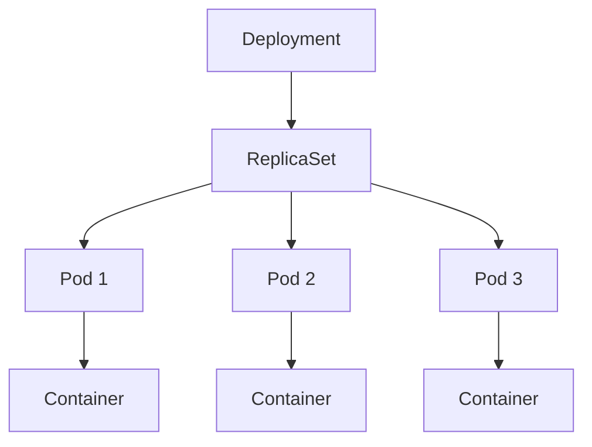
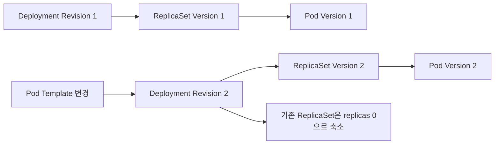
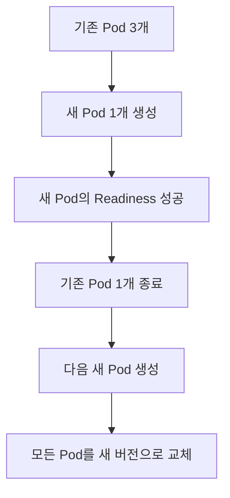
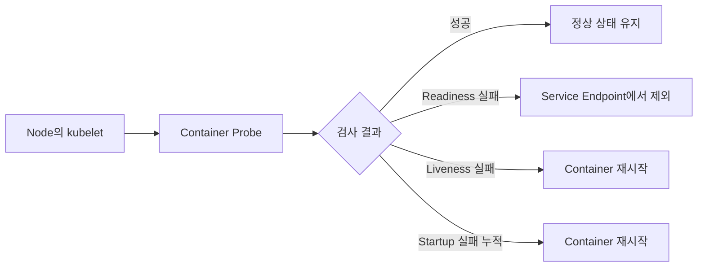
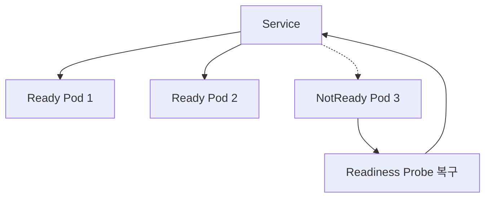
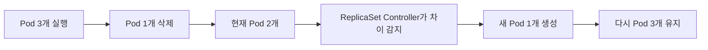

# Kubernetes Deployment

# Kubernetes Deployment

* toc
{:toc}

---

## Kubernetes Deployment

Deployment는 Kubernetes에서 가장 일반적으로 사용하는 Workload 객체다. 주로 Spring Boot API Server, Web Server, Worker처럼 지속적으로 실행되어야 하는 Stateless 애플리케이션을 배포하고 관리할 때 사용한다.

Pod를 직접 생성해도 애플리케이션을 실행할 수 있지만, 단독 Pod만으로는 복제본 수 유지, 장애 복구, Rolling Update, Rollback 같은 운영 기능을 충분히 활용할 수 없다. 실제 운영에서는 Deployment를 생성하고, Deployment가 ReplicaSet과 Pod를 간접적으로 관리하도록 구성하는 경우가 많다.

### Deployment가 필요한 이유

하나의 Pod를 애플리케이션 인스턴스 하나라고 생각하면 이해하기 쉽다. 서비스 이중화나 Scale Out을 위해서는 동일한 애플리케이션을 실행하는 Pod가 여러 개 필요하다.

ReplicaSet은 지정된 수의 Pod를 유지할 수 있지만 애플리케이션 버전 변경과 배포 이력을 관리하는 기능은 제한적이다. Deployment는 ReplicaSet의 복제본 관리 기능에 배포와 버전 관리 기능을 추가한 상위 Workload 객체다.



각 객체의 역할은 다음과 같이 구분할 수 있다.

| 객체 | 역할 |
|---|---|
| Deployment | 애플리케이션 배포, 업데이트, Rollback 관리 |
| ReplicaSet | 지정된 수의 동일한 Pod 유지 |
| Pod | 애플리케이션 Container 실행 |
| Container | 실제 애플리케이션 프로세스 실행 |

Deployment를 다루는 것은 결과적으로 Pod를 다루는 일이지만, 사용자가 Pod를 직접 생성하거나 제거하는 것이 아니라 Deployment Controller가 원하는 상태에 맞춰 Pod를 관리한다는 차이가 있다.

### Deployment와 ReplicaSet의 관계

Deployment를 생성하면 현재 Pod Template에 해당하는 ReplicaSet이 생성된다. ReplicaSet은 `replicas`에 지정된 수만큼 Pod를 생성한다.

```yaml
spec:
  replicas: 3
```

`replicas: 3`이면 동일한 Pod 세 개를 유지한다. Pod 하나가 삭제되거나 Node 장애 등으로 사라지면 ReplicaSet Controller가 새로운 Pod를 생성해 다시 세 개를 맞춘다.

`replicas`에는 다음과 같은 값도 지정할 수 있다.

- `replicas: 1`: Pod 하나만 유지
- `replicas: 3`: 동일한 Pod 세 개 유지
- `replicas: 0`: Deployment와 ReplicaSet은 유지하지만 실행 중인 Pod는 없음

Replica 수는 실행 중에도 변경할 수 있다.

```shell
kubectl scale deployment nginx-app --replicas=5
```

Replica 수를 0으로 줄이면 배포 설정과 이력은 유지하면서 모든 Pod를 종료할 수 있다.

```shell
kubectl scale deployment nginx-app --replicas=0
```

다만 YAML에 `replicas: 3`이 선언된 상태에서 다시 `kubectl apply`를 실행하면 선언된 값인 3으로 돌아갈 수 있다. GitOps나 선언형 배포를 사용한다면 명령행에서만 변경하지 말고 Manifest도 함께 수정해야 한다.

HPA가 Replica 수를 관리하는 환경에서도 수동 Scale과 `spec.replicas` 변경이 충돌하지 않도록 관리 주체를 명확히 해야 한다.

### Deployment와 애플리케이션의 대응 관계

일반적으로 하나의 Deployment는 독립적으로 배포하고 확장할 수 있는 하나의 애플리케이션 구성 요소에 대응한다.

예를 들면 다음과 같다.

- `member-api` Deployment
- `order-api` Deployment
- `payment-worker` Deployment
- `frontend-web` Deployment

하지만 반드시 애플리케이션과 Deployment가 엄격하게 1:1이어야 하는 것은 아니다. 같은 애플리케이션이라도 다음 조건이 다르면 별도의 Deployment로 나눌 수 있다.

- 배포 주기
- Scale Out 기준
- 환경 변수와 설정
- 접근 권한
- Node 배치 조건
- 트래픽 대상
- Release 전략

Canary Deployment처럼 같은 애플리케이션의 서로 다른 버전을 여러 Deployment로 나누어 운영할 수도 있다.

### Deployment 전체 YAML

다음은 Nginx Pod 세 개를 Rolling Update 방식으로 관리하는 Deployment다.

```yaml
apiVersion: apps/v1
kind: Deployment
metadata:
  name: nginx-app
  labels:
    app: nginx
  annotations:
    kubernetes.io/change-cause: "Initial deployment with nginx 1.28"
spec:
  replicas: 3
  revisionHistoryLimit: 5
  progressDeadlineSeconds: 600
  minReadySeconds: 5
  strategy:
    type: RollingUpdate
    rollingUpdate:
      maxUnavailable: 1
      maxSurge: 1
  selector:
    matchLabels:
      app: nginx
  template:
    metadata:
      labels:
        app: nginx
        version: "1.28"
    spec:
      terminationGracePeriodSeconds: 30
      containers:
        - name: nginx
          image: nginx:1.28-alpine
          imagePullPolicy: IfNotPresent
          ports:
            - name: http
              containerPort: 80
              protocol: TCP
          resources:
            requests:
              cpu: 100m
              memory: 64Mi
            limits:
              cpu: 500m
              memory: 128Mi
          startupProbe:
            httpGet:
              path: /
              port: http
            periodSeconds: 2
            timeoutSeconds: 1
            successThreshold: 1
            failureThreshold: 30
          readinessProbe:
            httpGet:
              path: /
              port: http
            periodSeconds: 5
            timeoutSeconds: 2
            successThreshold: 1
            failureThreshold: 3
          livenessProbe:
            httpGet:
              path: /
              port: http
            periodSeconds: 10
            timeoutSeconds: 2
            successThreshold: 1
            failureThreshold: 3
```

학습 예제에서는 확인하기 쉬운 Image Tag를 사용했다. 운영 환경에서는 보안 검증을 완료한 Image 버전이나 Digest를 고정하는 것이 좋다.

### Deployment 주요 필드

#### apiVersion과 kind

```yaml
apiVersion: apps/v1
kind: Deployment
```

Deployment는 `apps` API Group의 Stable Version인 `apps/v1`을 사용한다.

#### metadata

```yaml
metadata:
  name: nginx-app
  labels:
    app: nginx
```

`metadata.name`은 Deployment 이름이다. 같은 Namespace 안에서 다른 Deployment와 중복될 수 없다.

Label은 객체 분류와 조회에 활용한다.

```shell
kubectl get deployments -l app=nginx
```

#### replicas

```yaml
replicas: 3
```

Deployment가 유지할 Pod 수를 지정한다. 실제 Pod 수량 관리는 Deployment가 생성한 ReplicaSet을 통해 이루어진다.

#### selector

```yaml
selector:
  matchLabels:
    app: nginx
```

Selector는 Deployment가 관리할 Pod를 식별한다. `selector.matchLabels`는 `template.metadata.labels`와 반드시 일치해야 한다.

```yaml
template:
  metadata:
    labels:
      app: nginx
```

`version` Label은 Selector에 포함하지 않았다. Rolling Update 중에는 기존 버전과 새로운 버전의 Pod가 동시에 존재해야 하기 때문이다.

Selector에 버전을 포함하면 버전 변경 시 Selector까지 변경해야 하지만 Deployment의 Selector는 생성 후 일반적으로 변경할 수 없다.

서로 다른 Deployment에서 Selector를 중복하면 Controller들이 같은 Pod를 관리 대상으로 인식하려고 충돌할 수 있으므로 주의해야 한다.

#### template

```yaml
template:
  metadata:
    labels:
      app: nginx
      version: "1.28"
  spec:
    containers:
      - name: nginx
        image: nginx:1.28-alpine
```

`template`은 ReplicaSet이 새로운 Pod를 생성할 때 사용할 Pod Template이다.

다음과 같은 Pod Template 변경은 새로운 Deployment Revision과 ReplicaSet 생성을 유발한다.

- Container Image 변경
- Pod Label 변경
- 환경 변수 변경
- Resource 설정 변경
- Probe 변경
- Volume 또는 Volume Mount 변경
- Pod Security 설정 변경

단순히 `replicas` 수량만 변경하는 작업은 새로운 Deployment Revision을 생성하지 않는다.

#### revisionHistoryLimit

```yaml
revisionHistoryLimit: 5
```

Rollback을 위해 보존할 이전 ReplicaSet 수를 지정한다.

값을 `0`으로 설정하면 이전 ReplicaSet이 정리되므로 Deployment Rollback을 수행할 수 없다. 이전 ReplicaSet은 Pod 수가 0이어도 배포 이력을 보존하는 역할을 한다.

#### progressDeadlineSeconds

```yaml
progressDeadlineSeconds: 600
```

Deployment가 새로운 버전 배포를 진행 중이라고 판단할 최대 시간을 지정한다. 제한 시간 동안 배포가 진행되지 않으면 `ProgressDeadlineExceeded` 상태가 표시될 수 있다.

다만 이 설정이 실패한 Deployment를 자동으로 이전 버전으로 Rollback하는 것은 아니다. 상태를 감지한 운영자나 배포 시스템이 Rollback을 실행해야 한다.

#### minReadySeconds

```yaml
minReadySeconds: 5
```

새로운 Pod가 Ready 상태가 된 후 최소 몇 초 동안 정상 상태를 유지해야 Available Pod로 인정할지 지정한다.

애플리케이션이 시작 직후 잠시 정상 응답을 보내다가 실패하는 경우 너무 빠르게 배포 성공으로 판단하는 것을 줄일 수 있다.

## Deployment Update

Deployment는 ReplicaSet의 Pod 수량 관리 기능에 버전 관리와 업데이트 기능을 추가한다.

Deployment를 이용하면 다음 작업을 수행할 수 있다.

- 애플리케이션 최초 배포
- 새로운 버전 배포
- 배포 진행 상태 확인
- 업데이트 일시 중지와 재개
- 이전 버전으로 Rollback
- 배포 이력 조회

Deployment는 Pod Template이 변경될 때 새로운 ReplicaSet을 생성한다. 이후 업데이트 전략에 따라 기존 ReplicaSet의 Pod를 줄이고 새로운 ReplicaSet의 Pod를 늘린다.



Kubernetes Deployment가 제공하는 업데이트 전략은 다음 두 가지다.

- `Recreate`
- `RollingUpdate`

### Recreate Update

Recreate는 기존 버전의 Pod를 모두 종료한 뒤 새로운 버전의 Pod를 생성하는 방식이다.

```yaml
strategy:
  type: Recreate
```


#### Recreate의 장점

- 동작 방식이 단순하고 직관적이다.
- 서로 다른 버전의 애플리케이션이 함께 실행되는 구간을 줄일 수 있다.
- 구 버전과 신 버전이 동시에 데이터에 접근하면 안 되는 경우에 사용할 수 있다.
- 추가 Pod를 위한 여유 자원이 적어도 업데이트할 수 있다.

#### Recreate의 단점

기존 Pod가 모두 종료된 후 새로운 Pod가 준비되므로 서비스 중단 시간이 발생한다.

따라서 Recreate는 다운타임을 최소화하는 전략이 아니다. 오히려 일정 시간의 다운타임을 허용하는 대신 서로 다른 버전의 동시 실행을 피하는 전략에 가깝다.

다음과 같은 경우 고려할 수 있다.

- 개발 및 테스트 환경
- 다운타임이 허용되는 내부 도구
- 두 버전이 동시에 실행되면 데이터 문제가 발생하는 애플리케이션
- 단일 실행만 허용되는 작업
- 추가 Pod를 실행할 Cluster 자원이 부족한 환경

Deployment 업데이트가 아닌 Pod의 직접 삭제에서는 ReplicaSet이 즉시 대체 Pod를 생성할 수 있다. 따라서 Recreate를 설정했다고 해서 모든 상황에서 Pod가 절대 겹치지 않는다는 강한 보장이 생기는 것은 아니다.

### Rolling Update

Rolling Update는 Deployment의 기본 업데이트 전략이다.

기존 ReplicaSet의 Pod를 순차적으로 줄이는 동시에 새로운 ReplicaSet의 Pod를 늘린다. 전체 Pod를 한 번에 교체하지 않으므로 업데이트 중에도 일정 수의 Pod가 요청을 처리할 수 있다.

```yaml
strategy:
  type: RollingUpdate
  rollingUpdate:
    maxUnavailable: 1
    maxSurge: 1
```



Rolling Update 중에는 기존 버전과 새로운 버전의 Pod가 함께 실행된다.

Service가 여러 Pod로 요청을 분배하고 있다면 사용자의 요청이 구 버전과 신 버전으로 번갈아 전달될 수 있다. 따라서 애플리케이션은 Rolling Update 기간의 혼합 실행을 고려해 설계해야 한다.

### maxUnavailable

`maxUnavailable`은 업데이트 중 사용할 수 없는 Pod의 최대 수를 지정한다.

```yaml
maxUnavailable: 1
```

Replica가 10개이고 `maxUnavailable: 2`라면 업데이트 중 Available Pod가 최소 8개 이상 유지되도록 한다.

백분율로도 지정할 수 있다.

```yaml
maxUnavailable: 20%
```

백분율로 계산한 `maxUnavailable`은 내림 처리된다.

Replica가 10개이고 `maxUnavailable: 20%`라면 최대 2개의 Pod가 사용할 수 없는 상태가 될 수 있으므로 최소 8개의 Available Pod를 유지한다.

### maxSurge

`maxSurge`는 업데이트 중 원하는 Replica 수를 초과해 추가로 생성할 수 있는 Pod의 최대 수를 지정한다.

```yaml
maxSurge: 1
```

Replica가 10개이고 `maxSurge: 2`라면 업데이트 중 새 Pod를 포함해 최대 12개까지 생성할 수 있다.

백분율로도 지정할 수 있다.

```yaml
maxSurge: 20%
```

백분율로 계산한 `maxSurge`는 올림 처리된다.

Replica가 10개이고 다음과 같이 설정했다면 Available Pod 수는 최소 8개를 유지하고, 실행되는 Pod는 업데이트 과정에서 최대 12개 수준까지 증가할 수 있다.

```yaml
rollingUpdate:
  maxUnavailable: 20%
  maxSurge: 20%
```

| 설정 | Replica 10개 기준 |
|---|---:|
| 최소 Available Pod | 8개 |
| 원하는 Replica | 10개 |
| 최대 추가 Pod | 2개 |
| 업데이트 중 최대 Pod | 12개 |

`maxUnavailable`과 `maxSurge`를 모두 0으로 설정할 수는 없다. Pod를 줄이지도 않고 추가하지도 않으면 업데이트를 진행할 방법이 없기 때문이다.

별도로 설정하지 않으면 두 값의 기본값은 각각 25%다. 자세한 계산 방식은 [Kubernetes Deployment 공식 문서](https://kubernetes.io/docs/concepts/workloads/controllers/deployment/)에서 확인할 수 있다.

### Rolling Update의 장점

- 업데이트 중에도 일정 수의 Pod가 요청을 처리할 수 있다.
- 전체 서비스 중단 가능성을 줄일 수 있다.
- 새로운 Pod의 상태를 확인하면서 점진적으로 교체할 수 있다.
- 배포 실패 시 기존 ReplicaSet을 이용해 Rollback할 수 있다.

### Rolling Update의 단점

- 업데이트 완료까지 시간이 걸릴 수 있다.
- 구 버전과 신 버전이 동시에 실행된다.
- 일시적으로 원하는 Replica보다 많은 자원을 사용한다.
- API와 데이터베이스 Schema의 하위 호환성이 필요하다.
- Readiness Probe가 부정확하면 준비되지 않은 Pod로 트래픽이 전달될 수 있다.
- 새 버전이 정상 응답을 반환하지만 잘못된 결과를 만드는 논리 오류는 Probe만으로 감지하기 어렵다.

### 무중단 배포를 위한 조건

Rolling Update를 사용한다고 무조건 무중단 배포가 보장되는 것은 아니다.

다음 조건을 함께 만족해야 한다.

- 두 개 이상의 Replica 확보
- 정확한 Readiness Probe 설정
- 새 Pod를 추가할 수 있는 Node 자원 확보
- 구 버전과 신 버전 API의 호환성
- 데이터베이스 Schema의 하위 호환성
- 종료 중 요청을 처리할 Graceful Shutdown
- 적절한 `terminationGracePeriodSeconds`
- 긴 초기화 시간을 고려한 Startup Probe
- 배포 중 트래픽과 부하를 감당할 수 있는 용량

데이터베이스 변경은 구 버전과 신 버전이 함께 사용할 수 있도록 Expand-Contract 방식으로 진행하는 것이 안전하다.

1. 기존 코드와 호환되는 Column이나 Table을 추가한다.
2. 구 버전과 신 버전이 함께 동작할 수 있는 애플리케이션을 배포한다.
3. 데이터 마이그레이션을 수행한다.
4. 모든 애플리케이션 전환을 확인한다.
5. 더 이상 사용하지 않는 Schema를 제거한다.

## Kubernetes Probe

Probe는 kubelet이 Container의 상태를 확인하기 위해 수행하는 검사다. Probe 결과에 따라 Container를 재시작하거나 Pod를 Service의 트래픽 대상에서 제외할 수 있다.



Probe는 Control Plane이 외부에서 Container에 임의의 요청을 보내는 구조라기보다, 해당 Pod가 실행 중인 Node의 kubelet이 PodSpec에 정의된 검사를 수행하는 구조다.

### Probe 검사 방식

Kubernetes는 다음과 같은 Probe Handler를 제공한다.

| 방식 | 설명 |
|---|---|
| `httpGet` | Container의 HTTP Endpoint 호출 |
| `tcpSocket` | 지정한 TCP Port 연결 여부 확인 |
| `exec` | Container 안에서 명령을 실행하고 종료 코드 확인 |
| `grpc` | gRPC Health Checking Protocol 사용 |

HTTP Probe는 응답 상태 코드가 200 이상 400 미만이면 성공으로 판단한다. 응답 본문에 반드시 `"ok"` 같은 특정 문자열을 반환할 필요는 없다.

### Probe의 종류

#### Startup Probe

Startup Probe는 애플리케이션이 초기화를 완료했는지 확인한다.

Startup Probe가 설정되어 있으면 성공하기 전까지 Liveness Probe와 Readiness Probe가 실행되지 않는다. 시작이 오래 걸리는 애플리케이션이 Liveness Probe에 의해 너무 일찍 재시작되는 것을 방지할 수 있다.

```yaml
startupProbe:
  httpGet:
    path: /
    port: http
  periodSeconds: 2
  timeoutSeconds: 1
  successThreshold: 1
  failureThreshold: 30
```

위 설정은 약 2초 간격으로 최대 30번 실패를 허용한다. 단순 계산으로 약 60초 정도의 초기화 시간을 허용할 수 있지만 실제 시간은 요청 처리 시간과 실행 일정에 따라 달라질 수 있다.

Startup Probe가 `failureThreshold`만큼 연속 실패하면 kubelet은 Container를 비정상으로 판단하고 Restart Policy에 따라 재시작한다.

#### Liveness Probe

Liveness Probe는 애플리케이션이 실행 가능한 상태를 유지하고 있는지 확인한다.

프로세스가 존재하지만 Deadlock이나 내부 오류로 요청을 처리할 수 없는 상태를 감지할 때 사용한다.

```yaml
livenessProbe:
  httpGet:
    path: /
    port: http
  periodSeconds: 10
  timeoutSeconds: 2
  successThreshold: 1
  failureThreshold: 3
```

Liveness Probe가 연속으로 실패하면 kubelet은 해당 Container를 재시작한다. 새로운 Pod를 생성하는 것이 아니라 우선 동일한 Pod 안의 Container를 재시작한다.

Liveness Probe에서 외부 데이터베이스나 다른 API의 상태까지 검사하면 외부 시스템 장애로 모든 애플리케이션 Container가 동시에 재시작되는 장애가 발생할 수 있다.

따라서 Liveness Probe는 일반적으로 다음 상태에 집중한다.

- 애플리케이션 프로세스가 응답 가능한가
- Event Loop나 주요 Thread가 멈추지 않았는가
- 자체적으로 복구 불가능한 내부 상태인가

#### Readiness Probe

Readiness Probe는 Pod가 사용자 요청을 받을 준비가 되었는지 확인한다.

```yaml
readinessProbe:
  httpGet:
    path: /
    port: http
  periodSeconds: 5
  timeoutSeconds: 2
  successThreshold: 1
  failureThreshold: 3
```

Readiness Probe가 실패하면 Container가 재시작되는 것이 아니라 Pod의 `Ready` Condition이 `False`가 된다.

Service가 해당 Pod를 선택하고 있다면 준비되지 않은 Pod는 EndpointSlice의 정상 트래픽 대상에서 제외된다. Pod의 Network Interface 자체가 제거되거나 Container Network가 끊기는 것은 아니다.



Readiness Probe가 다시 성공하면 Pod는 트래픽 분배 대상에 합류할 수 있다.

Rolling Update에서도 Readiness Probe는 매우 중요하다. 새로운 Pod가 Ready 상태가 되어야 Deployment Controller가 해당 Pod를 정상 인스턴스로 판단하고 기존 Pod를 추가로 줄일 수 있다.

과도한 부하를 Readiness 실패로 표현해 Pod를 일시적으로 트래픽에서 제외할 수도 있지만 신중해야 한다. 모든 Pod가 동시에 Readiness에 실패하면 Service에 정상 Endpoint가 하나도 남지 않을 수 있다.

### Probe 동작 비교

| 구분 | Startup Probe | Liveness Probe | Readiness Probe |
|---|---|---|---|
| 목적 | 애플리케이션 초기화 완료 확인 | 실행 상태와 복구 필요 여부 확인 | 트래픽 처리 준비 여부 확인 |
| 실패 시 | Container 재시작 | Container 재시작 | 트래픽 대상에서 제외 |
| 성공 후 | Liveness와 Readiness 시작 | 현재 상태 유지 | 트래픽 대상에 포함 |
| 주요 사용 시점 | 시작이 오래 걸리는 애플리케이션 | Deadlock과 내부 정지 감지 | 초기화, 과부하, 의존성 준비 확인 |
| `successThreshold` | 반드시 `1` | 반드시 `1` | `1` 이상 설정 가능 |

Startup Probe와 Liveness Probe의 `successThreshold`는 반드시 `1`이어야 한다. Liveness Probe에 `successThreshold: 3`을 지정하면 Kubernetes API 검증에서 거부될 수 있다.

### Probe 주요 설정값

#### initialDelaySeconds

Container가 시작된 후 첫 번째 Probe를 수행하기 전까지 대기할 시간을 지정한다.

```yaml
initialDelaySeconds: 10
```

Startup Probe를 사용한다면 Liveness와 Readiness의 시작 시점을 Startup Probe가 제어하므로 긴 `initialDelaySeconds`를 중복해서 설정할 필요가 줄어든다.

#### periodSeconds

Probe를 수행할 주기를 지정한다.

```yaml
periodSeconds: 5
```

값이 너무 짧으면 애플리케이션과 kubelet에 불필요한 부하가 발생할 수 있다. 너무 길면 장애 감지가 늦어진다.

#### timeoutSeconds

Probe 요청의 응답을 기다릴 시간을 지정한다.

```yaml
timeoutSeconds: 2
```

기본값이 짧을 수 있으므로 애플리케이션과 Network 특성에 맞춰 설정한다.

#### failureThreshold

몇 번 연속 실패해야 전체 Probe 실패로 판단할지 지정한다.

```yaml
failureThreshold: 3
```

`periodSeconds: 10`, `failureThreshold: 3`이면 단순 계산상 약 30초 동안 연속 실패한 뒤 비정상 상태로 판단할 수 있다.

#### successThreshold

실패 상태에서 몇 번 연속 성공해야 다시 성공으로 판단할지 지정한다.

```yaml
successThreshold: 1
```

Readiness Probe는 일시적인 성공 한 번으로 바로 트래픽에 복귀하는 것을 방지하기 위해 1보다 큰 값도 사용할 수 있다. Liveness Probe와 Startup Probe에서는 반드시 1이어야 한다.

Probe의 정확한 제약과 동작은 [Kubernetes Probe 공식 문서](https://kubernetes.io/docs/concepts/workloads/pods/probes/)를 기준으로 확인해야 한다.

### Spring Boot Probe 구성

Spring Boot에서는 직접 `"ok"` 문자열만 반환하는 Controller를 만들 수도 있지만, 실제 애플리케이션에서는 Spring Boot Actuator의 Kubernetes Probe Endpoint를 사용하는 것이 관리하기 쉽다.

Gradle에 Actuator 의존성을 추가한다.

```groovy
dependencies {
    implementation 'org.springframework.boot:spring-boot-starter-web'
    implementation 'org.springframework.boot:spring-boot-starter-actuator'
}
```

`application.yml`에 Health Probe를 설정한다.

```yaml
server:
  port: 8080

management:
  endpoint:
    health:
      probes:
        enabled: true
  endpoints:
    web:
      exposure:
        include: health
```

기본적으로 다음 Endpoint를 Probe에 사용할 수 있다.

```text
/actuator/health/liveness
/actuator/health/readiness
```

Spring Boot Deployment에서는 다음과 같이 설정할 수 있다.

```yaml
startupProbe:
  httpGet:
    path: /actuator/health/liveness
    port: 8080
  periodSeconds: 5
  timeoutSeconds: 2
  successThreshold: 1
  failureThreshold: 30

readinessProbe:
  httpGet:
    path: /actuator/health/readiness
    port: 8080
  periodSeconds: 5
  timeoutSeconds: 2
  successThreshold: 1
  failureThreshold: 3

livenessProbe:
  httpGet:
    path: /actuator/health/liveness
    port: 8080
  periodSeconds: 10
  timeoutSeconds: 2
  successThreshold: 1
  failureThreshold: 3
```

Liveness에 데이터베이스 연결 상태를 포함하면 데이터베이스 장애가 애플리케이션 전체 재시작으로 확대될 수 있다. Readiness 역시 모든 외부 의존성을 무조건 포함하기보다 해당 의존성 장애 시 Pod가 요청을 전혀 처리할 수 없는지를 기준으로 구성해야 한다.

## Kubernetes Deployment 실습

### 실습 목표

다음 작업을 수행한다.

1. Deployment YAML 작성
2. Cluster에 적용
3. Deployment, ReplicaSet, Pod 확인
4. Pod 삭제와 Self-Healing 확인
5. 새로운 Image로 Rolling Update
6. Rollout History 확인
7. 이전 Revision으로 Rollback
8. 실습 자원 삭제

### 사전 조건

```shell
kubectl cluster-info
kubectl get nodes
kubectl config current-context
```

Node가 `Ready` 상태인지 확인한다.

### Deployment 적용

앞에서 작성한 YAML을 `first-deployment.yaml`로 저장한 뒤 검증한다.

```shell
kubectl apply \
  --dry-run=server \
  -f first-deployment.yaml
```

실제 Cluster에 적용한다.

```shell
kubectl apply -f first-deployment.yaml
```

정상 결과는 다음과 같다.

```text
deployment.apps/nginx-app created
```

### Deployment 확인

```shell
kubectl get deployments
```

```text
NAME        READY   UP-TO-DATE   AVAILABLE   AGE
nginx-app   3/3     3            3           36s
```

각 항목은 다음 의미를 가진다.

| 항목 | 의미 |
|---|---|
| `READY` | Ready Pod 수와 원하는 Replica 수 |
| `UP-TO-DATE` | 최신 Pod Template으로 생성된 Pod 수 |
| `AVAILABLE` | 최소 Ready 시간을 충족하고 사용 가능한 Pod 수 |
| `AGE` | Deployment 생성 후 경과 시간 |

배포 완료까지 기다릴 수 있다.

```shell
kubectl rollout status \
  deployment/nginx-app \
  --timeout=120s
```

### ReplicaSet 확인

```shell
kubectl get replicasets
```

축약형도 사용할 수 있다.

```shell
kubectl get rs
```

```text
NAME                   DESIRED   CURRENT   READY   AGE
nginx-app-7b8d7f8c96   3         3         3       62s
```

ReplicaSet 이름은 일반적으로 Deployment 이름 뒤에 Pod Template Hash가 붙는 형태다.

### Pod 확인

```shell
kubectl get pods
```

```text
NAME                         READY   STATUS    RESTARTS   AGE
nginx-app-7b8d7f8c96-2qwjw   1/1     Running   0          30s
nginx-app-7b8d7f8c96-4lsjj   1/1     Running   0          30s
nginx-app-7b8d7f8c96-qllvw   1/1     Running   0          30s
```

Deployment가 관리하는 Pod 이름은 다음 구조를 가진다.

```text
Deployment 이름-Pod Template Hash-Pod 식별 문자열
```

각 Pod의 소유 관계도 확인할 수 있다.

```shell
kubectl get pod \
  <POD_NAME> \
  -o jsonpath='{.metadata.ownerReferences[0].kind}'
```

Pod의 직접 소유자는 일반적으로 ReplicaSet이다.

### Service 생성과 접속 테스트

Deployment의 Pod로 트래픽을 전달할 Service를 작성한다.

```yaml
apiVersion: v1
kind: Service
metadata:
  name: nginx-app
  labels:
    app: nginx
spec:
  type: ClusterIP
  selector:
    app: nginx
  ports:
    - name: http
      port: 80
      targetPort: http
      protocol: TCP
```

`nginx-service.yaml`로 저장하고 적용한다.

```shell
kubectl apply -f nginx-service.yaml
kubectl get service nginx-app
```

Port Forwarding으로 접속한다.

```shell
kubectl port-forward service/nginx-app 8080:80
```

브라우저에서 다음 주소로 접속한다.

```text
http://localhost:8080
```

### Pod 삭제와 복구 확인

Pod를 삭제할 때는 리소스 종류와 이름을 함께 지정해야 한다.

```shell
kubectl delete pod <POD_NAME>
```

다음과 같이 Pod 이름만 입력하면 Kubernetes가 이름을 리소스 종류로 해석해 오류가 발생할 수 있다.

```shell
kubectl delete <POD_NAME>
```

```text
error: the server doesn't have a resource type "<POD_NAME>"
```

Pod 목록을 실시간으로 관찰한다.

```shell
kubectl get pods --watch
```

Pod 하나를 삭제해도 ReplicaSet이 원하는 수량인 세 개를 유지하기 위해 다른 이름의 Pod를 생성한다.



이 과정은 삭제된 Pod 자체를 되살리는 것이 아니다. 기존 Pod와 다른 UID를 가진 새로운 Pod를 생성하는 것이다.

### Deployment 업데이트

`first-deployment.yaml`에서 다음 값을 변경한다.

- `metadata.annotations.kubernetes.io/change-cause`
- `spec.template.metadata.labels.version`
- `spec.template.spec.containers[0].image`

예를 들어 Nginx Image를 다음 버전으로 변경한다.

```text
nginx:1.28-alpine -> nginx:1.29-alpine
```

변경 내용을 미리 확인한다.

```shell
kubectl diff -f first-deployment.yaml
```

적용한다.

```shell
kubectl apply -f first-deployment.yaml
```

```text
deployment.apps/nginx-app configured
```

Rollout 상태를 확인한다.

```shell
kubectl rollout status deployment/nginx-app
```

Pod 변화를 실시간으로 확인한다.

```shell
kubectl get pods --watch
```

업데이트 중에는 기존 ReplicaSet의 Pod와 새로운 ReplicaSet의 Pod가 함께 표시될 수 있다.

### 업데이트 후 ReplicaSet 확인

```shell
kubectl get replicasets
```

```text
NAME                   DESIRED   CURRENT   READY   AGE
nginx-app-7b8d7f8c96   0         0         0       7m
nginx-app-65c9b7dcf8   3         3         3       1m
```

기존 ReplicaSet은 Pod 수가 0으로 줄어들지만 즉시 삭제되지 않는다. Deployment Rollback을 위해 이전 Pod Template을 보관한다.

새로운 ReplicaSet의 Hash가 달라졌으므로 Pod 이름도 변경된다.

### Rollout History 확인

```shell
kubectl rollout history deployment/nginx-app
```

```text
deployment.apps/nginx-app

REVISION   CHANGE-CAUSE
1          Initial deployment with nginx 1.28
2          Update nginx application
```

특정 Revision의 상세 정보를 확인한다.

```shell
kubectl rollout history \
  deployment/nginx-app \
  --revision=2
```

Revision은 Pod Template이 변경될 때 생성된다. `replicas` 수량만 변경하는 Scale 작업은 새로운 Revision을 생성하지 않는다.

### 잘못된 배포 테스트

존재하지 않는 Image를 설정해 실패 상황을 확인할 수 있다.

```shell
kubectl set image \
  deployment/nginx-app \
  nginx=nginx:not-found
```

Rollout 상태를 확인한다.

```shell
kubectl rollout status \
  deployment/nginx-app \
  --timeout=60s
```

Pod 목록에서는 새로운 Pod가 `ImagePullBackOff` 상태로 표시될 수 있다.

```shell
kubectl get pods
kubectl describe pod <FAILED_POD_NAME>
```

Rolling Update 설정에 따라 기존 정상 Pod 일부는 계속 요청을 처리할 수 있다. 하지만 `maxUnavailable`을 크게 설정하면 정상 Pod가 충분히 남지 않을 수 있다.

### 이전 버전으로 Rollback

직전 Revision으로 되돌린다.

```shell
kubectl rollout undo deployment/nginx-app
```

특정 Revision으로 되돌리려면 다음과 같이 실행한다.

```shell
kubectl rollout undo \
  deployment/nginx-app \
  --to-revision=1
```

진행 상태를 확인한다.

```shell
kubectl rollout status deployment/nginx-app
```

Rollback은 과거 Revision 번호를 그대로 현재 Revision으로 만드는 방식이 아니다. 이전 Pod Template을 사용해 새로운 Rollout을 수행하므로 새로운 Revision 번호가 생성될 수 있다.

```shell
kubectl rollout history deployment/nginx-app
```

```text
REVISION   CHANGE-CAUSE
2          Update nginx application
3          Initial deployment with nginx 1.28
```

Rollback도 기존 Pod를 한 번에 모두 교체하는 것이 아니라 현재 Deployment Strategy에 따라 진행된다. Rolling Update라면 이전 버전의 Pod를 순차적으로 다시 생성한다.

### Deployment 일시 중지와 재개

여러 변경 사항을 적용하기 전에 Rollout을 일시 중지할 수 있다.

```shell
kubectl rollout pause deployment/nginx-app
```

일시 중지된 상태에서 Pod Template을 변경해도 즉시 새로운 Rollout이 시작되지 않는다.

변경을 완료한 후 재개한다.

```shell
kubectl rollout resume deployment/nginx-app
```

일시 중지는 배포 중인 애플리케이션의 실행을 멈추는 기능이 아니다. 새로운 Rollout 진행을 일시적으로 중지하는 기능이다.

### 실습 자원 삭제

Service를 삭제한다.

```shell
kubectl delete -f nginx-service.yaml
```

Deployment를 삭제한다.

```shell
kubectl delete -f first-deployment.yaml
```

Deployment를 삭제하면 Deployment가 소유한 ReplicaSet과 Pod도 Garbage Collection을 통해 함께 삭제된다.

```shell
kubectl get deployments
kubectl get replicasets
kubectl get pods
kubectl get services
```

## Deployment 장애 확인 방법

### 배포가 완료되지 않는 경우

```shell
kubectl rollout status deployment/nginx-app
kubectl describe deployment nginx-app
kubectl get replicasets
kubectl get pods
kubectl get events --sort-by=.metadata.creationTimestamp
```

주요 원인은 다음과 같다.

- Image 이름 또는 Tag 오류
- Private Registry 인증 실패
- CPU 또는 Memory 부족
- Readiness Probe 실패
- 잘못된 Container 실행 명령
- ResourceQuota 초과
- Volume Mount 실패
- Node Selector 또는 Affinity 조건 불일치

### Pod가 Running이지만 AVAILABLE이 증가하지 않는 경우

Pod의 `STATUS`가 `Running`이어도 Readiness Probe가 실패하면 Available Pod로 인정되지 않을 수 있다.

```shell
kubectl describe pod <POD_NAME>
kubectl logs <POD_NAME>
```

다음 항목을 확인한다.

- Readiness Endpoint가 실제로 존재하는지
- Probe Port가 Container Port와 일치하는지
- `timeoutSeconds`가 너무 짧지 않은지
- 애플리케이션 초기화가 완료되었는지
- `minReadySeconds`가 지나지 않았는지

### Rollout History가 없는 경우

다음 조건을 확인한다.

- Pod Template이 실제로 변경되었는지
- `revisionHistoryLimit`이 0인지
- 이전 ReplicaSet이 정리되었는지
- Replica 수만 변경한 것은 아닌지

Deployment의 Revision은 `.spec.template`이 변경될 때 생성된다.

### 업데이트 중 예상보다 Pod가 많은 경우

Rolling Update 중에는 `maxSurge`만큼 추가 Pod가 생성된다. 종료 중인 Pod가 `terminationGracePeriodSeconds` 동안 남아 있으면 실제 조회되는 전체 Pod 수가 일시적으로 `replicas + maxSurge`보다 많아 보일 수도 있다.

```shell
kubectl get pods
kubectl describe deployment nginx-app
```

이는 새로운 Pod가 준비되는 동안 기존 Pod가 정상 종료를 기다리는 과정에서 발생할 수 있다.

## 실무적인 Deployment 운영 기준

### Pod를 직접 수정하지 않는다

Deployment가 관리하는 Pod를 직접 수정해도 Pod가 교체되면 변경 사항이 사라진다. 변경은 Deployment의 Pod Template에 적용해야 한다.

```shell
kubectl edit deployment nginx-app
```

운영 환경에서는 직접 편집보다 Git에 저장된 Manifest나 Helm Chart를 수정하고 배포 파이프라인을 통해 적용하는 것이 좋다.

### ReplicaSet을 직접 수정하지 않는다

Deployment가 관리하는 ReplicaSet의 Replica 수나 Pod Template을 직접 변경하면 Deployment Controller가 다시 원하는 상태로 조정하거나 관리 상태가 복잡해질 수 있다.

Deployment를 통해 변경해야 한다.

### Readiness Probe 없이 무중단을 기대하지 않는다

Readiness Probe가 없으면 프로세스가 실행되기만 해도 준비된 Pod로 판단될 수 있다. 애플리케이션 초기화가 끝나기 전에 트래픽이 전달되면 배포 중 오류가 발생할 수 있다.

### Liveness Probe를 외부 장애 감지에 사용하지 않는다

데이터베이스나 외부 API 장애를 Liveness 실패로 연결하면 모든 Pod가 반복 재시작될 수 있다. Liveness는 Container 재시작으로 복구 가능한 내부 장애를 대상으로 설계한다.

### Graceful Shutdown을 구현한다

Pod 종료 시 Kubernetes는 Container의 주 프로세스에 `SIGTERM`을 전달한다. 애플리케이션은 새로운 요청 수신을 중단하고 처리 중인 요청을 마무리한 뒤 종료해야 한다.

Spring Boot에서는 Graceful Shutdown을 구성할 수 있다.

```yaml
server:
  shutdown: graceful

spring:
  lifecycle:
    timeout-per-shutdown-phase: 30s
```

Kubernetes의 종료 대기 시간도 애플리케이션 설정에 맞춰 지정한다.

```yaml
terminationGracePeriodSeconds: 30
```

### Cluster 여유 자원을 확보한다

`maxSurge`를 사용하면 업데이트 중 원하는 Replica보다 많은 Pod가 실행된다. Node에 추가 Pod를 배치할 CPU와 Memory가 없다면 새 Pod가 `Pending`에 머무르면서 Rollout이 진행되지 않을 수 있다.

### Rollback이 데이터베이스를 되돌리지는 않는다

Deployment Rollback은 Pod Template을 이전 버전으로 되돌린다. 이미 변경된 데이터베이스 Schema나 데이터까지 자동으로 복구하지는 않는다.

Rollback 가능한 배포를 만들려면 애플리케이션과 데이터베이스 변경을 함께 설계해야 한다.

## 정리

Deployment는 Kubernetes에서 Stateless 서버 애플리케이션을 실행하고 관리할 때 가장 일반적으로 사용하는 Workload 객체다.

Deployment는 ReplicaSet을 생성하고 ReplicaSet은 지정된 수의 Pod를 유지한다. Pod 하나가 삭제되더라도 ReplicaSet이 새로운 Pod를 생성하기 때문에 원하는 애플리케이션 인스턴스 수가 유지된다.

Deployment는 다음 두 가지 업데이트 전략을 제공한다.

- Recreate는 기존 Pod를 모두 종료한 후 새 Pod를 생성하므로 버전 혼합을 줄일 수 있지만 다운타임이 발생한다.
- Rolling Update는 기존 Pod와 새 Pod를 순차적으로 교체해 서비스 중단 가능성을 줄이지만 두 버전이 함께 실행되는 구간이 발생한다.

Rolling Update의 `maxUnavailable`은 사용할 수 없는 Pod의 최대 수를, `maxSurge`는 추가 생성할 수 있는 Pod의 최대 수를 결정한다.

Probe는 Deployment의 안정적인 배포와 운영에 중요한 기준을 제공한다.

- Startup Probe는 애플리케이션 초기화 완료를 확인한다.
- Liveness Probe는 복구 불가능한 Container 상태를 감지하고 재시작한다.
- Readiness Probe는 Pod가 트래픽을 받을 준비가 되었는지 판단한다.

Deployment Rollback은 이전 ReplicaSet에 저장된 Pod Template으로 새로운 Rollout을 수행한다. 애플리케이션 파일과 설정은 되돌릴 수 있지만 데이터베이스 변경까지 복구하는 기능은 아니다.

실제 무중단 배포를 위해서는 Rolling Update 설정뿐만 아니라 Readiness Probe, Graceful Shutdown, 충분한 Replica와 Cluster 자원, API 하위 호환성 및 데이터베이스 변경 전략을 함께 준비해야 한다.
