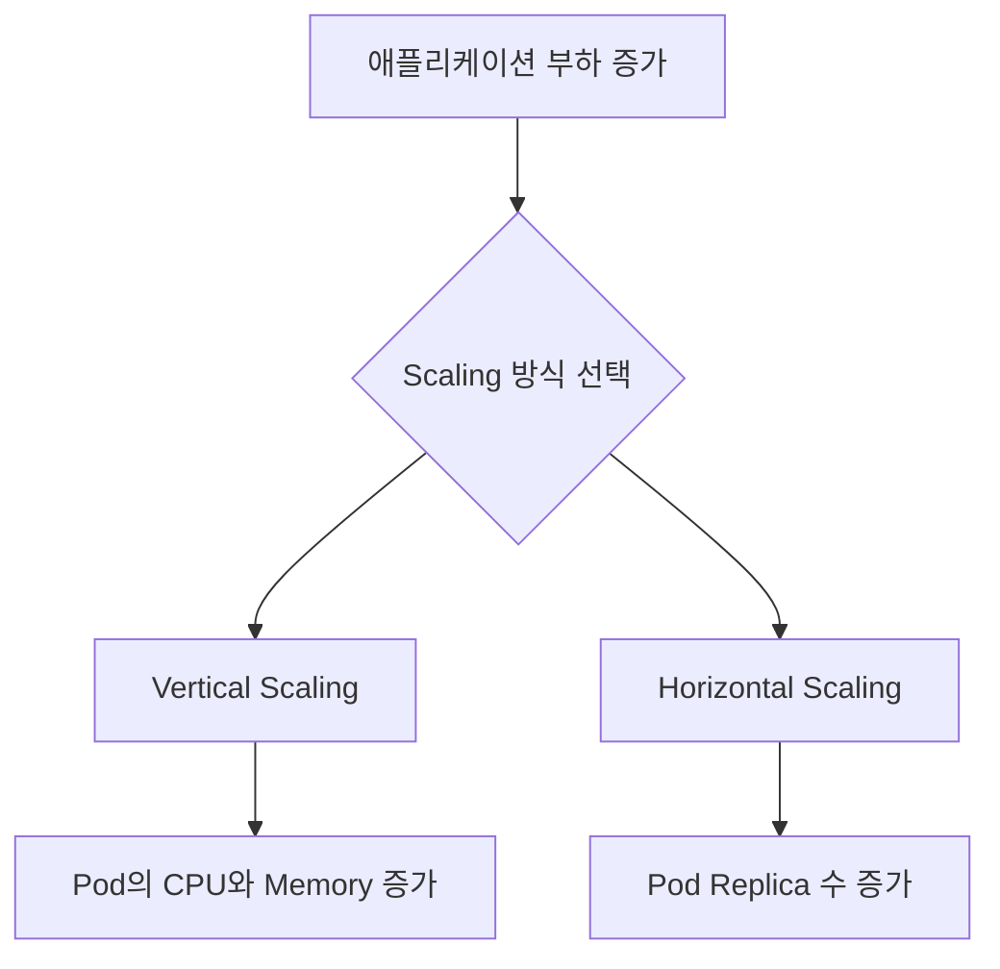
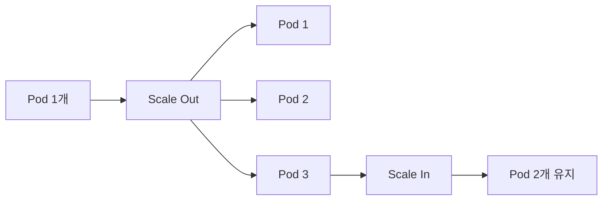
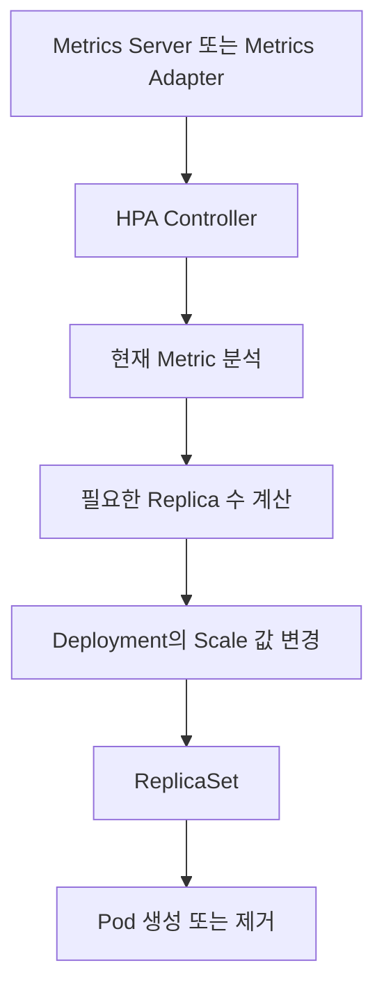
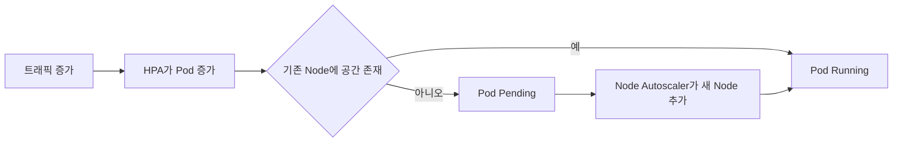

# Workload Scale 조정

# Workload Scale 조정

* toc
{:toc}

---

## 워크로드의 Scale 조정

애플리케이션에 전달되는 요청량은 시간에 따라 달라진다. 평소에는 적은 자원으로도 충분하지만 이벤트, 배치 작업, 특정 시간대의 트래픽 증가로 CPU와 Memory 사용량이 급격히 늘어날 수 있다.

이러한 변화에 대응하려면 애플리케이션이 사용할 수 있는 자원이나 인스턴스 수를 조정해야 한다. 이를 Scaling이라고 한다.

Kubernetes에서 워크로드를 확장하는 방법은 크게 두 가지로 구분할 수 있다.

- Vertical Scaling: Pod 또는 Container에 할당하는 CPU와 Memory 조정
- Horizontal Scaling: 동일한 애플리케이션을 실행하는 Pod 수량 조정



두 방식은 서로 배타적이지 않다. 먼저 Container가 정상적으로 동작할 수 있는 `requests`와 `limits`를 설정한 뒤, 트래픽 변화에는 Horizontal Scaling으로 대응하는 구성이 일반적이다.

## Vertical Scaling

Vertical Scaling은 하나의 애플리케이션 인스턴스에 더 많은 CPU와 Memory를 제공하는 방식이다.

전통적인 서버 환경에서는 더 높은 사양의 서버로 교체하거나 Virtual Machine의 CPU와 Memory를 늘리는 방식으로 수행한다. Kubernetes에서는 Container의 `resources.requests`와 `resources.limits`를 변경한다.

```yaml
apiVersion: v1
kind: Pod
metadata:
  name: sample
spec:
  containers:
    - name: app
      image: sample-server:1.0
      resources:
        requests:
          cpu: 250m
          memory: 64Mi
        limits:
          cpu: 500m
          memory: 128Mi
```

Deployment의 Pod Template에서 자원 설정을 변경하면 일반적으로 새로운 ReplicaSet이 생성되고 Pod가 순차적으로 교체된다. 최신 Kubernetes에는 실행 중인 Pod의 자원을 조정하는 기능도 있지만, Cluster 버전과 워크로드의 지원 여부를 확인해야 한다.

### CPU 단위

Kubernetes에서 CPU는 Core 또는 Millicore 단위로 표현한다.

| 설정값 | 의미 |
|---|---:|
| `1` | CPU 1개 |
| `500m` | CPU 0.5개 |
| `250m` | CPU 0.25개 |
| `100m` | CPU 0.1개 |
| `10m` | CPU 0.01개 |

다음 두 표현은 동일하다.

```yaml
cpu: 500m
```

```yaml
cpu: "0.5"
```

Kubernetes에서 CPU `1`은 Node 환경에 따라 물리 CPU Core 하나 또는 Virtual CPU 하나에 해당한다. 클라우드 Virtual Machine에서는 일반적으로 vCPU 기준으로 이해해야 한다.

`m`은 Millicpu를 의미하며 CPU 하나를 1,000으로 나눈 단위다. CPU는 `1m`보다 더 정밀한 단위로 지정할 수 없다.

### Memory 단위

Memory는 Byte를 기준으로 Decimal SI 단위 또는 Binary SI 단위를 사용할 수 있다.

| 단위 | 계산 기준 | 예시 |
|---|---|---|
| `K`, `M`, `G` | 10의 거듭제곱 | `128M`은 128,000,000 Byte |
| `Ki`, `Mi`, `Gi` | 2의 거듭제곱 | `128Mi`는 134,217,728 Byte |

실무에서는 `Mi`와 `Gi`를 많이 사용한다.

```yaml
memory: 128Mi
```

```yaml
memory: 2Gi
```

대소문자를 정확하게 구분해야 한다. `400Mi`는 약 400 Mebibyte지만 `400m`은 0.4 Byte를 의미하므로 의도와 완전히 다른 값이 된다.

### requests와 limits

Container에 할당하는 CPU와 Memory는 `requests`와 `limits`로 나누어 설정한다.

```yaml
resources:
  requests:
    cpu: 200m
    memory: 128Mi
  limits:
    cpu: 500m
    memory: 512Mi
```

| 구분 | CPU | Memory |
|---|---|---|
| `requests` | Scheduling 기준 및 CPU 경합 시 가중치 | Scheduling 기준이 되는 필요량 |
| `limits` | 사용할 수 있는 CPU 시간의 상한 | 사용할 수 있는 Memory의 상한 |
| 초과 시 | CPU Throttling 발생 가능 | OOMKilled로 Container 종료 가능 |

### CPU requests

CPU Request는 Scheduler가 Pod를 배치할 Node를 선택할 때 사용한다.

```yaml
requests:
  cpu: 500m
```

Scheduler는 Node에 이미 배치된 Pod들의 CPU Request 합계와 Node의 할당 가능한 CPU를 비교한다. 실제 CPU 사용량이 낮더라도 Request 합계가 Node의 할당 가능량을 초과하면 새로운 Pod를 배치하지 않는다.

CPU가 경합하는 상황에서는 CPU Request가 Container의 CPU 사용 가중치에도 영향을 준다. 더 큰 CPU Request를 가진 Container가 상대적으로 더 많은 CPU 시간을 받을 수 있다.

CPU Request를 “항상 독점적으로 보장되는 CPU Core”라고 이해해서는 안 된다. Scheduling과 CPU 경합 시의 기준으로 이해하는 것이 정확하다.

### CPU limits

CPU Limit은 Container가 사용할 수 있는 CPU 시간의 상한이다.

```yaml
limits:
  cpu: "1"
```

Container가 CPU Limit보다 많은 CPU를 사용하려 하면 Linux cgroup에 의해 CPU 사용이 제한될 수 있다. 이를 CPU Throttling이라고 한다.

CPU Limit을 초과했다고 Container가 종료되지는 않는다. 다만 요청 처리 시간이 증가하거나 Java Garbage Collection이 늦어지는 등 성능 문제가 발생할 수 있다.

CPU 사용량이 순간적으로 크게 증가하는 애플리케이션에서는 지나치게 낮은 CPU Limit이 오히려 응답 지연을 만들 수 있다. 일부 운영 환경에서는 CPU Request만 지정하고 CPU Limit은 생략하기도 하지만, 이는 Namespace 정책과 서비스 특성을 고려해 결정해야 한다.

### Memory requests

Memory Request는 Scheduler가 Pod를 배치할 Node를 선택할 때 사용하는 Memory 필요량이다.

```yaml
requests:
  memory: 128Mi
```

Node의 실제 Memory 사용량이 낮더라도 이미 배치된 Pod들의 Memory Request 합계가 Node의 할당 가능량에 가까우면 새로운 Pod가 `Pending` 상태에 머무를 수 있다.

Container가 Memory Request보다 많은 Memory를 사용할 수는 있지만 Node에 Memory 압박이 발생하면 Request를 초과해 사용하는 Pod가 Eviction 대상이 될 가능성이 높아질 수 있다.

### Memory limits

Memory Limit은 Container가 사용할 수 있는 Memory 상한이다.

```yaml
limits:
  memory: 512Mi
```

Container가 Memory Limit을 초과하면 Linux OOM 처리에 의해 Container 프로세스가 종료될 수 있다. Kubernetes에서는 다음과 같은 종료 사유가 표시된다.

```text
Reason: OOMKilled
Exit Code: 137
```

Memory는 CPU처럼 단순히 사용 속도를 제한하기 어렵다. 따라서 Memory Limit 초과는 성능 저하가 아니라 프로세스 종료로 이어질 수 있다는 점을 주의해야 한다.

### Request와 Limit의 관계

일반적으로 Request는 Limit보다 작거나 같아야 한다.

```text
requests <= limits
```

다음과 같이 CPU Request가 Limit보다 크면 API Server의 검증에서 거부된다.

```yaml
resources:
  requests:
    cpu: "1"
  limits:
    cpu: 500m
```

Request나 Limit을 생략하면 Cluster의 LimitRange 설정에 따라 기본값이 주입될 수 있다. 별도의 정책이 없다면 해당 자원에 명시적인 요청량 또는 상한이 없는 상태가 될 수 있다.

“설정이 없으면 Node 자원을 모두 독점적으로 사용할 수 있다”는 의미는 아니다. 다른 워크로드, 운영체제, kubelet, Container Runtime과 자원을 공유하며 Node 자원 압박 시 더 불리한 상태가 될 수 있다.

### Request와 Limit을 너무 높게 설정한 경우

| 설정 | 자원 | 지나치게 높을 때 발생할 수 있는 문제 |
|---|---|---|
| Request | CPU | Scheduler가 Node를 비어 있다고 판단하지 못해 Pod 배치 밀도가 낮아짐 |
| Request | Memory | 실제 사용량보다 많은 공간을 예약한 것처럼 Scheduling되어 자원 낭비 |
| Limit | CPU | 한 Container가 많은 CPU를 사용할 수 있어 다른 Pod와 경합 가능 |
| Limit | Memory | 한 Container가 많은 Memory를 사용해 Node Memory 압박 가능 |

높은 Limit 자체는 Scheduler가 자원을 예약하는 기준이 아니다. Scheduling에는 Request가 사용된다. 하지만 Limit이 너무 높으면 한 Pod가 실제로 많은 자원을 소비해 다른 Pod에 영향을 줄 수 있다.

### Request와 Limit을 너무 낮게 설정한 경우

| 설정 | 자원 | 지나치게 낮을 때 발생할 수 있는 문제 |
|---|---|---|
| Request | CPU | HPA CPU 사용률이 과도하게 높게 계산될 수 있음 |
| Request | Memory | Node Memory 압박 시 Eviction 위험 증가 |
| Limit | CPU | CPU Throttling으로 응답 지연 발생 |
| Limit | Memory | OOMKilled와 Container 재시작 발생 |

적절한 수치는 애플리케이션마다 다르다. 다음 데이터를 기반으로 결정해야 한다.

- 평상시 CPU와 Memory 사용량
- 최대 트래픽에서의 사용량
- Java Heap과 Non-Heap Memory
- Thread 수
- 요청 처리 시간
- Garbage Collection 시간
- Container 재시작 횟수
- OOMKilled 발생 여부
- CPU Throttling 시간

단순히 “서버 애플리케이션은 CPU 1개면 충분하다”와 같은 고정 기준을 적용해서는 안 된다.

### Container Memory와 JVM Heap Memory

Spring Boot 같은 JVM 애플리케이션에서는 Container Memory Limit 전체를 JVM Heap으로 설정하면 안 된다.

Container Memory에는 다음 영역이 모두 포함된다.

- JVM Heap
- Metaspace
- Thread Stack
- Direct Buffer
- Native Library
- JIT Compiler
- Garbage Collector
- Memory 기반 임시 파일

예를 들어 Container Memory Limit이 `512Mi`라면 JVM의 최대 Heap을 정확히 `512Mi`로 설정할 경우 Non-Heap Memory를 사용할 공간이 부족해 OOMKilled가 발생할 수 있다.

JVM Heap과 Container Memory 사이에는 충분한 여유를 두어야 한다.

### QoS Class

Kubernetes는 CPU와 Memory의 Request 및 Limit 설정에 따라 Pod에 QoS Class를 부여한다.

| QoS Class | 조건 |
|---|---|
| `Guaranteed` | 모든 Container의 CPU·Memory Request와 Limit이 지정되고 각각 동일함 |
| `Burstable` | Guaranteed는 아니지만 하나 이상의 Request 또는 Limit이 존재함 |
| `BestEffort` | 모든 Container에 CPU·Memory Request와 Limit이 없음 |

다음 설정은 Request와 Limit이 서로 다르므로 `Burstable`이다.

```yaml
resources:
  requests:
    cpu: 500m
    memory: 128Mi
  limits:
    cpu: "1"
    memory: 512Mi
```

Pod 상세 정보에서 확인할 수 있다.

```shell
kubectl describe pod <POD_NAME>
```

```text
QoS Class: Burstable
```

Node에 Memory 압박이 발생했을 때 QoS Class, Priority, Request 초과 사용량 등을 기준으로 Eviction 대상이 결정될 수 있다.

CPU와 Memory 단위 및 적용 방식은 [Kubernetes Resource Management 공식 문서](https://kubernetes.io/docs/concepts/configuration/manage-resources-containers/)에서 확인할 수 있다.

## Horizontal Scaling

Horizontal Scaling은 동일한 애플리케이션을 실행하는 Pod 수를 늘리거나 줄이는 방식이다.



Stateless 애플리케이션은 각 Pod가 서로 교체 가능하므로 Horizontal Scaling에 적합하다.

다음 객체의 Replica 수를 조정할 수 있다.

- Deployment
- ReplicaSet
- StatefulSet

DaemonSet은 Node 조건에 따라 Pod 수가 결정되므로 일반적인 `replicas` 필드를 사용하지 않는다.

### Deployment의 replicas 설정

```yaml
apiVersion: apps/v1
kind: Deployment
metadata:
  name: nginx-deployment
  labels:
    app: nginx
spec:
  replicas: 5
  strategy:
    type: RollingUpdate
    rollingUpdate:
      maxUnavailable: 1
      maxSurge: 20%
  selector:
    matchLabels:
      app: nginx
  template:
    metadata:
      labels:
        app: nginx
    spec:
      containers:
        - name: nginx
          image: nginx:1.28-alpine
```

`replicas: 5`는 동일한 Pod 다섯 개를 유지한다.

Replica 수를 증가시키면 ReplicaSet이 추가 Pod를 생성한다. 수량을 줄이면 일부 Pod를 종료한다.

```shell
kubectl scale deployment nginx-deployment --replicas=5
```

### Horizontal Scaling이 유리한 조건

다음과 같은 Stateless 애플리케이션은 Horizontal Scaling을 적용하기 쉽다.

- 사용자 Session을 외부 Redis에 저장
- 업로드 파일을 Object Storage에 저장
- Pod 로컬 디스크에 영구 데이터를 저장하지 않음
- 여러 Pod가 같은 요청을 처리할 수 있음
- Service를 통해 요청을 분산할 수 있음

반대로 로컬 Memory에 사용자 Session을 저장하거나 Pod별 데이터가 다르면 요청이 어느 Pod로 전달되는지에 따라 결과가 달라질 수 있다.

### Vertical Scaling과 Horizontal Scaling 비교

| 구분 | Vertical Scaling | Horizontal Scaling |
|---|---|---|
| 조정 대상 | Pod당 CPU와 Memory | Pod 수 |
| 장점 | 구조가 단순함 | 장애 분산과 처리량 확장에 유리 |
| 단점 | 단일 인스턴스 한계 존재 | Stateless 설계와 부하 분산 필요 |
| 변경 영향 | Pod 교체가 필요할 수 있음 | Pod 생성 및 삭제 |
| 자동화 객체 | VPA | HPA |
| 적합한 대상 | 단일 연산 성능이 중요한 작업 | Web, API, Worker |

무작정 Pod당 자원을 크게 늘리는 것보다 작은 자원으로 효율적으로 동작하도록 애플리케이션을 개발하고 필요할 때 Pod 수를 늘리는 방식이 유리할 수 있다.

다만 Pod 수를 늘려도 단일 요청이 요구하는 CPU나 Memory가 줄어드는 것은 아니다. 요청 하나를 처리하는 데 최소 2Gi Memory가 필요하다면 Pod의 Memory를 그보다 작게 설정할 수 없다.

## Horizontal Pod Autoscaler

Horizontal Pod Autoscaler는 Metric을 지속적으로 확인하고 Deployment나 StatefulSet 같은 Workload의 Replica 수를 자동으로 조정하는 Kubernetes 객체다.



HPA는 다음과 같은 Metric을 기준으로 Scale할 수 있다.

- CPU 사용량
- Memory 사용량
- Pod Custom Metric
- Object Metric
- External Metric

CPU와 Memory 외의 Metric을 사용하려면 Prometheus Adapter 같은 별도의 Metrics Adapter가 필요할 수 있다.

### HPA 동작 조건

CPU 사용률을 기준으로 HPA를 사용하려면 다음 조건이 필요하다.

1. Metrics Server 또는 `metrics.k8s.io` 제공자
2. Container의 CPU Request
3. HPA가 참조할 Deployment 또는 StatefulSet
4. 최소 및 최대 Replica 수
5. 목표 CPU 사용률

Metric 수집이 정상인지 확인한다.

```shell
kubectl top nodes
kubectl top pods
```

다음과 같은 오류가 발생하면 Metric API가 준비되지 않은 상태다.

```text
error: Metrics API not available
```

로컬 Cluster에 Metrics Server가 기본 설치되지 않았다면 Cluster 종류에 맞는 설치가 필요하다.

### HPA의 CPU 사용률 계산

HPA의 CPU `averageUtilization`은 Container의 CPU Limit이 아니라 CPU Request를 기준으로 계산한다.

예를 들어 다음과 같이 설정된 Pod가 있다고 가정한다.

```yaml
resources:
  requests:
    cpu: 500m
  limits:
    cpu: "1"
```

현재 CPU 사용량이 `250m`이라면 CPU 사용률은 다음과 같다.

```text
250m / 500m × 100 = 50%
```

CPU Request가 없으면 HPA가 CPU 사용률을 계산하지 못할 수 있다. 따라서 HPA를 사용하려면 적절한 CPU Request가 필수적이다.

HPA는 개념적으로 다음 계산식을 사용한다.

```text
desiredReplicas =
ceil(currentReplicas × currentMetricValue / desiredMetricValue)
```

현재 Replica가 2개이고 평균 CPU 사용률이 80%, 목표 사용률이 50%라면 다음과 같다.

```text
ceil(2 × 80 / 50) = 4
```

계산 결과 HPA는 Replica를 4개로 늘리는 방향으로 조정할 수 있다. 실제 동작에서는 허용 오차, 준비되지 않은 Pod, Metric 누락, 안정화 정책 등이 추가로 적용된다.

### HPA 설정값 예시

다음은 Pod를 최소 2개, 최대 5개 사이에서 유지하면서 평균 CPU 사용률을 50%에 맞추는 HPA다.

```yaml
apiVersion: autoscaling/v2
kind: HorizontalPodAutoscaler
metadata:
  name: nginx-app
spec:
  scaleTargetRef:
    apiVersion: apps/v1
    kind: Deployment
    name: nginx-app
  minReplicas: 2
  maxReplicas: 5
  behavior:
    scaleUp:
      stabilizationWindowSeconds: 0
      policies:
        - type: Percent
          value: 100
          periodSeconds: 60
        - type: Pods
          value: 2
          periodSeconds: 60
      selectPolicy: Max
    scaleDown:
      stabilizationWindowSeconds: 300
      policies:
        - type: Percent
          value: 50
          periodSeconds: 60
      selectPolicy: Max
  metrics:
    - type: Resource
      resource:
        name: cpu
        target:
          type: Utilization
          averageUtilization: 50
```

### HPA 주요 필드

#### scaleTargetRef

```yaml
scaleTargetRef:
  apiVersion: apps/v1
  kind: Deployment
  name: nginx-app
```

HPA가 Replica 수를 조정할 대상 객체를 지정한다.

#### minReplicas와 maxReplicas

```yaml
minReplicas: 2
maxReplicas: 5
```

HPA가 조정할 수 있는 Replica 수의 범위를 지정한다.

부하가 낮아도 최소 두 개의 Pod를 유지하고, 부하가 높아도 최대 다섯 개까지만 증가한다.

`maxReplicas`를 지나치게 크게 설정하면 갑작스러운 부하에 많은 Pod가 생성되면서 Node 자원을 모두 사용할 수 있다.

#### averageUtilization

```yaml
target:
  type: Utilization
  averageUtilization: 50
```

대상 Pod들의 평균 CPU 사용률을 CPU Request의 50% 수준으로 유지하도록 설정한다.

#### behavior

`behavior`는 Scale Up과 Scale Down 속도를 제어한다.

Scale Up은 부하 증가에 빠르게 대응하고, Scale Down은 일시적인 Metric 감소로 Pod가 반복해서 줄어드는 것을 방지하도록 더 긴 안정화 시간을 두는 경우가 많다.

### HPA가 즉시 반응하지 않는 이유

HPA는 요청이 증가한 순간 즉시 Pod를 생성하지 않는다.

다음 과정마다 시간이 필요하다.

1. 애플리케이션 부하 증가
2. Metric 수집
3. HPA Controller의 Metric 조회
4. Replica 수 계산
5. Deployment Scale 변경
6. Pod Scheduling
7. Image Pull
8. Container 시작
9. Startup Probe 성공
10. Readiness Probe 성공
11. Service 트래픽 합류

따라서 갑작스러운 Spike에 대응하려면 최소 Replica 수, 사전 확장, 빠른 애플리케이션 시작, 적절한 Probe와 Node 여유 자원이 필요하다.

### HPA와 Node Auto Scaling의 차이

HPA는 Pod 수를 조정하지만 Node 수를 늘리지는 않는다.



| 구분 | HPA | Node Autoscaler |
|---|---|---|
| 조정 대상 | Pod Replica | Worker Node |
| 기준 | CPU, Memory, Custom Metric | Scheduling할 수 없는 Pod와 Node 활용도 |
| 결과 | Deployment 또는 StatefulSet Scale | Virtual Machine 또는 Node 추가·제거 |

HPA로 Pod를 늘렸지만 Node 자원이 부족하면 새 Pod는 `Pending` 상태에 머무른다. Cluster Autoscaler나 Karpenter 같은 Node Auto Scaling 구성이 있다면 Pending Pod의 Request를 기준으로 새로운 Node를 추가할 수 있다.

HPA와 Node Auto Scaling은 서로 다른 기능이며, HPA가 Cloud Auto Scaling Group을 직접 조정하는 것은 아니다.

## Workload Scale 조정 실습

### 실습 목표

다음 작업을 수행한다.

1. Deployment에 CPU와 Memory Request 및 Limit 추가
2. 변경된 Deployment 적용
3. Pod의 Resource와 QoS Class 확인
4. Replica 수를 3개에서 5개로 증가
5. Node 자원보다 많은 Pod를 생성해 Pending 상태 확인
6. HPA를 적용해 자동 Scale 동작 확인

### 사전 조건

```shell
kubectl cluster-info
kubectl get nodes
kubectl get deployment nginx-app
kubectl get pods
```

기존 Deployment를 삭제했다면 Manifest를 다시 적용한다.

```shell
kubectl apply -f first-deployment.yaml
```

### Deployment YAML 작성

`first-deployment.yaml`을 다음과 같이 작성한다.

```yaml
apiVersion: apps/v1
kind: Deployment
metadata:
  name: nginx-app
  labels:
    app: nginx
spec:
  replicas: 3
  revisionHistoryLimit: 5
  strategy:
    type: RollingUpdate
    rollingUpdate:
      maxUnavailable: 1
      maxSurge: 1
  selector:
    matchLabels:
      app: nginx
  template:
    metadata:
      labels:
        app: nginx
    spec:
      terminationGracePeriodSeconds: 30
      containers:
        - name: nginx
          image: nginx:1.28-alpine
          imagePullPolicy: IfNotPresent
          ports:
            - name: http
              containerPort: 80
              protocol: TCP
          resources:
            requests:
              cpu: 500m
              memory: 128Mi
            limits:
              cpu: "1"
              memory: 512Mi
          readinessProbe:
            httpGet:
              path: /
              port: http
            initialDelaySeconds: 2
            periodSeconds: 5
            timeoutSeconds: 2
            failureThreshold: 3
          livenessProbe:
            httpGet:
              path: /
              port: http
            initialDelaySeconds: 10
            periodSeconds: 10
            timeoutSeconds: 2
            failureThreshold: 3
---
apiVersion: v1
kind: Service
metadata:
  name: nginx-app
  labels:
    app: nginx
spec:
  type: ClusterIP
  selector:
    app: nginx
  ports:
    - name: http
      port: 80
      targetPort: http
      protocol: TCP
```

### 설정 설명

`replicas: 3`은 Nginx Pod 세 개를 유지한다.

각 Container는 Scheduling 시 다음 자원을 요청한다.

```yaml
requests:
  cpu: 500m
  memory: 128Mi
```

Container가 사용할 수 있는 최대 자원은 다음과 같다.

```yaml
limits:
  cpu: "1"
  memory: 512Mi
```

Pod 하나의 Request가 CPU `500m`, Memory `128Mi`이므로 Pod 세 개의 Request 합계는 다음과 같다.

```text
CPU: 500m × 3 = 1500m = 1.5 CPU
Memory: 128Mi × 3 = 384Mi
```

실제로 Pod에는 Sidecar, Init Container, Pod Overhead 등이 추가될 수 있으므로 복잡한 구성에서는 단순 합계 외의 Scheduling 규칙도 확인해야 한다.

### 변경 사항 검증과 적용

```shell
kubectl apply \
  --dry-run=server \
  -f first-deployment.yaml
```

변경 사항을 확인한다.

```shell
kubectl diff -f first-deployment.yaml
```

적용한다.

```shell
kubectl apply -f first-deployment.yaml
```

```text
deployment.apps/nginx-app configured
service/nginx-app created
```

Resource 설정은 Pod Template 변경이므로 기존 Pod에 값만 추가되는 것이 아니라 새로운 ReplicaSet과 Pod가 생성되면서 Rolling Update가 진행된다.

```shell
kubectl rollout status deployment/nginx-app
kubectl get replicasets
kubectl get pods
```

### Pod Resource 확인

Pod 이름을 확인한다.

```shell
kubectl get pods
```

Pod 상세 정보를 조회한다.

```shell
kubectl describe pod <POD_NAME>
```

다음과 같은 항목을 확인한다.

```text
Limits:
  cpu:     1
  memory:  512Mi
Requests:
  cpu:      500m
  memory:   128Mi
QoS Class:  Burstable
```

Container 상태도 확인한다.

```text
State:          Running
Ready:          True
Restart Count:  0
```

### Node에 할당된 자원 확인

```shell
kubectl describe node
```

출력 하단의 `Allocated resources`에서 Node에 배치된 Pod들의 Request와 Limit 합계를 확인할 수 있다.

실제 사용량은 다음 명령으로 확인한다.

```shell
kubectl top nodes
kubectl top pods
```

`describe node`의 Request는 Scheduling 기준이고, `kubectl top`은 현재 Metric 사용량이다. 두 값을 혼동해서는 안 된다.

### Pod 수량을 5개로 변경

YAML의 Replica 수를 변경한다.

```yaml
spec:
  replicas: 5
```

전체 Manifest를 다시 적용한다.

```shell
kubectl apply -f first-deployment.yaml
```

Pod 목록을 확인한다.

```shell
kubectl get pods
```

기존 Pod 세 개에 새로운 Pod 두 개가 추가되어 총 다섯 개가 `Running` 상태가 된다.

Pod 다섯 개의 Request 합계는 다음과 같다.

```text
CPU: 500m × 5 = 2500m = 2.5 CPU
Memory: 128Mi × 5 = 640Mi
```

### 명령어를 이용한 Scale

YAML을 수정하지 않고 명령어로도 Replica 수를 변경할 수 있다.

```shell
kubectl scale deployment nginx-app --replicas=5
```

Scale 결과를 확인한다.

```shell
kubectl get deployment nginx-app
kubectl get pods
```

다만 이후 `replicas: 3`이 작성된 YAML을 다시 적용하면 세 개로 돌아갈 수 있다. 선언형 운영에서는 YAML을 원하는 상태의 기준으로 관리해야 한다.

### Pod 수량을 크게 증가시키기

Node 자원보다 많은 Pod를 요청해 Scheduling 실패를 확인할 수 있다.

예를 들어 Replica를 25개로 늘린다.

```shell
kubectl scale deployment nginx-app --replicas=25
```

Pod 25개의 Request 합계는 다음과 같다.

```text
CPU: 500m × 25 = 12500m = 12.5 CPU
Memory: 128Mi × 25 = 3200Mi
```

로컬 Cluster의 Node가 12.5 CPU와 필요한 Memory를 제공하지 못하면 일부 Pod는 `Pending` 상태에 머무른다.

```shell
kubectl get pods
```

```text
NAME                         READY   STATUS    RESTARTS   AGE
nginx-app-xxxxxxxxxx-aaaaa   1/1     Running   0          30s
nginx-app-xxxxxxxxxx-bbbbb   0/1     Pending   0          10s
nginx-app-xxxxxxxxxx-ccccc   0/1     Pending   0          10s
```

### Pending 원인 확인

```shell
kubectl describe pod <PENDING_POD_NAME>
```

Event에서 다음과 같은 메시지를 확인할 수 있다.

```text
0/1 nodes are available: insufficient cpu
```

또는 다음과 같이 표시될 수 있다.

```text
0/1 nodes are available: insufficient memory
```

중요한 점은 실제 CPU 사용량이 낮아도 Scheduler는 Request를 기준으로 판단한다는 것이다. 현재 실행 중인 Pod가 CPU를 거의 사용하지 않더라도 Request 합계가 Node의 Allocatable CPU를 초과하면 추가 Pod를 배치하지 않는다.

실습 후 Replica 수를 원래대로 줄인다.

```shell
kubectl scale deployment nginx-app --replicas=3
```

YAML의 `replicas` 값도 동일하게 수정한다.

## HPA 적용 실습

### Metrics Server 확인

```shell
kubectl top nodes
kubectl top pods
```

Metric이 출력되어야 HPA가 CPU 사용률을 계산할 수 있다.

### HPA YAML 작성

`first-hpa.yaml`을 작성한다.

```yaml
apiVersion: autoscaling/v2
kind: HorizontalPodAutoscaler
metadata:
  name: nginx-app
spec:
  scaleTargetRef:
    apiVersion: apps/v1
    kind: Deployment
    name: nginx-app
  minReplicas: 2
  maxReplicas: 5
  behavior:
    scaleUp:
      stabilizationWindowSeconds: 0
      policies:
        - type: Pods
          value: 2
          periodSeconds: 60
        - type: Percent
          value: 100
          periodSeconds: 60
      selectPolicy: Max
    scaleDown:
      stabilizationWindowSeconds: 300
      policies:
        - type: Percent
          value: 50
          periodSeconds: 60
      selectPolicy: Max
  metrics:
    - type: Resource
      resource:
        name: cpu
        target:
          type: Utilization
          averageUtilization: 50
```

적용한다.

```shell
kubectl apply -f first-hpa.yaml
```

```text
horizontalpodautoscaler.autoscaling/nginx-app created
```

### HPA 상태 확인

```shell
kubectl get hpa
```

```text
NAME        REFERENCE              TARGETS       MINPODS   MAXPODS   REPLICAS
nginx-app   Deployment/nginx-app   10%/50%       2         5         2
```

`TARGETS`가 `<unknown>/50%`로 표시되면 다음을 확인한다.

- Metrics Server 설치 상태
- Pod의 CPU Request
- Pod가 Ready 상태인지
- Metric 수집이 시작될 만큼 시간이 지났는지

상세 상태를 확인한다.

```shell
kubectl describe hpa nginx-app
```

### 부하 생성

별도의 Pod에서 Nginx Service로 반복 요청을 보낸다.

```shell
kubectl run load-generator \
  --image=busybox:1.36 \
  --restart=Never \
  -it \
  --rm \
  -- /bin/sh -c \
  "while sleep 0.01; do wget -q -O- http://nginx-app; done"
```

다른 Terminal에서 HPA와 Pod 수를 관찰한다.

```shell
kubectl get hpa --watch
```

```shell
kubectl get pods --watch
```

CPU 사용률이 목표치보다 높아지면 HPA가 Replica 수를 최대 다섯 개 범위 안에서 증가시킨다.

Nginx는 정적 파일을 매우 적은 CPU로 처리하므로 로컬 환경에서는 요청을 많이 보내도 목표 CPU에 도달하지 않을 수 있다. 실제 HPA 검증에는 CPU 연산을 수행하는 테스트 애플리케이션이나 운영 애플리케이션의 부하 테스트가 더 적합하다.

### 부하 제거 후 Scale In

부하 생성 명령을 종료하면 CPU 사용률이 감소한다.

Scale Down에는 안정화 시간이 설정되어 있으므로 Pod 수가 즉시 줄어들지 않을 수 있다. Metric이 일정 시간 낮게 유지되면 HPA가 Replica 수를 줄인다.

```shell
kubectl get hpa --watch
```

### HPA와 replicas 필드 관리

HPA가 Deployment의 Replica 수를 관리할 때 동일한 필드를 YAML과 사람이 반복해서 변경하면 충돌할 수 있다.

HPA 적용 후 Git에서 관리하는 Deployment Manifest를 계속 적용한다면 `spec.replicas`의 관리 주체를 정리해야 한다. HPA가 Scale을 관리하는 환경에서는 Deployment Manifest에서 `replicas`를 제거하고 HPA의 `minReplicas`와 `maxReplicas`를 기준으로 운영하는 방식을 고려할 수 있다.

단, 이미 운영 중인 Deployment에서 `replicas`를 무계획하게 제거하면 적용 도구와 Field Manager에 따라 Pod 수가 의도하지 않게 변경될 수 있으므로 변경 전 차이를 확인해야 한다.

```shell
kubectl diff -f first-deployment.yaml
```

### HPA 실습 자원 삭제

```shell
kubectl delete -f first-hpa.yaml
```

HPA를 삭제해도 Deployment와 현재 Pod가 자동으로 삭제되는 것은 아니다. Deployment의 현재 Replica 값은 별도로 조정한다.

```shell
kubectl scale deployment nginx-app --replicas=3
```

전체 실습을 종료한다면 다음 명령을 실행한다.

```shell
kubectl delete -f first-deployment.yaml
```

## Scale 장애와 문제 해결

### Pod가 Pending에 머무르는 경우

```shell
kubectl describe pod <POD_NAME>
kubectl describe node
kubectl get events --sort-by=.metadata.creationTimestamp
```

주요 원인은 다음과 같다.

- CPU Request 합계가 Node Allocatable CPU보다 큼
- Memory Request 합계가 Node Allocatable Memory보다 큼
- Node Selector 또는 Affinity 불일치
- Taint를 허용하는 Toleration 없음
- PersistentVolume 연결 실패
- ResourceQuota 초과

### Container가 OOMKilled되는 경우

```shell
kubectl describe pod <POD_NAME>
kubectl logs <POD_NAME> --previous
```

다음 항목을 확인한다.

- Memory Limit이 너무 낮은지
- Memory Leak이 있는지
- JVM Heap이 Container Limit에 비해 지나치게 큰지
- Memory 기반 `emptyDir` 사용량
- 동시 요청 수가 지나치게 많은지

Memory Limit만 무작정 늘리기 전에 애플리케이션의 Memory 사용 구조를 분석해야 한다.

### CPU 사용률이 높고 응답이 느린 경우

```shell
kubectl top pod <POD_NAME>
kubectl describe pod <POD_NAME>
```

다음 가능성을 확인한다.

- CPU Limit으로 인한 Throttling
- CPU Request가 실제 사용량보다 지나치게 낮음
- HPA 최대 Replica 도달
- Node CPU 포화
- 애플리케이션의 비효율적인 연산
- 과도한 Thread와 Context Switching

### HPA가 동작하지 않는 경우

```shell
kubectl get hpa
kubectl describe hpa nginx-app
kubectl top pods
kubectl get apiservice | grep metrics
```

주요 원인은 다음과 같다.

- Metrics Server 미설치
- Metric API 오류
- CPU Request 누락
- HPA 대상 Deployment 이름 오류
- 대상 Pod가 Ready 상태가 아님
- 현재 사용률이 목표보다 낮음
- 이미 `maxReplicas`에 도달
- Scale Down 안정화 시간 적용 중

### Pod 수는 늘었지만 처리량이 증가하지 않는 경우

Horizontal Scaling은 애플리케이션 외부의 병목을 자동으로 해결하지 않는다.

다음 구성 요소가 병목일 수 있다.

- 데이터베이스 Connection Pool
- 데이터베이스 최대 연결 수
- Redis Connection
- 외부 API Rate Limit
- Message Queue Partition 수
- Load Balancer
- 공유 Storage
- Network 대역폭

Pod 수를 늘릴 때는 애플리케이션의 Connection Pool과 외부 시스템 용량도 함께 계산해야 한다.

예를 들어 Pod당 데이터베이스 Connection Pool이 20개이고 Pod가 5개라면 최대 100개의 연결이 생성될 수 있다.

```text
Pod당 Connection Pool × Pod 수
= 전체 예상 Connection 수
```

HPA로 Pod가 자동 증가한다면 데이터베이스가 최대 Replica 기준의 연결 수를 감당할 수 있는지 확인해야 한다.

## 실무적인 Scale 설정 방향

### 작은 Request가 항상 좋은 것은 아니다

Request가 작으면 같은 Node에 더 많은 Pod를 배치할 수 있지만 실제 사용량보다 지나치게 낮으면 Node에 과도한 Pod가 배치될 수 있다.

또한 HPA CPU 사용률은 CPU Request를 기준으로 계산하므로 너무 낮은 Request는 CPU 사용률을 과장하고 불필요한 Scale Out을 유발할 수 있다.

### 큰 Request가 항상 안전한 것도 아니다

실제 사용량보다 큰 Request는 Scheduling 가능한 Pod 수를 줄이고 Node 비용을 증가시킨다. Node의 실제 사용량은 낮은데도 추가 Pod가 Pending 상태가 될 수 있다.

### Metric을 기반으로 조정한다

초기값을 설정한 뒤 실제 Metric을 관찰하면서 조정해야 한다.

- CPU 사용량의 평균과 상위 구간
- Memory Working Set
- CPU Throttling
- OOMKilled
- 응답 시간
- 초당 요청 수
- Queue 적체량
- Garbage Collection
- Pod Startup 시간

### 부하 테스트와 장애 테스트를 함께 수행한다

정상 부하뿐 아니라 다음 상황도 확인해야 한다.

- 갑작스러운 트래픽 증가
- HPA 최대 Replica 도달
- Node 자원 부족
- 새 Node 추가 지연
- Pod 시작 지연
- Readiness 실패
- 데이터베이스 Connection 고갈
- Scale In 중 요청 종료
- Metric 수집 장애

## 정리

Kubernetes에서 Scaling은 애플리케이션 부하에 맞게 자원을 조정하는 과정이다.

Vertical Scaling은 Pod 또는 Container에 할당하는 CPU와 Memory를 조정한다. CPU와 Memory는 `requests`와 `limits`로 나누어 설정한다.

- Request는 Scheduler가 Pod를 배치할 때 사용하는 기준이다.
- CPU Limit을 초과하면 CPU Throttling이 발생할 수 있다.
- Memory Limit을 초과하면 OOMKilled로 Container가 종료될 수 있다.
- Request가 너무 높으면 Node 자원을 비효율적으로 사용한다.
- Request가 너무 낮으면 과도한 Pod 배치와 부정확한 HPA 동작이 발생할 수 있다.

Horizontal Scaling은 동일한 애플리케이션을 실행하는 Pod 수를 조정한다. Deployment의 `replicas`를 수정하거나 `kubectl scale` 명령으로 수동 조정할 수 있다.

HPA는 CPU, Memory 또는 Custom Metric을 지속적으로 확인하고 Replica 수를 자동으로 변경한다. CPU 사용률 기반 HPA는 CPU Request를 기준으로 사용률을 계산하므로 적절한 Request 설정이 필수적이다.

HPA는 Pod 수를 조정할 뿐 Node를 직접 추가하지 않는다. 새 Pod를 배치할 Node 자원이 부족하면 Pod는 `Pending` 상태가 되며, 별도의 Node Auto Scaling 구성이 있어야 Worker Node가 추가된다.

안정적인 Auto Scaling을 위해서는 Resource 설정뿐 아니라 Metric 수집, Probe, Pod 시작 시간, Node 여유 자원, 외부 데이터베이스와 Connection Pool까지 함께 고려해야 한다.
