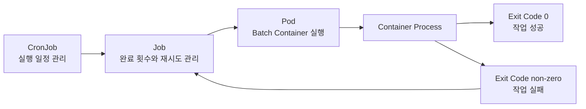
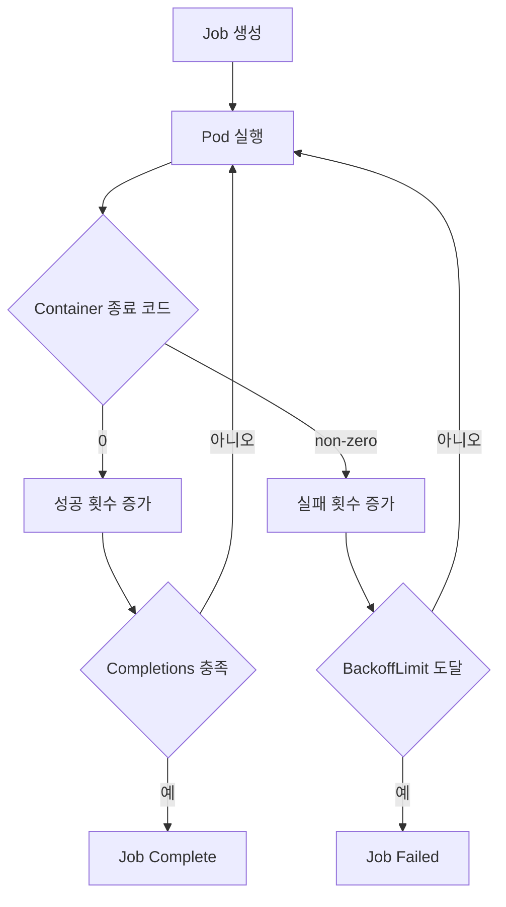
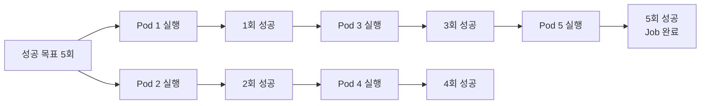
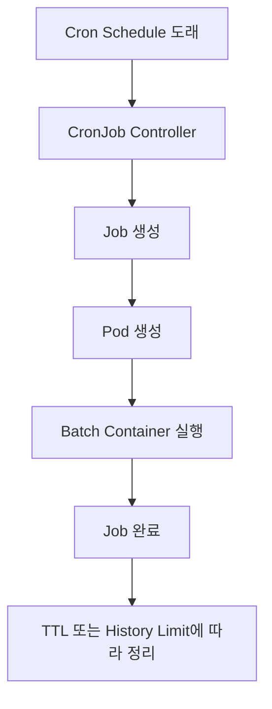

# Batch Application

# Batch Application

* toc
{:toc}

---

## Kubernetes에서 Batch Application 실행하기

웹 서버와 같은 애플리케이션은 사용자의 요청을 계속 받아야 하므로 프로세스가 종료되지 않는 것을 전제로 운영한다. 반면 Batch Application은 정해진 작업을 수행한 뒤 종료되는 것이 정상이다. 데이터 집계, 리포트 생성, 파일 변환, 정기 백업 등이 대표적인 예다.

Kubernetes에서는 이러한 작업을 `Job`과 `CronJob`으로 관리한다. Job은 작업이 정해진 횟수만큼 성공할 때까지 Pod를 실행하고, CronJob은 지정한 일정에 따라 Job을 생성한다.



### 서버 애플리케이션과 Batch Application의 차이

Deployment로 실행하는 서버 애플리케이션은 계속 실행되는 것이 정상이다. 컨테이너 프로세스가 종료되면 장애로 판단하고 다시 시작하는 구성이 일반적이다.

Batch Application은 반대다. 컨테이너가 작업을 마치고 종료 코드 `0`으로 끝나는 것이 정상적인 완료 조건이다. 따라서 Batch Pod를 만들 때는 컨테이너 재시작 정책과 Job의 재시도 정책을 구분해서 설정해야 한다.

| 구분 | 서버 애플리케이션 | Batch Application |
|---|---|---|
| 대표 워크로드 | Deployment, StatefulSet | Job, CronJob |
| 실행 방식 | 지속 실행 | 작업 완료 후 종료 |
| 정상 상태 | 프로세스가 계속 실행됨 | 프로세스가 종료 코드 `0`으로 종료됨 |
| 장애 처리 | 컨테이너 재시작 또는 Pod 교체 | 실패한 작업 재시도 |
| 주요 설정 | Replica, Probe, RollingUpdate | Completions, Parallelism, BackoffLimit |

### Pod의 restartPolicy

`restartPolicy`는 Pod가 아니라 **Pod 안에서 종료된 컨테이너를 kubelet이 다시 시작할 것인지** 결정하는 설정이다.

#### Always

컨테이너 종료 코드와 관계없이 종료된 컨테이너를 다시 시작한다. 일반 Pod의 기본값이며 Deployment가 관리하는 서버 애플리케이션에서 주로 사용한다.

Batch Application에서 `Always`를 사용하면 작업을 정상적으로 완료한 컨테이너까지 다시 실행되므로 Job의 완료 조건을 충족할 수 없다. 이 때문에 Job의 Pod 템플릿에서는 `Never` 또는 `OnFailure`만 사용할 수 있다.

#### OnFailure

컨테이너 프로세스가 `0`이 아닌 종료 코드로 끝났을 때 같은 Pod 안에서 컨테이너를 다시 시작한다.

Pod 이름과 저장공간은 유지되지만 컨테이너 프로세스는 새로 시작된다. 재시작 과정에서 이전 실행의 임시 파일이 남아 있거나 작업이 일부만 반영되었다면 중복 처리가 발생할 수 있으므로 주의해야 한다.

#### Never

컨테이너 프로세스가 종료되어도 같은 Pod 안에서 다시 시작하지 않는다. 작업이 실패하면 해당 Pod는 `Failed` 상태가 되고, Job Controller가 필요에 따라 새로운 Pod를 생성한다.

실패한 실행의 로그와 상태를 Pod 단위로 구분하기 쉬워 Batch 작업을 개발하거나 장애를 분석할 때 유용하다.

| 정책 | 종료 코드 `0` | 종료 코드 `0` 이외 | Job 사용 가능 여부 |
|---|---|---|---|
| `Always` | 컨테이너 재시작 | 컨테이너 재시작 | 사용 불가 |
| `OnFailure` | 재시작하지 않음 | 같은 Pod에서 컨테이너 재시작 | 사용 가능 |
| `Never` | 재시작하지 않음 | 재시작하지 않음 | 사용 가능 |

여기서 `restartPolicy: Never`라고 해서 작업 재시도까지 하지 않는 것은 아니다. 컨테이너는 같은 Pod에서 재시작되지 않지만, Job Controller가 실패한 Pod를 대신할 새로운 Pod를 만들 수 있다.

### Job

Job은 하나 이상의 Pod를 실행하고, 지정한 횟수만큼 작업이 성공적으로 끝날 때까지 실행 상태를 관리한다.

Deployment가 원하는 수의 Pod를 계속 실행 상태로 유지한다면, Job은 원하는 수의 **성공한 실행 결과**를 만드는 데 목적이 있다.



### Job의 주요 설정

#### completions

`completions`는 Job이 완료되기 위해 필요한 성공 횟수다.

```yaml
completions: 5
```

이 설정은 Pod가 다섯 번 성공적으로 종료되어야 Job이 완료된다는 의미다. 필드명은 `completion`이 아니라 복수형인 `completions`를 사용해야 한다.

#### parallelism

`parallelism`은 동시에 실행할 수 있는 Pod의 최대 수다.

```yaml
parallelism: 2
```

`completions: 5`, `parallelism: 2`라면 우선 Pod 두 개를 실행한다. 하나가 먼저 끝나면 나머지 Pod를 기다렸다가 두 개씩 묶어서 실행하는 것이 아니라, 빈 실행 자리를 채우기 위해 다음 Pod가 바로 생성될 수 있다.

마지막에 남은 성공 횟수가 하나라면 Pod도 하나만 실행된다.



#### backoffLimit

`backoffLimit`는 작업 실패를 허용할 재시도 한도를 설정한다.

```yaml
backoffLimit: 4
```

실패가 발생하면 Job Controller는 즉시 무한 반복하지 않고 지수 백오프를 적용해 점차 간격을 늘리며 재시도한다. 실패 횟수가 한도에 도달하면 Job은 `Failed` 상태가 된다.

`restartPolicy: Never`에서는 실패한 Pod를 대신할 새 Pod가 만들어진다. `restartPolicy: OnFailure`에서는 동일한 Pod 안의 컨테이너 재시작 횟수도 Job 실패 판단에 영향을 줄 수 있다.

#### ttlSecondsAfterFinished

완료된 Job과 Pod를 일정 시간이 지난 뒤 자동으로 정리한다.

```yaml
ttlSecondsAfterFinished: 60
```

Job이 `Complete` 또는 `Failed` 상태가 된 후 60초가 지나면 TTL Controller가 Job과 종속된 Pod를 삭제할 수 있다. 이 값을 지정하지 않으면 완료된 Job과 Pod가 계속 남아 클러스터 객체 수가 불필요하게 증가할 수 있다.

#### activeDeadlineSeconds

Batch 작업이 실행될 수 있는 전체 제한 시간을 지정한다.

```yaml
activeDeadlineSeconds: 300
```

작업이 재시도를 포함해 300초 안에 끝나지 않으면 실행 중인 Pod가 종료되고 Job은 실패 처리된다. 무한 대기나 장시간 정체가 발생할 수 있는 외부 연동 작업에 유용하다.

### Job Manifest 작성

다음 Job은 BusyBox 컨테이너에서 2초마다 메시지를 출력하고, 총 다섯 번 반복한 뒤 정상 종료한다. 이 작업을 총 다섯 번 성공시켜야 하며, 최대 두 개의 Pod를 동시에 실행한다.

```yaml
apiVersion: batch/v1
kind: Job
metadata:
  name: hello-job
spec:
  backoffLimit: 4
  completions: 5
  parallelism: 2
  ttlSecondsAfterFinished: 60
  template:
    metadata:
      labels:
        app: hello-job
    spec:
      restartPolicy: Never
      containers:
        - name: hello
          image: busybox:1.36.1
          command:
            - /bin/sh
            - -c
            - |
              for i in $(seq 1 5); do
                echo "Hello, Kubernetes! iteration ${i}"
                sleep 2
              done
```

#### 필드별 의미

| 필드 | 설명 |
|---|---|
| `apiVersion: batch/v1` | Job이 속한 Kubernetes Batch API 버전 |
| `kind: Job` | 생성할 객체의 종류 |
| `metadata.name` | Job 이름 |
| `backoffLimit` | 실패 시 재시도 한도 |
| `completions` | 작업이 성공해야 하는 총횟수 |
| `parallelism` | 동시에 실행할 수 있는 Pod의 최대 수 |
| `ttlSecondsAfterFinished` | Job 종료 후 자동 삭제되기까지의 시간 |
| `template` | Job이 생성할 Pod 템플릿 |
| `containers` | Pod에서 실행할 컨테이너 목록 |
| `image` | 컨테이너 이미지 |
| `command` | 컨테이너가 시작될 때 실행할 명령 |
| `restartPolicy` | 종료된 컨테이너의 재시작 정책 |

YAML의 `|`는 여러 줄로 구성된 문자열을 입력할 때 사용한다. 위 예제에서는 셸 스크립트 전체가 `/bin/sh -c`에 전달된다.

### Job 적용과 실행 과정 확인

파일명을 `first-batch-job.yaml`로 저장한 뒤 적용한다.

```bash
kubectl apply -f first-batch-job.yaml
```

정상적으로 생성되면 다음과 같은 결과가 출력된다.

```text
job.batch/hello-job created
```

Job 상태를 확인한다.

```bash
kubectl get jobs
```

```text
NAME        STATUS     COMPLETIONS   DURATION   AGE
hello-job   Running    2/5           15s        15s
```

Pod의 생성과 종료 과정은 `--watch` 옵션으로 확인할 수 있다.

```bash
kubectl get pods --watch
```

처음에는 두 개의 Pod가 실행되고, 작업이 끝날 때마다 다음 Pod가 생성된다.

```text
NAME              READY   STATUS      RESTARTS   AGE
hello-job-2m8kd   1/1     Running     0          3s
hello-job-7w2cq   1/1     Running     0          3s
hello-job-2m8kd   0/1     Completed   0          12s
hello-job-k2b7s   1/1     Running     0          1s
```

Linux나 macOS에 `watch` 명령이 설치되어 있다면 다음 명령도 사용할 수 있다.

```bash
watch -n 1 kubectl get pods
```

Windows에서는 별도 패키지를 설치하지 않아도 `kubectl get pods --watch`를 사용하는 편이 간단하다.

### Job 로그 확인

Job에 속한 모든 Pod를 조회한다.

```bash
kubectl get pods -l job-name=hello-job
```

특정 Pod의 로그는 다음과 같이 확인한다.

```bash
kubectl logs <POD_NAME>
```

여러 Pod의 로그를 한 번에 확인하려면 Label Selector를 사용할 수 있다.

```bash
kubectl logs -l job-name=hello-job --all-containers=true --prefix=true
```

정상적으로 실행되었다면 각 Pod에서 다음과 같은 로그가 출력된다.

```text
Hello, Kubernetes! iteration 1
Hello, Kubernetes! iteration 2
Hello, Kubernetes! iteration 3
Hello, Kubernetes! iteration 4
Hello, Kubernetes! iteration 5
```

Job의 완료 여부와 이벤트는 다음 명령으로 확인한다.

```bash
kubectl describe job hello-job
```

정상 완료 시 `Succeeded`가 `5`로 표시되고 `Complete` 조건이 확인된다.

### Job 삭제

Job을 직접 삭제하면 해당 Job이 관리하던 Pod도 함께 정리된다.

```bash
kubectl delete job hello-job
```

```text
job.batch "hello-job" deleted
```

`ttlSecondsAfterFinished`가 설정되어 있다면 수동으로 삭제하지 않아도 완료 후 지정한 시간이 지나면 자동 정리된다.

### CronJob

CronJob은 지정한 스케줄에 따라 Job을 생성하는 워크로드 객체다. Linux의 `crontab`과 비슷하지만, CronJob이 컨테이너를 직접 실행하는 것은 아니다.



CronJob은 스케줄과 Job 템플릿을 관리하고, 실제 성공 횟수와 병렬성, 재시도는 생성된 Job이 관리한다.

### Cron 표현식

CronJob의 `schedule`은 다섯 개 필드로 구성된다.

```text
분 시 일 월 요일
```

| 표현식 | 실행 시점 |
|---|---|
| `*/5 * * * *` | 5분마다 |
| `0 * * * *` | 매시 정각 |
| `0 2 * * *` | 매일 오전 2시 |
| `0 9 * * 1-5` | 평일 오전 9시 |
| `30 1 1 * *` | 매월 1일 오전 1시 30분 |

CronJob은 초 단위 스케줄을 지원하지 않는다. 가장 짧은 주기는 1분이다.

```yaml
schedule: "*/1 * * * *"
```

이 표현식은 매분 실행을 요청한다. 다만 정확히 매분 `00초`에 컨테이너가 시작된다고 보장되는 것은 아니다. Controller가 Job을 생성하고 Scheduler가 Pod를 배치하며 이미지를 내려받는 시간이 추가로 필요하기 때문이다.

### concurrencyPolicy

이전 Job이 아직 실행 중인데 다음 스케줄이 도래했을 때 처리 방식을 결정한다.

| 정책 | 동작 |
|---|---|
| `Allow` | 이전 Job과 새로운 Job의 동시 실행 허용 |
| `Forbid` | 이전 Job이 실행 중이면 이번 실행을 건너뜀 |
| `Replace` | 실행 중인 이전 Job을 중단하고 새로운 Job으로 교체 |

`Forbid`는 실행 요청을 대기열에 저장했다가 이전 작업이 끝난 직후 실행하는 정책이 아니다. 기존 작업과 겹치는 스케줄을 **건너뛰는 방식**이다.

`Replace`는 이전 작업을 정상 완료시키는 것이 아니라 중단하고 새 작업으로 교체한다. 작업 도중 데이터가 일부만 반영될 수 있는 Batch Application에는 신중하게 사용해야 한다.

이 정책은 동일한 CronJob이 생성한 Job 사이에만 적용된다. 서로 다른 CronJob이 같은 데이터에 접근하는 상황까지 막아주지는 않는다. 자세한 동작은 [Kubernetes CronJob 문서](https://kubernetes.io/docs/concepts/workloads/controllers/cron-jobs/)에서 확인할 수 있다.

### CronJob Manifest 작성

다음 CronJob은 매분 Job을 생성한다. 동일한 CronJob의 이전 작업이 끝나지 않았다면 이번 실행은 건너뛴다.

```yaml
apiVersion: batch/v1
kind: CronJob
metadata:
  name: hello-cronjob
spec:
  schedule: "*/1 * * * *"
  timeZone: "Asia/Seoul"
  concurrencyPolicy: Forbid
  startingDeadlineSeconds: 30
  successfulJobsHistoryLimit: 1
  failedJobsHistoryLimit: 1
  jobTemplate:
    spec:
      backoffLimit: 4
      completions: 5
      parallelism: 2
      ttlSecondsAfterFinished: 60
      template:
        metadata:
          labels:
            app: hello-cronjob
        spec:
          restartPolicy: Never
          containers:
            - name: hello
              image: busybox:1.36.1
              command:
                - /bin/sh
                - -c
                - |
                  for i in $(seq 1 5); do
                    echo "Hello, Kubernetes! iteration ${i}"
                    sleep 2
                  done
```

#### CronJob 전용 설정

| 필드 | 설명 |
|---|---|
| `schedule` | Job을 생성할 Cron 일정 |
| `timeZone` | 스케줄을 해석할 시간대 |
| `concurrencyPolicy` | 이전 Job과 다음 Job이 겹칠 때 처리 방식 |
| `startingDeadlineSeconds` | 예약 시각을 놓친 Job의 지연 실행 허용 시간 |
| `successfulJobsHistoryLimit` | 보관할 성공 Job 수 |
| `failedJobsHistoryLimit` | 보관할 실패 Job 수 |
| `jobTemplate` | 스케줄마다 생성할 Job의 템플릿 |

`timeZone`을 생략하면 스케줄은 `kube-controller-manager`가 사용하는 시간대를 기준으로 해석된다. 개발 환경과 운영 클러스터의 시간대가 다르면 예상과 다른 시각에 실행될 수 있으므로 운영 CronJob에서는 명시하는 편이 안전하다.

### CronJob 적용과 확인

파일명을 `first-batch-cronjob.yaml`로 저장하고 적용한다.

```bash
kubectl apply -f first-batch-cronjob.yaml
```

```text
cronjob.batch/hello-cronjob created
```

CronJob 상태를 확인한다.

```bash
kubectl get cronjobs
```

```text
NAME              SCHEDULE      TIMEZONE      SUSPEND   ACTIVE   LAST SCHEDULE
hello-cronjob     */1 * * * *   Asia/Seoul    False     0        <none>
```

CronJob이 생성한 Job을 실시간으로 확인한다.

```bash
kubectl get jobs --watch
```

Pod까지 함께 살펴보려면 다른 터미널에서 다음 명령을 실행한다.

```bash
kubectl get pods --watch
```

CronJob과 Job의 관계는 Label Selector로도 확인할 수 있다.

```bash
kubectl get jobs -l cronjob-name=hello-cronjob
```

클러스터 버전이나 구성에 따라 해당 Label이 표시되지 않는다면 전체 Job 목록과 `OWNER REFERENCES`를 확인한다.

```bash
kubectl get jobs
kubectl describe job <JOB_NAME>
```

### 스케줄을 기다리지 않고 테스트하기

CronJob을 작성한 뒤 매번 예약 시각까지 기다릴 필요는 없다. CronJob의 Job 템플릿을 이용해 일회성 Job을 직접 생성할 수 있다.

```bash
kubectl create job \
  --from=cronjob/hello-cronjob \
  hello-cronjob-manual
```

생성 결과를 확인한다.

```bash
kubectl get jobs
kubectl get pods -l job-name=hello-cronjob-manual
```

테스트가 끝나면 수동으로 생성한 Job을 삭제한다.

```bash
kubectl delete job hello-cronjob-manual
```

### CronJob 일시 중지와 재개

CronJob 객체를 삭제하지 않고 새로운 스케줄 실행만 중지하려면 `suspend`를 사용한다.

```bash
kubectl patch cronjob hello-cronjob \
  -p '{"spec":{"suspend":true}}'
```

재개할 때는 값을 `false`로 변경한다.

```bash
kubectl patch cronjob hello-cronjob \
  -p '{"spec":{"suspend":false}}'
```

`suspend`는 앞으로 생성될 Job만 막는다. 이미 실행 중인 Job과 Pod는 종료하지 않는다.

### CronJob 삭제

CronJob과 해당 CronJob이 관리하는 Job을 정리한다.

```bash
kubectl delete cronjob hello-cronjob
```

```text
cronjob.batch "hello-cronjob" deleted
```

삭제 후 남은 리소스를 확인한다.

```bash
kubectl get cronjobs
kubectl get jobs
kubectl get pods
```

### Batch Application에서 중복 실행을 고려해야 하는 이유

Job과 CronJob을 사용한다고 해서 작업이 정확히 한 번만 실행되는 것은 아니다. Controller 재시작, Node 장애, 네트워크 단절, 상태 반영 지연 등으로 같은 작업이 다시 시작될 수 있다. 단일 완료 Job도 특정 상황에서는 프로그램이 두 번 실행될 가능성이 있으므로 [Job 문서](https://kubernetes.io/docs/concepts/workloads/controllers/job/)에서도 멱등성을 고려하도록 안내한다.

따라서 중요한 데이터를 변경하는 Batch Application은 재실행되어도 결과가 달라지지 않도록 설계해야 한다.

예를 들어 주문 정산 작업이라면 단순히 다음과 같이 처리해서는 안 된다.

```text
정산 금액 조회 → 정산 테이블에 무조건 INSERT
```

재시도되면 같은 정산 내역이 중복 저장될 수 있다. 다음과 같은 장치가 필요하다.

- 처리 대상에 고유한 작업 식별자를 부여한다.
- 데이터베이스에 Unique Constraint를 설정한다.
- 처리 전 완료 여부를 확인한다.
- 같은 요청을 반복해도 결과가 동일한 멱등 연산으로 작성한다.
- 처리할 데이터를 범위나 Partition 단위로 분리한다.
- 외부 API 호출에는 Idempotency Key를 사용한다.
- 작업 결과와 실패 지점을 기록해 재시작 범위를 명확하게 만든다.

`parallelism`을 높일 때는 여러 Pod가 같은 데이터를 동시에 처리하지 않도록 작업 분배 방식도 필요하다. 메시지 큐, 상태 컬럼, 비관적 잠금, 낙관적 잠금, 작업 번호 분할 등을 사용할 수 있지만, 데이터베이스 전체나 큰 테이블에 장시간 Lock을 거는 방식은 수평 병렬 처리와 잘 맞지 않는다.

### Kubernetes Batch에 적합한 작업

Kubernetes Job과 CronJob은 다음과 같은 작업에 잘 맞는다.

- 입력 데이터를 독립적인 단위로 나눌 수 있는 작업
- 여러 Pod가 병렬로 처리해도 충돌하지 않는 작업
- 실패한 작업만 다시 실행할 수 있는 작업
- 컨테이너 이미지로 실행 환경을 재현할 수 있는 작업
- 특정 시간에 실행하는 리포트 생성이나 파일 처리
- 짧은 시간 동안 많은 컴퓨팅 자원을 사용한 뒤 반환하는 작업

반대로 다음과 같은 작업은 별도의 검토가 필요하다.

- 하나의 긴 트랜잭션으로 전체 데이터를 처리하는 작업
- 테이블 전체에 장시간 Lock을 거는 작업
- 실행 중인 서버의 로컬 파일에 의존하는 작업
- 재시도 시 데이터 중복이나 오염이 발생하는 작업
- 중단 지점부터 이어서 실행할 수 없는 장시간 작업
- 정확히 한 번 실행된다는 가정에 의존하는 작업

### 자주 발생하는 문제

| 현상 | 가능한 원인 | 확인 방법 |
|---|---|---|
| Job이 완료되지 않음 | 프로세스가 종료되지 않음 | `kubectl logs`, `kubectl describe pod` |
| Job이 계속 실패함 | 잘못된 명령, 이미지 오류, 애플리케이션 예외 | `kubectl get pods`, `kubectl logs` |
| Pod가 여러 번 생성됨 | Job 재시도 또는 `completions` 설정 | `kubectl describe job` |
| Pod가 `Pending` 상태에 머묾 | Node 자원 부족, 이미지 Pull 문제, 스케줄링 제약 | `kubectl describe pod` |
| CronJob이 실행되지 않음 | 잘못된 Cron 표현식, `suspend: true`, 시간대 차이 | `kubectl describe cronjob` |
| 작업이 중복 실행됨 | `Allow` 정책 또는 작업 시간 초과 | `concurrencyPolicy`와 실행 시간 확인 |
| 예정된 실행이 건너뛰어짐 | `Forbid`, `startingDeadlineSeconds`, Controller 지연 | CronJob Event 확인 |
| 완료된 객체가 계속 쌓임 | TTL 및 History Limit 미설정 | `kubectl get jobs`, `kubectl get pods` |

### 실무에서 확인할 사항

Batch Application을 Kubernetes에 올리는 것보다 먼저 확인해야 할 것은 실패와 재실행을 견딜 수 있는 구조인지다.

`parallelism`을 높이면 작업 시간이 줄어들 수 있지만 데이터베이스 Connection, 외부 API 호출량, 메시지 처리량도 함께 증가한다. Pod를 열 개 실행했다고 처리 속도가 반드시 열 배가 되는 것은 아니다. 병목이 데이터베이스에 있다면 오히려 Lock 경합과 Connection 부족으로 전체 처리 시간이 늘어날 수 있다.

운영 환경에서는 다음 항목을 함께 설정하는 것이 좋다.

- 적절한 CPU와 Memory `requests`, `limits`
- 작업 제한 시간인 `activeDeadlineSeconds`
- 실패 재시도 한도인 `backoffLimit`
- 완료 객체를 정리하는 `ttlSecondsAfterFinished`
- CronJob 중복 실행 정책인 `concurrencyPolicy`
- 명확한 `timeZone`
- 성공 및 실패 Job 보관 개수
- 로그 중앙화와 실패 알림
- 작업별 고유 식별자와 멱등성
- 재처리 절차와 수동 복구 방법

## 정리

Job은 지정한 횟수만큼 Batch 작업이 성공하도록 Pod를 관리한다. `completions`는 필요한 성공 횟수, `parallelism`은 최대 동시 실행 수, `backoffLimit`는 실패 재시도 한도를 결정한다.

CronJob은 Cron 표현식에 따라 Job을 생성한다. 이전 실행과 겹칠 가능성이 있다면 `concurrencyPolicy`를 설정하고, 클러스터 시간대 차이를 피하려면 `timeZone`을 명시해야 한다.

컨테이너의 `restartPolicy`와 Job의 재시도는 서로 다른 개념이다. `restartPolicy`는 같은 Pod 안의 컨테이너 재시작을 결정하고, Job Controller는 성공 횟수를 충족하기 위해 새로운 Pod를 만들 수 있다.

무엇보다 Job과 CronJob은 정확히 한 번의 실행을 보장하는 장치가 아니다. 재시도와 중복 실행이 발생해도 데이터가 망가지지 않도록 멱등성을 확보해야 Kubernetes의 병렬 처리와 자동 복구 기능을 안전하게 활용할 수 있다.
