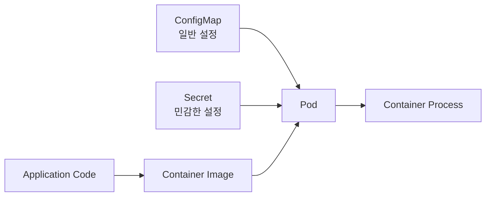
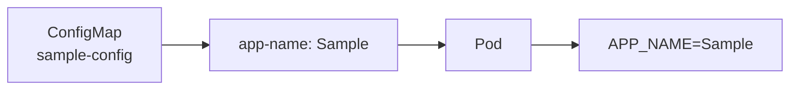

# 애플리케이션의 설정 관리

# 애플리케이션의 설정 관리

* toc
{:toc}

---

## Kubernetes 애플리케이션의 설정 관리

애플리케이션은 실행 환경에 따라 서로 다른 설정을 사용한다. 개발 환경과 운영 환경은 데이터베이스 주소, Redis 주소, 포트 번호, 로그 레벨, 외부 API 주소와 인증 정보가 다를 수 있다.

이 차이를 코드에 직접 넣으면 환경마다 소스 코드나 컨테이너 이미지를 따로 관리해야 한다.

```java
if (profile.equals("production")) {
    databaseUrl = "jdbc:mysql://prod-db:3306/app";
} else {
    databaseUrl = "jdbc:mysql://dev-db:3306/app";
}
```

이러한 코드는 새로운 환경이 추가될 때마다 수정과 재빌드가 필요하다. 설정 변경이 애플리케이션 코드 변경으로 이어지고, 개발 환경에서 검증한 이미지와 운영 환경에 배포한 이미지가 달라질 수도 있다.

Kubernetes에서는 설정을 컨테이너 이미지 밖으로 분리하고, Pod가 시작될 때 필요한 값을 주입할 수 있다.



같은 컨테이너 이미지를 개발, 스테이징, 운영 환경에서 사용하되 환경별 설정만 다르게 주입하는 구조다. 코드와 설정을 분리하면 한 번 검증한 이미지를 여러 환경으로 승격할 수 있고, 단순한 설정 변경 때문에 애플리케이션을 다시 빌드할 필요도 줄어든다.

### Kubernetes에서 설정을 전달하는 방법

Pod에 설정을 전달하는 방법은 크게 세 가지로 나눌 수 있다.

| 방법 | 용도 | 특징 |
|---|---|---|
| `env.value` | 단순하고 재사용되지 않는 값 | Pod Manifest에 직접 작성 |
| ConfigMap | 일반 설정 | 여러 Pod에서 재사용 가능 |
| Secret | 비밀번호, Token, 인증서 | 민감한 값을 별도 객체로 관리 |

설정값은 환경 변수나 파일 형태로 컨테이너에 전달할 수 있다. 애플리케이션은 값이 Pod Manifest에 직접 작성되었는지, ConfigMap에서 가져왔는지, Secret에서 가져왔는지 알 필요가 없다.

### 환경 변수를 Pod에 직접 설정하기

변경 가능성이 낮고 다른 애플리케이션과 공유할 필요가 없는 값은 Pod의 `env`에 직접 작성할 수 있다.

```yaml
apiVersion: v1
kind: Pod
metadata:
  name: nginx-env
  labels:
    app: nginx-env
spec:
  containers:
    - name: nginx-container
      image: nginx:1.27-alpine
      env:
        - name: MY_ENVIRONMENT
          value: "hello there!"
```

`env`는 컨테이너에 전달할 환경 변수 목록이다.

- `name`은 컨테이너 안에서 사용할 환경 변수 이름이다.
- `value`는 환경 변수에 저장할 문자열 값이다.
- 환경 변수는 컨테이너 프로세스가 시작될 때 전달된다.
- 숫자나 Boolean처럼 보이는 값도 환경 변수에서는 문자열로 처리된다.

Manifest를 `second-pod.yaml`로 저장하고 적용한다.

```bash
kubectl apply -f second-pod.yaml
```

```text
pod/nginx-env created
```

Pod 상태를 확인한다.

```bash
kubectl get pods
```

```text
NAME        READY   STATUS    RESTARTS   AGE
nginx-env   1/1     Running   0          5s
```

컨테이너에 주입된 환경 변수는 `printenv`로 확인할 수 있다.

```bash
kubectl exec nginx-env -- printenv MY_ENVIRONMENT
```

```text
hello there!
```

Manifest에 직접 값을 작성하는 방식은 간단하지만 재사용성이 낮다. 데이터베이스 주소처럼 여러 애플리케이션에서 사용하는 설정을 각각의 Manifest에 반복해서 작성하면 변경 시 누락이 생길 수 있다.

비밀번호나 API Token을 `env.value`에 직접 작성하는 것도 피해야 한다. Manifest를 읽을 수 있는 사람에게 값이 그대로 노출되고, Git 저장소에 민감한 정보가 남을 가능성이 높기 때문이다.

### ConfigMap

ConfigMap은 비밀번호가 아닌 일반적인 설정을 Key-Value 형태로 관리하는 Kubernetes 객체다.

대표적으로 다음과 같은 값을 저장할 수 있다.

- 애플리케이션 이름
- 실행 환경
- 로그 레벨
- 데이터베이스 Host와 Port
- Redis Host
- 외부 API 주소
- 애플리케이션 설정 파일
- 초기화에 사용할 Shell Script

ConfigMap은 일반적인 워크로드 객체와 달리 `spec`이 없다. 설정값은 `data` 또는 `binaryData` 아래에 작성한다.

```yaml
apiVersion: v1
kind: ConfigMap
metadata:
  name: sample-config
data:
  app-name: "Sample"
  database-host: "app001.database.sample.cloud"
  redis-host: "app001.redis.sample.cloud"
  initial.sh: |
    cp /app/data /app001/value/data
    /app/exec/connection_test.sh
    export app_initialized=true
    echo "initialized"
```

`data`는 UTF-8 문자열을 저장한다. 여러 줄로 구성된 설정 파일이나 Script는 `|`를 이용해 작성할 수 있다.

ConfigMap과 이를 사용하는 Pod는 같은 Namespace에 있어야 한다. 다른 Namespace의 Pod가 ConfigMap을 이름만으로 직접 참조할 수는 없다.

### ConfigMap 생성과 조회

파일명을 `first-configmap.yaml`로 저장하고 적용한다.

```bash
kubectl apply -f first-configmap.yaml
```

```text
configmap/sample-config created
```

생성된 ConfigMap을 조회한다.

```bash
kubectl get configmap sample-config
```

```text
NAME            DATA   AGE
sample-config   4      5s
```

세부 내용은 다음 명령으로 확인할 수 있다.

```bash
kubectl describe configmap sample-config
```

전체 YAML을 확인하려면 다음 명령을 사용한다.

```bash
kubectl get configmap sample-config -o yaml
```

### ConfigMap을 환경 변수로 사용하기

ConfigMap의 특정 Key를 컨테이너 환경 변수로 연결하려면 `configMapKeyRef`를 사용한다.

```yaml
apiVersion: v1
kind: Pod
metadata:
  name: nginx-env
  labels:
    app: nginx-env
spec:
  containers:
    - name: nginx-container
      image: nginx:1.27-alpine
      env:
        - name: MY_ENVIRONMENT
          value: "hello there!"
        - name: APP_NAME
          valueFrom:
            configMapKeyRef:
              name: sample-config
              key: app-name
        - name: DB_HOST
          valueFrom:
            configMapKeyRef:
              name: sample-config
              key: database-host
        - name: REDIS_HOST
          valueFrom:
            configMapKeyRef:
              name: sample-config
              key: redis-host
```

`APP_NAME`은 컨테이너에서 사용할 환경 변수 이름이고, `sample-config`의 `app-name`은 실제 값을 가져올 ConfigMap과 Key다.



ConfigMap의 Key와 컨테이너 환경 변수 이름이 같을 필요는 없다. 애플리케이션이 기대하는 환경 변수 이름에 맞춰 연결하면 된다.

ConfigMap 또는 지정한 Key가 존재하지 않으면 컨테이너가 시작되지 않고 `CreateContainerConfigError` 상태가 나타날 수 있다. 선택적인 설정이라면 다음과 같이 `optional`을 사용할 수 있다.

```yaml
valueFrom:
  configMapKeyRef:
    name: sample-config
    key: optional-value
    optional: true
```

필수 설정에 `optional: true`를 사용하면 설정 누락을 늦게 발견할 수 있으므로 기본값처럼 없어도 동작해야 하는 값에만 사용하는 것이 좋다.

### ConfigMap 전체를 환경 변수로 가져오기

ConfigMap에 정의된 모든 Key를 환경 변수로 가져오려면 `envFrom`을 사용할 수 있다.

```yaml
envFrom:
  - configMapRef:
      name: sample-config
```

다만 ConfigMap Key와 애플리케이션 환경 변수 이름의 관계가 Manifest에 명확하게 나타나지 않는다. 중요한 설정은 `configMapKeyRef`로 하나씩 연결하는 편이 변경 영향과 누락을 파악하기 쉽다.

### ConfigMap을 파일로 마운트하기

ConfigMap은 환경 변수뿐 아니라 파일 형태로도 사용할 수 있다. 설정 파일, 인증서가 아닌 공개 Key, Nginx 설정, Shell Script처럼 파일 구조를 유지해야 할 때 적합하다.

```yaml
apiVersion: v1
kind: Pod
metadata:
  name: nginx-config-file
  labels:
    app: nginx-config-file
spec:
  containers:
    - name: nginx-container
      image: nginx:1.27-alpine
      volumeMounts:
        - name: config-volume
          mountPath: /config
          readOnly: true
  volumes:
    - name: config-volume
      configMap:
        name: sample-config
        defaultMode: 0555
        items:
          - key: initial.sh
            path: initial.sh
```

`volumes`는 ConfigMap을 기반으로 한 Volume을 정의하고, `volumeMounts`는 해당 Volume을 컨테이너의 `/config` 경로에 연결한다.

적용 후 파일을 확인한다.

```bash
kubectl apply -f nginx-config-file.yaml
kubectl exec nginx-config-file -- cat /config/initial.sh
```

```text
cp /app/data /app001/value/data
/app/exec/connection_test.sh
export app_initialized=true
echo "initialized"
```

ConfigMap의 각 Key는 기본적으로 파일 이름이 되고, Value는 파일 내용이 된다. `items`를 사용하면 마운트할 Key와 파일 이름을 선택할 수 있다.

### Secret

Secret은 비밀번호, API Token, SSH Key, TLS 인증서처럼 민감한 값을 관리하는 객체다. Pod에서 환경 변수나 파일로 참조한다는 점은 ConfigMap과 비슷하지만, 저장 목적이 명확하게 구분된다.

```yaml
apiVersion: v1
kind: Secret
metadata:
  name: sample-secret
type: Opaque
data:
  secret-key: c2VjcmV0LWRhdGEtMTIzNA==
stringData:
  username: sample-user
```

`type: Opaque`는 일반적인 Key-Value 형태의 Secret을 의미한다. 생략할 수도 있지만 객체의 목적을 분명하게 표현하기 위해 작성하는 경우가 많다.

#### data

`data` 아래의 값은 Base64로 인코딩해야 한다.

```bash
printf %s 'secret-data-1234' | base64
```

```text
c2VjcmV0LWRhdGEtMTIzNA==
```

Base64는 암호화가 아니다. 누구나 쉽게 원래 값으로 복원할 수 있으므로 Base64로 변환했다고 해서 비밀번호가 보호되는 것은 아니다. Kubernetes Secret은 기본 설정에서 etcd에 암호화되지 않은 형태로 저장될 수 있으므로 저장 시 암호화, 최소 권한 RBAC와 외부 Secret 저장소를 함께 검토해야 한다. [Kubernetes Secret 보안 권장 사항](https://kubernetes.io/docs/concepts/security/secrets-good-practices/)에서도 Base64 인코딩을 보안 수단으로 보지 않는다.

#### stringData

`stringData`는 평문 문자열을 입력할 수 있는 쓰기 전용 필드다. Kubernetes가 객체를 저장하면서 값을 Base64로 변환해 `data`에 병합한다.

```yaml
apiVersion: v1
kind: Secret
metadata:
  name: sample-secret
type: Opaque
stringData:
  secret-key: "secret-data-1234"
  username: "sample-user"
```

작성은 편하지만 평문이 Manifest에 그대로 남는다. 실제 비밀번호가 들어 있는 YAML은 Git에 커밋하지 않아야 한다.

### kubectl로 Secret 생성하기

민감한 값을 YAML에 직접 적지 않고 파일에서 Secret을 생성할 수도 있다.

```bash
kubectl create secret generic sample-secret \
  --from-file=secret-key=./secret-key.txt
```

생성 여부를 확인한다.

```bash
kubectl get secret sample-secret
```

```text
NAME            TYPE     DATA   AGE
sample-secret   Opaque   1      5s
```

`--from-literal`도 사용할 수 있지만 명령어에 입력한 값이 Shell History나 작업 기록에 남을 수 있다.

```bash
kubectl create secret generic sample-secret \
  --from-literal=secret-key='secret-data-1234'
```

이 방식 역시 Secret 관리 도구를 대신하지는 않는다. 운영 환경에서는 External Secrets Operator, Secrets Store CSI Driver 또는 Cloud Provider의 Secret Manager처럼 민감한 값을 Git 저장소 밖에서 관리하는 방식을 고려하는 것이 좋다.

### Secret을 환경 변수로 사용하기

Secret의 특정 Key를 환경 변수로 연결할 때는 `secretKeyRef`를 사용한다.

```yaml
apiVersion: v1
kind: Pod
metadata:
  name: nginx-env
  labels:
    app: nginx-env
spec:
  containers:
    - name: nginx-container
      image: nginx:1.27-alpine
      env:
        - name: MY_ENVIRONMENT
          value: "hello there!"
        - name: APP_NAME
          valueFrom:
            configMapKeyRef:
              name: sample-config
              key: app-name
        - name: SECRET_KEY
          valueFrom:
            secretKeyRef:
              name: sample-secret
              key: secret-key
```

여기서 자주 혼동하는 부분은 참조 필드 이름이다.

| 객체 | 특정 Key 참조 |
|---|---|
| ConfigMap | `configMapKeyRef` |
| Secret | `secretKeyRef` |

`configMapRef`와 `secretRef`는 `envFrom`에서 객체 전체를 가져올 때 사용한다.

```yaml
envFrom:
  - configMapRef:
      name: sample-config
  - secretRef:
      name: sample-secret
```

### Secret을 파일로 마운트하기

Secret은 환경 변수보다 파일로 전달하는 편이 적합한 경우가 있다. TLS Private Key나 인증서처럼 원래 파일 형태인 값이 대표적이다.

```yaml
apiVersion: v1
kind: Pod
metadata:
  name: nginx-secret-file
spec:
  containers:
    - name: nginx-container
      image: nginx:1.27-alpine
      volumeMounts:
        - name: secret-volume
          mountPath: /run/secrets/app
          readOnly: true
  volumes:
    - name: secret-volume
      secret:
        secretName: sample-secret
        defaultMode: 0400
```

컨테이너에서는 다음 경로로 값을 읽을 수 있다.

```bash
kubectl exec nginx-secret-file -- cat /run/secrets/app/secret-key
```

```text
secret-data-1234
```

Secret을 파일로 마운트하면 필요한 컨테이너에만 `volumeMounts`를 선언할 수 있다. 하나의 Pod에 여러 컨테이너가 있더라도 모든 컨테이너가 Secret에 접근하도록 만들 필요는 없다.

### ConfigMap과 Secret을 함께 사용하는 실습

먼저 ConfigMap을 작성한다.

```yaml
apiVersion: v1
kind: ConfigMap
metadata:
  name: sample-config
data:
  app-name: "Sample"
```

Secret을 작성한다.

```yaml
apiVersion: v1
kind: Secret
metadata:
  name: sample-secret
type: Opaque
data:
  secret-key: c2VjcmV0LWRhdGEtMTIzNA==
```

Pod에서는 직접 설정한 환경 변수, ConfigMap, Secret을 함께 참조한다.

```yaml
apiVersion: v1
kind: Pod
metadata:
  name: nginx-env
  labels:
    app: nginx-env
spec:
  containers:
    - name: nginx-container
      image: nginx:1.27-alpine
      env:
        - name: MY_ENVIRONMENT
          value: "hello there!"
        - name: APP_NAME
          valueFrom:
            configMapKeyRef:
              name: sample-config
              key: app-name
        - name: SECRET_KEY
          valueFrom:
            secretKeyRef:
              name: sample-secret
              key: secret-key
```

객체를 순서대로 적용한다.

```bash
kubectl apply -f first-configmap.yaml
kubectl apply -f first-secret.yaml
kubectl apply -f second-pod.yaml
```

상태를 확인한다.

```bash
kubectl get configmap sample-config
kubectl get secret sample-secret
kubectl get pod nginx-env
```

```text
NAME        READY   STATUS    RESTARTS   AGE
nginx-env   1/1     Running   0          5s
```

환경 변수를 개별적으로 확인한다.

```bash
kubectl exec nginx-env -- printenv MY_ENVIRONMENT
kubectl exec nginx-env -- printenv APP_NAME
kubectl exec nginx-env -- printenv SECRET_KEY
```

```text
hello there!
Sample
secret-data-1234
```

실습에서는 값을 확인하기 위해 Secret을 출력했지만, 운영 환경에서는 비밀번호와 Token을 터미널, 로그, 모니터링 시스템에 출력하지 않아야 한다.

### 설정 변경은 언제 반영되는가

ConfigMap이나 Secret을 수정했다고 해서 모든 컨테이너에 즉시 반영되는 것은 아니다. 값을 전달한 방식에 따라 동작이 다르다.

| 전달 방식 | 실행 중 변경 반영 | 필요한 조치 |
|---|---|---|
| 환경 변수 | 반영되지 않음 | Pod 재생성 |
| 일반 Volume Mount | 일정 시간 후 파일 갱신 | 애플리케이션의 파일 재로딩 필요 |
| `subPath` Volume Mount | 자동 갱신되지 않음 | Pod 재생성 |
| Kubernetes API 직접 조회 | 애플리케이션 구현에 따라 가능 | Watch 및 오류 처리 구현 |

환경 변수는 프로세스가 시작될 때 결정된다. ConfigMap이나 Secret을 수정해도 이미 실행 중인 컨테이너의 환경 변수는 바뀌지 않는다. [ConfigMap 업데이트 동작](https://kubernetes.io/docs/tutorials/configuration/updating-configuration-via-a-configmap/)에서도 환경 변수 변경을 반영하려면 기존 Pod를 교체해야 한다고 설명한다.

Volume으로 마운트한 ConfigMap과 Secret은 kubelet 동기화와 캐시 전파를 거쳐 파일이 갱신된다. 즉시 반영되는 것은 아니며 애플리케이션이 변경된 파일을 다시 읽어야 실제 동작이 바뀐다. `subPath`로 파일 하나만 마운트한 경우에는 자동 갱신되지 않는다.

### 직접 생성한 Pod의 설정을 변경하는 방법

Pod의 환경 변수와 Volume 같은 주요 설정은 실행 중인 Pod에서 자유롭게 변경할 수 없다. 다음과 같이 Manifest를 수정한 뒤 `kubectl apply`를 실행하면 허용되지 않는 Pod Spec 변경이라는 오류가 발생할 수 있다.

```bash
kubectl apply -f second-pod.yaml
```

이 경우 기존 Pod를 삭제하고 다시 생성한다.

```bash
kubectl delete pod nginx-env
kubectl apply -f second-pod.yaml
```

```text
pod "nginx-env" deleted
pod/nginx-env created
```

새 Pod에 설정이 반영되었는지 확인한다.

```bash
kubectl exec nginx-env -- printenv APP_NAME
kubectl exec nginx-env -- printenv SECRET_KEY
```

실무에서는 Pod를 직접 관리하기보다 Deployment를 사용한다. Deployment의 Pod Template을 변경하면 새로운 설정을 가진 Pod로 Rolling Update할 수 있다.

ConfigMap이나 Secret의 값만 변경하면 Deployment의 Pod Template 자체는 바뀌지 않기 때문에 자동으로 새 Pod가 만들어지지는 않는다. 환경 변수로 사용하는 설정을 변경했다면 명시적으로 재시작할 수 있다.

```bash
kubectl rollout restart deployment/sample-app
kubectl rollout status deployment/sample-app
```

### 설정 변경을 배포 이력으로 남기는 방법

ConfigMap의 값을 같은 이름으로 덮어쓰면 현재 Deployment Manifest만 보고 어떤 설정 버전이 사용되었는지 파악하기 어렵다.

설정 변경을 배포 단위로 관리해야 한다면 ConfigMap 이름에 버전을 포함할 수 있다.

```yaml
apiVersion: v1
kind: ConfigMap
metadata:
  name: sample-config-v2
data:
  app-name: "Sample"
  log-level: "INFO"
```

Deployment가 새로운 ConfigMap 이름을 참조하도록 수정하면 Pod Template이 변경되므로 새로운 ReplicaSet과 Pod가 생성된다.

```yaml
env:
  - name: APP_NAME
    valueFrom:
      configMapKeyRef:
        name: sample-config-v2
        key: app-name
```

이 방식은 이전 ConfigMap을 유지하면서 롤백할 수 있다는 장점이 있다. 사용하지 않는 이전 ConfigMap과 Secret을 언제 정리할지도 함께 관리해야 한다.

변경되면 안 되는 설정에는 `immutable: true`를 지정할 수도 있다.

```yaml
apiVersion: v1
kind: ConfigMap
metadata:
  name: sample-config-v1
immutable: true
data:
  app-name: "Sample"
```

Immutable ConfigMap은 `data`를 수정할 수 없다. 설정을 바꾸려면 새로운 이름으로 객체를 만들고 워크로드가 참조하는 이름을 변경해야 한다.

### ConfigMap과 Secret 사용 시 주의사항

#### ConfigMap에는 민감한 정보를 넣지 않는다

ConfigMap은 일반 설정을 저장하기 위한 객체다. 데이터베이스 비밀번호나 API Token을 ConfigMap에 저장하면 조회 권한이 있는 사용자가 평문으로 확인할 수 있다.

#### Secret도 완전한 보안 저장소는 아니다

Secret은 민감한 값을 일반 설정과 분리하고 접근 권한을 제어하기 위한 Kubernetes 객체다. 값을 Base64로 표현하지만 암호화하는 것은 아니다.

운영 환경에서는 다음 항목을 함께 적용해야 한다.

- etcd 저장 데이터 암호화
- Secret 조회 권한을 제한하는 RBAC
- 필요한 ServiceAccount와 컨테이너에만 Secret 제공
- Git 저장소에 Secret Manifest를 커밋하지 않기
- 애플리케이션 로그에 Secret을 출력하지 않기
- 가능하면 외부 Secret Manager와 연동
- Secret 접근과 변경에 대한 감사 로그 관리

#### 설정 객체와 Pod의 Namespace를 맞춘다

ConfigMap과 Secret은 Namespace 범위의 객체다. Pod가 다른 Namespace에 있는 ConfigMap이나 Secret을 이름으로 직접 참조할 수 없다.

환경마다 Namespace를 분리한다면 동일한 이름의 ConfigMap과 Secret을 각 Namespace에 생성하는 구성이 일반적이다.

#### 대용량 파일 저장소로 사용하지 않는다

ConfigMap은 애플리케이션 설정을 위한 객체이지 대용량 파일 저장소가 아니다. 개별 ConfigMap 데이터는 1MiB를 초과할 수 없다. 대용량 설정이나 파일은 Volume, Object Storage 또는 별도의 설정 저장소를 사용하는 편이 적절하다.

#### 환경 변수와 파일 중 적절한 방식을 선택한다

단순한 문자열 설정은 환경 변수가 편리하다. 여러 줄로 된 설정 파일, 인증서, Key 파일은 Volume Mount가 자연스럽다.

환경 변수는 변경 시 Pod 재생성이 필요하다. Volume Mount는 파일이 갱신될 수 있지만 애플리케이션이 이를 다시 읽도록 구현되어 있어야 한다.

## 정리

Kubernetes에서는 애플리케이션 코드와 환경별 설정을 분리할 수 있다. 재사용되지 않는 단순한 값은 Pod의 `env.value`에 직접 작성하고, 일반 설정은 ConfigMap, 비밀번호와 Token 같은 민감한 값은 Secret으로 관리한다.

ConfigMap과 Secret은 환경 변수 또는 파일 형태로 컨테이너에 전달할 수 있다. 환경 변수로 전달한 값은 컨테이너가 생성될 때 결정되므로 객체를 수정한 뒤에도 실행 중인 컨테이너에는 반영되지 않는다. 변경 사항을 적용하려면 Pod를 교체하거나 Deployment를 다시 배포해야 한다.

파일로 마운트한 설정은 일정 시간이 지나면 갱신될 수 있지만, 애플리케이션이 파일을 다시 읽어야 실제 동작이 변경된다. `subPath`로 마운트한 파일은 자동 갱신되지 않는다는 점도 주의해야 한다.

Secret은 ConfigMap보다 민감한 데이터를 다루기 적합하지만 Base64 인코딩만으로 값을 보호하지는 못한다. 저장 데이터 암호화, RBAC, 외부 Secret Manager, 로그 노출 방지까지 함께 적용해야 안전한 설정 관리가 가능하다.
