# Kubernetes 네트워크의 활용

# Kubernetes 네트워크의 활용

* toc
{:toc}

---

## Kubernetes 네트워크의 활용

대부분의 애플리케이션은 혼자 동작하지 않는다. 백엔드 서버는 데이터베이스와 Redis에 접근하고, 여러 API 서버가 서로를 호출하며, 사용자의 요청은 외부 Load Balancer를 거쳐 클러스터 안으로 들어온다.

Kubernetes에서 애플리케이션을 운영하려면 다음 통신 경로를 이해해야 한다.

- 같은 Pod에 포함된 Container 사이의 통신
- 같은 Node에 있는 Pod 사이의 통신
- 서로 다른 Node에 있는 Pod 사이의 통신
- Pod에서 Service로 전달되는 통신
- 클러스터 외부에서 내부 애플리케이션으로 들어오는 통신
- 클러스터 내부에서 외부 API나 데이터베이스로 나가는 통신

Kubernetes는 이러한 네트워크 구성을 Pod의 IP에 직접 의존하지 않도록 추상화한다. 애플리케이션은 상대 Pod의 위치나 IP를 알 필요 없이 Service의 이름으로 호출할 수 있다.

### Kubernetes 네트워크 모델

Kubernetes 클러스터에서는 각 Pod에 고유한 IP 주소가 할당된다. 같은 Pod 안의 Container는 하나의 네트워크 Namespace를 공유하므로 `localhost`로 통신할 수 있다.

서로 다른 Pod는 각자의 IP 주소를 사용한다. 특별한 네트워크 차단 정책이 없다면 같은 Node뿐 아니라 서로 다른 Node에 배치된 Pod끼리도 직접 통신할 수 있어야 한다.

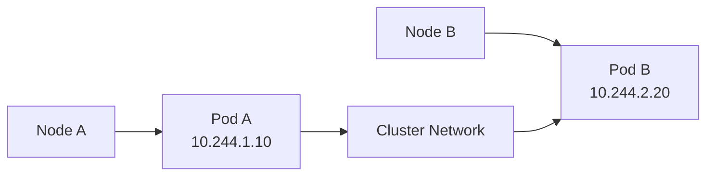

Pod 네트워크는 일반적으로 CNI(Container Network Interface) Plugin이 구성한다. Calico, Cilium, Flannel, AWS VPC CNI 등이 대표적인 구현체다.

Overlay Network는 Kubernetes 네트워크를 구현하는 방법 중 하나다. 모든 Kubernetes 클러스터가 반드시 Overlay Network를 사용하는 것은 아니다. 클라우드 환경에서는 Pod에 VPC 대역의 IP를 직접 할당하거나 Node 간 Routing을 구성하는 방식도 사용할 수 있다.

중요한 점은 구현 방식보다 Kubernetes가 요구하는 네트워크 모델이다.

- 각 Pod는 고유한 IP 주소를 갖는다.
- Pod는 다른 Node의 Pod와도 통신할 수 있다.
- Pod 간 통신에서 불필요한 주소 변환을 요구하지 않는다.
- 같은 Pod의 Container는 `localhost`와 Port를 통해 통신한다.

실제 Pod 네트워크와 Service Proxy 구현은 CNI Plugin, `kube-proxy` 또는 eBPF 기반 네트워크 구현에 따라 달라질 수 있다. [Kubernetes 네트워크 모델](https://kubernetes.io/docs/concepts/services-networking/)은 통신 규칙을 정의하고, 구체적인 패킷 전달은 클러스터의 네트워크 구현체가 담당한다.

### Pod IP를 직접 호출하면 안 되는 이유

Pod는 영구적인 서버가 아니다. Deployment가 Pod를 교체하거나 Node 장애로 Pod가 다른 Node에서 다시 생성되면 새로운 IP가 할당될 수 있다.

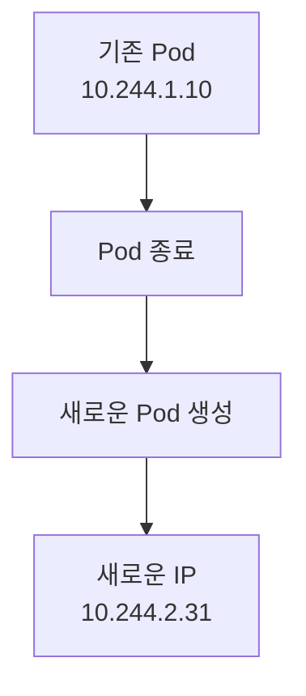

애플리케이션 코드에 Pod IP를 직접 작성하면 Pod가 교체될 때마다 설정을 변경해야 한다.

```text
http://10.244.1.10:8080/products
```

이 문제를 해결하기 위해 Kubernetes는 Service를 제공한다. Service는 변할 수 있는 여러 Pod 앞에 고정된 접근 지점을 만든다.

### Service

Service는 여러 Pod를 하나의 네트워크 Endpoint로 묶어주는 Kubernetes 객체다.

Deployment로 같은 애플리케이션의 Pod를 여러 개 실행하면 각 Pod의 IP는 모두 다르다. Service는 Label Selector를 사용해 대상 Pod를 찾고, 요청을 준비된 Endpoint 중 하나로 전달한다.

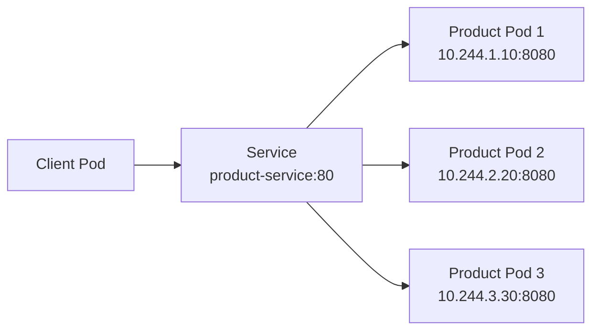

Service에 여러 Pod가 연결되어 있으면 요청은 그중 하나의 준비된 Endpoint로 전달된다. 흔히 무작위 분배라고 설명하지만, 엄밀하게는 클러스터의 Service Proxy 구현과 Traffic Policy에 따라 Endpoint 선택 방식이 달라진다. 모든 Pod에 요청이 정확히 같은 비율로 배분된다고 보장할 수는 없다.

### Label과 Selector

Label은 Kubernetes 객체에 붙이는 Key-Value 형태의 식별 정보다.

```yaml
labels:
  app: product
  tier: backend
  environment: production
```

하나의 객체에 여러 Label을 지정할 수 있고, 같은 Label을 여러 객체에 지정할 수도 있다.

Selector는 특정 Label을 가진 객체를 찾는 조건이다.

```yaml
selector:
  app: product
```

이 Selector는 `app: product` Label을 가진 모든 Pod를 대상으로 선택한다. Key와 Value가 모두 일치해야 한다.

Label은 단순한 설명용 주석과 다르다. Kubernetes Controller와 Service가 객체 간 관계를 구성할 때 실제로 사용하는 식별 정보다. 설명만 기록하고 싶다면 Annotation을 사용하는 편이 적절하다.

### Service와 Pod가 연결되는 과정

Service에 Selector가 있으면 Kubernetes Control Plane은 해당 Selector와 일치하는 Pod를 찾아 EndpointSlice를 생성한다.

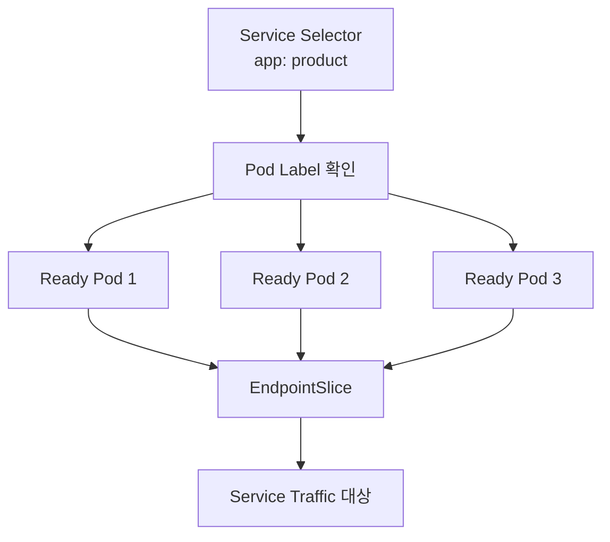

Pod가 새로 생성되거나 삭제되면 EndpointSlice도 동적으로 갱신된다. Readiness Probe가 실패한 Pod는 일반적으로 Service의 준비된 Traffic 대상에서 제외된다.

Service가 직접 Deployment를 찾아가는 것은 아니다. Service의 Selector는 Deployment가 생성한 **Pod의 Label**을 기준으로 동작한다.

EndpointSlice는 다음 명령으로 확인할 수 있다.

```bash
kubectl get endpointslices
```

특정 Service의 EndpointSlice만 확인하려면 Label Selector를 사용한다.

```bash
kubectl get endpointslices \
  -l kubernetes.io/service-name=product-service
```

### Deployment와 Service의 Label 관계

다음 Deployment는 `app-name: product-app` Label을 가진 Pod 두 개를 생성한다.

```yaml
apiVersion: apps/v1
kind: Deployment
metadata:
  name: product-deployment
  labels:
    app-name: product-app
spec:
  replicas: 2
  selector:
    matchLabels:
      app-name: product-app
  template:
    metadata:
      labels:
        app-name: product-app
    spec:
      containers:
        - name: product
          image: example/product-app:1.0
          ports:
            - name: http
              containerPort: 8080
```

Deployment에는 서로 다른 목적의 Label과 Selector가 존재한다.

- `metadata.labels`는 Deployment 객체 자체의 Label이다.
- `spec.selector.matchLabels`는 Deployment가 관리할 Pod를 찾는 조건이다.
- `spec.template.metadata.labels`는 새로 생성할 Pod에 붙이는 Label이다.

`spec.selector.matchLabels`와 `spec.template.metadata.labels`는 서로 일치해야 한다.

이 Pod를 대상으로 하는 Service는 다음과 같이 작성한다.

```yaml
apiVersion: v1
kind: Service
metadata:
  name: product-service
spec:
  selector:
    app-name: product-app
  ports:
    - name: http
      protocol: TCP
      port: 80
      targetPort: 8080
  type: ClusterIP
```

Service의 `spec.selector`는 Deployment 자체의 Label이 아니라 Pod Template의 Label과 일치해야 한다.

### Service Port 설정

Service에서 자주 사용하는 Port 필드는 다음과 같다.

| 필드 | 의미 |
|---|---|
| `port` | Client가 Service를 호출할 때 사용하는 Port |
| `targetPort` | Service가 Pod로 요청을 전달할 때 사용하는 Port |
| `containerPort` | Container가 사용하는 Port를 문서화하는 필드 |
| `nodePort` | NodePort Service가 각 Node에 개방하는 Port |

앞의 예제에서 Client는 `product-service:80`으로 요청한다. Service는 이 요청을 선택된 Pod의 `8080` Port로 전달한다.

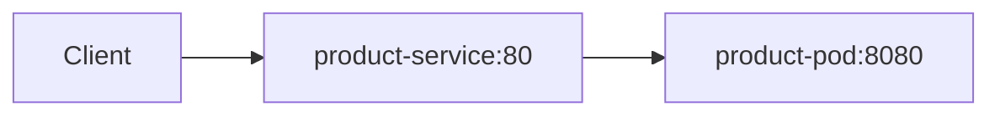

`containerPort`를 선언했다고 Container의 Port가 자동으로 외부에 공개되는 것은 아니다. 실제 접근 경로는 Service, Ingress, NetworkPolicy와 네트워크 구현에 따라 결정된다.

하나의 Service에서 여러 Port를 공개할 수도 있다. 이 경우 각 Port에 이름을 지정하는 편이 좋다.

```yaml
ports:
  - name: http
    protocol: TCP
    port: 80
    targetPort: 8080
  - name: management
    protocol: TCP
    port: 9090
    targetPort: 9090
```

### Service DNS

Service를 생성하면 클러스터 DNS에 해당 Service의 이름이 등록된다. 같은 Namespace의 Pod는 Service 이름만으로 호출할 수 있다.

```text
http://product-service
```

전체 DNS 이름은 일반적으로 다음 형식을 사용한다.

```text
<service-name>.<namespace>.svc.cluster.local
```

`product-service`가 `commerce` Namespace에 있다면 다음 주소로 호출할 수 있다.

```text
http://product-service.commerce.svc.cluster.local
```

같은 Namespace에서는 짧은 이름인 `product-service`만 사용해도 된다. 다른 Namespace에서 호출한다면 Namespace를 포함해야 한다.

```text
http://product-service.commerce
```

Service DNS를 사용하면 ClusterIP가 바뀌어도 애플리케이션 설정을 변경할 필요가 없다. Kubernetes는 Pod가 Service 이름을 조회할 수 있도록 DNS 설정을 구성한다. 자세한 이름 해석 규칙은 [Kubernetes Service DNS](https://kubernetes.io/docs/concepts/services-networking/dns-pod-service/)에서 확인할 수 있다.

### Service 요청이 전달되는 과정

Pod에서 Service 이름으로 요청하면 대략 다음 순서로 처리된다.

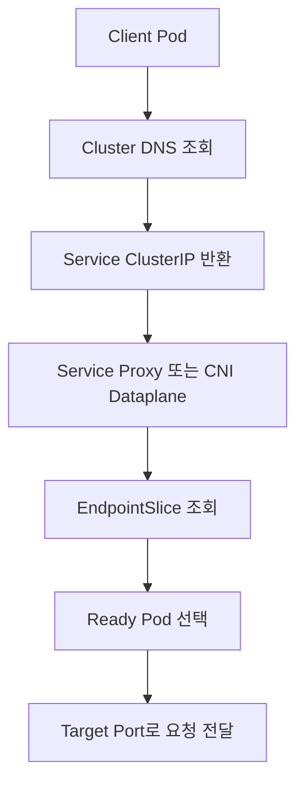

Service는 일반적으로 ClusterIP라는 가상 IP를 가진다. ClusterIP는 특정 Pod나 Node에 직접 할당된 일반적인 Network Interface IP와는 성격이 다르다.

패킷 전달은 환경에 따라 `kube-proxy`의 `iptables` 또는 `nftables` 규칙, IPVS, CNI Plugin의 eBPF Dataplane 등으로 구현될 수 있다. 애플리케이션 개발자는 이 구현 차이보다 Service 이름과 Port를 기준으로 통신하도록 구성하는 것이 중요하다.

### Service 유형

Kubernetes Service는 노출 범위에 따라 여러 유형으로 나뉜다.

| 유형 | 접근 범위 | 주요 용도 |
|---|---|---|
| `ClusterIP` | 클러스터 내부 | 내부 API와 Microservice 통신 |
| `NodePort` | Node IP와 특정 Port | 개발 및 제한적인 외부 접근 |
| `LoadBalancer` | 외부 Load Balancer | 클라우드 환경의 서비스 공개 |
| `ExternalName` | 외부 DNS 이름 | 외부 서비스를 내부 이름으로 추상화 |

### ClusterIP

ClusterIP는 기본 Service 유형이다. `type`을 생략하면 ClusterIP로 생성된다.

```yaml
spec:
  type: ClusterIP
```

클러스터 내부 통신에 사용하며 일반적으로 인터넷에서 직접 접근할 수 없다.

백엔드 Microservice, 내부 API, Redis와 같은 내부 구성요소를 연결할 때 주로 사용한다.

### NodePort

NodePort는 모든 Node의 지정된 Port를 통해 Service에 접근할 수 있게 한다.

```yaml
apiVersion: v1
kind: Service
metadata:
  name: product-nodeport
spec:
  selector:
    app-name: product-app
  ports:
    - name: http
      protocol: TCP
      port: 80
      targetPort: 8080
      nodePort: 30080
  type: NodePort
```

외부에서는 다음 형식으로 호출한다.

```text
http://<NODE_IP>:30080
```

NodePort는 실습 환경에서 서비스를 빠르게 노출할 때 편리하다. 다만 운영 환경에서는 다음 문제를 고려해야 한다.

- Client가 접근할 Node 주소를 별도로 알아야 한다.
- Node가 교체되거나 추가될 수 있다.
- 방화벽과 Security Group에서 NodePort를 개방해야 한다.
- TLS 종료, Host 기반 Routing, 세밀한 경로 분기가 어렵다.
- 모든 서비스를 개별 Port로 관리하면 운영 복잡도가 높아진다.

따라서 운영 환경에서는 LoadBalancer, Ingress 또는 Gateway API를 사용하는 경우가 많다.

### LoadBalancer

LoadBalancer Service는 클라우드나 Load Balancer Controller가 제공하는 외부 Load Balancer를 생성하고 Service와 연결한다.

```yaml
apiVersion: v1
kind: Service
metadata:
  name: product-load-balancer
spec:
  selector:
    app-name: product-app
  ports:
    - name: http
      protocol: TCP
      port: 80
      targetPort: 8080
  type: LoadBalancer
```

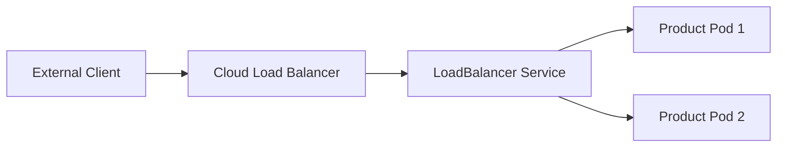

실제로 외부 Load Balancer가 생성되는지는 클러스터 환경에 따라 다르다. 클라우드 연동이나 별도의 Load Balancer 구현이 없는 로컬 클러스터에서는 `EXTERNAL-IP`가 `Pending` 상태로 남을 수 있다.

### Ingress

Ingress는 HTTP와 HTTPS 요청을 Host 또는 Path 기준으로 여러 Service에 Routing하는 객체다.

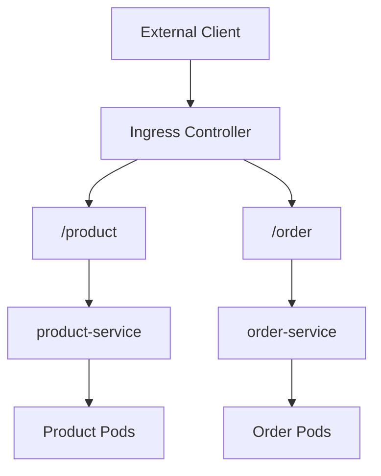

Ingress 객체만 생성해서는 요청이 처리되지 않는다. NGINX Ingress Controller, AWS Load Balancer Controller 등 Ingress 규칙을 실제 네트워크 설정으로 구현할 Controller가 클러스터에 설치되어 있어야 한다.

```yaml
apiVersion: networking.k8s.io/v1
kind: Ingress
metadata:
  name: product-ingress
spec:
  ingressClassName: nginx
  rules:
    - host: api.example.com
      http:
        paths:
          - path: /product
            pathType: Prefix
            backend:
              service:
                name: product-service
                port:
                  number: 80
```

주요 필드는 다음과 같다.

- `ingressClassName`은 이 Ingress를 처리할 Controller를 지정한다.
- `host`는 요청의 Host Header를 기준으로 Routing한다.
- `path`는 URL 경로를 지정한다.
- `pathType: Prefix`는 지정한 경로로 시작하는 요청을 처리한다.
- `backend.service.name`은 요청을 전달할 Service다.
- `backend.service.port.number`는 Service의 `port`다.

Path를 제거하거나 변경하는 Rewrite 기능은 Ingress Controller마다 설정 방식이 다르다. 특정 Controller의 Annotation을 사용할 때는 해당 Controller 문서를 확인해야 한다.

현재 Ingress API는 안정적으로 사용할 수 있지만 기능 확장은 중단된 상태이며, Kubernetes 프로젝트는 새로운 구성에서 Gateway API 사용도 권장한다. 기존 Ingress가 곧 제거된다는 의미는 아니므로 클러스터 환경과 운영 요구사항에 따라 선택하면 된다. [Ingress Controller 안내](https://kubernetes.io/docs/concepts/services-networking/ingress-controllers/)

### Rolling Update 중 Service 통신

Deployment가 Rolling Update를 수행하는 동안에는 이전 버전과 새로운 버전의 Pod가 동시에 Service에 연결될 수 있다.

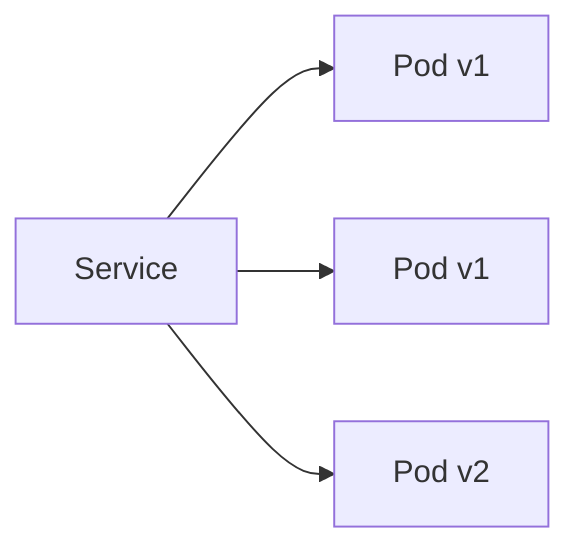

이 구간에 사용자가 여러 요청을 보내면 일부 요청은 이전 버전으로, 다른 요청은 새로운 버전으로 전달될 수 있다.

따라서 Rolling Update를 사용하려면 다음 호환성을 고려해야 한다.

- 새로운 API는 기존 Client 요청도 처리할 수 있어야 한다.
- 응답 필드를 바로 삭제하지 않는다.
- 데이터베이스 Schema는 이전 버전과 새로운 버전이 함께 사용할 수 있어야 한다.
- 메시지 형식과 Event Schema를 한 번에 호환되지 않게 변경하지 않는다.
- Readiness Probe가 성공한 Pod만 요청을 받도록 구성한다.

서로 다른 버전이 동시에 실행되는 것을 허용할 수 없다면 `Recreate` 전략을 검토할 수 있다. 다만 기존 Pod를 모두 종료한 뒤 새로운 Pod를 생성하므로 서비스 중단 시간이 발생한다.

### 클러스터 내부에서 외부 서비스 호출하기

Pod에서 외부 API, 외부 데이터베이스 또는 기존 Legacy Server를 호출하는 방식은 일반적인 애플리케이션과 크게 다르지 않다.

```text
https://api.example.com
```

Pod가 외부 DNS를 조회하고 목적지까지 Network Routing을 수행할 수 있다면 URL을 이용해 호출할 수 있다.

다만 다음 항목이 통신을 제한할 수 있다.

- NetworkPolicy의 Egress 규칙
- Cloud Security Group
- 방화벽
- NAT Gateway와 Internet Gateway 구성
- 사내 Proxy
- 외부 서비스의 IP Allowlist
- DNS 설정
- Service Mesh의 Egress 정책

외부 주소가 환경마다 다르다면 ConfigMap으로 URL을 주입할 수 있다. 여러 애플리케이션에서 같은 내부 이름으로 외부 DNS를 사용하고 싶다면 ExternalName Service를 사용할 수 있다.

### ExternalName Service

ExternalName Service는 Service 이름을 외부 DNS 이름에 연결한다.

```yaml
apiVersion: v1
kind: Service
metadata:
  name: httpbin-external
spec:
  type: ExternalName
  externalName: httpbin.org
```

Pod에서 `httpbin-external`을 조회하면 클러스터 DNS는 `httpbin.org`을 가리키는 CNAME 응답을 반환한다.

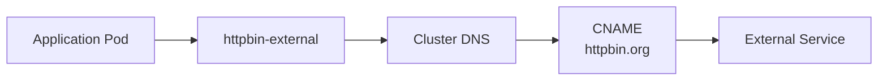

ExternalName Service는 요청을 Proxy하거나 Load Balancing하지 않는다. DNS 이름만 다른 이름으로 연결한다는 점이 일반 ClusterIP Service와 다르다.

외부 주소가 바뀌면 애플리케이션 코드를 수정하지 않고 `externalName`만 변경할 수 있다.

```yaml
spec:
  type: ExternalName
  externalName: new-api.example.com
```

ExternalName에는 IP 주소가 아니라 DNS 이름을 지정해야 한다.

### ExternalName 사용 시 주의사항

ExternalName은 편리하지만 HTTP와 HTTPS에서는 Host 이름 차이를 확인해야 한다.

애플리케이션이 다음 주소를 호출하면 HTTP Host Header에는 `httpbin-external`이 들어갈 수 있다.

```text
http://httpbin-external/get
```

실제 서버는 `httpbin.org`이라는 Host를 기대할 수 있으므로 Virtual Host Routing이 다르게 동작할 수 있다. HTTPS에서는 요청 주소와 서버 인증서의 도메인이 일치하지 않아 TLS 인증서 검증이 실패할 수도 있다.

따라서 ExternalName은 다음 조건을 확인한 뒤 사용해야 한다.

- 외부 서버가 Alias Host를 허용하는가
- TLS 인증서의 도메인이 호출 주소와 일치하는가
- Client가 TLS SNI와 Host Header를 어떻게 설정하는가
- 애플리케이션 또는 DNS가 응답을 얼마나 오래 Cache하는가
- 외부 서비스 장애를 탐지할 별도 Health Check가 있는가

Managed Database, Message Queue, Memory Grid를 추상화할 때도 Database Driver의 TLS Host 검증 여부를 확인해야 한다.

## Service와 ExternalName 실습

### 실습 목표

이번 실습에서는 다음 흐름을 확인한다.

1. httpbin Pod 두 개를 Deployment로 실행한다.
2. ClusterIP Service로 Pod를 묶는다.
3. 임시 Curl Pod에서 Service 이름으로 API를 호출한다.
4. EndpointSlice를 조회해 Service와 Pod의 연결을 확인한다.
5. ExternalName Service를 통해 외부 API를 호출한다.

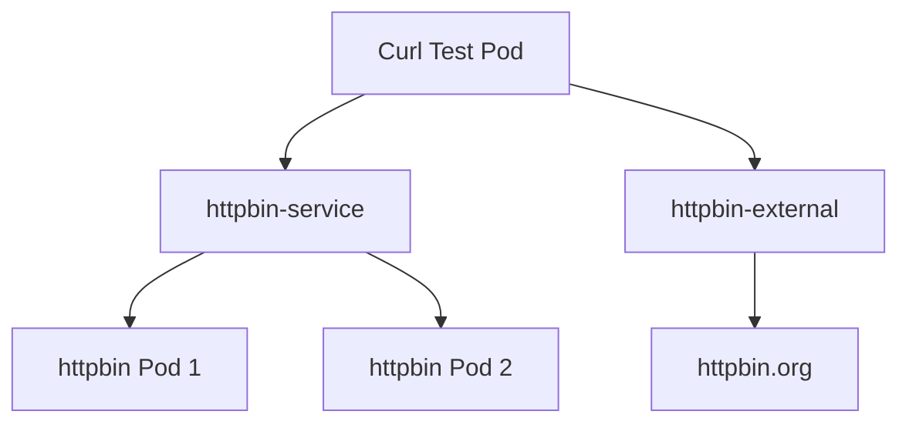

### httpbin Deployment 작성

`second-deployment.yaml`을 작성한다.

```yaml
apiVersion: apps/v1
kind: Deployment
metadata:
  name: httpbin-deployment
  labels:
    app: httpbin
spec:
  replicas: 2
  selector:
    matchLabels:
      app: httpbin
  template:
    metadata:
      labels:
        app: httpbin
    spec:
      containers:
        - name: httpbin
          image: kong/httpbin:0.2.3
          ports:
            - name: http
              containerPort: 80
          readinessProbe:
            httpGet:
              path: /status/200
              port: http
            initialDelaySeconds: 3
            periodSeconds: 5
          resources:
            requests:
              cpu: 50m
              memory: 64Mi
            limits:
              cpu: 500m
              memory: 256Mi
```

두 개의 Pod에는 모두 `app: httpbin` Label이 지정된다. Readiness Probe가 성공한 Pod만 Service의 준비된 Endpoint로 사용된다.

### ClusterIP Service 작성

`first-service.yaml`을 작성한다.

```yaml
apiVersion: v1
kind: Service
metadata:
  name: httpbin-service
spec:
  type: ClusterIP
  selector:
    app: httpbin
  ports:
    - name: http
      protocol: TCP
      port: 80
      targetPort: http
```

`targetPort`에는 숫자 대신 Container Port의 이름인 `http`를 사용했다. 애플리케이션의 실제 Port가 변경되더라도 이름을 유지하면 Service Manifest의 변경 범위를 줄일 수 있다.

### Deployment와 Service 적용

```bash
kubectl apply -f second-deployment.yaml
kubectl apply -f first-service.yaml
```

Deployment의 배포 상태를 확인한다.

```bash
kubectl rollout status deployment/httpbin-deployment
```

```text
deployment "httpbin-deployment" successfully rolled out
```

Pod와 Service를 조회한다.

```bash
kubectl get pods -l app=httpbin
kubectl get services
```

```text
NAME                  TYPE        CLUSTER-IP      EXTERNAL-IP   PORT(S)   AGE
httpbin-service       ClusterIP   10.98.207.25    <none>        80/TCP    7s
kubernetes            ClusterIP   10.96.0.1       <none>        443/TCP   17h
```

`CLUSTER-IP`는 클러스터마다 다르게 할당된다. 애플리케이션에서는 이 IP를 직접 사용하지 않고 `httpbin-service`라는 DNS 이름으로 호출한다.

### EndpointSlice 확인

```bash
kubectl get endpointslices \
  -l kubernetes.io/service-name=httpbin-service
```

상세 정보를 확인한다.

```bash
kubectl describe endpointslice \
  -l kubernetes.io/service-name=httpbin-service
```

정상이라면 두 httpbin Pod의 IP가 Endpoint로 등록된다. Endpoint가 비어 있다면 Service Selector와 Pod Label이 일치하는지 먼저 확인해야 한다.

```bash
kubectl get pods --show-labels
kubectl get service httpbin-service -o yaml
```

### 임시 Curl Pod에서 Service 호출

다음 명령은 Curl Container를 실행하고 Shell에 접속한다.

```bash
kubectl run curl-container \
  --rm \
  -it \
  --restart=Never \
  --image=curlimages/curl:8.8.0 \
  -- sh
```

Shell 안에서 Service 이름으로 요청한다.

```bash
curl -sS http://httpbin-service/get
```

```json
{
  "args": {},
  "headers": {
    "Accept": "*/*",
    "Host": "httpbin-service",
    "User-Agent": "curl/8.8.0"
  },
  "url": "http://httpbin-service/get"
}
```

여기서 중요한 점은 Pod 이름이나 Deployment 이름이 아닌 Service 이름으로 호출했다는 것이다.

다른 Namespace에 있는 Service를 호출할 때는 Namespace를 포함한다.

```bash
curl -sS http://httpbin-service.default/get
```

전체 DNS 이름도 사용할 수 있다.

```bash
curl -sS \
  http://httpbin-service.default.svc.cluster.local/get
```

Shell을 종료하면 `--rm` 옵션에 의해 임시 Pod가 삭제된다.

```bash
exit
```

### Service DNS 확인

BusyBox를 이용해 Service DNS를 직접 조회할 수도 있다.

```bash
kubectl run dns-test \
  --rm \
  -it \
  --restart=Never \
  --image=busybox:1.36.1 \
  -- nslookup httpbin-service
```

정상이라면 `httpbin-service`의 ClusterIP가 조회된다.

### ExternalName Service 작성

`second-service.yaml`을 작성한다.

```yaml
apiVersion: v1
kind: Service
metadata:
  name: httpbin-external
spec:
  type: ExternalName
  externalName: httpbin.org
```

적용하고 조회한다.

```bash
kubectl apply -f second-service.yaml
kubectl get services
```

```text
NAME               TYPE           CLUSTER-IP      EXTERNAL-IP   PORT(S)   AGE
httpbin-external   ExternalName   <none>          httpbin.org   <none>    6s
httpbin-service    ClusterIP      10.98.207.25    <none>        80/TCP    4m
```

ExternalName Service에는 ClusterIP가 없다. DNS CNAME으로 외부 주소를 반환하기 때문이다.

DNS 조회 결과를 확인한다.

```bash
kubectl run dns-test \
  --rm \
  -it \
  --restart=Never \
  --image=busybox:1.36.1 \
  -- nslookup httpbin-external
```

외부 API를 호출한다.

```bash
kubectl run curl-external \
  --rm \
  -it \
  --restart=Never \
  --image=curlimages/curl:8.8.0 \
  -- curl -sS -X POST http://httpbin-external/post
```

외부 서버가 Host Header를 제한한다면 다음과 같이 실제 외부 Host를 명시해야 할 수 있다.

```bash
curl -sS \
  -H "Host: httpbin.org" \
  -X POST \
  http://httpbin-external/post
```

### 네트워크 객체 변경 반영

Service의 Selector나 ExternalName을 변경하면 일반적으로 Pod를 재시작할 필요가 없다.

```bash
kubectl apply -f second-service.yaml
```

Service와 EndpointSlice, DNS 설정은 Pod 외부의 클러스터 네트워크 계층에서 동적으로 반영된다.

다만 실제 애플리케이션에서 변경 사항을 확인하는 시점에는 차이가 생길 수 있다.

- DNS Client가 이전 응답을 Cache하고 있을 수 있다.
- 애플리케이션이 기존 TCP Connection을 계속 재사용할 수 있다.
- 외부 DNS의 TTL이 남아 있을 수 있다.
- Service Mesh나 Proxy가 별도 Cache를 사용할 수 있다.

따라서 네트워크 객체가 갱신되었다는 사실과 애플리케이션이 새로운 목적지로 즉시 연결된다는 사실을 같은 의미로 보아서는 안 된다.

### 실습 리소스 정리

```bash
kubectl delete service httpbin-external
kubectl delete service httpbin-service
kubectl delete deployment httpbin-deployment
```

남은 객체를 확인한다.

```bash
kubectl get deployments
kubectl get services
kubectl get pods
```

### 연결되지 않을 때 확인할 항목

#### Service는 존재하지만 요청이 실패하는 경우

Service와 Pod 상태를 먼저 확인한다.

```bash
kubectl get service httpbin-service
kubectl get pods -l app=httpbin
kubectl get endpointslices \
  -l kubernetes.io/service-name=httpbin-service
```

EndpointSlice가 비어 있다면 다음 항목을 확인한다.

- Service Selector와 Pod Label이 일치하는가
- Pod가 `Running` 상태인가
- Readiness Probe가 성공했는가
- Service의 `targetPort`가 Container의 실제 Port와 일치하는가
- Service와 Pod가 같은 Namespace에 있는가

#### Service 이름을 찾지 못하는 경우

임시 Pod에서 DNS를 확인한다.

```bash
cat /etc/resolv.conf
nslookup httpbin-service
```

다른 Namespace의 Service라면 Namespace를 포함한다.

```text
httpbin-service.default
```

#### ClusterIP에는 연결되지만 애플리케이션 응답이 없는 경우

Pod IP와 Port로 직접 요청해 Service 문제와 애플리케이션 문제를 분리한다.

```bash
kubectl get pods -o wide
curl http://<POD_IP>:80/get
```

Pod IP 직접 호출은 진단 목적으로만 사용하고 애플리케이션 설정에는 사용하지 않는다.

#### ExternalName 호출만 실패하는 경우

다음 항목을 확인한다.

- `externalName`이 올바른 DNS 이름인가
- 외부 DNS 조회가 가능한가
- 외부 Egress가 허용되어 있는가
- HTTP Host Header가 외부 서버의 설정과 일치하는가
- HTTPS 인증서와 호출 Host가 일치하는가
- 외부 서버가 IP Allowlist를 사용하는가

### 네트워크 보안 관점

Service를 생성했다고 접근 제어가 적용되는 것은 아니다. Kubernetes의 기본 네트워크 모델은 NetworkPolicy가 없다면 Pod 사이의 통신을 허용하는 구성이 일반적이다.

접근 범위를 제한하려면 NetworkPolicy를 별도로 정의해야 한다. 다만 사용 중인 CNI Plugin이 NetworkPolicy를 지원하고 실제로 적용하도록 구성되어 있어야 한다. API 객체만 생성되고 네트워크 구현체가 정책을 지원하지 않으면 차단 효과가 없을 수 있다.

운영 환경에서는 다음 경계를 함께 검토해야 한다.

- Namespace 사이의 통신
- Frontend에서 Backend로 들어오는 Ingress
- Backend에서 외부 API로 나가는 Egress
- 데이터베이스와 Redis 접근 범위
- LoadBalancer의 공개 범위
- TLS 종료 위치
- Security Group과 방화벽
- ServiceAccount 및 Service Mesh 정책

## 정리

Kubernetes의 각 Pod에는 고유한 IP가 할당되지만 Pod IP는 영구적이지 않다. 애플리케이션은 Pod IP 대신 Service 이름을 사용해 다른 애플리케이션을 호출해야 한다.

Service는 Label Selector로 대상 Pod를 찾고 EndpointSlice를 통해 준비된 Endpoint를 관리한다. Pod가 생성되거나 삭제되거나 Readiness 상태가 변경되면 Traffic 대상도 동적으로 갱신된다.

ClusterIP는 클러스터 내부 통신, NodePort는 제한적인 외부 노출, LoadBalancer는 외부 Load Balancer 연동에 사용한다. Ingress는 HTTP와 HTTPS 요청을 Host와 Path 기준으로 여러 Service에 Routing하며, 실제 동작을 위해 반드시 Ingress Controller가 필요하다.

ExternalName Service는 외부 DNS 이름을 Kubernetes Service 이름으로 추상화한다. 다만 실제 Proxy가 아니라 DNS CNAME 방식으로 동작하므로 HTTP Host Header와 TLS 인증서 검증 문제를 확인해야 한다.

결국 Kubernetes 네트워크에서 애플리케이션이 의존해야 하는 것은 개별 Pod의 위치가 아니라 Service라는 안정적인 이름이다. Label, Selector, Service DNS와 Endpoint의 관계를 이해하면 Pod가 교체되거나 수량이 변경되어도 애플리케이션 사이의 연결을 안정적으로 유지할 수 있다.
