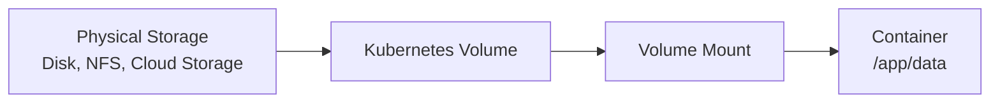
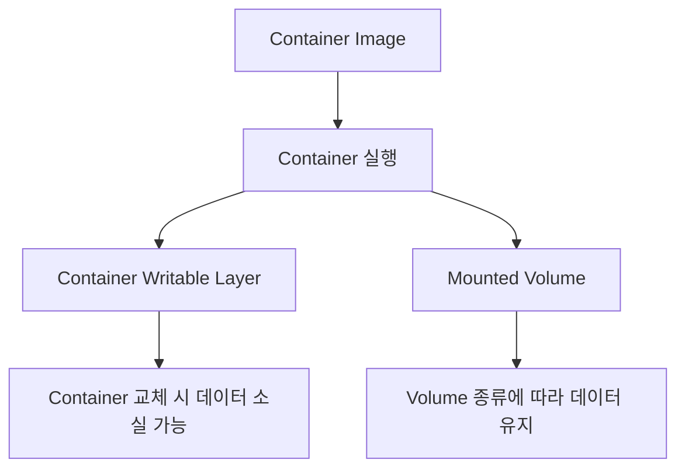
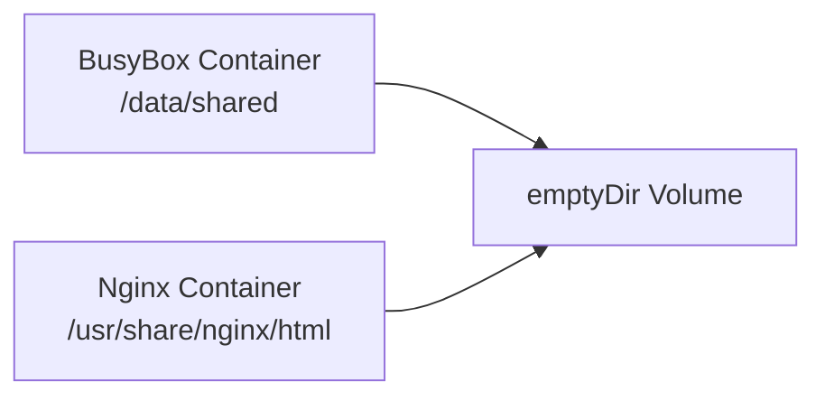
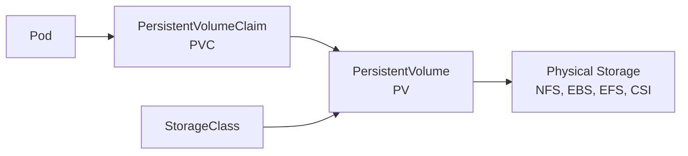
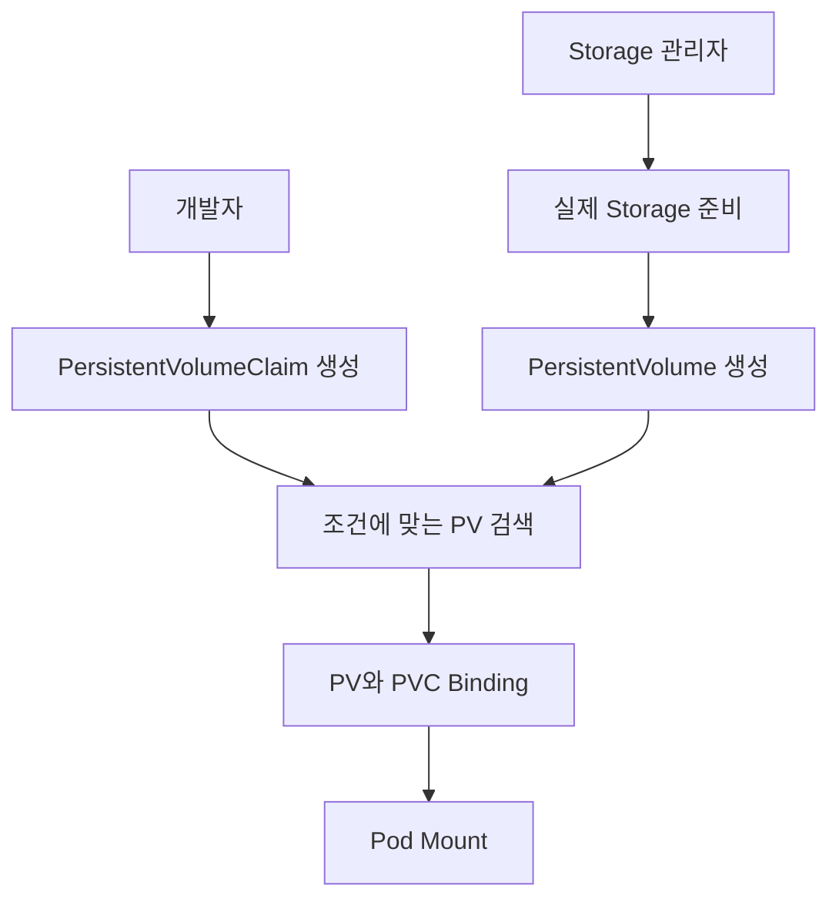
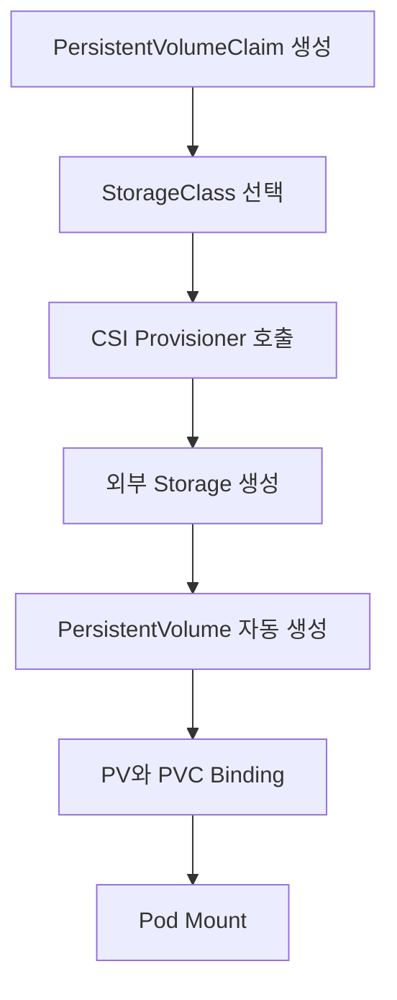

# Kubernetes의 스토리지 활용

# Kubernetes의 스토리지 활용

* toc
{:toc}

---

## Kubernetes의 스토리지 활용

컨테이너의 파일 시스템은 영구 저장소가 아니다. 컨테이너가 재시작되거나 새로 생성되면 컨테이너 내부에서 작성한 파일이 사라질 수 있다. Kubernetes에서는 이러한 문제를 해결하기 위해 스토리지를 `Volume`이라는 형태로 추상화한다.

Volume은 실제로 다음과 같은 여러 저장장치를 기반으로 만들 수 있다.

- Node에 연결된 로컬 디스크
- NFS와 같은 네트워크 파일 시스템
- AWS EBS, AWS EFS, Google Persistent Disk, Azure Disk
- 메모리를 사용하는 `tmpfs`
- ConfigMap과 Secret
- CSI Driver가 제공하는 외부 스토리지

애플리케이션은 물리적인 저장장치를 직접 다루지 않는다. Pod에 Volume을 정의하고 Container의 특정 디렉터리에 마운트한 뒤 일반 파일 시스템처럼 사용한다.



### Container 파일 시스템과 Volume의 차이

Container Image는 애플리케이션을 실행하는 데 필요한 파일 시스템을 제공한다. Container가 실행된 후 파일을 생성하거나 수정할 수도 있지만, 이 변경 사항은 해당 Container의 쓰기 가능한 계층에 저장된다.

Container가 교체되면 새로운 Container는 다시 Image를 기준으로 생성된다. 이전 Container의 쓰기 계층에 저장했던 파일은 새 Container로 전달되지 않는다.

Volume은 Container 파일 시스템과 별도로 관리된다. Container가 재시작되더라도 같은 Pod가 유지되는 동안 Volume의 데이터는 유지될 수 있고, PersistentVolume을 사용하면 Pod가 교체된 뒤에도 데이터를 계속 사용할 수 있다.



### 임시 Volume과 영구 Volume

Kubernetes Volume은 생명주기를 기준으로 임시 Volume과 영구 Volume으로 나눌 수 있다.

| 구분 | 생명주기 | 대표적인 유형 | 주요 용도 |
|---|---|---|---|
| 임시 Volume | Pod 생명주기에 종속 | `emptyDir` | 임시 파일, Container 간 파일 공유 |
| 영구 Volume | Pod 생명주기와 분리 | PV, PVC, CSI Volume | 데이터베이스, 업로드 파일, 영구 데이터 |
| 메모리 기반 임시 Volume | Pod 생명주기에 종속 | `emptyDir.medium: Memory` | 빠른 임시 처리, 민감한 임시 파일 |

여기서 주의할 점은 **Container 재시작과 Pod 삭제를 구분해야 한다는 것**이다.

- 같은 Pod 안에서 Container만 재시작되면 `emptyDir` 데이터는 유지된다.
- Pod가 삭제되거나 다른 Node에서 새로 생성되면 `emptyDir` 데이터는 사라진다.
- PersistentVolume을 사용하는 경우 Pod가 삭제되어도 데이터는 유지할 수 있다.
- PersistentVolume을 사용한다고 해서 데이터베이스 내부 복구까지 Kubernetes가 대신해 주는 것은 아니다.

## 임시 Volume

### emptyDir

`emptyDir`은 Pod가 Node에 배치될 때 생성되는 임시 Volume이다. 처음 생성될 때는 비어 있으며, Pod 안의 여러 Container가 같은 Volume을 서로 다른 경로에 마운트할 수 있다.

```yaml
apiVersion: v1
kind: Pod
metadata:
  name: emptydir-sample
spec:
  containers:
    - name: app
      image: busybox:1.36.1
      command:
        - sh
        - -c
        - sleep 3600
      volumeMounts:
        - name: cache-volume
          mountPath: /cache
  volumes:
    - name: cache-volume
      emptyDir:
        sizeLimit: 500Mi
```

주요 필드는 다음과 같다.

| 필드 | 설명 |
|---|---|
| `spec.volumes` | Pod가 사용할 Volume 목록 |
| `volumes[].name` | Pod 내부에서 Volume을 식별할 이름 |
| `emptyDir` | 임시 Volume을 생성하도록 지정 |
| `sizeLimit` | Volume이 사용할 수 있는 최대 용량 |
| `volumeMounts` | Container에 Volume을 연결하는 설정 |
| `mountPath` | Container 내부에서 Volume을 사용할 경로 |

`volumeMounts[].name`과 `volumes[].name`은 반드시 일치해야 한다.

`emptyDir` 데이터는 Container가 비정상 종료되어 재시작되더라도 같은 Pod가 유지되는 동안에는 남아 있다. 하지만 Pod가 Node에서 제거되면 데이터도 함께 삭제된다. 이 생명주기는 [Kubernetes Volume 문서](https://kubernetes.io/docs/concepts/storage/volumes/)에서도 Container 재시작과 Pod 제거를 구분해 설명한다.

### emptyDir이 유용한 경우

임시 Volume은 데이터를 영구 저장할 수 없지만 서버 애플리케이션에서도 자주 사용된다.

- 대용량 파일 업로드를 처리하는 동안 사용할 임시 파일
- 압축 및 압축 해제 작업 공간
- 이미지와 동영상 변환 과정에서 생성되는 중간 파일
- 정렬이나 집계 작업의 임시 디스크
- 같은 Pod의 Sidecar Container와 파일을 공유하는 공간
- 애플리케이션에서 다시 생성할 수 있는 Cache
- 장애 복구를 위한 Pod 내부의 임시 Checkpoint

사용자의 업로드 파일을 `emptyDir`에 최종 저장하는 것은 적절하지 않다. Pod가 교체되면 파일이 사라지기 때문이다. 최종 결과는 Object Storage, Network File System 또는 PersistentVolume으로 옮겨야 한다.

### 메모리 기반 emptyDir

`emptyDir.medium`에 `Memory`를 지정하면 디스크 대신 메모리 기반 파일 시스템인 `tmpfs`를 사용한다.

```yaml
apiVersion: v1
kind: Pod
metadata:
  name: memory-emptydir
spec:
  containers:
    - name: app
      image: busybox:1.36.1
      command:
        - sh
        - -c
        - sleep 3600
      resources:
        requests:
          memory: 128Mi
        limits:
          memory: 256Mi
      volumeMounts:
        - name: memory-cache
          mountPath: /cache
  volumes:
    - name: memory-cache
      emptyDir:
        medium: Memory
        sizeLimit: 64Mi
```

메모리 기반 Volume은 빠르지만 무료 자원이 아니다. 파일을 작성한 Container의 메모리 사용량으로 계산되므로 Memory Limit에 영향을 준다. 메모리 사용량이 Limit을 초과하면 Container가 `OOMKilled`될 수 있다.

따라서 다음과 같은 경우에만 제한적으로 사용하는 것이 좋다.

- 데이터 크기가 작고 상한을 예측할 수 있는 경우
- 디스크 I/O 지연을 피해야 하는 경우
- Pod가 종료되면 즉시 폐기해도 되는 민감한 임시 데이터
- Memory Request와 Limit을 함께 관리할 수 있는 경우

`sizeLimit`를 지정하더라도 Node의 임시 스토리지나 메모리가 먼저 부족해질 수 있다. `sizeLimit`가 해당 용량을 언제나 보장한다는 의미는 아니다.

## emptyDir Volume Mount 실습

### 실습 목표

하나의 Pod에 BusyBox와 Nginx Container를 실행하고 동일한 `emptyDir`을 서로 다른 경로에 마운트한다. BusyBox에서 생성한 파일을 Nginx가 읽는 과정을 통해 같은 Pod의 Container가 Volume을 공유한다는 점을 확인한다.



### Pod 작성

`fourth-pod.yaml`을 작성한다.

```yaml
apiVersion: v1
kind: Pod
metadata:
  name: emptydir-example
  labels:
    app: emptydir-example
spec:
  restartPolicy: Always
  volumes:
    - name: emptydir-volume
      emptyDir:
        sizeLimit: 100Mi
  containers:
    - name: busybox
      image: busybox:1.36.1
      command:
        - sh
        - -c
        - sleep 3600
      volumeMounts:
        - name: emptydir-volume
          mountPath: /data/shared
    - name: nginx
      image: nginx:1.27-alpine
      ports:
        - name: http
          containerPort: 80
      volumeMounts:
        - name: emptydir-volume
          mountPath: /usr/share/nginx/html
```

Pod에 두 개의 Container가 있으므로 `kubectl exec`를 사용할 때 `-c` 옵션으로 Container를 지정해야 한다.

### Pod 적용

```bash
kubectl apply -f fourth-pod.yaml
```

정상적으로 생성되면 다음과 같은 결과가 출력된다.

```text
pod/emptydir-example created
```

Pod 상태를 확인한다.

```bash
kubectl get pod emptydir-example
```

```text
NAME               READY   STATUS    RESTARTS   AGE
emptydir-example   2/2     Running   0          10s
```

`READY`가 `2/2`라면 두 Container가 모두 준비된 상태다.

### BusyBox에서 파일 생성

```bash
kubectl exec -it emptydir-example -c busybox -- sh
```

Container 안에서 파일을 생성한다.

```sh
cd /data/shared
echo 'hello, world!' > hello.txt
cat hello.txt
```

```text
hello, world!
```

Shell을 종료한다.

```sh
exit
```

### Nginx에서 같은 파일 확인

```bash
kubectl exec -it emptydir-example -c nginx -- sh
```

Nginx Container에는 같은 Volume이 `/usr/share/nginx/html`에 마운트되어 있다.

```sh
cd /usr/share/nginx/html
ls
cat hello.txt
```

```text
hello.txt
hello, world!
```

Nginx가 제공하는 HTTP 응답으로도 확인할 수 있다.

```sh
wget -qO- http://localhost/hello.txt
```

```text
hello, world!
```

이번에는 Nginx Container에서 새로운 파일을 생성한다.

```sh
echo 'hello, again!' > hello2.txt
exit
```

BusyBox Container에서 파일을 확인한다.

```bash
kubectl exec emptydir-example -c busybox -- ls -l /data/shared
kubectl exec emptydir-example -c busybox -- cat /data/shared/hello2.txt
```

```text
hello, again!
```

두 Container가 서로 다른 경로를 사용하지만 실제로는 같은 `emptyDir`을 보고 있기 때문에 한쪽의 변경 사항이 다른 쪽에도 바로 나타난다.

### Pod 삭제 후 데이터 확인

Pod를 삭제한다.

```bash
kubectl delete pod emptydir-example
```

같은 YAML로 Pod를 다시 생성한다.

```bash
kubectl apply -f fourth-pod.yaml
```

새 Pod의 디렉터리를 확인한다.

```bash
kubectl exec emptydir-example -c busybox -- ls -la /data/shared
```

새로운 Pod에는 이전 `hello.txt`와 `hello2.txt`가 남아 있지 않는다. 이름이 같은 Pod를 다시 만들었더라도 이전 Pod와는 다른 객체이며 새로운 `emptyDir`이 생성되기 때문이다.

## 영구 Volume

영구 Volume은 Pod의 생명주기와 분리된 스토리지다. Pod가 삭제되거나 다시 생성되어도 동일한 저장소를 연결하면 이전 데이터를 계속 사용할 수 있다.

Kubernetes의 영구 스토리지는 주로 다음 세 객체로 구성된다.



각 객체의 역할은 명확하게 구분된다.

| 객체 | 역할 | 범위 |
|---|---|---|
| PersistentVolume | 실제 스토리지를 Kubernetes 객체로 표현 | Cluster |
| PersistentVolumeClaim | 애플리케이션이 필요한 스토리지 조건을 요청 | Namespace |
| StorageClass | 동적 생성에 사용할 Provisioner와 정책 정의 | Cluster |

Pod는 PV를 직접 지정하지 않는다. PVC를 참조하고, Kubernetes가 PVC의 조건에 맞는 PV를 연결한다.

### PersistentVolume

PersistentVolume은 실제 스토리지 자원을 Kubernetes 객체로 표현한다.

다음은 이미 준비된 NFS 디렉터리를 정적 PV로 등록하는 예다.

```yaml
apiVersion: v1
kind: PersistentVolume
metadata:
  name: sample-nfs-pv
spec:
  capacity:
    storage: 30Gi
  volumeMode: Filesystem
  accessModes:
    - ReadWriteMany
  storageClassName: nfs-manual
  persistentVolumeReclaimPolicy: Retain
  mountOptions:
    - nfsvers=4.1
  nfs:
    server: "10.20.30.40"
    path: "/pv/sample"
```

이 Manifest가 NFS Server와 디렉터리를 자동으로 생성하는 것은 아니다. NFS Server와 공유 경로가 먼저 준비되어 있고, Kubernetes Node에서 해당 주소에 접근할 수 있어야 한다.

### PersistentVolumeClaim

PVC는 애플리케이션이 원하는 스토리지 조건을 표현한다.

```yaml
apiVersion: v1
kind: PersistentVolumeClaim
metadata:
  name: sample-nfs-pvc
spec:
  accessModes:
    - ReadWriteMany
  storageClassName: nfs-manual
  resources:
    requests:
      storage: 20Gi
```

PVC는 다음 조건을 기준으로 적절한 PV를 찾는다.

- `storageClassName`
- `accessModes`
- `volumeMode`
- 요청 용량
- Label Selector가 있다면 해당 조건

PVC가 20Gi를 요청했다고 해서 정확히 20Gi PV만 연결되는 것은 아니다. 조건을 만족하는 30Gi PV가 있다면 해당 PV가 할당될 수 있다. 하나의 PV가 PVC에 바인딩되면 다른 PVC가 동시에 같은 PV를 다시 점유할 수는 없다.

### Access Mode

Access Mode는 Volume을 어떤 방식으로 Node 또는 Pod에 연결할 수 있는지 나타낸다.

| Access Mode | 약어 | 의미 |
|---|---|---|
| `ReadWriteOnce` | RWO | 하나의 Node에서 읽기와 쓰기로 마운트 |
| `ReadOnlyMany` | ROX | 여러 Node에서 읽기 전용으로 마운트 |
| `ReadWriteMany` | RWX | 여러 Node에서 읽기와 쓰기로 마운트 |
| `ReadWriteOncePod` | RWOP | 클러스터 전체에서 하나의 Pod만 읽기와 쓰기로 마운트 |

`ReadWriteMany`는 여러 Pod가 읽기 전용으로 접근하는 설정이 아니다. 여러 Node에서 읽고 쓸 수 있는 모드다.

`ReadWriteOnce`도 반드시 하나의 Pod만 사용할 수 있다는 의미는 아니다. 하나의 Node에 있는 여러 Pod가 동일한 Volume을 사용할 가능성이 있다. 클러스터 전체에서 하나의 Pod만 사용하도록 제한하려면 CSI Volume에서 지원하는 `ReadWriteOncePod`를 검토해야 한다.

Access Mode 지원 여부는 스토리지 종류와 CSI Driver에 따라 다르다.

- AWS EBS와 같은 일반적인 Block Storage는 주로 `ReadWriteOnce`를 사용한다.
- NFS와 AWS EFS 같은 Network File System은 `ReadWriteMany` 구성이 가능하다.
- 모든 CSI Driver가 모든 Access Mode를 지원하는 것은 아니다.

또한 Access Mode는 PV와 PVC를 매칭하고 Mount 가능 범위를 표현하는 정보다. 일반적인 RWO, ROX, RWX 값만으로 Container 내부의 파일 쓰기 권한까지 완전히 강제하는 것은 아니다. 자세한 제한은 [PersistentVolume의 Access Mode](https://kubernetes.io/docs/concepts/storage/persistent-volumes/)와 사용 중인 Storage Driver의 동작을 함께 확인해야 한다.

### Reclaim Policy

`persistentVolumeReclaimPolicy`는 PVC가 삭제되어 PV가 해제된 뒤 실제 스토리지 자원을 어떻게 처리할지 결정한다.

| 정책 | 동작 |
|---|---|
| `Retain` | PV와 실제 데이터의 자동 삭제를 막고 관리자가 직접 정리 |
| `Delete` | PV와 연결된 외부 스토리지 자원을 함께 삭제 |
| `Recycle` | 과거에 사용하던 정책으로 현재는 사용하지 않음 |

`Retain`은 중요한 데이터를 보호하는 데 유리하지만, PVC를 삭제한 뒤 PV가 `Released` 상태로 남을 수 있다. 새로운 PVC에 다시 연결하려면 기존 Claim 참조와 스토리지 데이터를 관리자가 직접 정리해야 한다.

`Delete`는 개발 환경이나 자동화된 동적 Provisioning에 편리하지만 PVC를 삭제하면 실제 디스크까지 제거될 수 있다. 데이터 보호 정책, Snapshot, Backup 여부를 확인하고 사용해야 한다.

Reclaim Policy는 Pod가 더 이상 Volume을 사용하지 않는 순간 적용되는 것이 아니다. 일반적으로 PVC가 삭제되어 PV와의 바인딩이 해제될 때 의미가 있다.

## 정적 할당과 동적 할당

### 정적 할당

정적 할당은 관리자가 실제 저장소와 PV를 미리 준비하는 방식이다.



정적 할당은 다음 환경에 적합하다.

- 기존 NFS나 NAS를 사용해야 하는 경우
- 물리 디스크와 경로가 이미 정해진 경우
- 데이터가 들어 있는 기존 Volume을 연결하는 경우
- 스토리지 생성을 플랫폼에서 자동화할 수 없는 경우
- 자원 생성과 삭제를 관리자가 통제해야 하는 경우

관리자가 PV의 수량과 용량을 미리 계획해야 한다는 단점이 있다. PVC 조건을 충족하는 PV가 없다면 PVC는 `Pending` 상태에 머문다.

### 동적 할당

동적 할당은 PVC가 요청한 조건에 따라 실제 스토리지와 PV를 자동으로 생성하는 방식이다.



동적 할당은 PV를 미리 만들어 둘 필요가 없다는 장점이 있다. StorageClass와 CSI Driver가 정상적으로 설치되어 있어야 하며, 스토리지 생성 권한과 비용도 함께 관리해야 한다.

| 구분 | 정적 할당 | 동적 할당 |
|---|---|---|
| 실제 Storage 생성 | 관리자가 사전에 생성 | PVC 요청 시 자동 생성 |
| PV 생성 | 관리자가 직접 생성 | Provisioner가 자동 생성 |
| StorageClass | 선택적 | 일반적으로 필요 |
| 운영 편의성 | 수동 관리 필요 | 자동화에 유리 |
| 자원 통제 | 계획한 자원만 사용 | 요청에 따라 자원 증가 |
| 대표 사례 | 기존 NFS, Local Disk | EBS, EFS, Cloud Disk |

## 정적 할당 실습

### 실습 전제

다음 실습은 Docker Desktop, Minikube 같은 **단일 Node 로컬 클러스터**에서 PV와 PVC의 연결 과정을 확인하기 위한 예제다.

`hostPath`는 특정 Node의 로컬 디렉터리를 사용한다. 여러 Node로 구성된 운영 클러스터에서는 Pod가 다른 Node로 이동하면 데이터에 접근할 수 없으므로 영구 스토리지로 사용하기 어렵다.

Docker Desktop에서 `hostPath`는 Windows의 동일한 경로를 직접 의미하지 않을 수 있다. Docker Desktop이 사용하는 Linux VM 내부의 경로로 만들어질 수 있다.

### PersistentVolume 작성

`first-pv.yaml`을 작성한다.

```yaml
apiVersion: v1
kind: PersistentVolume
metadata:
  name: example-pv
spec:
  capacity:
    storage: 1Gi
  volumeMode: Filesystem
  accessModes:
    - ReadWriteOnce
  storageClassName: manual
  persistentVolumeReclaimPolicy: Retain
  hostPath:
    path: /var/local/example-pv
    type: DirectoryOrCreate
```

`storageClassName: manual`은 이 PV가 수동으로 관리되는 정적 PV임을 구분하기 위한 이름이다. 실제 StorageClass 객체가 반드시 존재해야 한다는 의미는 아니지만 PVC에도 같은 이름을 지정해야 한다.

`hostPath.type: DirectoryOrCreate`는 경로가 없다면 디렉터리를 생성한다.

### PersistentVolumeClaim 작성

`first-pvc.yaml`을 작성한다.

```yaml
apiVersion: v1
kind: PersistentVolumeClaim
metadata:
  name: example-pvc
spec:
  accessModes:
    - ReadWriteOnce
  storageClassName: manual
  volumeMode: Filesystem
  resources:
    requests:
      storage: 800Mi
```

PVC는 800Mi를 요청한다. PV는 1Gi를 제공하므로 용량 조건을 충족한다. Access Mode, Volume Mode와 StorageClass도 일치하기 때문에 정상적으로 바인딩할 수 있다.

클러스터에 기본 StorageClass가 있는 상태에서 `storageClassName`을 생략하면 의도와 다르게 동적 Provisioning이 수행될 수 있다. 정적 할당 실습에서는 PV와 PVC의 `storageClassName`을 명시적으로 맞추는 편이 안전하다.

### PVC를 사용하는 Pod 작성

`fifth-pod.yaml`을 작성한다.

```yaml
apiVersion: v1
kind: Pod
metadata:
  name: pvc-pod
  labels:
    app: pvc-pod
spec:
  containers:
    - name: nginx
      image: nginx:1.27-alpine
      volumeMounts:
        - name: example-volume
          mountPath: /my/data
  volumes:
    - name: example-volume
      persistentVolumeClaim:
        claimName: example-pvc
```

Pod는 PV 이름을 직접 참조하지 않고 PVC 이름인 `example-pvc`를 참조한다.

PVC는 Namespace 범위의 객체이므로 Pod와 같은 Namespace에 있어야 한다. PV는 Cluster 범위 객체이므로 Namespace가 없다.

### 객체 적용

PV, PVC, Pod 순서로 적용한다.

```bash
kubectl apply -f first-pv.yaml
kubectl apply -f first-pvc.yaml
kubectl apply -f fifth-pod.yaml
```

정상적으로 생성되면 다음과 같은 결과가 출력된다.

```text
persistentvolume/example-pv created
persistentvolumeclaim/example-pvc created
pod/pvc-pod created
```

PV와 PVC 상태를 확인한다.

```bash
kubectl get pv
kubectl get pvc
```

정상이라면 두 객체의 상태가 `Bound`로 표시된다.

```text
NAME         CAPACITY   ACCESS MODES   RECLAIM POLICY   STATUS   CLAIM
example-pv   1Gi        RWO            Retain           Bound    default/example-pvc
```

```text
NAME          STATUS   VOLUME       CAPACITY   ACCESS MODES
example-pvc   Bound    example-pv   1Gi        RWO
```

Pod가 `Pending`이라면 바로 애플리케이션 문제라고 판단하지 말고 Event를 확인한다.

```bash
kubectl describe pod pvc-pod
kubectl describe pvc example-pvc
```

### 파일 작성

Pod 내부로 들어간다.

```bash
kubectl exec -it pvc-pod -- sh
```

마운트된 디렉터리에 파일을 작성한다.

```sh
cd /my/data
echo "persistent data" > persistent.txt
cat persistent.txt
exit
```

```text
persistent data
```

Mount 상태는 다음 명령으로 확인할 수 있다.

```bash
kubectl exec pvc-pod -- mount
kubectl exec pvc-pod -- df -h /my/data
```

### Pod 재생성 후 데이터 확인

Pod를 삭제한다.

```bash
kubectl delete pod pvc-pod
```

같은 PVC를 사용하는 Pod를 다시 생성한다.

```bash
kubectl apply -f fifth-pod.yaml
kubectl wait --for=condition=Ready pod/pvc-pod --timeout=60s
```

이전에 작성한 파일을 확인한다.

```bash
kubectl exec pvc-pod -- cat /my/data/persistent.txt
```

```text
persistent data
```

Pod는 새로 만들어졌지만 PVC가 같은 PV를 다시 연결했기 때문에 데이터가 유지된다.

### 리소스 정리

먼저 Volume을 사용하는 Pod를 삭제한다.

```bash
kubectl delete pod pvc-pod
```

PVC를 삭제한다.

```bash
kubectl delete pvc example-pvc
```

PV 상태를 확인한다.

```bash
kubectl get pv example-pv
```

`persistentVolumeReclaimPolicy: Retain`이므로 PV는 자동으로 재사용 가능한 상태로 돌아가지 않고 `Released` 상태로 남을 수 있다.

PV 객체를 삭제한다.

```bash
kubectl delete pv example-pv
```

`hostPath` 디렉터리와 실제 파일은 PV 객체를 삭제했다고 자동으로 사라진다고 가정해서는 안 된다. 필요한 경우 해당 Node에서 실제 디렉터리를 별도로 정리해야 한다.

## StorageClass와 동적 할당

StorageClass는 동적으로 생성할 Storage의 종류와 정책을 정의한다.

StorageClass에는 다음 정보가 포함될 수 있다.

- Storage를 생성할 CSI Provisioner
- 디스크 종류
- 파일 시스템 종류
- 암호화 여부
- Reclaim Policy
- Volume Binding 시점
- Volume 확장 허용 여부
- Zone과 같은 Topology 조건

클러스터에 이미 기본 StorageClass가 구성되어 있는지 먼저 확인한다.

```bash
kubectl get storageclass
```

```text
NAME                 PROVISIONER             RECLAIMPOLICY   VOLUMEBINDINGMODE
standard (default)   example.csi.driver      Delete          WaitForFirstConsumer
```

`(default)`로 표시된 StorageClass가 있다면 `storageClassName`을 생략한 PVC가 해당 StorageClass를 사용할 수 있다.

### Volume Binding Mode

StorageClass의 `volumeBindingMode`는 PV를 언제 생성하고 PVC에 연결할지 결정한다.

| 모드 | 동작 |
|---|---|
| `Immediate` | PVC가 생성되는 즉시 PV 생성 및 바인딩 |
| `WaitForFirstConsumer` | PVC를 사용하는 Pod가 생성되고 배치될 때 PV 생성 |

Zone에 종속되는 Block Storage에서는 `WaitForFirstConsumer`가 중요하다. PVC를 먼저 보고 디스크를 생성하면 Pod가 배치되는 Zone과 디스크의 Zone이 달라질 수 있다.

`WaitForFirstConsumer`는 Scheduler가 Pod의 Node, Zone, Affinity와 Taint 조건을 고려한 뒤 적절한 위치에 Volume을 만들 수 있게 한다. 자세한 동작은 [StorageClass의 Volume Binding Mode](https://kubernetes.io/docs/concepts/storage/storage-classes/)에서 확인할 수 있다.

### AWS EBS CSI StorageClass 예제

일반적인 Amazon EKS 클러스터에서 AWS EBS CSI Driver를 사용한다면 다음과 같은 StorageClass를 정의할 수 있다.

```yaml
apiVersion: storage.k8s.io/v1
kind: StorageClass
metadata:
  name: ebs-gp3
provisioner: ebs.csi.aws.com
parameters:
  type: gp3
  encrypted: "true"
  csi.storage.k8s.io/fstype: ext4
reclaimPolicy: Delete
allowVolumeExpansion: true
volumeBindingMode: WaitForFirstConsumer
```

과거에 사용하던 다음 Provisioner는 현재 환경에 그대로 사용하면 안 된다.

```yaml
provisioner: kubernetes.io/aws-ebs
```

AWS EBS의 In-Tree Driver는 제거되었으므로 CSI Driver를 사용해야 한다.

일반 EKS의 EBS CSI Driver는 `ebs.csi.aws.com`을 사용한다. EKS Auto Mode는 별도의 Provisioner인 `ebs.csi.eks.amazonaws.com`을 사용하므로 두 구성을 혼동하면 안 된다. 실제 구성은 [Amazon EKS EBS CSI 안내](https://docs.aws.amazon.com/eks/latest/userguide/ebs-csi.html)와 클러스터 유형을 기준으로 확인해야 한다.

### 동적 PVC 작성

```yaml
apiVersion: v1
kind: PersistentVolumeClaim
metadata:
  name: app-data-pvc
spec:
  accessModes:
    - ReadWriteOnce
  storageClassName: ebs-gp3
  volumeMode: Filesystem
  resources:
    requests:
      storage: 20Gi
```

PVC를 적용한다.

```bash
kubectl apply -f app-data-pvc.yaml
```

`volumeBindingMode: WaitForFirstConsumer`라면 PVC만 생성했을 때 `Pending`으로 보일 수 있다. 이것은 실패가 아니라 PVC를 사용하는 Pod가 생성되기를 기다리는 상태다.

```bash
kubectl get pvc app-data-pvc
```

Pod에서 PVC를 사용한다.

```yaml
apiVersion: v1
kind: Pod
metadata:
  name: app-data-pod
spec:
  containers:
    - name: app
      image: nginx:1.27-alpine
      volumeMounts:
        - name: app-data
          mountPath: /app/data
  volumes:
    - name: app-data
      persistentVolumeClaim:
        claimName: app-data-pvc
```

Pod를 생성하면 Scheduler가 Pod를 배치할 Zone을 결정하고, CSI Provisioner가 해당 Zone에 EBS Volume을 생성한다.

```bash
kubectl apply -f app-data-pod.yaml
kubectl get pod,pvc,pv
```

EBS는 일반적으로 하나의 Availability Zone에 속하는 Block Storage다. Pod가 다른 Zone으로 이동해야 한다면 Volume도 해당 Zone에서 사용할 수 있는지 확인해야 한다. Multi-Zone 공유 파일 시스템이 필요하다면 EFS처럼 `ReadWriteMany`를 지원하는 스토리지를 검토할 수 있다.

## 스토리지 선택 기준

모든 영구 데이터를 PV에 저장하는 것이 정답은 아니다. 데이터의 성격과 접근 방식을 기준으로 저장소를 선택해야 한다.

| 데이터 | 권장 저장소 |
|---|---|
| API 처리 중 생성되는 임시 파일 | `emptyDir` |
| 작은 임시 Cache | `emptyDir` 또는 메모리 기반 Volume |
| 사용자 이미지 및 동영상 | Object Storage와 CDN |
| 단일 인스턴스 데이터 파일 | RWO Block Storage |
| 여러 Pod가 공유할 파일 | RWX Network File System |
| 관계형 데이터 | Managed Database 또는 운영 가능한 DB 구성 |
| 설정 파일 | ConfigMap |
| 인증서와 Key | Secret 또는 외부 Secret Store |
| 로그 | 표준 출력과 중앙 로그 시스템 |

사용자 업로드 파일을 여러 Pod가 공유해야 한다는 이유만으로 바로 NFS를 선택하기보다 Object Storage가 더 적합한지 먼저 검토할 필요가 있다. Object Storage는 애플리케이션 인스턴스와 저장 공간을 분리하기 쉽고, CDN과도 자연스럽게 연결할 수 있다.

반면 POSIX 파일 시스템 기능이 필요하거나 기존 애플리케이션이 파일 경로를 직접 사용한다면 NFS, EFS와 같은 Network File System이 현실적인 선택이 될 수 있다.

## 장애 상황과 확인 방법

### PVC가 Pending 상태에 머무르는 경우

```bash
kubectl describe pvc <PVC_NAME>
kubectl get pv
kubectl get storageclass
```

확인할 항목은 다음과 같다.

- 요청한 용량을 만족하는 PV가 있는가
- PV와 PVC의 Access Mode가 일치하는가
- `storageClassName`이 일치하는가
- `volumeMode`가 일치하는가
- CSI Driver가 설치되어 있는가
- Storage Provisioner에 필요한 권한이 있는가
- `WaitForFirstConsumer` 상태에서 Pod 생성을 기다리는 것은 아닌가

### Pod가 Pending 또는 ContainerCreating에 머무르는 경우

```bash
kubectl describe pod <POD_NAME>
```

Event에서 다음 메시지를 확인한다.

- `FailedScheduling`
- `FailedAttachVolume`
- `FailedMount`
- `FailedBinding`
- `ProvisioningFailed`

가능한 원인은 다음과 같다.

- Pod와 Volume의 Zone이 다름
- Volume이 다른 Node에 연결되어 있음
- Node에서 NFS Server에 접근할 수 없음
- 잘못된 Mount Option
- CSI Node Plugin 미실행
- 디스크 연결 수 제한 초과
- 파일 시스템 손상
- 디렉터리 권한 부족

### 파일 쓰기 시 Permission denied가 발생하는 경우

Volume이 정상적으로 마운트되어도 Container 사용자가 디렉터리에 쓸 권한이 없을 수 있다.

```bash
kubectl exec <POD_NAME> -- id
kubectl exec <POD_NAME> -- ls -ld <MOUNT_PATH>
```

필요한 경우 Pod의 `securityContext`에서 `fsGroup`을 지정할 수 있다.

```yaml
spec:
  securityContext:
    fsGroup: 2000
```

다만 CSI Driver와 파일 시스템에 따라 `fsGroup` 적용 방식과 성능이 다를 수 있다. 운영 환경에서는 무조건 `chmod 777`을 적용하기보다 실행 사용자와 그룹 권한을 명확하게 설계해야 한다.

### Node의 임시 스토리지가 부족한 경우

`emptyDir`과 Container 로그, Image Layer는 Node의 임시 스토리지를 함께 사용할 수 있다.

Node의 여유 공간이 부족해지면 Pod가 Eviction될 수 있다.

```bash
kubectl describe node <NODE_NAME>
kubectl describe pod <POD_NAME>
```

`DiskPressure`, `ephemeral-storage` 부족, Eviction 관련 Event를 확인한다.

Pod에 임시 스토리지 Request와 Limit을 설정할 수도 있다.

```yaml
resources:
  requests:
    ephemeral-storage: 256Mi
  limits:
    ephemeral-storage: 1Gi
```

`emptyDir.sizeLimit`만 설정하고 Container의 임시 스토리지 사용량을 관리하지 않으면 로그나 Container 쓰기 계층이 Node 공간을 계속 사용할 수 있다.

## 실무에서 확인해야 할 사항

### Volume은 Backup이 아니다

PersistentVolume은 Pod가 삭제된 뒤에도 데이터를 유지할 수 있게 해주지만 Backup을 자동으로 제공한다는 의미는 아니다.

중요한 데이터에는 별도의 정책이 필요하다.

- 정기 Backup
- Volume Snapshot
- 다른 Region 또는 저장소로 복제
- 복구 절차 검증
- 보존 기간
- 암호화
- 삭제 권한 제한

### Kubernetes Self-Healing과 데이터 복구는 다르다

Kubernetes는 Pod가 실패하면 새로운 Pod를 만들고 PVC를 다시 마운트할 수 있다. 하지만 데이터베이스의 Transaction Log 복구, 손상된 파일 복구, 중복 데이터 정리는 애플리케이션이나 데이터베이스가 담당해야 한다.

새로운 Pod가 정상적으로 실행되었다는 사실만으로 내부 데이터까지 정상이라고 판단할 수는 없다.

### StatefulSet이 스토리지 문제를 모두 해결하지는 않는다

StatefulSet은 Pod마다 안정적인 이름과 PVC를 제공할 수 있다. 그러나 데이터 복제, Leader Election, Quorum, Backup과 장애 복구는 데이터베이스나 운영자가 별도로 구성해야 한다.

### Reclaim Policy를 반드시 확인한다

개발 환경에서는 `Delete`가 편리하지만 운영 PVC를 실수로 삭제했을 때 실제 디스크까지 제거될 수 있다. 중요한 데이터는 `Retain`, Snapshot, 삭제 방지 정책을 함께 검토하는 편이 안전하다.

### Storage 비용을 함께 관리한다

동적 Provisioning을 사용하면 PVC 생성만으로 실제 Cloud Storage 비용이 발생할 수 있다.

- 사용하지 않는 PVC와 PV
- 삭제되지 않은 Snapshot
- 과도하게 큰 요청 용량
- 필요 이상으로 높은 IOPS와 Throughput
- 개발 환경에 남아 있는 디스크
- `Retain` 정책으로 해제된 Storage

Kubernetes 객체가 삭제되었다고 외부 Storage 자원도 반드시 삭제되는 것은 아니다. Cloud Console과 비용 보고서를 함께 확인해야 한다.

## 정리

Kubernetes의 Volume은 실제 디스크, NFS, Cloud Storage, 메모리 등 다양한 저장장치를 Pod에서 일관된 방식으로 사용할 수 있도록 추상화한다.

`emptyDir`은 Pod의 생명주기에 종속되는 임시 Volume이다. Container 재시작 중에는 데이터가 유지되지만 Pod가 삭제되면 데이터도 사라진다. 임시 파일, Cache, 같은 Pod의 Container 사이에서 파일을 공유할 때 적합하다.

영구 데이터를 저장하려면 PV와 PVC를 사용한다. PV는 실제 스토리지 자원을 나타내고, PVC는 애플리케이션이 원하는 용량과 Access Mode를 요청한다. Pod는 PV가 아니라 PVC를 참조한다.

StorageClass는 CSI Provisioner와 Storage 생성 정책을 정의한다. 동적 Provisioning에서는 PVC 요청에 맞춰 실제 Storage와 PV를 자동으로 생성한다. Zone에 종속되는 Block Storage라면 `WaitForFirstConsumer`를 사용해 Pod가 배치될 위치를 고려하는 것이 중요하다.

`ReadWriteOnce`, `ReadOnlyMany`, `ReadWriteMany`, `ReadWriteOncePod`는 각각 다른 Mount 범위를 의미한다. 특히 RWX는 여러 Node에서 읽고 쓸 수 있는 모드이며, RWO는 반드시 하나의 Pod만 사용할 수 있다는 의미가 아니다.

마지막으로 PersistentVolume은 데이터 보존 수단이지 Backup이나 데이터베이스 복구 기능이 아니다. 스토리지 유형, Reclaim Policy, Snapshot, Backup, 암호화, 비용과 장애 복구 절차를 함께 설계해야 운영 환경에서 데이터를 안전하게 관리할 수 있다.
