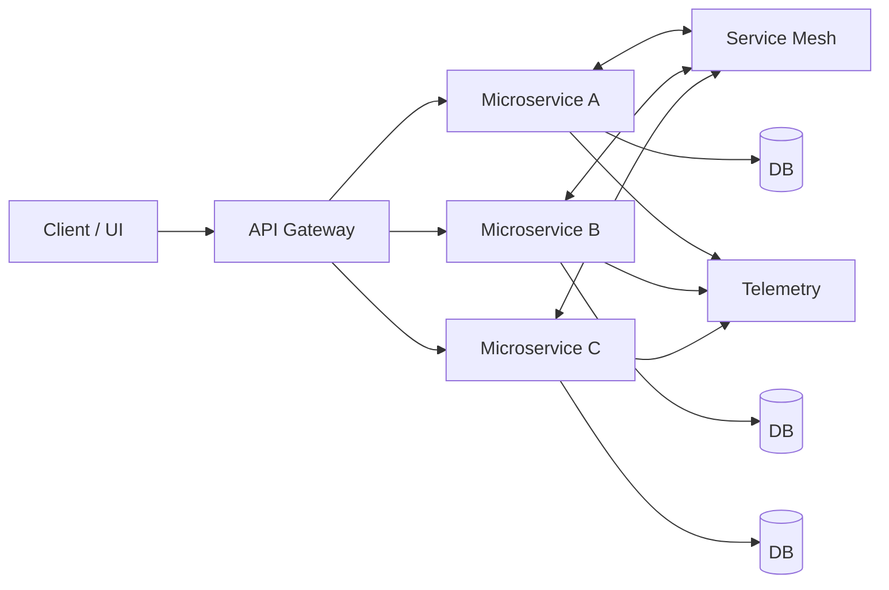

# MSA 내부 구성 (API Gateway, Service Mesh)

# MSA 내부 구성 (API Gateway, Service Mesh)
* toc
{:toc}

---

## MSA 환경에서 API 게이트웨이와 서비스 메쉬는 필수적인가?

마이크로서비스 아키텍처를 설계할 때 자주 나오는 질문이 있다.

> API Gateway와 Service Mesh는 반드시 필요한가?

결론부터 말하면, **필수라고 단정할 수는 없지만 사실상 필수에 가까운 핵심 구성 요소**이다.

MSA 환경에서는 서비스가 여러 개로 분리되기 때문에
외부 요청을 어떻게 관리할 것인지,
서비스 간 통신을 어떻게 제어할 것인지가 매우 중요해진다.

이 역할을 담당하는 것이 바로 **API Gateway와 Service Mesh**이다.

---

## MSA 내부 구성 요소

MSA 내부 구조를 보면 크게 두 가지 흐름이 존재한다.

* 외부 요청 처리 → API Gateway
* 내부 서비스 통신 → Service Mesh

강의 자료에서도 API Gateway를 중심으로 외부 요청이 들어오고,
각 마이크로서비스가 독립적으로 동작하는 구조를 확인할 수 있다

---

## MSA 구조 흐름 (Mermaid)

이 구조에서 중요한 포인트는 다음과 같다.

* 외부 요청은 반드시 API Gateway를 통해 들어온다
* 서비스 간 통신은 Service Mesh를 통해 제어된다
* 각 서비스는 독립적으로 DB를 가진다

---

## API 게이트웨이의 역할

API Gateway는 MSA에서 **외부와 내부를 연결하는 경계(Boundary)** 역할을 한다.

### 주요 기능

#### 요청 라우팅

* 외부 요청을 적절한 마이크로서비스로 전달

#### 인증 및 권한 부여

* 사용자 인증
* 접근 권한 검증

#### 요청 변환

* 외부 요청 → 내부 서비스 포맷 변환
* 내부 응답 → 외부 포맷 변환

#### 로드 밸런싱

* 여러 인스턴스로 트래픽 분산

#### API 집계 (Aggregation)

* 여러 서비스 호출 결과를 하나의 API로 제공

---

## API 게이트웨이가 중요한 이유

MSA에서는 서비스가 많아질수록 클라이언트가 직접 접근하기 어려워진다.

예를 들어:

* 서비스 URL이 계속 변경됨
* 인증 로직이 서비스마다 중복됨
* 여러 API를 조합해야 하는 문제 발생

이러한 문제를 해결하기 위해

> API Gateway를 통해 외부 요청을 중앙에서 통제한다

---

## 서비스 메쉬의 역할

Service Mesh는 **서비스 간 통신을 담당하는 인프라 레이어**이다.

애플리케이션 코드가 아닌, 네트워크 레벨에서 통신을 제어한다는 점이 핵심이다.

---

## 서비스 메쉬 주요 기능

### 서비스 간 통신 관리

* 어떤 서비스가 어떤 서비스를 호출하는지 제어

### 트래픽 관리

* 특정 서비스로 트래픽 증가/감소
* 카나리 배포, A/B 테스트 가능

### 보안

* 서비스 간 통신 암호화 (mTLS)
* 서비스 간 인증

### 관찰 가능성 (Observability)

* 호출 흐름 추적
* 지연 시간 분석

### 장애 복구

* Circuit Breaker
* Retry / Timeout
* 자동 failover

---

## 서비스 메쉬가 필요한 이유

서비스가 많아질수록 통신 복잡도가 급격히 증가한다.

예를 들어:

* Service A → B → C → D 호출
* 중간에 장애 발생
* 어디서 문제인지 파악 어려움

이 문제를 해결하기 위해

> 서비스 메쉬가 통신을 중앙에서 제어하고 관찰한다

---

## API Gateway vs Service Mesh

두 개념은 역할이 완전히 다르다.

| 구분    | API Gateway      | Service Mesh      |
| ----- | ---------------- | ----------------- |
| 위치    | 외부 진입 지점         | 서비스 내부            |
| 역할    | 클라이언트 요청 처리      | 서비스 간 통신 관리       |
| 대상    | Client → Service | Service ↔ Service |
| 주요 기능 | 인증, 라우팅, API 집계  | 트래픽 제어, 보안, 장애 대응 |

---

## 함께 사용되는 이유

API Gateway와 Service Mesh는 서로 대체 관계가 아니라 **보완 관계**이다.

* API Gateway → 외부 요청 처리
* Service Mesh → 내부 통신 처리

둘을 함께 사용하면:

* 외부 요청 관리 + 내부 통신 제어
* 보안 강화
* 장애 대응 향상
* 운영 복잡도 감소

---

## 정리

MSA 환경에서 API Gateway와 Service Mesh는 단순한 선택 옵션이 아니다.

서비스가 많아지고 트래픽이 증가할수록
이 두 요소는 점점 더 중요해진다.

---

### 한 줄 요약

MSA 환경에서 API Gateway는 외부 요청을 통합 관리하고,
Service Mesh는 서비스 간 통신을 제어하여
전체 시스템의 안정성과 확장성을 높이는 핵심 요소이다.

---

