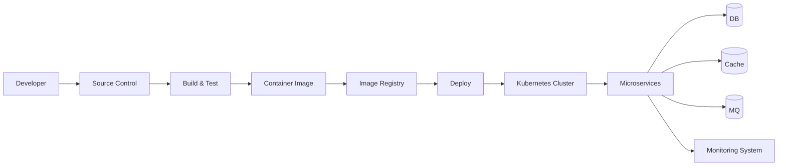

# MSA 내부 구성 (컨테이너, CI/CD, 모니터링)

# MSA 내부 구성 (컨테이너, CI/CD, 모니터링)
* toc
{:toc}

---

## MSA 인프라 구축에 필요한 핵심 요소

마이크로서비스 아키텍처를 설계할 때 많은 사람들이 서비스 분리와 API 구조에 집중하지만,
실제 운영에서는 **인프라가 훨씬 더 중요한 역할**을 한다.

MSA 환경에서는 다음 세 가지 요소가 반드시 필요하다.

* 컨테이너 기술
* CI/CD 파이프라인
* 모니터링 시스템

이 세 가지가 갖춰져야
서비스를 안정적으로 배포하고, 운영하고, 확장할 수 있다.

---

## MSA 인프라 전체 구조

MSA 인프라는 단순한 서버 구성이 아니라
개발부터 배포, 운영까지 이어지는 전체 흐름을 포함한다.

아래 구조는 MSA 인프라의 핵심 흐름을 단순화한 것이다.

이 구조에서 중요한 흐름은 다음과 같다.

* 개발 → 빌드 → 배포가 자동화된다
* 서비스는 컨테이너 기반으로 실행된다
* 운영 상태는 모니터링 시스템으로 수집된다

---

## 컨테이너 기술

MSA 환경에서 가장 기본이 되는 요소는 컨테이너이다.

### 개념

컨테이너는 애플리케이션을 격리된 환경에서 실행하는 기술이다.

강의 자료에서도
컨테이너는 OS 수준의 가상화를 통해 프로세스를 분리하는 방식으로 설명된다

---

### 특징

* 애플리케이션 실행 환경을 이미지로 관리
* 빠른 배포 및 실행
* 환경 간 일관성 유지

---

### 왜 중요한가?

MSA에서는 서비스 개수가 많아지기 때문에:

* 환경이 다르면 오류 발생
* 배포가 복잡해짐

이를 해결하기 위해

> 컨테이너를 통해 실행 환경을 표준화한다

---

## CI/CD 파이프라인

MSA에서는 배포 자동화가 필수이다.

서비스가 많기 때문에 수동 배포는 사실상 불가능하다.

---

### CI (지속적 통합)

* 코드 변경 사항을 자주 통합
* 자동 빌드 및 테스트 수행

---

### CD (지속적 배포)

* 테스트 완료된 코드를 자동 배포
* 운영 환경까지 자동 전달

---

### 전체 흐름

강의 자료의 흐름을 보면 다음과 같이 구성된다

---

### 효과

* 배포 속도 향상
* 오류 조기 발견
* 안정적인 릴리즈

---

## 모니터링 시스템

MSA에서는 모니터링이 선택이 아니라 필수이다.

서비스가 여러 개로 분리되면
장애 발생 시 원인을 찾기가 매우 어려워진다.

---

### 주요 구성 요소

강의 자료를 보면 모니터링 시스템은 다음 요소로 구성된다

* 로그 수집
* 메트릭 수집
* 알림 시스템
* 시각화(대시보드)

---

### 모니터링 구조

---

### 왜 중요한가?

MSA 환경에서는:

* 서비스 간 호출이 많음
* 장애 전파 가능성 존재
* 병목 지점 파악 어려움

따라서

> 실시간 모니터링 없이는 운영이 거의 불가능하다

---

## 백엔드 서비스와 데이터 구조

MSA에서는 데이터 구조도 기존과 다르게 설계된다.

강의 자료에서도 각 마이크로서비스가 독립적인 DB를 가지는 구조를 확인할 수 있다

---

### 특징

* 서비스별 DB 분리
* 캐시 사용
* 메시지 큐 활용

---

### 구성 요소

* DB (Primary 저장소)
* Cache (성능 개선)
* MQ (비동기 처리)

---

## 정리

MSA 인프라는 단순한 서버 구성이 아니라
다음 요소들이 유기적으로 결합된 시스템이다.

* 컨테이너 → 실행 환경 표준화
* CI/CD → 배포 자동화
* 모니터링 → 운영 안정성 확보

---

### 한 줄 요약

MSA 인프라는
컨테이너, CI/CD, 모니터링을 기반으로
서비스의 배포, 운영, 확장을 자동화하고 안정성을 확보하는 구조이다.

---

