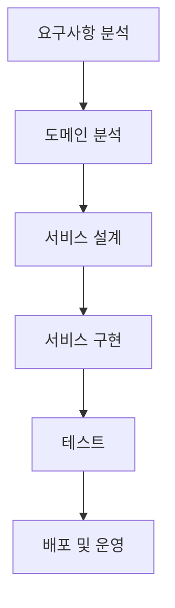
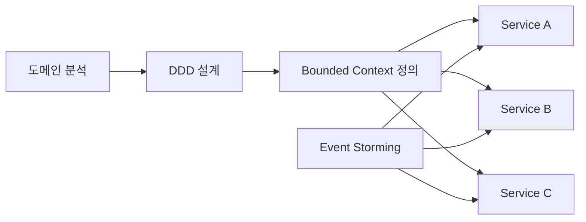

# 마이크로서비스 도출 방안

# 마이크로서비스 도출 방안
* toc
{:toc}

---

## 클라우드 네이트비 정보 시스템 개발 절차

### 마이크로서비스 도출 방안

마이크로서비스 아키텍처를 설계할 때 가장 어려운 질문은 다음이다.

> “서비스를 어떻게 나눠야 하는가?”

단순히 기능 기준으로 나누거나, API 단위로 나누는 것은
오히려 서비스 간 결합도를 높이고 운영을 더 어렵게 만들 수 있다.

그래서 MSA에서는
**체계적인 서비스 도출 방식**이 필요하다.

---

### 마이크로서비스 도출의 핵심 개념

마이크로서비스 도출은 단순한 분리가 아니라
다음 과정을 포함하는 설계 활동이다.

* 비즈니스 분석
* 도메인 분리
* 서비스 경계 설정
* 데이터 분리

강의 자료에서도
마이크로서비스 도출은 단순 설계가 아니라
**분석 → 설계 → 구현 → 테스트/배포까지 포함된 전체 흐름**으로 설명된다

---

### 마이크로서비스 도출 전체 흐름

이 흐름에서 중요한 점은:

* 서비스 도출은 분석 단계에서 시작된다
* 설계 이후에도 지속적으로 개선된다

---

### 마이크로서비스 도출 과정

#### 1. 분석 단계

* 요구사항 분석
* 비즈니스 흐름 파악
* 주요 기능 식별

이 단계에서 중요한 것은
“기술”이 아니라 “비즈니스 이해”이다.

---

#### 2. 설계 단계

* 서비스 경계 정의
* 데이터 모델 분리
* API 설계

여기서 잘못 나누면 이후 모든 문제가 발생한다.

---

#### 3. 구현 단계

* 마이크로서비스 개발
* API 구현
* 데이터 처리 로직 구성

---

#### 4. 테스트 및 배포

* 통합 테스트
* CI/CD 적용
* 운영 환경 배포

---

### 마이크로서비스 도출 방법

마이크로서비스를 나누는 대표적인 방법은 다음 세 가지이다.

---

#### 도메인 기반 설계 (DDD)

가장 중요한 방법이다.

###### 개념

* 비즈니스 도메인을 기준으로 서비스 분리
* 각 서비스는 독립적인 책임을 가짐

###### 핵심 요소

* Bounded Context
* Aggregate
* Entity

---

#### 이벤트 스토밍 (Event Storming)

비즈니스 흐름을 시각적으로 분석하는 방법이다.

###### 특징

* 이벤트 중심으로 흐름 정의
* 도메인 간 관계 파악

---

#### 프로세스 기반 분리

업무 흐름 기준으로 서비스 분리

###### 예시

* 주문 → 결제 → 배송

각 단계별로 서비스 분리

---

### 도출 방식 구조 (Mermaid)

---

### 왜 도출 방식이 중요한가?

마이크로서비스를 잘못 나누면 다음 문제가 발생한다.

* 서비스 간 호출 증가
* 데이터 정합성 문제
* 성능 저하
* 운영 복잡도 증가

즉,

> MSA의 성공 여부는 “서비스를 어떻게 나누느냐”에 달려 있다

---

### 좋은 마이크로서비스 설계 기준

#### 1. 높은 응집도

* 하나의 서비스는 하나의 책임

#### 2. 낮은 결합도

* 다른 서비스에 의존 최소화

#### 3. 독립 배포 가능

* 서비스별 배포 가능

#### 4. 데이터 독립성

* 서비스별 DB 분리

---

### 정리

마이크로서비스 도출은 단순한 기술 문제가 아니라
비즈니스와 시스템을 함께 설계하는 과정이다.

---

#### 한 줄 요약

마이크로서비스 도출은
도메인 기반 설계(DDD), 이벤트 스토밍 등을 활용하여
서비스 경계를 정의하고 독립적인 시스템으로 분리하는 과정이다.

---

