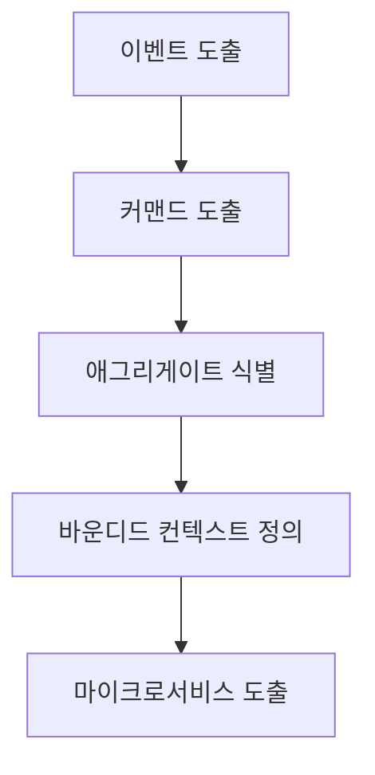
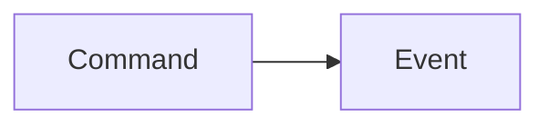
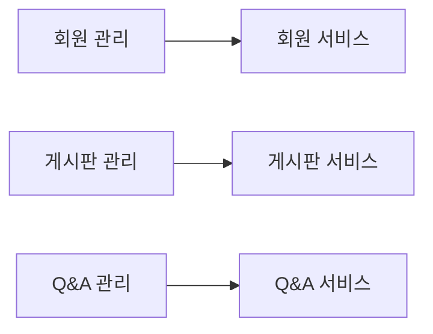
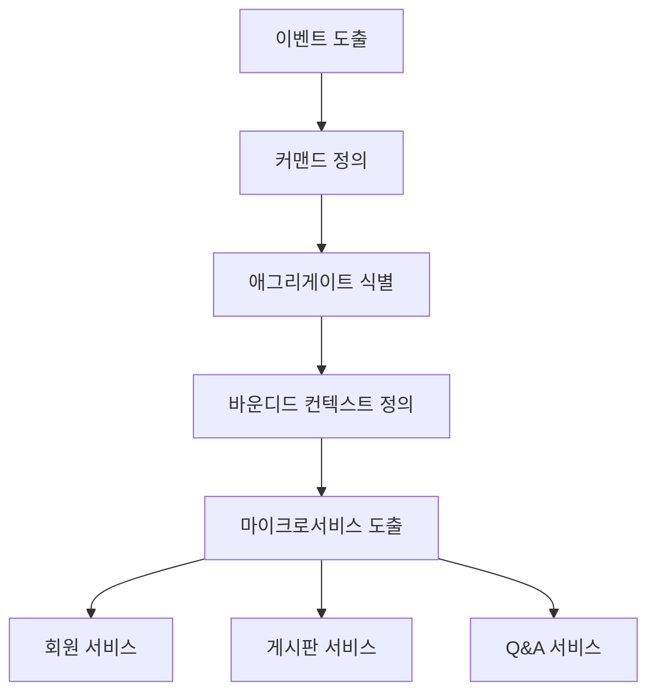

# 마이크로서비스 도출 과정

# 마이크로서비스 도출 과정
* toc
{:toc}

---

## 마이크로서비스 도출 과정

마이크로서비스를 어떻게 나눌 것인가에 대한 방법을 이해했다면,
다음 단계는 **실제로 어떻게 도출을 진행할 것인가**이다.

마이크로서비스 도출은 단순한 설계 작업이 아니라
도메인 이해부터 서비스 분리까지 이어지는 **단계적 프로세스**이다.

강의 자료에서도 도출 과정은
이벤트 기반 분석과 도메인 모델링을 중심으로 진행되는 것을 확인할 수 있다

---

## 마이크로서비스 도출 전체 흐름

이 흐름은 단순하지만 매우 중요하다.

* 이벤트 → 행동 → 데이터 → 경계 → 서비스
  이 순서로 점점 구체화된다.

---

## 1. 이벤트 도출 (Event Storming)

가장 먼저 해야 할 일은 **이벤트를 정의하는 것**이다.

### 개념

* 시스템에서 발생하는 모든 이벤트를 식별
* “무슨 일이 발생했는가?”를 기준으로 정의

---

### 예시

* 회원 가입 완료
* 주문 생성됨
* 결제 완료됨
* 게시글 등록됨

---

### 특징

* 시간 순서대로 정렬
* 비즈니스 흐름을 직관적으로 파악 가능

강의 자료에서도 이벤트를 기준으로
요구사항을 시각적으로 정리하는 과정이 강조된다

---

## 2. 커맨드 도출 (Command)

이벤트가 발생하려면 반드시 **트리거(행동)**가 존재한다.

### 개념

* 이벤트를 발생시키는 행위
* 사용자의 요청 또는 시스템 처리

---

### 예시

* 회원 가입 요청
* 주문 생성 요청
* 결제 요청

---

### 관계

---

## 3. 애그리게이트 식별 (Aggregate)

이벤트와 커맨드를 기반으로
**데이터 단위(객체 그룹)**를 정의한다.

---

### 개념

* 하나의 트랜잭션 단위
* 데이터 일관성을 유지하는 단위

---

### 예시

* 회원 (User)
* 주문 (Order)
* 게시글 (Post)
* Q&A

강의 자료에서도 이벤트를 발생시키는
핵심 엔티티를 중심으로 애그리게이트를 식별하는 과정이 나타난다

---

## 4. 바운디드 컨텍스트 정의 (Bounded Context)

이 단계가 가장 중요하다.

---

### 개념

* 도메인의 경계를 정의
* 서비스 분리 기준이 되는 단위

---

### 특징

* 하나 이상의 애그리게이트 포함
* 독립적인 비즈니스 의미를 가짐

---

### 예시

* 회원 관리
* 주문 관리
* 게시판 관리
* Q&A 관리

강의 자료에서도
애그리게이트들을 묶어 바운디드 컨텍스트를 정의하고
이를 기준으로 마이크로서비스를 도출하는 흐름을 보여준다

---

## 5. 마이크로서비스 도출

마지막 단계는
정의된 바운디드 컨텍스트를 기반으로
실제 서비스를 분리하는 것이다.

---

### 예시 결과

---

### 특징

* 서비스별 독립성 확보
* 팀 단위 개발 가능
* 배포 단위 분리

강의 자료에서도
최종적으로 바운디드 컨텍스트가 마이크로서비스로 전환되는 구조가 나타난다

---

## 전체 흐름 정리 (통합)

---

## 왜 이 과정이 중요한가?

이 과정을 생략하거나 잘못 수행하면:

* 서비스 간 의존도 증가
* 데이터 정합성 문제 발생
* 성능 저하
* 유지보수 어려움

즉,

> MSA의 핵심은 “서비스를 잘 나누는 것”이 아니라
> “올바른 기준으로 나누는 것”이다

---

## 정리

마이크로서비스 도출 과정은
단순 설계가 아니라 도메인 이해를 기반으로 한 분석 과정이다.

---

### 한 줄 요약

마이크로서비스 도출 과정은
이벤트 → 커맨드 → 애그리게이트 → 바운디드 컨텍스트 → 서비스
순으로 비즈니스 흐름을 구조화하여 서비스 경계를 정의하는 과정이다.

---

