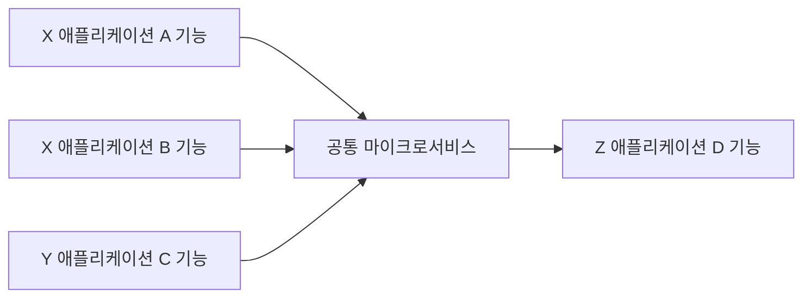
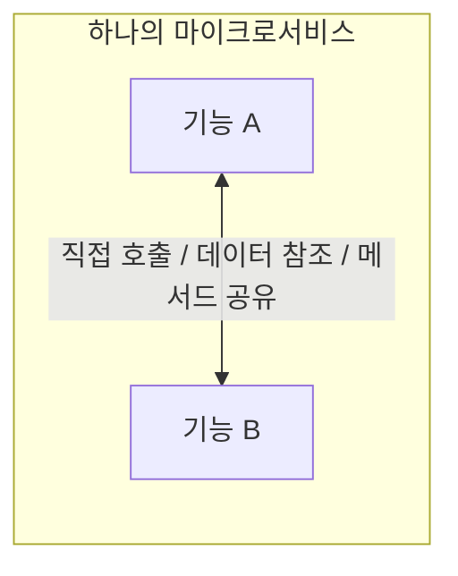
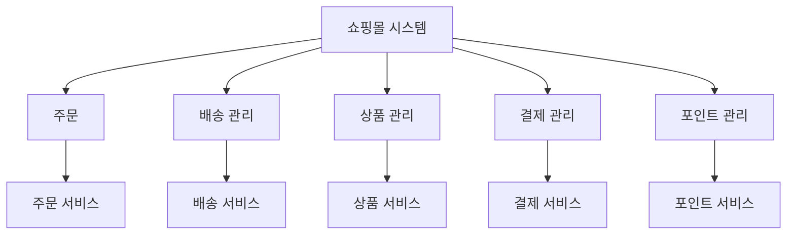
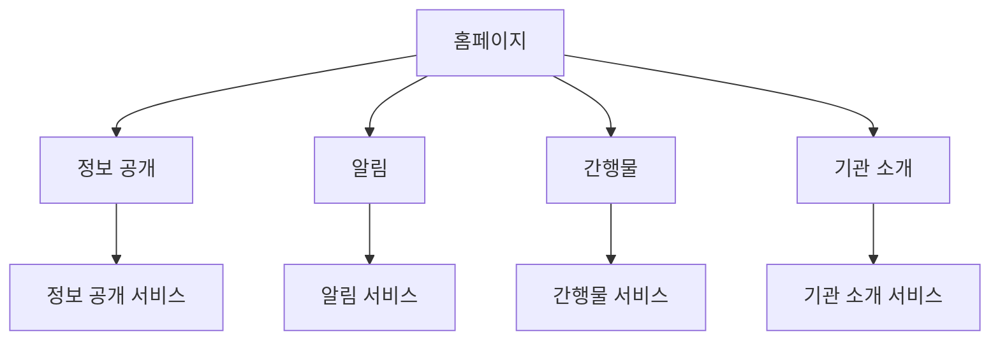
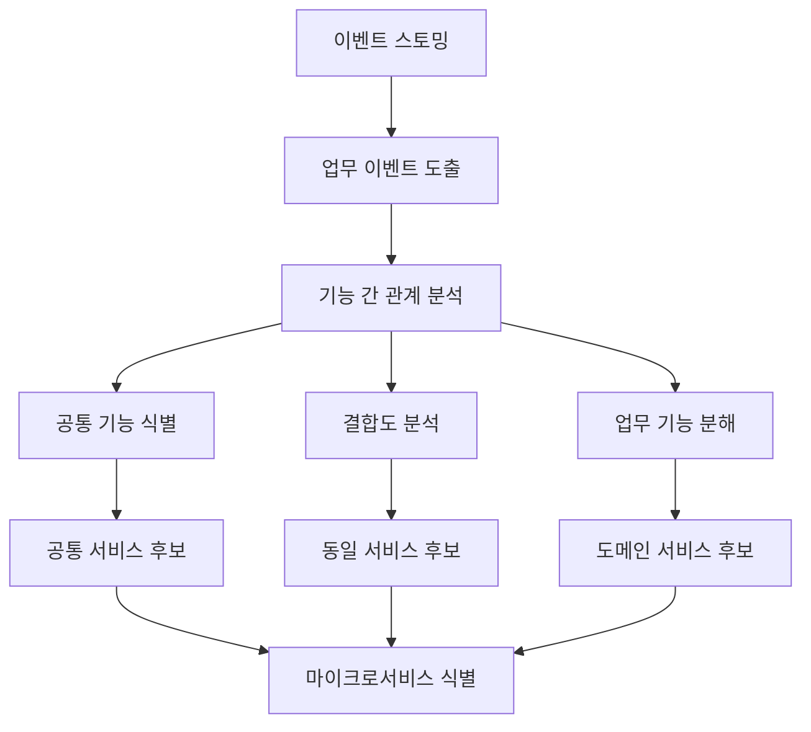

# 이벤트 스토밍, MSA 식별 모델

# 이벤트 스토밍, MSA 식별 모델
* toc
{:toc}

---

## 이벤트 스토밍과 MSA 식별 모델

마이크로서비스를 도출할 때는 단순히 기능 목록을 보고 서비스를 나누면 안 된다.
기능 단위로만 서비스를 분리하면 공통 기능이 중복되거나, 서비스 간 호출이 과도하게 증가할 수 있다.

그래서 마이크로서비스를 식별할 때는
업무 흐름, 데이터 관계, 기능 간 응집도, 변경 가능성을 함께 고려해야 한다.

이 과정에서 활용할 수 있는 대표적인 방법이 **이벤트 스토밍(Event Storming)**과 **MSA 식별 모델**이다.

---

## 이벤트 스토밍이란?

이벤트 스토밍은 도메인에서 발생하는 주요 사건을 중심으로
비즈니스 흐름을 시각적으로 정리하는 방법이다.

여기서 이벤트는 다음과 같은 형태로 표현할 수 있다.

* 주문이 생성됨
* 결제가 완료됨
* 배송이 시작됨
* 회원이 가입됨
* 게시글이 등록됨

즉, 이벤트 스토밍은
“시스템에서 어떤 일이 발생하는가?”를 기준으로 도메인을 분석하는 방식이다.

---

## 이벤트 스토밍이 필요한 이유

마이크로서비스는 기술 기준이 아니라
비즈니스 기준으로 나누어야 한다.

이벤트 스토밍을 사용하면 다음을 파악할 수 있다.

* 업무 흐름
* 이벤트 발생 순서
* 기능 간 관계
* 데이터의 소유 주체
* 서비스 경계 후보

결국 이벤트 스토밍은
마이크로서비스를 도출하기 위한 사전 분석 과정이라고 볼 수 있다.

---

## 공통 기능 분리

마이크로서비스를 도출할 때 먼저 고려할 수 있는 방식은
여러 업무 영역에서 공통으로 사용하는 기능을 분리하는 것이다.

예를 들어 여러 애플리케이션에서 공통으로 사용하는 기능이 있다면
이를 별도의 공통 서비스로 분리할 수 있다.

공통 기능을 서비스로 분리하면 코드 중복을 줄일 수 있다.
다만 공통 서비스의 범위가 너무 커지면 오히려 의존성이 집중될 수 있으므로 주의해야 한다.

---

## 기능 결합도 기준 도출

서비스를 나눌 때는 기능 간 결합도를 반드시 고려해야 한다.

강하게 결합된 기능은 하나의 서비스 내부에 두는 것이 좋고,
느슨하게 결합된 기능은 별도 서비스로 분리할 수 있다.

강의 자료에서도 응집도, 결합도, 데이터 관계가 깊은 기능은 하나의 마이크로서비스 내부에 두는 방식이 설명된다.

이 기준은 매우 중요하다.
무리하게 서비스를 분리하면 네트워크 호출이 증가하고, 트랜잭션 관리가 어려워지며, 장애 추적도 복잡해진다.

---

## 업무 기능 분해를 통한 서비스 도출

MSA 식별 모델에서는 업무 기능을 단계적으로 분해한 뒤
최종적으로 마이크로서비스 후보를 도출한다.

예를 들어 쇼핑몰 시스템이라면 다음과 같이 나눌 수 있다.

이 방식은 전체 업무를 큰 단위에서 작은 단위로 분해하고,
각 기능의 책임과 데이터 소유 범위를 기준으로 서비스를 식별하는 방식이다.

---

## 홈페이지 서비스 예시

홈페이지 시스템도 동일한 방식으로 분리할 수 있다.

이처럼 도메인 기능을 분석하면
각 업무 영역이 어떤 서비스로 분리될 수 있는지 명확하게 볼 수 있다.

---

## MSA 식별 시 주의할 점

마이크로서비스를 식별할 때는 다음 기준을 함께 고려해야 한다.

### 공통 기능은 분리하되 과도하게 비대해지지 않게 한다

공통 기능을 별도 서비스로 분리하면 중복을 줄일 수 있다.
하지만 공통 서비스가 너무 많은 책임을 가지면 모든 서비스가 해당 서비스에 의존하게 된다.

---

### 결합도가 높은 기능은 같은 서비스에 둔다

서로 자주 호출하거나 같은 데이터를 강하게 공유하는 기능은
같은 마이크로서비스 내부에 두는 것이 좋다.

---

### 업무 책임이 다른 기능은 분리한다

주문, 결제, 배송처럼 책임이 명확히 다른 기능은
각각 독립적인 서비스로 분리하는 것이 자연스럽다.

---

### 데이터 소유권을 명확히 한다

MSA에서는 각 서비스가 자신의 데이터를 소유하는 것이 중요하다.
여러 서비스가 하나의 DB 테이블을 직접 공유하면 서비스 간 결합도가 높아진다.

---

## 이벤트 스토밍과 MSA 식별 흐름

전체 흐름을 정리하면 다음과 같다.

---

## 정리

이벤트 스토밍과 MSA 식별 모델은
마이크로서비스를 감으로 나누지 않기 위한 분석 방법이다.

서비스를 잘 나누려면 단순히 기능 개수만 보면 안 된다.
업무 흐름, 이벤트, 데이터 관계, 기능 간 결합도, 공통 기능 여부를 함께 봐야 한다.

---

### 한 줄 요약

이벤트 스토밍과 MSA 식별 모델은
업무 이벤트와 기능 관계를 분석하여
공통 기능은 분리하고, 결합도가 높은 기능은 묶으며,
독립적인 업무 영역을 마이크로서비스로 도출하는 방법이다.

