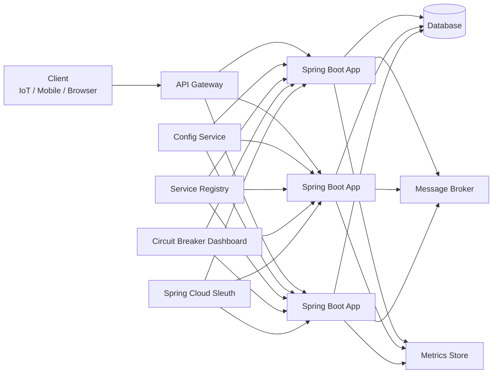
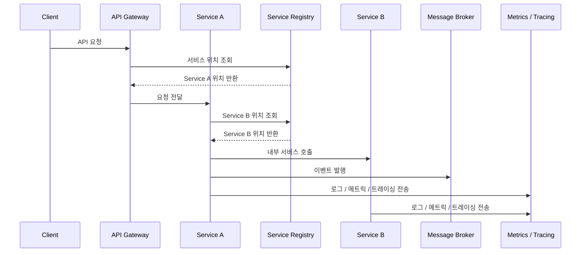

# 스프링 클라우드 기반 마이크로서비스 아키텍처

# 스프링 클라우드 기반 마이크로서비스 아키텍처
* toc
{:toc}

---

## 스프링 클라우드 기반 마이크로서비스 아키텍처

스프링 클라우드는 Spring Boot 기반 애플리케이션을 마이크로서비스 구조로 구성할 때 필요한 여러 기능을 제공한다.

마이크로서비스는 하나의 큰 시스템을 여러 개의 작은 서비스로 나누어 개발하고 운영하는 방식이다.
하지만 서비스를 나누기만 하면 끝나는 것이 아니다.

서비스가 많아지면 다음과 같은 문제가 생긴다.

* 외부 요청을 어디서 받을 것인가
* 서비스 위치를 어떻게 찾을 것인가
* 설정 정보를 어떻게 관리할 것인가
* 장애가 발생했을 때 어떻게 격리할 것인가
* 서비스 간 호출 흐름을 어떻게 추적할 것인가

스프링 클라우드는 이런 문제들을 해결하기 위한 도구들을 제공한다.

---

## 스프링 클라우드 기반 MSA 구조

강의 자료에서는 하나의 시스템을 여러 시스템으로 나누고, 서로 데이터를 공유하며 통신할 수 있는 구조를 Spring Cloud 기반 Service Mesh 구현으로 설명한다.

전체 구조를 단순화하면 다음과 같다.



---

## 주요 구성 요소

### API Gateway

API Gateway는 클라이언트 요청이 처음 들어오는 진입점이다.

클라이언트가 각각의 마이크로서비스 주소를 직접 알 필요 없이,
Gateway 하나만 바라보도록 구성할 수 있다.

주요 역할은 다음과 같다.

* 요청 라우팅
* 인증 및 인가
* 공통 필터 처리
* 서비스별 요청 분기

---

### Spring Boot Apps

각 마이크로서비스는 독립적인 Spring Boot 애플리케이션으로 구성된다.

예를 들어 쇼핑몰 시스템이라면 다음과 같이 나눌 수 있다.

* 회원 서비스
* 주문 서비스
* 결제 서비스
* 배송 서비스
* 상품 서비스

각 서비스는 독립적으로 개발, 배포, 확장될 수 있다.

---

### Config Service

Config Service는 설정 정보를 외부에서 관리하는 역할을 한다.

MSA 환경에서는 서비스 개수가 많기 때문에
각 서비스마다 설정 파일을 직접 관리하면 운영이 복잡해진다.

Config Service를 사용하면 다음과 같은 장점이 있다.

* 환경별 설정 통합 관리
* 설정 변경 이력 관리
* 서비스별 설정 분리
* 운영 환경 설정 중앙화

---

### Service Registry

Service Registry는 서비스의 위치를 등록하고 조회하는 역할을 한다.

MSA에서는 서비스 인스턴스가 동적으로 생성되고 사라질 수 있다.
따라서 고정 IP나 고정 주소에 의존하기 어렵다.

Service Registry를 사용하면 각 서비스는 자신의 위치를 등록하고,
다른 서비스는 이름 기반으로 해당 서비스를 찾을 수 있다.

---

### Circuit Breaker

Circuit Breaker는 장애 전파를 막기 위한 패턴이다.

예를 들어 주문 서비스가 결제 서비스를 호출한다고 가정해보자.
결제 서비스가 장애 상태인데도 주문 서비스가 계속 호출을 시도하면
주문 서비스까지 느려지거나 장애가 발생할 수 있다.

Circuit Breaker는 이런 상황에서 호출을 차단하고,
전체 시스템 장애로 번지는 것을 막는다.

---

### Spring Cloud Sleuth

Spring Cloud Sleuth는 분산 추적을 위한 도구이다.

MSA 환경에서는 하나의 요청이 여러 서비스를 거쳐 처리된다.

예를 들어:

```text
Client → API Gateway → 주문 서비스 → 결제 서비스 → 배송 서비스
```

이때 장애가 발생하면 어느 구간에서 문제가 발생했는지 추적하기 어렵다.
Sleuth는 요청마다 추적 ID를 부여하여 서비스 간 호출 흐름을 추적할 수 있게 해준다.

---

### Database

각 서비스는 필요한 데이터를 저장하기 위해 데이터베이스를 사용한다.

MSA에서는 가능하면 서비스별로 데이터 소유권을 분리하는 것이 좋다.
하나의 공통 DB를 여러 서비스가 직접 공유하면 서비스 간 결합도가 높아질 수 있다.

---

### Message Broker

Message Broker는 서비스 간 비동기 통신을 담당한다.

예를 들어 결제 완료 후 배송 준비 이벤트를 발행하면,
배송 서비스는 해당 이벤트를 구독하여 후속 처리를 할 수 있다.

이를 통해 서비스 간 직접 호출을 줄이고,
느슨한 결합 구조를 만들 수 있다.

---

### Metrics Store

Metrics Store는 시스템의 상태 정보를 저장하는 역할을 한다.

수집할 수 있는 정보는 다음과 같다.

* 요청 수
* 응답 시간
* 에러율
* CPU / Memory 사용량
* 서비스별 처리량

이 데이터는 모니터링과 장애 대응에 활용된다.

---

## 스프링 클라우드 기반 MSA 요청 흐름



---

## 스프링 클라우드를 사용하는 이유

스프링 클라우드는 마이크로서비스 운영에 필요한 공통 기능을 쉽게 구성할 수 있도록 도와준다.

정리하면 다음과 같다.

* API Gateway를 통한 요청 진입점 구성
* Config Service를 통한 설정 중앙 관리
* Service Registry를 통한 서비스 탐색
* Circuit Breaker를 통한 장애 전파 방지
* Sleuth를 통한 분산 추적
* Message Broker를 통한 비동기 통신
* Metrics 기반 모니터링

---

## 정리

스프링 클라우드 기반 마이크로서비스 아키텍처는
여러 개의 Spring Boot 애플리케이션을 독립적으로 운영하면서도,
Gateway, Config, Discovery, Circuit Breaker, Sleuth 등을 통해
서비스 간 통신과 운영 복잡도를 관리하는 구조이다.

---

### 한 줄 요약

스프링 클라우드는 Spring Boot 기반 마이크로서비스들이
서로 독립적으로 동작하면서도 안정적으로 통신하고 운영될 수 있도록
API Gateway, Config Service, Service Registry, Circuit Breaker, Sleuth 같은 핵심 기능을 제공하는 MSA 지원 프레임워크이다.


