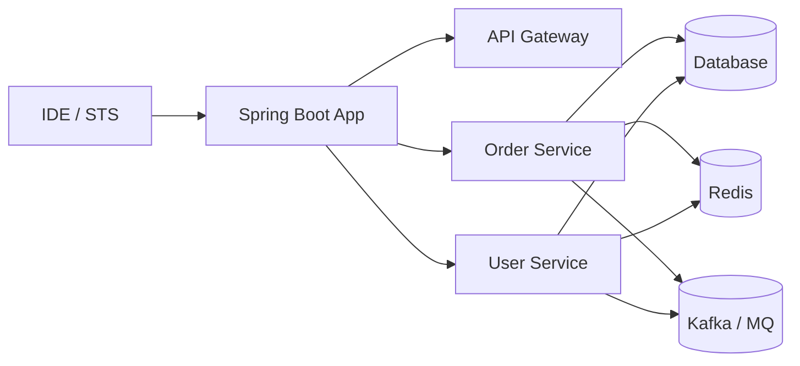
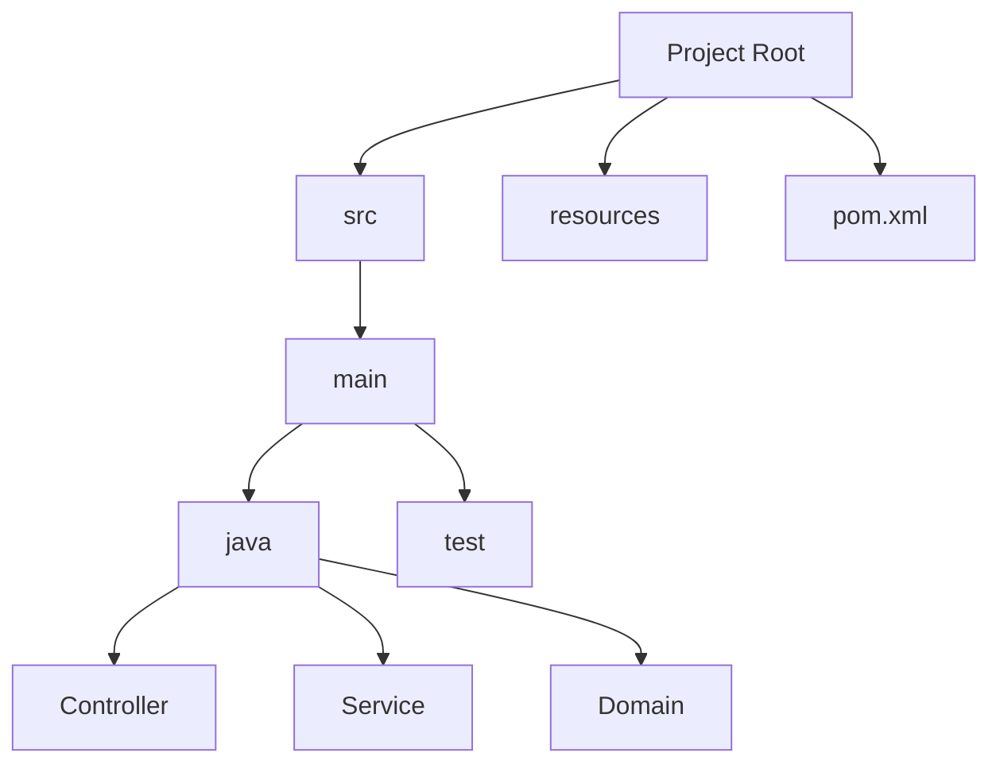
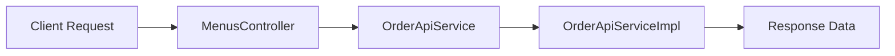

# MSA 개발 환경 준비

# MSA 개발 환경 준비
* toc
{:toc}

---

## MSA 개발 환경 준비

마이크로서비스 아키텍처를 실제로 개발하려면
단순히 코드만 작성하는 것이 아니라 개발 환경 자체를 먼저 준비해야 한다.

MSA 환경은 일반적인 단일 애플리케이션 개발보다 훨씬 많은 리소스를 사용한다.
여러 개의 서비스, 컨테이너, 데이터베이스, 메시지 브로커 등을 동시에 실행해야 하기 때문이다.

강의 자료에서도 MSA 실습을 위한 개발 환경 구성과 Spring Boot 기반 프로젝트 생성 과정을 설명하고 있다.

---

## MSA 개발 환경이 중요한 이유

모놀리식 환경에서는 하나의 애플리케이션만 실행하면 되지만,
MSA 환경에서는 여러 서비스가 동시에 실행된다.

예를 들어 다음과 같은 구성만으로도 상당한 리소스가 필요하다.

* API Gateway
* 주문 서비스
* 회원 서비스
* 결제 서비스
* DB
* Redis
* Kafka
* Monitoring 시스템

즉,

> MSA는 개발 환경 자체도 “분산 환경”으로 준비해야 한다

---

## MSA 개발 환경 구성

전체 개발 환경 흐름은 다음과 같이 구성할 수 있다.



---

## 개발 환경 필수 사양

강의 자료에서는 다음과 같은 환경을 권장한다.

---

### 운영체제

* Windows 10 이상
* MacOS Big Sur 이상

---

### 메모리

* 최소 16GB RAM 이상

---

### 왜 높은 사양이 필요한가?

MSA 개발 환경에서는:

* 여러 Spring Boot 애플리케이션 실행
* Docker 컨테이너 실행
* Kubernetes 실행 가능성
* Redis / Kafka / DB 동시 실행

등으로 인해 메모리 사용량이 빠르게 증가한다.

특히 Docker Desktop과 Kubernetes를 함께 실행하면
8GB 메모리 환경에서는 상당히 느려질 수 있다.

---

## IDE 및 개발 도구

강의 자료에서는 STS(Spring Tool Suite)를 사용하여 개발 환경을 구성한다.

---

### 주요 개발 도구

| 도구                | 역할             |
| ----------------- | -------------- |
| STS / IntelliJ    | Spring Boot 개발 |
| Spring Initializr | 프로젝트 생성        |
| Maven / Gradle    | 의존성 관리         |
| Git               | 형상 관리          |
| Docker            | 컨테이너 실행        |

---

## Spring Initializr를 통한 프로젝트 생성

Spring Boot 프로젝트는 일반적으로 Spring Initializr를 통해 생성한다.

강의 자료에서도 다음과 같은 설정 예시를 확인할 수 있다.

```text
Group: orderservice.msa.sample
Artifact: Menus
Java Version: 17
Packaging: Jar
Build Tool: Maven
```

---

## Spring Boot 프로젝트 구조

생성된 프로젝트는 일반적으로 다음과 같은 구조를 가진다.



---

## 의존성(Dependency) 구성

MSA 기반 Spring Boot 프로젝트에서는 여러 의존성을 추가하게 된다.

강의 자료에서는 다음과 같은 의존성 예시를 보여준다.

---

### Spring Web

REST API 개발을 위한 핵심 의존성이다.

```xml
<dependency>
    <groupId>org.springframework.boot</groupId>
    <artifactId>spring-boot-starter-web</artifactId>
</dependency>
```

---

### Logging 설정

기본 로깅 의존성을 제외하고 원하는 로깅 프레임워크를 사용할 수 있다.

---

### JUnit 테스트 의존성

테스트 환경 구성을 위해 사용된다.

---

## 기본 서비스 구조

강의 자료에서는 간단한 주문 조회 예제를 통해
MSA 서비스 구조를 설명한다.

구조는 다음과 같다.



---

## Controller 역할

Controller는 외부 요청을 받는 진입점이다.

예시 코드에서는 다음과 같은 역할을 수행한다.

* URL 매핑
* Path Variable 처리
* Service 호출
* 응답 반환

---

## Service 역할

Service 계층은 실제 비즈니스 로직을 처리한다.

예시에서는 주문 ID를 기반으로 주문 정보를 조회하는 역할을 수행한다.

---

## application.yml 설정

강의 자료 화면에서는 `application.yml`을 통해
포트와 서비스 이름을 설정하는 예시도 확인할 수 있다.

예시:

```yaml
server:
  port: 8081

spring:
  application:
    name: catalog
```

---

## 실행 결과

실행 후 다음과 같은 REST API 형태로 호출할 수 있다.

```text
GET /menus/menuinfo/1234
```

응답 예시:

```text
[Order id = 1234 at 1737994846805 1234]
```

이는 간단한 구조이지만
MSA 환경에서 하나의 독립 서비스가 어떻게 구성되는지를 보여주는 기본 예제이다.

---

## MSA 개발 환경의 핵심 포인트

MSA 개발 환경은 단순히 “프로젝트 하나 실행”이 아니다.

다음 요소를 함께 고려해야 한다.

* 여러 서비스 실행
* 서비스 간 통신
* 컨테이너 환경
* API 기반 구조
* 설정 관리
* 로그 및 모니터링

즉,

> 개발 환경 자체가 작은 클라우드 환경처럼 구성된다

---

## 정리

MSA 개발 환경 준비는 단순 설치 작업이 아니라
여러 마이크로서비스를 독립적으로 개발하고 운영하기 위한 기반을 구성하는 과정이다.

Spring Boot, STS, Spring Initializr, Maven, Docker 등을 활용하여
서비스별 독립 실행 환경을 구성하고,
REST API 기반 구조로 서비스를 개발할 수 있다.

---

### 한 줄 요약

MSA 개발 환경은
Spring Boot 기반의 독립 서비스들을 개발하고 실행하기 위해
충분한 시스템 자원과 IDE, 의존성 관리 도구, REST API 구조, 컨테이너 환경 등을 함께 구성하는 과정이다.

