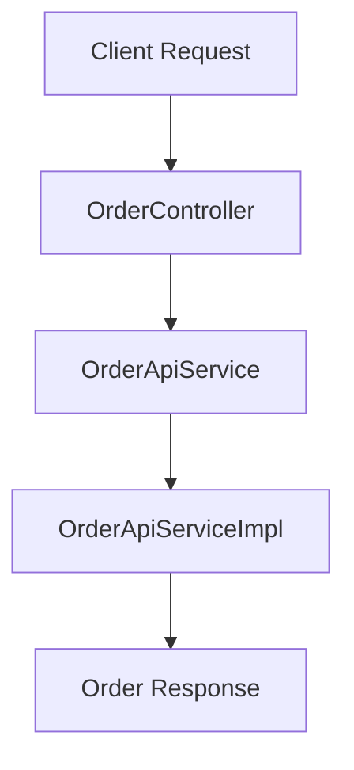
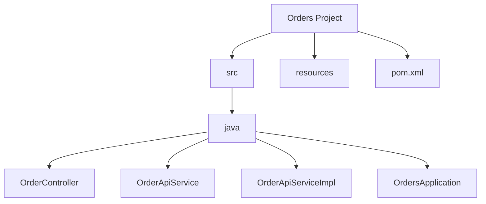
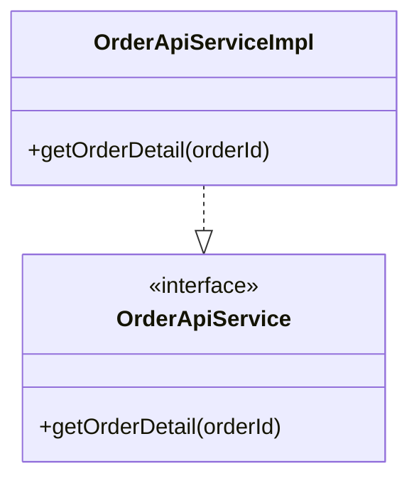
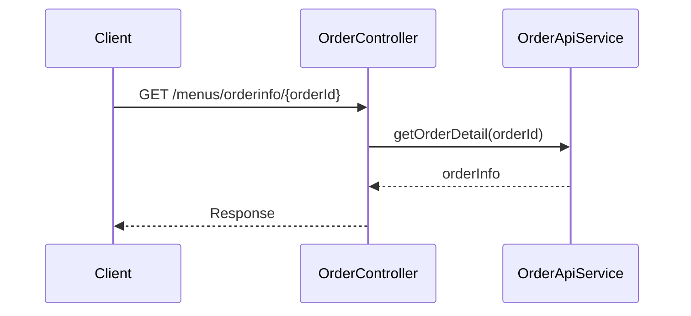
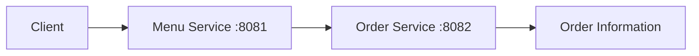

# MSA 개발 주문 기능

# MSA 개발 주문 기능

* toc
{:toc}

---

## MSA 기반 주문 기능 개발

마이크로서비스 아키텍처를 이해했다면,
이제 실제로 하나의 독립적인 서비스를 어떻게 구현하는지 살펴볼 필요가 있다.

이번 예제에서는 주문 기능(Order Service)을 별도의 Spring Boot 애플리케이션으로 구성하여
MSA 환경에서 하나의 독립 서비스가 어떻게 만들어지는지 확인할 수 있다.

강의 자료에서는 `Orders` 프로젝트를 생성하고,
Controller와 Service를 기반으로 주문 조회 API를 구현하는 과정을 설명한다.

---

## 주문 서비스 구조

주문 서비스는 다음과 같은 계층 구조로 구성된다.



이 구조는 Spring Boot 기반 REST API 서비스의 가장 기본적인 형태이다.

---

## 주문 서비스 프로젝트 생성

강의 자료에서는 Spring Initializr를 통해
`Orders` 프로젝트를 생성하는 예시를 보여준다.

주요 설정은 다음과 같다.

```text id="tq1imc"
Group: orderservice.msa.sample
Artifact: Orders
Packaging: Jar
Java Version: 17
Build Tool: Maven
```

---

## 프로젝트 구조

생성된 프로젝트는 일반적으로 다음과 같은 구조를 가진다.



---

## 의존성 구성

주문 서비스는 REST API 기반으로 동작하기 때문에
기본적으로 Web 의존성이 필요하다.

강의 자료에서도 다음과 같은 의존성 구성을 확인할 수 있다.

---

### Spring Web 의존성

```xml id="ibwtlb"
<dependency>
    <groupId>org.springframework.boot</groupId>
    <artifactId>spring-boot-starter-web</artifactId>
</dependency>
```

REST API 개발을 위한 핵심 의존성이다.

---

### Test 의존성

```xml id="dh6qjt"
<dependency>
    <groupId>org.springframework.boot</groupId>
    <artifactId>spring-boot-starter-test</artifactId>
</dependency>
```

테스트 환경 구성을 위한 의존성이다.

---

## application.yml 설정

주문 서비스는 별도의 포트를 사용하여 실행된다.

강의 자료에서는 다음과 같은 설정 예시를 제공한다.

```yaml id="x22zpr"
server:
  port: 8082

spring:
  application:
    name: order
```

---

### 왜 포트를 분리하는가?

MSA에서는 여러 서비스가 동시에 실행된다.

예를 들어:

* Menu Service → 8081
* Order Service → 8082
* User Service → 8083

각 서비스는 독립 프로세스로 실행되기 때문에
서로 다른 포트를 사용해야 한다.

---

## OrderApiService 인터페이스

주문 조회 기능을 담당하는 인터페이스이다.

강의 자료에서는 다음과 같이 정의한다.

```java id="qlj5yz"
public interface OrderApiService {
    String getOrderDetail(String orderId);
}
```

---

### 인터페이스를 사용하는 이유

인터페이스를 사용하면:

* 구현체 교체 가능
* 테스트 용이
* 확장성 향상

즉, 구현과 역할을 분리할 수 있다.

---

## OrderApiServiceImpl 구현체

실제 비즈니스 로직을 처리하는 클래스이다.

강의 자료에서는 간단하게 주문 ID를 반환하는 예제로 구성되어 있다.



---

## OrderController

Controller는 외부 요청을 처리하는 진입점이다.

강의 자료의 구조를 보면 다음 흐름으로 동작한다.



---

## API 요청 구조

예시 API는 다음과 같은 형태로 호출된다.

```text id="0h74jl"
GET /menus/orderinfo/200
```

---

## 응답 결과

강의 자료 실행 화면에서는 다음과 같은 결과를 확인할 수 있다.

```text id="61d7zv"
[Order id = 200 at 1738067216020 200]
```

여기서 포함되는 값은 다음과 같다.

* 주문 ID
* 현재 시간(System.currentTimeMillis)
* 주문 정보

---

## OrdersApplication

Spring Boot 애플리케이션의 시작점이다.

강의 자료에서는 `@SpringBootApplication`과 `@ComponentScan`을 사용하여
패키지 스캔 범위를 지정하는 구조를 보여준다.

```java id="r9e8hu"
@SpringBootApplication
@ComponentScan("orderservice.*")
public class OrdersApplication {
    public static void main(String[] args) {
        SpringApplication.run(OrdersApplication.class, args);
    }
}
```

---

## MSA 관점에서 중요한 부분

이 예제는 단순한 주문 조회 기능처럼 보이지만
MSA 관점에서는 중요한 의미를 가진다.

---

### 독립 실행 가능

주문 서비스는 하나의 독립적인 Spring Boot 애플리케이션이다.

즉:

* 단독 실행 가능
* 단독 배포 가능
* 단독 확장 가능

---

### API 기반 통신

다른 서비스와 직접 메서드를 호출하지 않고
REST API 기반으로 통신한다.

---

### 서비스 분리 구조

메뉴 서비스와 주문 서비스가 서로 다른 프로젝트로 분리되어 있다.

이는 MSA의 핵심 특징 중 하나이다.

---

## Menu Service와 Order Service 관계

전체 흐름을 단순화하면 다음과 같다.



이 구조는 이후 API Gateway, Service Discovery, Config Server 등이 추가되면서
더 큰 MSA 구조로 확장될 수 있다.

---

## 정리

MSA 기반 주문 기능 개발은
Spring Boot 애플리케이션을 독립 서비스로 구성하고,
REST API를 통해 외부 요청을 처리하는 기본적인 마이크로서비스 구조를 구현하는 과정이다.

---

### 한 줄 요약

MSA 기반 주문 기능은
Spring Boot 기반 독립 서비스로 구성되며,
Controller → Service 구조와 REST API를 통해
독립 실행 및 서비스 간 통신이 가능한 마이크로서비스 형태로 구현된다.

